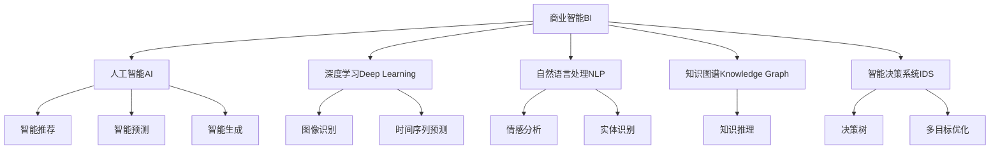

                 

# AI在商业智能分析中的作用

## 1. 背景介绍

### 1.1 问题由来

在当今数据驱动的商业环境中，企业决策者面临着前所未有的挑战。如何快速、准确地从大量数据中提取有价值的商业洞见，以指导业务决策，成为了企业信息化的核心需求。然而，传统的商业智能(BI)分析方式，如多维分析、报表展示等，往往依赖于人力手工分析，效率低下，准确性有待提升。

随着人工智能(AI)技术的不断发展，尤其是深度学习、自然语言处理(NLP)、知识图谱等领域的突破，基于AI的商业智能分析(AI-driven Business Intelligence, AI BI)正在成为新的研究热点和应用方向。AI BI通过引入先进的算法和模型，自动地从大数据中挖掘出蕴含的商业价值，大大提升了数据洞察的速度和精度，为企业的智能化转型提供了新动能。

### 1.2 问题核心关键点

AI BI的核心关键点在于如何高效地利用数据，结合智能算法，挖掘商业洞见，并指导企业决策。其应用范围广泛，覆盖了数据预处理、特征工程、模型训练、结果解读等多个环节。以下我们将从这些关键点出发，深入探讨AI BI的原理与实践。

## 2. 核心概念与联系

### 2.1 核心概念概述

为更好地理解AI BI的内涵与实现机制，本节将介绍几个关键概念：

- **商业智能(BI)：** 利用数据仓库技术、OLAP工具、数据挖掘、数据可视化等方法，从数据中提取出有用信息，帮助决策者制定策略的数据处理方法。
- **人工智能(AI)：** 利用计算机技术模拟人类智能行为，包括感知、学习、推理、规划、自然语言处理等能力，通过算法和模型实现智能应用。
- **深度学习(Deep Learning)：** 一种基于多层神经网络的机器学习技术，能够自动从数据中学习复杂特征，适用于各种数据处理和模式识别任务。
- **自然语言处理(NLP)：** 涉及计算机对人类语言进行理解、生成、翻译等处理的技术，能够有效解析和处理非结构化数据。
- **知识图谱(Knowledge Graph)：** 利用图结构表示实体之间的关系，便于机器进行推理和挖掘。
- **智能决策系统(IDS)：** 融合AI技术与决策科学，自动化的辅助决策支持系统，提升决策过程的科学性和智能化水平。

这些核心概念之间的逻辑关系可以通过以下Mermaid流程图来展示：



这个流程图展示了许多与商业智能相关的AI技术：

1. **深度学习**用于图像识别和序列预测等任务。
2. **自然语言处理**用于情感分析和实体识别等任务。
3. **知识图谱**用于知识推理和实体关系挖掘等任务。
4. **智能决策系统**综合了AI技术与决策科学，用于更高级的决策支持。

AI BI融合了这些技术，实现数据自动化的分析和决策支持。

## 3. 核心算法原理 & 具体操作步骤
### 3.1 算法原理概述

AI BI的算法原理主要基于数据预处理、特征工程、模型训练和结果解读四个环节，以实现自动化的商业智能分析。其核心算法包括：

- **数据预处理：** 包括数据清洗、数据转换、缺失值填充等步骤，确保数据质量。
- **特征工程：** 设计、选择和提取对目标任务有用的特征，构建输入向量的表示形式。
- **模型训练：** 使用深度学习、机器学习等算法对特征数据进行训练，获得用于预测或分类的模型。
- **结果解读：** 对模型输出结果进行解释和展示，辅助决策者理解分析结果。

### 3.2 算法步骤详解

AI BI的实现过程主要分为以下几个步骤：

**Step 1: 数据收集与预处理**
- 收集企业内部的各类业务数据，如销售数据、客户数据、财务数据等。
- 进行数据清洗和预处理，去除噪声和异常值，补全缺失值。
- 对数据进行格式转换，如日期时间标准化，文本数据编码等。

**Step 2: 特征工程**
- 根据业务需求，设计、选择和提取对目标任务有用的特征。
- 对文本数据进行向量化处理，如TF-IDF、Word2Vec等方法。
- 对数值数据进行归一化、标准化等预处理，确保数据一致性。

**Step 3: 模型训练**
- 选择适合的AI算法，如深度学习、随机森林、梯度提升等。
- 设计合适的模型结构和超参数，进行模型训练。
- 使用交叉验证等方法评估模型性能，避免过拟合。

**Step 4: 结果解读**
- 对模型输出结果进行解释和展示，如可视化图表、报告等。
- 对模型进行可视化分析，如业务逻辑图、决策树等。
- 提供业务洞见和决策建议，辅助决策者制定策略。

### 3.3 算法优缺点

AI BI的算法具有以下优点：
1. 自动化高效：通过引入AI技术，自动地从数据中挖掘商业洞见，提升了分析效率。
2. 精度高：AI算法能够处理复杂的数据模式，提供更准确、可靠的洞察。
3. 可解释性强：通过可视化工具，模型输出的决策过程更加透明，便于理解和调试。
4. 适应性强：AI算法能够处理多种类型的数据，包括结构化、半结构化、非结构化数据。

同时，AI BI也存在一些局限：
1. 数据质量依赖性高：AI BI的效果很大程度上依赖于数据的质量，数据不准确会影响分析结果。
2. 算法复杂度高：一些高级AI算法如深度学习，需要较长的训练时间和大量计算资源。
3. 模型黑箱问题：部分AI模型如深度神经网络，存在解释性不足的问题，难以理解其内部机制。
4. 领域依赖性：AI BI的性能很大程度上取决于数据的领域特性，需要根据业务场景进行模型适配。

尽管存在这些局限，AI BI的自动分析能力在数据驱动的商业决策中发挥着重要作用，为企业的智能化转型提供了有力的支持。

### 3.4 算法应用领域

AI BI在多个业务场景中都有广泛的应用，例如：

- **销售分析：** 通过对历史销售数据进行分析，预测未来销售趋势，指导营销策略。
- **客户细分：** 根据客户行为数据进行聚类分析，识别不同类型客户，制定个性化营销方案。
- **财务分析：** 利用财务数据进行预测和风险管理，优化资金使用效率。
- **运营优化：** 对生产、物流、供应链等运营数据进行分析，提升运营效率和资源利用率。
- **市场洞察：** 对市场数据进行分析，了解市场变化趋势，指导市场策略。

除了这些传统领域，AI BI还在新兴领域如金融科技、智慧城市等得到广泛应用，推动了这些领域的技术创新和产业升级。

## 4. 数学模型和公式 & 详细讲解 & 举例说明

### 4.1 数学模型构建

AI BI中常见的数学模型包括线性回归、逻辑回归、决策树、随机森林、深度神经网络等。以下以线性回归模型为例，介绍其构建过程。

假设数据集 $D=\{(x_i, y_i)\}_{i=1}^N$，其中 $x_i$ 为输入特征， $y_i$ 为目标变量。线性回归模型的目标是找到最优的权重 $\theta = (w_0, w_1, ..., w_n)$，使得模型 $y = w_0 + w_1x_1 + ... + w_nx_n$ 最小化预测误差。

使用最小二乘法，我们构造误差函数 $J(\theta) = \frac{1}{2N}\sum_{i=1}^N (y_i - w_0 - \sum_{j=1}^n w_j x_{ij})^2$，其中 $x_{ij}$ 表示第 $i$ 个样本的第 $j$ 个特征。通过梯度下降等优化算法，求解误差函数的最小值。

### 4.2 公式推导过程

推导误差函数和梯度下降算法的具体过程如下：

首先，对 $J(\theta)$ 关于 $\theta$ 求偏导数，得：

$$
\frac{\partial J(\theta)}{\partial \theta} = \frac{1}{N} \sum_{i=1}^N (y_i - w_0 - \sum_{j=1}^n w_j x_{ij})
$$

然后，使用梯度下降法更新权重：

$$
\theta \leftarrow \theta - \eta \nabla_{\theta}J(\theta)
$$

其中 $\eta$ 为学习率，控制每次更新的大小。通过不断迭代更新，直至误差函数收敛，得到最优权重。

### 4.3 案例分析与讲解

**案例：销售预测分析**

假设某电商公司有历史销售数据，包含时间、产品类别、促销活动等信息。通过AI BI，我们可以使用时间序列预测模型，对未来的销售量进行预测，以便合理备货、安排促销活动。

具体步骤如下：

1. 收集销售数据，提取时间、产品类别、促销活动等信息作为特征。
2. 对时间序列数据进行预处理，如差分、归一化等。
3. 设计并训练时间序列预测模型，如ARIMA、LSTM等。
4. 使用模型对未来销售量进行预测，生成预测结果。
5. 对预测结果进行可视化展示，如趋势图、误差分布图等。
6. 根据预测结果，调整库存和促销策略。

## 5. 项目实践：代码实例和详细解释说明
### 5.1 开发环境搭建

在进行AI BI项目开发前，我们需要准备好开发环境。以下是使用Python进行TensorFlow开发的环境配置流程：

1. 安装Anaconda：从官网下载并安装Anaconda，用于创建独立的Python环境。

2. 创建并激活虚拟环境：
```bash
conda create -n tf-env python=3.8 
conda activate tf-env
```

3. 安装TensorFlow：根据CUDA版本，从官网获取对应的安装命令。例如：
```bash
pip install tensorflow
```

4. 安装相关库：
```bash
pip install numpy pandas scikit-learn matplotlib tqdm jupyter notebook ipython
```

完成上述步骤后，即可在`tf-env`环境中开始AI BI项目开发。

### 5.2 源代码详细实现

以下是一个简单的AI BI项目示例，用于基于深度学习模型进行销售预测分析。

```python
import tensorflow as tf
from tensorflow.keras import layers, models
import pandas as pd
import numpy as np
from sklearn.model_selection import train_test_split

# 加载数据
data = pd.read_csv('sales_data.csv')
# 预处理数据
X = data[['time', 'product_category', 'promotion']]
y = data['sales']
X_train, X_test, y_train, y_test = train_test_split(X, y, test_size=0.2, random_state=42)

# 定义模型
model = models.Sequential([
    layers.Dense(64, activation='relu', input_shape=(X_train.shape[1],)),
    layers.Dense(64, activation='relu'),
    layers.Dense(1)
])

# 编译模型
model.compile(optimizer='adam', loss='mse', metrics=['mae'])

# 训练模型
model.fit(X_train, y_train, epochs=10, batch_size=32, validation_split=0.2)

# 预测测试集
y_pred = model.predict(X_test)
```

### 5.3 代码解读与分析

让我们再详细解读一下关键代码的实现细节：

**数据加载与预处理**

- 使用pandas库加载历史销售数据，提取时间、产品类别、促销活动等信息作为特征。
- 对时间序列数据进行预处理，如差分、归一化等，确保数据一致性。

**模型定义**

- 使用Keras库定义深度神经网络模型，包含多个隐藏层和输出层。
- 使用ReLU作为激活函数，Adam优化器，均方误差作为损失函数。

**模型训练**

- 使用fit方法对模型进行训练，设定训练轮数和批次大小。
- 使用validation_split参数进行交叉验证，评估模型性能。

**结果预测**

- 使用predict方法对测试集进行预测，生成预测结果。

通过这个简单的项目，可以看出TensorFlow在AI BI中的应用。开发者可以根据具体业务需求，选择适合的模型和算法，进行更复杂的分析任务。

## 6. 实际应用场景
### 6.1 智能推荐系统

基于AI BI的智能推荐系统，能够根据用户的历史行为数据和实时数据，自动地为用户推荐个性化的产品或服务。推荐系统通过分析用户偏好、行为模式等信息，结合商品特征，自动生成推荐结果。

在技术实现上，可以收集用户的浏览记录、购买记录、评分信息等数据，利用协同过滤、矩阵分解等算法，建立用户-商品关联矩阵，使用深度学习模型对关联矩阵进行训练，生成推荐结果。

### 6.2 客户流失预警

通过AI BI，可以分析客户行为数据，识别出潜在流失用户，提前进行预警和干预，减少客户流失率。客户流失预警系统通常使用分类模型，如决策树、随机森林等，对客户特征进行分类，预测客户是否流失。

在实现过程中，可以收集客户基本信息、行为记录、互动数据等，通过特征工程提取有用的特征，设计并训练分类模型，对客户进行分类。对于预测结果为流失的客户，系统可以及时发出预警，并制定相应的挽留策略。

### 6.3 风险管理

金融领域的风险管理涉及到信用评分、欺诈检测、市场预测等多个方面。AI BI通过分析历史数据，构建模型对未来风险进行预测和评估，帮助金融机构制定合理的风险控制策略。

具体而言，可以收集历史贷款数据、交易数据、市场数据等，使用回归模型、分类模型等对未来风险进行预测。同时，引入自然语言处理技术，分析新闻、社交媒体等非结构化数据，辅助风险决策。

### 6.4 未来应用展望

随着AI BI技术的不断发展，其在更多领域的应用前景将进一步拓展，为各行各业带来新的变革：

- **医疗领域：** 通过分析病历数据、基因数据、医疗影像等，AI BI能够辅助医生进行诊断和治疗方案推荐，提高医疗效率和质量。
- **交通领域：** 结合传感器数据、历史交通数据、天气数据等，AI BI能够优化交通流量管理，减少拥堵和事故。
- **教育领域：** 利用学生学习数据、考试数据、课程数据等，AI BI能够辅助教师进行教学效果评估和课程设计优化，提高教育质量。
- **智能制造：** 通过分析生产数据、设备运行数据、供应链数据等，AI BI能够优化生产流程，提高生产效率和产品质量。
- **城市管理：** 结合城市运行数据、市民反馈数据、环境数据等，AI BI能够优化城市资源配置，提升城市治理水平。

未来，AI BI将在更多领域得到应用，为各行各业带来智能化升级，推动社会进步和发展。

## 7. 工具和资源推荐
### 7.1 学习资源推荐

为了帮助开发者系统掌握AI BI的理论基础和实践技巧，这里推荐一些优质的学习资源：

1. TensorFlow官方文档：TensorFlow的官方文档详细介绍了AI BI中常用的模型和算法，是学习AI BI的必备资料。

2. Keras官方文档：Keras的官方文档提供了丰富的API和示例代码，方便开发者快速上手进行AI BI开发。

3. Coursera《深度学习专项课程》：由斯坦福大学Andrew Ng教授主讲，涵盖深度学习的基础和进阶内容，适合AI BI开发的学习者。

4. Udacity《人工智能与机器学习》纳米学位：Udacity的课程体系系统全面，适合有基础的学习者深入学习AI BI。

5. O'Reilly《Python机器学习》书籍：详细介绍了Python在AI BI中的应用，包含大量实例和代码实现，适合实战学习。

通过对这些资源的学习实践，相信你一定能够快速掌握AI BI的精髓，并用于解决实际的商业问题。
###  7.2 开发工具推荐

高效的开发离不开优秀的工具支持。以下是几款用于AI BI开发的常用工具：

1. TensorFlow：基于Python的开源深度学习框架，灵活动态的计算图，适合快速迭代研究。TensorFlow提供了丰富的API和工具，方便开发者进行AI BI开发。

2. PyTorch：另一个流行的深度学习框架，提供了灵活的动态计算图，支持多种模型和算法，适合复杂模型开发。

3. Jupyter Notebook：一个交互式开发环境，支持Python、R、Scala等多种语言，适合进行数据探索和模型实验。

4. Weights & Biases：模型训练的实验跟踪工具，可以记录和可视化模型训练过程中的各项指标，方便对比和调优。

5. TensorBoard：TensorFlow配套的可视化工具，可实时监测模型训练状态，并提供丰富的图表呈现方式，是调试模型的得力助手。

合理利用这些工具，可以显著提升AI BI任务的开发效率，加快创新迭代的步伐。

### 7.3 相关论文推荐

AI BI技术的发展源于学界的持续研究。以下是几篇奠基性的相关论文，推荐阅读：

1. "Deep Learning for Recommender Systems" by J Radford et al.：展示了深度学习在推荐系统中的应用，推动了推荐算法的进步。

2. "Collaborative Filtering for Implicit Feedback Datasets" by K Deng et al.：介绍了协同过滤算法的原理和实现，为推荐系统提供了重要的理论基础。

3. "Customer Churn Prediction Using Decision Trees and Random Forests" by T Lee et al.：探讨了分类模型在客户流失预警中的应用，提供了实用的案例分析。

4. "Neural Networks for Credit Scoring" by S Hochreiter et al.：展示了深度学习在信用评分中的应用，为金融风险管理提供了新的技术手段。

5. "Knowledge Graphs and Semantic Web" by P Hitzler et al.：介绍了知识图谱在AI BI中的应用，推动了知识推理和语义分析的发展。

这些论文代表了大数据、AI、BI等领域的最新进展，是深入了解AI BI技术的重要参考。

## 8. 总结：未来发展趋势与挑战
### 8.1 研究成果总结

本文对AI BI的原理与实践进行了全面系统的介绍。首先阐述了AI BI的背景和意义，明确了其对于提升企业决策智能化的重要作用。其次，从数据预处理、特征工程、模型训练、结果解读等多个环节，详细讲解了AI BI的算法原理和操作步骤。同时，本文还广泛探讨了AI BI在多个行业领域的应用前景，展示了其广泛的应用价值。最后，本文精选了AI BI的学习资源、开发工具和相关论文，力求为读者提供全方位的技术指引。

通过本文的系统梳理，可以看到，AI BI融合了数据科学、人工智能和商业智能等多领域知识，为企业的智能化转型提供了新的路径和工具。随着技术的不断进步，AI BI必将在更多领域得到应用，推动商业智能的进一步发展。

### 8.2 未来发展趋势

展望未来，AI BI将呈现以下几个发展趋势：

1. 深度学习应用更广泛：深度学习算法在更多的商业场景中得到应用，推动了智能推荐、客户细分、风险管理等领域的进步。

2. 多模态数据融合：AI BI将更多地融合图像、语音、文本等数据，实现跨模态的信息理解和整合，提高系统的智能化水平。

3. 端到端AI系统：未来的AI BI系统将更加集成化，从数据采集、预处理、模型训练到结果解读，实现端到端的智能化流程。

4. 实时化AI BI：随着物联网、云计算等技术的发展，AI BI将更加注重实时数据处理，提升决策的时效性。

5. 可解释AI：随着业务对AI系统透明性的要求提升，未来的AI BI系统将更加注重可解释性，提供更清晰的决策依据。

以上趋势凸显了AI BI的广阔前景。这些方向的探索发展，必将进一步提升商业智能系统的性能和应用范围，为各行各业带来新的变革和机遇。

### 8.3 面临的挑战

尽管AI BI技术已经取得了瞩目成就，但在迈向更加智能化、普适化应用的过程中，它仍面临着诸多挑战：

1. 数据质量和多样性：AI BI的效果很大程度上依赖于数据的质量和多样性，数据准确性和完整性不足会严重影响分析结果。

2. 模型复杂性：深度学习等高级模型虽然效果好，但训练复杂度高，需要较长的训练时间和大量计算资源。

3. 模型解释性：部分AI模型如深度神经网络，存在解释性不足的问题，难以理解其内部机制。

4. 隐私和安全：企业在使用AI BI时，需考虑数据隐私和安全问题，保护用户信息不被泄露或滥用。

5. 跨领域应用：AI BI在不同领域的应用需要不同的模型和算法，需进行领域特定的模型适配。

尽管存在这些挑战，AI BI的自动分析能力在数据驱动的商业决策中发挥着重要作用，为企业的智能化转型提供了有力的支持。

### 8.4 研究展望

面对AI BI所面临的挑战，未来的研究需要在以下几个方面寻求新的突破：

1. 数据治理：建立健全的数据治理机制，确保数据的质量和一致性，提升数据可用性。

2. 模型压缩和优化：研究高效的模型压缩和优化方法，减少计算资源消耗，提升模型的实时性和可扩展性。

3. 可解释AI技术：开发更易于解释的AI模型和算法，提升系统的透明度和可信任度。

4. 隐私保护技术：研究数据隐私保护技术，如差分隐私、联邦学习等，确保数据安全和用户隐私。

5. 跨领域模型适配：开发适用于不同领域的AI BI模型和算法，提升系统的普适性和灵活性。

这些研究方向的探索，必将引领AI BI技术迈向更高的台阶，为构建安全、可靠、可解释、可控的智能系统铺平道路。面向未来，AI BI技术还需要与其他AI技术进行更深入的融合，如自然语言处理、知识表示、强化学习等，多路径协同发力，共同推动商业智能的进步。

## 9. 附录：常见问题与解答

**Q1: 如何选择合适的AI BI模型？**

A: 选择合适的AI BI模型需要考虑多个因素，包括数据类型、业务需求、模型复杂度等。一般来说，数值型数据适合使用回归模型，分类数据适合使用分类模型，文本数据适合使用自然语言处理模型。在实际应用中，可以结合业务需求和数据特性，选择适合的模型和算法。

**Q2: AI BI在数据预处理中需要注意哪些问题？**

A: 数据预处理是AI BI的重要环节，需要注意以下问题：

1. 数据清洗：去除噪声、缺失值、异常值等，确保数据质量。
2. 数据标准化：对数据进行归一化、标准化等处理，确保数据一致性。
3. 特征工程：选择、提取和构造有用的特征，构建输入向量的表示形式。
4. 数据平衡：对于分类任务，需要平衡不同类别的数据量，避免过拟合。

**Q3: 如何评估AI BI模型的性能？**

A: 评估AI BI模型的性能需要结合业务需求和数据特性，选择合适的评估指标。常用的评估指标包括准确率、精确率、召回率、F1值、AUC等。在实际应用中，可以结合业务需求和模型特点，选择适合的评估指标，评估模型的性能。

**Q4: AI BI模型部署需要注意哪些问题？**

A: 模型部署是AI BI的最后一个环节，需要注意以下问题：

1. 模型裁剪：去除不必要的层和参数，减小模型尺寸，加快推理速度。
2. 量化加速：将浮点模型转为定点模型，压缩存储空间，提高计算效率。
3. 服务化封装：将模型封装为标准化服务接口，便于集成调用。
4. 弹性伸缩：根据请求流量动态调整资源配置，平衡服务质量和成本。
5. 监控告警：实时采集系统指标，设置异常告警阈值，确保服务稳定性。

**Q5: AI BI未来发展的方向是什么？**

A: AI BI未来发展的方向包括：

1. 深度学习应用的拓展：深度学习算法在更多的商业场景中得到应用，推动了智能推荐、客户细分、风险管理等领域的进步。
2. 多模态数据融合：AI BI将更多地融合图像、语音、文本等数据，实现跨模态的信息理解和整合，提高系统的智能化水平。
3. 端到端AI系统：未来的AI BI系统将更加集成化，从数据采集、预处理、模型训练到结果解读，实现端到端的智能化流程。
4. 实时化AI BI：随着物联网、云计算等技术的发展，AI BI将更加注重实时数据处理，提升决策的时效性。
5. 可解释AI：随着业务对AI系统透明性的要求提升，未来的AI BI系统将更加注重可解释性，提供更清晰的决策依据。

这些方向凸显了AI BI的广阔前景。这些方向的探索发展，必将进一步提升商业智能系统的性能和应用范围，为各行各业带来新的变革和机遇。

