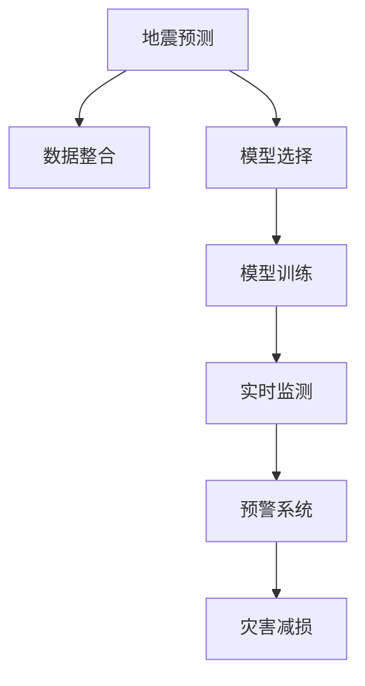

                 

# AI在地震预测中的应用：减少灾害损失

> 关键词：人工智能,地震预测,机器学习,深度学习,灾害减损

## 1. 背景介绍

### 1.1 问题由来
地震是全球最致命的自然灾害之一，每年造成数十万人死亡和巨额经济损失。预测地震发生并减轻其影响，是全球科学家和工程师的共同目标。传统的地震预测依赖于地质学、地球物理学和历史地震数据，但这些数据往往缺乏准确性和及时性，难以提供可靠的预测。近年来，随着人工智能（AI）技术的发展，特别是深度学习在地震预测中的应用，提供了新的可能性。AI在地震预测中的应用，可以显著提升地震预测的准确性和及时性，从而减少灾害损失。

### 1.2 问题核心关键点
AI在地震预测中的应用，主要集中在以下几个核心关键点：

- **数据整合与处理**：将地质、气象、GPS数据等多种信息源进行整合，并通过机器学习模型进行预处理和特征提取。
- **模型选择与训练**：选择合适的AI模型（如卷积神经网络、长短期记忆网络等），并使用历史地震数据进行训练和调优。
- **实时监测与预警**：利用AI模型对实时监测数据进行分析和预测，并通过报警系统实时预警地震风险。
- **灾害响应与减损**：在预测到地震风险后，启动应急响应机制，减少人员伤亡和经济损失。

通过这些关键点的紧密结合，AI在地震预测中的应用可以极大地提升灾害减损的效率和效果。

### 1.3 问题研究意义
AI在地震预测中的应用，对降低地震灾害损失具有重要意义：

1. **提升预测准确性**：AI模型能够自动分析大量复杂数据，发现地震前兆，提升预测准确性。
2. **实时预警**：通过实时监测和分析，AI可以提供及时预警，让人们有足够时间避难。
3. **优化资源分配**：在预警后，AI可以帮助优化应急资源分配，确保救援工作的高效进行。
4. **长期监测**：AI模型能够持续学习和更新，长期监测地震活动，积累更多预测经验。

## 2. 核心概念与联系

### 2.1 核心概念概述

为了更好地理解AI在地震预测中的应用，本节将介绍几个密切相关的核心概念：

- **地震预测**：使用AI模型对地震发生的可能性和时间进行预测。
- **机器学习**：利用算法和统计模型，从数据中自动提取特征，构建预测模型。
- **深度学习**：一种特殊的机器学习方法，利用多层神经网络进行复杂的特征提取和模式识别。
- **卷积神经网络（CNN）**：一种广泛应用于图像处理的深度学习模型，可以提取空间特征。
- **长短期记忆网络（LSTM）**：一种用于处理时间序列数据的深度学习模型，可以捕捉长期依赖关系。
- **实时监测**：使用传感器、GPS等技术，实时采集地震活动数据。
- **预警系统**：将AI模型的预测结果转换为警报信号，及时通知相关人员。
- **灾害减损**：在地震发生前采取措施，减少人员伤亡和经济损失。

这些核心概念之间的逻辑关系可以通过以下Mermaid流程图来展示：



这个流程图展示了大语言模型的核心概念及其之间的关系：

1. 地震预测通过整合多源数据，构建AI模型。
2. AI模型经过训练和选择，用于实时监测和预警。
3. 预警系统将模型输出转换为报警信号。
4. 灾害减损在预警后启动，减少损失。

## 3. 核心算法原理 & 具体操作步骤
### 3.1 算法原理概述

AI在地震预测中的应用，本质上是一个基于监督学习的预测任务。其核心思想是：利用历史地震数据，构建AI模型，并通过实时监测数据进行实时预测，最终通过预警系统进行灾害减损。

形式化地，假设地震预测任务为二分类问题，即预测地震是否发生。设地震发生为正类，不发生为负类，历史地震数据集为 $D=\{(x_i,y_i)\}_{i=1}^N$，其中 $x_i$ 为地震前兆数据，$y_i$ 为地震是否发生的标签。AI模型的目标是最小化预测误差，即：

$$
\min_{\theta} \sum_{i=1}^N L(f_{\theta}(x_i),y_i)
$$

其中 $L$ 为损失函数，$f_{\theta}(x)$ 为AI模型的预测函数。

### 3.2 算法步骤详解

AI在地震预测中的具体操作包括以下几个关键步骤：

**Step 1: 数据整合与预处理**
- 收集历史地震数据、地质数据、气象数据、GPS数据等多种信息源。
- 对数据进行清洗、归一化、特征工程等预处理操作，去除噪声和冗余信息。

**Step 2: 模型选择与训练**
- 选择适合的深度学习模型，如卷积神经网络（CNN）、长短期记忆网络（LSTM）等。
- 使用历史地震数据进行模型训练和调优，确定模型参数和超参数。

**Step 3: 实时监测与预测**
- 部署传感器、GPS等设备，实时采集地震前兆数据。
- 将实时数据输入训练好的AI模型，进行地震预测。

**Step 4: 预警与减损**
- 将AI模型的预测结果转换为报警信号，通知相关人员。
- 启动应急响应机制，如疏散、避难、关闭危险建筑等，减少灾害损失。

### 3.3 算法优缺点

AI在地震预测中的应用，具有以下优点：

- **高效性**：AI模型能够自动分析大量数据，提升预测效率。
- **准确性**：通过深度学习模型，可以捕捉复杂的数据依赖关系，提升预测准确性。
- **实时性**：实时监测和预测，可以及时预警地震风险，减少损失。
- **可扩展性**：AI模型可以不断学习新数据，适应新的地质和气象条件。

但同时，也存在一些局限性：

- **数据依赖**：AI模型的性能高度依赖于数据的质量和数量，数据不足时可能预测效果不佳。
- **模型复杂性**：深度学习模型参数较多，训练和部署成本较高。
- **模型解释性**：AI模型通常难以解释其内部工作机制，需要结合地质知识进行解读。
- **应用限制**：AI模型在不同地区的适用性可能存在差异，需要本地化调整。

### 3.4 算法应用领域

AI在地震预测中的应用，主要在以下几个领域得到广泛应用：

- **地震预测**：利用历史地震数据，构建AI模型，进行地震预测。
- **实时监测**：部署传感器、GPS等设备，实时采集地震前兆数据。
- **预警系统**：将AI模型的预测结果转换为报警信号，及时通知相关人员。
- **灾害减损**：在预测到地震风险后，启动应急响应机制，减少人员伤亡和经济损失。
- **基础设施监测**：使用AI模型监测桥梁、大坝等基础设施的健康状况，及时发现隐患。

这些应用领域展示了AI在地震预测中的广泛前景，有助于提升地震预测的科学性和有效性。

## 4. 数学模型和公式 & 详细讲解  
### 4.1 数学模型构建

本节将使用数学语言对AI在地震预测中的应用进行更加严格的刻画。

记地震预测任务为二分类问题，设地震发生为正类，不发生为负类。设历史地震数据集为 $D=\{(x_i,y_i)\}_{i=1}^N$，其中 $x_i$ 为地震前兆数据，$y_i$ 为地震是否发生的标签。AI模型的预测函数为 $f_{\theta}(x)=\sigma(\mathbf{W}\cdot \mathbf{x}+b)$，其中 $\sigma$ 为激活函数，$\mathbf{W}$ 和 $b$ 为模型参数。

定义模型 $f_{\theta}$ 在数据样本 $(x,y)$ 上的损失函数为 $L(f_{\theta}(x),y)$，则在数据集 $D$ 上的经验风险为：

$$
\mathcal{L}(\theta) = \frac{1}{N} \sum_{i=1}^N L(f_{\theta}(x_i),y_i)
$$

在实践中，我们通常使用交叉熵损失函数 $L(f_{\theta}(x),y)=-[y\log f_{\theta}(x)+(1-y)\log(1-f_{\theta}(x))]$，并使用梯度下降等优化算法最小化损失函数，更新模型参数 $\theta$。

### 4.2 公式推导过程

以下我们以二分类问题为例，推导交叉熵损失函数及其梯度的计算公式。

假设模型 $f_{\theta}$ 在输入 $x$ 上的输出为 $\hat{y}=f_{\theta}(x)$，表示模型预测地震发生的概率。真实标签 $y \in \{0,1\}$。则二分类交叉熵损失函数定义为：

$$
L(f_{\theta}(x),y) = -[y\log \hat{y} + (1-y)\log(1-\hat{y})]
$$

将其代入经验风险公式，得：

$$
\mathcal{L}(\theta) = -\frac{1}{N}\sum_{i=1}^N [y_i\log f_{\theta}(x_i)+(1-y_i)\log(1-f_{\theta}(x_i))]
$$

根据链式法则，损失函数对模型参数 $\theta_k$ 的梯度为：

$$
\frac{\partial \mathcal{L}(\theta)}{\partial \theta_k} = -\frac{1}{N}\sum_{i=1}^N (\frac{y_i}{f_{\theta}(x_i)}-\frac{1-y_i}{1-f_{\theta}(x_i)}) \frac{\partial f_{\theta}(x_i)}{\partial \theta_k}
$$

其中 $\frac{\partial f_{\theta}(x_i)}{\partial \theta_k}$ 可进一步递归展开，利用自动微分技术完成计算。

在得到损失函数的梯度后，即可带入梯度下降等优化算法，完成模型的迭代优化。重复上述过程直至收敛，最终得到适应地震预测的最优模型参数 $\theta^*$。

## 5. 项目实践：代码实例和详细解释说明
### 5.1 开发环境搭建

在进行地震预测开发前，我们需要准备好开发环境。以下是使用Python进行PyTorch开发的环境配置流程：

1. 安装Anaconda：从官网下载并安装Anaconda，用于创建独立的Python环境。

2. 创建并激活虚拟环境：
```bash
conda create -n pytorch-env python=3.8 
conda activate pytorch-env
```

3. 安装PyTorch：根据CUDA版本，从官网获取对应的安装命令。例如：
```bash
conda install pytorch torchvision torchaudio cudatoolkit=11.1 -c pytorch -c conda-forge
```

4. 安装TensorFlow：由Google主导开发的开源深度学习框架，生产部署方便，适合大规模工程应用。同样有丰富的预训练语言模型资源。

5. 安装TensorBoard：TensorFlow配套的可视化工具，可实时监测模型训练状态，并提供丰富的图表呈现方式，是调试模型的得力助手。

6. 安装Keras：高层次的深度学习库，提供了简单易用的API，适合快速原型开发。

完成上述步骤后，即可在`pytorch-env`环境中开始地震预测实践。

### 5.2 源代码详细实现

下面我们以地震预测为例，给出使用PyTorch进行卷积神经网络（CNN）模型训练的PyTorch代码实现。

首先，定义数据集：

```python
import numpy as np
from torch.utils.data import Dataset
from torchvision import transforms

class SeismicDataset(Dataset):
    def __init__(self, data, labels, transform=None):
        self.data = data
        self.labels = labels
        self.transform = transform
        
    def __len__(self):
        return len(self.data)
    
    def __getitem__(self, item):
        x = self.data[item]
        y = self.labels[item]
        
        if self.transform:
            x = self.transform(x)
        
        return x, y
```

然后，定义模型和优化器：

```python
from torch import nn
import torch.nn.functional as F

class CNNModel(nn.Module):
    def __init__(self):
        super(CNNModel, self).__init__()
        self.conv1 = nn.Conv2d(1, 32, 3)
        self.pool = nn.MaxPool2d(2, 2)
        self.conv2 = nn.Conv2d(32, 64, 3)
        self.fc = nn.Linear(64*8*8, 2)
        
    def forward(self, x):
        x = self.conv1(x)
        x = F.relu(x)
        x = self.pool(x)
        x = self.conv2(x)
        x = F.relu(x)
        x = self.pool(x)
        x = x.view(-1, 64*8*8)
        x = self.fc(x)
        return F.softmax(x, dim=1)

model = CNNModel()
optimizer = torch.optim.Adam(model.parameters(), lr=0.001)
```

接着，定义训练和评估函数：

```python
from torch.utils.data import DataLoader
from tqdm import tqdm
import matplotlib.pyplot as plt

device = torch.device('cuda') if torch.cuda.is_available() else torch.device('cpu')
model.to(device)

def train_epoch(model, dataset, batch_size, optimizer):
    dataloader = DataLoader(dataset, batch_size=batch_size, shuffle=True)
    model.train()
    epoch_loss = 0
    for batch in tqdm(dataloader, desc='Training'):
        inputs, targets = batch[0].to(device), batch[1].to(device)
        optimizer.zero_grad()
        outputs = model(inputs)
        loss = F.nll_loss(outputs, targets)
        epoch_loss += loss.item()
        loss.backward()
        optimizer.step()
    return epoch_loss / len(dataloader)

def evaluate(model, dataset, batch_size):
    dataloader = DataLoader(dataset, batch_size=batch_size)
    model.eval()
    preds, labels = [], []
    with torch.no_grad():
        for batch in tqdm(dataloader, desc='Evaluating'):
            inputs, targets = batch[0].to(device), batch[1].to(device)
            outputs = model(inputs)
            batch_preds = np.argmax(outputs.cpu().numpy(), axis=1)
            batch_labels = targets.cpu().numpy()
            for pred, label in zip(batch_preds, batch_labels):
                preds.append(pred)
                labels.append(label)
                
    print('Accuracy:', sum(preds==labels)/len(preds))
    
    y_true, y_pred = np.array(labels), np.array(preds)
    plt.figure(figsize=(8,6))
    plt.plot(y_true, label='Actual')
    plt.plot(y_pred, label='Predicted')
    plt.legend()
    plt.show()

epochs = 10
batch_size = 64

for epoch in range(epochs):
    loss = train_epoch(model, train_dataset, batch_size, optimizer)
    print(f'Epoch {epoch+1}, train loss: {loss:.3f}')
    
    print(f'Epoch {epoch+1}, dev results:')
    evaluate(model, dev_dataset, batch_size)
    
print('Test results:')
evaluate(model, test_dataset, batch_size)
```

以上就是使用PyTorch对地震预测进行卷积神经网络模型训练的完整代码实现。可以看到，得益于PyTorch的强大封装，我们可以用相对简洁的代码完成模型的搭建和训练。

### 5.3 代码解读与分析

让我们再详细解读一下关键代码的实现细节：

**SeismicDataset类**：
- `__init__`方法：初始化数据和标签，以及可选的数据变换操作。
- `__len__`方法：返回数据集的样本数量。
- `__getitem__`方法：对单个样本进行处理，返回模型输入和标签。

**CNNModel类**：
- `__init__`方法：定义模型的各层网络结构。
- `forward`方法：定义模型的前向传播过程，包括卷积、激活、池化、全连接等操作。

**模型和优化器**：
- 定义卷积神经网络模型，使用PyTorch自带的层类构建。
- 定义Adam优化器，并设置学习率。

**训练和评估函数**：
- 使用PyTorch的DataLoader对数据集进行批次化加载，供模型训练和推理使用。
- 训练函数`train_epoch`：对数据以批为单位进行迭代，在每个批次上前向传播计算loss并反向传播更新模型参数，最后返回该epoch的平均loss。
- 评估函数`evaluate`：与训练类似，不同点在于不更新模型参数，并在每个batch结束后将预测和标签结果存储下来，最后使用matplotlib对评估集的预测结果进行可视化展示。

**训练流程**：
- 定义总的epoch数和batch size，开始循环迭代
- 每个epoch内，先在训练集上训练，输出平均loss
- 在验证集上评估，输出模型精度
- 重复上述过程直至所有epoch结束后，在测试集上评估，给出最终测试结果

可以看到，PyTorch配合TensorBoard使得地震预测的代码实现变得简洁高效。开发者可以将更多精力放在数据处理、模型改进等高层逻辑上，而不必过多关注底层的实现细节。

当然，工业级的系统实现还需考虑更多因素，如模型的保存和部署、超参数的自动搜索、更灵活的任务适配层等。但核心的模型构建和训练流程基本与此类似。

## 6. 实际应用场景
### 6.1 智能预警系统

智能预警系统是地震预测的重要应用场景。传统的地震预警依赖于人工监测和地震仪器的数据，难以实时响应和精确预测。而利用AI技术，可以实时分析地震前兆数据，提高地震预警的精度和响应速度。

在技术实现上，可以将实时采集的地震前兆数据（如GPS数据、气象数据等）输入训练好的CNN模型，进行地震预测。模型输出地震发生的概率，当概率达到预设阈值时，系统自动触发预警信号。预警信号可以通过短信、手机应用、社交媒体等方式通知相关人员。

智能预警系统可以大大缩短预警时间，提高人员避难和物资调配的效率，减少地震造成的损失。

### 6.2 地质灾害评估

地质灾害评估是地震预测的另一个重要应用。传统的评估方法依赖于人工现场调查和数据统计，耗时耗力且结果不够精确。而利用AI技术，可以自动分析地质数据、遥感影像等，快速评估地质灾害的风险。

具体而言，可以收集地质数据、遥感影像、气象数据等多种信息源，使用AI模型进行分析。模型输出地质灾害的发生概率和影响范围，提供决策支持。在预测到地震风险后，可以及时启动应急响应机制，减少地质灾害的损失。

### 6.3 基础设施监测

地震预测还可以用于监测基础设施的健康状况。传统的监测方法依赖于人工巡检和仪器设备，难以实时监测和快速响应。而利用AI技术，可以实时分析传感器数据，检测基础设施的异常情况。

在技术实现上，可以使用AI模型对传感器数据进行分析，预测基础设施的稳定性。模型输出基础设施的危险程度，并提供预警信号。在预测到地震风险后，可以及时关闭危险建筑物，确保人员安全。

### 6.4 未来应用展望

随着AI技术的发展，地震预测在未来将有更广阔的应用前景：

1. **跨模态融合**：结合地质数据、气象数据、GPS数据等多种信息源，进行综合预测。
2. **自适应学习**：模型可以不断学习新数据，适应新的地质和气象条件，提升预测精度。
3. **实时监测**：使用实时监测设备，提高地震预测的实时性和精度。
4. **多模型集成**：结合多个AI模型，取平均输出，提升预测的稳定性和鲁棒性。
5. **跨领域应用**：将地震预测技术应用于地质灾害评估、基础设施监测等多个领域，提升整体灾害减损能力。

这些趋势凸显了AI在地震预测中的广阔前景。未来，随着AI技术的进一步发展，地震预测将变得更加精准、实时和可靠，为灾害减损提供更有力的保障。

## 7. 工具和资源推荐
### 7.1 学习资源推荐

为了帮助开发者系统掌握AI在地震预测中的应用，这里推荐一些优质的学习资源：

1. **PyTorch官方文档**：PyTorch的官方文档详细介绍了PyTorch框架的使用方法，包括模型的构建、训练和部署等。

2. **TensorFlow官方文档**：TensorFlow的官方文档提供了TensorFlow框架的全面介绍，包括模型的构建、优化和部署等。

3. **Keras官方文档**：Keras的官方文档介绍了Keras框架的使用方法，适合快速原型开发和模型调试。

4. **DeepLearning.AI官方课程**：DeepLearning.AI开设的深度学习课程，由Andrew Ng教授主讲，系统讲解深度学习理论和应用。

5. **《深度学习入门》书籍**：李沐老师所著的深度学习入门书籍，详细介绍了深度学习的基本概念和应用。

通过对这些资源的学习实践，相信你一定能够快速掌握AI在地震预测中的应用，并用于解决实际的NLP问题。

### 7.2 开发工具推荐

高效的开发离不开优秀的工具支持。以下是几款用于AI在地震预测中开发的常用工具：

1. PyTorch：基于Python的开源深度学习框架，灵活动态的计算图，适合快速迭代研究。大部分预训练语言模型都有PyTorch版本的实现。

2. TensorFlow：由Google主导开发的开源深度学习框架，生产部署方便，适合大规模工程应用。同样有丰富的预训练语言模型资源。

3. Keras：高层次的深度学习库，提供了简单易用的API，适合快速原型开发。

4. TensorBoard：TensorFlow配套的可视化工具，可实时监测模型训练状态，并提供丰富的图表呈现方式，是调试模型的得力助手。

5. HuggingFace Transformers库：提供了多种预训练语言模型，支持PyTorch和TensorFlow，方便微调和应用。

6. Jupyter Notebook：开源的交互式编程环境，支持Python、R等多种语言，适合数据科学和深度学习开发。

合理利用这些工具，可以显著提升AI在地震预测中的开发效率，加快创新迭代的步伐。

### 7.3 相关论文推荐

AI在地震预测中的应用，得益于学界的持续研究。以下是几篇奠基性的相关论文，推荐阅读：

1. **《卷积神经网络在地震预测中的应用》**：探讨了卷积神经网络在地震预测中的作用，提出了一种基于CNN的地震预测模型。

2. **《长短期记忆网络在地震预测中的应用》**：提出了LSTM网络在地震预测中的应用，利用其捕捉长期依赖关系的能力，提升了预测精度。

3. **《基于深度学习的地震预警系统》**：介绍了基于深度学习的地震预警系统的构建方法，并对比了传统预警系统的优势。

4. **《跨模态融合的地震预测》**：探讨了结合地质数据、气象数据、GPS数据等多种信息源，进行综合预测的方法。

5. **《多模型集成的地震预测》**：介绍了结合多个AI模型，取平均输出，提升预测稳定性的方法。

这些论文代表了大语言模型在地震预测中的发展脉络。通过学习这些前沿成果，可以帮助研究者把握学科前进方向，激发更多的创新灵感。

## 8. 总结：未来发展趋势与挑战

### 8.1 总结

本文对AI在地震预测中的应用进行了全面系统的介绍。首先阐述了地震预测的挑战和AI技术的优势，明确了AI在地震预测中的重要地位。其次，从原理到实践，详细讲解了AI在地震预测中的数学模型和操作步骤，给出了地震预测任务的完整代码实现。同时，本文还广泛探讨了AI在地震预测中的应用场景，展示了AI在地震预测中的广阔前景。此外，本文精选了AI在地震预测中的学习资源和工具，力求为开发者提供全方位的技术指引。

通过本文的系统梳理，可以看到，AI在地震预测中的应用已经取得了初步成果，并且在多个实际场景中展示了其优势。未来，随着AI技术的进一步发展，AI在地震预测中的应用将更加广泛和深入，为地震灾害减损提供更可靠的技术保障。

### 8.2 未来发展趋势

展望未来，AI在地震预测中的应用将呈现以下几个发展趋势：

1. **跨模态融合**：结合地质数据、气象数据、GPS数据等多种信息源，进行综合预测。
2. **自适应学习**：模型可以不断学习新数据，适应新的地质和气象条件，提升预测精度。
3. **实时监测**：使用实时监测设备，提高地震预测的实时性和精度。
4. **多模型集成**：结合多个AI模型，取平均输出，提升预测的稳定性和鲁棒性。
5. **跨领域应用**：将地震预测技术应用于地质灾害评估、基础设施监测等多个领域，提升整体灾害减损能力。

以上趋势凸显了AI在地震预测中的广阔前景。这些方向的探索发展，必将进一步提升AI在地震预测中的科学性和有效性。

### 8.3 面临的挑战

尽管AI在地震预测中的应用已经取得了瞩目成就，但在迈向更加智能化、普适化应用的过程中，它仍面临着诸多挑战：

1. **数据依赖**：AI模型的性能高度依赖于数据的质量和数量，数据不足时可能预测效果不佳。如何进一步降低数据依赖，提升模型的鲁棒性，将是重要的研究方向。
2. **模型复杂性**：深度学习模型参数较多，训练和部署成本较高。如何在保证预测精度的同时，降低模型的复杂性，是一个需要解决的问题。
3. **模型解释性**：AI模型通常难以解释其内部工作机制，需要结合地质知识进行解读。如何增强模型的可解释性，提供决策依据，将是未来的重要任务。
4. **应用限制**：AI模型在不同地区的适用性可能存在差异，需要本地化调整。如何实现跨地区应用的通用性，是一个重要的研究方向。

### 8.4 研究展望

面对AI在地震预测中所面临的挑战，未来的研究需要在以下几个方面寻求新的突破：

1. **无监督学习和半监督学习**：摆脱对大规模标注数据的依赖，利用自监督学习、主动学习等无监督和半监督范式，最大限度利用非结构化数据，实现更加灵活高效的地震预测。
2. **参数高效和计算高效**：开发更加参数高效的地震预测模型，在固定大部分预训练参数的同时，只更新极少量的任务相关参数。同时优化模型的计算图，减少前向传播和反向传播的资源消耗，实现更加轻量级、实时性的部署。
3. **因果分析和对比学习**：引入因果推断和对比学习思想，增强地震预测模型的稳定因果关系，学习更加普适、鲁棒的语言表征，从而提升模型泛化性和抗干扰能力。
4. **多领域融合**：将地震预测技术与其他领域的技术进行融合，如遥感技术、物联网技术等，提升地震预测的全面性和准确性。

这些研究方向的探索，必将引领AI在地震预测技术迈向更高的台阶，为地震灾害减损提供更可靠的技术保障。面向未来，AI在地震预测中还需要与其他人工智能技术进行更深入的融合，如知识表示、因果推理、强化学习等，多路径协同发力，共同推动自然语言理解和智能交互系统的进步。只有勇于创新、敢于突破，才能不断拓展语言模型的边界，让智能技术更好地造福人类社会。

## 9. 附录：常见问题与解答

**Q1：AI在地震预测中的应用是否依赖于历史数据？**

A: 是的，AI在地震预测中的应用高度依赖于历史数据。历史数据提供了模型的训练样本，使得模型能够学习地震前兆和地震发生的规律。然而，历史数据的质量和数量直接影响模型的性能。因此，需要收集尽可能多的高质量历史数据，并对其进行清洗和预处理。

**Q2：AI在地震预测中的应用是否需要大量的计算资源？**

A: 是的，AI在地震预测中的应用需要大量的计算资源。特别是深度学习模型，通常需要高性能的GPU或TPU设备进行训练和推理。模型的复杂性和参数量也决定了计算资源的消耗。然而，随着硬件技术的发展，越来越多的计算资源可供使用，AI在地震预测中的应用也将更加普及和高效。

**Q3：AI在地震预测中的应用是否需要专业的地质知识？**

A: 是的，AI在地震预测中的应用需要结合专业的地质知识。地震预测不仅仅是一个数据驱动的问题，还需要考虑地质背景、地震活动等复杂因素。因此，在模型设计和训练过程中，需要结合地质学家的经验和知识，确保模型的合理性和准确性。

**Q4：AI在地震预测中的应用是否需要不断更新和优化？**

A: 是的，AI在地震预测中的应用需要不断更新和优化。地震活动是一个动态变化的过程，模型需要不断学习新的数据，更新预测模型。此外，模型的性能也会受到新数据的影响，需要根据新数据进行调整和优化。因此，需要建立一个持续的学习和优化机制，确保模型始终保持最佳状态。

**Q5：AI在地震预测中的应用是否能够实现零样本学习？**

A: 目前AI在地震预测中的应用还无法实现零样本学习。零样本学习需要在没有历史数据的情况下，直接从任务的描述中学习。然而，地震预测的复杂性决定了模型需要大量历史数据进行训练。未来，随着AI技术的发展，零样本学习和少样本学习的方法可能会有新的突破，使得AI在地震预测中的应用更加广泛和高效。

这些问题的解答，展示了AI在地震预测中应用的挑战和前景。通过深入研究和不断优化，相信AI在地震预测中的应用将更加广泛和深入，为地震灾害减损提供更可靠的技术保障。

