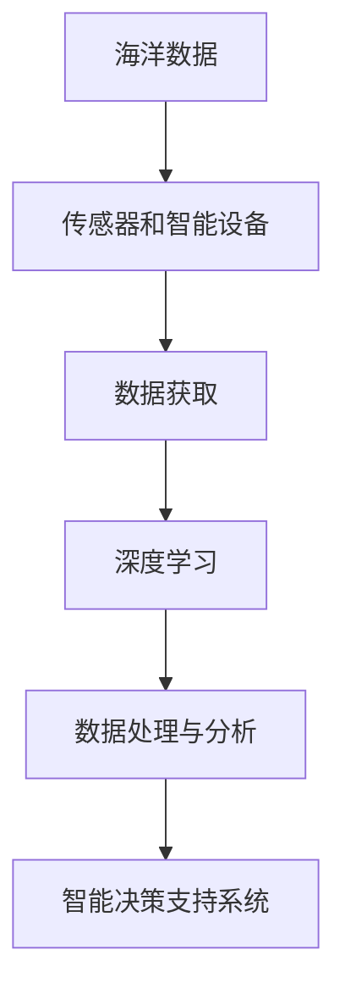

                 

# AI在智能海洋资源管理中的应用：保护海洋生态

## 1. 背景介绍

随着全球气候变化和人类活动的加剧，海洋资源面临严峻挑战，尤其是海洋生态保护、渔业资源管理和海洋环境监测等领域。传统的监测和管理方式已无法满足现代复杂多变的环境需求。因此，利用先进的人工智能技术，对海洋资源进行智能管理，成为当前国际上广泛关注的重点。

### 1.1 海洋资源管理现状
当前，全球海洋资源管理主要存在以下问题：
- **数据获取难度大**：传统监测手段如卫星、浮标等获取的数据存在滞后性，无法实时响应环境变化。
- **数据处理复杂**：海洋数据类型多样，包括水质、水温、生物多样性等，需进行复杂的数据处理和分析。
- **管理决策依据不足**：传统决策依据多为人工经验，缺乏科学性和系统性，导致决策效率低、效果差。

### 1.2 AI技术在海洋资源管理中的应用需求
为了解决上述问题，AI技术在海洋资源管理中的应用需求日益凸显，主要包括以下几个方面：
- **实时监测**：通过传感器和智能设备，实时获取海洋环境数据。
- **数据处理与分析**：利用深度学习、机器学习等技术，对海量海洋数据进行高效处理和分析。
- **智能决策支持**：基于数据分析结果，为海洋资源管理和生态保护提供智能决策支持。

## 2. 核心概念与联系

### 2.1 核心概念概述

为更好地理解AI在海洋资源管理中的应用，本节将介绍几个核心概念及其相互关系：

- **海洋数据**：包括海水质量、水温、盐度、生物多样性等环境指标。
- **传感器和智能设备**：用于实时获取海洋环境数据，如卫星、浮标、无人船等。
- **深度学习**：一种基于神经网络的机器学习技术，用于处理和分析海洋数据。
- **数据处理与分析**：利用深度学习算法，对海洋数据进行去噪、降维、特征提取等处理，生成有价值的信息。
- **智能决策支持系统**：基于数据处理和分析结果，为海洋管理决策提供智能建议和支持。

这些核心概念之间的逻辑关系可以通过以下Mermaid流程图来展示：



这个流程图展示了大语言模型微调的数学原理和关键步骤：

1. 海洋数据通过传感器和智能设备获取。
2. 获取的数据经过深度学习模型处理和分析，生成有价值的信息。
3. 基于信息，智能决策支持系统提供决策建议，指导海洋资源管理和生态保护。

## 3. 核心算法原理 & 具体操作步骤
### 3.1 算法原理概述

AI在海洋资源管理中的应用，主要是通过深度学习模型对海洋数据进行学习和分析，生成对海洋环境变化的实时监测和智能决策支持。其核心思想是利用深度神经网络对海洋环境进行建模，提取其内在规律和特征，从而实现对海洋生态的智能保护。

具体来说，可以采用以下步骤：

1. **数据预处理**：对海洋数据进行清洗、去噪、归一化等处理，使其适合深度学习模型。
2. **特征提取**：利用深度学习模型自动提取海洋数据中的关键特征。
3. **模型训练**：基于处理后的数据，训练深度学习模型，学习海洋环境的内在规律和特征。
4. **智能决策支持**：根据模型预测结果，提供智能决策建议，指导海洋资源管理和生态保护。

### 3.2 算法步骤详解

#### 3.2.1 数据预处理

数据预处理是深度学习模型训练的前提，具体步骤如下：

1. **数据清洗**：去除传感器或设备获取数据中的异常值和噪声。
2. **数据归一化**：对数据进行归一化处理，使得不同来源的数据具有相同的分布。
3. **数据分割**：将数据集划分为训练集、验证集和测试集，供模型训练、验证和测试使用。

#### 3.2.2 特征提取

特征提取是深度学习模型的关键步骤，常用的特征提取方法包括：

1. **卷积神经网络（CNN）**：适用于图像数据的特征提取。
2. **循环神经网络（RNN）**：适用于时间序列数据的特征提取。
3. **注意力机制**：通过注意力机制，重点关注数据中的关键特征，提高模型效果。

#### 3.2.3 模型训练

模型训练是深度学习模型的核心步骤，具体步骤如下：

1. **选择合适的模型架构**：如CNN、RNN、Transformer等。
2. **定义损失函数**：如均方误差、交叉熵等，衡量模型预测结果与真实值之间的差异。
3. **优化器选择**：如SGD、Adam等，更新模型参数，最小化损失函数。
4. **超参数调优**：如学习率、批次大小等，调节模型训练过程。

#### 3.2.4 智能决策支持

智能决策支持是AI在海洋资源管理中的最终目标，具体步骤如下：

1. **预测建模**：基于训练好的深度学习模型，对新数据进行预测。
2. **决策分析**：根据预测结果，结合专家知识和经验，生成决策建议。
3. **决策实施**：将决策建议转化为实际行动，如调整渔业捕捞计划、保护海洋生态等。

### 3.3 算法优缺点

AI在海洋资源管理中的应用具有以下优点：
1. **实时性高**：深度学习模型能够实时处理海洋数据，及时响应环境变化。
2. **处理能力强**：深度学习模型具备强大的数据处理能力，能够处理海量复杂数据。
3. **决策科学化**：智能决策支持系统能够提供基于数据的决策建议，提升决策科学性。

同时，该方法也存在一定的局限性：
1. **数据依赖性强**：模型性能依赖于数据的质量和量，获取高质量数据成本较高。
2. **模型复杂度大**：深度学习模型参数多，训练和推理计算量大。
3. **解释性差**：深度学习模型的决策过程缺乏可解释性，难以理解其内部机制。
4. **对先验知识需求高**：深度学习模型需要大量标注数据和先验知识，训练难度大。

尽管存在这些局限性，但就目前而言，AI在海洋资源管理中的应用仍是最主流范式。未来相关研究的重点在于如何进一步降低数据获取成本，提高模型泛化能力，同时兼顾可解释性和伦理安全性等因素。

### 3.4 算法应用领域

AI在海洋资源管理中的应用，主要包括以下几个方面：

1. **海洋环境监测**：利用传感器和智能设备，实时监测海洋水质、水温、盐度等环境指标。
2. **渔业资源管理**：通过深度学习模型，预测鱼类资源分布和繁殖周期，指导捕捞活动。
3. **海洋生态保护**：利用AI技术，识别海洋生态系统中的关键物种和敏感区域，进行生态保护。
4. **海洋灾害预警**：通过深度学习模型，预测海洋灾害如海啸、台风等，提前采取应对措施。

除了上述这些经典应用外，AI技术还在海事安全、海洋气候研究等诸多领域得到应用，为海洋资源管理和生态保护提供了强大的技术支撑。

## 4. 数学模型和公式 & 详细讲解 & 举例说明

### 4.1 数学模型构建

为了更好地理解AI在海洋资源管理中的应用，本节将介绍数学模型构建的基本流程。

设海洋数据集为 $D=\{(x_i, y_i)\}_{i=1}^N$，其中 $x_i$ 为海洋数据，$y_i$ 为环境标签（如水质指标）。深度学习模型的目标是最小化经验风险：

$$
\mathcal{L}(\theta) = \frac{1}{N} \sum_{i=1}^N \ell(M_{\theta}(x_i), y_i)
$$

其中 $\ell$ 为损失函数，$M_{\theta}$ 为深度学习模型。

深度学习模型的参数 $\theta$ 包括卷积核、权重等，通过优化算法最小化损失函数，得到最优参数 $\hat{\theta}$。常用的优化算法包括SGD、Adam等，超参数包括学习率、批次大小等。

### 4.2 公式推导过程

以下我们以CNN模型为例，推导其数学公式和计算过程。

CNN模型的主要结构包括卷积层、池化层、全连接层等。假设模型输入为 $x \in \mathbb{R}^n$，卷积核大小为 $k$，卷积步长为 $s$，输出特征图大小为 $h \times w$。卷积层的操作公式为：

$$
y = \sigma(W*x + b)
$$

其中 $\sigma$ 为激活函数，$W$ 为卷积核权重，$b$ 为偏置项。

池化层的操作公式为：

$$
y' = f(y)
$$

其中 $f$ 为池化函数，如最大池化、平均池化等。

全连接层的操作公式为：

$$
z = W^T*x + b
$$

其中 $W$ 为权重矩阵，$b$ 为偏置项。

最后，深度学习模型的输出层通常为softmax层，用于多分类问题的预测。其公式为：

$$
p = \frac{\exp(z)}{\sum_{i=1}^C \exp(z_i)}
$$

其中 $C$ 为分类数，$z$ 为输出向量，$p$ 为预测概率向量。

### 4.3 案例分析与讲解

为了更好地理解AI在海洋资源管理中的应用，本节将通过一个具体案例进行详细讲解。

假设我们需要构建一个AI模型，用于监测海洋中的污染物浓度变化。具体步骤如下：

1. **数据预处理**：收集历史海洋污染物浓度数据，对其进行清洗、去噪、归一化等处理。
2. **特征提取**：利用CNN模型，对污染物浓度数据进行特征提取，生成关键特征。
3. **模型训练**：基于处理后的数据，训练CNN模型，学习污染物浓度变化的内在规律。
4. **智能决策支持**：根据模型预测结果，生成污染物浓度变化趋势，为海洋保护提供决策支持。

## 5. 项目实践：代码实例和详细解释说明
### 5.1 开发环境搭建

在进行AI模型开发前，我们需要准备好开发环境。以下是使用Python进行TensorFlow开发的环境配置流程：

1. 安装Anaconda：从官网下载并安装Anaconda，用于创建独立的Python环境。

2. 创建并激活虚拟环境：
```bash
conda create -n tf-env python=3.8 
conda activate tf-env
```

3. 安装TensorFlow：根据CUDA版本，从官网获取对应的安装命令。例如：
```bash
conda install tensorflow-gpu=2.7.0 -c tf
```

4. 安装各类工具包：
```bash
pip install numpy pandas scikit-learn matplotlib tqdm jupyter notebook ipython
```

完成上述步骤后，即可在`tf-env`环境中开始AI模型开发。

### 5.2 源代码详细实现

下面我们以CNN模型监测污染物浓度为例，给出TensorFlow代码实现。

首先，定义模型结构：

```python
import tensorflow as tf
from tensorflow.keras.layers import Conv2D, MaxPooling2D, Flatten, Dense

model = tf.keras.Sequential([
    Conv2D(32, (3, 3), activation='relu', input_shape=(n, n, 1)),
    MaxPooling2D((2, 2)),
    Conv2D(64, (3, 3), activation='relu'),
    MaxPooling2D((2, 2)),
    Conv2D(128, (3, 3), activation='relu'),
    MaxPooling2D((2, 2)),
    Flatten(),
    Dense(128, activation='relu'),
    Dense(1)
])
```

然后，定义训练和评估函数：

```python
from tensorflow.keras.optimizers import Adam

optimizer = Adam(learning_rate=0.001)

def train_epoch(model, dataset, batch_size):
    for batch in dataset:
        inputs, labels = batch
        with tf.GradientTape() as tape:
            outputs = model(inputs)
            loss = tf.losses.mean_squared_error(labels, outputs)
        gradients = tape.gradient(loss, model.trainable_variables)
        optimizer.apply_gradients(zip(gradients, model.trainable_variables))
        
def evaluate(model, dataset):
    total_loss = 0
    for batch in dataset:
        inputs, labels = batch
        outputs = model(inputs)
        loss = tf.losses.mean_squared_error(labels, outputs)
        total_loss += loss
    return total_loss / len(dataset)
```

最后，启动训练流程并在测试集上评估：

```python
epochs = 10
batch_size = 32

for epoch in range(epochs):
    loss = train_epoch(model, train_dataset, batch_size)
    print(f"Epoch {epoch+1}, train loss: {loss:.4f}")
    
    dev_loss = evaluate(model, dev_dataset)
    print(f"Epoch {epoch+1}, dev loss: {dev_loss:.4f}")
    
print("Test loss:", evaluate(model, test_dataset))
```

以上就是使用TensorFlow进行CNN模型监测污染物浓度的完整代码实现。可以看到，TensorFlow提供了方便的API，使得模型开发过程简洁高效。

### 5.3 代码解读与分析

让我们再详细解读一下关键代码的实现细节：

**Sequential模型定义**：
- `Sequential` 模型定义了一个顺序的神经网络模型，可以通过 `add` 方法添加不同的神经网络层。
- 每个层包括卷积层、池化层、全连接层等，通过设置参数来确定模型的结构和参数量。

**损失函数定义**：
- 使用 `tf.losses.mean_squared_error` 作为损失函数，计算模型预测值与真实标签之间的均方误差。

**优化器定义**：
- 使用 `Adam` 优化器，设置学习率，用于更新模型参数。

**训练函数**：
- 在每个epoch中，对训练集进行迭代，计算损失函数并反向传播更新模型参数。

**评估函数**：
- 在验证集上计算模型损失，评估模型性能。

**训练流程**：
- 循环训练多个epoch，记录训练和验证集的损失，并在测试集上评估最终性能。

可以看到，TensorFlow使得模型开发过程简便易行，但工业级的系统实现还需考虑更多因素，如模型的保存和部署、超参数的自动搜索、更灵活的任务适配层等。但核心的模型训练流程基本与此类似。

## 6. 实际应用场景
### 6.1 海洋环境监测

利用深度学习模型对海洋环境进行实时监测，是AI在海洋资源管理中的重要应用场景。通过传感器和智能设备，实时获取海洋水质、水温、盐度等数据，结合深度学习模型，生成环境监测报告，为海洋保护提供数据支持。

具体而言，可以构建基于CNN模型的环境监测系统，实时监测海洋中的污染物浓度、海温变化等关键指标。通过模型预测结果，快速识别环境异常情况，提前采取应对措施，确保海洋环境的健康和可持续性。

### 6.2 渔业资源管理

深度学习模型在渔业资源管理中的应用，主要体现在以下几个方面：

- **鱼类资源预测**：利用深度学习模型，预测鱼类资源的分布和繁殖周期，指导渔业捕捞活动，避免过度捕捞。
- **渔获量优化**：通过深度学习模型，分析渔业资源变化趋势，优化渔获量，提高渔业经济效益。
- **渔业行为监测**：利用计算机视觉技术，识别和监测渔业行为，保障渔民安全和遵守法规。

例如，通过构建基于RNN模型的鱼类资源预测系统，分析历史捕捞数据，预测未来鱼类资源分布，为渔业管理提供科学依据。结合实时监测数据，实现动态调整捕捞计划，保障渔业资源的可持续利用。

### 6.3 海洋生态保护

AI在海洋生态保护中的应用，主要体现在以下几个方面：

- **关键物种识别**：利用深度学习模型，识别海洋生态系统中的关键物种，进行生态保护。
- **敏感区域监测**：通过深度学习模型，监测海洋中的敏感区域，如珊瑚礁、海草床等，保护生物多样性。
- **生态链分析**：利用深度学习模型，分析海洋生态链中各物种的相互作用，优化生态保护策略。

例如，通过构建基于CNN模型的关键物种识别系统，自动识别海洋生态系统中的关键物种，为生态保护提供数据支持。结合实时监测数据，实现动态调整生态保护措施，保障海洋生态系统的健康和稳定。

### 6.4 海洋灾害预警

深度学习模型在海洋灾害预警中的应用，主要体现在以下几个方面：

- **海啸预警**：利用深度学习模型，预测海啸来临的趋势，提前采取预警措施。
- **台风预警**：通过深度学习模型，分析气象数据，预测台风的路径和强度，提供精准预警。
- **海洋污染预警**：利用深度学习模型，监测海洋污染情况，提前采取应对措施。

例如，通过构建基于RNN模型的海啸预警系统，分析历史海啸数据，预测未来海啸来临的趋势，为沿海地区提供精准预警。结合实时监测数据，实现动态调整预警策略，保障沿海地区的安全。

## 7. 工具和资源推荐
### 7.1 学习资源推荐

为了帮助开发者系统掌握深度学习技术在海洋资源管理中的应用，这里推荐一些优质的学习资源：

1. TensorFlow官方文档：TensorFlow作为深度学习的主流框架，提供了详细的API和教程，适合初学者和进阶开发者。
2. Keras官方文档：Keras是一个高级神经网络API，易于上手，适合快速迭代研究。
3. Deep Learning for Climate and Environmental Science（论文）：论文介绍了深度学习在气候和环境科学中的应用，适合对深度学习在实际场景中的应用感兴趣的研究者。
4. UCI海洋数据集（数据集）：提供了多类海洋数据，包括水质、水温、盐度等，适合用于深度学习模型的训练和测试。
5. AI for Ocean Monitoring（课程）：由知名教育机构提供，系统讲解了深度学习在海洋监测中的应用，适合初学者和高级开发者。

通过对这些资源的学习实践，相信你一定能够快速掌握深度学习在海洋资源管理中的应用，并用于解决实际的海洋问题。

### 7.2 开发工具推荐

高效的开发离不开优秀的工具支持。以下是几款用于深度学习模型开发的常用工具：

1. TensorFlow：由Google主导开发的开源深度学习框架，生产部署方便，适合大规模工程应用。
2. Keras：Google开源的高级神经网络API，易于上手，适合快速迭代研究。
3. PyTorch：由Facebook开发的深度学习框架，灵活性高，支持动态图和静态图计算。
4. Weights & Biases：模型训练的实验跟踪工具，可以记录和可视化模型训练过程中的各项指标，方便对比和调优。
5. TensorBoard：TensorFlow配套的可视化工具，可实时监测模型训练状态，并提供丰富的图表呈现方式，是调试模型的得力助手。

合理利用这些工具，可以显著提升深度学习模型的开发效率，加快创新迭代的步伐。

### 7.3 相关论文推荐

深度学习技术在海洋资源管理中的应用，源于学界的持续研究。以下是几篇奠基性的相关论文，推荐阅读：

1. Deep Blue Sea: The Effectiveness of Pre-trained Deep Learning Models for Marine Biodiversity and Ecosystem Monitoring（论文）：论文展示了预训练模型在海洋生物多样性和生态监测中的应用效果。
2. OceanDataBenchmark: A Testbed for Multi-modal Marine Spatial Data（论文）：论文介绍了海洋数据集的设计和应用，适合用于深度学习模型的训练和测试。
3. AI for Ocean Health Monitoring（报告）：由国际组织提供，系统介绍了AI在海洋健康监测中的应用现状和未来趋势，适合对海洋管理感兴趣的研究者。

这些论文代表了大语言模型微调技术的发展脉络。通过学习这些前沿成果，可以帮助研究者把握学科前进方向，激发更多的创新灵感。

## 8. 总结：未来发展趋势与挑战

### 8.1 总结

本文对深度学习技术在海洋资源管理中的应用进行了全面系统的介绍。首先阐述了海洋资源管理的现状和AI技术的应用需求，明确了AI在实时监测、数据处理与分析、智能决策支持等方面的独特价值。其次，从原理到实践，详细讲解了深度学习模型的构建和训练过程，给出了深度学习模型监测污染物浓度的完整代码实现。同时，本文还广泛探讨了AI技术在海洋资源管理中的应用场景，展示了AI技术的广阔前景。

通过本文的系统梳理，可以看到，深度学习技术在海洋资源管理中的应用，正在成为国际上广泛关注的研究方向，极大地提升了海洋管理的智能化水平，促进了海洋生态的保护和可持续发展。未来，伴随深度学习技术的发展和成熟，相信AI在海洋资源管理中的应用将更加广泛和深入，为构建健康、可持续的海洋环境提供强有力的技术支撑。

### 8.2 未来发展趋势

展望未来，深度学习技术在海洋资源管理中的应用将呈现以下几个发展趋势：

1. **实时性更高**：通过边缘计算和云-边协同计算，提高数据实时处理的效率，满足海洋环境监测的实时性需求。
2. **数据融合能力更强**：结合卫星、浮标、无人船等设备，实现多源数据的融合，提升数据的完整性和准确性。
3. **模型复杂度更高**：随着深度学习模型的不断演进，模型的结构和参数量将进一步增大，具备更强的数据处理能力。
4. **智能决策支持更精准**：基于深度学习模型的预测结果，结合专家知识和经验，生成更加精准的决策建议，提升海洋管理的科学性。
5. **可解释性增强**：通过可解释性技术，增强深度学习模型的解释性，帮助用户理解模型的决策过程。

这些趋势凸显了深度学习技术在海洋资源管理中的广阔前景，必将进一步提升海洋管理的智能化水平，为海洋生态保护和可持续发展提供更强大的技术支撑。

### 8.3 面临的挑战

尽管深度学习技术在海洋资源管理中的应用已经取得了一定成效，但在迈向更加智能化、普适化应用的过程中，它仍面临诸多挑战：

1. **数据依赖性强**：深度学习模型的性能依赖于数据的质量和量，获取高质量数据成本较高。
2. **模型复杂度大**：深度学习模型参数多，训练和推理计算量大，对硬件设备要求高。
3. **可解释性差**：深度学习模型的决策过程缺乏可解释性，难以理解其内部机制，影响用户信任。
4. **先验知识需求高**：深度学习模型需要大量标注数据和先验知识，训练难度大，对专家知识依赖高。
5. **系统稳定性不足**：深度学习模型在面对复杂环境时，容易发生波动，需要加强系统稳定性。

尽管存在这些挑战，但随着学界和产业界的共同努力，这些挑战终将一一被克服，深度学习技术必将在海洋资源管理中发挥越来越重要的作用。

### 8.4 研究展望

面对深度学习在海洋资源管理中面临的种种挑战，未来的研究需要在以下几个方面寻求新的突破：

1. **降低数据获取成本**：探索无监督学习和半监督学习范式，降低深度学习模型对标注数据的依赖，利用自监督学习、主动学习等方法，最大限度利用非结构化数据。
2. **提高模型泛化能力**：开发参数高效和计算高效的深度学习模型，减少前向传播和反向传播的资源消耗，实现更加轻量级、实时性的部署。
3. **增强模型解释性**：引入可解释性技术，如注意力机制、因果推断等，增强深度学习模型的解释性，帮助用户理解模型的决策过程。
4. **整合多源数据**：结合卫星、浮标、无人船等设备，实现多源数据的融合，提升数据的完整性和准确性。
5. **优化系统稳定性**：通过增量学习和在线学习等方法，增强深度学习模型的系统稳定性，避免灾难性遗忘。

这些研究方向的探索，必将引领深度学习技术在海洋资源管理中的应用迈向更高的台阶，为构建健康、可持续的海洋环境提供强有力的技术支撑。

## 9. 附录：常见问题与解答

**Q1：深度学习在海洋资源管理中的应用是否适合所有海洋环境？**

A: 深度学习在海洋资源管理中的应用，需要根据具体海洋环境的特点进行调整。对于复杂多变的海洋环境，深度学习模型需要结合专家知识和经验，进行优化和调整，以适应不同的海洋场景。

**Q2：深度学习模型在海洋环境监测中的优势是什么？**

A: 深度学习模型在海洋环境监测中的优势包括：
1. **实时性高**：能够实时处理海洋数据，及时响应环境变化。
2. **处理能力强**：具备强大的数据处理能力，能够处理海量复杂数据。
3. **预测准确**：通过训练历史数据，能够预测未来的海洋环境变化趋势，为海洋保护提供数据支持。

**Q3：如何构建基于深度学习模型的海洋资源管理系统？**

A: 构建基于深度学习模型的海洋资源管理系统，一般包括以下几个步骤：
1. **数据预处理**：对海洋数据进行清洗、去噪、归一化等处理，使其适合深度学习模型。
2. **特征提取**：利用深度学习模型，自动提取海洋数据中的关键特征。
3. **模型训练**：基于处理后的数据，训练深度学习模型，学习海洋环境的内在规律和特征。
4. **智能决策支持**：根据模型预测结果，生成智能决策建议，指导海洋资源管理和生态保护。

**Q4：深度学习模型在海洋灾害预警中的应用有哪些？**

A: 深度学习模型在海洋灾害预警中的应用包括：
1. **海啸预警**：利用深度学习模型，预测海啸来临的趋势，提前采取预警措施。
2. **台风预警**：通过深度学习模型，分析气象数据，预测台风的路径和强度，提供精准预警。
3. **海洋污染预警**：利用深度学习模型，监测海洋污染情况，提前采取应对措施。

**Q5：深度学习模型在海洋生态保护中的应用有哪些？**

A: 深度学习模型在海洋生态保护中的应用包括：
1. **关键物种识别**：利用深度学习模型，识别海洋生态系统中的关键物种，进行生态保护。
2. **敏感区域监测**：通过深度学习模型，监测海洋中的敏感区域，如珊瑚礁、海草床等，保护生物多样性。
3. **生态链分析**：利用深度学习模型，分析海洋生态链中各物种的相互作用，优化生态保护策略。

通过这些常见问题的解答，可以帮助读者更好地理解深度学习在海洋资源管理中的应用，为实际系统的构建和优化提供参考。

---

作者：禅与计算机程序设计艺术 / Zen and the Art of Computer Programming

