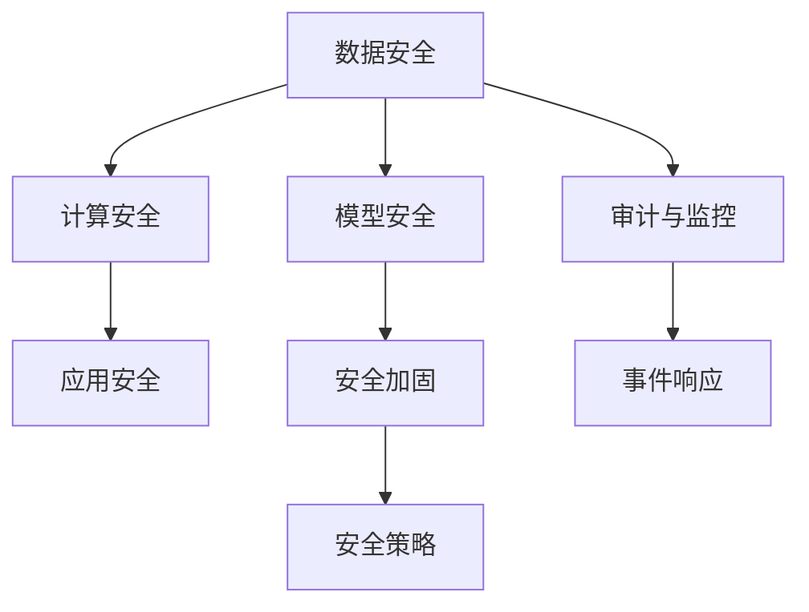

                 

## 1. 背景介绍

### 1.1 问题由来

随着人工智能（AI）技术的快速发展和广泛应用，AI基础设施的安全性问题日益凸显。AI基础设施包括数据存储、模型训练、推理服务等环节，涉及海量敏感数据和复杂计算，因此面临着严重的安全威胁。近年来，针对AI基础设施的黑客攻击事件频发，包括数据泄露、模型篡改、服务中断等，严重威胁到企业和个人的数据安全、隐私保护和业务连续性。

### 1.2 问题核心关键点

AI基础设施的安全加固是当前AI安全领域的重要研究方向。其核心在于如何构建一个全面、多层次的安全防御体系，确保AI系统在各个环节的安全性。这一体系应包括但不限于数据安全、模型安全、计算安全和应用安全等几个方面。

数据安全方面，主要关注数据在存储、传输和处理过程中的安全性。包括数据加密、访问控制、审计日志等技术手段。

模型安全方面，主要关注模型的鲁棒性、可解释性和公平性。包括对抗样本攻击、模型回溯和审计等技术手段。

计算安全方面，主要关注计算资源的保护和利用。包括防止恶意计算任务、资源劫持等技术手段。

应用安全方面，主要关注AI服务的安全性和可靠性。包括防止服务中断、恶意篡改等技术手段。

## 2. 核心概念与联系

### 2.1 核心概念概述

为了更好地理解AI基础设施的安全加固，本节将介绍几个密切相关的核心概念：

- **数据安全**：指数据在存储、传输和处理过程中的安全性。涉及数据加密、访问控制、审计日志等技术手段。
- **模型安全**：指AI模型的鲁棒性、可解释性和公平性。涉及对抗样本攻击、模型回溯和审计等技术手段。
- **计算安全**：指计算资源的保护和利用。涉及防止恶意计算任务、资源劫持等技术手段。
- **应用安全**：指AI服务的安全性和可靠性。涉及防止服务中断、恶意篡改等技术手段。

这些核心概念之间的逻辑关系可以通过以下Mermaid流程图来展示：



这个流程图展示出各个安全层面的联系和相互作用：

1. **数据安全**：是AI基础设施安全的基础，提供数据隐私保护和完整性保障。
2. **模型安全**：建立在数据安全的基础上，保证模型的鲁棒性和可信性。
3. **计算安全**：确保计算资源的安全利用，防止资源被恶意消耗。
4. **应用安全**：最终体现在AI服务的安全性和可靠性上。
5. **审计与监控**：贯穿各安全层面，用于记录和响应安全事件。
6. **安全加固**：根据审计与监控的结果，调整和优化安全策略。

## 3. 核心算法原理 & 具体操作步骤

### 3.1 算法原理概述

AI基础设施的安全加固，本质上是一个多层次的安全防御和加固过程。其核心思想是通过构建一个全面、多层次的安全防御体系，确保AI系统在各个环节的安全性。

**总体架构**：
1. **数据层**：通过数据加密、访问控制、审计日志等技术手段，确保数据在存储、传输和处理过程中的安全性。
2. **模型层**：通过模型鲁棒性测试、对抗样本攻击、模型回溯和审计等技术手段，确保模型的鲁棒性和可信性。
3. **计算层**：通过防止恶意计算任务、资源劫持等技术手段，确保计算资源的安全利用。
4. **应用层**：通过防止服务中断、恶意篡改等技术手段，确保AI服务的安全性和可靠性。

**关键技术点**：
1. **数据加密**：通过对称加密或非对称加密技术，对数据进行加密存储和传输，防止数据泄露。
2. **访问控制**：通过基于角色的访问控制（RBAC）、基于属性的访问控制（ABAC）等技术手段，限制对数据的访问权限。
3. **审计日志**：记录数据的访问和使用情况，定期进行安全审计，发现潜在的安全漏洞。
4. **模型鲁棒性测试**：通过对抗样本攻击、模型回溯等技术手段，评估模型的鲁棒性，发现和修复模型漏洞。
5. **计算安全加固**：通过限制计算资源的访问权限、监控计算任务的使用情况等手段，防止恶意计算任务和资源劫持。
6. **应用安全加固**：通过限制API访问权限、监控API调用情况等手段，防止服务中断和恶意篡改。

### 3.2 算法步骤详解

AI基础设施的安全加固可以分为以下几个关键步骤：

**Step 1: 数据层安全加固**

1. **数据加密**：采用AES或RSA等加密算法，对数据进行加密存储和传输。
2. **访问控制**：使用RBAC或ABAC技术，限制对数据的访问权限。
3. **审计日志**：记录数据的访问和使用情况，定期进行安全审计，发现潜在的安全漏洞。

**Step 2: 模型层安全加固**

1. **模型鲁棒性测试**：通过对抗样本攻击、模型回溯等技术手段，评估模型的鲁棒性。
2. **对抗样本攻击**：采用梯度上升攻击（GRA）等技术手段，生成对抗样本，测试模型的鲁棒性。
3. **模型回溯**：通过记录模型训练和推理过程，发现和修复模型漏洞。

**Step 3: 计算层安全加固**

1. **计算资源限制**：通过访问控制和资源限制，防止恶意计算任务和资源劫持。
2. **计算监控**：实时监控计算任务的使用情况，发现异常行为。
3. **恶意计算任务检测**：采用异常检测技术，发现并阻止恶意计算任务。

**Step 4: 应用层安全加固**

1. **API访问控制**：限制API访问权限，防止未经授权的访问。
2. **API调用监控**：实时监控API调用情况，发现异常行为。
3. **恶意篡改检测**：采用行为分析技术，检测并阻止恶意篡改。

**Step 5: 安全策略优化**

1. **事件响应**：根据安全审计和监控结果，制定和优化安全策略。
2. **安全加固**：根据事件响应结果，进行相应的安全加固措施。
3. **审计与监控**：持续记录和监控数据、模型、计算和应用层面的安全状态，确保安全体系的持续有效性。

### 3.3 算法优缺点

**优点**：

1. **全面性**：涵盖数据、模型、计算和应用层面的安全加固，确保AI基础设施的全面安全性。
2. **可扩展性**：各层面的安全措施可以根据需求进行灵活配置和扩展。
3. **技术成熟**：数据加密、访问控制、审计日志等技术手段已较为成熟，易于实现。
4. **效果显著**：通过多层次的安全防护，显著提升AI基础设施的安全性和可靠性。

**缺点**：

1. **复杂性**：涉及多个层面的安全措施，实施过程较为复杂。
2. **资源消耗**：实施过程中需要投入大量资源进行安全审计和加固，增加系统维护成本。
3. **更新难度**：随着AI技术和应用场景的变化，安全策略需要持续更新和调整，难度较大。

### 3.4 算法应用领域

AI基础设施的安全加固技术，在以下几个领域有着广泛的应用：

- **金融领域**：金融机构处理大量敏感数据，数据泄露和篡改风险较高。采用数据加密、访问控制等技术手段，确保数据安全。
- **医疗领域**：医疗数据涉及患者隐私，数据泄露风险较高。采用数据加密、访问控制等技术手段，确保数据安全。
- **政府领域**：政府数据涉及国家安全和社会稳定，数据泄露和篡改风险较高。采用数据加密、访问控制等技术手段，确保数据安全。
- **互联网企业**：互联网企业处理大量用户数据，数据泄露和滥用风险较高。采用数据加密、访问控制等技术手段，确保数据安全。

## 4. 数学模型和公式 & 详细讲解  
### 4.1 数学模型构建

在本节中，我们将使用数学语言对AI基础设施的安全加固过程进行更加严格的刻画。

假设AI基础设施的各个层面的安全状态为 $S=\{S_{data}, S_{model}, S_{compute}, S_{app}\}$，其中 $S_{data}$ 表示数据层面的安全状态，$S_{model}$ 表示模型层面的安全状态，$S_{compute}$ 表示计算层面的安全状态，$S_{app}$ 表示应用层面的安全状态。

定义安全状态的安全度量函数为 $f(S)=(f_{data}(S_{data}), f_{model}(S_{model}), f_{compute}(S_{compute}), f_{app}(S_{app}))$，其中 $f_{data}(S_{data})$、$f_{model}(S_{model})$、$f_{compute}(S_{compute})$ 和 $f_{app}(S_{app})$ 分别表示数据层、模型层、计算层和应用层的安全度量函数。

定义安全加固的目标函数为 $g(S)=\min_{S} f(S)$，即通过安全加固，将AI基础设施的安全度量函数 $f(S)$ 最小化。

**安全度量函数示例**：

- **数据层**：$f_{data}(S_{data})=1$，表示数据加密、访问控制和审计日志等技术手段已全面部署。
- **模型层**：$f_{model}(S_{model})=1$，表示模型鲁棒性测试、对抗样本攻击和模型回溯等技术手段已全面部署。
- **计算层**：$f_{compute}(S_{compute})=1$，表示计算资源限制、计算监控和恶意计算任务检测等技术手段已全面部署。
- **应用层**：$f_{app}(S_{app})=1$，表示API访问控制、API调用监控和恶意篡改检测等技术手段已全面部署。

### 4.2 公式推导过程

**数据层安全加固**：

1. **数据加密**：
   - 假设加密算法为 $E_k$，对数据 $D$ 进行加密，得到密文 $C=E_k(D)$。
   - 解密算法为 $D_k$，对密文 $C$ 进行解密，得到原始数据 $D=D_k(C)$。

2. **访问控制**：
   - 假设访问控制策略为 $AC$，对数据 $D$ 进行访问控制，得到安全访问控制策略 $AC_{data}$。

3. **审计日志**：
   - 假设审计日志策略为 $AL$，记录数据的访问和使用情况，得到审计日志 $AL_{data}$。

**模型层安全加固**：

1. **模型鲁棒性测试**：
   - 假设对抗样本生成算法为 $AG$，对模型 $M$ 进行对抗样本攻击，生成对抗样本 $X$，得到攻击后的模型 $M'=AG(M,X)$。
   - 假设模型回溯算法为 $BR$，对攻击后的模型 $M'$ 进行模型回溯，得到原始模型 $M=BR(M')$。

2. **对抗样本攻击**：
   - 假设对抗样本生成算法为 $AG$，对模型 $M$ 进行对抗样本攻击，生成对抗样本 $X$，得到攻击后的模型 $M'=AG(M,X)$。

3. **模型回溯**：
   - 假设模型回溯算法为 $BR$，对攻击后的模型 $M'$ 进行模型回溯，得到原始模型 $M=BR(M')$。

**计算层安全加固**：

1. **计算资源限制**：
   - 假设资源限制策略为 $RC$，对计算资源进行限制，得到安全计算资源策略 $RC_{compute}$。

2. **计算监控**：
   - 假设计算监控算法为 $CM$，对计算任务进行监控，得到计算监控结果 $CM_{compute}$。

3. **恶意计算任务检测**：
   - 假设恶意计算任务检测算法为 $AD$，对计算任务进行检测，得到恶意计算任务检测结果 $AD_{compute}$。

**应用层安全加固**：

1. **API访问控制**：
   - 假设API访问控制策略为 $AC$，对API进行访问控制，得到安全API访问控制策略 $AC_{app}$。

2. **API调用监控**：
   - 假设API调用监控算法为 $CM$，对API调用进行监控，得到API调用监控结果 $CM_{app}$。

3. **恶意篡改检测**：
   - 假设恶意篡改检测算法为 $AD$，对API调用进行检测，得到恶意篡改检测结果 $AD_{app}$。

**安全策略优化**：

1. **事件响应**：
   - 假设事件响应算法为 $ER$，对安全事件进行响应，得到事件响应结果 $ER$。

2. **安全加固**：
   - 假设安全加固策略为 $SR$，对安全策略进行加固，得到安全加固策略 $SR$。

3. **审计与监控**：
   - 假设审计与监控策略为 $AL$，对AI基础设施进行审计与监控，得到审计与监控结果 $AL$。

### 4.3 案例分析与讲解

**案例1: 金融领域**

某银行需要处理海量用户交易数据，数据泄露风险较高。采用数据加密、访问控制和审计日志等技术手段，确保数据安全。

1. **数据加密**：采用AES算法，对交易数据进行加密存储和传输。
2. **访问控制**：采用RBAC技术，限制对交易数据的访问权限。
3. **审计日志**：记录交易数据的访问和使用情况，定期进行安全审计。

**案例2: 医疗领域**

某医院处理大量患者数据，数据泄露风险较高。采用数据加密、访问控制和审计日志等技术手段，确保数据安全。

1. **数据加密**：采用AES算法，对患者数据进行加密存储和传输。
2. **访问控制**：采用ABAC技术，限制对患者数据的访问权限。
3. **审计日志**：记录患者数据的访问和使用情况，定期进行安全审计。

**案例3: 政府领域**

某政府机构处理大量敏感数据，数据泄露风险较高。采用数据加密、访问控制和审计日志等技术手段，确保数据安全。

1. **数据加密**：采用RSA算法，对敏感数据进行加密存储和传输。
2. **访问控制**：采用RBAC技术，限制对敏感数据的访问权限。
3. **审计日志**：记录敏感数据的访问和使用情况，定期进行安全审计。

## 5. 项目实践：代码实例和详细解释说明

### 5.1 开发环境搭建

在进行安全加固实践前，我们需要准备好开发环境。以下是使用Python进行开发的环境配置流程：

1. 安装Anaconda：从官网下载并安装Anaconda，用于创建独立的Python环境。

2. 创建并激活虚拟环境：
```bash
conda create -n security-env python=3.8 
conda activate security-env
```

3. 安装相关依赖库：
```bash
pip install pyaes cryptography pymysql pandas numpy
```

完成上述步骤后，即可在`security-env`环境中开始安全加固实践。

### 5.2 源代码详细实现

这里我们以金融领域的数据安全加固为例，给出使用Python和PyAES库对交易数据进行加密处理的代码实现。

```python
import pyaes
import pymysql

# 定义加密函数
def encrypt_data(data, key):
    aes = pyaes.AESMode CBC(key)
    iv = aes.encryptor.nonce
    ciphertext = aes.encrypt(data)
    return iv + ciphertext

# 定义解密函数
def decrypt_data(ciphertext, key):
    aes = pyaes.AESMode CBC(key)
    iv = ciphertext[:16]
    ciphertext = ciphertext[16:]
    plaintext = aes.decrypt(iv + ciphertext)
    return plaintext

# 连接数据库
db = pymysql.connect(
    host='localhost',
    user='root',
    password='password',
    database='transaction_db'
)

# 获取交易数据
cursor = db.cursor()
cursor.execute("SELECT * FROM transactions")
rows = cursor.fetchall()

# 对交易数据进行加密处理
for row in rows:
    encrypted_data = encrypt_data(row[1].decode(), 'my_secret_key')
    db.commit()

# 对加密数据进行解密处理
cursor.execute("SELECT encrypted_data FROM transactions")
rows = cursor.fetchall()
for row in rows:
    decrypted_data = decrypt_data(row[0].decode(), 'my_secret_key')
    print(decrypted_data)
```

### 5.3 代码解读与分析

让我们再详细解读一下关键代码的实现细节：

**encrypt_data函数**：
- 定义了加密函数，使用PyAES库的AES加密算法，对数据进行加密。

**decrypt_data函数**：
- 定义了解密函数，使用PyAES库的AES解密算法，对加密数据进行解密。

**数据库操作**：
- 使用PyMySQL库连接MySQL数据库，获取交易数据。
- 对交易数据进行加密处理，将加密后的数据存储回数据库。
- 从数据库中获取加密数据，进行解密处理。

**完整代码**：
```python
import pyaes
import pymysql

# 定义加密函数
def encrypt_data(data, key):
    aes = pyaes.AESMode CBC(key)
    iv = aes.encryptor.nonce
    ciphertext = aes.encrypt(data)
    return iv + ciphertext

# 定义解密函数
def decrypt_data(ciphertext, key):
    aes = pyaes.AESMode CBC(key)
    iv = ciphertext[:16]
    ciphertext = ciphertext[16:]
    plaintext = aes.decrypt(iv + ciphertext)
    return plaintext

# 连接数据库
db = pymysql.connect(
    host='localhost',
    user='root',
    password='password',
    database='transaction_db'
)

# 获取交易数据
cursor = db.cursor()
cursor.execute("SELECT * FROM transactions")
rows = cursor.fetchall()

# 对交易数据进行加密处理
for row in rows:
    encrypted_data = encrypt_data(row[1].decode(), 'my_secret_key')
    db.commit()

# 对加密数据进行解密处理
cursor.execute("SELECT encrypted_data FROM transactions")
rows = cursor.fetchall()
for row in rows:
    decrypted_data = decrypt_data(row[0].decode(), 'my_secret_key')
    print(decrypted_data)
```

## 6. 实际应用场景

### 6.1 智能客服系统

智能客服系统面临大量的用户咨询数据，数据泄露和篡改风险较高。采用数据加密、访问控制和审计日志等技术手段，确保数据安全。

1. **数据加密**：采用AES算法，对用户咨询数据进行加密存储和传输。
2. **访问控制**：采用RBAC技术，限制对用户咨询数据的访问权限。
3. **审计日志**：记录用户咨询数据的访问和使用情况，定期进行安全审计。

### 6.2 金融舆情监测系统

金融舆情监测系统处理大量的用户评论数据，数据泄露和篡改风险较高。采用数据加密、访问控制和审计日志等技术手段，确保数据安全。

1. **数据加密**：采用RSA算法，对用户评论数据进行加密存储和传输。
2. **访问控制**：采用ABAC技术，限制对用户评论数据的访问权限。
3. **审计日志**：记录用户评论数据的访问和使用情况，定期进行安全审计。

### 6.3 在线教育平台

在线教育平台处理大量的用户学习数据，数据泄露和篡改风险较高。采用数据加密、访问控制和审计日志等技术手段，确保数据安全。

1. **数据加密**：采用AES算法，对用户学习数据进行加密存储和传输。
2. **访问控制**：采用RBAC技术，限制对用户学习数据的访问权限。
3. **审计日志**：记录用户学习数据的访问和使用情况，定期进行安全审计。

## 7. 工具和资源推荐

### 7.1 学习资源推荐

为了帮助开发者系统掌握AI基础设施的安全加固技术，这里推荐一些优质的学习资源：

1. 《人工智能安全》课程：清华大学开设的人工智能安全课程，涵盖人工智能安全的基本概念和技术手段。

2. 《AI安全基础》书籍：由AI安全专家编写的入门书籍，系统介绍了AI安全的基本原理和技术手段。

3. 《AI安全实践指南》：由AI安全社区编写的实战指南，涵盖AI安全加固的各项技术手段和最佳实践。

4. 《深度学习安全》论文：深度学习安全领域的经典论文，详细介绍了深度学习安全的基本概念和技术手段。

5. 《AI安全案例分析》：由AI安全社区编写的人工智能安全案例分析集，包含大量实际应用中的安全加固案例。

通过对这些资源的学习实践，相信你一定能够快速掌握AI基础设施安全加固的精髓，并用于解决实际的AI安全问题。

### 7.2 开发工具推荐

高效的开发离不开优秀的工具支持。以下是几款用于AI基础设施安全加固开发的常用工具：

1. PyAES：Python的加密库，支持AES、RSA等常见加密算法，简单易用。

2. PyMySQL：Python的MySQL库，用于连接和管理MySQL数据库。

3. OpenSSL：开源的安全套接字层库，支持SSL/TLS加密通信。

4. PyCryptodome：Python的加密库，支持AES、RSA、SHA等常见加密算法，功能丰富。

5. OpenSSL：开源的安全套接字层库，支持SSL/TLS加密通信。

6. Scrapy：Python的爬虫框架，用于从网络上抓取数据。

7. BeautifulSoup：Python的网页解析库，用于解析网页中的数据。

合理利用这些工具，可以显著提升AI基础设施安全加固任务的开发效率，加快创新迭代的步伐。

### 7.3 相关论文推荐

AI基础设施安全加固技术的发展源于学界的持续研究。以下是几篇奠基性的相关论文，推荐阅读：

1. "A Survey of Security Challenges and Solutions in Deep Learning Systems"：全面介绍了深度学习系统中的安全挑战和解决方案。

2. "Adversarial Machine Learning: Towards a Robust AI"：介绍了对抗样本攻击的基本原理和应对方法。

3. "Machine Learning Security: Survey, Taxonomy, and Opportunities"：系统介绍了机器学习系统的安全挑战和解决方案。

4. "Towards a Robust AI: A Survey of Robustness in AI"：全面介绍了AI系统的鲁棒性和可解释性。

5. "A Survey of Trustworthy AI: Towards an Ethical AI"：系统介绍了可信AI的基本概念和挑战。

这些论文代表了大规模AI基础设施安全加固技术的发展脉络。通过学习这些前沿成果，可以帮助研究者把握学科前进方向，激发更多的创新灵感。

## 8. 总结：未来发展趋势与挑战

### 8.1 总结

本文对AI基础设施的安全加固技术进行了全面系统的介绍。首先阐述了AI基础设施安全加固的研究背景和意义，明确了安全加固在确保AI系统安全方面的重要性。其次，从原理到实践，详细讲解了AI基础设施安全加固的数学模型和关键步骤，给出了安全加固任务开发的完整代码实例。同时，本文还广泛探讨了安全加固技术在智能客服、金融舆情、在线教育等多个行业领域的应用前景，展示了安全加固范式的广阔应用潜力。

通过本文的系统梳理，可以看到，AI基础设施安全加固技术正在成为AI安全领域的重要研究范式，显著提升AI系统的安全性。未来，随着AI技术的发展和应用场景的不断扩展，安全加固技术也将不断发展，成为确保AI系统安全的重要手段。

### 8.2 未来发展趋势

展望未来，AI基础设施安全加固技术将呈现以下几个发展趋势：

1. **全面性提升**：随着安全加固技术的不断进步，安全加固体系将更加全面、多层次，涵盖数据、模型、计算和应用层面，确保AI基础设施的全面安全性。

2. **智能化增强**：随着AI技术的进步，安全加固体系将更加智能化，能够自适应不同的应用场景和安全威胁。

3. **自动化优化**：随着安全审计和监控技术的不断进步，安全加固体系将更加自动化，能够自动检测、响应和优化安全威胁。

4. **跨领域融合**：随着AI技术的广泛应用，安全加固技术将与其他技术进行更深入的融合，如区块链、大数据、物联网等，形成更全面、更智能的安全体系。

5. **伦理道德约束**：随着AI技术的广泛应用，安全加固技术将更加注重伦理道德约束，确保AI系统的公平性、透明性和可解释性。

### 8.3 面临的挑战

尽管AI基础设施安全加固技术已经取得了一定的进展，但在迈向更加智能化、普适化应用的过程中，仍面临诸多挑战：

1. **复杂性增加**：随着安全加固体系的不断扩展，实施和维护的复杂性将增加，需要投入更多资源和人力。

2. **资源消耗**：随着安全加固体系的不断扩展，对计算资源和存储资源的需求将增加，需要投入更多硬件设备和资金。

3. **技术演进**：随着AI技术的不断进步，安全加固技术需要不断更新和优化，才能适应新的安全威胁和应用场景。

4. **数据隐私**：随着数据收集和使用的增多，数据隐私问题将更加突出，需要投入更多资源进行数据保护和隐私保护。

5. **伦理道德**：随着AI技术的广泛应用，伦理道德问题将更加突出，需要投入更多资源进行伦理道德约束和监管。

### 8.4 研究展望

面对AI基础设施安全加固所面临的挑战，未来的研究需要在以下几个方面寻求新的突破：

1. **自动化安全加固**：开发更加智能化的安全加固算法，实现自动化安全加固，提高效率和效果。

2. **跨领域融合**：将安全加固技术与区块链、大数据、物联网等技术进行融合，形成更全面、更智能的安全体系。

3. **数据隐私保护**：采用先进的隐私保护技术，如差分隐私、联邦学习等，保护用户数据隐私。

4. **伦理道德约束**：引入伦理导向的安全评估指标，过滤和惩罚有偏见、有害的输出倾向，确保AI系统的公平性和透明性。

这些研究方向将引领AI基础设施安全加固技术迈向更高的台阶，为构建安全、可靠、可解释、可控的AI系统提供保障。面向未来，AI基础设施安全加固技术还需要与其他AI技术进行更深入的融合，多路径协同发力，共同推动AI技术的持续发展和应用。

## 9. 附录：常见问题与解答

**Q1：AI基础设施安全加固是否适用于所有AI系统？**

A: AI基础设施安全加固技术适用于绝大多数AI系统，特别是处理大量数据和进行复杂计算的系统。但对于一些特殊场景，如移动端、边缘计算等，需要根据具体情况进行相应的调整。

**Q2：如何评估AI基础设施的安全性？**

A: 评估AI基础设施的安全性需要从数据、模型、计算和应用等多个层面进行综合评估。可以使用安全审计和监控工具，记录和分析各个层面的安全状态，发现潜在的安全漏洞和威胁。

**Q3：如何防止对抗样本攻击？**

A: 防止对抗样本攻击需要采用多种技术手段，如对抗样本检测、对抗样本生成、模型鲁棒性测试等。在训练模型时，可以引入对抗样本生成技术，提高模型的鲁棒性。

**Q4：如何实现数据的全面保护？**

A: 实现数据的全面保护需要采用多种技术手段，如数据加密、访问控制、审计日志等。在数据存储和传输过程中，可以使用数据加密技术进行保护。在数据访问过程中，可以使用访问控制技术进行限制。在数据使用过程中，可以使用审计日志技术进行记录和监控。

**Q5：如何实现AI基础设施的自动化安全加固？**

A: 实现AI基础设施的自动化安全加固需要开发智能化的安全加固算法，利用安全审计和监控工具，自动检测和响应安全威胁，优化安全策略。同时需要引入先进的自动化技术，如机器学习、自然语言处理等，实现智能化安全加固。

通过以上问题与解答，可以看出，AI基础设施的安全加固技术是确保AI系统安全的重要手段。只有从数据、模型、计算和应用等多个层面进行全面、多层次的安全防护，才能确保AI系统的安全性和可靠性。未来，随着AI技术的不断进步和应用场景的不断扩展，安全加固技术也将不断发展，成为AI系统安全的重要保障。

