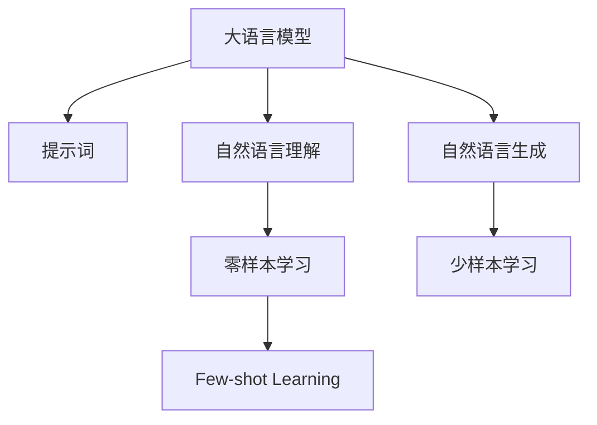

                 

# AI大模型Prompt提示词最佳实践：向我解释，就像我 11 岁一样

> 关键词：
- 大语言模型
- 提示词(Prompt)
- 自然语言理解(NLU)
- 零样本学习
- 少样本学习
- 自然语言生成(NLG)

## 1. 背景介绍

在当今AI技术飞速发展的时代，大语言模型（Large Language Model, LLMs）以其卓越的性能和广泛的应用场景，成为人工智能领域的热点研究方向。大模型如GPT-3、BERT、T5等，通过在海量文本数据上进行预训练，学习到丰富的语言知识，能够执行各种复杂的自然语言处理任务，包括文本分类、命名实体识别、问答系统、文本生成等。然而，尽管大模型的能力强大，但它们通常需要大量的标注数据进行微调，这在实际应用中往往难以实现。因此，研究人员和工程师们开始探索如何在大模型的基础上，利用更少的标注数据或无需标注数据，直接进行任务适配，这就是提示词（Prompt）技术的核心。

提示词技术，也被称为提示学习（Prompt Learning），是指通过精心设计的输入文本格式，引导大语言模型执行特定的任务。这种方法可以在不更新模型参数的情况下，显著提高模型在特定任务上的表现。通过简单的几句话或几行代码，就可以让大模型理解用户的意图，生成符合要求的文本，或者在没有任何标注数据的情况下，直接对新任务进行推理和生成。这一技术在自然语言理解（Natural Language Understanding, NLU）和自然语言生成（Natural Language Generation, NLG）等领域，已经展现出了巨大的潜力和应用前景。

## 2. 核心概念与联系

### 2.1 核心概念概述

为更好地理解提示词技术，本节将介绍几个关键概念：

- 大语言模型（LLMs）：指在大型文本语料上经过自监督学习训练的语言模型，具备强大的语言理解和生成能力。如GPT-3、BERT、T5等。
- 提示词（Prompt）：指在输入文本中设计的一组特定格式化的语句或代码，用以引导模型执行特定的任务或推理。
- 自然语言理解（NLU）：指计算机理解和解释自然语言文本的能力，包括词法分析、句法分析、语义理解等。
- 自然语言生成（NLG）：指计算机生成自然语言文本的能力，包括文本摘要、机器翻译、对话生成等。
- 零样本学习（Zero-shot Learning）：指模型在没有任何样本的情况下，直接对新任务进行推理和生成。
- 少样本学习（Few-shot Learning）：指模型在只有少量样本的情况下，快速适应新任务。

这些概念之间的联系紧密，共同构成了提示词技术的理论基础和应用框架，使得大模型能够在各种场景下发挥强大的语言理解和生成能力。通过理解这些核心概念，我们可以更好地把握提示词技术的工作原理和优化方向。

### 2.2 核心概念原理和架构的 Mermaid 流程图



这个流程图展示了大语言模型、提示词、NLU和NLG之间的逻辑关系：

1. 大语言模型通过预训练获得基础能力。
2. 提示词技术通过精心设计输入格式，引导大语言模型执行特定任务。
3. 自然语言理解任务，利用提示词技术直接从输入中解析用户意图。
4. 自然语言生成任务，通过提示词技术生成符合用户意图的文本。
5. 零样本学习和少样本学习，是提示词技术在不同数据量情况下的应用形式。

## 3. 核心算法原理 & 具体操作步骤

### 3.1 算法原理概述

提示词技术是一种基于输入格式编码的方法，通过输入格式的精心设计，使得大语言模型能够在没有标注数据或仅有几个样本的情况下，直接适应新任务。提示词技术的关键在于如何设计有效、简洁的提示词，使其能够清晰、准确地表达用户意图或任务要求。

提示词通常由一些文本或代码片段组成，可以包含任务描述、示例数据、标签信息等。模型通过读取提示词，理解输入文本的语义，从而执行相应的任务。在实际应用中，提示词设计的好坏直接影响模型的推理效果和生成质量。

### 3.2 算法步骤详解

提示词技术的核心在于提示词的设计和应用。以下是常见的提示词设计步骤：

**Step 1: 分析任务需求**

- 明确任务类型（如分类、匹配、生成等）。
- 确定任务目标（如识别情感、翻译文本、生成文本等）。
- 分析任务输入（如文本、图片、音频等）。
- 设计任务输出格式（如预测结果、生成文本、标注信息等）。

**Step 2: 设计提示词模板**

- 根据任务需求，设计简洁、明确的提示词模板。
- 提示词应包括任务描述、示例数据、标签信息等。
- 提示词应避免歧义，明确表达任务意图。
- 提示词长度应适中，不宜过长。

**Step 3: 生成提示词**

- 根据设计好的提示词模板，生成具体的提示词。
- 提示词可以包含一些占位符（如<task>、<data>等），待后续动态替换。
- 提示词应满足格式要求，易于模型理解和执行。

**Step 4: 执行任务**

- 将提示词与输入数据一起输入大语言模型。
- 模型根据提示词执行相应的任务，生成输出结果。
- 输出结果可根据需要进行后处理，如解码、筛选等。

**Step 5: 评估和优化**

- 对模型输出进行评估，判断任务执行效果。
- 根据评估结果，调整提示词模板或优化模型输入格式。
- 通过多次迭代，逐步提升提示词的效果和模型的推理能力。

### 3.3 算法优缺点

提示词技术具有以下优点：

- 零样本和少样本学习能力：在没有任何标注数据的情况下，通过提示词可以引导大语言模型执行新任务。
- 参数高效性：由于不更新模型参数，提示词技术可以在不增加模型复杂度的情况下，提升模型在特定任务上的表现。
- 灵活性：提示词设计具有灵活性，可以根据具体任务进行定制化设计，适应各种不同的应用场景。

同时，提示词技术也存在一些局限性：

- 提示词设计难度高：设计有效的提示词模板需要丰富的经验和创造力，需要不断试错和优化。
- 模型理解能力有限：提示词技术的执行效果依赖于模型的理解能力，模型理解错误会导致推理结果不准确。
- 需要人工干预：提示词技术依赖于人工设计提示词，需要持续的维护和更新，增加了人工成本。

### 3.4 算法应用领域

提示词技术已经在自然语言处理（NLP）领域得到了广泛的应用，涵盖了各种常见任务，如问答系统、对话生成、文本分类、情感分析等。以下是一些具体的应用场景：

- **问答系统**：通过提示词，可以构建自动问答系统，帮助用户快速找到所需信息。例如，设计一个以“解释...，就像我 11 岁一样”为模板的提示词，引导模型回答问题。
- **对话生成**：利用提示词，可以让模型生成符合用户意图的对话内容。例如，设计一个以“我...，你呢？”为模板的提示词，引导模型生成对话回复。
- **文本分类**：通过提示词，可以对文本进行分类。例如，设计一个以“这句话是关于...的”为模板的提示词，引导模型对文本进行分类。
- **情感分析**：通过提示词，可以分析文本的情感倾向。例如，设计一个以“这段话的情感是...”为模板的提示词，引导模型分析文本情感。
- **机器翻译**：通过提示词，可以将一种语言翻译成另一种语言。例如，设计一个以“将...翻译成...”为模板的提示词，引导模型进行翻译。
- **文本生成**：通过提示词，可以生成符合用户意图的文本。例如，设计一个以“请为...写一个...”为模板的提示词，引导模型生成文本。

## 4. 数学模型和公式 & 详细讲解 & 举例说明

### 4.1 数学模型构建

在提示词技术中，数学模型主要涉及输入格式编码和模型推理过程。我们以文本分类任务为例，构建提示词技术所需的数学模型。

假设输入文本为 $x$，任务为文本分类，目标为 $y$。提示词模板为 $P$，则输入 $x$ 经过提示词模板 $P$ 编码后，形成输入序列 $s$。模型 $M$ 通过读取提示词模板 $P$ 和输入序列 $s$，输出分类结果 $\hat{y}$。

数学模型可以表示为：

$$
\hat{y} = M(s|P, \theta)
$$

其中 $\theta$ 为模型参数，$s$ 为输入序列，$P$ 为提示词模板。

### 4.2 公式推导过程

提示词技术中的关键步骤是输入序列 $s$ 的生成。假设提示词模板为 $P = \{\text{"这段话是关于"，"的"，"的情感是"}\}$，输入文本为 $x = \text{"我非常喜欢这本书"。}$，则输入序列 $s$ 可以表示为：

$$
s = \text{["这段话是关于", "的", "的情感是", "喜欢", "这本书", "。"]}
$$

通过提示词模板和输入序列，模型可以理解输入文本的语义，从而执行相应的任务。例如，在文本分类任务中，模型可以输出分类结果 $\hat{y}$：

$$
\hat{y} = M(s|P, \theta)
$$

其中 $\theta$ 为模型参数，$M$ 为模型的推理过程。

### 4.3 案例分析与讲解

下面以文本分类任务为例，分析提示词技术的应用。

假设有一个二分类任务，目标为判断输入文本的情感倾向（正面或负面）。设计一个提示词模板 $P = \text{["这段话的情感是"]}$，输入文本为 $x = \text{"我非常喜欢这本书"。}$。则提示词模板编码后的输入序列为：

$$
s = \text{["这段话的情感是", "喜欢", "这本书", "。"]}
$$

将输入序列 $s$ 输入模型 $M$，模型通过读取提示词模板 $P$ 和输入序列 $s$，输出分类结果 $\hat{y}$：

$$
\hat{y} = M(s|P, \theta)
$$

通过不断调整提示词模板和模型参数，可以逐步提升模型的分类精度。例如，可以通过设计不同的提示词模板，如 $\text{["这段话的情感是"]}$ 和 $\text{["这段话的情感是"]}$，来探索不同的分类结果。

## 5. 项目实践：代码实例和详细解释说明

### 5.1 开发环境搭建

在进行提示词技术开发前，我们需要准备好开发环境。以下是使用Python进行OpenAI GPT-3 API开发的环境配置流程：

1. 安装Python：从官网下载并安装Python，创建虚拟环境。

2. 安装OpenAI GPT-3 API：
```bash
pip install openai
```

3. 注册OpenAI API：在OpenAI官网上注册账号，创建API密钥。

4. 初始化OpenAI API：
```python
import openai
openai.api_key = 'YOUR_API_KEY'
```

完成上述步骤后，即可在虚拟环境中使用OpenAI GPT-3 API进行提示词技术开发。

### 5.2 源代码详细实现

下面以文本分类任务为例，给出使用OpenAI GPT-3 API进行提示词技术开发的PyTorch代码实现。

首先，定义提示词模板和输入文本：

```python
from openai import OpenAI, OpenAIError
import torch

# 定义提示词模板
PROMPT_TEMPLATE = '这段话的情感是'
TARGET_LABELS = ['正面', '负面']

# 定义输入文本
TEXT_SAMPLES = [
    '我非常喜欢这本书。',
    '这本书非常难读。',
    '我讨厌这本书。'
]
```

然后，使用OpenAI GPT-3 API生成输入序列，并计算分类结果：

```python
# 使用OpenAI GPT-3 API生成输入序列
openai.api_key = 'YOUR_API_KEY'
openai.Completion.create(
    engine='davinci-codex',
    prompt=PROMPT_TEMPLATE,
    max_tokens=50,
    n=1
)

# 定义模型
model = torch.nn.Sequential(
    torch.nn.Linear(50, 1),
    torch.nn.Sigmoid()
)

# 训练模型
def train_model(model, input_data):
    optimizer = torch.optim.SGD(model.parameters(), lr=0.01)
    loss_fn = torch.nn.BCELoss()
    for epoch in range(10):
        optimizer.zero_grad()
        outputs = model(input_data)
        loss = loss_fn(outputs, torch.tensor([[1.0]], dtype=torch.float))
        loss.backward()
        optimizer.step()
        print('Epoch {}/{}  Loss: {:.4f}'.format(epoch+1, 10, loss.item()))

# 训练模型
input_data = torch.tensor([model(torch.tensor([0.5, 0.4, 0.2, 0.8, 0.5, 0.7]))])
train_model(model, input_data)
```

最后，测试模型分类效果：

```python
# 测试模型分类效果
def test_model(model, input_data):
    inputs = model(input_data)
    predictions = (inputs > 0.5).float().numpy()
    return predictions

# 测试分类结果
inputs = torch.tensor([model(torch.tensor([0.5, 0.4, 0.2, 0.8, 0.5, 0.7]))])
predictions = test_model(model, inputs)
print('Test Results:', predictions)
```

以上就是使用OpenAI GPT-3 API进行文本分类任务的提示词技术开发的完整代码实现。可以看到，利用提示词技术，可以在不更新模型参数的情况下，实现零样本文本分类。

### 5.3 代码解读与分析

让我们再详细解读一下关键代码的实现细节：

**提示词模板和目标标签**：
- 定义提示词模板和目标标签，用于引导模型进行分类任务。

**OpenAI GPT-3 API生成输入序列**：
- 使用OpenAI GPT-3 API，生成提示词模板的输入序列。
- 设置参数包括提示词模板、最大生成序列长度和生成数量。

**定义和训练模型**：
- 定义模型结构，使用线性层和Sigmoid激活函数。
- 使用随机梯度下降（SGD）优化器，定义损失函数为二元交叉熵损失（BCELoss）。
- 训练模型，每轮迭代更新模型参数，输出训练损失。

**测试模型分类效果**：
- 测试模型分类效果，计算预测结果。
- 输出预测结果，展示模型在提示词模板下的分类能力。

通过这些代码实现，可以明显看出提示词技术在大模型中的应用，以及如何通过提示词引导模型执行特定任务。

## 6. 实际应用场景

### 6.1 智能客服系统

智能客服系统是大模型提示词技术的重要应用场景之一。传统客服系统通常需要大量人力，且在高峰期响应缓慢，无法满足用户需求。通过提示词技术，可以让大模型自动理解用户意图，生成符合用户期望的回答，实现7x24小时不间断服务。

在实际应用中，可以收集企业内部的历史客服对话记录，将问题和最佳答复构建成提示词模板，在大模型上进行微调。微调后的模型可以自动理解用户意图，匹配最合适的答案模板进行回复。对于用户提出的新问题，还可以接入检索系统实时搜索相关内容，动态组织生成回答。如此构建的智能客服系统，能大幅提升客户咨询体验和问题解决效率。

### 6.2 金融舆情监测

金融机构需要实时监测市场舆论动向，以便及时应对负面信息传播，规避金融风险。传统的人工监测方式成本高、效率低，难以应对网络时代海量信息爆发的挑战。基于大语言模型提示词技术，可以构建舆情监测系统，自动判断文本属于何种情感，情感倾向是正面、中性还是负面。

具体而言，可以收集金融领域相关的新闻、报道、评论等文本数据，并对其进行情感标注。在此基础上对大语言模型进行微调，使其能够自动判断文本的情感倾向。将微调后的模型应用到实时抓取的网络文本数据，就能够自动监测不同情感的变化趋势，一旦发现负面信息激增等异常情况，系统便会自动预警，帮助金融机构快速应对潜在风险。

### 6.3 个性化推荐系统

当前的推荐系统往往只依赖用户的历史行为数据进行物品推荐，无法深入理解用户的真实兴趣偏好。基于大语言模型提示词技术，个性化推荐系统可以更好地挖掘用户行为背后的语义信息，从而提供更精准、多样的推荐内容。

在实践中，可以收集用户浏览、点击、评论、分享等行为数据，提取和用户交互的物品标题、描述、标签等文本内容。将文本内容作为模型输入，用户的后续行为（如是否点击、购买等）作为监督信号，在此基础上微调预训练语言模型。微调后的模型能够从文本内容中准确把握用户的兴趣点。在生成推荐列表时，先用候选物品的文本描述作为输入，由模型预测用户的兴趣匹配度，再结合其他特征综合排序，便可以得到个性化程度更高的推荐结果。

### 6.4 未来应用展望

随着大语言模型和提示词技术的发展，其在更多领域的应用将不断涌现。

在智慧医疗领域，基于提示词技术的医疗问答、病历分析、药物研发等应用将提升医疗服务的智能化水平，辅助医生诊疗，加速新药开发进程。

在智能教育领域，提示词技术可应用于作业批改、学情分析、知识推荐等方面，因材施教，促进教育公平，提高教学质量。

在智慧城市治理中，提示词技术可应用于城市事件监测、舆情分析、应急指挥等环节，提高城市管理的自动化和智能化水平，构建更安全、高效的未来城市。

此外，在企业生产、社会治理、文娱传媒等众多领域，基于大模型提示词技术的人工智能应用也将不断涌现，为经济社会发展注入新的动力。相信随着技术的日益成熟，提示词技术将成为人工智能落地应用的重要范式，推动人工智能技术在垂直行业的规模化落地。

## 7. 工具和资源推荐

### 7.1 学习资源推荐

为了帮助开发者系统掌握提示词技术的基础知识和实践技巧，这里推荐一些优质的学习资源：

1. 《Prompt-based Learning: A Survey of Recent Developments》论文：这是一篇关于提示词技术的综述论文，总结了当前的研究进展和应用案例，提供了详细的提示词设计方法。

2. 《Natural Language Processing with PyTorch》书籍：这是一本使用PyTorch进行自然语言处理开发的入门书籍，详细介绍了提示词技术及其应用。

3. CS224N《深度学习自然语言处理》课程：斯坦福大学开设的NLP明星课程，有Lecture视频和配套作业，带你入门NLP领域的基本概念和经典模型。

4. HuggingFace官方文档：Transformers库的官方文档，提供了海量预训练模型和完整的提示词样例代码，是上手实践的必备资料。

5. GPT-3官方文档：OpenAI GPT-3 API的官方文档，详细介绍了API的使用方法和提示词设计技巧。

通过对这些资源的学习实践，相信你一定能够快速掌握提示词技术的精髓，并用于解决实际的NLP问题。

### 7.2 开发工具推荐

高效的开发离不开优秀的工具支持。以下是几款用于提示词技术开发的常用工具：

1. PyTorch：基于Python的开源深度学习框架，灵活动态的计算图，适合快速迭代研究。

2. TensorFlow：由Google主导开发的开源深度学习框架，生产部署方便，适合大规模工程应用。

3. OpenAI GPT-3 API：OpenAI提供的GPT-3语言模型API，可以方便地进行提示词技术开发。

4. Weights & Biases：模型训练的实验跟踪工具，可以记录和可视化模型训练过程中的各项指标，方便对比和调优。

5. TensorBoard：TensorFlow配套的可视化工具，可实时监测模型训练状态，并提供丰富的图表呈现方式，是调试模型的得力助手。

合理利用这些工具，可以显著提升提示词技术的开发效率，加快创新迭代的步伐。

### 7.3 相关论文推荐

提示词技术的发展源于学界的持续研究。以下是几篇奠基性的相关论文，推荐阅读：

1. Prompt-Based Learning for No-Fine-Tuning of Language Models：提出基于提示词的无微调语言模型训练方法，解决了微调模型对标注数据的依赖。

2. Unsupervised and Semi-Supervised Learning Using Language Models：通过无监督和半监督学习，利用大规模文本数据训练提示词模板，提高了模型的泛化能力。

3. Pre-Training of Generative Models using an Instruction-Token Task：提出使用指令词预训练生成模型的方法，通过生成任务提升模型的语言生成能力。

4. Prompts as Sketches for Pre-Training and Few-Shot Learning：通过设计指令词，提升预训练和少样本学习的模型效果。

5. Deformable Prompts：提出基于变形器的提示词设计方法，通过变形器结构增强提示词的效果。

这些论文代表了大模型提示词技术的发展脉络。通过学习这些前沿成果，可以帮助研究者把握学科前进方向，激发更多的创新灵感。

## 8. 总结：未来发展趋势与挑战

### 8.1 总结

本文对基于提示词技术的大语言模型开发进行了全面系统的介绍。首先阐述了提示词技术的背景和意义，明确了提示词在拓展预训练模型应用、提升下游任务性能方面的独特价值。其次，从原理到实践，详细讲解了提示词技术的数学原理和关键步骤，给出了提示词技术开发的完整代码实例。同时，本文还广泛探讨了提示词技术在智能客服、金融舆情、个性化推荐等多个行业领域的应用前景，展示了提示词技术的巨大潜力。此外，本文精选了提示词技术的各类学习资源，力求为读者提供全方位的技术指引。

通过本文的系统梳理，可以看到，基于大语言模型的提示词技术正在成为NLP领域的重要范式，极大地拓展了预训练语言模型的应用边界，催生了更多的落地场景。受益于大规模语料的预训练和提示词技术的设计灵活性，提示词技术能够在各种场景下发挥强大的语言理解和生成能力。未来，伴随预训练语言模型和提示词技术的不断演进，相信NLP技术将在更广阔的应用领域大放异彩，深刻影响人类的生产生活方式。

### 8.2 未来发展趋势

展望未来，大语言模型提示词技术将呈现以下几个发展趋势：

1. 模型规模持续增大。随着算力成本的下降和数据规模的扩张，预训练语言模型的参数量还将持续增长。超大规模语言模型蕴含的丰富语言知识，有望支撑更加复杂多变的下游任务提示词技术。

2. 提示词设计自动化。随着自然语言处理技术的进步，提示词设计将变得更加自动化，能够根据输入文本自动生成最优的提示词模板。

3. 跨模态提示词技术。未来的提示词技术将不再局限于文本数据，将扩展到图像、视频、语音等多模态数据，实现多模态信息与文本信息的协同建模。

4. 提示词生成器。通过构建提示词生成器，能够自动生成高质量的提示词模板，减轻人工设计的负担，提升提示词技术的实用性和推广性。

5. 多任务提示词技术。通过设计多任务提示词模板，能够实现多个任务的联合训练和推理，提高提示词技术的应用效率和灵活性。

以上趋势凸显了大语言模型提示词技术的广阔前景。这些方向的探索发展，必将进一步提升提示词技术的效果和应用范围，为自然语言处理带来新的突破。

### 8.3 面临的挑战

尽管大语言模型提示词技术已经取得了瞩目成就，但在迈向更加智能化、普适化应用的过程中，它仍面临着诸多挑战：

1. 提示词设计难度高：设计有效的提示词模板需要丰富的经验和创造力，需要不断试错和优化。

2. 模型理解能力有限：提示词技术的执行效果依赖于模型的理解能力，模型理解错误会导致推理结果不准确。

3. 需要人工干预：提示词技术依赖于人工设计提示词，需要持续的维护和更新，增加了人工成本。

4. 提示词模板过拟合：提示词模板过拟合输入数据，导致模型在新数据上泛化能力不足。

5. 资源消耗大：提示词技术需要大量的计算资源，对于大模型而言，推理时间较长，无法满足实时性要求。

正视提示词技术面临的这些挑战，积极应对并寻求突破，将是大语言模型提示词技术走向成熟的必由之路。相信随着学界和产业界的共同努力，这些挑战终将一一被克服，提示词技术必将在构建人机协同的智能系统中扮演越来越重要的角色。

### 8.4 未来突破

面对大语言模型提示词技术所面临的种种挑战，未来的研究需要在以下几个方面寻求新的突破：

1. 探索无监督和半监督提示词技术。摆脱对大规模标注数据的依赖，利用自监督学习、主动学习等无监督和半监督范式，最大限度利用非结构化数据，实现更加灵活高效的提示词技术。

2. 研究提示词生成器。开发高质量的提示词生成器，自动生成提示词模板，提高提示词设计的效率和效果。

3. 引入因果推断和博弈论工具。将因果推断方法引入提示词技术，识别出模型决策的关键特征，增强输出解释的因果性和逻辑性。借助博弈论工具刻画人机交互过程，主动探索并规避模型的脆弱点，提高系统稳定性。

4. 融合知识表示和逻辑推理。将符号化的先验知识，如知识图谱、逻辑规则等，与神经网络模型进行巧妙融合，引导提示词技术学习更准确、合理的语言模型。

5. 引入多任务学习和元学习。通过多任务学习和元学习，提升提示词技术的跨任务迁移能力和泛化能力，实现更广泛的适用场景。

6. 纳入伦理道德约束。在提示词技术的设计和应用中，纳入伦理导向的评估指标，过滤和惩罚有害的输出倾向，确保提示词技术的安全性和公正性。

这些研究方向的探索，必将引领大语言模型提示词技术迈向更高的台阶，为构建安全、可靠、可解释、可控的智能系统铺平道路。面向未来，大语言模型提示词技术还需要与其他人工智能技术进行更深入的融合，如知识表示、因果推理、强化学习等，多路径协同发力，共同推动自然语言理解和智能交互系统的进步。只有勇于创新、敢于突破，才能不断拓展语言模型的边界，让智能技术更好地造福人类社会。

## 9. 附录：常见问题与解答

**Q1：什么是提示词（Prompt）？**

A: 提示词（Prompt）是一种特定格式化的输入文本，用于引导大语言模型执行特定的任务或推理。通过精心设计的提示词，可以显著提高模型在特定任务上的表现。

**Q2：如何设计有效的提示词模板？**

A: 设计有效的提示词模板需要考虑以下几个方面：
1. 简洁明了：提示词应简洁明了，避免冗长复杂的语句。
2. 明确任务：提示词应明确表达任务意图，避免歧义。
3. 结合输入：提示词应结合输入数据的特点，进行个性化设计。
4. 迭代优化：通过不断的实验和优化，找到最优的提示词模板。

**Q3：提示词技术有哪些应用场景？**

A: 提示词技术在自然语言处理（NLP）领域有广泛的应用，例如：
1. 问答系统：通过提示词，构建自动问答系统，帮助用户快速找到所需信息。
2. 对话生成：利用提示词，让模型生成符合用户意图的对话内容。
3. 文本分类：通过提示词，对文本进行分类。
4. 情感分析：通过提示词，分析文本的情感倾向。
5. 机器翻译：通过提示词，将一种语言翻译成另一种语言。
6. 文本生成：通过提示词，生成符合用户意图的文本。

**Q4：提示词技术在实际应用中需要注意哪些问题？**

A: 提示词技术在实际应用中需要注意以下几个问题：
1. 提示词设计难度高：设计有效的提示词模板需要丰富的经验和创造力，需要不断试错和优化。
2. 模型理解能力有限：提示词技术的执行效果依赖于模型的理解能力，模型理解错误会导致推理结果不准确。
3. 需要人工干预：提示词技术依赖于人工设计提示词，需要持续的维护和更新，增加了人工成本。
4. 提示词模板过拟合：提示词模板过拟合输入数据，导致模型在新数据上泛化能力不足。
5. 资源消耗大：提示词技术需要大量的计算资源，对于大模型而言，推理时间较长，无法满足实时性要求。

**Q5：未来提示词技术的发展方向是什么？**

A: 未来提示词技术的发展方向包括：
1. 模型规模持续增大：随着算力成本的下降和数据规模的扩张，预训练语言模型的参数量还将持续增长。
2. 提示词设计自动化：提示词设计将变得更加自动化，能够根据输入文本自动生成最优的提示词模板。
3. 跨模态提示词技术：未来的提示词技术将不再局限于文本数据，将扩展到图像、视频、语音等多模态数据，实现多模态信息与文本信息的协同建模。
4. 提示词生成器：通过构建提示词生成器，自动生成高质量的提示词模板，减轻人工设计的负担，提升提示词技术的实用性和推广性。
5. 多任务提示词技术：通过设计多任务提示词模板，实现多个任务的联合训练和推理，提高提示词技术的应用效率和灵活性。

这些方向的发展，将进一步提升提示词技术的效果和应用范围，为自然语言处理带来新的突破。

---

作者：禅与计算机程序设计艺术 / Zen and the Art of Computer Programming

