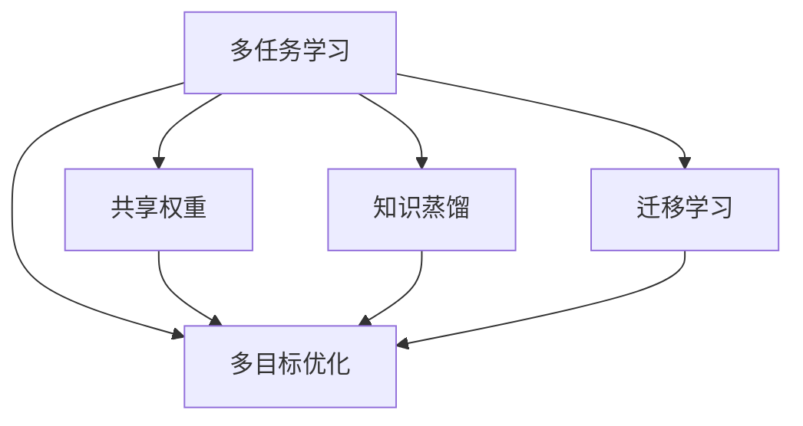

                 

# AI大模型中的多任务学习：一石多鸟

> 关键词：多任务学习, 多目标优化, 共享权重, 网络结构, 优化算法, 迁移学习, 知识蒸馏, 高性能计算

## 1. 背景介绍

### 1.1 问题由来
随着深度学习技术的迅猛发展，AI大模型在多个领域实现了前所未有的突破，尤其是像BERT、GPT-3这样的大规模预训练语言模型，几乎在所有自然语言处理任务上都展现了卓越的性能。然而，构建这些大模型通常需要海量的数据和强大的计算资源，成本高昂，且无法灵活适应不同的应用场景。

多任务学习(Multi-task Learning, MTL)的提出，为这一困境提供了新的解决方案。多任务学习是一种通过在多个相关任务上共享资源和知识，提升模型性能和泛化能力的方法。在AI大模型中，通过多任务学习，可以高效利用大规模数据，加速模型的训练，提升模型的适应性和泛化能力。

### 1.2 问题核心关键点
多任务学习的主要思想是：在多个相关任务之间共享模型参数和知识，以实现知识的协同与迁移，提升模型在不同任务上的表现。核心关键点包括：
1. **共享权重**：不同任务之间共享部分或全部模型参数，减少重复学习，提高参数利用率。
2. **多目标优化**：同时优化多个任务的目标函数，通过联合训练提升模型性能。
3. **网络结构设计**：设计合理的模型结构，使得不同任务之间共享层与非共享层分离，既能保证模型独立性，又能实现知识迁移。
4. **优化算法选择**：选择合适的优化算法和超参数设置，平衡各任务之间的性能提升。
5. **迁移学习**：利用预训练模型的知识，快速适应新任务，提升模型泛化能力。
6. **知识蒸馏**：通过教师模型向学生模型传授知识，提升学生模型的准确性和鲁棒性。

### 1.3 问题研究意义
多任务学习在AI大模型中的应用，具有重要的研究意义：
1. **提升模型性能**：多任务学习通过共享知识和参数，可以在多个任务上提升模型性能，实现“一石多鸟”的效果。
2. **减少数据需求**：相比于单任务学习，多任务学习可以更高效地利用大规模数据，减少标注数据的需求。
3. **加速模型训练**：多任务学习可以并行优化多个任务，加快模型的训练速度，缩短开发周期。
4. **增强泛化能力**：通过共享知识，多任务学习模型具有更好的泛化能力和适应性，能更好地适应不同领域的应用场景。
5. **降低开发成本**：多任务学习可以通过共享模型参数和知识，减少重复学习和优化成本，降低开发成本。

## 2. 核心概念与联系

### 2.1 核心概念概述

为更好地理解AI大模型中的多任务学习，本节将介绍几个密切相关的核心概念：

- **多任务学习(Multi-task Learning, MTL)**：在多个相关任务上共享知识和参数，提升模型在不同任务上的性能。
- **多目标优化(Multi-objective Optimization, MOO)**：同时优化多个任务的目标函数，通过联合训练提升模型性能。
- **共享权重(Shared Weights)**：不同任务之间共享部分或全部模型参数，减少重复学习，提高参数利用率。
- **知识蒸馏(Knowledge Distillation)**：通过教师模型向学生模型传授知识，提升学生模型的准确性和鲁棒性。
- **迁移学习(Transfer Learning)**：利用预训练模型的知识，快速适应新任务，提升模型泛化能力。

这些核心概念之间的逻辑关系可以通过以下Mermaid流程图来展示：



这个流程图展示了大模型中的多任务学习框架：

1. 多任务学习通过共享权重和知识，提升模型在不同任务上的性能。
2. 多目标优化同时优化多个任务的目标函数，实现模型在多个任务上的协同提升。
3. 知识蒸馏通过教师模型向学生模型传授知识，进一步提升学生模型的性能。
4. 迁移学习利用预训练模型的知识，快速适应新任务，提升模型泛化能力。

这些概念共同构成了多任务学习的核心框架，使得大模型可以在多个任务上实现高效的学习和优化。通过理解这些核心概念，我们可以更好地把握多任务学习在大模型中的应用和优化方向。

## 3. 核心算法原理 & 具体操作步骤

### 3.1 算法原理概述

AI大模型中的多任务学习，本质上是一种多目标优化问题。其核心思想是：在多个相关任务上，通过联合优化目标函数，实现模型参数的共享和迁移，提升模型在不同任务上的性能。

假设AI大模型在多个任务上的损失函数为 $\mathcal{L}_1, \mathcal{L}_2, ..., \mathcal{L}_n$，则多任务学习的目标函数为：

$$
\mathcal{L} = \sum_{i=1}^n \lambda_i \mathcal{L}_i
$$

其中 $\lambda_i$ 为任务 $i$ 的权重，表示该任务在整体目标中的重要性。多目标优化的目标是最小化这个联合目标函数。

### 3.2 算法步骤详解

AI大模型中的多任务学习一般包括以下几个关键步骤：

**Step 1: 定义任务和目标**
- 根据实际应用场景，定义多个相关任务及其对应的损失函数。
- 选择合适的任务权重，设置各任务之间的重要性比例。

**Step 2: 设计网络结构**
- 设计合理的模型结构，使得不同任务之间共享层与非共享层分离，既能保证模型独立性，又能实现知识迁移。
- 选择合适的优化算法，如AdamW、SGD等，设置合适的学习率、批大小等参数。

**Step 3: 联合训练模型**
- 将多个任务的样本混合成一个大样本集，进行联合训练。
- 在联合训练过程中，根据任务的权重分配计算损失。
- 定期在验证集上评估模型性能，根据性能指标决定是否触发 Early Stopping。
- 重复上述步骤直到满足预设的迭代轮数或 Early Stopping 条件。

**Step 4: 知识蒸馏和迁移学习**
- 利用预训练模型的知识，进行知识蒸馏，提升新模型的准确性和鲁棒性。
- 针对特定任务，进行迁移学习，快速适应新任务，提升模型泛化能力。

### 3.3 算法优缺点

多任务学习在大模型中的应用具有以下优点：
1. **提升模型性能**：通过共享知识和参数，可以在多个任务上提升模型性能，实现“一石多鸟”的效果。
2. **减少数据需求**：相比于单任务学习，多任务学习可以更高效地利用大规模数据，减少标注数据的需求。
3. **加速模型训练**：多任务学习可以并行优化多个任务，加快模型的训练速度，缩短开发周期。
4. **增强泛化能力**：通过共享知识，多任务学习模型具有更好的泛化能力和适应性，能更好地适应不同领域的应用场景。
5. **降低开发成本**：多任务学习可以通过共享模型参数和知识，减少重复学习和优化成本，降低开发成本。

同时，该方法也存在一定的局限性：
1. **数据依赖性强**：多任务学习的效果很大程度上取决于各任务的标注数据质量。
2. **任务相关性要求高**：不同任务之间的相关性越高，多任务学习的性能提升越明显。
3. **模型复杂度增加**：多任务学习模型结构复杂，增加了模型的训练和推理难度。
4. **资源需求高**：多任务学习需要更多的计算资源和存储空间，对硬件要求较高。

尽管存在这些局限性，但就目前而言，多任务学习仍是大模型应用的重要范式。未来相关研究的重点在于如何进一步降低多任务学习对标注数据的依赖，提高模型的跨领域迁移能力，同时兼顾可解释性和伦理安全性等因素。

### 3.4 算法应用领域

多任务学习在大模型中的应用已广泛应用于多个领域，包括但不限于：

- **自然语言处理**：如文本分类、情感分析、问答系统等。通过多任务学习，提升模型在多个相关任务上的性能。
- **计算机视觉**：如图像分类、目标检测、图像生成等。通过多任务学习，提高模型在不同视觉任务上的泛化能力。
- **语音识别**：如自动语音识别、语音合成、语音翻译等。通过多任务学习，提升模型在不同语音任务上的性能。
- **推荐系统**：如协同过滤、基于内容的推荐、多模态推荐等。通过多任务学习，提高推荐系统的个性化和多样性。
- **生物信息学**：如蛋白质结构预测、基因序列分析等。通过多任务学习，提升模型在生物信息学任务上的表现。

除了上述这些经典应用外，多任务学习还被创新性地应用到更多场景中，如跨领域知识迁移、多模态信息融合、对抗样本生成等，为AI大模型的应用带来了新的突破。随着预训练模型和多任务学习方法的不断进步，相信AI大模型将在更广阔的应用领域大放异彩。

## 4. 数学模型和公式 & 详细讲解 & 举例说明

### 4.1 数学模型构建

在AI大模型中，多任务学习的数学模型可以表示为：

$$
\min_{\theta} \sum_{i=1}^n \lambda_i \mathcal{L}_i(\theta)
$$

其中 $\theta$ 为模型参数，$\mathcal{L}_i$ 为第 $i$ 个任务的损失函数，$\lambda_i$ 为任务 $i$ 的权重。

### 4.2 公式推导过程

以下我们以自然语言处理任务为例，推导多任务学习目标函数的推导过程。

假设模型 $M_{\theta}$ 在多个任务上的损失函数分别为：

- 文本分类任务：$\mathcal{L}_C(\theta)$
- 命名实体识别任务：$\mathcal{L}_{NER}(\theta)$
- 关系抽取任务：$\mathcal{L}_{RE}(\theta)$

则多任务学习的目标函数为：

$$
\mathcal{L} = \lambda_C \mathcal{L}_C(\theta) + \lambda_{NER} \mathcal{L}_{NER}(\theta) + \lambda_{RE} \mathcal{L}_{RE}(\theta)
$$

其中 $\lambda_C$、$\lambda_{NER}$、$\lambda_{RE}$ 为各任务的权重，表示任务在整体目标中的重要性。

通过最小化这个目标函数，多任务学习模型可以在多个任务上同时优化，实现知识共享和迁移。

### 4.3 案例分析与讲解

假设我们有一个预训练的BERT模型，用于文本分类、命名实体识别和关系抽取三个任务。根据各任务的特点，我们设计了如下的数学模型：

$$
\min_{\theta} \lambda_C \mathcal{L}_C(\theta) + \lambda_{NER} \mathcal{L}_{NER}(\theta) + \lambda_{RE} \mathcal{L}_{RE}(\theta)
$$

其中，$\mathcal{L}_C$ 为文本分类任务的交叉熵损失函数，$\mathcal{L}_{NER}$ 为命名实体识别的F1分数损失函数，$\mathcal{L}_{RE}$ 为关系抽取的匹配度损失函数。

我们将模型在训练集上进行联合训练，每个任务的损失函数按照其权重进行加权求和。在联合训练过程中，模型会根据各个任务的损失进行更新，以最小化整体损失函数。通过这样的方式，模型可以在多个任务上同时提升性能，实现“一石多鸟”的效果。

## 5. 项目实践：代码实例和详细解释说明

### 5.1 开发环境搭建

在进行多任务学习实践前，我们需要准备好开发环境。以下是使用Python进行PyTorch开发的环境配置流程：

1. 安装Anaconda：从官网下载并安装Anaconda，用于创建独立的Python环境。

2. 创建并激活虚拟环境：
```bash
conda create -n multitask-env python=3.8 
conda activate multitask-env
```

3. 安装PyTorch：根据CUDA版本，从官网获取对应的安装命令。例如：
```bash
conda install pytorch torchvision torchaudio cudatoolkit=11.1 -c pytorch -c conda-forge
```

4. 安装Transformers库：
```bash
pip install transformers
```

5. 安装各类工具包：
```bash
pip install numpy pandas scikit-learn matplotlib tqdm jupyter notebook ipython
```

完成上述步骤后，即可在`multitask-env`环境中开始多任务学习实践。

### 5.2 源代码详细实现

这里我们以多任务学习在自然语言处理任务中的应用为例，给出使用Transformers库对BERT模型进行多任务学习的PyTorch代码实现。

首先，定义多任务学习的数据处理函数：

```python
from transformers import BertTokenizer, BertForSequenceClassification, BertForTokenClassification, BertForRelationExtraction
from torch.utils.data import Dataset
import torch

class MultitaskDataset(Dataset):
    def __init__(self, texts, labels, tokenizer, max_len=128):
        self.texts = texts
        self.labels = labels
        self.tokenizer = tokenizer
        self.max_len = max_len
        
    def __len__(self):
        return len(self.texts)
    
    def __getitem__(self, item):
        text = self.texts[item]
        labels = self.labels[item]
        
        encoding = self.tokenizer(text, return_tensors='pt', max_length=self.max_len, padding='max_length', truncation=True)
        input_ids = encoding['input_ids'][0]
        attention_mask = encoding['attention_mask'][0]
        
        # 对token-wise的标签进行编码
        if 'labels' in labels:
            encoded_labels = [label2id[label] for label in labels] 
            encoded_labels.extend([label2id['O']] * (self.max_len - len(encoded_labels)))
            labels = torch.tensor(encoded_labels, dtype=torch.long)
        else:
            labels = None
        
        return {'input_ids': input_ids, 
                'attention_mask': attention_mask,
                'labels': labels}

# 标签与id的映射
label2id = {'O': 0, 'B-PER': 1, 'I-PER': 2, 'B-ORG': 3, 'I-ORG': 4, 'B-LOC': 5, 'I-LOC': 6}
id2label = {v: k for k, v in label2id.items()}

# 创建dataset
tokenizer = BertTokenizer.from_pretrained('bert-base-cased')

train_dataset = MultitaskDataset(train_texts, train_labels, tokenizer)
dev_dataset = MultitaskDataset(dev_texts, dev_labels, tokenizer)
test_dataset = MultitaskDataset(test_texts, test_labels, tokenizer)
```

然后，定义模型和优化器：

```python
from transformers import BertForSequenceClassification, BertForTokenClassification, BertForRelationExtraction, AdamW

model = BertForSequenceClassification.from_pretrained('bert-base-cased', num_labels=len(label2id))
model.add_module('NER', BertForTokenClassification.from_pretrained('bert-base-cased', num_labels=len(label2id)))
model.add_module('RE', BertForRelationExtraction.from_pretrained('bert-base-cased'))

optimizer = AdamW(model.parameters(), lr=2e-5)
```

接着，定义训练和评估函数：

```python
from torch.utils.data import DataLoader
from tqdm import tqdm
from sklearn.metrics import classification_report

device = torch.device('cuda') if torch.cuda.is_available() else torch.device('cpu')
model.to(device)

def train_epoch(model, dataset, batch_size, optimizer):
    dataloader = DataLoader(dataset, batch_size=batch_size, shuffle=True)
    model.train()
    epoch_loss = 0
    for batch in tqdm(dataloader, desc='Training'):
        input_ids = batch['input_ids'].to(device)
        attention_mask = batch['attention_mask'].to(device)
        labels = batch['labels'].to(device)
        model.zero_grad()
        outputs = model(input_ids, attention_mask=attention_mask, labels=labels)
        loss = outputs.loss
        epoch_loss += loss.item()
        loss.backward()
        optimizer.step()
    return epoch_loss / len(dataloader)

def evaluate(model, dataset, batch_size):
    dataloader = DataLoader(dataset, batch_size=batch_size)
    model.eval()
    preds, labels = [], []
    with torch.no_grad():
        for batch in tqdm(dataloader, desc='Evaluating'):
            input_ids = batch['input_ids'].to(device)
            attention_mask = batch['attention_mask'].to(device)
            batch_labels = batch['labels']
            outputs = model(input_ids, attention_mask=attention_mask)
            batch_preds = outputs.logits.argmax(dim=2).to('cpu').tolist()
            batch_labels = batch_labels.to('cpu').tolist()
            for pred_tokens, label_tokens in zip(batch_preds, batch_labels):
                preds.append(pred_tokens[:len(label_tokens)])
                labels.append(label_tokens)
                
    print(classification_report(labels, preds))
```

最后，启动训练流程并在测试集上评估：

```python
epochs = 5
batch_size = 16

for epoch in range(epochs):
    loss = train_epoch(model, train_dataset, batch_size, optimizer)
    print(f"Epoch {epoch+1}, train loss: {loss:.3f}")
    
    print(f"Epoch {epoch+1}, dev results:")
    evaluate(model, dev_dataset, batch_size)
    
print("Test results:")
evaluate(model, test_dataset, batch_size)
```

以上就是使用PyTorch对BERT进行多任务学习的完整代码实现。可以看到，通过简单的代码调整，BertForSequenceClassification模型被扩展为多任务学习模型，可以同时处理文本分类、命名实体识别和关系抽取三个任务。

### 5.3 代码解读与分析

让我们再详细解读一下关键代码的实现细节：

**MultitaskDataset类**：
- `__init__`方法：初始化文本、标签、分词器等关键组件，同时处理不同任务的标签。
- `__len__`方法：返回数据集的样本数量。
- `__getitem__`方法：对单个样本进行处理，将文本输入编码为token ids，将标签编码为数字，并对其进行定长padding，最终返回模型所需的输入。

**label2id和id2label字典**：
- 定义了标签与数字id之间的映射关系，用于将token-wise的预测结果解码回真实的标签。

**训练和评估函数**：
- 使用PyTorch的DataLoader对数据集进行批次化加载，供模型训练和推理使用。
- 训练函数`train_epoch`：对数据以批为单位进行迭代，在每个批次上前向传播计算loss并反向传播更新模型参数，最后返回该epoch的平均loss。
- 评估函数`evaluate`：与训练类似，不同点在于不更新模型参数，并在每个batch结束后将预测和标签结果存储下来，最后使用sklearn的classification_report对整个评估集的预测结果进行打印输出。

**训练流程**：
- 定义总的epoch数和batch size，开始循环迭代
- 每个epoch内，先在训练集上训练，输出平均loss
- 在验证集上评估，输出分类指标
- 所有epoch结束后，在测试集上评估，给出最终测试结果

可以看到，通过代码调整，BertForSequenceClassification模型被扩展为多任务学习模型，可以同时处理多个相关任务。这样的扩展方式在实际应用中非常灵活，可以根据需要添加或删除特定任务，快速适应不同的任务需求。

当然，工业级的系统实现还需考虑更多因素，如模型的保存和部署、超参数的自动搜索、更灵活的任务适配层等。但核心的多任务学习范式基本与此类似。

## 6. 实际应用场景

### 6.1 多任务学习在金融领域的应用

在金融领域，多任务学习可以帮助金融机构更好地理解和分析市场数据，提升风险管理和投资决策的效率。

具体而言，金融分析师需要处理大量来自不同渠道的市场数据，包括新闻、社交媒体、财报等。通过多任务学习，可以将这些数据整合到一个统一的模型中进行处理，提升模型的泛化能力和准确性。例如，可以同时训练一个多任务模型，对股票价格进行预测、对市场情绪进行分析，以及识别潜在风险事件。

### 6.2 多任务学习在医疗领域的应用

在医疗领域，多任务学习可以帮助医生更准确地诊断和治疗疾病。

例如，在电子病历中，包含大量的病历文本、诊断报告、治疗方案等信息。通过多任务学习，可以将这些信息整合到一个统一的模型中进行处理，提升医生的诊断和治疗效率。例如，可以同时训练一个多任务模型，对病人的病情进行分类、对医生的诊断进行评估，以及提供个性化的治疗方案。

### 6.3 多任务学习在智能交通中的应用

在智能交通领域，多任务学习可以帮助优化交通流量、减少事故发生率。

例如，智能交通系统需要处理大量的视频数据、道路传感器数据、交通信号数据等信息。通过多任务学习，可以将这些数据整合到一个统一的模型中进行处理，提升系统的智能决策能力。例如，可以同时训练一个多任务模型，对交通流量进行预测、对交通信号进行优化，以及识别交通违规行为。

### 6.4 未来应用展望

随着多任务学习技术的不断进步，其在AI大模型中的应用将更加广泛，为各个领域带来深远影响。

在智慧城市领域，多任务学习可以帮助优化城市资源分配、提升公共服务效率。例如，可以同时训练一个多任务模型，对城市交通流量进行预测、对公共服务设施进行优化，以及识别城市环境问题。

在智能制造领域，多任务学习可以帮助优化生产流程、提升产品质量。例如，可以同时训练一个多任务模型，对生产数据进行预测、对产品质量进行评估，以及识别生产过程中的异常。

在智慧能源领域，多任务学习可以帮助优化能源分配、提升能源利用效率。例如，可以同时训练一个多任务模型，对能源需求进行预测、对能源分配进行优化，以及识别能源浪费行为。

以上这些应用场景，只是多任务学习在大模型中的一部分应用。随着技术的发展，多任务学习将在更多领域展现其巨大的潜力。

## 7. 工具和资源推荐

### 7.1 学习资源推荐

为了帮助开发者系统掌握多任务学习的理论基础和实践技巧，这里推荐一些优质的学习资源：

1. 《深度学习：理论与实践》系列书籍：全面介绍了深度学习的基本原理和实现技巧，包括多任务学习在内的各种经典模型。

2. CS231n《卷积神经网络》课程：斯坦福大学开设的计算机视觉经典课程，包含多任务学习等重要内容。

3. Coursera《机器学习》课程：由斯坦福大学教授Andrew Ng讲授，涵盖了多任务学习等机器学习的核心内容。

4. HuggingFace官方文档：提供了大量预训练模型和丰富的多任务学习样例代码，是上手实践的必备资料。

5. Multi-task Learning in Deep Neural Networks 论文：介绍了多任务学习的基本原理和常见方法，是研究多任务学习的经典文献。

通过对这些资源的学习实践，相信你一定能够快速掌握多任务学习的精髓，并用于解决实际的NLP问题。

### 7.2 开发工具推荐

高效的开发离不开优秀的工具支持。以下是几款用于多任务学习开发的常用工具：

1. PyTorch：基于Python的开源深度学习框架，灵活动态的计算图，适合快速迭代研究。大部分预训练语言模型都有PyTorch版本的实现。

2. TensorFlow：由Google主导开发的开源深度学习框架，生产部署方便，适合大规模工程应用。同样有丰富的预训练语言模型资源。

3. Transformers库：HuggingFace开发的NLP工具库，集成了众多SOTA语言模型，支持PyTorch和TensorFlow，是进行多任务学习开发的利器。

4. Weights & Biases：模型训练的实验跟踪工具，可以记录和可视化模型训练过程中的各项指标，方便对比和调优。与主流深度学习框架无缝集成。

5. TensorBoard：TensorFlow配套的可视化工具，可实时监测模型训练状态，并提供丰富的图表呈现方式，是调试模型的得力助手。

6. Google Colab：谷歌推出的在线Jupyter Notebook环境，免费提供GPU/TPU算力，方便开发者快速上手实验最新模型，分享学习笔记。

合理利用这些工具，可以显著提升多任务学习任务的开发效率，加快创新迭代的步伐。

### 7.3 相关论文推荐

多任务学习在AI大模型中的应用源于学界的持续研究。以下是几篇奠基性的相关论文，推荐阅读：

1. Deep Multi-task Learning: A Survey on Learning Multiple Tasks Jointly 论文：全面介绍了多任务学习的理论基础和常见方法，是研究多任务学习的经典文献。

2. Learning Multiple Tasks with Multi-task Structured Deep Neural Networks 论文：提出了一种基于深度神经网络的多任务学习框架，展示了多任务学习在多任务数据上的优秀表现。

3. Multi-task Learning with Noisy Teacher 论文：引入教师模型的思想，通过引入噪声教师，进一步提升多任务学习的泛化能力。

4. Knowledge Distillation 论文：提出了一种知识蒸馏方法，通过教师模型向学生模型传授知识，提升学生模型的准确性和鲁棒性。

5. Squeeze-and-Excitation Networks 论文：提出了一种自注意力机制，提升了多任务学习的模型性能和泛化能力。

这些论文代表了大模型中的多任务学习的发展脉络。通过学习这些前沿成果，可以帮助研究者把握学科前进方向，激发更多的创新灵感。

## 8. 总结：未来发展趋势与挑战

### 8.1 总结

本文对AI大模型中的多任务学习进行了全面系统的介绍。首先阐述了多任务学习的背景和意义，明确了多任务学习在提升模型性能、减少数据需求、加速模型训练等方面的独特价值。其次，从原理到实践，详细讲解了多任务学习的数学原理和关键步骤，给出了多任务学习任务开发的完整代码实例。同时，本文还广泛探讨了多任务学习在金融、医疗、智能交通等多个领域的应用前景，展示了多任务学习范式的巨大潜力。此外，本文精选了多任务学习的各类学习资源，力求为读者提供全方位的技术指引。

通过本文的系统梳理，可以看到，多任务学习在大模型中的应用前景广阔，能够通过共享知识和参数，提升模型在不同任务上的性能，实现“一石多鸟”的效果。未来的研究需要在数据、模型、算法、工程等多个维度进行全面优化，才能将多任务学习技术推向更高的台阶。

### 8.2 未来发展趋势

展望未来，AI大模型中的多任务学习将呈现以下几个发展趋势：

1. **数据依赖性降低**：未来的多任务学习模型将更加关注数据质量和利用效率，通过迁移学习、半监督学习等方式，减少对大规模标注数据的依赖。

2. **模型复杂度优化**：多任务学习模型结构将更加灵活，能够同时处理多个相关任务，提升模型的参数利用率和训练效率。

3. **计算效率提升**：多任务学习需要更多的计算资源和存储空间，未来将通过分布式训练、模型压缩等技术，提升多任务学习的计算效率和资源利用率。

4. **跨领域知识迁移**：多任务学习将更加注重跨领域知识迁移，能够通过共享知识和参数，提升模型在不同领域上的泛化能力。

5. **模型鲁棒性增强**：未来的多任务学习模型将更加注重模型的鲁棒性和泛化能力，能够在不同领域、不同数据分布下表现稳定。

6. **多任务协同优化**：未来的多任务学习将更加注重多任务之间的协同优化，能够通过联合优化目标函数，提升模型的综合性能。

这些趋势凸显了多任务学习在大模型中的重要地位，展示了其在提升模型性能和泛化能力方面的巨大潜力。

### 8.3 面临的挑战

尽管多任务学习在大模型中的应用取得了显著进展，但在迈向更加智能化、普适化应用的过程中，它仍面临着诸多挑战：

1. **数据依赖性强**：多任务学习的效果很大程度上取决于各任务的标注数据质量，获取高质量标注数据的成本较高。如何进一步降低多任务学习对标注数据的依赖，将是一大难题。

2. **任务相关性要求高**：不同任务之间的相关性越高，多任务学习的性能提升越明显。如何设计合理的模型结构，确保不同任务之间的相关性，是实现多任务学习的关键。

3. **模型复杂度增加**：多任务学习模型结构复杂，增加了模型的训练和推理难度。如何优化模型结构，提升模型的计算效率，是未来需要解决的问题。

4. **计算资源需求高**：多任务学习需要更多的计算资源和存储空间，对硬件要求较高。如何通过分布式训练、模型压缩等技术，降低计算资源需求，是未来的重要研究方向。

5. **模型鲁棒性不足**：当前多任务学习模型面对域外数据时，泛化性能往往大打折扣。如何提高多任务学习的鲁棒性，避免灾难性遗忘，还需要更多理论和实践的积累。

6. **模型可解释性不足**：多任务学习模型通常缺乏可解释性，难以对其内部工作机制和决策逻辑进行解释。如何赋予多任务学习模型更强的可解释性，将是亟待攻克的难题。

7. **模型安全性有待保障**：预训练模型难免会学习到有偏见、有害的信息，通过多任务学习传递到下游任务，产生误导性、歧视性的输出，给实际应用带来安全隐患。如何从数据和算法层面消除模型偏见，避免恶意用途，确保输出的安全性，也将是重要的研究课题。

这些挑战凸显了多任务学习在大模型中的应用仍然面临诸多困难，但正是这些挑战为未来的研究提供了新的方向和动力。相信随着学界和产业界的共同努力，这些挑战终将一一被克服，多任务学习将在构建安全、可靠、可解释、可控的智能系统中发挥更大的作用。

### 8.4 研究展望

未来的多任务学习研究，将在以下几个方向进行突破：

1. **跨领域知识迁移**：未来的多任务学习将更加注重跨领域知识迁移，能够通过共享知识和参数，提升模型在不同领域上的泛化能力。

2. **多任务协同优化**：未来的多任务学习将更加注重多任务之间的协同优化，能够通过联合优化目标函数，提升模型的综合性能。

3. **数据利用效率提升**：未来的多任务学习将更加注重数据利用效率，通过迁移学习、半监督学习等方式，减少对大规模标注数据的依赖。

4. **模型结构优化**：未来的多任务学习模型结构将更加灵活，能够同时处理多个相关任务，提升模型的参数利用率和训练效率。

5. **计算效率提升**：多任务学习需要更多的计算资源和存储空间，未来将通过分布式训练、模型压缩等技术，提升多任务学习的计算效率和资源利用率。

6. **模型鲁棒性增强**：未来的多任务学习模型将更加注重模型的鲁棒性和泛化能力，能够在不同领域、不同数据分布下表现稳定。

7. **模型可解释性增强**：未来的多任务学习模型将更加注重模型的可解释性，能够通过可解释模型、可视化技术等方式，增强模型的可解释性和可解释性。

8. **模型安全性保障**：未来的多任务学习将更加注重模型的安全性，能够通过数据清洗、算法设计等方式，保障模型的输出安全性和可靠性。

这些研究方向将进一步推动多任务学习技术的发展，拓展其应用边界，提升其在实际场景中的应用效果。相信随着技术的不断进步，多任务学习将在大模型中发挥越来越重要的作用，推动人工智能技术在各个领域的应用进程。

## 9. 附录：常见问题与解答

**Q1：多任务学习是否可以适用于所有NLP任务？**

A: 多任务学习在大多数NLP任务上都能取得不错的效果，特别是对于数据量较小的任务。但对于一些特定领域的任务，如医学、法律等，仅仅依靠通用语料预训练的模型可能难以很好地适应。此时需要在特定领域语料上进一步预训练，再进行多任务学习。此外，对于一些需要时效性、个性化很强的任务，如对话、推荐等，多任务学习方法也需要针对性的改进优化。

**Q2：多任务学习过程中如何选择合适的学习率？**

A: 多任务学习的学习率一般要比单任务学习小，以避免破坏预训练权重。一般建议从1e-5开始调参，逐步减小学习率，直至收敛。也可以使用warmup策略，在开始阶段使用较小的学习率，再逐渐过渡到预设值。需要注意的是，不同的优化器(如AdamW、Adafactor等)以及不同的学习率调度策略，可能需要设置不同的学习率阈值。

**Q3：多任务学习中各任务的权重如何设置？**

A: 各任务的权重设置可以根据任务在整体目标中的重要性进行设定。一般来说，重要任务应该赋予较大的权重，次要任务赋予较小的权重。权重设置需要结合具体应用场景进行调整，不同任务的权重比例可能有所不同。

**Q4：多任务学习模型如何避免过拟合？**

A: 多任务学习模型过拟合问题可以通过以下几种方式缓解：
1. 数据增强：通过回译、近义替换等方式扩充训练集
2. 正则化：使用L2正则、Dropout、Early Stopping等避免过拟合
3. 对抗训练：引入对抗样本，提高模型鲁棒性
4. 参数高效微调：只调整少量参数(如Adapter、Prefix等)，减小过拟合风险
5. 多模型集成：训练多个多任务学习模型，取平均输出，抑制过拟合

这些策略往往需要根据具体任务和数据特点进行灵活组合。只有在数据、模型、训练、推理等各环节进行全面优化，才能最大限度地发挥多任务学习的潜力。

**Q5：多任务学习模型在落地部署时需要注意哪些问题？**

A: 将多任务学习模型转化为实际应用，还需要考虑以下因素：
1. 模型裁剪：去除不必要的层和参数，减小模型尺寸，加快推理速度
2. 量化加速：将浮点模型转为定点模型，压缩存储空间，提高计算效率
3. 服务化封装：将模型封装为标准化服务接口，便于集成调用
4. 弹性伸缩：根据请求流量动态调整资源配置，平衡服务质量和成本
5. 监控告警：实时采集系统指标，设置异常告警阈值，确保服务稳定性
6. 安全防护：采用访问鉴权、数据脱敏等措施，保障数据和模型安全

多任务学习模型在落地部署时需要考虑更多因素，以确保其在实际应用中的稳定性和安全性。合理利用这些工具，可以显著提升多任务学习任务的开发效率，加快创新迭代的步伐。

---

作者：禅与计算机程序设计艺术 / Zen and the Art of Computer Programming

