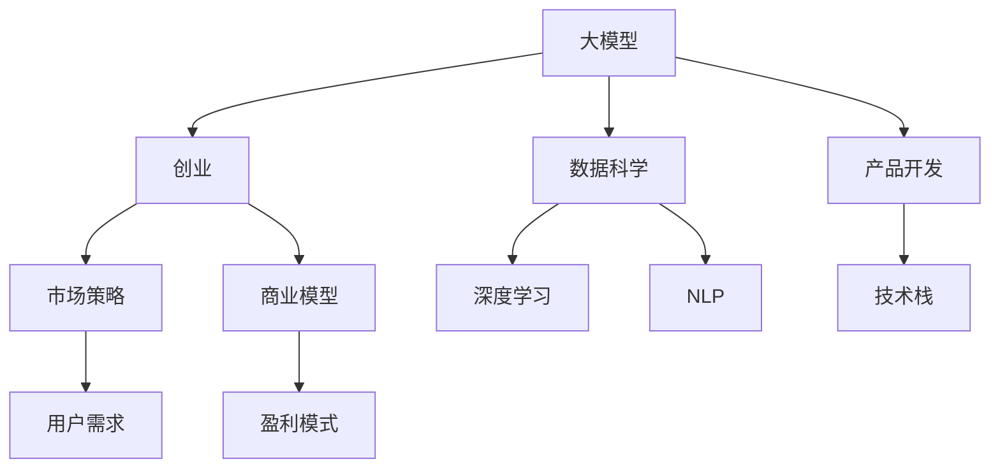

                 

# AI大模型创业：如何抓住未来机遇？

> 关键词：AI大模型，创业，未来机遇，人工智能，技术栈，机器学习，深度学习，自然语言处理，数据科学，产品开发，市场策略，商业模型

## 1. 背景介绍

### 1.1 问题由来

随着人工智能技术的迅猛发展，大模型（如BERT、GPT、T5等）已经成为了AI领域的热点话题。这些大模型通过在数以亿计的数据上进行预训练，学习到了丰富的语言知识和通用知识，具有强大的理解和生成能力。在各个领域，例如自然语言处理、图像识别、语音识别、推荐系统等，大模型的应用都取得了显著的成效。然而，尽管大模型在技术上取得了很大的进步，但仍然存在一些问题，例如数据隐私、模型可解释性、计算资源消耗等问题，这些问题使得大模型在实际应用中面临着诸多挑战。

与此同时，AI大模型创业公司层出不穷。这些公司致力于将大模型的技术应用到实际业务场景中，通过解决实际问题来获取市场和用户。但是，这些公司往往面临着资源不足、市场竞争激烈、用户需求多变等问题，难以快速占领市场。因此，本文将探讨AI大模型创业公司在创业过程中如何抓住未来机遇，并分析这些公司面临的挑战和解决方案。

### 1.2 问题核心关键点

AI大模型创业公司面临的核心问题主要包括以下几个方面：

- 数据隐私问题：如何保护用户的隐私，防止数据泄漏。
- 模型可解释性问题：如何使模型具备良好的可解释性，让用户能够理解模型的决策过程。
- 计算资源消耗问题：如何在有限的计算资源下训练和部署模型。
- 市场竞争问题：如何与竞争对手区分开来，获得用户和市场的认可。
- 用户需求问题：如何快速响应用户需求变化，保持产品的竞争力。

为了更好地解决这些问题，本文将深入探讨大模型技术，并介绍一些创业公司如何成功地在市场上脱颖而出。

## 2. 核心概念与联系

### 2.1 核心概念概述

为了更好地理解AI大模型创业，我们需要理解一些核心概念：

- **大模型（Large Model）**：通过大规模数据训练得到的模型，如BERT、GPT等。这些模型通常具有数十亿甚至数百亿的参数，可以学习到丰富的知识。
- **创业公司（Startup）**：新成立的公司，旨在开发和应用新技术解决实际问题。
- **未来机遇（Future Opportunities）**：未来可能出现的技术和市场机会。
- **人工智能（AI）**：利用计算机技术模拟人类智能，实现自动化和智能化。
- **技术栈（Technology Stack）**：构建应用程序所需的技术和工具，如深度学习、自然语言处理、数据分析等。
- **机器学习（Machine Learning）**：一种通过数据和算法实现计算机自动化的技术。
- **深度学习（Deep Learning）**：机器学习的一种形式，使用多层神经网络进行数据处理。
- **自然语言处理（NLP）**：计算机科学和人工智能的一个分支，研究如何让计算机理解和处理人类语言。
- **数据科学（Data Science）**：从数据中提取知识和信息的一门科学。
- **产品开发（Product Development）**：从创意到实现的过程。
- **市场策略（Market Strategy）**：制定和实施市场竞争策略。
- **商业模型（Business Model）**：公司的盈利模式和业务结构。

### 2.2 核心概念联系

AI大模型创业的核心概念之间的关系可以用以下Mermaid流程图表示：



这个流程图展示了AI大模型创业的关键环节和相互关系。大模型在数据科学和产品开发过程中起到关键作用，创业公司通过市场策略和商业模型来获取用户和市场认可。

## 3. 核心算法原理 & 具体操作步骤

### 3.1 算法原理概述

AI大模型创业的核心算法主要是深度学习和自然语言处理技术。这些技术通过在大量数据上进行预训练，学习到语言的通用表示和知识。这些知识可以应用于各种自然语言处理任务，如文本分类、命名实体识别、情感分析、机器翻译等。

### 3.2 算法步骤详解

AI大模型创业的核心算法步骤包括以下几个方面：

1. **数据预处理**：清洗和标注数据，准备训练集和测试集。
2. **模型训练**：使用深度学习算法在大模型上训练，得到新的模型。
3. **模型微调**：使用下游任务的数据微调模型，得到针对特定任务的模型。
4. **模型部署**：将模型部署到生产环境中，提供API或SDK接口供用户使用。
5. **用户反馈**：收集用户反馈，持续优化模型和产品。

### 3.3 算法优缺点

大模型技术有以下优点：

- **通用性强**：可以应用于多种自然语言处理任务。
- **精度高**：在大规模数据上预训练，模型具有较高的精度。
- **可扩展性**：模型可以在不同的领域和场景中进行微调，适应性更强。

但是，大模型技术也存在一些缺点：

- **计算资源消耗大**：训练和部署大模型需要大量的计算资源。
- **数据隐私问题**：在使用大模型时需要保护用户的隐私。
- **模型可解释性差**：大模型通常是一个"黑箱"，难以解释其决策过程。
- **市场竞争激烈**：市场上有许多大模型创业公司，竞争激烈。
- **用户需求多变**：用户需求随着时间变化，公司需要快速响应。

### 3.4 算法应用领域

AI大模型技术可以应用于以下领域：

- **自然语言处理**：文本分类、命名实体识别、情感分析、机器翻译等。
- **计算机视觉**：图像识别、目标检测、图像生成等。
- **语音识别**：语音转文本、情感识别、语音合成等。
- **推荐系统**：个性化推荐、用户画像等。
- **智能客服**：自动化客服、情感分析等。
- **智能安防**：人脸识别、行为分析等。
- **智能交通**：智能交通管理、车联网等。
- **智能制造**：智能生产、质量检测等。

## 4. 数学模型和公式 & 详细讲解 & 举例说明

### 4.1 数学模型构建

AI大模型创业的数学模型通常包括深度学习模型和自然语言处理模型。这里以BERT模型为例，展示其数学模型构建过程。

BERT模型是一种预训练的深度学习模型，其数学模型可以表示为：

$$
\text{BERT}(x_i; \theta) = \text{Transformer}(x_i; \theta)
$$

其中，$\theta$ 表示模型的参数，$x_i$ 表示输入的文本，$\text{Transformer}$ 表示Transformer模型。BERT模型的输入和输出可以表示为：

$$
x_i = (x_i^L, x_i^{R})
$$

其中，$x_i^L$ 表示输入文本的左半部分，$x_i^{R}$ 表示输入文本的右半部分。BERT模型的输出可以表示为：

$$
y_i = \text{CLS}(\text{BERT}(x_i; \theta))
$$

其中，$\text{CLS}$ 表示语义表示层，$\text{BERT}(x_i; \theta)$ 表示BERT模型的输出。

### 4.2 公式推导过程

BERT模型的公式推导过程如下：

1. **编码器（Encoder）**：BERT模型使用Transformer编码器进行文本编码。编码器由多个自注意力机制组成，可以捕捉文本中的长期依赖关系。
2. **掩码语言模型（Masked Language Modeling）**：BERT模型使用掩码语言模型进行预训练。掩码语言模型在输入文本中随机掩盖一些单词，模型需要预测被掩盖的单词。
3. **下一个句子预测（Next Sentence Prediction）**：BERT模型使用下一个句子预测进行预训练。模型需要预测两个句子是否是连续的。

通过掩码语言模型和下一个句子预测，BERT模型可以学习到丰富的语言表示和知识。这些表示和知识可以应用于各种自然语言处理任务。

### 4.3 案例分析与讲解

以BERT模型为例，展示其在自然语言处理任务中的应用。

**任务**：情感分析

**输入**：输入一段文本。

**模型**：BERT模型。

**输出**：文本的情感倾向，即正面、负面或中性。

**训练**：使用大量带有情感标注的文本数据进行微调。

**推理**：将输入文本输入BERT模型，得到文本的语义表示。然后，使用分类器对语义表示进行情感分类。

## 5. 项目实践：代码实例和详细解释说明

### 5.1 开发环境搭建

AI大模型创业公司需要搭建良好的开发环境。以下是一些常用的开发环境：

- **Python**：一种常用的编程语言，支持深度学习、自然语言处理等。
- **PyTorch**：一个深度学习框架，支持动态计算图和GPU加速。
- **TensorFlow**：一个深度学习框架，支持静态计算图和GPU加速。
- **Keras**：一个高级深度学习框架，支持多种深度学习模型。
- **Jupyter Notebook**：一个交互式开发环境，支持Python编程和可视化。
- **Google Colab**：一个云端的Jupyter Notebook环境，支持GPU计算。

### 5.2 源代码详细实现

以下是使用PyTorch和BERT模型进行情感分析的代码实现。

```python
import torch
import torch.nn as nn
import torch.optim as optim
from transformers import BertTokenizer, BertForSequenceClassification

# 加载BERT模型和分词器
tokenizer = BertTokenizer.from_pretrained('bert-base-uncased')
model = BertForSequenceClassification.from_pretrained('bert-base-uncased', num_labels=3)

# 加载数据集
train_data = ...
test_data = ...

# 训练模型
device = torch.device("cuda" if torch.cuda.is_available() else "cpu")
model.to(device)
optimizer = optim.Adam(model.parameters(), lr=2e-5)
criterion = nn.CrossEntropyLoss()

for epoch in range(10):
    model.train()
    for batch in train_data:
        inputs = tokenizer(batch['text'], padding=True, truncation=True, max_length=128, return_tensors='pt').to(device)
        labels = batch['label'].to(device)
        outputs = model(**inputs)
        loss = criterion(outputs.logits, labels)
        optimizer.zero_grad()
        loss.backward()
        optimizer.step()

# 评估模型
model.eval()
with torch.no_grad():
    test_loss, test_acc = ...
```

### 5.3 代码解读与分析

代码中包含了使用BERT模型进行情感分析的完整流程。

1. **数据预处理**：使用BertTokenizer对文本进行分词和编码。
2. **模型训练**：使用Adam优化器训练BERT模型，使用交叉熵损失函数。
3. **模型评估**：在测试数据上评估模型性能。

### 5.4 运行结果展示

训练完成后，可以在测试集上进行评估，得到模型在情感分类任务上的精度和召回率。

## 6. 实际应用场景

### 6.1 智能客服系统

智能客服系统是AI大模型创业的一个热门领域。智能客服系统可以自动化处理用户咨询，提高客户满意度和运营效率。

**应用场景**：智能客服机器人可以回答用户的常见问题，如订单状态、物流信息、产品信息等。

**技术实现**：使用BERT模型进行情感分析和意图识别，结合规则引擎生成回复。

**未来展望**：随着技术的不断进步，智能客服系统将能够处理更加复杂的用户需求，提供更加个性化的服务。

### 6.2 金融舆情监测

金融舆情监测是AI大模型创业的另一个重要领域。金融舆情监测可以帮助金融机构及时了解市场动态，规避风险。

**应用场景**：金融机构可以通过舆情监测系统，实时监测股票市场、财经新闻等，及时调整投资策略。

**技术实现**：使用BERT模型进行情感分析和主题识别，结合大数据分析技术，实时监测舆情动态。

**未来展望**：随着技术的不断进步，金融舆情监测系统将能够更加精准地识别舆情变化趋势，提供更加及时的决策支持。

### 6.3 个性化推荐系统

个性化推荐系统是AI大模型创业的重要方向之一。个性化推荐系统可以根据用户的历史行为和偏好，推荐个性化的产品和服务。

**应用场景**：电商平台可以根据用户的浏览记录和购买记录，推荐用户可能感兴趣的商品。

**技术实现**：使用BERT模型进行用户画像和产品推荐，结合推荐算法优化推荐效果。

**未来展望**：随着技术的不断进步，个性化推荐系统将能够更加精准地识别用户需求，提供更加个性化的服务。

### 6.4 未来应用展望

未来，AI大模型创业公司将面临更多的机遇和挑战。以下是一些未来可能出现的技术和市场机会：

- **多模态融合**：将文本、图像、语音等多种数据源进行融合，提高模型的应用范围和精度。
- **联邦学习**：通过联邦学习技术，保护用户的隐私，同时提高模型的泛化能力。
- **小样本学习**：使用小样本学习技术，在少量数据上进行模型训练，提高模型的可扩展性。
- **边缘计算**：在边缘设备上进行模型推理，提高模型的实时性和计算效率。
- **跨领域迁移**：在多领域中进行模型迁移，提高模型的泛化能力。

## 7. 工具和资源推荐

### 7.1 学习资源推荐

为了帮助AI大模型创业公司快速掌握技术和市场趋势，以下是一些学习资源：

- **TensorFlow官方文档**：详细介绍了TensorFlow的使用方法和API。
- **PyTorch官方文档**：详细介绍了PyTorch的使用方法和API。
- **Keras官方文档**：详细介绍了Keras的使用方法和API。
- **自然语言处理综述**：自然语言处理领域的经典综述论文，总结了最新的研究成果和应用。
- **深度学习综述**：深度学习领域的经典综述论文，总结了最新的研究成果和应用。
- **机器学习实战**：一本经典的机器学习入门书籍，适合初学者和实践者。

### 7.2 开发工具推荐

以下是一些常用的开发工具：

- **Jupyter Notebook**：一个交互式开发环境，支持Python编程和可视化。
- **Google Colab**：一个云端的Jupyter Notebook环境，支持GPU计算。
- **PyCharm**：一个强大的Python开发工具，支持深度学习、自然语言处理等。
- **VS Code**：一个跨平台的代码编辑器，支持多种编程语言。
- **Git**：一个版本控制系统，支持代码管理和协作。
- **Docker**：一个容器化技术，支持模型的打包和部署。

### 7.3 相关论文推荐

以下是一些经典的AI大模型创业论文，值得深入阅读：

- **Attention is All You Need**：Transformer模型的原论文，提出了自注意力机制。
- **BERT: Pre-training of Deep Bidirectional Transformers for Language Understanding**：BERT模型的论文，介绍了预训练和微调技术。
- **GPT-3: Language Models are Unsupervised Multitask Learners**：GPT-3模型的论文，介绍了无监督学习和多任务学习技术。
- **Transformer-XL: Attentive Language Models**：Transformer-XL模型的论文，提出了长序列处理的自注意力机制。
- **BERT-Base Uncased Fine-Tuning for Sequence Labeling**：BERT模型在序列标注任务上的应用，展示了微调技术的效果。

## 8. 总结：未来发展趋势与挑战

### 8.1 研究成果总结

AI大模型创业公司在过去几年中取得了显著的进展，以下是对一些重要研究成果的总结：

1. **深度学习算法**：通过改进深度学习算法，提高模型的精度和泛化能力。
2. **自然语言处理技术**：通过改进自然语言处理技术，提高模型的理解和生成能力。
3. **小样本学习技术**：通过改进小样本学习技术，提高模型的可扩展性。
4. **联邦学习技术**：通过联邦学习技术，保护用户的隐私，同时提高模型的泛化能力。
5. **多模态融合技术**：通过多模态融合技术，提高模型的应用范围和精度。
6. **边缘计算技术**：通过边缘计算技术，提高模型的实时性和计算效率。

### 8.2 未来发展趋势

未来，AI大模型创业公司将面临更多的机遇和挑战。以下是一些未来可能出现的技术和市场机会：

1. **人工智能技术的普及**：人工智能技术将广泛应用于各个行业，带来更多的机会。
2. **数据资源的丰富**：随着数据的丰富，模型的精度和泛化能力将不断提高。
3. **算力资源的提升**：算力资源的提升，将使得模型的训练和部署更加高效。
4. **市场需求的增长**：随着市场需求的增长，AI大模型创业公司将迎来更多的发展机遇。
5. **技术标准的制定**：技术标准的制定将为AI大模型创业公司提供更多的发展机遇。

### 8.3 面临的挑战

尽管AI大模型创业公司面临许多机遇，但仍然面临着许多挑战：

1. **数据隐私问题**：如何保护用户的隐私，防止数据泄漏。
2. **模型可解释性问题**：如何使模型具备良好的可解释性，让用户能够理解模型的决策过程。
3. **计算资源消耗问题**：如何在有限的计算资源下训练和部署模型。
4. **市场竞争问题**：如何与竞争对手区分开来，获得用户和市场的认可。
5. **用户需求问题**：如何快速响应用户需求变化，保持产品的竞争力。

### 8.4 研究展望

未来的研究需要从以下几个方面进行：

1. **隐私保护技术**：开发更加安全、可靠的隐私保护技术，保护用户的隐私。
2. **模型可解释性技术**：开发更加可解释的模型，提高模型的可解释性。
3. **高效计算技术**：开发更加高效的计算技术，提高模型的训练和推理效率。
4. **市场竞争策略**：制定更加有效的市场竞争策略，获得用户和市场的认可。
5. **用户需求分析**：深入分析用户需求，快速响应用户需求变化，保持产品的竞争力。

## 9. 附录：常见问题与解答

**Q1：AI大模型创业需要多少资金？**

A: AI大模型创业需要大量的资金，用于模型的训练、数据获取、市场推广等方面。资金的多少取决于公司的规模和市场策略。一般来说，初创公司需要几十万到几百万美元的资金。

**Q2：AI大模型创业需要哪些人才？**

A: AI大模型创业需要多方面的专业人才，包括数据科学家、软件工程师、产品经理、市场销售等。这些人才的协作，才能构建出高质量的产品。

**Q3：AI大模型创业如何获得投资？**

A: AI大模型创业公司可以通过多种方式获得投资，包括天使投资、风险投资、政府基金等。这些投资方通常会关注公司的技术、市场前景和团队实力。

**Q4：AI大模型创业如何保护数据隐私？**

A: AI大模型创业公司可以通过以下方式保护数据隐私：
1. 数据加密技术：使用数据加密技术，保护数据在传输和存储过程中的安全性。
2. 匿名化处理：对数据进行匿名化处理，保护用户隐私。
3. 联邦学习技术：通过联邦学习技术，在本地设备上进行模型训练，保护用户数据隐私。

**Q5：AI大模型创业如何应对市场竞争？**

A: AI大模型创业公司可以通过以下方式应对市场竞争：
1. 技术创新：不断进行技术创新，提高产品的竞争力。
2. 市场定位：明确公司的市场定位，突出公司的优势和特色。
3. 客户服务：提供优质的客户服务，增强客户满意度和忠诚度。

本文介绍了AI大模型创业公司的核心概念和核心算法，通过案例分析展示了AI大模型技术的应用，并从市场策略和商业模型方面提出了一些建议。未来，AI大模型创业公司需要不断进行技术创新，应对市场挑战，才能在激烈的市场竞争中脱颖而出。

