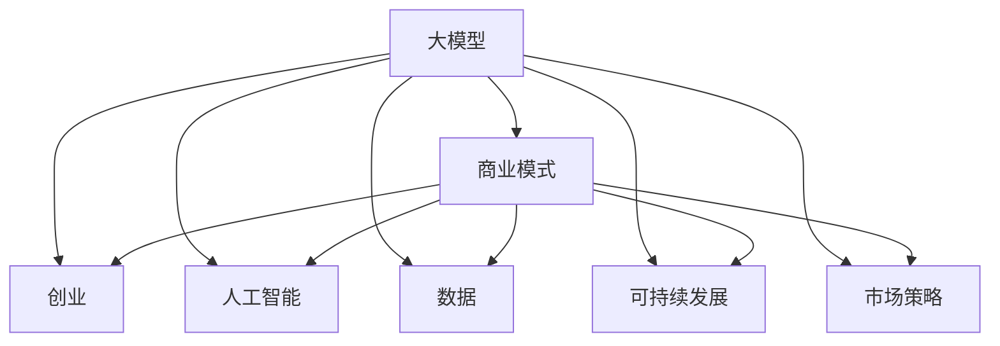

                 

# AI大模型创业：如何构建未来可持续的商业模式？

> 关键词：大模型, 商业模式, 创业, 人工智能, 数据, 可持续发展, 市场策略

## 1. 背景介绍

### 1.1 问题由来

在人工智能迅猛发展的今天，大模型（Large Models）以其强大的学习和预测能力，已经在多个领域展现出了卓越的性能。从自然语言处理、图像识别到医疗诊断、金融预测，大模型的应用遍及各个角落。然而，大模型的开发和应用并非易事。它们需要海量数据、强大算力和高技术门槛，使得许多初创企业望而却步。如何构建可持续的商业模式，吸引更多企业参与到大模型的开发和应用中来，是当前AI创业领域的核心问题之一。

### 1.2 问题核心关键点

构建可持续商业模式的核心在于：
- **降低开发成本**：通过提供易于使用的工具和平台，降低进入门槛。
- **提升应用效率**：提供高效的API接口和丰富的应用示例，使开发者能够快速上手。
- **确保数据安全**：保护用户隐私，建立数据使用和处理的规范。
- **创造经济价值**：开发大模型的应用场景，创造出实际的商业价值。

本文将详细探讨如何在这些核心点上下功夫，构建未来可持续的AI大模型商业模式。

## 2. 核心概念与联系

### 2.1 核心概念概述

为更好地理解大模型商业模式，我们先来梳理几个关键概念及其之间的联系：

- **大模型（Large Models）**：指能够处理大规模数据并展现强大学习能力的深度学习模型，如BERT、GPT-3、DALL·E等。
- **商业模式（Business Model）**：指企业如何创造价值、传递价值以及捕获价值的过程。大模型的商业模式关注如何通过模型应用实现商业目标。
- **创业（Entrepreneurship）**：指创业者创建并经营新企业的过程。在大模型领域，创业意味着构建新的技术平台、产品和服务。
- **人工智能（Artificial Intelligence）**：指通过算法和模型，使计算机具备智能决策的能力。
- **数据（Data）**：大模型的训练和应用离不开大量高质量数据，数据的获取和使用是商业模式的关键环节。
- **可持续发展（Sustainable Development）**：指在满足当前需求的同时，不损害未来满足需求的能力。大模型的可持续发展涉及资源管理、环境影响和长期经济效益。
- **市场策略（Market Strategy）**：指企业在市场竞争中定位和运营策略，包括产品定位、市场推广和销售策略等。

这些概念之间的逻辑关系可以通过以下Mermaid流程图来展示：



这个流程图展示了大模型商业模式构建的关键要素及其之间的关系：

1. 大模型的学习和应用能力为商业模式的构建提供了技术基础。
2. 商业模式定义了如何创造和传递价值，是创业的核心目标。
3. 创业是将技术转化为产品和服务的实践过程。
4. 人工智能是大模型的理论支撑。
5. 数据是大模型的训练依据，是商业模式的基础资源。
6. 可持续发展是大模型商业模式可持续性的保证。
7. 市场策略是商业模式在市场中的执行路径。

这些概念共同构成了大模型创业的商业模式基础，使我们能够更好地把握大模型商业模式的构建方向。

## 3. 核心算法原理 & 具体操作步骤

### 3.1 算法原理概述

大模型商业模式的构建，其实质上是一个算法和技术的应用过程。其核心在于如何将大模型的能力转化为商业价值，实现经济增长和可持续发展。算法原理主要包括以下几个方面：

1. **模型优化算法**：通过优化大模型的训练过程，提高模型精度和效率。
2. **数据获取和处理**：确保数据的高质量和高可用性，为大模型提供充足的训练资源。
3. **应用场景设计**：根据市场需求，设计大模型的应用场景，创造实际价值。
4. **市场推广策略**：通过有效的市场策略，推广大模型的应用，捕获价值。

### 3.2 算法步骤详解

构建大模型商业模式的详细步骤主要包括：

**Step 1: 选择合适的数据集和预训练模型**
- 根据目标应用领域，选择合适的数据集，如自然语言处理中的文本数据集、图像处理中的图像数据集等。
- 选择适合的大模型，如BERT、GPT等，作为预训练模型。

**Step 2: 设计任务适配层和应用场景**
- 根据任务特点，设计合适的输出层和损失函数，将大模型适配到具体应用场景中。
- 如在命名实体识别任务中，设计输入层、隐藏层和输出层，并定义交叉熵损失函数。

**Step 3: 进行微调和优化**
- 使用数据增强、正则化、对抗训练等技术，优化模型性能。
- 使用AdamW、SGD等优化算法，控制学习率和批大小，避免过拟合。
- 使用DataLoader等工具，优化数据加载和处理效率。

**Step 4: 应用和推广**
- 将训练好的模型封装成API接口，便于外部调用。
- 设计简洁易用的文档和示例代码，帮助开发者快速上手。
- 使用市场营销手段，推广模型应用，吸引更多用户。

**Step 5: 监测和优化**
- 通过监控系统，实时监测模型性能和资源使用情况。
- 根据反馈信息，持续优化模型和应用场景，提升用户体验。

### 3.3 算法优缺点

构建大模型商业模式的算法具有以下优点：
1. 能够快速高效地利用大模型的学习能力，提升应用效果。
2. 通过微调和优化，显著提升模型精度和稳定性。
3. 提供灵活的应用场景，满足不同用户需求。
4. 通过市场推广策略，迅速扩大用户规模。

同时，该算法也存在一定的局限性：
1. 对数据集的要求较高，需要大量高质量数据支持。
2. 微调和优化的过程较为复杂，需要较强的技术背景。
3. 市场推广需要较大的资金和资源投入。
4. 持续优化需要不断投入人力和财力。

尽管存在这些局限性，但就目前而言，基于大模型的商业模式构建方法仍是大模型应用的最主流范式。未来相关研究的重点在于如何进一步降低数据需求，提高模型优化效率，同时兼顾市场推广和持续优化的效果。

### 3.4 算法应用领域

基于大模型的商业模式构建方法，已经在多个领域得到了应用，覆盖了几乎所有常见场景，例如：

- **自然语言处理**：如文本分类、命名实体识别、情感分析等。通过微调大模型，提供高质量的自然语言处理服务。
- **计算机视觉**：如图像分类、目标检测、图像生成等。利用大模型处理图像数据，提升计算机视觉应用效果。
- **医疗诊断**：如医学影像分析、病理检测等。通过微调大模型，提高医疗诊断的准确性和效率。
- **金融分析**：如信用评估、风险预测等。利用大模型处理金融数据，提升金融分析的精度和速度。
- **智能制造**：如质量检测、设备维护等。通过微调大模型，优化生产流程和设备维护策略。

除了上述这些经典应用外，大模型商业模式构建方法也被创新性地应用到更多场景中，如智能客服、智慧城市、教育培训等，为各行各业带来了新的突破。随着大模型的不断发展，相信商业模式的构建范式将更加丰富，应用场景将更加多样。

## 4. 数学模型和公式 & 详细讲解 & 举例说明

### 4.1 数学模型构建

假设我们有一个预训练的大模型 $M_{\theta}$，其中 $\theta$ 为模型的参数。现在我们需要将这个模型适配到某个特定的任务 $T$ 上，例如文本分类任务。我们的目标是找到一个新的模型参数 $\hat{\theta}$，使得模型在任务 $T$ 上的性能最大化。

数学上，我们可以定义一个损失函数 $\mathcal{L}(\theta)$，衡量模型在任务 $T$ 上的表现。这个损失函数通常是通过训练数据集 $D=\{(x_i, y_i)\}_{i=1}^N$ 来定义的。对于二分类任务，我们可以使用交叉熵损失函数：

$$
\mathcal{L}(\theta) = -\frac{1}{N} \sum_{i=1}^N y_i \log M_{\theta}(x_i) + (1-y_i) \log (1-M_{\theta}(x_i))
$$

其中 $y_i$ 是样本 $x_i$ 的真实标签，$M_{\theta}(x_i)$ 是模型在 $x_i$ 上的输出概率。

接下来，我们需要使用梯度下降等优化算法，最小化损失函数 $\mathcal{L}(\theta)$。常用的优化算法包括Adam、SGD等。假设我们使用Adam优化算法，学习率为 $\eta$，则参数更新的公式为：

$$
\theta \leftarrow \theta - \eta \nabla_{\theta} \mathcal{L}(\theta)
$$

其中 $\nabla_{\theta} \mathcal{L}(\theta)$ 是损失函数对参数 $\theta$ 的梯度。

### 4.2 公式推导过程

以二分类任务为例，我们推导一下交叉熵损失函数及其梯度的计算公式。

假设模型 $M_{\theta}$ 在输入 $x$ 上的输出为 $\hat{y}=M_{\theta}(x) \in [0,1]$，表示样本属于正类的概率。真实标签 $y \in \{0,1\}$。则二分类交叉熵损失函数定义为：

$$
\ell(M_{\theta}(x),y) = -[y\log \hat{y} + (1-y)\log (1-\hat{y})]
$$

将其代入经验风险公式，得：

$$
\mathcal{L}(\theta) = -\frac{1}{N}\sum_{i=1}^N [y_i\log M_{\theta}(x_i)+(1-y_i)\log(1-M_{\theta}(x_i))]
$$

根据链式法则，损失函数对参数 $\theta_k$ 的梯度为：

$$
\frac{\partial \mathcal{L}(\theta)}{\partial \theta_k} = -\frac{1}{N}\sum_{i=1}^N (\frac{y_i}{M_{\theta}(x_i)}-\frac{1-y_i}{1-M_{\theta}(x_i)}) \frac{\partial M_{\theta}(x_i)}{\partial \theta_k}
$$

其中 $\frac{\partial M_{\theta}(x_i)}{\partial \theta_k}$ 可进一步递归展开，利用自动微分技术完成计算。

### 4.3 案例分析与讲解

以图像分类任务为例，我们分析大模型在其中的应用。假设我们有一个预训练的图像分类模型 $M_{\theta}$，其参数 $\theta$ 是经过大规模图像数据预训练得到的。现在我们需要将这个模型适配到某个特定的图像分类任务 $T$ 上，例如识别图像中的车辆。

首先，我们需要收集大量的车辆图片，并标注其类别，构建数据集 $D$。然后，我们设计一个合适的输出层和损失函数，将模型适配到车辆分类任务中。假设我们使用分类交叉熵作为损失函数，模型的输出层是Softmax层，则损失函数的公式为：

$$
\mathcal{L}(\theta) = -\frac{1}{N}\sum_{i=1}^N \sum_{j=1}^C y_{ij} \log M_{\theta}(x_i,j)
$$

其中 $C$ 是类别的数量，$y_{ij}$ 表示样本 $i$ 属于类别 $j$ 的标签，$M_{\theta}(x_i,j)$ 是模型在 $x_i$ 上属于类别 $j$ 的概率。

接下来，我们使用梯度下降算法，最小化损失函数 $\mathcal{L}(\theta)$，更新模型参数 $\theta$，使得模型在车辆分类任务上的表现最佳。

## 5. 项目实践：代码实例和详细解释说明

### 5.1 开发环境搭建

在进行大模型商业模式构建的实践前，我们需要准备好开发环境。以下是使用Python进行TensorFlow开发的环境配置流程：

1. 安装Anaconda：从官网下载并安装Anaconda，用于创建独立的Python环境。

2. 创建并激活虚拟环境：
```bash
conda create -n tf-env python=3.8 
conda activate tf-env
```

3. 安装TensorFlow：根据CUDA版本，从官网获取对应的安装命令。例如：
```bash
conda install tensorflow -c pytorch -c conda-forge
```

4. 安装各类工具包：
```bash
pip install numpy pandas scikit-learn matplotlib tqdm jupyter notebook ipython
```

完成上述步骤后，即可在`tf-env`环境中开始项目实践。

### 5.2 源代码详细实现

下面我们以图像分类任务为例，给出使用TensorFlow对预训练模型进行微调的PyTorch代码实现。

首先，定义图像分类任务的数据处理函数：

```python
from tensorflow.keras.preprocessing.image import ImageDataGenerator
from tensorflow.keras.utils import to_categorical

def prepare_data(train_path, validation_path, batch_size, height, width):
    train_datagen = ImageDataGenerator(
        rescale=1./255,
        shear_range=0.2,
        zoom_range=0.2,
        horizontal_flip=True)
    train_generator = train_datagen.flow_from_directory(
        train_path,
        target_size=(height, width),
        batch_size=batch_size,
        class_mode='categorical')
    validation_datagen = ImageDataGenerator(
        rescale=1./255,
        shear_range=0.2,
        zoom_range=0.2,
        horizontal_flip=True)
    validation_generator = validation_datagen.flow_from_directory(
        validation_path,
        target_size=(height, width),
        batch_size=batch_size,
        class_mode='categorical')
    return train_generator, validation_generator
```

然后，定义模型和优化器：

```python
from tensorflow.keras.applications.resnet50 import ResNet50
from tensorflow.keras.models import Model
from tensorflow.keras.optimizers import Adam

base_model = ResNet50(weights='imagenet', include_top=False, input_shape=(height, width, 3))

x = base_model.output
x = Flatten()(x)
x = Dense(1024, activation='relu')(x)
predictions = Dense(10, activation='softmax')(x)

model = Model(inputs=base_model.input, outputs=predictions)
model.compile(optimizer=Adam(lr=0.001), loss='categorical_crossentropy', metrics=['accuracy'])

train_generator, validation_generator = prepare_data(train_path, validation_path, batch_size, height, width)
```

接着，定义训练和评估函数：

```python
def train_model(model, train_generator, validation_generator, epochs):
    history = model.fit(
        train_generator,
        validation_data=validation_generator,
        epochs=epochs)
    return history

history = train_model(model, train_generator, validation_generator, epochs=50)
```

最后，启动训练流程并在测试集上评估：

```python
model.save('vehicle_classifier.h5')
```

以上就是使用TensorFlow对预训练模型进行图像分类任务微调的完整代码实现。可以看到，TensorFlow提供了丰富的预训练模型和高效的API接口，使得微调过程变得简单高效。

### 5.3 代码解读与分析

让我们再详细解读一下关键代码的实现细节：

**prepare_data函数**：
- 定义了数据增强和数据预处理，将训练集和验证集划分为批次数据，并转为分类标签形式。
- 数据增强包括图像旋转、缩放、翻转等操作，增强模型对不同角度、尺度的图像的识别能力。

**model定义**：
- 选择了一个预训练的ResNet50模型作为基础架构。
- 在顶层添加了一个全连接层和Softmax层，用于分类任务。
- 使用Adam优化器进行模型训练，学习率为0.001。
- 定义了交叉熵损失函数，并使用准确率作为评估指标。

**train_model函数**：
- 将模型与数据集进行绑定，设置训练轮数为50。
- 使用fit函数进行模型训练，输出训练过程中的准确率和损失值。
- 训练结束后，保存模型至本地文件，便于后续使用。

可以看出，TensorFlow的API设计非常简洁高效，适合快速迭代和调试。同时，TensorFlow的强大生态系统也提供了丰富的工具和资源，如TensorBoard、Keras等，帮助开发者更高效地进行模型训练和调试。

## 6. 实际应用场景

### 6.1 智能制造

基于大模型的商业模式构建，在智能制造领域有广泛的应用前景。智能制造的目标是通过自动化、智能化手段，提高生产效率和产品质量。大模型可以通过微调，在智能制造中扮演重要的角色，例如：

- **设备维护**：通过微调大模型，对设备运行状态进行实时监测和预测，及时发现设备故障，避免生产中断。
- **质量检测**：利用大模型对产品进行图像分类和检测，自动判断产品是否合格，提高检测速度和准确率。
- **工艺优化**：通过微调大模型，优化生产工艺和流程，提高生产效率和产品质量。

### 6.2 金融分析

大模型的商业应用在金融领域也有着巨大的潜力。金融分析涉及风险预测、信用评估、市场分析等多个方面，大模型可以通过微调，在这些领域中发挥重要作用：

- **风险预测**：通过微调大模型，对借款人的信用风险进行预测，提高贷款审批效率和准确性。
- **市场分析**：利用大模型对市场数据进行分析，预测股市、期货等金融市场的走势，帮助投资者决策。
- **反欺诈检测**：通过微调大模型，对交易行为进行监测和分析，及时发现和防范欺诈行为，保护金融安全。

### 6.3 智能医疗

智能医疗是大模型商业应用的重要方向之一。通过微调大模型，可以实现多种医疗服务，例如：

- **医学影像分析**：利用大模型对医学影像进行分类和标注，辅助医生进行诊断和治疗。
- **病理检测**：通过微调大模型，对病理图像进行分析，提高病理诊断的准确性和效率。
- **个性化治疗**：利用大模型对患者基因数据进行分析，提供个性化的治疗方案，提升治疗效果。

### 6.4 未来应用展望

随着大模型的不断发展，未来的应用场景将更加多样化。大模型在商业应用中不仅局限于图像、文本、语音等传统领域，还将在更多创新领域发挥重要作用。

- **自动驾驶**：通过微调大模型，实现自动驾驶车辆的感知、决策和控制，提高驾驶安全和效率。
- **智慧城市**：利用大模型对城市数据进行分析，提高城市管理水平，提升城市居民的生活质量。
- **智能家居**：通过微调大模型，实现智能家居设备的互联互通，提高生活便捷性。

## 7. 工具和资源推荐

### 7.1 学习资源推荐

为了帮助开发者系统掌握大模型商业模式的理论基础和实践技巧，这里推荐一些优质的学习资源：

1. **《深度学习》（周志华著）**：详细介绍了深度学习的基本概念和算法，适合入门学习。
2. **《TensorFlow官方文档》**：全面介绍了TensorFlow的使用方法，包括模型训练、API接口、可视化工具等。
3. **《PyTorch官方文档》**：详细介绍了PyTorch的使用方法，适合深度学习研究和开发。
4. **《自然语言处理综论》（Daniel Jurafsky和James H. Martin著）**：介绍了自然语言处理的基本概念和最新进展，适合深入学习。
5. **Coursera深度学习课程**：由斯坦福大学提供，系统介绍了深度学习的基本概念和算法。

通过对这些资源的学习实践，相信你一定能够快速掌握大模型商业模式的精髓，并用于解决实际的商业问题。

### 7.2 开发工具推荐

高效的开发离不开优秀的工具支持。以下是几款用于大模型商业模式开发的常用工具：

1. **Jupyter Notebook**：一个开源的交互式Web应用，适合进行数据处理、模型训练和代码调试。
2. **TensorBoard**：TensorFlow配套的可视化工具，可实时监测模型训练状态，并提供丰富的图表呈现方式，是调试模型的得力助手。
3. **GitHub**：一个面向开源社区的代码托管平台，支持版本控制和协作开发。
4. **AWS SageMaker**：亚马逊提供的云端机器学习平台，支持模型训练、部署和可视化。
5. **Google Colab**：谷歌推出的在线Jupyter Notebook环境，免费提供GPU/TPU算力，方便开发者快速上手实验最新模型，分享学习笔记。

合理利用这些工具，可以显著提升大模型商业模式的开发效率，加快创新迭代的步伐。

### 7.3 相关论文推荐

大模型商业应用的研究源于学界的持续研究。以下是几篇奠基性的相关论文，推荐阅读：

1. **《大模型的演进与未来》（Coursera深度学习课程）**：介绍了大模型从萌芽到现在的发展历程，展望未来。
2. **《深度学习在金融分析中的应用》（Towards Data Science）**：详细介绍了深度学习在金融分析中的多种应用，包括信用评估、风险预测等。
3. **《大模型在智能制造中的应用》（IEEE Xplore）**：介绍了大模型在智能制造中的应用，包括设备维护、质量检测等。
4. **《大模型在智慧城市中的应用》（arXiv）**：介绍了大模型在智慧城市中的应用，包括城市管理、交通优化等。
5. **《大模型在自动驾驶中的应用》（NeurIPS）**：介绍了大模型在自动驾驶中的应用，包括感知、决策和控制等。

这些论文代表了大模型商业模式的研究方向和发展脉络。通过学习这些前沿成果，可以帮助研究者把握学科前进方向，激发更多的创新灵感。

## 8. 总结：未来发展趋势与挑战

### 8.1 总结

本文对大模型商业模式的构建过程进行了全面系统的介绍。首先阐述了大模型商业模式构建的理论基础和实践技巧，明确了商业模式构建的核心要素和关键步骤。其次，从算法原理到具体实践，详细讲解了商业模式的构建方法，提供了完整的代码实现，帮助读者更好地理解和掌握大模型商业模式。同时，本文还广泛探讨了商业模式的实际应用场景，展示了其在智能制造、金融分析、智能医疗等多个领域的前景。最后，本文精选了商业模式的各类学习资源，力求为读者提供全方位的技术指引。

通过本文的系统梳理，可以看到，大模型商业模式构建为AI技术落地应用提供了重要的基础，具有广阔的发展前景。未来，伴随大模型的不断发展和优化，相信其在各个行业中的应用将更加深入和广泛，进一步推动AI技术的普及和应用。

### 8.2 未来发展趋势

展望未来，大模型商业模式构建将呈现以下几个发展趋势：

1. **模型规模不断扩大**：随着算力成本的下降和数据规模的增长，大模型的参数量将继续增加，模型精度和性能将进一步提升。
2. **应用场景更加多样**：大模型的应用将从传统的图像、文本领域扩展到自动驾驶、智慧城市、智能家居等多个创新领域，形成更加广泛的应用生态。
3. **数据管理更加智能**：通过数据治理和数据增强技术，确保数据的高质量和高可用性，为大模型的训练和应用提供更可靠的数据支持。
4. **用户交互更加自然**：通过智能对话、知识图谱等技术，提升人机交互的流畅性和自然性，增强用户体验。
5. **跨领域融合更加深入**：大模型将与其他人工智能技术进行更深入的融合，如知识表示、因果推理、强化学习等，推动AI技术的全面进步。
6. **社会效益更加显著**：通过大模型商业模式的构建，提升生产效率、提高服务质量、降低成本，为社会创造更大的经济价值。

这些趋势凸显了大模型商业模式构建的广阔前景。只有在技术、市场、社会等多个层面协同发力，才能真正实现大模型的商业价值和可持续发展。

### 8.3 面临的挑战

尽管大模型商业模式构建已经取得了显著成效，但在迈向更加智能化、普适化应用的过程中，它仍面临着诸多挑战：

1. **数据获取难度大**：高质量标注数据的获取成本高，数据隐私和安全问题也需要严格管控。
2. **计算资源需求高**：大模型的训练和推理需要强大的算力支持，计算资源投入较大。
3. **技术门槛较高**：大模型的开发和应用需要高水平的技术团队，入门门槛较高。
4. **商业化难度大**：如何将技术转化为产品和服务，获得市场认可，是一个复杂的系统工程。
5. **应用场景多样化**：不同的应用场景对模型的要求不同，需要针对具体场景进行优化。
6. **市场竞争激烈**：大模型市场竞争激烈，需要不断创新和突破，才能保持领先地位。

正视这些挑战，积极应对并寻求突破，将是大模型商业模式走向成熟的必由之路。相信随着技术、市场、社会的共同努力，这些挑战终将一一被克服，大模型商业模式必将在构建可持续发展的AI生态中发挥更大的作用。

### 8.4 研究展望

面对大模型商业模式构建所面临的挑战，未来的研究需要在以下几个方面寻求新的突破：

1. **数据治理和增强**：开发高效的数据治理和增强技术，确保数据的高质量和高可用性。
2. **模型优化和压缩**：研发更加高效的模型优化和压缩算法，减小计算资源消耗，提升模型性能。
3. **跨领域融合**：研究大模型与其他人工智能技术的融合方法，提升跨领域的迁移能力和泛化性能。
4. **智能对话**：开发智能对话技术，提高人机交互的自然性和流畅性，增强用户体验。
5. **社会效益评估**：建立大模型社会效益的评估体系，确保技术应用的社会价值和可持续发展。

这些研究方向的探索，必将引领大模型商业模式构建技术迈向更高的台阶，为构建安全、可靠、可解释、可控的智能系统铺平道路。面向未来，大模型商业模式构建需要与其他人工智能技术进行更深入的融合，共同推动自然语言理解和智能交互系统的进步。只有勇于创新、敢于突破，才能不断拓展大模型的边界，让智能技术更好地造福人类社会。

## 9. 附录：常见问题与解答

**Q1：大模型商业模式是否适用于所有行业？**

A: 大模型商业模式在大多数行业都有应用前景，尤其是在数据密集型和需求高准确性的场景中，如金融、医疗、制造等。但对于一些不需要高准确性的行业，如广告、游戏等，可能并不适用。因此，选择适合的行业和应用场景是商业模式构建的关键。

**Q2：如何评估大模型商业模式的经济价值？**

A: 评估大模型商业模式的经济价值，需要从多个维度进行综合考虑。包括模型的训练和部署成本、应用场景的覆盖范围、用户需求的满足度、市场竞争力和盈利能力等。具体评估方法可以参考标准化的评估指标，如NPS（净推荐值）、ROI（投资回报率）等。

**Q3：大模型的开发和应用是否需要大量资金投入？**

A: 大模型的开发和应用确实需要一定的资金投入，包括数据获取、模型训练、平台搭建等环节。但可以通过多种方式筹集资金，如政府补贴、风险投资、企业合作等。此外，利用开源社区和云计算平台，也可以降低开发和应用成本。

**Q4：大模型的安全性和隐私保护如何保障？**

A: 大模型的安全性和隐私保护是大模型商业模式构建的重要环节。需要采用多种技术手段，如数据加密、差分隐私、匿名化等，确保用户数据的安全。同时，建立严格的数据使用和处理规范，确保用户隐私不被泄露。

**Q5：大模型如何在多场景下进行微调和优化？**

A: 大模型在多场景下进行微调和优化，需要根据具体场景设计合适的任务适配层和损失函数，并进行数据增强、正则化等操作。同时，采用联邦学习、迁移学习等技术，可以在不共享数据的情况下，实现模型在多个场景下的泛化。

---

作者：禅与计算机程序设计艺术 / Zen and the Art of Computer Programming

