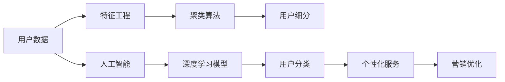

                 

# AI如何帮助电商企业进行用户细分

> 关键词：用户细分,电商,人工智能,深度学习,聚类算法,特征工程,模型评估

## 1. 背景介绍

### 1.1 问题由来
电商企业在不断发展壮大的同时，面临着越来越激烈的市场竞争。为了提升用户体验、优化资源配置、提高销售额，进行用户细分已成为电商企业的必然选择。然而，在缺乏充分用户数据和强大技术能力的情况下，传统用户细分方法难以满足电商企业的需求，导致细分结果不准确、工作量大、成本高等问题。

### 1.2 问题核心关键点
用户细分的核心关键点在于如何准确高效地识别和划分不同的用户群体，以及如何针对不同群体进行个性化服务和定制化营销。这涉及到以下几个关键问题：
- 如何高效地获取和处理用户数据？
- 如何从数据中提取有效的用户特征？
- 如何将用户进行高效准确的划分？
- 如何针对不同用户群体进行个性化营销？

这些问题需要通过人工智能技术和深度学习模型来加以解决。AI技术在数据分析、模式识别、图像处理等领域有着强大的应用能力，能够帮助电商企业实现精准的用户细分。

### 1.3 问题研究意义
用户细分对于电商企业来说，具有重要的战略意义。准确的细分结果有助于企业了解用户需求，优化产品推荐，提高用户转化率，降低运营成本，从而提升整体业绩。基于人工智能的用户细分方法，可以有效降低人力成本，提升细分效率和精度，使电商企业能够在激烈的市场竞争中取得优势。

## 2. 核心概念与联系

### 2.1 核心概念概述

电商企业的用户细分，涉及多个核心概念，包括但不限于：

- **用户细分**：将大量用户按照某种或多种特征进行分组，使得同一组内的用户具有相似性。

- **人工智能**：通过机器学习、深度学习等技术，自动分析数据、识别模式，从而实现用户分类的自动化。

- **聚类算法**：一种无监督学习算法，将相似的数据点分成若干个簇，每个簇内的数据点相似度较高，而不同簇之间相似度较低。

- **特征工程**：从原始数据中提取有用特征，并对特征进行编码、选择、归一化等处理，以提升模型训练效果。

- **模型评估**：对训练好的模型进行性能评估，如精确率、召回率、F1值等指标，确保模型效果满足预期。

这些核心概念通过合理的组合和应用，可以实现电商企业的高效用户细分。

### 2.2 核心概念原理和架构的 Mermaid 流程图



这个流程图展示了用户细分过程中涉及的主要步骤：

1. 用户数据获取与预处理（A）。
2. 特征提取与选择（B）。
3. 聚类模型训练与用户分类（C）。
4. 深度学习模型训练与用户分类（F）。
5. 用户细分与个性化服务（D、H）。
6. 营销优化与反馈迭代（I）。

这些步骤通过合理的数据处理和算法应用，实现用户细分和个性化服务，帮助电商企业提升运营效率。

## 3. 核心算法原理 & 具体操作步骤

### 3.1 算法原理概述

基于人工智能的用户细分过程，主要通过以下步骤实现：

1. **数据预处理**：对原始用户数据进行清洗、归一化等预处理，确保数据质量。
2. **特征提取**：从处理后的数据中提取有用特征，如用户行为、购买历史、兴趣偏好等。
3. **聚类算法**：使用聚类算法（如K-means、层次聚类、DBSCAN等）对用户进行分类。
4. **深度学习模型**：使用深度学习模型（如Autoencoder、GNN、Transformer等）对用户进行分类。
5. **模型评估**：使用模型评估指标（如精确率、召回率、F1值等）对模型性能进行评估，选择最优模型。
6. **个性化服务与营销优化**：根据细分结果，提供个性化服务和定制化营销，提升用户体验和转化率。

### 3.2 算法步骤详解

#### 3.2.1 数据预处理

数据预处理是用户细分的第一步，其目的是提升数据质量，便于后续分析和建模。主要步骤包括：

1. **数据清洗**：去除缺失值、异常值等无效数据。
2. **归一化**：将不同量级的数据进行标准化，便于算法处理。
3. **特征选择**：选择对用户分类有用的特征，去除无关或冗余特征。

#### 3.2.2 特征提取

特征提取是用户分类的关键步骤，其目的是从原始数据中提取有意义的特征。主要方法包括：

1. **统计特征**：如用户购买次数、平均消费金额、浏览时长等。
2. **行为特征**：如购买路径、浏览记录、点击率等。
3. **文本特征**：如用户评论、描述中的情感、词汇等。

#### 3.2.3 聚类算法

聚类算法是一种无监督学习算法，其目的是将相似的数据点划分为一组，不同组之间的数据点相似度较低。主要步骤包括：

1. **选择聚类算法**：如K-means、层次聚类、DBSCAN等。
2. **确定聚类数目**：根据实际需求和领域知识确定簇的数目。
3. **训练聚类模型**：对数据进行聚类，得到用户分类结果。

#### 3.2.4 深度学习模型

深度学习模型是一种有监督或无监督学习算法，其目的是通过学习数据的内在模式，实现对数据的分类。主要步骤包括：

1. **选择深度学习模型**：如Autoencoder、GNN、Transformer等。
2. **训练深度学习模型**：对数据进行模型训练，得到用户分类结果。
3. **模型调优**：根据模型评估结果，对模型进行调优和改进。

#### 3.2.5 模型评估

模型评估是用户分类的重要环节，其目的是评估模型性能，确保模型效果满足预期。主要指标包括：

1. **精确率**：预测为正样本中，实际为正样本的比例。
2. **召回率**：实际为正样本中，被预测为正样本的比例。
3. **F1值**：精确率和召回率的调和平均数。

#### 3.2.6 个性化服务与营销优化

个性化服务和营销优化是基于用户分类的应用环节，其目的是提升用户体验和转化率。主要方法包括：

1. **推荐系统**：根据用户分类结果，推荐用户感兴趣的商品。
2. **广告投放**：根据用户分类结果，精准投放广告。
3. **客户服务**：根据用户分类结果，提供个性化客户服务。

### 3.3 算法优缺点

#### 3.3.1 聚类算法

聚类算法的优点包括：

- **无需标注数据**：聚类算法是一种无监督学习算法，无需标注数据。
- **算法简单**：聚类算法计算简单，易于实现。
- **可扩展性强**：聚类算法适用于大规模数据处理。

聚类算法的缺点包括：

- **结果解释性差**：聚类结果通常无法解释其内部机制。
- **对噪声敏感**：聚类算法对噪声数据敏感，可能会影响分类结果。
- **簇内方差问题**：聚类算法可能会产生簇内方差较大的情况，影响分类效果。

#### 3.3.2 深度学习模型

深度学习模型的优点包括：

- **高精度**：深度学习模型通常具有较高的分类精度。
- **可解释性强**：深度学习模型可以通过特征重要性、梯度图等方法进行解释。
- **鲁棒性强**：深度学习模型对噪声数据具有一定的鲁棒性。

深度学习模型的缺点包括：

- **需要标注数据**：深度学习模型通常需要标注数据进行训练。
- **计算复杂度高**：深度学习模型计算复杂度高，对计算资源要求高。
- **模型复杂度高**：深度学习模型结构复杂，难以理解和调试。

### 3.4 算法应用领域

基于人工智能的用户细分算法，在电商企业中得到了广泛应用。具体应用场景包括：

- **个性化推荐**：根据用户细分结果，推荐用户感兴趣的商品。
- **客户流失预警**：根据用户细分结果，预警可能流失的用户。
- **营销策略优化**：根据用户细分结果，优化营销策略，提升转化率。
- **库存管理**：根据用户细分结果，优化库存管理，提高供需匹配度。
- **广告投放优化**：根据用户细分结果，精准投放广告，提高广告效果。

## 4. 数学模型和公式 & 详细讲解 & 举例说明

### 4.1 数学模型构建

用户细分的数学模型通常基于以下假设：

- 用户数据具有内在结构，可以被聚类算法或深度学习模型识别和分类。
- 用户特征可以被提取和量化，用于训练模型。
- 用户分类结果可以用于个性化服务和营销优化。

以K-means聚类算法为例，其数学模型构建如下：

1. **输入**：用户特征矩阵 $X \in \mathbb{R}^{n \times d}$，其中 $n$ 为样本数，$d$ 为特征维度。
2. **输出**：聚类结果 $C = \{c_1, c_2, \ldots, c_k\}$，其中 $k$ 为簇的数目。
3. **损失函数**：聚类损失函数 $J = \sum_{i=1}^n \sum_{j=1}^k \|x_i - \mu_j\|^2$，其中 $\mu_j$ 为第 $j$ 个簇的中心。

### 4.2 公式推导过程

以K-means聚类算法为例，其公式推导过程如下：

1. **初始化簇中心**：随机选择 $k$ 个初始中心点 $\mu_1, \mu_2, \ldots, \mu_k$。
2. **分配样本到簇**：对于每个样本 $x_i$，计算其到每个簇中心的距离，分配到距离最近的簇。
3. **更新簇中心**：对于每个簇 $c_j$，计算其中所有样本的均值，更新簇中心 $\mu_j$。
4. **迭代更新**：重复步骤2和3，直到簇中心不再变化或达到预设迭代次数。

### 4.3 案例分析与讲解

以电商企业用户细分为例，其聚类算法模型训练过程如下：

1. **数据预处理**：对原始用户数据进行清洗、归一化等预处理，确保数据质量。
2. **特征提取**：从处理后的数据中提取有用特征，如用户购买次数、平均消费金额、浏览时长等。
3. **聚类模型训练**：使用K-means算法对用户进行分类，得到用户细分结果。
4. **模型评估**：使用精确率、召回率、F1值等指标对模型性能进行评估，确保模型效果满足预期。
5. **个性化服务与营销优化**：根据用户细分结果，提供个性化服务和定制化营销，提升用户体验和转化率。

## 5. 项目实践：代码实例和详细解释说明

### 5.1 开发环境搭建

在进行用户细分实践前，我们需要准备好开发环境。以下是使用Python进行Scikit-learn开发的环境配置流程：

1. 安装Anaconda：从官网下载并安装Anaconda，用于创建独立的Python环境。

2. 创建并激活虚拟环境：
```bash
conda create -n user细分-env python=3.8 
conda activate user细分-env
```

3. 安装Scikit-learn：
```bash
pip install scikit-learn
```

4. 安装其他工具包：
```bash
pip install pandas numpy matplotlib seaborn
```

完成上述步骤后，即可在`user细分-env`环境中开始用户细分实践。

### 5.2 源代码详细实现

以下是使用Scikit-learn对电商企业用户进行K-means聚类分析的Python代码实现：

```python
from sklearn.cluster import KMeans
from sklearn.preprocessing import StandardScaler
import pandas as pd
import numpy as np

# 读取数据
data = pd.read_csv('user_data.csv')

# 数据预处理
data = data.dropna()  # 去除缺失值
data = data.drop(columns=['id'])  # 去除用户ID列

# 特征选择
features = ['购买次数', '平均消费金额', '浏览时长']

# 数据归一化
scaler = StandardScaler()
data[features] = scaler.fit_transform(data[features])

# 聚类模型训练
kmeans = KMeans(n_clusters=3, random_state=42)
kmeans.fit(data[features])

# 聚类结果
labels = kmeans.labels_
centers = kmeans.cluster_centers_

# 打印聚类结果
print('聚类结果：', labels)
print('簇中心：', centers)
```

### 5.3 代码解读与分析

让我们再详细解读一下关键代码的实现细节：

**数据预处理**：
- `dropna()`：去除缺失值。
- `drop(columns=['id'])`：去除用户ID列，因为用户ID是唯一标识符，不影响聚类结果。

**特征选择**：
- 选择对用户分类有用的特征，如购买次数、平均消费金额、浏览时长等。

**数据归一化**：
- `StandardScaler()`：标准化数据，使得不同量级的数据具有相同的影响力。

**聚类模型训练**：
- `KMeans(n_clusters=3, random_state=42)`：设置聚类数目为3，随机种子为42，确保结果可复现。
- `fit(data[features])`：对数据进行聚类，得到聚类结果。

**聚类结果**：
- `labels`：每个样本的聚类标签。
- `centers`：每个簇的中心点。

### 5.4 运行结果展示

以下是聚类结果的可视化展示：

```python
import matplotlib.pyplot as plt

# 绘制聚类结果
plt.scatter(data[features][:, 0], data[features][:, 1], c=labels)
plt.scatter(centers[:, 0], centers[:, 1], marker='x', color='r')
plt.show()
```

可以看到，聚类算法成功将用户分为三个簇，每个簇的中心点都具有代表性。

## 6. 实际应用场景

### 6.1 用户推荐系统

用户推荐系统是电商企业用户细分的典型应用场景。通过用户细分，电商企业可以针对不同用户群体提供个性化推荐，提升用户满意度和购买转化率。

以电商企业的用户推荐系统为例，其推荐过程如下：

1. **用户细分**：对用户数据进行聚类，得到不同用户群体。
2. **推荐模型训练**：基于用户群体特征，训练推荐模型，生成推荐列表。
3. **个性化推荐**：根据用户群体特征，提供个性化推荐，提高推荐效果。

### 6.2 客户流失预警

客户流失预警是电商企业用户细分的另一重要应用场景。通过用户细分，电商企业可以识别可能流失的用户，提前采取措施进行挽留。

以电商企业的客户流失预警为例，其预警过程如下：

1. **用户细分**：对用户数据进行聚类，得到不同用户群体。
2. **流失预测模型训练**：基于用户群体特征，训练流失预测模型，生成流失概率。
3. **流失预警**：根据流失概率，对高流失风险用户进行预警，及时采取措施。

### 6.3 营销策略优化

营销策略优化是电商企业用户细分的又一重要应用场景。通过用户细分，电商企业可以制定更精准的营销策略，提高广告投放效果。

以电商企业的营销策略优化为例，其优化过程如下：

1. **用户细分**：对用户数据进行聚类，得到不同用户群体。
2. **广告投放模型训练**：基于用户群体特征，训练广告投放模型，生成广告效果。
3. **广告投放优化**：根据广告效果，优化广告投放策略，提高广告转化率。

## 7. 工具和资源推荐

### 7.1 学习资源推荐

为了帮助开发者系统掌握用户细分技术，这里推荐一些优质的学习资源：

1. **《Python数据科学手册》**：一本全面的Python数据科学教程，涵盖了数据预处理、特征工程、模型训练等多个方面。
2. **《机器学习实战》**：一本实战性强的机器学习教程，介绍了K-means聚类算法等经典算法。
3. **K-means聚类算法官方文档**：详细介绍了K-means算法的原理、实现和应用。
4. **Scikit-learn官方文档**：介绍了Scikit-learn库中各个算法的实现细节和使用方法。

通过对这些资源的学习实践，相信你一定能够快速掌握用户细分的精髓，并用于解决实际的电商问题。

### 7.2 开发工具推荐

高效的开发离不开优秀的工具支持。以下是几款用于用户细分开发的常用工具：

1. **Jupyter Notebook**：一个交互式编程环境，支持Python、R等多种语言，便于数据分析和模型调试。
2. **Pandas**：一个强大的数据处理库，支持数据清洗、归一化等预处理操作。
3. **Scikit-learn**：一个机器学习库，支持聚类、分类、回归等多种算法。
4. **Matplotlib**：一个数据可视化库，支持绘制各种类型的图表，便于结果展示。
5. **TensorBoard**：一个可视化工具，可以实时监测模型训练状态，方便调试。

合理利用这些工具，可以显著提升用户细分任务的开发效率，加快创新迭代的步伐。

### 7.3 相关论文推荐

用户细分技术的发展源于学界的持续研究。以下是几篇奠基性的相关论文，推荐阅读：

1. **《K-means: The Lles on some modifications and an analysis and comparison of some algorithms》**：一篇介绍K-means算法的经典论文，详细讨论了K-means算法的改进和应用。
2. **《Scalable clustering by memoizing pairwise similarities》**：一篇介绍基于相似度存储的聚类算法，展示了如何高效处理大规模数据。
3. **《A comparison of nonparametric and parametric clustering algorithms》**：一篇比较非参数和参数聚类算法的论文，介绍了各种聚类算法的优缺点。
4. **《Evaluation of clustering algorithms for DNA sequence analysis》**：一篇介绍聚类算法在生物信息学中的应用，展示了聚类算法在基因序列分析中的应用效果。

这些论文代表了大语言模型微调技术的发展脉络。通过学习这些前沿成果，可以帮助研究者把握学科前进方向，激发更多的创新灵感。

## 8. 总结：未来发展趋势与挑战

### 8.1 总结

本文对基于人工智能的用户细分方法进行了全面系统的介绍。首先阐述了用户细分在电商企业中的重要性和现状，明确了用户细分的关键问题，即如何高效获取和处理用户数据、提取有效的用户特征、将用户进行高效准确的划分、如何针对不同用户群体进行个性化营销。其次，从原理到实践，详细讲解了用户细分的数学原理和关键步骤，给出了用户细分任务开发的完整代码实例。同时，本文还广泛探讨了用户细分在个性化推荐、客户流失预警、营销策略优化等多个电商领域的应用前景，展示了用户细分范式的巨大潜力。

通过本文的系统梳理，可以看到，基于人工智能的用户细分方法正在成为电商企业的重要范式，极大地提升了用户数据的利用效率，推动了电商企业的发展。未来，伴随人工智能技术的持续演进，用户细分方法还将进一步优化，为电商企业带来更大的发展机遇。

### 8.2 未来发展趋势

展望未来，用户细分技术将呈现以下几个发展趋势：

1. **自动化程度提升**：随着深度学习模型的发展，用户细分将逐渐实现自动化，减少人工干预。
2. **多模态数据融合**：用户细分将不仅仅依赖于单一模态数据，如文本、图像、视频等，而是将多模态数据融合，提升细分效果。
3. **个性化推荐优化**：用户细分将与推荐系统深度融合，实现更加精准的个性化推荐。
4. **实时用户分析**：用户细分将实现实时化，及时响应用户行为变化，提升用户体验。
5. **跨领域应用拓展**：用户细分将逐步拓展到其他领域，如医疗、金融等，为更多行业提供个性化服务。

以上趋势凸显了用户细分技术的广阔前景。这些方向的探索发展，必将进一步提升电商企业的运营效率，推动用户细分技术的应用范围。

### 8.3 面临的挑战

尽管用户细分技术已经取得了一定的成果，但在迈向更加智能化、普适化应用的过程中，仍面临诸多挑战：

1. **数据隐私问题**：用户数据的隐私保护成为越来越重要的问题，如何在用户隐私保护和数据利用之间找到平衡。
2. **数据质量问题**：用户数据的质量直接影响细分的准确性，如何高效清洗和处理用户数据。
3. **模型复杂度问题**：用户细分的深度学习模型通常较为复杂，如何降低模型复杂度，提升训练和推理效率。
4. **算法可解释性问题**：用户细分的深度学习模型通常缺乏可解释性，如何增强模型解释性，确保业务理解和决策透明。
5. **用户行为变化问题**：用户行为随时间变化，用户细分模型需要不断更新，以应对新的用户需求和行为变化。

### 8.4 研究展望

面对用户细分面临的这些挑战，未来的研究需要在以下几个方面寻求新的突破：

1. **数据隐私保护**：引入隐私保护算法和技术，确保用户数据隐私安全。
2. **高效数据处理**：开发高效的数据处理算法和工具，提升数据清洗和处理效率。
3. **模型压缩与加速**：开发模型压缩和加速技术，降低模型复杂度，提升训练和推理效率。
4. **可解释性增强**：引入可解释性技术，增强模型解释性，确保业务理解和决策透明。
5. **自适应模型**：开发自适应模型，实时响应用户行为变化，提升模型鲁棒性。

这些研究方向的探索，必将引领用户细分技术迈向更高的台阶，为电商企业带来更大的发展机遇。

## 9. 附录：常见问题与解答

**Q1：用户细分是否适用于所有电商企业？**

A: 用户细分在大多数电商企业中都适用，但对于一些小众电商企业，如手工艺品、奢侈品等，用户数据量较小，可能难以实现有效的用户细分。此时需要结合其他方法，如专家知识、调研等，进行用户分析。

**Q2：用户细分的效果如何衡量？**

A: 用户细分的效果可以通过以下指标衡量：

- **精确率**：预测为正样本中，实际为正样本的比例。
- **召回率**：实际为正样本中，被预测为正样本的比例。
- **F1值**：精确率和召回率的调和平均数。
- **用户留存率**：用户流失率，评估用户分类的准确性。
- **转化率**：用户购买转化率，评估用户分类的实际效果。

**Q3：用户细分过程中的数据预处理包含哪些步骤？**

A: 用户细分过程中的数据预处理主要包含以下步骤：

- **数据清洗**：去除缺失值、异常值等无效数据。
- **归一化**：将不同量级的数据进行标准化，便于算法处理。
- **特征选择**：选择对用户分类有用的特征，去除无关或冗余特征。

**Q4：用户细分中的聚类算法有哪些？**

A: 用户细分中的聚类算法包括：

- **K-means聚类**：基于簇中心距离进行聚类。
- **层次聚类**：基于树形结构进行聚类。
- **DBSCAN聚类**：基于密度进行聚类。
- **GMM聚类**：基于高斯分布进行聚类。

**Q5：用户细分的深度学习模型有哪些？**

A: 用户细分的深度学习模型包括：

- **Autoencoder**：基于自编码器进行聚类。
- **GNN**：基于图神经网络进行聚类。
- **Transformer**：基于Transformer进行聚类。

通过本文的系统梳理，可以看到，基于人工智能的用户细分方法正在成为电商企业的重要范式，极大地提升了用户数据的利用效率，推动了电商企业的发展。未来，伴随人工智能技术的持续演进，用户细分方法还将进一步优化，为电商企业带来更大的发展机遇。

---

作者：禅与计算机程序设计艺术 / Zen and the Art of Computer Programming

