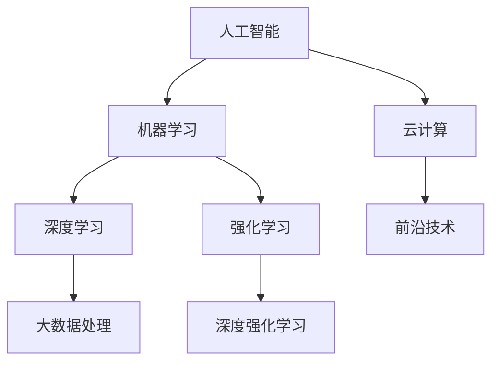

                 

# AI应用实践的新方向与趋势

> 关键词：人工智能,机器学习,深度学习,深度强化学习,应用落地,大数据,云计算,前沿技术

## 1. 背景介绍

在过去的几十年里，人工智能(AI)技术的迅速发展已经深刻改变了我们的生活方式和工作方式。从自动驾驶、智能家居，到医疗诊断、金融风险管理，AI技术正在逐步渗透到各个行业和领域。然而，随着技术的不断演进，如何更好地将AI技术应用于实际场景，实现技术的落地应用，成为了当前AI领域的一个关键问题。

本系列文章将聚焦于AI应用实践的新方向与趋势，深入探讨如何将AI技术高效、可靠地应用于各种实际场景。我们将从以下几个方面入手：

- **AI应用落地的关键技术**：包括深度学习、强化学习、大数据处理、云计算等技术的应用。
- **AI应用场景的实际案例**：如智能推荐、智能客服、自动驾驶等。
- **AI应用中的工程实践**：从模型训练、数据处理、部署上线等环节的优化。
- **AI应用的未来展望**：探讨AI技术在各个行业中的应用趋势，以及面临的挑战和机遇。

## 2. 核心概念与联系

### 2.1 核心概念概述

为了更好地理解AI应用实践，我们先介绍几个关键概念：

- **人工智能(AI)**：指的是通过计算机模拟人类智能行为的技术，包括感知、学习、推理、决策等能力。
- **机器学习(ML)**：通过算法使计算机从数据中学习并做出预测或决策的能力。
- **深度学习(DL)**：一种特殊的机器学习方法，通过多层神经网络来模拟人脑的学习过程。
- **深度强化学习(Deep RL)**：结合深度学习和强化学习的技术，通过模拟游戏、机器人控制等任务，让计算机自主学习最优策略。
- **大数据(Big Data)**：指规模庞大、多样性丰富、速度快速的数据集，通常需要通过分布式计算和存储技术进行处理。
- **云计算(Cloud Computing)**：通过互联网提供计算资源、存储资源和软件服务，实现资源的高效利用。
- **前沿技术(前沿技术)**：如量子计算、脑机接口、基因编辑等，代表了未来的技术发展方向。

这些概念之间的联系可以通过以下Mermaid流程图来展示：



这个流程图展示了AI、ML、DL、RL、大数据、云计算、前沿技术之间的关系和联系，以及它们共同构成了AI应用实践的整个生态系统。

## 3. 核心算法原理 & 具体操作步骤

### 3.1 算法原理概述

AI应用实践的核心在于通过算法和技术手段，将数据转换为有用的信息或决策。不同类型的应用场景需要不同的算法和技术支持。

- **图像识别**：通过卷积神经网络(CNN)对图像进行特征提取和分类。
- **语音识别**：通过循环神经网络(RNN)或长短时记忆网络(LSTM)对语音信号进行特征提取和识别。
- **自然语言处理(NLP)**：通过Transformer等模型对文本进行语义理解和生成。
- **强化学习**：通过Q-learning、Deep Q-Network(DQN)等算法，使智能体学习最优策略。
- **推荐系统**：通过协同过滤、矩阵分解等算法，为用户推荐个性化商品或内容。

### 3.2 算法步骤详解

以自然语言处理(NLP)中的深度学习模型为例，介绍AI应用实践的典型流程：

1. **数据准备**：收集和清洗大量的文本数据，分为训练集、验证集和测试集。
2. **模型构建**：选择适合的深度学习模型，如LSTM、GRU、Transformer等，并进行相应的参数设置。
3. **模型训练**：使用训练集对模型进行训练，通过反向传播算法更新模型参数，优化损失函数。
4. **模型验证**：使用验证集评估模型性能，调整超参数，防止过拟合。
5. **模型测试**：使用测试集对模型进行最终的性能评估，确保模型的泛化能力。
6. **模型部署**：将训练好的模型部署到生产环境，实现实际应用。

### 3.3 算法优缺点

AI应用实践中的算法具有以下优点：

- **高效性**：通过自动化算法和模型，可以大幅度提高处理数据的速度和效率。
- **可扩展性**：现代AI算法和技术可以应用于各种规模和类型的应用场景。
- **可解释性**：通过可视化工具和模型解释技术，可以理解算法的内部工作机制。

同时，也存在以下缺点：

- **高成本**：构建和训练复杂的AI模型需要大量的计算资源和人力投入。
- **数据依赖**：算法的性能很大程度上取决于数据的质量和数量。
- **黑盒问题**：一些AI算法和模型缺乏可解释性，难以理解其决策过程。
- **技术复杂**：开发和部署AI应用需要较高的技术门槛。

### 3.4 算法应用领域

AI应用实践已经广泛应用于多个领域，如医疗、金融、智能制造、智慧城市等。以下是几个典型应用领域的介绍：

- **医疗**：AI技术被用于医学影像诊断、个性化治疗、药物研发等领域，提高了医疗服务的质量和效率。
- **金融**：通过AI技术进行风险管理、算法交易、客户服务等，提升了金融机构的竞争力。
- **智能制造**：通过AI技术实现设备自诊断、质量检测、供应链优化等，提高了制造业的智能化水平。
- **智慧城市**：通过AI技术实现交通管理、能源优化、环境监测等，提升了城市管理的智能化水平。

## 4. 数学模型和公式 & 详细讲解

### 4.1 数学模型构建

AI应用实践中的数学模型通常包含以下几个部分：

- **输入数据**：包括图像、文本、语音等，表示输入特征。
- **隐藏层**：通过多层神经网络或卷积层对输入数据进行特征提取。
- **输出层**：根据不同的应用场景，输出分类、回归、序列等结果。
- **损失函数**：用于衡量模型输出与真实标签之间的差异，如交叉熵、均方误差等。
- **优化器**：用于更新模型参数，如Adam、SGD等。

### 4.2 公式推导过程

以简单的线性回归模型为例，推导其数学公式：

假设模型为 $y = w_0 + w_1x_1 + w_2x_2 + \cdots + w_nx_n$，其中 $y$ 为输出，$x_i$ 为输入特征，$w_i$ 为权重，$w_0$ 为偏置项。根据最小二乘法，我们希望最小化损失函数 $J = \frac{1}{N}\sum_{i=1}^N(y_i - w_0 - \sum_{j=1}^n w_jx_{ij})^2$，其中 $y_i$ 为真实标签。

通过求导和求解，可以得到模型参数的更新公式：

$$
w_i \leftarrow w_i - \eta \frac{\partial J}{\partial w_i} = w_i - \eta \frac{1}{N}\sum_{i=1}^N 2(y_i - w_0 - \sum_{j=1}^n w_jx_{ij})x_{ij}
$$

其中 $\eta$ 为学习率，$\frac{\partial J}{\partial w_i}$ 为损失函数对 $w_i$ 的导数。

### 4.3 案例分析与讲解

以图像分类为例，展示深度学习模型在实际应用中的效果：

1. **数据准备**：收集并标注大量的图像数据，分为训练集、验证集和测试集。
2. **模型构建**：选择适合的网络结构，如VGG、ResNet等，并进行相应的参数设置。
3. **模型训练**：使用训练集对模型进行训练，通过反向传播算法更新模型参数，优化损失函数。
4. **模型验证**：使用验证集评估模型性能，调整超参数，防止过拟合。
5. **模型测试**：使用测试集对模型进行最终的性能评估，确保模型的泛化能力。
6. **模型部署**：将训练好的模型部署到生产环境，实现实际应用。

## 5. 项目实践：代码实例和详细解释说明

### 5.1 开发环境搭建

以下是使用Python进行TensorFlow开发的典型环境配置：

1. 安装Anaconda：从官网下载并安装Anaconda，用于创建独立的Python环境。

2. 创建并激活虚拟环境：
```bash
conda create -n tf-env python=3.8
conda activate tf-env
```

3. 安装TensorFlow：根据CUDA版本，从官网获取对应的安装命令。例如：
```bash
conda install tensorflow==2.6 -c pytorch -c conda-forge
```

4. 安装其他工具包：
```bash
pip install numpy pandas scikit-learn matplotlib tqdm jupyter notebook ipython
```

5. 配置环境变量：在Anaconda Prompt或终端中执行以下命令，以确保TensorFlow能够访问所需的GPU设备：
```bash
export CUDA_VISIBLE_DEVICES=0,1
```

### 5.2 源代码详细实现

以下是使用TensorFlow进行图像分类任务的代码实现：

```python
import tensorflow as tf
from tensorflow.keras import layers

# 构建模型
model = tf.keras.Sequential([
    layers.Conv2D(32, (3, 3), activation='relu', input_shape=(224, 224, 3)),
    layers.MaxPooling2D((2, 2)),
    layers.Conv2D(64, (3, 3), activation='relu'),
    layers.MaxPooling2D((2, 2)),
    layers.Conv2D(128, (3, 3), activation='relu'),
    layers.MaxPooling2D((2, 2)),
    layers.Flatten(),
    layers.Dense(128, activation='relu'),
    layers.Dense(10)
])

# 编译模型
model.compile(optimizer=tf.keras.optimizers.Adam(learning_rate=0.001),
              loss=tf.keras.losses.SparseCategoricalCrossentropy(from_logits=True),
              metrics=['accuracy'])

# 训练模型
model.fit(train_images, train_labels, epochs=10, validation_data=(val_images, val_labels))

# 评估模型
test_loss, test_acc = model.evaluate(test_images, test_labels, verbose=2)
print('Test accuracy:', test_acc)
```

### 5.3 代码解读与分析

让我们再详细解读一下关键代码的实现细节：

- **模型构建**：使用Sequential模型构建深度学习网络，包含卷积层、池化层、全连接层等。
- **模型编译**：选择合适的优化器、损失函数和评价指标，编译模型。
- **模型训练**：使用fit方法对模型进行训练，指定训练数据、验证数据、训练轮数等参数。
- **模型评估**：使用evaluate方法对模型进行评估，计算测试集上的损失和准确率。

### 5.4 运行结果展示

在训练完成后，可以使用evaluate方法对模型进行评估：

```python
test_loss, test_acc = model.evaluate(test_images, test_labels, verbose=2)
print('Test accuracy:', test_acc)
```

以上代码展示了使用TensorFlow进行图像分类的完整代码实现，可以看到，代码实现相对简洁，通过组合不同的层和参数，可以构建出适合的深度学习模型，并对其进行训练和评估。

## 6. 实际应用场景

### 6.1 智能推荐系统

智能推荐系统已经成为电子商务和流媒体平台的重要组成部分。基于AI技术的推荐算法可以根据用户的历史行为数据和兴趣偏好，为其推荐个性化的商品或内容，提升用户体验和满意度。

以电商平台的商品推荐为例，可以使用协同过滤、矩阵分解等算法，对用户和商品进行建模，根据用户的历史浏览记录和评分数据，预测用户对不同商品的偏好，从而实现精准推荐。

### 6.2 智能客服系统

智能客服系统已经成为现代企业服务的重要组成部分。基于AI技术的自然语言处理技术，可以处理大量的客户咨询请求，快速响应和解决问题，提升客户满意度和企业效率。

在智能客服系统的实现中，可以使用基于Transformer的NLP模型，对用户输入的自然语言进行理解和回复，结合意图识别和对话管理技术，实现与客户的自然交互。

### 6.3 智能制造

智能制造是制造业转型升级的重要方向。基于AI技术的设备自诊断、质量检测、供应链优化等技术，可以提高制造业的智能化水平，降低生产成本，提升产品质量和效率。

例如，使用深度学习技术对生产设备进行自诊断，识别设备的异常状态，并预测故障原因，实现设备维修和维护的自动化管理。

### 6.4 智慧城市

智慧城市是未来城市发展的方向。基于AI技术的交通管理、能源优化、环境监测等技术，可以提高城市的智能化水平，提升市民的生活质量和社会效率。

例如，使用深度学习技术对交通流量进行预测和优化，实现交通信号灯的智能控制，缓解城市交通拥堵。

## 7. 工具和资源推荐

### 7.1 学习资源推荐

为了帮助开发者系统掌握AI应用实践的理论基础和实践技巧，这里推荐一些优质的学习资源：

1. 《深度学习》（Ian Goodfellow等著）：全面介绍了深度学习的基本概念和算法，是深度学习的经典教材。
2. 《强化学习》（Richard S. Sutton、Andrew G. Barto等著）：介绍了强化学习的原理和算法，是强化学习的权威教材。
3. 《机器学习实战》（Peter Harrington著）：通过实践案例，介绍了机器学习的基本应用，适合入门学习。
4. 《TensorFlow实战》（Yaroslav Halchenko著）：通过实际项目，介绍了TensorFlow的使用方法和技巧。
5. 《深度学习框架》（李沐著）：介绍了主流深度学习框架的特点和使用方法，适合框架开发。

通过对这些资源的学习实践，相信你一定能够快速掌握AI应用实践的精髓，并用于解决实际的AI问题。

### 7.2 开发工具推荐

高效的开发离不开优秀的工具支持。以下是几款用于AI应用实践开发的常用工具：

1. TensorFlow：由Google主导开发的开源深度学习框架，生产部署方便，适合大规模工程应用。
2. PyTorch：基于Python的开源深度学习框架，灵活动态的计算图，适合快速迭代研究。
3. Jupyter Notebook：支持交互式编程和数据分析的在线笔记本，方便开发和分享。
4. Keras：高层深度学习API，方便快速搭建和训练模型。
5. Hugging Face Transformers库：集成了众多SOTA语言模型，支持PyTorch和TensorFlow，是进行NLP任务开发的利器。

合理利用这些工具，可以显著提升AI应用实践的开发效率，加快创新迭代的步伐。

### 7.3 相关论文推荐

AI应用实践的发展源于学界的持续研究。以下是几篇奠基性的相关论文，推荐阅读：

1. AlexNet：用于图像识别的深度卷积神经网络。
2. AlphaGo：使用深度强化学习实现的围棋AI程序。
3. GANs：生成对抗网络，用于生成高保真的图像和视频。
4. BERT：基于Transformer的预训练语言模型，广泛应用于NLP任务。
5. GPT-3：目前最大的预训练语言模型，展示了深度学习的巨大潜力。

这些论文代表了AI应用实践的发展脉络。通过学习这些前沿成果，可以帮助研究者把握学科前进方向，激发更多的创新灵感。

## 8. 总结：未来发展趋势与挑战

### 8.1 总结

本文对AI应用实践的新方向与趋势进行了全面系统的介绍。首先阐述了AI应用实践的重要性，明确了在多个领域的应用价值。其次，从原理到实践，详细讲解了AI应用实践的数学模型和操作步骤，给出了典型的代码实例。同时，本文还广泛探讨了AI应用实践在多个行业领域的应用前景，展示了其广阔的想象空间。

通过本文的系统梳理，可以看到，AI应用实践已经从理论走向实际应用，为各行各业带来了前所未有的变革。未来，伴随技术的不断演进和产业界的持续创新，AI应用实践必将在更多领域落地应用，深刻影响人类的生产生活方式。

### 8.2 未来发展趋势

展望未来，AI应用实践的发展趋势如下：

1. **多模态融合**：将语音、图像、文本等多种模态数据融合，提升AI系统的综合处理能力。
2. **边缘计算**：将AI算法部署到边缘设备，实现实时计算和数据处理，提升AI系统的响应速度。
3. **联邦学习**：通过分布式训练和联邦学习技术，实现数据隐私保护和模型共享。
4. **自动化和可解释性**：开发自动化的AI开发工具和可解释的AI模型，提升开发效率和模型可信度。
5. **伦理和安全**：在AI应用中引入伦理和安全机制，保障数据隐私和模型公平性。

这些趋势凸显了AI应用实践的发展方向，将推动AI技术向更深层次、更广领域迈进。

### 8.3 面临的挑战

尽管AI应用实践已经取得了瞩目成就，但在迈向更加智能化、普适化应用的过程中，仍面临诸多挑战：

1. **数据质量和隐私**：高质量的数据是AI应用的基础，但数据获取和隐私保护始终是难题。
2. **模型复杂度和可解释性**：AI模型的复杂性不断增加，可解释性成为新的挑战。
3. **资源需求和计算效率**：大规模AI模型需要大量的计算资源和存储空间，计算效率问题亟待解决。
4. **模型公平性和鲁棒性**：AI模型可能存在偏见和鲁棒性不足的问题，亟需解决。
5. **技术标准和法规**：AI技术的发展需要配套的技术标准和法规，以确保其安全性、可靠性。

这些挑战需要研究者、开发者和政策制定者共同努力，才能推动AI应用实践的持续发展和落地应用。

### 8.4 研究展望

未来的研究需要在以下几个方面寻求新的突破：

1. **高效能模型**：开发更高效的模型架构和训练算法，提升AI系统的计算效率和可扩展性。
2. **可解释AI**：开发更可解释的AI模型和解释工具，提升AI系统的可信度和透明度。
3. **隐私保护**：开发隐私保护技术和算法，确保数据隐私和安全。
4. **多模态融合**：开发多模态融合技术，提升AI系统的综合处理能力。
5. **自动化工具**：开发自动化的AI开发工具和平台，提升AI开发效率和用户体验。

这些方向的研究将推动AI应用实践的深入发展和落地应用，为AI技术在各行各业的广泛应用奠定坚实基础。

## 9. 附录：常见问题与解答

**Q1: 为什么AI应用实践在各个行业中都取得了显著成效？**

A: AI应用实践在各个行业中都取得了显著成效，主要有以下几个原因：

1. **数据驱动**：AI技术依赖于大量的数据，各个行业都积累了丰富的数据资源，为AI应用提供了可能。
2. **技术进步**：近年来，深度学习、强化学习等AI技术的快速发展，使得AI应用变得更加高效和可靠。
3. **行业需求**：各个行业对AI技术的需求日益增长，推动了AI应用的快速发展。

**Q2: AI应用实践中的难点和挑战有哪些？**

A: AI应用实践中的难点和挑战主要包括以下几点：

1. **数据质量和隐私**：高质量的数据是AI应用的基础，但数据获取和隐私保护始终是难题。
2. **模型复杂度和可解释性**：AI模型的复杂性不断增加，可解释性成为新的挑战。
3. **资源需求和计算效率**：大规模AI模型需要大量的计算资源和存储空间，计算效率问题亟待解决。
4. **模型公平性和鲁棒性**：AI模型可能存在偏见和鲁棒性不足的问题，亟需解决。
5. **技术标准和法规**：AI技术的发展需要配套的技术标准和法规，以确保其安全性、可靠性。

**Q3: 如何在AI应用实践中平衡技术创新和实际需求？**

A: 在AI应用实践中，平衡技术创新和实际需求可以通过以下几个方法实现：

1. **需求导向**：在技术创新中，始终将实际需求作为出发点，确保技术创新能够满足实际需求。
2. **用户反馈**：通过用户反馈，及时调整和优化AI应用，提升用户体验。
3. **多学科合作**：将AI技术与其他学科技术相结合，综合考虑实际需求和应用场景。
4. **持续改进**：在AI应用中，不断进行技术改进和优化，确保技术始终符合实际需求。

**Q4: 如何在AI应用实践中确保数据隐私和安全？**

A: 在AI应用实践中，确保数据隐私和安全可以通过以下几个方法实现：

1. **数据匿名化**：对数据进行匿名化处理，确保数据无法被反向识别。
2. **联邦学习**：使用分布式训练和联邦学习技术，实现数据隐私保护和模型共享。
3. **差分隐私**：在数据分析和模型训练中，引入差分隐私技术，确保数据隐私。
4. **加密技术**：使用加密技术，确保数据传输和存储过程中的安全性。

**Q5: 如何评估AI应用的性能和效果？**

A: 在AI应用中，评估性能和效果可以通过以下几个指标实现：

1. **准确率**：评估模型对真实标签的预测准确率。
2. **召回率**：评估模型对真实标签的召回能力。
3. **F1分数**：综合考虑准确率和召回率，评估模型的综合性能。
4. **AUC曲线**：评估模型在不同阈值下的性能表现。
5. **ROC曲线**：评估模型在不同阈值下的分类性能。

这些指标可以综合评估AI应用在不同场景下的性能和效果，确保AI应用能够满足实际需求。

---

作者：禅与计算机程序设计艺术 / Zen and the Art of Computer Programming

