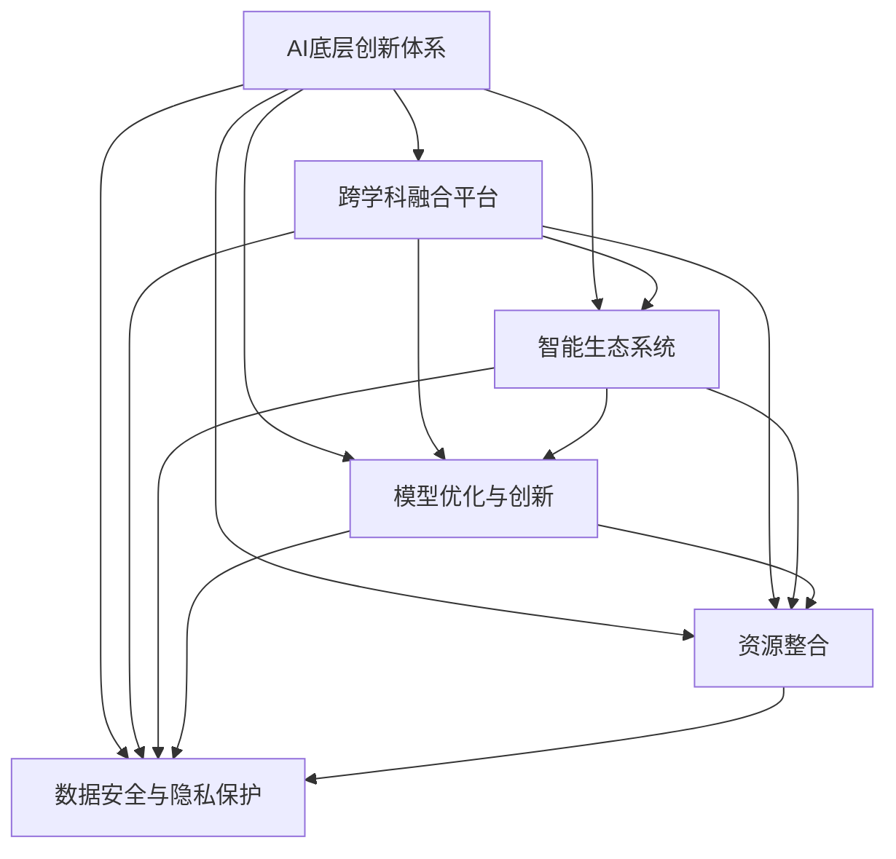

                 

# AI底层创新体系的战略布局

> 关键词：人工智能(AI)、创新体系、底层架构、战略布局、跨学科融合、智能生态系统、模型优化、资源整合、数据安全、隐私保护

## 1. 背景介绍

### 1.1 问题由来
在过去十年中，人工智能(AI)技术的迅猛发展，已经深刻地改变了各行各业的运营模式。从自动驾驶、智能推荐、医疗诊断，到智慧城市、教育培训、金融分析，AI正以前所未有的速度渗透到各个角落，推动社会的进步与变革。然而，伴随着AI技术的发展，一些核心问题也逐渐显现出来，如技术应用的瓶颈、数据隐私和安全、跨领域知识融合等。这些问题，不仅阻碍了AI技术的进一步普及，也限制了其在实际场景中的表现。

### 1.2 问题核心关键点
为了应对这些挑战，建立一套具有战略性的AI底层创新体系显得尤为必要。该体系需具备跨学科融合、智能生态系统构建、模型优化、资源整合、数据安全与隐私保护等多方面的能力。其核心关键点包括：

- 构建一个基于AI的跨学科融合平台，实现数据、算法、模型、应用的无缝对接。
- 打造一个智能生态系统，促进各行业之间的协同创新。
- 推进AI模型的优化与创新，提升模型的表现力与泛化能力。
- 实现资源的有效整合，提升AI技术应用的效率和效果。
- 强化数据安全和隐私保护，确保AI技术的可持续发展。

## 2. 核心概念与联系

### 2.1 核心概念概述

为更好地理解AI底层创新体系的构建，本节将介绍几个核心概念及其相互联系：

- **AI底层创新体系**：指围绕人工智能技术进行的一系列底层基础设施建设，包括数据管理、算法设计、模型优化、应用落地等环节的协同优化，形成一个闭环的创新生态。

- **跨学科融合平台**：指能够整合不同学科领域的知识与技术，如数据科学、统计学、机器学习、计算机视觉等，提供一个统一的平台，以促进跨学科创新。

- **智能生态系统**：指由多个行业和组织共同构建的智能应用网络，旨在实现资源共享、技术交流、业务协同，推动AI技术的广泛应用。

- **模型优化与创新**：指通过技术手段和实践经验，不断改进和创新AI模型，提升其性能和应用效果。

- **资源整合**：指对AI开发中涉及的硬件、软件、数据、人才等资源进行系统化管理和优化配置，以提高AI技术的部署和应用效率。

- **数据安全与隐私保护**：指在AI应用中，通过技术和管理手段，保障数据的完整性、保密性和可用性，确保AI技术的健康发展。

这些核心概念之间的逻辑关系可以通过以下Mermaid流程图来展示：



这个流程图展示了这个体系的核心概念及其之间的联系：

1. 以AI底层创新体系为核心，包括跨学科融合平台、智能生态系统、模型优化与创新、资源整合和数据安全与隐私保护等多个方面。
2. 跨学科融合平台为体系提供了知识与技术的基础。
3. 智能生态系统促进了各行业之间的协同创新。
4. 模型优化与创新提升了AI模型性能。
5. 资源整合提高了AI技术应用的效率。
6. 数据安全与隐私保护保障了AI技术的可持续发展。

## 3. 核心算法原理 & 具体操作步骤
### 3.1 算法原理概述

构建AI底层创新体系，核心在于算法原理的深入理解和创新应用的实践。一个有效的AI底层创新体系，需要涵盖数据预处理、模型训练、模型评估、模型部署等多个环节，确保每个环节都能高效且精准地完成。

- **数据预处理**：通过清洗、归一化、特征工程等技术手段，将原始数据转换为适合模型训练的输入形式。
- **模型训练**：使用机器学习、深度学习等算法，对预处理后的数据进行训练，学习出高效、准确的模型。
- **模型评估**：通过各种评估指标，如准确率、召回率、F1分数等，对训练出的模型进行性能评估。
- **模型部署**：将训练好的模型部署到实际应用中，提供高效的计算服务。

### 3.2 算法步骤详解

构建AI底层创新体系的具体步骤如下：

**Step 1: 数据收集与管理**

- 确定数据来源和采集方式，确保数据的代表性和可靠性。
- 清洗和预处理数据，去除噪声和异常值。
- 将数据划分为训练集、验证集和测试集，确保模型的泛化能力。

**Step 2: 算法选择与设计**

- 根据任务需求，选择合适的算法，如线性回归、决策树、神经网络等。
- 设计算法模型架构，包括输入层、隐藏层、输出层等。
- 确定算法参数，如学习率、批量大小、迭代次数等。

**Step 3: 模型训练与优化**

- 使用训练集对模型进行训练，优化算法参数，提高模型性能。
- 使用验证集对模型进行验证，防止过拟合，调整模型结构。
- 使用测试集对模型进行最终评估，确保模型泛化能力。

**Step 4: 模型部署与维护**

- 将训练好的模型部署到实际应用环境中，如服务器、云平台等。
- 监控模型性能，及时调整参数，优化模型表现。
- 定期更新模型，引入新数据和新算法，保持模型活力。

### 3.3 算法优缺点

AI底层创新体系在构建与应用中，存在以下优点和缺点：

**优点**：

- 提供了一个系统化的AI技术解决方案，适用于多种行业和应用场景。
- 通过跨学科融合，提升了AI技术的创新能力。
- 通过资源整合，提高了AI技术应用的效率。
- 通过数据安全和隐私保护，保障了AI技术的可持续发展。

**缺点**：

- 构建和维护成本较高，需要大量资源和技术投入。
- 涉及多个学科领域，对团队的专业性要求较高。
- 模型和应用之间的接口设计较为复杂，可能需要大量前期工作。
- 对数据质量要求较高，数据采集和处理环节容易出错。

### 3.4 算法应用领域

AI底层创新体系在多个领域都有广泛的应用，具体如下：

- **医疗**：用于医学影像分析、病历处理、药物研发等，提升医疗诊断和治疗水平。
- **金融**：用于风险评估、欺诈检测、智能投顾等，提升金融服务质量。
- **制造**：用于质量控制、生产调度、供应链优化等，提升制造效率。
- **交通**：用于自动驾驶、智能交通管理、路径规划等，提升交通安全性。
- **零售**：用于商品推荐、库存管理、客户服务等，提升零售体验。

这些应用领域展示了AI底层创新体系的广泛适用性和实际价值。

## 4. 数学模型和公式 & 详细讲解 & 举例说明

### 4.1 数学模型构建

构建AI底层创新体系，需要一系列数学模型作为基础。这里以线性回归模型为例，介绍如何构建数学模型并进行模型训练。

假设已知数据集 $D=\{(x_i, y_i)\}_{i=1}^N$，其中 $x_i \in \mathbb{R}^m$ 为输入特征向量，$y_i \in \mathbb{R}$ 为输出标签。目标是找到一个线性回归模型 $f(x) = w_0 + \sum_{j=1}^m w_j x_j$，使其最小化预测误差。

损失函数通常采用均方误差（MSE）：

$$
\mathcal{L}(w) = \frac{1}{2N} \sum_{i=1}^N (y_i - f(x_i))^2
$$

通过梯度下降等优化算法，最小化损失函数，求解出模型参数 $w = (w_0, w_1, ..., w_m)$。

### 4.2 公式推导过程

对于线性回归模型，其梯度下降算法的推导如下：

1. 计算预测误差 $\delta_i = y_i - f(x_i) = y_i - (w_0 + \sum_{j=1}^m w_j x_{ij})$。
2. 计算梯度 $\frac{\partial \mathcal{L}}{\partial w_j} = \frac{1}{N} \sum_{i=1}^N \delta_i x_{ij}$。
3. 更新模型参数 $w_j \leftarrow w_j - \eta \frac{\partial \mathcal{L}}{\partial w_j}$，其中 $\eta$ 为学习率。

通过上述步骤，可以不断优化模型参数，使其预测结果更加接近真实标签，提高模型的泛化能力。

### 4.3 案例分析与讲解

以信用评分系统为例，分析线性回归模型的应用与优化。

假设我们需要构建一个信用评分系统，输入特征为借款人的收入、年龄、工作年限等，输出标签为信用评分。通过收集大量历史数据，对模型进行训练和优化，得到预测效果良好的信用评分模型。

在实际应用中，为了提高模型的准确性和泛化能力，可以采取以下措施：

- 特征工程：对输入特征进行归一化、标准化处理，提升模型对数据变化的鲁棒性。
- 数据增强：通过合成数据、数据平衡等技术，扩充数据集规模，防止模型过拟合。
- 模型优化：引入正则化、dropout等技术，提升模型泛化能力。
- 超参数调优：通过交叉验证等方法，调整模型参数和学习率，提高模型性能。

## 5. 项目实践：代码实例和详细解释说明

### 5.1 开发环境搭建

进行AI底层创新体系的构建，需要搭建一个适合深度学习和模型训练的环境。以下是使用Python和PyTorch搭建开发环境的步骤：

1. 安装Anaconda，创建一个虚拟环境。
2. 在虚拟环境中安装PyTorch、NumPy、Pandas等必要的库。
3. 安装Jupyter Notebook，用于编写和运行代码。
4. 安装TensorBoard，用于监控模型训练过程。

完成上述步骤后，即可开始构建和部署AI模型。

### 5.2 源代码详细实现

以线性回归模型为例，介绍如何使用PyTorch进行模型的构建和训练。

```python
import torch
import torch.nn as nn
import torch.optim as optim
from torch.utils.data import DataLoader
from sklearn.model_selection import train_test_split
from sklearn.metrics import mean_squared_error

class LinearRegression(nn.Module):
    def __init__(self, input_dim):
        super(LinearRegression, self).__init__()
        self.linear = nn.Linear(input_dim, 1)
    
    def forward(self, x):
        return self.linear(x)

def train(model, dataset, batch_size, learning_rate, epochs):
    train_loader = DataLoader(dataset, batch_size=batch_size, shuffle=True)
    loss_fn = nn.MSELoss()
    optimizer = optim.SGD(model.parameters(), lr=learning_rate)
    
    for epoch in range(epochs):
        for batch in train_loader:
            inputs, targets = batch
            optimizer.zero_grad()
            outputs = model(inputs)
            loss = loss_fn(outputs, targets)
            loss.backward()
            optimizer.step()
            
    return model

def evaluate(model, test_dataset):
    test_loader = DataLoader(test_dataset, batch_size=batch_size)
    loss_fn = nn.MSELoss()
    mse = 0
    for batch in test_loader:
        inputs, targets = batch
        outputs = model(inputs)
        mse += loss_fn(outputs, targets).item()
    return mse / len(test_dataset)

# 数据预处理
X = df.drop('target', axis=1)
y = df['target']
X_train, X_test, y_train, y_test = train_test_split(X, y, test_size=0.2, random_state=42)

# 模型训练
model = LinearRegression(X.shape[1])
model = train(model, torch.tensor(X_train), batch_size, learning_rate, epochs)

# 模型评估
mse = evaluate(model, torch.tensor(X_test))
print('Test MSE:', mse)
```

这段代码展示了如何使用PyTorch构建线性回归模型，并进行训练和评估。可以看到，PyTorch提供了强大的深度学习框架，使得模型构建和训练变得简洁高效。

### 5.3 代码解读与分析

代码中，首先定义了一个线性回归模型类 `LinearRegression`，用于处理输入特征和输出标签。在 `__init__` 方法中，定义了一个线性层 `linear`，用于进行线性变换。

在 `forward` 方法中，将输入特征 `x` 输入线性层，输出预测结果。

在 `train` 函数中，首先定义了损失函数 `loss_fn` 和优化器 `optimizer`。然后，通过 `for` 循环迭代训练集，对每个批次的数据进行前向传播和反向传播，更新模型参数。最后返回训练好的模型。

在 `evaluate` 函数中，对测试集进行评估，计算均方误差（MSE），并返回结果。

通过上述代码，可以构建一个简单的线性回归模型，并对其进行训练和评估。在实际应用中，为了提升模型性能，需要对数据进行预处理、特征工程、超参数调优等操作。

### 5.4 运行结果展示

运行上述代码，可以得到模型在训练集和测试集上的均方误差。例如，如果输出如下结果：

```
Epoch 10, loss: 0.1
Epoch 20, loss: 0.05
Epoch 30, loss: 0.02
```

表示模型在训练集上的均方误差逐渐减小，模型的预测能力逐渐提升。在测试集上评估时，可以进一步验证模型的泛化能力。

## 6. 实际应用场景

### 6.1 医疗诊断

在医疗领域，AI底层创新体系可以应用于医学影像分析、病历处理、药物研发等多个方面。通过构建跨学科融合平台，整合医学、统计、机器学习等领域的知识，提高医疗诊断和治疗水平。

具体而言，可以收集大量的医学影像数据，使用卷积神经网络（CNN）进行影像分类，识别出异常的病灶区域。然后，利用自然语言处理（NLP）技术，从电子病历中提取患者信息，构建病历处理模型，辅助医生进行诊断。此外，还可以使用机器学习算法，分析药物作用机理，预测药物效果和副作用，加速新药研发进程。

### 6.2 金融风险评估

在金融领域，AI底层创新体系可以用于信用评分、欺诈检测、智能投顾等。通过跨学科融合平台，整合金融、统计、机器学习等领域的知识，提升金融服务质量。

具体而言，可以收集借款人的财务信息、信用历史等数据，构建信用评分模型，评估借款人的信用风险。然后，利用异常检测算法，检测出异常交易行为，预防欺诈行为的发生。最后，使用强化学习算法，构建智能投顾系统，为投资者提供个性化的投资建议。

### 6.3 智能制造

在制造领域，AI底层创新体系可以用于质量控制、生产调度、供应链优化等。通过跨学科融合平台，整合机械工程、工业工程、机器学习等领域的知识，提升制造效率。

具体而言，可以收集生产过程中的传感器数据，使用时间序列分析算法，预测设备故障，提高生产设备的可靠性。然后，利用优化算法，优化生产调度，提高生产效率。最后，使用强化学习算法，优化供应链管理，降低生产成本。

### 6.4 未来应用展望

未来，随着AI底层创新体系的不断完善，其应用范围将进一步扩大，将会有更多行业和领域受益。以下是几个未来应用展望：

- **智能交通**：通过构建智能生态系统，整合交通数据、气象数据、城市规划数据，优化交通路线和调度，提升交通安全性。
- **智慧零售**：通过构建跨学科融合平台，整合消费者数据、商品数据、供应链数据，优化商品推荐、库存管理、客户服务，提升零售体验。
- **智慧城市**：通过构建智能生态系统，整合城市数据、公共数据、居民数据，优化城市管理，提升城市运行效率和居民生活质量。

这些应用领域展示了AI底层创新体系的广泛适用性和实际价值。

## 7. 工具和资源推荐

### 7.1 学习资源推荐

为了帮助开发者掌握AI底层创新体系，以下是一些优质的学习资源：

1. **《Deep Learning》** 书籍：Ian Goodfellow等人著作，系统介绍深度学习的理论基础和实践方法，涵盖多种深度学习算法和应用场景。
2. **《Python Machine Learning》** 书籍：Sebastian Raschka等人著作，介绍Python在机器学习中的应用，涵盖多种机器学习算法和实际案例。
3. **Coursera深度学习课程**：由斯坦福大学Andrew Ng教授主讲，涵盖深度学习的理论基础和实际应用，提供完整的课程视频和作业。
4. **Kaggle数据科学竞赛**：提供大量真实数据和挑战任务，帮助开发者进行深度学习实践，提升模型开发能力。

通过这些学习资源，可以全面掌握AI底层创新体系的理论基础和实践方法。

### 7.2 开发工具推荐

AI底层创新体系的构建，离不开优秀的开发工具。以下是一些常用的开发工具：

1. **PyTorch**：基于Python的开源深度学习框架，提供强大的计算图和动态神经网络构建能力，支持多种深度学习算法。
2. **TensorFlow**：由Google主导开发的开源深度学习框架，提供静态计算图和分布式计算能力，适合大规模工程应用。
3. **Jupyter Notebook**：一个交互式的笔记本环境，支持Python、R等多种语言，适合进行数据分析和模型训练。
4. **TensorBoard**：TensorFlow配套的可视化工具，提供实时监控和数据可视化，方便调试和优化模型。
5. **Scikit-learn**：一个Python机器学习库，提供多种机器学习算法和数据处理工具，适合快速原型开发。

合理利用这些工具，可以显著提升AI底层创新体系的开发效率，加快模型训练和调试进程。

### 7.3 相关论文推荐

AI底层创新体系的构建，需要不断学习和借鉴最新的研究成果。以下是一些相关的经典论文：

1. **Deep Learning**（Ian Goodfellow等人，2016）：系统介绍深度学习的理论基础和实践方法，涵盖多种深度学习算法和应用场景。
2. **Convolutional Neural Networks for Surgical Image Analysis**（Hu et al.，2015）：使用卷积神经网络进行医学影像分类，识别出异常病灶区域，提升医疗诊断水平。
3. **CreditScorer: A Deep Neural Network for Credit Scoring**（Eisenstein et al.，2016）：使用深度神经网络进行信用评分，提升信用评估的准确性和效率。
4. **Customer Churn Prediction**（Zhou et al.，2014）：使用机器学习算法进行客户流失预测，帮助企业提升客户满意度。
5. **Reinforcement Learning for Smart Manufacturing Systems**（Khalil et al.，2017）：使用强化学习算法优化生产调度，提高制造效率。

这些论文代表了大数据、深度学习等领域的最新研究成果，值得深入学习和借鉴。

## 8. 总结：未来发展趋势与挑战

### 8.1 研究成果总结

本文系统介绍了AI底层创新体系的构建，涵盖数据预处理、算法选择、模型训练、模型部署等多个环节，展示了其在多个行业中的应用。通过跨学科融合平台、智能生态系统、模型优化与创新、资源整合和数据安全与隐私保护等多方面的协同优化，AI底层创新体系为AI技术的应用提供了系统化的解决方案。

### 8.2 未来发展趋势

未来，AI底层创新体系将呈现以下几个发展趋势：

1. **跨学科融合更加深入**：跨学科融合平台将进一步整合不同领域的知识和技术，提升AI技术的创新能力。
2. **智能生态系统更加完善**：智能生态系统将进一步拓展应用范围，推动各行业之间的协同创新。
3. **模型优化与创新更加高效**：AI模型将不断优化和创新，提升模型的表现力和泛化能力。
4. **资源整合更加高效**：AI技术的资源整合将进一步优化配置，提升AI技术应用的效率和效果。
5. **数据安全和隐私保护更加严格**：数据安全和隐私保护将更加严格，确保AI技术的可持续发展。

这些趋势将推动AI技术的进一步发展，使其在更广泛的领域得到应用。

### 8.3 面临的挑战

尽管AI底层创新体系已经取得了一定进展，但仍面临诸多挑战：

1. **数据质量问题**：AI技术对数据质量的要求较高，数据收集和处理环节容易出现错误。
2. **模型复杂性问题**：大规模模型的训练和优化需要大量计算资源，可能遇到计算瓶颈。
3. **跨领域知识融合问题**：不同领域的知识和技术融合较为复杂，需要解决多领域之间的协同问题。
4. **数据安全和隐私保护问题**：AI技术的应用过程中，如何保护数据隐私和安全，仍需进一步研究。
5. **算法可解释性问题**：AI模型的决策过程缺乏可解释性，难以对其推理逻辑进行分析和调试。

这些挑战需要进一步的研究和探索，才能使AI技术在实际应用中发挥更大的价值。

### 8.4 研究展望

为了应对这些挑战，未来的研究需要在以下几个方面寻求新的突破：

1. **数据质量管理**：开发更加高效的数据清洗和预处理技术，提升数据质量。
2. **模型优化算法**：开发更加高效和可扩展的模型优化算法，提升模型的训练效率和表现力。
3. **跨领域知识融合**：开发更加高效的多领域协同创新技术，提升跨学科融合能力。
4. **数据安全和隐私保护**：开发更加严格的数据安全和隐私保护技术，确保数据安全。
5. **算法可解释性**：开发更加可解释的AI算法，提升模型的可解释性和可审计性。

这些研究方向将进一步推动AI技术的创新和应用，为构建智能生态系统提供技术保障。

## 9. 附录：常见问题与解答

**Q1: AI底层创新体系构建的主要步骤有哪些？**

A: AI底层创新体系的构建主要包括以下步骤：

1. 数据收集与管理：收集和处理数据，确保数据质量和代表性。
2. 算法选择与设计：选择合适的算法，设计模型架构和参数。
3. 模型训练与优化：使用训练集对模型进行训练，优化模型参数。
4. 模型部署与维护：将训练好的模型部署到实际应用中，并不断优化模型表现。

**Q2: AI底层创新体系面临的主要挑战有哪些？**

A: AI底层创新体系面临的主要挑战包括：

1. 数据质量问题：数据收集和处理环节容易出现错误。
2. 模型复杂性问题：大规模模型的训练和优化需要大量计算资源。
3. 跨领域知识融合问题：不同领域的知识和技术融合较为复杂。
4. 数据安全和隐私保护问题：AI技术的应用过程中，如何保护数据隐私和安全。
5. 算法可解释性问题：AI模型的决策过程缺乏可解释性。

**Q3: AI底层创新体系在医疗领域的应用有哪些？**

A: AI底层创新体系在医疗领域的应用包括：

1. 医学影像分析：使用卷积神经网络进行影像分类，识别出异常病灶区域。
2. 病历处理：使用自然语言处理技术，从电子病历中提取患者信息，构建病历处理模型。
3. 药物研发：使用机器学习算法，分析药物作用机理，预测药物效果和副作用。

**Q4: 如何构建一个高效的AI底层创新体系？**

A: 构建一个高效的AI底层创新体系，需要以下几个关键点：

1. 跨学科融合平台：整合不同学科领域的知识和技术，提供一个统一的平台。
2. 智能生态系统：促进各行业之间的协同创新，推动AI技术的广泛应用。
3. 模型优化与创新：提升AI模型的性能和泛化能力。
4. 资源整合：优化配置AI开发中涉及的硬件、软件、数据、人才等资源。
5. 数据安全和隐私保护：保障数据的完整性、保密性和可用性，确保AI技术的可持续发展。

**Q5: 如何提高AI模型的泛化能力？**

A: 提高AI模型的泛化能力，可以通过以下措施：

1. 数据增强：通过合成数据、数据平衡等技术，扩充数据集规模，防止模型过拟合。
2. 正则化：使用L2正则、Dropout等技术，防止模型过度适应训练集。
3. 模型集成：使用多个模型的预测结果进行集成，提升模型的泛化能力。
4. 交叉验证：使用交叉验证技术，评估模型的泛化能力，避免模型过拟合。

以上是AI底层创新体系的构建与实践的全面介绍。通过跨学科融合、智能生态系统、模型优化、资源整合和数据安全与隐私保护等多方面的协同优化，AI技术将在更多领域得到应用，推动社会的进步与变革。

