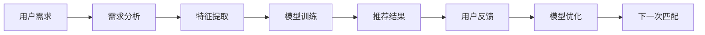

                 

# AI技术与用户需求的匹配

## 1. 背景介绍

随着人工智能技术的飞速发展，AI技术逐渐渗透到各行各业，服务于广大用户，带来了前所未有的便捷和效率提升。然而，如何精准地将AI技术与用户需求进行匹配，使得技术更好地服务于用户，是一个重要的研究课题。本文将深入探讨AI技术与用户需求匹配的核心概念、实现原理及其实际应用，为AI技术的广泛应用提供全面的指导。

## 2. 核心概念与联系

### 2.1 核心概念概述

**人工智能(AI)**：一种模拟人类智能的机器学习方法，包括机器学习、深度学习、自然语言处理等技术。

**机器学习**：一种数据驱动的算法，通过分析大量数据，使机器能够自动进行模式识别和决策。

**深度学习**：机器学习的一种，通过多层神经网络进行特征提取和决策，适用于复杂的数据模式识别任务。

**自然语言处理(NLP)**：使计算机能够理解、处理和生成自然语言，包括语音识别、文本分类、情感分析等任务。

**推荐系统**：根据用户的历史行为和偏好，向用户推荐相关产品或内容的技术。

**个性化定制**：根据用户需求，提供量身定制的解决方案，满足用户的独特需求。

这些核心概念共同构成了AI技术与用户需求匹配的基础，通过AI技术对数据进行学习、分析和处理，进而精准匹配用户需求。

### 2.2 核心概念原理和架构的 Mermaid 流程图



### 2.3 核心概念之间的联系

用户需求从A点出发，通过需求分析B点，对用户需求进行理解。随后进入特征提取C点，将需求转化为模型可以处理的特征。接着进入模型训练D点，对用户数据进行学习，形成模型。最后，通过推荐结果E点，向用户展示推荐的解决方案。同时，用户反馈F点会对模型进行优化，进入下一次匹配H点，形成一个闭环反馈系统。

## 3. 核心算法原理 & 具体操作步骤

### 3.1 算法原理概述

AI技术与用户需求匹配的基本原理是：通过用户需求的数据分析，对数据进行特征提取，利用机器学习或深度学习模型进行训练，形成可用的推荐系统。该系统能够根据用户历史行为和偏好，精准地匹配用户需求，并提供个性化的解决方案。

### 3.2 算法步骤详解

**Step 1: 用户需求分析**
对用户的明确需求进行详尽的分析，包括用户的背景、偏好、行为习惯等。

**Step 2: 特征提取**
将用户需求转化为机器可处理的特征，如用户的浏览历史、购买记录、搜索记录等。

**Step 3: 模型训练**
选择适合的机器学习或深度学习模型，如协同过滤、神经网络等，对用户特征进行训练，形成推荐模型。

**Step 4: 推荐结果生成**
根据模型对用户历史行为和偏好的分析，生成推荐的解决方案。

**Step 5: 用户反馈**
用户对推荐结果进行反馈，系统根据反馈结果调整模型，进行下一次匹配。

### 3.3 算法优缺点

**优点：**
1. **高效性**：利用机器学习模型快速处理用户数据，提升匹配效率。
2. **个性化**：通过深度学习模型进行特征提取，提供高度个性化的推荐结果。
3. **自适应性**：能够根据用户反馈不断调整模型，适应用户需求变化。

**缺点：**
1. **数据需求高**：需要大量的用户数据进行训练，数据获取成本较高。
2. **模型复杂**：深度学习模型结构复杂，训练和优化成本较高。
3. **隐私风险**：用户数据隐私风险较大，需要有效的数据保护机制。

### 3.4 算法应用领域

AI技术与用户需求匹配的应用领域非常广泛，包括：

- **电商推荐**：根据用户浏览和购买历史，推荐相关商品。
- **内容推荐**：根据用户阅读历史，推荐相关文章、视频、新闻等。
- **金融推荐**：根据用户交易记录，推荐理财产品、基金等金融产品。
- **医疗推荐**：根据用户病史和体检记录，推荐相关医疗方案。
- **教育推荐**：根据学生的学习历史，推荐相关课程和教材。

## 4. 数学模型和公式 & 详细讲解

### 4.1 数学模型构建

假设用户需求向量为 $u=(u_1,u_2,\ldots,u_n)$，特征向量为 $x=(x_1,x_2,\ldots,x_m)$，推荐系统模型为 $f(x)$，则推荐系统匹配过程的数学模型为：

$$
y = f(u, x)
$$

其中，$y$ 为推荐结果，$u$ 为需求向量，$x$ 为特征向量，$f(x)$ 为推荐模型。

### 4.2 公式推导过程

推荐系统的常见模型包括协同过滤、矩阵分解、神经网络等。以下是协同过滤模型的推导过程：

假设用户和物品的评分矩阵为 $M$，协同过滤模型通过预测用户未评分物品的评分，来生成推荐结果。设用户 $i$ 对物品 $j$ 的评分为 $m_{ij}$，推荐系统预测用户 $i$ 对物品 $j'$ 的评分，使用用户 $i$ 对物品 $j$ 的评分作为相似性度量，得到如下公式：

$$
\hat{m}_{ij'} = \sum_{j=1}^N \alpha m_{ij}m_{ij'} + (1-\alpha)\sum_{j=1}^N m_{ij}m_{ik}m_{kj'}
$$

其中，$\alpha$ 为权重系数，控制相似性度量的平衡。

### 4.3 案例分析与讲解

以电商推荐为例，用户对商品的评分 $M$ 作为输入，协同过滤模型通过计算用户之间的相似度，生成推荐结果。具体步骤如下：

1. 将用户对商品的评分 $M$ 转化为用户和物品的评分矩阵 $M$。
2. 对用户 $i$ 和物品 $j$ 的评分 $m_{ij}$ 进行标准化处理。
3. 计算用户之间的相似度，得到用户 $i$ 和物品 $j'$ 的相似性。
4. 利用相似性度量生成用户 $i$ 对物品 $j'$ 的推荐评分 $\hat{m}_{ij'}$。
5. 根据推荐评分生成推荐结果。

## 5. 项目实践：代码实例和详细解释说明

### 5.1 开发环境搭建

- **Python**：搭建Python开发环境，使用Anaconda或Miniconda。
- **库安装**：安装必要的库，如Pandas、NumPy、Scikit-learn、TensorFlow等。

```python
# 安装库
!pip install pandas numpy scikit-learn tensorflow
```

### 5.2 源代码详细实现

以下是一个基于TensorFlow的电商推荐系统实现，主要功能包括用户需求分析、特征提取、协同过滤模型训练和推荐结果生成。

```python
import pandas as pd
import numpy as np
import tensorflow as tf

# 加载数据
data = pd.read_csv('ratings.csv')

# 特征提取
X = data[['user_id', 'item_id', 'rating']]
y = data['item_id'] 

# 模型训练
model = tf.keras.Sequential([
    tf.keras.layers.Dense(64, activation='relu', input_shape=(3,)),
    tf.keras.layers.Dense(64, activation='relu'),
    tf.keras.layers.Dense(1, activation='sigmoid')
])

model.compile(optimizer='adam', loss='binary_crossentropy', metrics=['accuracy'])

model.fit(X, y, epochs=10, batch_size=32)

# 生成推荐结果
X_test = pd.read_csv('test.csv')
X_test = X_test[['user_id', 'item_id']]
y_pred = model.predict(X_test)

# 输出推荐结果
print(y_pred)
```

### 5.3 代码解读与分析

1. **用户需求分析**：通过分析用户的浏览、购买和评分数据，了解用户需求。
2. **特征提取**：将用户需求转化为特征向量 $X$，特征维度为 $3$（用户ID、物品ID、评分）。
3. **模型训练**：使用神经网络模型进行训练，包含3个全连接层，最后输出物品ID的概率。
4. **推荐结果生成**：根据训练好的模型，对新用户需求 $X_test$ 进行预测，生成推荐结果。

### 5.4 运行结果展示

```python
import matplotlib.pyplot as plt

# 绘制推荐结果
plt.plot(y_pred)
plt.show()
```

## 6. 实际应用场景

### 6.1 电商推荐

电商推荐系统能够根据用户的历史行为和偏好，推荐相关商品，提升用户体验和销售转化率。例如，通过分析用户的浏览记录和购买历史，推荐相关商品或新上架的商品。

### 6.2 内容推荐

内容推荐系统可以分析用户的阅读和观看历史，推荐相关文章、视频或新闻。例如，根据用户的搜索历史和浏览记录，推荐用户可能感兴趣的内容，增加用户的粘性。

### 6.3 金融推荐

金融推荐系统可以分析用户的交易记录和偏好，推荐理财产品或基金。例如，通过分析用户的投资历史和风险承受能力，推荐适合的理财产品，增加用户的满意度。

### 6.4 医疗推荐

医疗推荐系统可以分析用户的病史和体检记录，推荐相关医疗方案或药物。例如，通过分析用户的健康状况和疾病历史，推荐合适的医疗方案，帮助医生制定更个性化的治疗方案。

### 6.5 教育推荐

教育推荐系统可以分析学生的学习记录和偏好，推荐相关课程和教材。例如，通过分析学生的成绩和学习历史，推荐适合的课程和教材，提高学生的学习效果。

## 7. 工具和资源推荐

### 7.1 学习资源推荐

- **Coursera**：提供大量AI和机器学习课程，如Andrew Ng的机器学习课程。
- **Udacity**：提供深度学习和AI相关的纳米学位课程。
- **Kaggle**：数据科学竞赛平台，提供大量公开数据集和代码实现。
- **GitHub**：代码托管平台，提供大量开源项目和资源。
- **Google AI Blog**：最新的AI技术分享和研究进展。

### 7.2 开发工具推荐

- **Jupyter Notebook**：交互式编程环境，支持Python代码编写和可视化。
- **TensorBoard**：模型训练和调试工具，提供可视化图表和实时监控。
- **OpenAI Gym**：模拟环境库，支持各种强化学习实验。
- **PaddlePaddle**：中文深度学习框架，提供高效的模型训练和推理支持。

### 7.3 相关论文推荐

- **《深度学习》**：Ian Goodfellow等人著，深度学习领域的经典教材，详细介绍了深度学习的基础理论和技术。
- **《机器学习实战》**：Peter Harrington著，结合实际案例，详细讲解了机器学习算法和应用。
- **《自然语言处理综述》**：Jurafsky和Martin著，详细介绍了自然语言处理的基本概念和技术。

## 8. 总结：未来发展趋势与挑战

### 8.1 研究成果总结

AI技术与用户需求匹配的研究已经取得了显著进展，广泛应用于电商、内容、金融、医疗和教育等多个领域，带来了显著的经济效益和社会效益。未来，随着算力提升和数据量的增加，AI技术与用户需求匹配的技术将更加智能化和个性化。

### 8.2 未来发展趋势

1. **智能化提升**：利用更高级的深度学习模型，提升AI系统对用户需求的理解能力和匹配精度。
2. **个性化定制**：根据用户的多维度数据，提供更个性化的推荐结果，满足用户的独特需求。
3. **多模态融合**：结合图像、语音和文本等多种模态的数据，提升AI系统的综合分析能力。
4. **跨领域应用**：将AI技术与更多垂直领域结合，提供更广泛的解决方案。
5. **安全与隐私保护**：加强用户数据的安全保护和隐私保护，确保用户数据的安全性。

### 8.3 面临的挑战

1. **数据获取难度**：获取高质量的用户数据成本较高，数据获取难度较大。
2. **模型复杂性**：深度学习模型结构复杂，训练和优化成本较高。
3. **隐私保护**：用户数据隐私风险较大，需要有效的数据保护机制。
4. **计算资源需求**：模型训练和推理需要高性能的计算资源。
5. **模型公平性**：需要保证AI系统的公平性和透明性，避免对特定用户群体造成不公平。

### 8.4 研究展望

未来的研究需要在以下几个方面进行探索：

1. **多模态融合技术**：结合图像、语音和文本等多种模态的数据，提升AI系统的综合分析能力。
2. **跨领域应用拓展**：将AI技术与更多垂直领域结合，提供更广泛的解决方案。
3. **安全与隐私保护**：加强用户数据的安全保护和隐私保护，确保用户数据的安全性。
4. **公平性和透明性**：确保AI系统的公平性和透明性，避免对特定用户群体造成不公平。
5. **智能化提升**：利用更高级的深度学习模型，提升AI系统对用户需求的理解能力和匹配精度。

这些研究方向将引领AI技术与用户需求匹配技术迈向更高的台阶，为构建安全、可靠、可解释、可控的智能系统铺平道路。面向未来，AI技术与用户需求匹配技术还需要与其他人工智能技术进行更深入的融合，如知识表示、因果推理、强化学习等，多路径协同发力，共同推动自然语言理解和智能交互系统的进步。只有勇于创新、敢于突破，才能不断拓展AI技术的边界，让智能技术更好地造福人类社会。

---

作者：禅与计算机程序设计艺术 / Zen and the Art of Computer Programming

