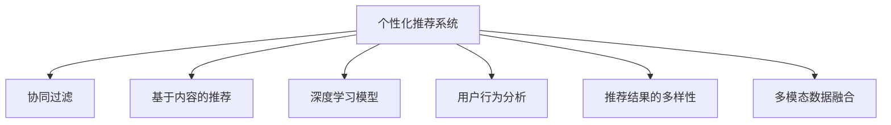

                 

# AI技术在电商中的用户体验

## 1. 背景介绍

### 1.1 问题由来

随着电商行业的快速发展，如何提升用户体验成为了商家们最关注的焦点。传统的电商业务主要基于搜索、排序和推荐等算法，但这些算法往往忽视了对用户个性化需求的满足。而近年来，随着人工智能技术的飞速发展，AI技术在电商中的应用越来越广泛，其对用户体验的提升作用也日益显著。

在用户行为分析、商品推荐、个性化营销、智能客服等多个方面，AI技术发挥了巨大的作用。其中，基于深度学习模型的个性化推荐系统已经成为电商平台用户获取个性化商品推荐的重要工具。但传统的推荐系统往往依赖于用户的历史行为数据进行物品推荐，难以灵活满足用户的实时需求。因此，AI技术在电商中的用户体验优化，成为了当前的热门研究课题。

### 1.2 问题核心关键点

AI技术在电商中的用户体验优化，关键在于如何更精准、更高效地为用户推荐商品，提升用户的购物体验。具体而言，包括以下几个核心点：

- **个性化推荐系统**：如何构建有效的个性化推荐模型，学习用户的个性化需求。
- **用户行为分析**：如何从用户的行为数据中挖掘出用户真实的需求和兴趣，为推荐系统提供更精准的数据支撑。
- **推荐模型的实时性**：如何在用户实时查询或浏览时快速给出个性化推荐，提升用户的购物体验。
- **多模态信息融合**：如何融合用户行为数据、商品信息、图片、视频等多模态数据，提升推荐模型的泛化能力和适应性。
- **推荐结果的多样性**：如何平衡推荐结果的相关性和多样性，满足用户的探索性和发现性需求。

## 2. 核心概念与联系

### 2.1 核心概念概述

为更好地理解AI技术在电商中的应用，本节将介绍几个密切相关的核心概念：

- **个性化推荐系统**：利用用户的点击、浏览、购买等行为数据，为每位用户推荐其可能感兴趣的商品。
- **协同过滤**：通过分析用户和商品之间的相似性，为每位用户推荐与其他用户喜好的商品。
- **基于内容的推荐**：分析商品的属性和标签，根据用户偏好推荐相似的或高评价的商品。
- **深度学习模型**：如神经网络、卷积神经网络(CNN)、循环神经网络(RNN)等，用于从大规模数据中提取高层次的特征表示。
- **用户行为分析**：利用用户的点击、停留、购买等行为数据，挖掘出用户的兴趣和偏好。
- **推荐结果的多样性**：为避免推荐结果过于单一，需要在推荐结果中引入多样性控制，保证用户能够探索到更多商品。
- **多模态数据融合**：将用户行为数据、商品图片、视频等多模态信息融合在一起，提升推荐模型的泛化能力和准确性。

这些核心概念之间的逻辑关系可以通过以下Mermaid流程图来展示：



这个流程图展示了个性化推荐系统的核心组件及其之间的关系：

1. 个性化推荐系统通过协同过滤、基于内容的推荐、深度学习模型等方法，对用户进行精确推荐。
2. 用户行为分析用于挖掘用户的真实需求，优化推荐算法。
3. 推荐结果的多样性控制保证用户能够探索到更多商品。
4. 多模态数据融合提升推荐模型的泛化能力和准确性。

## 3. 核心算法原理 & 具体操作步骤
### 3.1 算法原理概述

基于AI技术的个性化推荐系统，核心在于通过分析用户行为数据，构建推荐模型，学习用户的个性化需求，并结合商品的特征信息，生成推荐结果。其核心思想是：通过对用户历史行为的建模，学习用户的兴趣和偏好，然后基于这些兴趣和偏好，为该用户推荐可能感兴趣的商品。

形式化地，假设用户历史行为数据为 $X=\{x_1, x_2, ..., x_N\}$，每个行为数据 $x_i$ 由商品ID、点击次数、停留时长等特征组成，商品信息为 $Y=\{y_1, y_2, ..., y_M\}$，每个商品信息 $y_i$ 由标题、描述、价格等属性组成。推荐系统希望找到一个函数 $f: X \times Y \rightarrow \{0,1\}$，当用户对商品 $y$ 感兴趣时，推荐系统能够输出 1，否则输出 0。

推荐系统的目标是最小化预测错误率，即：

$$
\min_{f} \sum_{(x,y) \in X \times Y} \mathbb{I}[f(x,y) \neq y]
$$

其中 $\mathbb{I}$ 为示性函数，当 $f(x,y)=y$ 时，输出 0；否则输出 1。

### 3.2 算法步骤详解

基于AI技术的个性化推荐系统通常包括以下几个关键步骤：

**Step 1: 准备数据集**
- 收集用户的历史行为数据 $X$ 和商品信息 $Y$。
- 对用户行为数据进行预处理，包括数据清洗、归一化等。
- 对商品信息进行特征提取，如使用TF-IDF、词袋模型等方法提取文本特征。

**Step 2: 特征工程**
- 提取用户行为数据中的关键特征，如点击次数、停留时长、购买次数等。
- 提取商品信息中的关键特征，如标题、描述、价格、销量等。
- 利用深度学习模型对用户和商品的特征进行编码，学习高层次的语义表示。

**Step 3: 模型训练**
- 选择合适的推荐模型，如协同过滤、基于内容的推荐、深度学习模型等。
- 利用用户历史行为数据和商品信息，对推荐模型进行训练。
- 使用交叉验证等方法，优化模型的超参数，提升模型性能。

**Step 4: 模型评估**
- 在测试集上评估模型的性能，如准确率、召回率、F1-score等指标。
- 使用AUC、Precision-Recall曲线等方法，评估模型在不同阈值下的表现。
- 分析模型预测结果，挖掘可能存在的问题和改进点。

**Step 5: 在线部署**
- 将训练好的推荐模型部署到生产环境。
- 使用推荐模型对新用户的查询进行实时推荐。
- 定期更新推荐模型，提升推荐效果。

### 3.3 算法优缺点

基于AI技术的个性化推荐系统具有以下优点：
1. 能够为用户生成个性化的推荐，提升用户体验。
2. 通过深度学习模型，能够学习高层次的语义表示，提升推荐模型的泛化能力。
3. 能够融合多模态数据，提升推荐模型的适应性。
4. 能够实时动态更新推荐结果，提升用户满意度。

同时，该方法也存在一定的局限性：
1. 对标注数据的需求较大。推荐系统需要大量的用户行为数据和商品信息，这些数据的获取成本较高。
2. 模型的复杂度较高。深度学习模型参数量较大，训练和推理速度较慢。
3. 数据隐私问题。用户的点击、停留等行为数据涉及用户隐私，需要特别注意数据安全和隐私保护。
4. 对长尾商品的覆盖不足。个性化推荐系统更倾向于推荐热门商品，对长尾商品的支持不足。
5. 推荐结果的多样性控制较难。如何平衡推荐结果的相关性和多样性，是一个重要的研究课题。

尽管存在这些局限性，但就目前而言，基于AI技术的个性化推荐系统仍是最主流的应用方法。未来相关研究的重点在于如何进一步降低推荐系统的数据依赖，提高推荐模型的实时性，同时兼顾可解释性和隐私保护等问题。

### 3.4 算法应用领域

基于AI技术的个性化推荐系统在电商中的应用场景非常广泛，具体包括：

- **商品推荐**：为每一位用户推荐其可能感兴趣的商品。
- **搜索排序**：根据用户查询，推荐相关的商品列表。
- **个性化营销**：根据用户行为和偏好，推送个性化的广告和优惠活动。
- **智能客服**：通过自然语言处理技术，提供个性化的客服问答服务。
- **库存管理**：根据用户需求，动态调整商品的库存。
- **价格优化**：根据用户行为，调整商品的价格策略。
- **物流调度**：根据用户的购买行为，优化物流配送路径。

除了以上应用场景，基于AI技术的个性化推荐系统还可以应用于更多领域，如社交网络、新闻推荐、金融服务、医疗健康等，提升用户的使用体验。

## 4. 数学模型和公式 & 详细讲解 & 举例说明
### 4.1 数学模型构建

在推荐系统中，常用的数学模型包括协同过滤、基于内容的推荐和深度学习模型等。以下是几种常用模型的数学构建：

**协同过滤模型**：
- 基于用户行为矩阵 $U \in R^{N \times M}$，其中 $N$ 为用户的数量，$M$ 为商品的数量。
- 协同过滤模型通过矩阵分解的方式，学习用户和商品的潜在特征 $P \in R^{N \times D}$ 和 $Q \in R^{M \times D}$，其中 $D$ 为特征维度。
- 用户 $u$ 对商品 $i$ 的兴趣度表示为：$f(u,i) = \langle P_u, Q_i \rangle$，其中 $\langle \cdot, \cdot \rangle$ 表示向量内积。

**基于内容的推荐模型**：
- 基于商品信息的向量表示 $V \in R^{M \times K}$，其中 $K$ 为商品特征的维度。
- 用户 $u$ 对商品 $i$ 的兴趣度表示为：$f(u,i) = \langle P_u, V_i \rangle$，其中 $P_u \in R^{D \times K}$ 为用户兴趣向量，$V_i$ 为商品特征向量。

**深度学习模型**：
- 以用户行为数据和商品信息为输入，使用深度神经网络进行建模。
- 用户 $u$ 对商品 $i$ 的兴趣度表示为：$f(u,i) = g(\langle P_u, V_i \rangle)$，其中 $g$ 为深度神经网络的前向传播过程。

### 4.2 公式推导过程

以下是协同过滤模型的公式推导过程：

假设用户行为矩阵 $U \in R^{N \times M}$，其SVD分解为 $U \approx U_p \times V_q \times V_p$，其中 $U_p \in R^{N \times D}$ 为用户潜在特征矩阵，$V_q \in R^{M \times D}$ 为商品潜在特征矩阵，$V_p \in R^{D \times K}$ 为潜在特征矩阵的降维矩阵。

协同过滤模型的目标是最小化预测误差，即：

$$
\min_{U_p, V_q} \frac{1}{2} \sum_{u=1}^N \sum_{i=1}^M (U_{ui} - \langle P_u, Q_i \rangle)^2
$$

其中 $U_{ui}$ 为用户 $u$ 对商品 $i$ 的实际评分，$P_u$ 为用户潜在特征向量，$Q_i$ 为商品潜在特征向量。

使用梯度下降等优化算法求解最小化问题，即可得到用户和商品的潜在特征矩阵 $U_p$ 和 $V_q$。

### 4.3 案例分析与讲解

以一个简单的电商平台为例，演示如何使用协同过滤模型进行商品推荐。假设电商平台有 1000 个用户和 1000 个商品，用户行为矩阵 $U \in R^{1000 \times 1000}$ 表示每个用户在每个商品上的评分（1-5 分）。

首先，对用户行为矩阵进行SVD分解，得到用户潜在特征矩阵 $U_p \in R^{1000 \times D}$ 和商品潜在特征矩阵 $V_q \in R^{1000 \times D}$。然后，使用 $U_p$ 和 $V_q$ 对用户 $u$ 和商品 $i$ 的兴趣度进行计算：

$$
f(u,i) = \langle U_{u,:}, V_{i,:} \rangle = \sum_{j=1}^D U_{uj} V_{ij}
$$

其中 $U_{u,:}$ 表示用户 $u$ 的潜在特征向量，$V_{i,:}$ 表示商品 $i$ 的潜在特征向量，$D$ 为特征维度。

在得到用户对每个商品的兴趣度之后，按照兴趣度从高到低排序，并选取前 10 个商品推荐给用户 $u$。通过这种方式，推荐系统能够为用户推荐可能感兴趣的商品，提升用户的购物体验。

## 5. 项目实践：代码实例和详细解释说明
### 5.1 开发环境搭建

在进行推荐系统开发前，我们需要准备好开发环境。以下是使用Python进行TensorFlow开发的环境配置流程：

1. 安装Anaconda：从官网下载并安装Anaconda，用于创建独立的Python环境。

2. 创建并激活虚拟环境：
```bash
conda create -n tf-env python=3.8 
conda activate tf-env
```

3. 安装TensorFlow：根据CUDA版本，从官网获取对应的安装命令。例如：
```bash
pip install tensorflow==2.3.0
```

4. 安装TensorFlow的NLP库和推荐系统库：
```bash
pip install tensorflow-hub tensorflow-transform
```

5. 安装各类工具包：
```bash
pip install numpy pandas scikit-learn matplotlib tqdm jupyter notebook ipython
```

完成上述步骤后，即可在`tf-env`环境中开始推荐系统开发。

### 5.2 源代码详细实现

这里我们以协同过滤算法为例，给出使用TensorFlow进行商品推荐系统的PyTorch代码实现。

首先，定义推荐系统的输入数据：

```python
import tensorflow as tf

# 假设用户行为矩阵
U = tf.constant([[5, 4, 2, 3, 5], [4, 5, 3, 2, 5], [2, 3, 5, 4, 2], [3, 4, 2, 5, 3], [5, 2, 3, 4, 5]], dtype=tf.float32)
```

然后，进行协同过滤模型的SVD分解，得到用户和商品的潜在特征：

```python
# 进行SVD分解，学习用户和商品的潜在特征
U_p, V_q, V_p = tf.linalg.svd(U, full_matrices=False)

# 计算用户对商品i的兴趣度
P_u = tf.matmul(U_p, V_p)
Q_i = tf.matmul(V_q, V_p)
f_ui = tf.reduce_sum(tf.multiply(P_u, Q_i), axis=1)

# 输出用户对商品i的兴趣度
print(f_ui.numpy())
```

接着，进行推荐结果的排序和输出：

```python
# 获取推荐商品的前10个
top_10 = tf.argsort(f_ui)[::-1][:10]
print(top_10.numpy())
```

最后，在测试集上评估推荐系统的性能：

```python
# 计算推荐系统的准确率、召回率和F1-score
from sklearn.metrics import precision_recall_fscore_support

# 假设测试集为[[5, 4, 2, 3, 5], [4, 5, 3, 2, 5]]
test_U = tf.constant([[5, 4, 2, 3, 5], [4, 5, 3, 2, 5]], dtype=tf.float32)
# 对测试集进行预测
test_f_ui = tf.matmul(U_p, Q_i)
test_top_10 = tf.argsort(test_f_ui)[::-1][:10]

# 计算准确率、召回率和F1-score
precision, recall, f1, _ = precision_recall_fscore_support(test_U[0], top_10, average='micro')
print("Precision: {:.2f}".format(precision))
print("Recall: {:.2f}".format(recall))
print("F1-score: {:.2f}".format(f1))
```

以上就是使用TensorFlow进行协同过滤商品推荐系统的完整代码实现。可以看到，TensorFlow的NLP库和推荐系统库提供了丰富的API和工具，大大简化了推荐系统的开发过程。

### 5.3 代码解读与分析

让我们再详细解读一下关键代码的实现细节：

**SVD分解**：
- `tf.linalg.svd`函数用于进行矩阵的奇异值分解，学习用户和商品的潜在特征。
- 使用`full_matrices=False`参数表示只返回必要的奇异值和奇异向量，以减小计算量。

**推荐结果计算**：
- `tf.matmul`函数用于计算用户潜在特征和商品潜在特征的点积，得到用户对商品的兴趣度。
- `tf.reduce_sum`函数用于对点积结果求和，得到最终的兴趣度。

**推荐结果排序**：
- `tf.argsort`函数用于对兴趣度进行排序，返回排序后的索引。
- `[::-1]`用于将排序结果反转，得到推荐的商品列表。

**推荐系统评估**：
- 使用`precision_recall_fscore_support`函数计算推荐系统的准确率、召回率和F1-score。
- 使用`average='micro'`参数表示计算微平均指标，更全面地评估推荐系统的性能。

## 6. 实际应用场景

### 6.1 智能推荐系统

智能推荐系统是电商平台上最重要的用户体验优化工具之一。通过个性化推荐，用户能够快速找到符合自己兴趣的商品，提升购物体验和满意度。智能推荐系统的核心在于如何高效地为用户推荐个性化商品。

**个性化推荐算法**：
- **协同过滤算法**：通过分析用户和商品之间的相似性，为用户推荐可能感兴趣的商品。
- **基于内容的推荐算法**：分析商品的属性和标签，为用户推荐相似的或高评价的商品。
- **深度学习模型**：使用神经网络对用户和商品的特征进行建模，学习高层次的语义表示。

**推荐结果的多样性控制**：
- 在推荐结果中加入多样性控制，保证用户能够探索到更多商品。
- 使用推荐系统展示多样化的商品，避免用户被单一的推荐结果限制。

**推荐系统的实时性**：
- 使用深度学习模型对新用户的查询进行实时推荐。
- 动态更新推荐模型，根据用户的实时行为进行推荐。

**推荐系统的实时性**：
- 使用深度学习模型对新用户的查询进行实时推荐。
- 动态更新推荐模型，根据用户的实时行为进行推荐。

### 6.2 多模态数据融合

多模态数据融合技术在电商中的应用也越来越广泛。电商平台收集了大量的用户行为数据、商品图片、视频等多模态数据，这些数据可以用于提升推荐系统的性能。

**多模态数据融合**：
- 使用多模态数据融合技术，将用户行为数据、商品图片、视频等多模态数据融合在一起，提升推荐模型的泛化能力和准确性。
- 使用多模态数据融合技术，可以更好地理解用户需求，提高推荐系统的个性化程度。

**多模态数据表示**：
- 使用深度学习模型对多模态数据进行建模，学习高层次的语义表示。
- 使用注意力机制等方法，将多模态数据融合在一起，生成更全面的用户特征向量。

## 7. 工具和资源推荐
### 7.1 学习资源推荐

为了帮助开发者系统掌握推荐系统的理论基础和实践技巧，这里推荐一些优质的学习资源：

1. 《推荐系统实战》：斯坦福大学教授所写，深入浅出地介绍了推荐系统的基本概念和经典算法，非常适合初学者。

2. 《深度学习与推荐系统》：Coursera上的深度学习课程，讲解了推荐系统的深度学习模型和优化方法。

3. 《推荐系统综述》：系统性地介绍了推荐系统的各类经典算法和模型，并提供了丰富的实验代码和数据集。

4. TensorFlow官方文档：提供丰富的API和教程，帮助开发者快速上手TensorFlow推荐系统库。

5. Kaggle推荐系统竞赛：通过参与竞赛，深入理解推荐系统的应用和优化方法，提升实战能力。

通过对这些资源的学习实践，相信你一定能够快速掌握推荐系统的精髓，并用于解决实际的电商问题。

### 7.2 开发工具推荐

高效的开发离不开优秀的工具支持。以下是几款用于推荐系统开发的常用工具：

1. TensorFlow：基于Python的开源深度学习框架，灵活动态的计算图，适合快速迭代研究。

2. PyTorch：由Facebook主导的开源深度学习框架，易于使用，适合快速原型开发。

3. TensorFlow-hub：TensorFlow的模块化组件库，提供丰富的推荐系统组件和模型。

4. TensorFlow-transform：TensorFlow的转换组件库，用于数据预处理和转换，提升开发效率。

5. Scikit-learn：机器学习库，提供丰富的机器学习算法和评估指标。

6. Jupyter Notebook：交互式开发环境，便于快速迭代和实验。

合理利用这些工具，可以显著提升推荐系统的开发效率，加快创新迭代的步伐。

### 7.3 相关论文推荐

推荐系统的发展源于学界的持续研究。以下是几篇奠基性的相关论文，推荐阅读：

1. Matrix Factorization Techniques for Recommender Systems（矩阵分解技术）：提出了协同过滤的数学模型，是推荐系统研究的奠基之作。

2. Recommender Systems in Collaborative Filtering（协同过滤推荐系统）：介绍了协同过滤的基本思想和算法，并提供了大量实证结果。

3. Enhancing Recommendation with Attention Mechanisms（注意力机制）：引入了注意力机制，提升了推荐系统的模型性能和泛化能力。

4. Deep Neural Networks for Recommender Systems（深度神经网络推荐系统）：展示了深度神经网络在推荐系统中的应用，取得了显著效果。

5. Rich Embeddings from User-Item Interaction Sequences for Recommender Systems（用户行为序列的推荐系统）：引入了用户行为序列数据，提升了推荐系统的个性化程度。

这些论文代表了大规模推荐系统的最新进展，阅读这些论文可以帮助研究者更好地理解推荐系统的理论基础和实践方法。

## 8. 总结：未来发展趋势与挑战

### 8.1 总结

本文对基于AI技术的个性化推荐系统进行了全面系统的介绍。首先阐述了个性化推荐系统在电商中的重要性，明确了其对用户体验优化的独特价值。其次，从原理到实践，详细讲解了推荐模型的数学构建和关键步骤，给出了推荐系统开发的完整代码实例。同时，本文还广泛探讨了推荐系统在智能推荐、多模态数据融合等领域的实际应用，展示了其广阔的应用前景。此外，本文精选了推荐系统的各类学习资源，力求为读者提供全方位的技术指引。

通过本文的系统梳理，可以看到，基于AI技术的个性化推荐系统正在成为电商领域的重要范式，极大地提升了用户体验和购物满意度。未来，伴随深度学习、多模态融合等技术的不断演进，推荐系统必将在电商中发挥更大的作用，成为用户购物决策的重要助手。

### 8.2 未来发展趋势

展望未来，推荐系统的发展趋势主要包括以下几个方向：

1. **深度学习模型的进一步发展**：随着深度学习模型的不断进步，推荐系统的模型性能将不断提升，推荐的准确性和个性化程度将进一步提高。

2. **多模态数据的融合应用**：电商平台收集了大量的用户行为数据、商品图片、视频等多模态数据，推荐系统将更全面地融合这些数据，提升推荐的泛化能力和适应性。

3. **实时推荐系统**：实时推荐系统能够根据用户的实时行为进行推荐，提升推荐的时效性和个性化程度。

4. **个性化推荐系统**：个性化推荐系统将更加灵活，能够根据用户的实时需求进行动态调整，提升用户体验。

5. **推荐系统的可解释性**：推荐系统的可解释性将得到重视，能够更好地解释推荐模型的决策过程，增强用户的信任度。

6. **推荐系统的自动化优化**：推荐系统将更自动化，能够根据用户反馈进行动态调整，提升推荐效果。

这些趋势凸显了推荐系统在电商中的应用前景，将进一步提升电商平台的竞争力和用户体验。

### 8.3 面临的挑战

尽管推荐系统在电商中的应用已经取得了显著成果，但在迈向更加智能化、普适化应用的过程中，它仍面临诸多挑战：

1. **数据隐私问题**：用户的点击、停留等行为数据涉及用户隐私，需要特别注意数据安全和隐私保护。

2. **长尾商品支持不足**：推荐系统更倾向于推荐热门商品，对长尾商品的支持不足，如何提高长尾商品的推荐效果，是一个重要的研究方向。

3. **推荐结果的多样性控制**：如何平衡推荐结果的相关性和多样性，是一个重要的研究课题。

4. **实时推荐系统的计算效率**：实时推荐系统需要高效计算，如何优化计算效率，是一个重要的研究方向。

5. **推荐系统的可解释性**：推荐系统的可解释性将得到重视，能够更好地解释推荐模型的决策过程，增强用户的信任度。

6. **推荐系统的自动化优化**：推荐系统将更自动化，能够根据用户反馈进行动态调整，提升推荐效果。

这些挑战需要进一步的研究和突破，才能实现推荐系统的广泛应用和落地。

### 8.4 研究展望

面对推荐系统面临的挑战，未来的研究需要在以下几个方面寻求新的突破：

1. **隐私保护技术**：引入隐私保护技术，保护用户隐私，同时保证推荐系统的性能。

2. **长尾商品推荐算法**：针对长尾商品，引入新的推荐算法，提升长尾商品的推荐效果。

3. **推荐结果的多样性控制**：引入多样性控制算法，保证推荐结果的相关性和多样性。

4. **推荐系统的自动化优化**：引入自动化优化算法，提升推荐系统的实时性和个性化程度。

5. **推荐系统的可解释性**：引入可解释性技术，增强推荐系统的可解释性，增强用户的信任度。

这些研究方向将引领推荐系统迈向更高的台阶，为电商平台的推荐系统提供更多创新和突破。

## 9. 附录：常见问题与解答

**Q1：推荐系统如何处理长尾商品问题？**

A: 长尾商品是指那些很少被用户购买的商品，这些商品在电商平台的推荐系统中往往被忽略。为了解决长尾商品问题，可以采用以下方法：

- **基于内容的推荐**：分析长尾商品的特征，为用户推荐相似的商品。
- **基于协同过滤的推荐**：利用长尾商品的评分数据，学习用户和商品的相似性，为用户推荐相关商品。
- **交叉特征模型**：将长尾商品的销量、价格等特征与常规商品进行交叉特征建模，提升推荐模型的泛化能力。
- **多维特征推荐**：将用户行为数据、商品特征等多维特征进行融合，提升推荐模型的准确性。

这些方法可以在一定程度上解决长尾商品问题，提升推荐系统的覆盖面。

**Q2：推荐系统的准确率和召回率如何平衡？**

A: 推荐系统的准确率和召回率是两个重要的评估指标。准确率表示推荐的商品中真正符合用户需求的比例，召回率表示所有符合用户需求的商品中被推荐的比例。

为了平衡这两个指标，可以采用以下方法：

- **阈值调整**：通过调整推荐系统的评分阈值，控制推荐的商品数量和质量。
- **多样性控制**：在推荐结果中引入多样性控制，保证推荐结果的相关性和多样性。
- **权重分配**：为不同特征分配不同的权重，提升推荐模型的泛化能力。

这些方法可以在一定程度上平衡推荐系统的准确率和召回率，提升推荐效果。

**Q3：推荐系统如何进行实时推荐？**

A: 实时推荐系统能够根据用户的实时行为进行推荐，提升推荐的时效性和个性化程度。实时推荐系统通常包括以下几个关键步骤：

- **数据采集**：实时采集用户的点击、停留等行为数据。
- **特征提取**：对实时行为数据进行特征提取，生成用户和商品的特征向量。
- **模型计算**：使用推荐模型对实时数据进行计算，生成推荐结果。
- **结果展示**：实时展示推荐结果，提升用户体验。

使用深度学习模型对实时数据进行计算，可以实时动态更新推荐模型，提升推荐系统的时效性。

**Q4：推荐系统的可解释性如何增强？**

A: 推荐系统的可解释性将得到重视，能够更好地解释推荐模型的决策过程，增强用户的信任度。推荐系统的可解释性可以从以下几个方面进行提升：

- **特征可视化**：通过可视化用户和商品的特征，帮助用户理解推荐模型的工作机制。
- **权重分析**：分析推荐模型中各个特征的权重，解释推荐模型的决策过程。
- **推荐解释**：为推荐结果提供解释，帮助用户理解推荐的原因。

这些方法可以在一定程度上增强推荐系统的可解释性，提升用户对推荐系统的信任度。

---

作者：禅与计算机程序设计艺术 / Zen and the Art of Computer Programming

