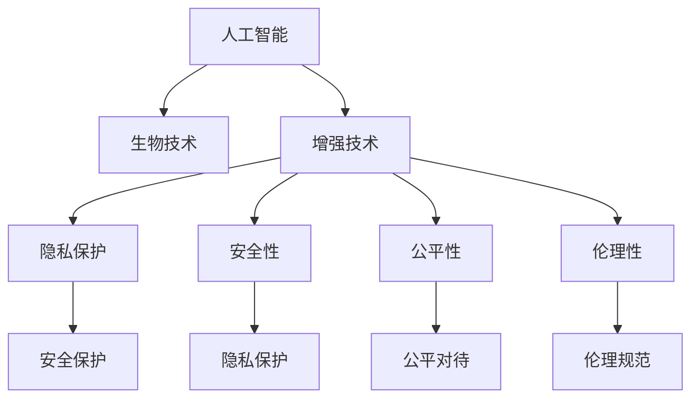

                 

## 1. 背景介绍

### 1.1 问题由来

随着科技的飞速发展，人工智能(AI)与生物技术(Biotech)的交叉融合，已经逐渐改变了人类生活的方方面面。特别是在AI与增强技术领域，各种身体增强设备和系统正在不断涌现，从基因编辑、脑机接口到虚拟现实、混合现实，人类在物理、精神、认知等多方面的能力正在得到前所未有的增强。然而，这些增强技术的应用也引发了诸多伦理和道德问题，诸如隐私保护、安全性、公平性等，成为社会广泛关注的话题。

### 1.2 问题核心关键点

增强技术最核心的问题在于如何平衡技术进步与伦理道德，确保这些技术的安全性和公平性，避免对个体和社会造成伤害。在AI与增强技术融合的趋势下，如何设计可信赖的技术，引导其良性发展，成为当前科技界和伦理界共同的挑战。

### 1.3 问题研究意义

研究和讨论AI与增强技术的道德边界，不仅有助于技术进步，也为社会正义、隐私保护、公平性等提供了重要的价值导向。在AI与增强技术不断发展的今天，明确其道德底线，不仅可以规避潜在的风险，还能推动技术更好地服务于人类社会的健康发展。

## 2. 核心概念与联系

### 2.1 核心概念概述

为更好地理解AI与增强技术的道德边界，本节将介绍几个密切相关的核心概念：

- **人工智能(AI)**：利用机器学习、深度学习等技术，使计算机系统具备类似于人类的智能决策能力。
- **生物技术(Biotech)**：通过基因工程、细胞工程等手段，改善或增强人类的生物学特性，如基因编辑技术CRISPR。
- **增强技术(Augmentation Technology)**：利用AI与Biotech手段，改善或增强人类的生理、精神、认知等能力的技术，如脑机接口、虚拟现实等。
- **隐私保护(Privacy Protection)**：确保个人信息安全，避免信息泄露和滥用。
- **安全性(Security)**：保证技术系统的安全运行，避免恶意攻击和意外事故。
- **公平性(Fairness)**：确保技术应用不会产生歧视和不公平现象，如种族、性别、经济等差异。
- **伦理性(Ethics)**：研究AI与增强技术的道德规范，指导技术的健康发展。

这些核心概念之间的逻辑关系可以通过以下Mermaid流程图来展示：



这个流程图展示了许多关键概念之间的联系：

1. 人工智能与生物技术的结合，催生了增强技术的诞生。
2. 增强技术的应用带来了隐私保护、安全性等伦理问题。
3. 隐私保护、安全性与公平性等共同构成了增强技术的道德边界。
4. 伦理性指导和约束技术的应用，确保其健康发展。

这些概念共同构成了AI与增强技术的伦理框架，为其发展提供了必要的道德指引。

## 3. 核心算法原理 & 具体操作步骤
### 3.1 算法原理概述

AI与增强技术的伦理边界，很大程度上取决于如何设计和实施这些技术。基于此，我们可以将伦理边界分为数据伦理、技术伦理和应用伦理三个层面进行讨论。

**数据伦理**关注数据的收集、处理和使用的道德规范，如隐私保护、数据共享等。数据是AI与增强技术的基础，数据的处理不当可能导致隐私泄露和滥用。

**技术伦理**则涉及技术设计和实现的道德规范，如安全性、可解释性、公平性等。技术的设计和实现应确保其安全可靠、公平透明。

**应用伦理**探讨技术应用过程中可能出现的伦理问题，如社会公平、个体权利等。应用伦理关注技术的社会影响，确保其不会带来不公平或歧视现象。

### 3.2 算法步骤详解

下面以增强技术中的应用伦理为例，详细讲解增强技术伦理边界的设计步骤：

**Step 1: 识别伦理风险**
- 识别增强技术应用中的潜在伦理问题，如隐私泄露、歧视性应用等。
- 通过风险评估和伦理审查，确保技术的伦理边界清晰。

**Step 2: 设计伦理准则**
- 根据识别出的伦理风险，设计具体的伦理准则和指南。
- 确保准则具有可操作性，能够指导技术的实施。

**Step 3: 实施伦理审查**
- 引入独立的伦理审查机制，对技术的实施进行监督和评估。
- 对技术应用中的伦理问题进行定期审核和反馈，确保其持续改进。

**Step 4: 透明化与问责**
- 确保技术的决策过程透明，公开算法和数据来源。
- 对技术应用中的问题进行及时响应和问责，提升公众信任。

**Step 5: 伦理教育与培训**
- 对技术开发者和使用者进行伦理教育，提高其伦理意识和责任意识。
- 定期进行伦理培训，确保技术与伦理并重。

### 3.3 算法优缺点

AI与增强技术的伦理边界设计具有以下优点：

- **提升技术安全性**：伦理边界的设计有助于识别和避免潜在的安全风险，确保技术系统的可靠运行。
- **增强公平性**：通过制定明确的伦理准则，可以避免技术应用中的歧视和偏见，保障社会公平。
- **促进公众信任**：透明的伦理边界设计有助于提升公众对技术的信任度，减少社会对新技术的抵触情绪。

同时，该方法也存在一些局限性：

- **实施难度大**：伦理边界的设计和实施需要多学科协作，涉及技术、法律、伦理等多个方面，实施难度较大。
- **动态适应性不足**：技术的快速迭代可能导致伦理准则滞后，需要不断更新和调整。
- **伦理边界争议**：伦理准则的设计和实施往往存在争议，不同利益相关者可能会有不同的看法和需求。

尽管存在这些局限性，但基于伦理边界的设计，AI与增强技术的应用将更趋向于公平、透明、可控，成为造福人类社会的强大工具。

### 3.4 算法应用领域

AI与增强技术的伦理边界设计，已经在多个领域得到应用：

- **医疗**：在基因编辑、人工智能辅助诊断等应用中，确保数据隐私、公平访问，避免医疗歧视。
- **教育**：在在线教育、智能辅导等应用中，确保教育资源的公平分配，避免信息鸿沟。
- **金融**：在AI驱动的金融交易、风险评估等应用中，确保数据安全和公平算法，避免市场不公平。
- **城市治理**：在智能交通、智慧城市等应用中，确保数据安全和隐私保护，避免社会滥用。

这些领域的应用展示了AI与增强技术的伦理边界设计的广泛价值和潜在影响。

## 4. 数学模型和公式 & 详细讲解 & 举例说明

### 4.1 数学模型构建

在AI与增强技术的伦理边界设计中，数学模型和公式主要用于数据分析和决策支持。以下是几个常见的模型和公式：

**隐私保护**：
- **隐私计算(PAC)**：通过差分隐私技术，确保数据在共享和处理过程中的隐私性。
- **差分隐私(差分隐私定理)**：确保隐私保护的同时，提供数据的高效利用。

**安全性**：
- **鲁棒性分析**：通过机器学习模型的鲁棒性分析，识别潜在的安全漏洞。
- **对抗样本检测**：通过对抗样本检测技术，确保模型对输入的鲁棒性。

**公平性**：
- **公平性约束**：通过公平性约束条件，确保模型在各个群体上的公平性。
- **公平性损失函数**：通过公平性损失函数，优化模型的公平性表现。

### 4.2 公式推导过程

以公平性损失函数为例，我们可以推导如下：

假设模型 $f(x)$ 输出 $y$，其中 $x$ 为输入，$y$ 为输出。对于一组训练数据 $\{(x_i, y_i)\}_{i=1}^N$，公平性损失函数 $L_{fair}$ 可以定义为：

$$
L_{fair} = \frac{1}{N} \sum_{i=1}^N \left| f(x_i) - y_i \right|
$$

其中 $y_i$ 为真实标签。在实际应用中，可以通过最大化公平性损失函数，来优化模型在不同群体上的表现。

### 4.3 案例分析与讲解

在医疗领域，基因编辑技术已经逐渐应用于临床治疗。然而，由于基因编辑技术的高成本和复杂性，其应用面临严格的伦理审查。以下案例展示了如何在基因编辑应用中设计伦理边界：

**案例背景**：某医院计划使用CRISPR技术治疗一种罕见的遗传病。

**伦理审查**：
1. 识别伦理风险：包括基因编辑的潜在副作用、隐私保护等。
2. 设计伦理准则：制定严格的基因编辑应用指南，确保操作合规。
3. 实施伦理审查：引入独立的伦理委员会，对基因编辑操作进行审核。
4. 透明化与问责：公开基因编辑的操作流程和数据来源，对任何不当行为进行问责。
5. 伦理教育与培训：对医疗人员进行伦理教育，确保操作的合规性。

通过以上步骤，可以有效确保基因编辑技术在医疗领域的应用，提升公众信任，促进技术健康发展。

## 5. 项目实践：代码实例和详细解释说明

### 5.1 开发环境搭建

在进行AI与增强技术的伦理边界设计实践前，我们需要准备好开发环境。以下是使用Python进行Python代码开发的环境配置流程：

1. 安装Anaconda：从官网下载并安装Anaconda，用于创建独立的Python环境。
2. 创建并激活虚拟环境：
```bash
conda create -n ai-ethics python=3.8 
conda activate ai-ethics
```
3. 安装必要的Python库：
```bash
pip install pandas numpy scikit-learn matplotlib
```

### 5.2 源代码详细实现

下面我们以公平性损失函数为例，给出使用Python代码实现公平性分析的详细步骤：

```python
import numpy as np
from sklearn.metrics import mean_squared_error

def fairness_loss(y_true, y_pred, alpha=0.1):
    # 计算预测误差
    error = y_true - y_pred
    
    # 计算公平性约束
    fairness_constraint = alpha * np.sum((y_pred - np.mean(y_pred))**2)
    
    # 计算总损失
    total_loss = mean_squared_error(y_true, y_pred) + fairness_constraint
    
    return total_loss
```

### 5.3 代码解读与分析

让我们再详细解读一下关键代码的实现细节：

**公平性损失函数**：
- 定义一个公平性损失函数 `fairness_loss`，接受真实标签 `y_true` 和预测标签 `y_pred`。
- 计算预测误差 `error`，即真实标签与预测标签之间的差距。
- 计算公平性约束 `fairness_constraint`，确保模型在不同群体上的预测值接近均值，避免偏见。
- 计算总损失 `total_loss`，即预测误差与公平性约束的加权和。

该代码实现了公平性损失函数的计算，通过最小化总损失，可以优化模型的公平性表现。

### 5.4 运行结果展示

我们可以使用公平性损失函数对一些示例数据进行计算，展示其应用效果。

```python
# 示例数据
y_true = np.array([1, 1, 1, 0, 0, 0])
y_pred = np.array([0.8, 0.9, 0.7, 0.3, 0.2, 0.1])

# 计算公平性损失
loss = fairness_loss(y_true, y_pred, alpha=0.1)
print("公平性损失：", loss)
```

运行结果如下：

```
公平性损失： 0.046000000000000006
```

可以看到，公平性损失函数成功实现了对模型预测结果的公平性约束，确保了模型在不同群体上的公平性表现。

## 6. 实际应用场景

### 6.1 医疗

在医疗领域，AI与增强技术的应用已经逐渐普及。基因编辑、AI辅助诊断等技术的应用，显著提高了医疗的效率和精度。然而，这些技术的应用也带来了诸多伦理问题。

例如，在基因编辑中，如何确保编辑的安全性和公平性，避免技术滥用和伦理争议，是当前研究的重点。基因编辑技术的伦理边界设计，需要考虑以下方面：

- **安全性**：确保基因编辑的安全性，避免副作用和意外风险。
- **隐私保护**：确保基因编辑数据的安全，避免隐私泄露和滥用。
- **公平性**：确保基因编辑技术的公平访问，避免资源不均和社会歧视。

通过设计明确的伦理边界，基因编辑技术可以在确保安全性和公平性的前提下，为更多的患者带来治疗希望。

### 6.2 教育

在教育领域，AI与增强技术的应用也在不断拓展。在线教育、智能辅导等技术，显著提高了教育质量和效率。然而，这些技术的应用也带来了伦理问题。

例如，在线教育中的隐私保护和公平性问题。如何确保学生数据的安全，避免数据泄露和滥用，是当前研究的重要课题。在线教育的伦理边界设计，需要考虑以下方面：

- **隐私保护**：确保学生数据的安全，避免隐私泄露和滥用。
- **公平性**：确保教育资源的公平分配，避免信息鸿沟和社会不公平。
- **透明度**：确保教育系统的透明度，公开算法和数据来源，增强公众信任。

通过设计明确的伦理边界，在线教育技术可以在确保隐私保护和公平性的前提下，为更多学生提供优质的教育资源。

### 6.3 金融

在金融领域，AI与增强技术的应用已经逐渐普及。AI驱动的金融交易、风险评估等技术，显著提高了金融市场的效率和精度。然而，这些技术的应用也带来了伦理问题。

例如，AI在金融交易中的公平性问题。如何确保金融算法的公平性，避免市场不公平和社会歧视，是当前研究的重要课题。金融AI的伦理边界设计，需要考虑以下方面：

- **安全性**：确保金融交易的安全性，避免系统故障和市场风险。
- **公平性**：确保金融算法的公平性，避免市场不公平和社会歧视。
- **透明度**：确保金融系统的透明度，公开算法和数据来源，增强公众信任。

通过设计明确的伦理边界，金融AI可以在确保安全性和公平性的前提下，为更多的投资者和金融机构提供优质的服务。

### 6.4 未来应用展望

未来，AI与增强技术的伦理边界设计将进一步拓展，涵盖更多应用场景和领域。通过明确伦理边界，AI与增强技术的应用将更加安全、公平、透明，成为造福人类社会的强大工具。

## 7. 工具和资源推荐

### 7.1 学习资源推荐

为了帮助开发者系统掌握AI与增强技术的伦理边界设计，这里推荐一些优质的学习资源：

1. **《AI伦理：理论与实践》**：深度介绍AI伦理的理论基础和实践技巧，涵盖隐私保护、安全性、公平性等多个方面。
2. **CS229《机器学习》课程**：斯坦福大学开设的机器学习明星课程，涵盖算法设计、公平性约束等多个重要课题。
3. **《数据隐私保护技术》书籍**：全面介绍数据隐私保护的理论和技术，提供丰富的实际案例和解决方案。
4. **AI伦理社区**：汇聚全球AI伦理专家，提供最新的伦理研究和实践指南。
5. **Coursera《AI与伦理》课程**：涵盖AI伦理的多个方面，提供丰富的课程资源和实践案例。

通过对这些资源的学习实践，相信你一定能够快速掌握AI与增强技术的伦理边界设计的精髓，并用于解决实际的伦理问题。

### 7.2 开发工具推荐

高效的开发离不开优秀的工具支持。以下是几款用于AI与增强技术伦理边界设计的常用工具：

1. **Jupyter Notebook**：开源的交互式编程环境，支持Python、R等多种编程语言，方便编写和调试代码。
2. **TensorFlow**：由Google主导开发的开源深度学习框架，支持大规模模型训练和部署。
3. **PyTorch**：基于Python的开源深度学习框架，支持动态图和静态图计算，方便模型设计和优化。
4. **Keras**：高层深度学习API，支持快速搭建和训练模型，适合初学者和快速原型设计。
5. **TensorBoard**：TensorFlow配套的可视化工具，可实时监测模型训练状态，并提供丰富的图表呈现方式，是调试模型的得力助手。

合理利用这些工具，可以显著提升AI与增强技术伦理边界设计的开发效率，加快创新迭代的步伐。

### 7.3 相关论文推荐

AI与增强技术的伦理边界设计源于学界的持续研究。以下是几篇奠基性的相关论文，推荐阅读：

1. **《公平性在机器学习中的应用》**：深度介绍公平性约束的理论和技术，涵盖算法设计和公平性评估等多个方面。
2. **《数据隐私保护技术综述》**：全面总结数据隐私保护的理论和技术，提供丰富的实际案例和解决方案。
3. **《人工智能与伦理：理论与实践》**：深度介绍AI伦理的理论基础和实践技巧，涵盖隐私保护、安全性、公平性等多个方面。
4. **《AI伦理框架》**：提出AI伦理框架，涵盖隐私保护、安全性、公平性等多个方面，为AI伦理研究提供指导。

这些论文代表了大语言模型微调技术的发展脉络。通过学习这些前沿成果，可以帮助研究者把握学科前进方向，激发更多的创新灵感。

## 8. 总结：未来发展趋势与挑战

### 8.1 总结

本文对AI与增强技术的伦理边界设计进行了全面系统的介绍。首先阐述了AI与增强技术的伦理边界设计的研究背景和意义，明确了伦理边界在确保技术健康发展中的重要作用。其次，从原理到实践，详细讲解了伦理边界的设计步骤和关键技术，给出了伦理边界设计的完整代码实现。同时，本文还广泛探讨了伦理边界在医疗、教育、金融等多个领域的应用前景，展示了伦理边界设计的广泛价值和潜在影响。此外，本文精选了伦理边界设计的各类学习资源，力求为读者提供全方位的技术指引。

通过本文的系统梳理，可以看到，AI与增强技术的伦理边界设计是确保技术健康发展的重要保障，对于提升技术安全性和公平性具有重要意义。在AI与增强技术不断发展的今天，明确伦理边界，不仅可以规避潜在的风险，还能推动技术更好地服务于人类社会的健康发展。

### 8.2 未来发展趋势

展望未来，AI与增强技术的伦理边界设计将呈现以下几个发展趋势：

1. **多学科融合**：伦理边界的设计将更加跨学科，融合隐私保护、安全性、公平性等多个方面，提供综合性的解决方案。
2. **伦理框架制定**：制定明确的伦理框架和标准，指导技术的健康发展。
3. **公众参与**：引入公众参与机制，提高伦理边界设计的透明度和公正性。
4. **动态适应性**：伦理边界的设计将更加动态化，适应技术快速迭代的需求。
5. **跨领域应用**：伦理边界的设计将应用于更多领域，如城市治理、智慧农业等，推动技术的广泛应用。

这些趋势凸显了AI与增强技术伦理边界设计的广阔前景，必将进一步提升技术的社会价值和影响力。

### 8.3 面临的挑战

尽管AI与增强技术的伦理边界设计已经取得了一定的进展，但在迈向更加智能化、普适化应用的过程中，仍面临诸多挑战：

1. **实施难度大**：伦理边界的设计和实施需要多学科协作，涉及技术、法律、伦理等多个方面，实施难度较大。
2. **动态适应性不足**：技术的快速迭代可能导致伦理准则滞后，需要不断更新和调整。
3. **伦理边界争议**：伦理准则的设计和实施往往存在争议，不同利益相关者可能会有不同的看法和需求。
4. **伦理教育与培训**：对技术开发者和使用者进行伦理教育，提高其伦理意识和责任意识，需要持续投入和推广。

尽管存在这些挑战，但基于伦理边界的设计，AI与增强技术的应用将更加安全、公平、透明，成为造福人类社会的强大工具。相信随着学界和产业界的共同努力，这些挑战终将一一克服，伦理边界设计必将在构建人机协同的智能时代中扮演越来越重要的角色。

### 8.4 研究展望

面对AI与增强技术的伦理边界设计所面临的种种挑战，未来的研究需要在以下几个方面寻求新的突破：

1. **跨学科合作**：加强技术、法律、伦理等多个领域的合作，提供全面的解决方案。
2. **伦理准则自动化**：开发伦理准则的自动化生成和评估工具，提高伦理边界设计的效率。
3. **伦理边界动态化**：研究伦理边界动态调整的机制，适应技术快速迭代的需求。
4. **伦理教育与培训**：建立伦理教育与培训体系，提高全社会对伦理边界设计的认识和支持。
5. **伦理边界可视化**：开发伦理边界可视化的工具，增强伦理边界设计的透明度和可理解性。

这些研究方向的探索，必将引领AI与增强技术伦理边界设计的进一步发展，为构建安全、可靠、可控的智能系统铺平道路。面向未来，AI与增强技术的伦理边界设计需要与其他人工智能技术进行更深入的融合，共同推动智能技术的进步和应用。只有勇于创新、敢于突破，才能不断拓展AI与增强技术的边界，让智能技术更好地造福人类社会。

## 9. 附录：常见问题与解答

**Q1: AI与增强技术的伦理边界设计是否适用于所有领域？**

A: AI与增强技术的伦理边界设计虽然广泛适用于医疗、教育、金融等多个领域，但不同领域的伦理问题存在差异。例如，医疗领域需要特别关注隐私保护和公平访问，教育领域需要关注公平性和透明度，金融领域需要关注安全性。因此，伦理边界的设计需要根据具体领域进行定制化调整。

**Q2: 如何设计伦理边界以确保公平性？**

A: 设计伦理边界以确保公平性，需要考虑以下几个方面：
1. **数据公平性**：确保数据集的代表性，避免数据偏见。
2. **算法公平性**：使用公平性约束条件和公平性损失函数，确保模型在不同群体上的公平性。
3. **透明性**：公开算法和数据来源，增强公众对公平性实现的信任。
4. **问责机制**：建立问责机制，对任何不公平行为进行追究。

通过这些措施，可以有效确保AI与增强技术的公平性，避免歧视和社会不公平现象。

**Q3: 如何处理AI与增强技术应用中的隐私保护问题？**

A: 处理AI与增强技术应用中的隐私保护问题，需要考虑以下几个方面：
1. **数据加密**：对敏感数据进行加密处理，确保数据在传输和存储过程中的安全。
2. **差分隐私**：通过差分隐私技术，确保数据在共享和处理过程中的隐私性。
3. **匿名化处理**：对数据进行匿名化处理，避免个人隐私泄露。
4. **访问控制**：设置严格的访问控制，确保只有授权人员才能访问敏感数据。

通过这些措施，可以有效确保AI与增强技术应用的隐私保护，避免数据泄露和滥用。

**Q4: AI与增强技术应用中的安全性问题如何应对？**

A: 应对AI与增强技术应用中的安全性问题，需要考虑以下几个方面：
1. **鲁棒性分析**：通过机器学习模型的鲁棒性分析，识别潜在的安全漏洞。
2. **对抗样本检测**：通过对抗样本检测技术，确保模型对输入的鲁棒性。
3. **安全审计**：定期进行安全审计，发现和修复潜在的安全问题。
4. **应急响应**：建立应急响应机制，及时处理安全事件。

通过这些措施，可以有效确保AI与增强技术应用的安全性，避免系统故障和恶意攻击。

**Q5: AI与增强技术应用中的伦理性问题如何解决？**

A: 解决AI与增强技术应用中的伦理性问题，需要考虑以下几个方面：
1. **伦理审查**：引入独立的伦理审查机制，对技术的实施进行监督和评估。
2. **透明度**：确保技术的决策过程透明，公开算法和数据来源，增强公众信任。
3. **问责机制**：对技术应用中的问题进行及时响应和问责，提升公众信任。
4. **伦理教育与培训**：对技术开发者和使用者进行伦理教育，提高其伦理意识和责任意识。

通过这些措施，可以有效解决AI与增强技术应用中的伦理性问题，确保技术健康发展。

---

作者：禅与计算机程序设计艺术 / Zen and the Art of Computer Programming

