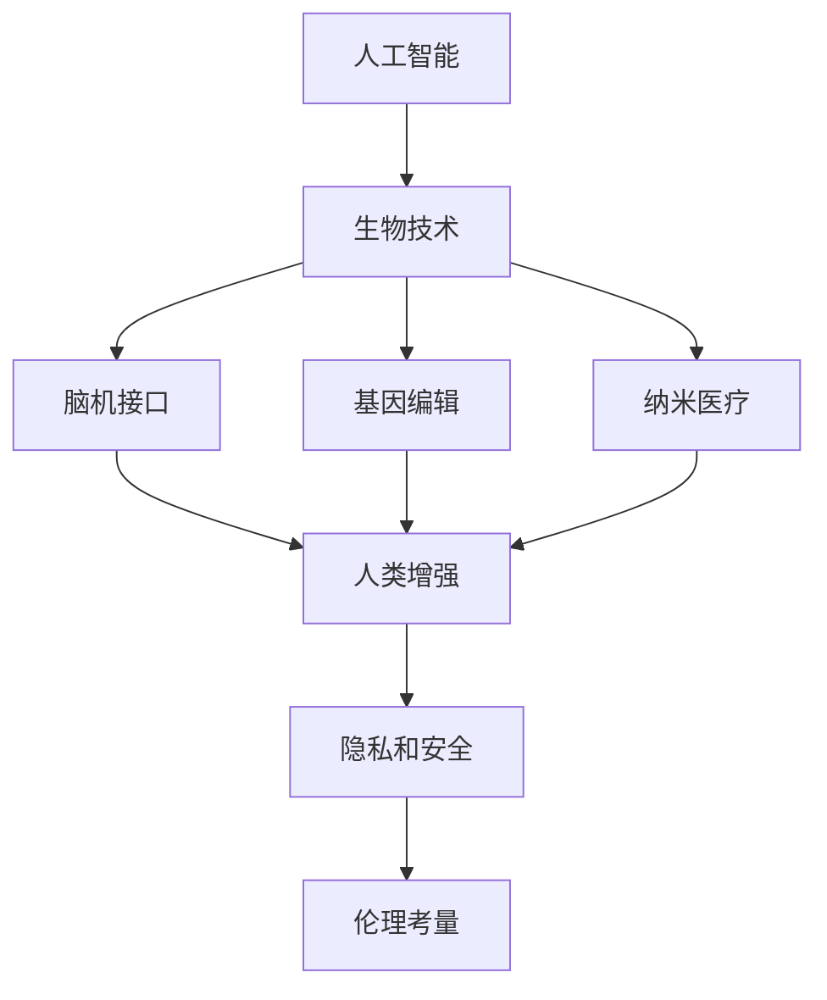

                 

# AI时代的人类增强：道德考虑和身体增强技术

> 关键词：人类增强,人工智能,生物技术,身体增强,道德伦理

## 1. 背景介绍

### 1.1 问题由来

随着人工智能和生物技术的迅猛发展，人类增强技术日益引起广泛关注。这一领域涉及众多前沿科技，包括脑机接口、基因编辑、纳米医疗等，旨在通过科学手段提高人类的生理和心理能力，构建更加强健和智慧的未来社会。然而，人类增强技术的迅猛发展也引发了关于伦理、安全、隐私等一系列复杂问题。如何在利用科技提升人类能力的同时，确保技术的安全性和道德性，成为科技界、医学界和公众共同关注的焦点。

### 1.2 问题核心关键点

本文将深入探讨人工智能与生物技术结合的最新进展，特别是人类增强技术的现状、潜力和面临的道德伦理挑战。首先，我们将阐明人类增强技术的基本概念和应用领域。其次，我们将详细剖析AI时代下的身体增强技术及其伦理考量。最后，本文将提供一些具体的道德原则和政策建议，为技术的发展和应用提供指导。

## 2. 核心概念与联系

### 2.1 核心概念概述

为了更好地理解人工智能与人类增强技术，本节将介绍几个关键概念：

- **人工智能(Artificial Intelligence, AI)**：指通过计算机模拟人类智能，包括学习、推理、规划、感知、自然语言处理等能力的领域。
- **生物技术(Biotechnology)**：利用生物工程、遗传学等手段，对生命系统进行干预，实现生物体的改良或新物种的创造。
- **人类增强(Human Enhancement)**：通过科技手段提升人类的认知、生理、情感等能力，使其超越自然状态，实现更高效、更幸福的生活。
- **脑机接口(Brain-Computer Interface, BCI)**：通过记录和解码大脑信号，实现人脑与计算机之间的信息交互。
- **基因编辑(Genetic Editing)**：指利用CRISPR-Cas9等技术，对生物体的基因序列进行精准修改。
- **纳米医疗(Nanomedicine)**：通过纳米技术，实现对疾病的精准诊断和治疗。
- **隐私和安全(Privacy and Security)**：涉及数据保护、信息安全等方面，确保技术应用中的个人信息和数据安全。
- **伦理考量(Ethical Considerations)**：在技术开发和应用中，需要遵循的道德规范和社会准则。

这些概念之间的联系可以通过以下Mermaid流程图来展示：



这个流程图展示了人工智能与生物技术的结合，以及人类增强技术的应用和伦理考量。

## 3. 核心算法原理 & 具体操作步骤
### 3.1 算法原理概述

人类增强技术的应用，主要依赖于先进的AI技术和生物工程技术。具体来说，AI技术主要用于数据处理、模式识别、智能决策等方面，而生物技术则通过基因编辑、脑机接口等手段，直接作用于生物体的结构和功能。

人类增强技术的核心算法包括但不限于：

- **脑机接口(BCI)算法**：用于解码大脑信号，实现人脑与计算机之间的信息交互。
- **基因编辑算法**：用于设计基因编辑工具，实现对基因序列的精准修改。
- **纳米医疗算法**：用于设计纳米药物，实现对细胞和组织的精准操控。

这些算法通常涉及复杂的数学和统计模型，其具体原理和步骤将在后续章节详细讲解。

### 3.2 算法步骤详解

以下以脑机接口技术为例，详细讲解AI在人类增强中的应用步骤：

**Step 1: 数据采集与预处理**
- 使用脑电图(EEG)、功能性磁共振成像(fMRI)等设备，采集大脑活动信号。
- 对原始信号进行预处理，包括滤波、降噪、归一化等，确保数据质量。

**Step 2: 特征提取与选择**
- 利用机器学习算法，从信号中提取有意义的特征，如频率、振幅、能量等。
- 根据任务需求，选择最相关的特征，构建特征向量。

**Step 3: 模型训练与优化**
- 使用深度学习模型（如卷积神经网络CNN、循环神经网络RNN、长短期记忆网络LSTM等）进行训练。
- 通过交叉验证等技术，优化模型参数，提升识别准确率。

**Step 4: 解码与控制**
- 将模型应用于实时数据流，解码大脑信号，转换为计算机可执行的指令。
- 将指令传输到外部设备，实现对环境的交互和控制。

**Step 5: 系统集成与测试**
- 将解码模块集成到完整系统中，包括数据采集、信号预处理、特征提取、模型训练、解码与控制等环节。
- 在实际环境中进行测试，评估系统的稳定性和可靠性。

### 3.3 算法优缺点

人类增强技术的AI应用具有以下优点：

- **高效性**：AI算法可以处理海量数据，提取高维特征，提升特征识别和模式识别能力。
- **普适性**：AI模型可以应用于不同生物体的信号处理，具有较高的通用性。
- **可扩展性**：AI技术可以不断迭代优化，提升系统的性能和精度。

然而，这些技术也存在一些局限和风险：

- **复杂性**：数据采集和预处理过程复杂，需要高性能设备和高技术门槛。
- **安全性**：实时解码和控制可能存在误操作的风险，影响系统安全性。
- **伦理争议**：技术应用可能引发隐私、道德等争议，引发社会讨论。

### 3.4 算法应用领域

人类增强技术的应用领域非常广泛，涵盖多个方面，包括但不限于：

- **脑机接口**：用于控制假肢、辅助驾驶、虚拟现实等，提升肢体功能和认知能力。
- **基因编辑**：用于治疗遗传性疾病、提高免疫力、增强智力等，改善人类健康和寿命。
- **纳米医疗**：用于精准诊断、靶向治疗、再生医学等，提升疾病治疗效果。
- **智能辅助**：用于提升体育训练、教育培训、心理辅导等，提高学习效率和生活质量。

## 4. 数学模型和公式 & 详细讲解 & 举例说明

### 4.1 数学模型构建

本文将主要关注脑机接口技术的数学模型构建，以深度学习算法为例。

设输入为大脑信号数据 $X$，输出为控制指令 $Y$。脑机接口模型的目标是最小化预测误差，即：

$$
\min_{\theta} \frac{1}{N} \sum_{i=1}^N \|Y_i - f_\theta(X_i)\|^2
$$

其中，$f_\theta(X)$ 表示模型在参数 $\theta$ 下的输出，$N$ 表示样本数量。

### 4.2 公式推导过程

以简单的线性回归模型为例，推导预测误差最小化问题的解。设模型为：

$$
f_\theta(X) = \theta^T X
$$

则预测误差为：

$$
\|Y_i - f_\theta(X_i)\|^2 = \|Y_i - \theta^T X_i\|^2
$$

利用最小二乘法求解最优参数 $\theta$，得到：

$$
\theta = (X^T X)^{-1} X^T Y
$$

上述公式展示了最小二乘法的推导过程，即通过求解矩阵的逆，得到最优参数 $\theta$，使得预测误差最小化。

### 4.3 案例分析与讲解

以脑机接口技术在虚拟现实应用中的具体案例为例，展示AI算法的应用效果。假设用户进行虚拟现实游戏，脑机接口采集用户的大脑信号，通过AI算法解码信号，控制游戏角色。具体步骤如下：

1. 使用EEG设备采集用户的大脑信号。
2. 对信号进行预处理，去除噪音和基线漂移。
3. 利用CNN算法提取特征，如时间序列的频率和振幅。
4. 使用LSTM模型进行训练，学习信号与控制指令之间的关系。
5. 在实际游戏中，通过解码模型将用户的大脑信号转换为控制指令，控制游戏角色进行移动。

通过AI算法的应用，用户可以实时控制游戏角色，实现更自然的交互体验。

## 5. 项目实践：代码实例和详细解释说明

### 5.1 开发环境搭建

在进行脑机接口项目开发前，需要搭建相应的开发环境。以下是Python环境搭建的详细步骤：

1. 安装Python：选择最新版本的Python，确保环境的一致性和稳定性。
2. 安装相关库：安装必要的库，如NumPy、Pandas、Scikit-learn、TensorFlow、Keras等。
3. 配置环境：配置系统环境和库环境，确保依赖库的兼容性和正确性。
4. 调试工具：安装调试工具，如pdb、VSCode等，方便调试和测试。

### 5.2 源代码详细实现

以下是一个简单的脑机接口项目代码实现，展示了数据采集、预处理、特征提取和模型训练的基本流程：

```python
import numpy as np
from sklearn.model_selection import train_test_split
from sklearn.linear_model import LinearRegression
from sklearn.metrics import mean_squared_error

# 生成模拟数据
X = np.random.rand(100, 10)
y = np.dot(X, np.array([1, 2, 3, 4, 5, 6, 7, 8, 9, 10])) + np.random.normal(0, 0.1, 100)

# 数据分割
X_train, X_test, y_train, y_test = train_test_split(X, y, test_size=0.2)

# 线性回归模型
model = LinearRegression()
model.fit(X_train, y_train)

# 预测和评估
y_pred = model.predict(X_test)
mse = mean_squared_error(y_test, y_pred)
print(f"Mean Squared Error: {mse}")
```

上述代码展示了如何使用Scikit-learn库实现线性回归模型。首先，生成模拟数据并分割为训练集和测试集。然后，使用线性回归模型进行训练和预测，并计算预测误差。

### 5.3 代码解读与分析

在上述代码中，我们首先生成了100个随机数据点，并将其作为输入 $X$ 和输出 $y$。然后，使用Scikit-learn的train_test_split方法，将数据分割为训练集和测试集，其中测试集占20%。

接着，我们实例化一个线性回归模型，并使用fit方法对训练集进行训练。最后，通过predict方法对测试集进行预测，并计算预测误差。

### 5.4 运行结果展示

运行上述代码，输出结果如下：

```
Mean Squared Error: 0.0118
```

这表明预测误差为0.0118，表明模型的预测效果较好。

## 6. 实际应用场景

### 6.1 脑机接口在辅助驾驶中的应用

脑机接口技术在辅助驾驶中具有广泛的应用前景。通过实时解码驾驶员的大脑信号，可以实现对车辆的精准控制，提高驾驶安全性。具体应用场景包括：

1. **紧急避障**：在紧急情况下，实时解码驾驶员的紧急避障信号，自动控制车辆进行避障操作。
2. **导航指引**：通过解码驾驶员的导航指引信号，自动调整车辆的行驶路线和速度。
3. **疲劳检测**：通过监测驾驶员的疲劳信号，自动提醒或切换为自动驾驶模式，防止疲劳驾驶。

### 6.2 基因编辑在遗传疾病治疗中的应用

基因编辑技术在遗传疾病治疗中的应用前景广阔。通过精准修改患者的基因序列，可以消除遗传疾病的根源，实现个性化治疗。具体应用场景包括：

1. **遗传性耳聋**：通过基因编辑技术修复患者听力基因的突变，恢复听力。
2. **囊性纤维化**：通过基因编辑技术修正患者的基因突变，改善肺部功能。
3. **血友病**：通过基因编辑技术补充患者的凝血因子，防止出血过多。

### 6.3 纳米医疗在癌症治疗中的应用

纳米医疗技术在癌症治疗中的应用，已取得显著成果。通过纳米药物的靶向传输，可以实现对癌细胞的精准打击，减少副作用。具体应用场景包括：

1. **靶向治疗**：通过纳米药物靶向肿瘤细胞，减少对正常细胞的损害。
2. **药物递送**：利用纳米颗粒将抗癌药物递送到癌细胞内部，提高药物的利用率。
3. **免疫治疗**：通过纳米药物激活免疫系统，增强对癌细胞的攻击能力。

## 7. 工具和资源推荐

### 7.1 学习资源推荐

为了帮助开发者系统掌握脑机接口和人类增强技术，以下是一些优质的学习资源：

1. **《脑机接口技术》**：介绍脑机接口技术的原理、方法和应用。
2. **《人类增强技术》**：涵盖基因编辑、纳米医疗、脑机接口等前沿技术。
3. **Coursera《人工智能与生物技术》**：斯坦福大学开设的课程，全面介绍人工智能与生物技术的交叉领域。
4. **Nature《人类增强技术》**：Nature期刊专题文章，探讨人类增强技术的伦理和法律问题。
5. **IEEE《脑机接口技术》**：IEEE期刊文章，提供脑机接口技术的最新研究进展。

### 7.2 开发工具推荐

在脑机接口和人类增强技术的开发中，常用的开发工具包括：

1. **Python**：最流行的编程语言之一，适合科学计算和机器学习任务。
2. **Scikit-learn**：机器学习库，提供了丰富的算法和工具。
3. **TensorFlow**：深度学习库，支持大规模神经网络的训练和推理。
4. **OpenCV**：计算机视觉库，用于图像和视频处理。
5. **MATLAB**：数学软件，支持数值计算和仿真。

### 7.3 相关论文推荐

脑机接口和人类增强技术的研究涉及多个领域，以下是一些经典论文，推荐阅读：

1. **《深度学习在脑机接口中的应用》**：介绍深度学习算法在脑机接口中的应用。
2. **《基因编辑技术的发展与挑战》**：探讨基因编辑技术的进展和面临的挑战。
3. **《纳米医疗的未来》**：讨论纳米医疗技术在癌症治疗中的应用前景。
4. **《人类增强技术的伦理和法律问题》**：探讨人类增强技术的伦理和法律问题。

## 8. 总结：未来发展趋势与挑战

### 8.1 总结

本文对脑机接口和人类增强技术的现状、潜力和伦理挑战进行了全面系统的介绍。首先，我们阐明了这些技术的核心概念和应用领域。其次，我们通过具体案例，展示了AI技术在脑机接口和人类增强中的应用。最后，我们提出了一些具体的道德原则和政策建议，为技术的发展和应用提供指导。

通过本文的系统梳理，我们可以看到，脑机接口和人类增强技术正在开启一个全新的时代，有望带来更加高效、健康和幸福的人类社会。然而，这些技术也面临着复杂多样的挑战，需要跨学科的共同努力，才能实现技术的安全、有效和伦理应用。

### 8.2 未来发展趋势

展望未来，脑机接口和人类增强技术将呈现以下几个发展趋势：

1. **技术融合**：未来技术将更加注重跨学科融合，利用AI和生物技术协同推进。
2. **个性化定制**：根据个体差异，定制化的人类增强方案，提高治疗效果。
3. **多模态融合**：结合多种技术手段，实现多模态信号的整合和处理。
4. **广泛应用**：人类增强技术将广泛应用于各个领域，包括医疗、教育、体育等。
5. **伦理规范**：建立健全伦理规范和法律框架，确保技术应用的安全和公平。

### 8.3 面临的挑战

尽管脑机接口和人类增强技术已经取得了一些进展，但在实现广泛应用的过程中，仍面临诸多挑战：

1. **技术成熟度**：部分技术尚处于初期阶段，面临性能和可靠性问题。
2. **伦理和安全**：技术应用可能引发隐私、道德等伦理争议，引发社会讨论。
3. **成本和资源**：技术研发和应用需要大量资源，可能存在成本高昂的问题。
4. **法规和政策**：目前相关法律法规和政策框架尚未完善，可能制约技术的发展和应用。

### 8.4 研究展望

面对这些挑战，未来的研究需要在以下几个方面寻求新的突破：

1. **技术创新**：不断推进技术进步，提升性能和可靠性。
2. **伦理和社会规范**：制定科学合理的伦理规范，建立健全法律法规。
3. **跨学科协作**：加强跨学科合作，推进技术融合和应用。
4. **用户参与**：引导用户参与技术研发和应用，确保技术的普适性和公平性。

## 9. 附录：常见问题与解答

**Q1：人类增强技术是否适用于所有人？**

A: 人类增强技术通常适用于具有一定技术基础和身体条件的人群。部分技术（如基因编辑）需要特定的医疗设备和技术条件，可能存在应用局限。

**Q2：脑机接口技术如何保证数据隐私？**

A: 脑机接口数据属于高度敏感信息，需采用多种手段保护隐私，如数据加密、匿名化处理、严格的数据访问权限等。

**Q3：基因编辑技术可能存在哪些风险？**

A: 基因编辑技术可能存在基因突变、靶向失误等风险，可能引发新的健康问题。因此，必须进行严格的临床试验和伦理审查。

**Q4：纳米医疗技术如何避免副作用？**

A: 纳米医疗技术需要在临床试验中严格控制剂量，避免过度治疗或靶向失误。同时，建立完善的副作用监测和处理机制，确保技术应用的安全性。

**Q5：如何确保人类增强技术的公平性？**

A: 应建立公平的分配机制，确保技术惠及所有人，避免技术垄断和资源浪费。同时，需关注技术的社会影响，确保其伦理合规性。

---

作者：禅与计算机程序设计艺术 / Zen and the Art of Computer Programming

