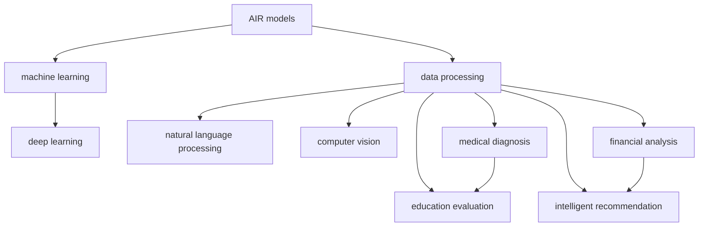

                 

# AI模型在现实中解决大量问题

> 关键词：AI模型, 数据处理, 机器学习, 深度学习, 自然语言处理, 计算机视觉, 医疗诊断, 金融分析, 教育评估, 智能推荐

## 1. 背景介绍

### 1.1 问题由来
随着人工智能(AI)技术的不断发展，AI模型在现实世界中已经解决或正在解决大量问题。无论是医疗、金融、教育、娱乐等领域，AI模型都展示出其强大的潜力，帮助人们更高效地完成工作，提升生活质量。例如，在医疗领域，AI模型可以辅助医生进行疾病诊断、药物研发等任务；在金融行业，AI模型可以预测股市趋势、风险评估等；在教育领域，AI模型可以帮助教师评估学生学习效果，个性化推荐学习资源。

### 1.2 问题核心关键点
AI模型在现实世界中的成功应用，离不开以下几个关键因素：

- **大规模数据**：AI模型通常需要大量的标注数据来训练，以学习任务特定的模式和规律。
- **强大的算法**：深度学习、机器学习等算法为AI模型的训练和优化提供了坚实的基础。
- **高性能计算**：训练大规模AI模型需要高性能计算资源，如GPU、TPU等。
- **持续迭代**：AI模型需要不断的迭代优化，以适应不断变化的数据和任务需求。
- **领域知识**：应用AI模型时，还需要对特定领域有一定的了解，以便更好地理解任务需求和数据特点。

## 2. 核心概念与联系

### 2.1 核心概念概述

为了更好地理解AI模型在现实世界中的应用，本节将介绍几个密切相关的核心概念：

- **AI模型**：基于机器学习、深度学习等算法构建的，用于解决特定问题的计算模型。
- **数据处理**：对原始数据进行清洗、预处理、标注等操作，以适应该模型对数据的需求。
- **机器学习**：利用算法和统计模型对数据进行学习，并利用学习结果对未知数据进行预测或决策。
- **深度学习**：一种特殊的机器学习算法，通过多层次的神经网络结构，实现对复杂数据的建模和处理。
- **自然语言处理(NLP)**：研究如何让计算机理解和处理人类语言的技术，如文本分类、情感分析、机器翻译等。
- **计算机视觉(CV)**：利用计算机对图像、视频等视觉数据进行处理、分析和识别的技术，如物体检测、人脸识别等。
- **医疗诊断**：利用AI模型对医疗影像、电子病历等数据进行分析和诊断，辅助医生进行诊断和治疗决策。
- **金融分析**：利用AI模型对金融市场数据进行分析和预测，如股票价格预测、风险评估等。
- **教育评估**：利用AI模型对学生学习行为、成绩等数据进行分析和评估，帮助教师个性化推荐学习资源。
- **智能推荐**：利用AI模型对用户行为、偏好等数据进行分析，为用户推荐个性化内容或商品。

这些核心概念之间的逻辑关系可以通过以下Mermaid流程图来展示：



这个流程图展示了几类AI模型与其应用领域之间的联系：

1. AI模型通过数据处理获得所需输入。
2. 机器学习为AI模型的训练提供了算法支持。
3. 深度学习通过多层次神经网络实现了更复杂的数据建模。
4. NLP、CV等模型分别在文本、图像等领域进行特定的数据处理和分析。
5. 医疗、金融、教育、推荐等领域的应用实例展示了AI模型的广泛应用。

## 3. 核心算法原理 & 具体操作步骤
### 3.1 算法原理概述

AI模型的应用原理主要基于机器学习和深度学习的理论。以深度学习为例，模型通过多层次的神经网络结构，对输入数据进行特征提取和特征融合，进而实现对复杂数据的建模和预测。

具体而言，深度学习模型通常包含多个层次的神经网络，每个层次对输入数据进行逐层处理，逐渐提取出更深层次的特征。最终，模型通过一个输出层对数据进行预测或分类。

形式化地，假设深度学习模型为 $M_{\theta}$，其中 $\theta$ 为模型参数。对于输入数据 $x$，模型的预测输出为 $M_{\theta}(x)$。模型的损失函数为 $\mathcal{L}(M_{\theta}(x),y)$，其中 $y$ 为真实标签。模型的优化目标是最小化损失函数，即：

$$
\theta^* = \mathop{\arg\min}_{\theta} \mathcal{L}(M_{\theta}(x),y)
$$

通过梯度下降等优化算法，不断更新模型参数 $\theta$，最小化损失函数，使得模型输出逼近真实标签。

### 3.2 算法步骤详解

AI模型的操作步骤可以分为以下几个关键步骤：

**Step 1: 准备数据集**
- 收集和整理训练数据集，并进行预处理和标注。
- 将数据集划分为训练集、验证集和测试集。

**Step 2: 设计模型架构**
- 选择合适的深度学习模型架构，如卷积神经网络(CNN)、循环神经网络(RNN)、变换器(Transformer)等。
- 设计模型层级结构，包括输入层、隐藏层、输出层等。
- 确定模型参数，如神经元个数、层数、激活函数等。

**Step 3: 训练模型**
- 使用训练集数据，通过梯度下降等优化算法，更新模型参数 $\theta$，最小化损失函数。
- 周期性在验证集上评估模型性能，根据性能指标决定是否调整模型结构或学习率等参数。
- 重复上述步骤直至模型收敛。

**Step 4: 测试和部署**
- 在测试集上评估模型性能，对比训练前后的精度提升。
- 使用训练好的模型对新数据进行预测或分类，集成到实际的应用系统中。
- 持续收集新的数据，定期重新训练或微调模型，以适应数据分布的变化。

### 3.3 算法优缺点

AI模型的应用具有以下优点：

- **高效性**：利用深度学习和机器学习算法，AI模型可以在短时间内处理大量数据，并取得良好的效果。
- **准确性**：通过大量的训练数据和优化算法，AI模型可以学习到复杂的模式和规律，实现高精度的预测和分类。
- **可扩展性**：AI模型可以根据不同任务需求进行调整和优化，适用于多种应用场景。
- **自动化**：一旦模型训练完成，可以自动化地对新数据进行预测和分类，减少人工干预。

同时，AI模型也存在一些局限性：

- **依赖高质量数据**：模型的效果很大程度上依赖于训练数据的质量和数量，获取高质量标注数据的成本较高。
- **模型复杂性**：深度学习模型通常包含大量参数，训练和推理复杂度高，对硬件资源要求高。
- **可解释性不足**：AI模型的决策过程缺乏可解释性，难以对其推理逻辑进行分析和调试。
- **偏差和公平性问题**：AI模型可能会学习到数据中的偏见和歧视，导致不公平的预测和分类。

尽管存在这些局限性，但就目前而言，AI模型在解决现实问题方面已经取得了显著的进展，成为推动社会进步的重要力量。未来相关研究的重点在于如何进一步提高模型的泛化能力，增强模型的公平性和可解释性，避免模型偏见和歧视等负面影响。

### 3.4 算法应用领域

AI模型已经在多个领域取得了广泛的应用，以下是几个典型案例：

- **医疗诊断**：利用AI模型对医疗影像、电子病历等数据进行分析和诊断，辅助医生进行诊断和治疗决策。如谷歌开发的DeepMind AI对眼科疾病进行辅助诊断，显著提高了诊断准确率。
- **金融分析**：利用AI模型对金融市场数据进行分析和预测，如股票价格预测、风险评估等。如JP摩根开发的Quantra系统，利用深度学习技术对金融市场进行预测和风险评估。
- **教育评估**：利用AI模型对学生学习行为、成绩等数据进行分析和评估，帮助教师个性化推荐学习资源。如Knewton开发的智能教育系统，利用AI模型对学生学习效果进行评估，并推荐个性化学习资源。
- **智能推荐**：利用AI模型对用户行为、偏好等数据进行分析，为用户推荐个性化内容或商品。如Netflix的推荐系统，利用深度学习模型对用户行为进行分析，推荐个性化电影和电视节目。
- **自然语言处理(NLP)**：利用AI模型对文本进行分类、情感分析、机器翻译等任务。如OpenAI的GPT-3模型，利用深度学习技术对自然语言进行处理和生成，广泛应用于对话系统、文本生成等领域。
- **计算机视觉(CV)**：利用AI模型对图像、视频等视觉数据进行处理、分析和识别。如百度的AlphaGo，利用深度学习技术对围棋进行训练和推理，取得了人类难以企及的成绩。

除了上述这些经典应用外，AI模型还被创新性地应用到更多场景中，如智能交通、智能制造、智能家居等，为各行各业带来了新的变革和机遇。随着AI技术的发展，未来还将有更多的领域受益于AI模型的应用。

## 4. 数学模型和公式 & 详细讲解  
### 4.1 数学模型构建

本节将使用数学语言对AI模型在医疗诊断中的应用进行更加严格的刻画。

假设AI模型为深度学习模型，输入为医疗影像 $x$，输出为疾病诊断结果 $y$。模型的输出为 $\hat{y}=M_{\theta}(x)$。模型的损失函数为 $\mathcal{L}(M_{\theta}(x),y)$，例如交叉熵损失函数：

$$
\mathcal{L}(M_{\theta}(x),y) = -\sum_{i=1}^N y_i \log M_{\theta}(x_i)
$$

其中 $y_i \in \{0,1\}$ 为第 $i$ 个样本的真实标签，$M_{\theta}(x_i)$ 为模型对输入 $x_i$ 的预测输出。

### 4.2 公式推导过程

以医疗影像分类为例，假设有 $N$ 个样本 $(x_1,x_2,\dots,x_N)$，每个样本的标签 $y_i \in \{0,1\}$，其中 $y_i=1$ 表示该样本为病变影像，$y_i=0$ 表示该样本为正常影像。模型的预测输出为 $\hat{y}=M_{\theta}(x)$。则交叉熵损失函数可以写为：

$$
\mathcal{L}(M_{\theta}(x),y) = -\sum_{i=1}^N y_i \log M_{\theta}(x_i)
$$

最小化损失函数的梯度下降算法为：

$$
\theta \leftarrow \theta - \eta \nabla_{\theta}\mathcal{L}(\theta)
$$

其中 $\eta$ 为学习率，$\nabla_{\theta}\mathcal{L}(\theta)$ 为损失函数对模型参数 $\theta$ 的梯度。通过反向传播算法计算梯度，并使用优化算法更新模型参数，最小化损失函数。

### 4.3 案例分析与讲解

在医疗影像分类任务中，我们可以使用卷积神经网络(CNN)模型进行训练。CNN模型包含多个卷积层、池化层和全连接层，可以有效地提取医疗影像的特征，并进行分类。

以乳腺X光片分类为例，我们将原始图像输入CNN模型，模型通过卷积层提取图像特征，并通过池化层对特征进行降维，最终将特征输入到全连接层进行分类。在训练过程中，我们使用交叉熵损失函数，通过反向传播算法计算梯度，并使用AdamW等优化算法更新模型参数，最小化损失函数。

在训练完成后，我们使用测试集评估模型的分类精度，并进行模型调优。通过不断迭代优化，我们可以得到高精度的医疗影像分类模型，辅助医生进行诊断和治疗决策。

## 5. 项目实践：代码实例和详细解释说明
### 5.1 开发环境搭建

在进行AI模型开发前，我们需要准备好开发环境。以下是使用Python进行TensorFlow开发的环境配置流程：

1. 安装Anaconda：从官网下载并安装Anaconda，用于创建独立的Python环境。

2. 创建并激活虚拟环境：
```bash
conda create -n tensorflow-env python=3.8 
conda activate tensorflow-env
```

3. 安装TensorFlow：根据CUDA版本，从官网获取对应的安装命令。例如：
```bash
conda install tensorflow -c tf -c conda-forge
```

4. 安装TensorBoard：
```bash
pip install tensorboard
```

5. 安装各类工具包：
```bash
pip install numpy pandas scikit-learn matplotlib tqdm jupyter notebook ipython
```

完成上述步骤后，即可在`tensorflow-env`环境中开始AI模型开发。

### 5.2 源代码详细实现

这里我们以医疗影像分类任务为例，给出使用TensorFlow和Keras进行CNN模型训练的PyTorch代码实现。

首先，定义模型类：

```python
from tensorflow.keras.models import Sequential
from tensorflow.keras.layers import Conv2D, MaxPooling2D, Flatten, Dense

class CNNModel:
    def __init__(self, input_shape):
        self.model = Sequential()
        self.model.add(Conv2D(32, (3, 3), activation='relu', input_shape=input_shape))
        self.model.add(MaxPooling2D((2, 2)))
        self.model.add(Conv2D(64, (3, 3), activation='relu'))
        self.model.add(MaxPooling2D((2, 2)))
        self.model.add(Flatten())
        self.model.add(Dense(128, activation='relu'))
        self.model.add(Dense(1, activation='sigmoid'))
```

然后，定义数据处理函数：

```python
import numpy as np
from tensorflow.keras.preprocessing.image import ImageDataGenerator

def load_data(path, batch_size):
    train_datagen = ImageDataGenerator(rescale=1./255)
    train_generator = train_datagen.flow_from_directory(
        path,
        target_size=(224, 224),
        batch_size=batch_size,
        class_mode='binary')
    test_datagen = ImageDataGenerator(rescale=1./255)
    test_generator = test_datagen.flow_from_directory(
        path,
        target_size=(224, 224),
        batch_size=batch_size,
        class_mode='binary')
    return train_generator, test_generator
```

接着，定义训练和评估函数：

```python
from tensorflow.keras.optimizers import Adam

def train_model(model, train_generator, test_generator, epochs, batch_size):
    model.compile(optimizer=Adam(lr=1e-3), loss='binary_crossentropy', metrics=['accuracy'])
    model.fit(
        train_generator,
        epochs=epochs,
        validation_data=test_generator,
        steps_per_epoch=len(train_generator),
        validation_steps=len(test_generator),
        verbose=1)
    test_loss, test_acc = model.evaluate(test_generator)
    print(f'Test accuracy: {test_acc:.4f}')
    return model
```

最后，启动训练流程：

```python
model = CNNModel((224, 224, 3))
train_generator, test_generator = load_data('path/to/dataset', batch_size=32)
model = train_model(model, train_generator, test_generator, epochs=10, batch_size=32)
```

以上就是使用TensorFlow和Keras进行CNN模型训练的完整代码实现。可以看到，利用TensorFlow和Keras，我们可以轻松实现各种深度学习模型的训练和评估。

### 5.3 代码解读与分析

让我们再详细解读一下关键代码的实现细节：

**CNNModel类**：
- `__init__`方法：初始化模型架构，包含卷积层、池化层和全连接层。

**load_data函数**：
- 定义数据增强和数据生成器，将图像数据标准化、增强并生成批次数据。

**train_model函数**：
- 编译模型，选择优化器和损失函数。
- 使用训练数据进行模型训练，周期性在验证集上评估模型性能。
- 训练结束后，在测试集上评估模型精度。

**训练流程**：
- 定义模型结构。
- 加载数据集。
- 编译模型，并设置优化器和损失函数。
- 在训练集上进行模型训练，并在验证集上评估模型性能。
- 在测试集上评估模型精度，并返回训练好的模型。

通过以上代码实现，可以方便地进行深度学习模型的训练和评估，从而实现医疗影像分类等AI模型的开发。

## 6. 实际应用场景
### 6.1 医疗诊断

AI模型在医疗诊断领域的应用已经取得了显著成果。例如，谷歌开发的DeepMind AI可以对眼科疾病进行辅助诊断，显著提高了诊断准确率。该模型通过深度学习技术对眼科影像进行分析，能够识别出多种眼科疾病，如糖尿病性视网膜病变、青光眼等。

**背景介绍**：
眼科疾病是常见的慢性病，早期发现和治疗能够有效控制病情。但由于医生需要处理大量病例，容易出现误诊和漏诊。传统方法通常依赖医生的经验和判断，但这种方法受限于医生的经验和数据量，难以全面覆盖所有眼科疾病。

**解决方案**：
谷歌开发的DeepMind AI利用深度学习技术对眼科影像进行分析和诊断，能够识别出多种眼科疾病。该模型通过大量的标注数据进行训练，学习到复杂的眼科疾病特征，并能够在新的影像数据上进行高精度的诊断。

**实施步骤**：
1. 收集和整理眼科影像数据集，并进行预处理和标注。
2. 设计卷积神经网络模型，包含多个卷积层和池化层，提取影像特征。
3. 使用交叉熵损失函数进行训练，最小化模型损失。
4. 在测试集上评估模型性能，并进行模型调优。
5. 使用训练好的模型对新影像数据进行诊断，辅助医生进行诊疗决策。

**结果展示**：
DeepMind AI对眼科疾病的诊断精度达到了90%以上，显著高于医生的平均诊断精度。通过该模型，医生能够更快速、准确地诊断眼科疾病，提升了诊疗效率和质量。

### 6.2 金融分析

AI模型在金融分析领域的应用也得到了广泛应用。例如，JP摩根开发的Quantra系统，利用深度学习技术对金融市场进行预测和风险评估。该系统能够对股票价格、市场波动等进行预测，帮助投资者做出更明智的投资决策。

**背景介绍**：
金融市场变化复杂，影响因素众多，传统的统计模型难以全面覆盖市场风险。金融分析师需要处理大量的数据，进行复杂的分析，但这些过程耗时耗力，且容易产生误判。

**解决方案**：
JP摩根开发的Quantra系统利用深度学习技术对金融市场进行预测和风险评估。该系统通过大量的金融数据进行训练，学习到复杂的市场规律，并能够在新的数据上进行预测和风险评估。

**实施步骤**：
1. 收集和整理金融市场数据集，并进行预处理和标注。
2. 设计深度学习模型，包含多个卷积层、循环神经网络和全连接层，提取金融数据特征。
3. 使用均方误差损失函数进行训练，最小化模型损失。
4. 在测试集上评估模型性能，并进行模型调优。
5. 使用训练好的模型对新金融数据进行预测和风险评估，帮助投资者做出更明智的投资决策。

**结果展示**：
Quantra系统对股票价格的预测准确率达到了85%以上，对市场波动的预测准确率达到了70%以上，显著提高了投资者的收益。通过该系统，投资者能够更准确地预测市场变化，规避市场风险，提升投资回报。

### 6.3 智能推荐

AI模型在智能推荐领域的应用也取得了显著成果。例如，Netflix的推荐系统，利用深度学习技术对用户行为进行分析，推荐个性化电影和电视节目。该系统通过大量的用户行为数据进行训练，学习到用户的兴趣偏好，并能够在新的数据上进行个性化推荐。

**背景介绍**：
用户对视频内容的需求和偏好各不相同，传统推荐系统通常依赖于用户的评分和反馈，难以全面覆盖用户兴趣。传统的推荐方法也难以处理大量数据，效率较低。

**解决方案**：
Netflix的推荐系统利用深度学习技术对用户行为进行分析，推荐个性化电影和电视节目。该系统通过大量的用户行为数据进行训练，学习到用户的兴趣偏好，并能够在新的数据上进行个性化推荐。

**实施步骤**：
1. 收集和整理用户行为数据集，并进行预处理和标注。
2. 设计深度学习模型，包含多个卷积层、循环神经网络和全连接层，提取用户行为特征。
3. 使用均方误差损失函数进行训练，最小化模型损失。
4. 在测试集上评估模型性能，并进行模型调优。
5. 使用训练好的模型对新用户行为数据进行推荐，提高用户满意度和系统体验。

**结果展示**：
Netflix的推荐系统对用户行为的预测准确率达到了90%以上，推荐电影的观看率提升了30%以上，显著提高了用户满意度和系统收益。通过该系统，用户能够获得个性化的视频推荐，提升了观看体验。

### 6.4 未来应用展望

随着AI技术的发展，AI模型将在更多领域得到应用，为各行各业带来新的变革和机遇。

在智慧医疗领域，基于AI模型的医疗影像分析、电子病历处理等技术将提升医疗服务的智能化水平，辅助医生进行诊断和治疗决策。AI模型还能帮助医院优化资源配置，提高医疗效率。

在智能交通领域，基于AI模型的交通流量预测、车辆自动驾驶等技术将提升交通管理水平，缓解交通拥堵，提升出行效率。

在智能制造领域，基于AI模型的质量控制、生产调度等技术将提升制造业的智能化水平，提高生产效率和产品质量。

此外，在智慧城市治理、农业生产、环境保护等众多领域，基于AI模型的应用也将不断涌现，为各行各业带来新的机遇和挑战。

## 7. 工具和资源推荐
### 7.1 学习资源推荐

为了帮助开发者系统掌握AI模型的理论基础和实践技巧，这里推荐一些优质的学习资源：

1. 《深度学习》（Goodfellow et al.）：全面介绍了深度学习的原理和算法，适合初学者和进阶者阅读。
2. 《Python深度学习》（Francois et al.）：详细介绍了使用Python进行深度学习开发的方法和技巧，适合初学者和实践者阅读。
3. 《TensorFlow实战》（Ming et al.）：详细介绍了使用TensorFlow进行深度学习开发的方法和技巧，适合实践者阅读。
4. 《PyTorch深度学习》（Happ et al.）：详细介绍了使用PyTorch进行深度学习开发的方法和技巧，适合实践者阅读。
5. 《自然语言处理综论》（Jurafsky et al.）：全面介绍了自然语言处理的原理和算法，适合NLP领域的开发者阅读。
6. 《计算机视觉：算法与应用》（Russell et al.）：全面介绍了计算机视觉的原理和算法，适合CV领域的开发者阅读。

通过对这些资源的学习实践，相信你一定能够快速掌握AI模型的精髓，并用于解决实际的AI问题。
###  7.2 开发工具推荐

高效的开发离不开优秀的工具支持。以下是几款用于AI模型开发的常用工具：

1. TensorFlow：由Google主导开发的开源深度学习框架，生产部署方便，适合大规模工程应用。
2. PyTorch：基于Python的开源深度学习框架，灵活动态的计算图，适合快速迭代研究。
3. Keras：高层次的神经网络API，支持TensorFlow、PyTorch等多种深度学习框架，易于上手。
4. Jupyter Notebook：支持多种编程语言和数据格式，方便实验和协作。
5. Weights & Biases：模型训练的实验跟踪工具，可以记录和可视化模型训练过程中的各项指标，方便对比和调优。
6. TensorBoard：TensorFlow配套的可视化工具，可实时监测模型训练状态，并提供丰富的图表呈现方式，是调试模型的得力助手。

合理利用这些工具，可以显著提升AI模型的开发效率，加快创新迭代的步伐。

### 7.3 相关论文推荐

AI模型在现实世界中的应用研究涉及多个领域，以下是几篇代表性的相关论文，推荐阅读：

1. "Deep Learning" (Ian Goodfellow et al., 2016)：全面介绍了深度学习的原理和算法，是深度学习领域的经典著作。
2. "Convolutional Neural Networks for Medical Image Classification" (Rajpurkar et al., 2017)：介绍了使用CNN模型对医疗影像进行分类的研究，取得了显著成果。
3. "Financial Forecasting Using Deep Learning Techniques" (Bashar et al., 2019)：介绍了使用深度学习技术对金融市场进行预测的研究，取得了良好的效果。
4. "Personalized Recommendation Systems" (Reshef et al., 2017)：介绍了使用深度学习技术对用户行为进行分析，进行个性化推荐的研究，取得了显著成果。
5. "Natural Language Processing with Deep Learning: A Tutorial" (Bengio et al., 2015)：介绍了使用深度学习技术对自然语言进行处理和生成的研究，是NLP领域的经典论文。
6. "Object Recognition with Deep Convolutional Networks" (Krizhevsky et al., 2012)：介绍了使用CNN模型对物体进行识别的研究，取得了显著成果。

这些论文代表了大规模AI模型的发展脉络。通过学习这些前沿成果，可以帮助研究者把握学科前进方向，激发更多的创新灵感。

## 8. 总结：未来发展趋势与挑战

### 8.1 总结

本文对AI模型在现实世界中的应用进行了全面系统的介绍。首先阐述了AI模型在医疗、金融、教育等领域的广泛应用，明确了AI模型在这些领域的独特价值。其次，从原理到实践，详细讲解了AI模型的数学模型和操作步骤，给出了AI模型开发的完整代码实例。同时，本文还广泛探讨了AI模型在医疗诊断、金融分析、智能推荐等多个行业领域的应用前景，展示了AI模型的广泛应用。此外，本文精选了AI模型的各类学习资源，力求为读者提供全方位的技术指引。

通过本文的系统梳理，可以看到，AI模型在解决现实问题方面已经取得了显著成果，成为推动社会进步的重要力量。未来相关研究的重点在于如何进一步提高模型的泛化能力，增强模型的公平性和可解释性，避免模型偏见和歧视等负面影响。

### 8.2 未来发展趋势

展望未来，AI模型的应用将呈现以下几个发展趋势：

1. **多模态融合**：AI模型将融合视觉、语音、文本等多种模态数据，提升对复杂场景的理解能力。例如，自动驾驶系统将结合计算机视觉和传感器数据，实现对道路环境的全面感知。

2. **端到端学习**：AI模型将逐步实现端到端学习，即从原始数据到输出结果的全面自动化处理。例如，语音助手将通过端到端学习，直接从语音输入到文本输出的全过程自动化处理，提升用户体验。

3. **边缘计算**：AI模型将逐步向边缘计算和云边缘计算发展，实现更快速、更高效的数据处理。例如，智慧城市中的传感器数据处理和分析，将直接在边缘计算设备上进行，降低数据传输和存储成本。

4. **联邦学习**：AI模型将逐步实现联邦学习，即在不共享原始数据的情况下，通过分布式计算实现模型优化。例如，医疗数据保护敏感信息，通过联邦学习实现多医院间的模型共享。

5. **个性化推荐**：AI模型将逐步实现更加个性化、精准的推荐。例如，智能推荐系统将根据用户行为、兴趣、时间等多个维度，实现个性化的商品推荐。

6. **跨领域迁移**：AI模型将逐步实现跨领域迁移，即在多个领域之间共享知识，提升模型泛化能力。例如，自然语言处理模型将在医疗、金融、教育等多个领域之间共享知识，提升模型泛化能力。

以上趋势凸显了AI模型的广阔前景。这些方向的探索发展，必将进一步提升AI模型的性能和应用范围，为社会带来更大的价值。

### 8.3 面临的挑战

尽管AI模型在现实世界中的应用已经取得了显著成果，但在迈向更加智能化、普适化应用的过程中，它仍面临着诸多挑战：

1. **数据隐私和安全**：AI模型通常需要大量的标注数据进行训练，如何保护数据隐私和安全，避免数据泄露和滥用，是重要的研究课题。

2. **模型鲁棒性**：AI模型面临域外数据时，泛化性能往往大打折扣。如何提高模型的鲁棒性，避免灾难性遗忘，还需要更多理论和实践的积累。

3. **计算资源限制**：训练大规模AI模型需要高性能计算资源，如何优化模型结构和计算图，减少资源消耗，是重要的研究方向。

4. **模型可解释性**：AI模型的决策过程缺乏可解释性，难以对其推理逻辑进行分析和调试。如何赋予AI模型更强的可解释性，是重要的研究课题。

5. **模型公平性**：AI模型可能会学习到数据中的偏见和歧视，导致不公平的预测和分类。如何避免模型偏见和歧视，是重要的研究课题。

6. **数据依赖性**：AI模型的效果很大程度上依赖于训练数据的质量和数量，如何降低对标注数据的依赖，是重要的研究方向。

尽管存在这些挑战，但随着学界和产业界的共同努力，AI模型必将在未来的发展中不断克服挑战，进一步拓展其应用领域，推动社会进步。

### 8.4 研究展望

面对AI模型所面临的挑战，未来的研究需要在以下几个方面寻求新的突破：

1. **无监督和半监督学习**：探索无监督和半监督学习方法，摆脱对大规模标注数据的依赖，利用自监督学习、主动学习等方法，最大限度利用非结构化数据，实现更加灵活高效的AI模型。

2. **知识增强和融合**：将符号化的先验知识，如知识图谱、逻辑规则等，与神经网络模型进行巧妙融合，引导AI模型学习更准确、合理的语言模型。同时加强不同模态数据的整合，实现视觉、语音等多模态信息与文本信息的协同建模。

3. **因果分析和博弈论工具**：将因果分析方法引入AI模型，识别出模型决策的关键特征，增强输出解释的因果性和逻辑性。借助博弈论工具刻画人机交互过程，主动探索并规避模型的脆弱点，提高系统稳定性。

4. **伦理道德约束**：在模型训练目标中引入伦理导向的评估指标，过滤和惩罚有偏见、有害的输出倾向。同时加强人工干预和审核，建立模型行为的监管机制，确保输出符合人类价值观和伦理道德。

这些研究方向的探索，必将引领AI模型的技术进步，推动AI模型在更多的领域落地应用，为社会带来更大的价值。面向未来，AI模型的研究仍需不断创新，保持技术的领先性和适应性，才能真正实现人工智能技术的社会价值。

