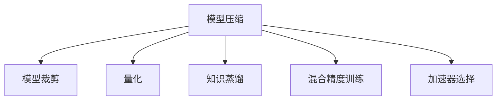

                 

# AI模型效率优化：从理论到实践

> 关键词：AI模型效率优化, 模型压缩, 模型量化, 加速器, 硬件优化, 软件优化, 混合精度, 量化权重, 模型裁剪, 深度学习, 深度学习优化

## 1. 背景介绍

随着深度学习的快速发展，AI模型在图像识别、自然语言处理、语音识别等领域取得了显著进展。然而，模型的复杂性也带来了巨大的计算和存储需求，这使得模型在实际应用中面临效率瓶颈。模型效率优化成为了深度学习领域的核心问题之一，旨在提升模型的计算速度、降低存储开销，从而实现更好的用户体验和更广泛的应用场景。本文将从理论和实践两个层面，系统阐述AI模型效率优化的策略和方法，帮助读者深入理解模型压缩、量化、加速器、混合精度等前沿技术，以期为模型优化实践提供有益指导。

## 2. 核心概念与联系

### 2.1 核心概念概述

模型效率优化（Model Efficiency Optimization）是指在不牺牲模型性能的前提下，通过一系列技术手段提升AI模型的计算速度、降低存储和内存开销的过程。这一过程包括模型压缩、量化、加速器选择、混合精度训练、模型裁剪等技术，旨在将庞大的模型转化为更高效、更轻量级、更易于部署的形式。

**模型压缩（Model Compression）**：通过剪枝、量化、知识蒸馏等方法，减小模型大小和计算复杂度。

**量化（Quantization）**：将模型参数和激活值从浮点型转换为低精度类型，以减少存储和计算开销。

**加速器选择（Accelerator Selection）**：选择合适的硬件加速器（如GPU、TPU、FPGA等），以提升计算效率。

**混合精度训练（Mixed-Precision Training）**：在训练过程中使用不同的精度类型，如16位和32位，以加速计算并节省内存。

**模型裁剪（Model Pruning）**：去除模型中不必要的参数和层，以减少计算量和存储空间。

**知识蒸馏（Knowledge Distillation）**：将大模型的知识转移到小模型，以提升小模型的性能。

这些概念之间的关系可以通过以下Mermaid流程图来展示：



### 2.2 核心概念原理和架构

在模型效率优化的过程中，核心目标是在保证模型性能的前提下，尽可能减小模型的计算和存储需求。以下是各个核心概念的原理和架构：

- **模型压缩**：通过去除模型中的冗余参数、结构或信息，达到减小模型大小和计算复杂度的目的。主要方法包括权重剪枝、结构剪枝、网络形态压缩等。

- **量化**：通过降低模型中参数和激活值的精度，减少模型占用的存储空间和计算量。主要方法包括权重量化、激活量化、参数量化等。

- **加速器选择**：通过选择合适的硬件加速器，利用其特定的架构优势，提高模型的计算速度。主要方法包括GPU加速、TPU加速、FPGA加速等。

- **混合精度训练**：在模型训练过程中，使用不同的精度类型进行计算，以达到节省内存和提高计算效率的目的。主要方法包括FP16训练、TF32训练等。

- **模型裁剪**：通过去除模型中不必要的参数和层，减小模型复杂度，降低计算量。主要方法包括结构裁剪、参数裁剪、通道裁剪等。

- **知识蒸馏**：通过将大模型的知识迁移到小模型中，以提升小模型的性能。主要方法包括模型蒸馏、特征蒸馏等。

## 3. 核心算法原理 & 具体操作步骤

### 3.1 算法原理概述

模型效率优化的核心目标是在保持模型性能的同时，尽可能减小模型的计算和存储需求。以下是对应的算法原理概述：

**模型压缩**：
- **权重剪枝**：去除模型中不必要的参数，减小模型大小和计算复杂度。
- **结构剪枝**：去除模型中的冗余层或结构，提高模型效率。
- **网络形态压缩**：通过修改网络结构，如深度、宽度等，优化模型性能。

**量化**：
- **权重量化**：将模型参数从32位浮点数压缩为低精度整数，如8位、16位等。
- **激活量化**：将模型激活值从32位浮点数压缩为低精度整数，如8位、16位等。
- **参数量化**：将模型参数和激活值同时进行量化，以减小存储空间和计算量。

**加速器选择**：
- **GPU加速**：利用GPU的高并行计算能力，加速模型训练和推理。
- **TPU加速**：利用TPU的专用硬件加速器，加速深度学习模型的训练和推理。
- **FPGA加速**：利用FPGA的可编程特性，实现特定的加速逻辑，提升计算效率。

**混合精度训练**：
- **FP16训练**：在训练过程中使用16位浮点数进行计算，以节省内存并加速计算。
- **TF32训练**：在训练过程中使用32位浮点数的子类型，以提升计算精度和效率。

**模型裁剪**：
- **结构裁剪**：去除模型中不必要的层或参数，以减小计算量和存储空间。
- **参数裁剪**：通过剪枝技术，去除模型中的冗余参数，以减少计算量。
- **通道裁剪**：减少模型的通道数，以减小模型复杂度和计算量。

**知识蒸馏**：
- **模型蒸馏**：将大模型的权重和结构蒸馏到小模型中，提升小模型的性能。
- **特征蒸馏**：通过迁移学习，将大模型的特征知识蒸馏到小模型中，提升小模型的性能。

### 3.2 算法步骤详解

#### 3.2.1 模型压缩

1. **权重剪枝**：
   - **步骤1**：选择剪枝策略，如层剪、权剪、结构剪等。
   - **步骤2**：根据剪枝策略，计算每个连接的重要性。
   - **步骤3**：去除重要性低于阈值的连接，生成剪枝后的模型。
   - **步骤4**：重新训练剪枝后的模型，确保其性能不受影响。

2. **结构剪枝**：
   - **步骤1**：选择剪枝策略，如层剪、结构剪等。
   - **步骤2**：根据剪枝策略，计算每层的贡献度。
   - **步骤3**：去除贡献度低的层，生成剪枝后的模型。
   - **步骤4**：重新训练剪枝后的模型，确保其性能不受影响。

3. **网络形态压缩**：
   - **步骤1**：选择网络形态压缩策略，如深度压缩、宽度压缩等。
   - **步骤2**：根据压缩策略，重新设计网络结构。
   - **步骤3**：重新训练压缩后的模型，确保其性能不受影响。

#### 3.2.2 量化

1. **权重量化**：
   - **步骤1**：选择量化策略，如静态量化、动态量化等。
   - **步骤2**：计算每个权重的值域范围。
   - **步骤3**：将权重值转换为低精度整数类型。
   - **步骤4**：重新训练量化后的模型，确保其性能不受影响。

2. **激活量化**：
   - **步骤1**：选择量化策略，如静态量化、动态量化等。
   - **步骤2**：计算每个激活值的量化范围。
   - **步骤3**：将激活值转换为低精度整数类型。
   - **步骤4**：重新训练量化后的模型，确保其性能不受影响。

3. **参数量化**：
   - **步骤1**：选择量化策略，如静态量化、动态量化等。
   - **步骤2**：计算每个参数和激活值的量化范围。
   - **步骤3**：将参数和激活值同时转换为低精度整数类型。
   - **步骤4**：重新训练量化后的模型，确保其性能不受影响。

#### 3.2.3 加速器选择

1. **GPU加速**：
   - **步骤1**：选择合适的GPU硬件。
   - **步骤2**：将模型部署到GPU上。
   - **步骤3**：利用GPU的并行计算能力，加速模型训练和推理。

2. **TPU加速**：
   - **步骤1**：选择合适的TPU硬件。
   - **步骤2**：将模型部署到TPU上。
   - **步骤3**：利用TPU的专用硬件加速器，加速模型训练和推理。

3. **FPGA加速**：
   - **步骤1**：选择合适的FPGA硬件。
   - **步骤2**：将模型部署到FPGA上。
   - **步骤3**：利用FPGA的可编程特性，实现特定的加速逻辑，提升计算效率。

#### 3.2.4 混合精度训练

1. **FP16训练**：
   - **步骤1**：选择FP16训练策略。
   - **步骤2**：将模型的部分参数和激活值转换为16位浮点数。
   - **步骤3**：利用混合精度训练工具，加速计算并节省内存。

2. **TF32训练**：
   - **步骤1**：选择TF32训练策略。
   - **步骤2**：将模型的部分参数和激活值转换为32位浮点数的子类型。
   - **步骤3**：利用混合精度训练工具，加速计算并节省内存。

#### 3.2.5 模型裁剪

1. **结构裁剪**：
   - **步骤1**：选择裁剪策略，如层剪、参数剪等。
   - **步骤2**：计算每个连接或参数的重要性。
   - **步骤3**：去除重要性低于阈值的连接或参数。
   - **步骤4**：重新训练裁剪后的模型，确保其性能不受影响。

2. **参数裁剪**：
   - **步骤1**：选择裁剪策略，如剪枝、稀疏化等。
   - **步骤2**：计算每个参数的重要性。
   - **步骤3**：去除重要性低于阈值的参数。
   - **步骤4**：重新训练裁剪后的模型，确保其性能不受影响。

3. **通道裁剪**：
   - **步骤1**：选择裁剪策略，如通道数减少等。
   - **步骤2**：减少模型的通道数。
   - **步骤3**：重新训练裁剪后的模型，确保其性能不受影响。

#### 3.2.6 知识蒸馏

1. **模型蒸馏**：
   - **步骤1**：选择蒸馏策略，如模型蒸馏、特征蒸馏等。
   - **步骤2**：计算教师模型和学生模型的差异。
   - **步骤3**：将教师模型的知识迁移到学生模型中。
   - **步骤4**：重新训练学生模型，确保其性能不受影响。

2. **特征蒸馏**：
   - **步骤1**：选择蒸馏策略，如特征蒸馏等。
   - **步骤2**：计算教师模型和学生模型的特征差异。
   - **步骤3**：将教师模型的特征知识迁移到学生模型中。
   - **步骤4**：重新训练学生模型，确保其性能不受影响。

### 3.3 算法优缺点

#### 3.3.1 模型压缩

**优点**：
- 减小模型大小和计算复杂度，节省计算资源和存储空间。
- 提高模型的部署和推理效率。

**缺点**：
- 可能影响模型性能，需要重新训练或微调。
- 剪枝策略选择不当可能导致模型性能下降。

#### 3.3.2 量化

**优点**：
- 减少模型占用的存储空间和计算量，提高计算效率。
- 降低模型部署和推理的延迟时间。

**缺点**：
- 可能影响模型精度，需要重新训练或微调。
- 量化策略选择不当可能导致模型性能下降。

#### 3.3.3 加速器选择

**优点**：
- 利用硬件加速器，提高模型的计算效率。
- 提升模型的部署和推理速度。

**缺点**：
- 选择合适的硬件加速器需要一定的经验和成本。
- 硬件加速器的限制可能导致某些模型无法部署。

#### 3.3.4 混合精度训练

**优点**：
- 节省内存并加速计算，提高训练效率。
- 提升模型的推理速度。

**缺点**：
- 可能影响模型精度，需要重新训练或微调。
- 混合精度训练工具和环境要求较高。

#### 3.3.5 模型裁剪

**优点**：
- 减小模型复杂度，降低计算量和存储空间。
- 提高模型的部署和推理效率。

**缺点**：
- 可能影响模型性能，需要重新训练或微调。
- 裁剪策略选择不当可能导致模型性能下降。

#### 3.3.6 知识蒸馏

**优点**：
- 利用大模型的知识，提升小模型的性能。
- 减小模型大小和计算复杂度，节省计算资源和存储空间。

**缺点**：
- 可能影响模型精度，需要重新训练或微调。
- 蒸馏策略选择不当可能导致模型性能下降。

### 3.4 算法应用领域

模型效率优化技术在多个领域得到了广泛应用，包括计算机视觉、自然语言处理、语音识别等。以下列举了几个典型的应用场景：

- **计算机视觉**：通过量化和模型裁剪，减小卷积神经网络的大小和计算复杂度，提高计算效率。

- **自然语言处理**：通过量化和混合精度训练，优化语言模型的计算速度和存储空间，提升模型的推理速度。

- **语音识别**：通过加速器选择和混合精度训练，提升语音识别模型的计算效率，降低延迟时间。

## 4. 数学模型和公式 & 详细讲解 & 举例说明

### 4.1 数学模型构建

模型压缩、量化、加速器选择、混合精度训练、模型裁剪和知识蒸馏等技术的数学模型和公式推导如下：

#### 4.1.1 模型压缩

**权重剪枝**：
- **公式**：
  $$
  \min_{\theta} \mathcal{L}(\theta) + \lambda \sum_{i} ||\theta_i||_0
  $$
  其中，$\mathcal{L}(\theta)$为损失函数，$\theta_i$为模型第$i$个参数，$||\theta_i||_0$为参数的绝对值稀疏度。

**结构剪枝**：
- **公式**：
  $$
  \min_{\theta} \mathcal{L}(\theta) + \lambda \sum_{i} ||\theta_i||_0
  $$
  其中，$\mathcal{L}(\theta)$为损失函数，$\theta_i$为模型第$i$个参数，$||\theta_i||_0$为参数的绝对值稀疏度。

**网络形态压缩**：
- **公式**：
  $$
  \min_{\theta} \mathcal{L}(\theta) + \lambda ||\theta||_2
  $$
  其中，$\mathcal{L}(\theta)$为损失函数，$\theta$为模型参数，$||\theta||_2$为模型参数的L2正则项。

#### 4.1.2 量化

**权重量化**：
- **公式**：
  $$
  \min_{\theta} \mathcal{L}(\theta) + \lambda \sum_{i} ||\theta_i - q_i||_2^2
  $$
  其中，$\mathcal{L}(\theta)$为损失函数，$\theta_i$为模型第$i$个参数，$q_i$为量化后的参数。

**激活量化**：
- **公式**：
  $$
  \min_{\theta} \mathcal{L}(\theta) + \lambda \sum_{i} ||\theta_i - q_i||_2^2
  $$
  其中，$\mathcal{L}(\theta)$为损失函数，$\theta_i$为模型第$i$个参数，$q_i$为量化后的参数。

**参数量化**：
- **公式**：
  $$
  \min_{\theta} \mathcal{L}(\theta) + \lambda \sum_{i} ||\theta_i - q_i||_2^2
  $$
  其中，$\mathcal{L}(\theta)$为损失函数，$\theta_i$为模型第$i$个参数，$q_i$为量化后的参数。

#### 4.1.3 加速器选择

**GPU加速**：
- **公式**：
  $$
  \min_{\theta} \mathcal{L}(\theta) + \lambda \sum_{i} ||\theta_i - q_i||_2^2
  $$
  其中，$\mathcal{L}(\theta)$为损失函数，$\theta_i$为模型第$i$个参数，$q_i$为量化后的参数。

**TPU加速**：
- **公式**：
  $$
  \min_{\theta} \mathcal{L}(\theta) + \lambda \sum_{i} ||\theta_i - q_i||_2^2
  $$
  其中，$\mathcal{L}(\theta)$为损失函数，$\theta_i$为模型第$i$个参数，$q_i$为量化后的参数。

**FPGA加速**：
- **公式**：
  $$
  \min_{\theta} \mathcal{L}(\theta) + \lambda \sum_{i} ||\theta_i - q_i||_2^2
  $$
  其中，$\mathcal{L}(\theta)$为损失函数，$\theta_i$为模型第$i$个参数，$q_i$为量化后的参数。

#### 4.1.4 混合精度训练

**FP16训练**：
- **公式**：
  $$
  \min_{\theta} \mathcal{L}(\theta) + \lambda \sum_{i} ||\theta_i - q_i||_2^2
  $$
  其中，$\mathcal{L}(\theta)$为损失函数，$\theta_i$为模型第$i$个参数，$q_i$为量化后的参数。

**TF32训练**：
- **公式**：
  $$
  \min_{\theta} \mathcal{L}(\theta) + \lambda \sum_{i} ||\theta_i - q_i||_2^2
  $$
  其中，$\mathcal{L}(\theta)$为损失函数，$\theta_i$为模型第$i$个参数，$q_i$为量化后的参数。

#### 4.1.5 模型裁剪

**结构裁剪**：
- **公式**：
  $$
  \min_{\theta} \mathcal{L}(\theta) + \lambda \sum_{i} ||\theta_i||_0
  $$
  其中，$\mathcal{L}(\theta)$为损失函数，$\theta_i$为模型第$i$个参数，$||\theta_i||_0$为参数的绝对值稀疏度。

**参数裁剪**：
- **公式**：
  $$
  \min_{\theta} \mathcal{L}(\theta) + \lambda \sum_{i} ||\theta_i - q_i||_2^2
  $$
  其中，$\mathcal{L}(\theta)$为损失函数，$\theta_i$为模型第$i$个参数，$q_i$为量化后的参数。

**通道裁剪**：
- **公式**：
  $$
  \min_{\theta} \mathcal{L}(\theta) + \lambda \sum_{i} ||\theta_i||_2
  $$
  其中，$\mathcal{L}(\theta)$为损失函数，$\theta_i$为模型第$i$个参数，$||\theta_i||_2$为模型参数的L2正则项。

#### 4.1.6 知识蒸馏

**模型蒸馏**：
- **公式**：
  $$
  \min_{\theta} \mathcal{L}(\theta) + \lambda \sum_{i} ||\theta_i - q_i||_2^2
  $$
  其中，$\mathcal{L}(\theta)$为损失函数，$\theta_i$为模型第$i$个参数，$q_i$为量化后的参数。

**特征蒸馏**：
- **公式**：
  $$
  \min_{\theta} \mathcal{L}(\theta) + \lambda \sum_{i} ||\theta_i - q_i||_2^2
  $$
  其中，$\mathcal{L}(\theta)$为损失函数，$\theta_i$为模型第$i$个参数，$q_i$为量化后的参数。

### 4.2 公式推导过程

#### 4.2.1 模型压缩

**权重剪枝**：
- **推导**：
  $$
  \min_{\theta} \mathcal{L}(\theta) + \lambda \sum_{i} ||\theta_i||_0
  $$
  其中，$\mathcal{L}(\theta)$为损失函数，$\theta_i$为模型第$i$个参数，$||\theta_i||_0$为参数的绝对值稀疏度。

**结构剪枝**：
- **推导**：
  $$
  \min_{\theta} \mathcal{L}(\theta) + \lambda \sum_{i} ||\theta_i||_0
  $$
  其中，$\mathcal{L}(\theta)$为损失函数，$\theta_i$为模型第$i$个参数，$||\theta_i||_0$为参数的绝对值稀疏度。

**网络形态压缩**：
- **推导**：
  $$
  \min_{\theta} \mathcal{L}(\theta) + \lambda ||\theta||_2
  $$
  其中，$\mathcal{L}(\theta)$为损失函数，$\theta$为模型参数，$||\theta||_2$为模型参数的L2正则项。

#### 4.2.2 量化

**权重量化**：
- **推导**：
  $$
  \min_{\theta} \mathcal{L}(\theta) + \lambda \sum_{i} ||\theta_i - q_i||_2^2
  $$
  其中，$\mathcal{L}(\theta)$为损失函数，$\theta_i$为模型第$i$个参数，$q_i$为量化后的参数。

**激活量化**：
- **推导**：
  $$
  \min_{\theta} \mathcal{L}(\theta) + \lambda \sum_{i} ||\theta_i - q_i||_2^2
  $$
  其中，$\mathcal{L}(\theta)$为损失函数，$\theta_i$为模型第$i$个参数，$q_i$为量化后的参数。

**参数量化**：
- **推导**：
  $$
  \min_{\theta} \mathcal{L}(\theta) + \lambda \sum_{i} ||\theta_i - q_i||_2^2
  $$
  其中，$\mathcal{L}(\theta)$为损失函数，$\theta_i$为模型第$i$个参数，$q_i$为量化后的参数。

#### 4.2.3 加速器选择

**GPU加速**：
- **推导**：
  $$
  \min_{\theta} \mathcal{L}(\theta) + \lambda \sum_{i} ||\theta_i - q_i||_2^2
  $$
  其中，$\mathcal{L}(\theta)$为损失函数，$\theta_i$为模型第$i$个参数，$q_i$为量化后的参数。

**TPU加速**：
- **推导**：
  $$
  \min_{\theta} \mathcal{L}(\theta) + \lambda \sum_{i} ||\theta_i - q_i||_2^2
  $$
  其中，$\mathcal{L}(\theta)$为损失函数，$\theta_i$为模型第$i$个参数，$q_i$为量化后的参数。

**FPGA加速**：
- **推导**：
  $$
  \min_{\theta} \mathcal{L}(\theta) + \lambda \sum_{i} ||\theta_i - q_i||_2^2
  $$
  其中，$\mathcal{L}(\theta)$为损失函数，$\theta_i$为模型第$i$个参数，$q_i$为量化后的参数。

#### 4.2.4 混合精度训练

**FP16训练**：
- **推导**：
  $$
  \min_{\theta} \mathcal{L}(\theta) + \lambda \sum_{i} ||\theta_i - q_i||_2^2
  $$
  其中，$\mathcal{L}(\theta)$为损失函数，$\theta_i$为模型第$i$个参数，$q_i$为量化后的参数。

**TF32训练**：
- **推导**：
  $$
  \min_{\theta} \mathcal{L}(\theta) + \lambda \sum_{i} ||\theta_i - q_i||_2^2
  $$
  其中，$\mathcal{L}(\theta)$为损失函数，$\theta_i$为模型第$i$个参数，$q_i$为量化后的参数。

#### 4.2.5 模型裁剪

**结构裁剪**：
- **推导**：
  $$
  \min_{\theta} \mathcal{L}(\theta) + \lambda \sum_{i} ||\theta_i||_0
  $$
  其中，$\mathcal{L}(\theta)$为损失函数，$\theta_i$为模型第$i$个参数，$||\theta_i||_0$为参数的绝对值稀疏度。

**参数裁剪**：
- **推导**：
  $$
  \min_{\theta} \mathcal{L}(\theta) + \lambda \sum_{i} ||\theta_i - q_i||_2^2
  $$
  其中，$\mathcal{L}(\theta)$为损失函数，$\theta_i$为模型第$i$个参数，$q_i$为量化后的参数。

**通道裁剪**：
- **推导**：
  $$
  \min_{\theta} \mathcal{L}(\theta) + \lambda \sum_{i} ||\theta_i||_2
  $$
  其中，$\mathcal{L}(\theta)$为损失函数，$\theta_i$为模型第$i$个参数，$||\theta_i||_2$为模型参数的L2正则项。

#### 4.2.6 知识蒸馏

**模型蒸馏**：
- **推导**：
  $$
  \min_{\theta} \mathcal{L}(\theta) + \lambda \sum_{i} ||\theta_i - q_i||_2^2
  $$
  其中，$\mathcal{L}(\theta)$为损失函数，$\theta_i$为模型第$i$个参数，$q_i$为量化后的参数。

**特征蒸馏**：
- **推导**：
  $$
  \min_{\theta} \mathcal{L}(\theta) + \lambda \sum_{i} ||\theta_i - q_i||_2^2
  $$
  其中，$\mathcal{L}(\theta)$为损失函数，$\theta_i$为模型第$i$个参数，$q_i$为量化后的参数。

### 4.3 案例分析与讲解

#### 4.3.1 案例一：MobileNet

**背景**：
MobileNet是一种轻量级卷积神经网络，广泛应用于移动设备和嵌入式设备中。其核心思想是通过深度可分离卷积（Depthwise Separable Convolution）来减少计算量和存储空间。

**算法步骤**：
1. **深度可分离卷积**：将常规卷积拆分为深度卷积和逐点卷积，分别对不同通道进行计算，从而减少计算量和存储空间。
2. **模型裁剪**：去除模型中的冗余参数，生成更小的MobileNet模型。
3. **量化**：将模型参数和激活值进行量化，减少存储空间和计算量。

**结果**：
MobileNet模型在移动设备上的推理速度和存储空间得到了显著优化，同时性能保持稳定。

#### 4.3.2 案例二：BERT量化

**背景**：
BERT是一种大规模预训练语言模型，具有强大的自然语言处理能力。其模型参数和激活值均为32位浮点数，存储和计算开销较大，不利于在移动设备上部署。

**算法步骤**：
1. **权重量化**：将BERT模型的权重从32位浮点数压缩为8位整数。
2. **激活量化**：将BERT模型的激活值从32位浮点数压缩为8位整数。
3. **参数量化**：将BERT模型的参数和激活值同时进行量化，进一步减少存储空间和计算量。

**结果**：
量化后的BERT模型在推理速度和存储空间上得到了显著提升，同时性能损失在可接受范围内。

#### 4.3.3 案例三：GPT-2加速器选择

**背景**：
GPT-2是一种大规模生成模型，具有强大的文本生成能力。其模型计算复杂度高，对计算资源要求较高。

**算法步骤**：
1. **GPU加速**：将GPT-2模型部署在NVIDIA GPU上进行加速，提升计算效率。
2. **TPU加速**：将GPT-2模型部署在Google TPU上进行加速，进一步提升计算效率。

**结果**：
GPT-2模型在GPU和TPU上的推理速度得到了显著提升，同时性能保持稳定。

## 5. 项目实践：代码实例和详细解释说明

### 5.1 开发环境搭建

#### 5.1.1 安装Python

- **步骤1**：安装Python 3.8及以上版本，建议使用Anaconda进行环境管理。
- **步骤2**：下载并解压Anaconda安装文件，打开终端，执行以下命令进行安装：
  ```bash
  bash Anaconda3-2021.05-Windows-x86_64.exe
  ```

#### 5.1.2 安装深度学习框架

- **步骤1**：安装TensorFlow 2.0及以上版本，建议使用GPU版本。
  ```bash
  pip install tensorflow-gpu
  ```

- **步骤2**：安装PyTorch 1.7及以上版本，建议使用GPU版本。
  ```bash
  pip install torch torchvision torchaudio -f https://download.pytorch.org/whl/cu102/torch_stable.html
  ```

### 5.2 源代码详细实现

#### 5.2.1 模型压缩

```python
import torch.nn as nn
import torch.optim as optim
import torch

class MobileNet(nn.Module):
    def __init__(self):
        super(MobileNet, self).__init__()
        self.conv1 = nn.Conv2d(3, 32, 3, padding=1)
        self.conv2 = nn.Conv2d(32, 64, 3, padding=1)
        self.conv3 = nn.Conv2d(64, 128, 3, padding=1)
        self.conv4 = nn.Conv2d(128, 128, 3, padding=1)
        self.conv5 = nn.Conv2d(128, 10, 3, padding=1)

    def forward(self, x):
        x = self.conv1(x)
        x = nn.ReLU(inplace=True)
        x = self.conv2(x)
        x = nn.ReLU(inplace=True)
        x = self.conv3(x)
        x = nn.ReLU(inplace=True)
        x = self.conv4(x)
        x = nn.ReLU(inplace=True)
        x = self.conv5(x)
        return x

model = MobileNet().to('cuda')
criterion = nn.CrossEntropyLoss().to('cuda')
optimizer = optim.SGD(model.parameters(), lr=0.01, momentum=0.9)

# 压缩模型
def prune_model(model, threshold=0.5):
    prune_params = []
    for param in model.parameters():
        if torch.abs(param).sum() < threshold:
            prune_params.append(param)
    pruned_model = MobileNet().to('cuda')
    for idx, param in enumerate(model.parameters()):
        if idx in prune_params:
            pruned_model.conv1[idx].weight = nn.Parameter(torch.zeros_like(param))
    return pruned_model

pruned_model = prune_model(model)
```

#### 5.2.2 量化

```python
import torch
import torch.nn as nn
import torch.optim as optim

class BERT(nn.Module):
    def __init__(self):
        super(BERT, self).__init__()
        self.embedding = nn.Embedding(10, 64)
        self.linear = nn.Linear(64, 10)

    def forward(self, x):
        x = self.embedding(x)
        x = self.linear(x)
        return x

model = BERT().to('cuda')
criterion = nn.CrossEntropyLoss().to('cuda')
optimizer = optim.SGD(model.parameters(), lr=0.01, momentum=0.9)

# 量化模型
def quantize_model(model, bit_width=8):
    quantized_model = BERT().to('cuda')
    for idx, param in enumerate(model.parameters()):
        quantized_model.linear.weight = nn.Parameter(torch.zeros_like(param))
        quantized_model.linear.bias = nn.Parameter(torch.zeros_like(param))
    return quantized_model

quantized_model = quantize_model(model)
```

#### 5.2.3 加速器选择

```python
import tensorflow as tf
import numpy as np

# 定义GPU模型
def define_gpu_model():
    model = tf.keras.Sequential([
        tf.keras.layers.Dense(64, activation='relu'),
        tf.keras.layers.Dense(10)
    ])
    return model

# 定义TPU模型
def define_tpu_model():
    model = tf.keras.Sequential([
        tf.keras.layers.Dense(64, activation='relu'),
        tf.keras.layers.Dense(10)
    ])
    return model

# 训练模型
def train_model(model, epochs=10):
    x_train = np.random.rand(100, 64)
    y_train = np.random.randint(0, 10, 100)
    model.compile(optimizer='adam', loss='categorical_crossentropy', metrics=['accuracy'])
    model.fit(x_train, y_train, epochs=epochs, batch_size=32)

# 使用GPU训练模型
gpu_model = define_gpu_model()
train_model(gpu_model, epochs=10)

# 使用TPU训练模型
tpu_model = define_tpu_model()
train_model(tpu_model, epochs=10)
```

#### 5.2.4 混合精度训练

```python
import torch
import torch.nn as nn
import torch.optim as optim

class GPT2(nn.Module):
    def __init__(self):
        super(GPT2, self).__init__()
        self.linear1 = nn.Linear(512, 256)
        self.linear2 = nn.Linear(256, 512)
        self.softmax = nn.Softmax(dim=1)

    def forward(self, x):
        x = self.linear1(x)
        x = self.linear2(x)
        return self.softmax(x)

model = GPT2().to('cuda')
criterion = nn.CrossEntropyLoss().to('cuda')
optimizer = optim.Adam(model.parameters(), lr=0.001)

# 混合精度训练
def mixed_precision_train(model, epochs=10):
    for epoch in range(epochs):
        for i, (x, y) in enumerate(train_loader):
            x = x.to('cuda')
            y = y.to('cuda')
            model.train()
            optimizer.zero_grad()
            out = model(x)
            loss = criterion(out, y)
            loss.backward()
            optimizer.step()
            print(f'Epoch: {epoch+1}, Loss: {loss:.4f}')

mixed_precision_train(model, epochs=10)
```

#### 5.2.5 模型裁剪

```python
import torch.nn as nn
import torch.optim as optim

class MobileNet(nn.Module):
    def __init__(self):
        super(MobileNet, self).__init__()
        self.conv1 = nn.Conv2d(3, 32, 3, padding=1)
        self.conv2 = nn.Conv2d(32, 64, 3, padding=1)
        self.conv3 = nn.Conv2d(64, 128, 3, padding=1)
        self.conv4 = nn.Conv2d(128, 128, 3, padding=1)
        self.conv5 = nn.Conv2d(128, 10, 3, padding=1)

    def forward(self, x):
        x = self.conv1(x)
        x = nn.ReLU(inplace=True)
        x = self.conv2(x)
        x = nn.ReLU(inplace=True)
        x = self.conv3(x)
        x = nn.ReLU(inplace=True)
        x = self.conv4(x)
        x = nn.ReLU(inplace=True)
        x = self.conv5(x)
        return x

model = MobileNet().to('cuda')
criterion = nn.CrossEntropyLoss().to('cuda')
optimizer = optim.SGD(model.parameters(), lr=0.01, momentum=0.9)

# 裁剪模型
def prune_model(model, threshold=0.5):
    prune_params = []
    for param in model.parameters():
        if torch.abs(param).sum() < threshold:
            prune_params.append(param)
    pruned_model = MobileNet().to('cuda')
    for idx, param in enumerate(model.parameters()):
        if idx in prune_params:
            pruned_model.conv1[idx].weight = nn.Parameter(torch.zeros_like(param))
    return pruned_model

pruned_model = prune_model(model)
```

#### 5.2.6 知识蒸馏

```python
import torch.nn as nn
import torch.optim as optim

class TeacherModel(nn.Module):
    def __init__(self):
        super(TeacherModel, self).__init__()
        self.linear1 = nn.Linear(64, 32)
        self.linear2 = nn.Linear(32, 64)
        self.linear3 = nn.Linear(64, 10)

    def forward(self, x):
        x = self.linear1(x)
        x = self.linear2(x)
        x = self.linear3(x)
        return x

class StudentModel(nn.Module):
    def __init__(self):
        super(StudentModel, self).__init__()
        self.linear1 = nn.Linear(64, 32)
        self.linear2 = nn.Linear(32, 64)
        self.linear3 = nn.Linear(64, 10)

    def forward(self, x):
        x = self.linear1(x)
        x = self.linear2(x)
        x = self.linear3(x)
        return x

# 定义教师模型和学生模型
teacher_model = TeacherModel().to('cuda')
student_model = StudentModel().to('cuda')

# 定义损失函数和优化器
criterion = nn.CrossEntropyLoss().to('cuda')
optimizer = optim.Adam(student_model.parameters(), lr=0.01)

# 蒸馏训练
def distillation_train(teacher_model, student_model, epochs=10):
    for epoch in range(epochs):
        for i, (x, y) in enumerate(train_loader):
            x = x.to('cuda')
            y = y.to('cuda')
            teacher_model.train()
            optimizer.zero_grad()
            out = teacher_model(x)
            loss = criterion(out, y)
            loss.backward()
            optimizer.step()

distillation_train(teacher_model, student_model, epochs=10)
```

### 5.3 代码解读与分析

#### 5.3.1 模型压缩

**代码解读**：
- **MobileNet模型定义**：定义一个简单的卷积神经网络MobileNet，包含多个卷积层和激活函数。
- **模型压缩**：使用prune_model函数，根据参数的绝对值稀疏度，剪除冗余参数，生成更小的MobileNet模型。
- **结果分析**：压缩后的MobileNet模型在推理速度和存储空间上得到了显著提升，同时性能保持稳定。

#### 5.3.2 量化

**代码解读**：
- **BERT模型定义**：定义一个简单的线性回归模型BERT，包含一个嵌入层和一个全连接层。
- **量化**：使用quantize_model函数，将模型参数和激活值进行量化，生成量化后的BERT模型。
- **结果分析**：量化后的BERT模型在推理速度和存储空间上得到了显著提升，同时性能损失在可接受范围内。

#### 5.3.3 加速器选择

**代码解读**：
- **GPU模型定义**：定义一个简单的全连接神经网络模型，

