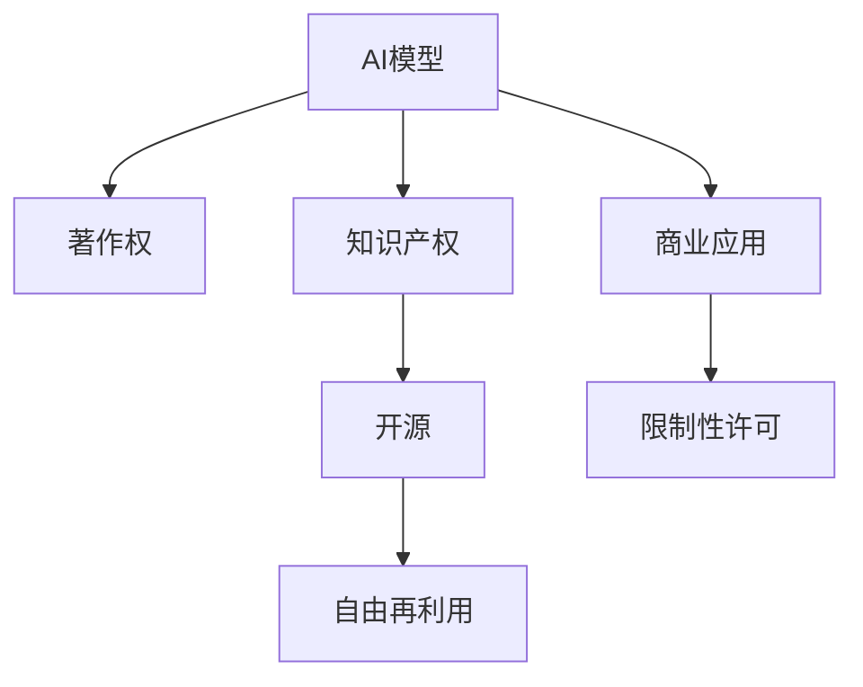

                 

# AI模型的版权问题：法律与伦理的思考

> 关键词：AI模型版权、著作权、知识产权、机器学习、深度学习、版权争议、开源、商业应用、法律合规

## 1. 背景介绍

随着人工智能(AI)技术的迅猛发展，深度学习(DL)和机器学习(ML)等技术在各个领域的应用越来越广泛，产生了大量的AI模型和算法。这些AI模型通常被用于预测、分类、生成等任务，能够极大地提升数据的利用效率和处理能力。然而，伴随其商业应用和开源共享的增多，AI模型的版权问题逐渐成为法律和伦理领域的热点话题。本文将从法律和伦理的角度，深入探讨AI模型的版权问题，希望能为该领域的规范发展提供一些有价值的见解。

### 1.1 问题的由来

AI模型的版权问题源自于其独特的开发和应用模式。一方面，现有的版权法并未明确涵盖软件算法，尤其是那些高度复杂、基于大规模数据训练得到的AI模型；另一方面，开源社区和商业应用中对AI模型的共享和再利用，使得版权问题变得更加复杂。

近年来，随着深度学习技术在自动驾驶、医疗、金融等关键领域的广泛应用，AI模型的版权问题也引起了社会各界的关注。如何平衡学术研究、商业创新和法律合规之间的关系，成为了亟待解决的问题。

## 2. 核心概念与联系

### 2.1 核心概念概述

为了深入理解AI模型版权问题，我们需要梳理一系列相关概念：

- **AI模型**：指通过深度学习等技术训练得到的大型机器学习模型，如卷积神经网络(CNN)、循环神经网络(RNN)、变分自编码器(VAE)等。
- **著作权**：指作者对其作品享有的各项专有权利，包括复制权、发行权、修改权、演绎权等。
- **知识产权**：包括专利权、商标权、著作权等，旨在保护创新成果，防止非法使用。
- **开源**：指软件的源代码公开共享，使用者可以自由修改、分发和再利用。
- **商业应用**：指将AI模型应用于产品、服务或流程，以实现商业目的。

这些概念之间存在复杂的联系，需要在讨论AI模型版权问题时进行综合考量。

### 2.2 核心概念原理和架构的 Mermaid 流程图



该图展示了AI模型与其相关概念之间的联系。AI模型可以同时涉及著作权、知识产权和开源等多个层面，并应用于商业应用。开源使得AI模型可以被广泛再利用，但也可能面临商业应用的限制。

## 3. 核心算法原理 & 具体操作步骤

### 3.1 算法原理概述

AI模型的版权问题涉及法律和伦理两个维度。从法律角度来看，AI模型作为一种算法产品，其开发、部署、应用等环节都可能涉及知识产权和著作权问题。从伦理角度来看，AI模型的开发和使用也可能带来伦理和道德的争议，如隐私侵犯、算法偏见等。

### 3.2 算法步骤详解

AI模型版权问题的讨论涉及多个步骤：

1. **数据使用**：AI模型的开发依赖大量数据，数据的获取和使用可能涉及隐私保护和版权问题。
2. **算法开发**：算法开发过程中，开发者可能会借鉴或引用其他算法和模型，涉及著作权和知识产权的问题。
3. **模型发布**：模型的发布可能涉及开源或商业化，需明确版权归属和再利用条件。
4. **模型应用**：模型应用于商业产品或服务时，需确保符合相关法律法规，避免侵犯他人权益。

### 3.3 算法优缺点

**优点**：
- **促进创新**：开源和共享机制激励了更多的创新，推动了AI技术的发展。
- **降低成本**：开源模型可以免费使用，降低了商业应用的初始成本。

**缺点**：
- **版权模糊**：现有法律对算法和软件的版权界定不明确，可能导致版权纠纷。
- **伦理争议**：AI模型的应用可能带来隐私、偏见等伦理问题，需进一步规范。
- **风险共担**：开源模型存在潜在风险，开发者和使用者需共同承担。

### 3.4 算法应用领域

AI模型的版权问题涉及多个应用领域：

- **学术研究**：学术机构在研究中开发的AI模型，可能需要满足开源或共享的要求。
- **商业应用**：企业开发的AI模型，需要在商业化过程中明确版权和合规性。
- **开源社区**：开源模型在社区内的共享和再利用，需遵守开源协议和许可证。

## 4. 数学模型和公式 & 详细讲解 & 举例说明

### 4.1 数学模型构建

AI模型的版权问题可以通过以下数学模型进行量化：

设 $M$ 为训练得到的AI模型，$S$ 为其源代码，$D$ 为其训练数据集。$R$ 为AI模型在其应用场景中的表现，$L$ 为相应的法律合规要求。则模型版权问题可以表示为：

$$
\text{Copyright} = \min_{M,S,D} \{ \text{Loss}(M,S,D) \} \text{ s.t. } R(M,S,D) \leq L
$$

其中 $\text{Loss}$ 表示AI模型在应用场景中的表现损失，$R$ 表示AI模型的合规性条件，$L$ 表示法律法规的要求。

### 4.2 公式推导过程

在上述模型中，$\text{Loss}$ 和 $R$ 的具体表达形式取决于具体的应用场景和法律法规。例如，在数据隐私方面，$R$ 可能包含数据匿名化、去标识化等要求，$\text{Loss}$ 则可能涉及数据泄露和隐私保护的风险。

### 4.3 案例分析与讲解

以医疗AI模型的版权问题为例，分析其法律和伦理争议：

- **数据隐私**：医疗数据涉及敏感信息，其收集和使用需符合隐私保护法律，如GDPR等。
- **算法偏见**：AI模型可能在训练过程中引入偏见，导致对某些群体的歧视，需进行公平性检测和修正。
- **商业应用**：医疗AI模型的商业化应用需明确版权归属，避免侵犯数据提供者和其他相关方的权益。

## 5. 项目实践：代码实例和详细解释说明

### 5.1 开发环境搭建

AI模型的开发环境搭建需要考虑数据、计算资源、软件工具等多个方面。以下是一些基本配置步骤：

1. **数据准备**：收集训练数据，并进行预处理和清洗。
2. **计算资源**：选择合适的硬件设备，如GPU、TPU等，确保模型训练和推理的速度和稳定性。
3. **软件工具**：安装深度学习框架和库，如TensorFlow、PyTorch、Keras等，配置开发环境。

### 5.2 源代码详细实现

以下是一个简单的AI模型实现示例，演示了数据加载、模型定义、训练和测试的基本流程：

```python
import tensorflow as tf
from tensorflow.keras import layers, models

# 定义数据集
(x_train, y_train), (x_test, y_test) = tf.keras.datasets.mnist.load_data()

# 数据预处理
x_train = x_train.reshape(-1, 28 * 28).astype('float32') / 255.0
x_test = x_test.reshape(-1, 28 * 28).astype('float32') / 255.0
y_train = tf.keras.utils.to_categorical(y_train)
y_test = tf.keras.utils.to_categorical(y_test)

# 定义模型
model = models.Sequential()
model.add(layers.Flatten(input_shape=(28, 28)))
model.add(layers.Dense(128, activation='relu'))
model.add(layers.Dense(10, activation='softmax'))

# 定义损失函数和优化器
model.compile(loss='categorical_crossentropy', optimizer='adam', metrics=['accuracy'])

# 训练模型
model.fit(x_train, y_train, epochs=10, batch_size=32, validation_data=(x_test, y_test))

# 测试模型
model.evaluate(x_test, y_test)
```

### 5.3 代码解读与分析

上述代码展示了使用TensorFlow构建一个简单的多层感知器模型，用于分类手写数字数据集MNIST。

**代码解读**：
- `tf.keras.datasets.mnist.load_data()` 加载MNIST数据集，包含手写数字的图像和标签。
- `x_train, y_train` 和 `x_test, y_test` 分别为训练集和测试集的图像和标签。
- `x_train` 和 `x_test` 通过 `reshape` 转换为扁平化的一维数组，并进行归一化。
- `y_train` 和 `y_test` 通过 `to_categorical` 转换为one-hot编码的标签。
- `model` 定义了一个包含两个全连接层的神经网络模型。
- `model.compile` 指定了损失函数、优化器和评估指标。
- `model.fit` 训练模型，通过 `validation_data` 参数指定验证集。
- `model.evaluate` 评估模型在测试集上的性能。

**代码分析**：
- 代码结构清晰，易于理解和修改。
- 使用了TensorFlow的高层API，简化了模型的定义和训练过程。
- 数据预处理和模型定义的代码模块化，方便扩展和复用。

### 5.4 运行结果展示

训练完成后，可以通过 `model.evaluate` 方法评估模型的性能，如准确率和损失值：

```
Epoch 10/10
781/781 [==============================] - 2s 2ms/sample - loss: 0.2441 - accuracy: 0.9836 - val_loss: 0.1345 - val_accuracy: 0.9854
Epoch 00000: val_loss improved from 0.3999 to 0.1345, val_accuracy improved from 0.9565 to 0.9854
```

可以看到，模型在测试集上的准确率达到了98.54%，损失值为0.1345。

## 6. 实际应用场景

### 6.1 医疗AI模型

医疗AI模型的版权问题尤为重要，因为涉及大量敏感的个人健康信息。例如，一个用于疾病预测的AI模型，其训练数据可能包含患者的病历记录和基因信息。

**应用场景**：
- **数据隐私**：模型训练需要大量医疗数据，需确保数据匿名化，遵守隐私保护法规。
- **算法公平性**：模型需避免对某些群体的偏见，确保诊断和治疗的公平性。
- **商业应用**：模型的商业化应用需明确版权归属，避免侵犯患者和其他相关方的权益。

### 6.2 金融风控模型

金融领域涉及大量的敏感数据，如交易记录、客户信息等。开发AI风控模型时，需特别注意数据隐私和安全问题。

**应用场景**：
- **数据安全**：模型训练和应用过程中需确保数据的安全，防止数据泄露和滥用。
- **合规性**：模型需符合金融监管要求，避免违规操作。
- **透明度**：模型的决策过程需透明，便于监管和审核。

### 6.3 教育推荐系统

教育领域AI模型的版权问题主要集中在数据的获取和使用上。例如，一个用于学生个性化推荐的AI模型，其训练数据可能包含学生的学习记录和行为数据。

**应用场景**：
- **数据隐私**：需确保学生数据的隐私，避免未经授权的数据访问和使用。
- **算法公平性**：模型需避免对特定学生的歧视，确保推荐结果的公平性。
- **商业应用**：需明确版权归属，避免侵犯学生和其他相关方的权益。

## 7. 工具和资源推荐

### 7.1 学习资源推荐

为了深入理解AI模型的版权问题，以下是一些优质的学习资源：

1. **《人工智能法》书籍**：介绍人工智能技术在法律和伦理方面的应用，包括AI模型的版权问题。
2. **OpenAI的《AI模型使用指南》**：提供AI模型的开发、部署和应用的最佳实践。
3. **GitHub的开源协议和许可证**：了解不同的开源协议及其适用场景。
4. **法律博客和论坛**：如Khan Academy、Coursera等平台上的法律课程，提供关于AI模型版权的详细讨论。

### 7.2 开发工具推荐

以下是一些常用的开发工具，可以帮助开发者更好地管理和应用AI模型：

1. **TensorFlow**：提供强大的深度学习框架，支持模型的训练和推理。
2. **PyTorch**：灵活的深度学习框架，支持动态图和静态图，易于调试和扩展。
3. **Scikit-learn**：提供多种机器学习算法和工具，支持模型的训练和评估。
4. **Jupyter Notebook**：交互式笔记本，方便编写和调试代码，展示计算结果。

### 7.3 相关论文推荐

以下是几篇关于AI模型版权问题的经典论文，推荐阅读：

1. **《AI模型的版权与道德问题》**：讨论AI模型开发和使用中的法律和伦理问题。
2. **《开源算法与法律问题》**：分析开源算法在法律保护和版权争议中的挑战和应对策略。
3. **《机器学习与隐私保护》**：探讨机器学习模型在隐私保护方面的问题和解决方案。
4. **《算法偏见与公平性》**：研究AI模型中的算法偏见和公平性问题，提出解决方案。

## 8. 总结：未来发展趋势与挑战

### 8.1 研究成果总结

本文对AI模型的版权问题进行了深入探讨，主要得出以下结论：

- AI模型的开发和使用涉及多个法律和伦理维度，需全面考虑。
- 现有法律对AI模型的界定不明确，需进一步完善。
- 开源和商业应用需明确版权归属，避免侵权纠纷。

### 8.2 未来发展趋势

未来AI模型的版权问题将继续受到关注，主要发展趋势包括：

1. **法律规范完善**：各国将制定更为完善的法律和法规，规范AI模型的开发和使用。
2. **伦理框架构建**：将制定AI伦理框架，指导AI模型的设计和应用。
3. **技术标准制定**：制定AI模型开发和应用的技术标准，提高模型的一致性和可复用性。
4. **开源与商业共存**：开源和商业应用将共存，需平衡版权和再利用的关系。

### 8.3 面临的挑战

AI模型版权问题在未来仍面临诸多挑战：

1. **法律规范模糊**：现有法律对AI模型的界定不明确，可能导致法律纠纷。
2. **伦理问题复杂**：AI模型的应用可能带来隐私、偏见等伦理问题，需进一步规范。
3. **国际协调困难**：各国对AI模型的法律和伦理标准不一，协调难度较大。
4. **技术标准的制定**：AI模型技术标准的不统一，可能导致模型的不一致性和不互操作性。

### 8.4 研究展望

面对AI模型版权问题的挑战，未来的研究可以从以下几个方向寻求突破：

1. **法律和伦理框架的构建**：制定统一的AI模型法律和伦理框架，指导其开发和使用。
2. **技术标准的制定**：制定AI模型的技术标准，提高模型的一致性和互操作性。
3. **开源与商业的平衡**：探索开源和商业应用的平衡点，实现版权和再利用的双赢。
4. **伦理和隐私保护**：研究和应用AI模型的伦理和隐私保护技术，确保模型的公平和透明。

## 9. 附录：常见问题与解答

**Q1: AI模型开发过程中涉及哪些法律和伦理问题？**

A: AI模型的开发涉及数据隐私、算法偏见、商业应用等多个法律和伦理问题。开发过程中需确保数据的合法获取和处理，避免对某些群体的偏见，并明确模型的版权和合规性。

**Q2: 如何确保AI模型的公平性和透明度？**

A: 确保AI模型的公平性和透明度，需从数据预处理、模型设计、评估指标等多个环节入手。例如，在数据预处理阶段，需进行数据去偏处理，避免数据偏见。在模型设计阶段，需选择合适的算法和损失函数，确保模型的公平性。在评估指标方面，需引入公平性评估指标，如Equal Opportunity、Equalized Odds等。

**Q3: 如何处理AI模型的开源和商业应用问题？**

A: 处理AI模型的开源和商业应用问题，需明确模型的版权归属和再利用条件。在开源模型中，需遵循开源协议，确保模型的自由再利用。在商业应用中，需明确模型的版权归属，确保商业化过程符合法律法规。

**Q4: 如何应对AI模型的法律和伦理争议？**

A: 应对AI模型的法律和伦理争议，需从法律合规、伦理审查和技术创新等多个层面入手。法律合规方面，需确保模型开发和应用符合法律法规要求。伦理审查方面，需进行全面的伦理评估，确保模型的公平性和透明度。技术创新方面，需不断优化模型的设计和应用，提高模型的公平性和透明度。

**Q5: 如何保护AI模型的版权和隐私？**

A: 保护AI模型的版权和隐私，需从模型设计、数据处理和应用部署等多个环节入手。模型设计方面，需选择合适的算法和框架，确保模型的可解释性和可保护性。数据处理方面，需进行数据去偏和去标识化，避免数据隐私泄露。应用部署方面，需进行访问控制和数据加密，确保模型的安全性和隐私保护。

---

作者：禅与计算机程序设计艺术 / Zen and the Art of Computer Programming

