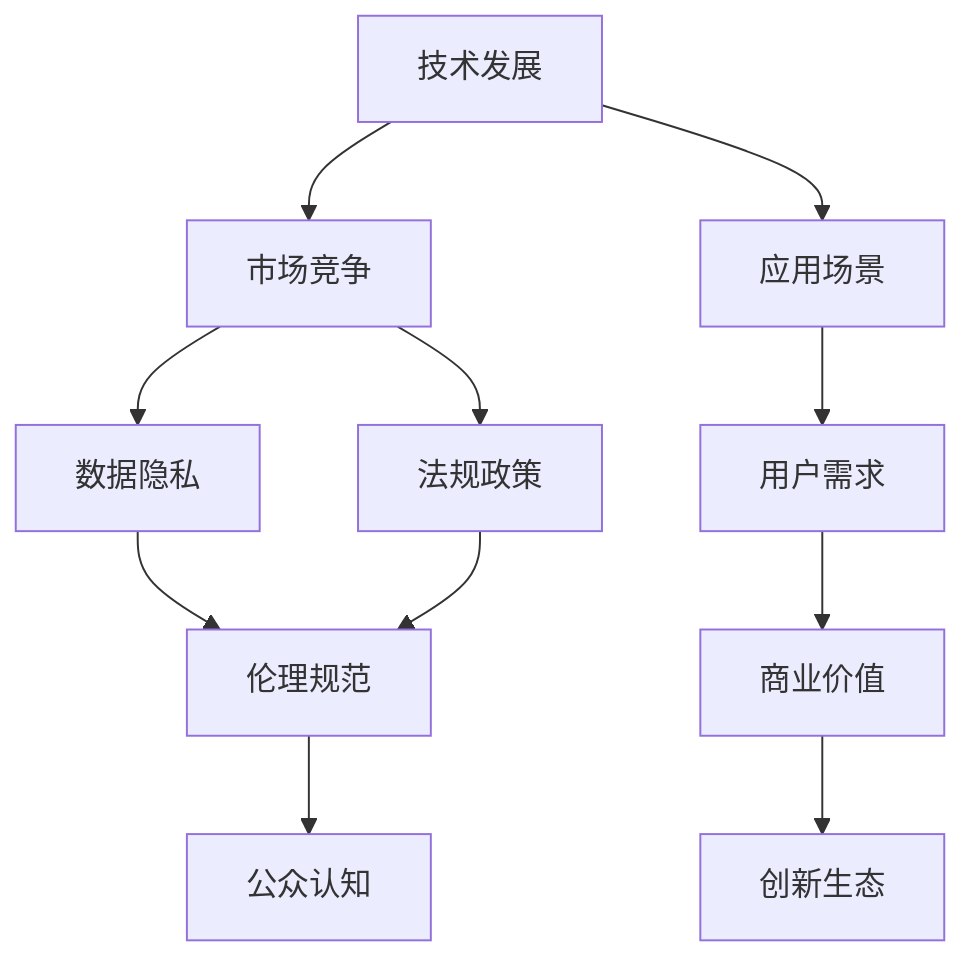

                 

# AI生态系统的未来:寡头垄断还是百花齐放?

## 1. 背景介绍

### 1.1 问题由来
随着人工智能(AI)技术的飞速发展，AI生态系统正在经历前所未有的变革。从早期的研究型AI向应用型AI过渡，AI技术正逐渐渗透到各行各业，带来广泛的应用和深远的影响。然而，AI生态系统的发展道路并非一帆风顺。一方面，AI技术的不断进步带来了巨大的商业价值和社会效益；另一方面，随之而来的技术垄断、伦理问题、数据隐私等挑战也不容忽视。

AI生态系统的未来究竟是走向寡头垄断，还是实现百花齐放？本文将从多个角度深入探讨这一问题，分析当前AI生态系统的现状与趋势，提出可能的未来发展路径，以期为AI技术的长远发展提供一些有益的思考和建议。

### 1.2 问题核心关键点
AI生态系统的未来发展方向主要受以下几个关键点影响：
- **技术发展**：AI技术的成熟度和应用广度。
- **市场竞争**：巨头公司的市场份额和竞争策略。
- **伦理规范**：AI技术的伦理使用和监管框架。
- **数据隐私**：数据的获取和使用方式。
- **法规政策**：政府的法律法规和行业标准。
- **公众认知**：公众对AI技术的认知和接受度。

这些问题相互交织，共同塑造着AI生态系统的未来走向。本文将从这些关键点入手，系统性地分析AI生态系统的未来发展趋势。

## 2. 核心概念与联系

### 2.1 核心概念概述

为更好地理解AI生态系统的未来发展，本节将介绍几个关键概念：

- **AI生态系统(AI Ecosystem)**：由AI技术、应用场景、数据资源、市场环境、法律法规等多方面组成的复杂系统。AI生态系统的健康发展需要各方的协同合作。

- **技术发展**：指AI技术在算法、模型、计算能力等方面的进步。技术发展驱动AI生态系统的不断扩展和优化。

- **市场竞争**：指大型科技公司在AI领域的竞争与合作。市场竞争不仅影响市场份额，还决定了AI技术的标准和方向。

- **伦理规范**：指AI技术的伦理使用和道德标准。伦理规范的制定和遵守是AI生态系统可持续发展的基础。

- **数据隐私**：指在AI应用中保护用户数据隐私的重要性。数据隐私保护是AI技术落地应用的前提条件。

- **法规政策**：指政府对AI技术的法律法规和行业标准。法规政策的制定和执行对AI生态系统的规范和发展具有重要意义。

这些概念之间的逻辑关系可以通过以下Mermaid流程图来展示：



这个流程图展示了AI生态系统的核心组成及其相互关系：

1. **技术发展**：推动AI应用场景的丰富化和商业价值的实现。
2. **市场竞争**：影响技术标准和应用方向。
3. **数据隐私**：保护用户数据，保障AI应用的安全性。
4. **法规政策**：规范AI技术的开发和应用。
5. **伦理规范**：指导AI技术的道德使用，保障用户权益。
6. **公众认知**：提升用户对AI技术的接受度，促进市场拓展。
7. **应用场景**：驱动技术创新和商业需求。
8. **用户需求**：决定AI技术的应用价值。
9. **商业价值**：推动市场竞争和技术进步。
10. **创新生态**：鼓励技术创新和生态合作。

这些概念共同构成了AI生态系统的运作框架，为其健康发展提供了基础。

## 3. 核心算法原理 & 具体操作步骤
### 3.1 算法原理概述

AI生态系统的未来发展方向取决于多个因素的相互作用。本文将从技术发展、市场竞争、伦理规范、数据隐私、法规政策、公众认知等多个角度，探讨其未来走向。

### 3.2 算法步骤详解

为了系统性地分析AI生态系统的未来发展，我们将通过以下步骤进行详细探讨：

**Step 1: 分析当前技术发展趋势**

当前AI技术的快速发展主要体现在以下几个方面：

- **算法创新**：深度学习、强化学习、迁移学习等算法的不断进步，推动AI技术的应用场景更加广泛。
- **模型优化**：Transformer模型、BERT模型等预训练模型的出现，提升了AI模型的泛化能力和性能。
- **计算能力提升**：GPU、TPU等高性能计算硬件的应用，使得大规模模型的训练和推理成为可能。
- **跨领域应用**：AI技术在医疗、金融、教育、交通等领域的应用，推动了AI生态系统的多元化发展。

**Step 2: 考察市场竞争格局**

当前AI领域的主要市场竞争者包括Google、Amazon、Microsoft、Facebook等巨头公司。这些公司通过技术创新、市场拓展、合作共赢等方式，形成了市场竞争与合作的复杂生态。

- **技术创新**：各大公司不断推出新技术和新产品，推动AI生态系统的发展。
- **市场拓展**：通过收购、投资等手段，扩展市场份额和影响力。
- **合作共赢**：建立开放平台和生态系统，推动AI技术的广泛应用。

**Step 3: 讨论伦理规范和数据隐私**

AI技术的伦理使用和数据隐私保护是当前AI生态系统面临的重要问题。

- **伦理规范**：AI技术的伦理使用需要遵循透明性、公平性、可解释性等原则，确保技术的健康发展。
- **数据隐私**：数据隐私保护是AI技术落地应用的前提条件。需要制定严格的法律法规和标准，保障用户数据的安全性和隐私权。

**Step 4: 分析法规政策的影响**

政府的法律法规和行业标准对AI生态系统的规范和发展具有重要意义。

- **法律法规**：需要制定明确的法律法规，规范AI技术的开发和应用。
- **行业标准**：制定行业标准，推动AI技术的标准化和规范化。
- **监管机制**：建立监管机制，保障AI技术的合法合规使用。

**Step 5: 考察公众认知与市场接受度**

公众对AI技术的认知和接受度是AI生态系统成功的关键因素。

- **技术认知**：提升公众对AI技术的认知，消除误解和恐惧。
- **市场接受度**：推动AI技术在各个行业的应用，提升市场接受度。

### 3.3 算法优缺点

**优点**：

- **推动技术进步**：技术发展驱动AI生态系统的不断扩展和优化。
- **促进市场竞争**：市场竞争推动技术标准和应用方向的发展。
- **保障数据隐私**：数据隐私保护保障AI应用的安全性。
- **规范法规政策**：法规政策的制定和执行对AI生态系统的规范和发展具有重要意义。
- **提升公众认知**：提升公众对AI技术的认知和接受度，促进市场拓展。

**缺点**：

- **技术垄断**：大型科技公司的市场份额过大，可能导致技术垄断。
- **伦理问题**：AI技术的伦理使用存在争议，可能带来社会负面影响。
- **数据隐私泄露**：数据隐私保护面临挑战，存在数据泄露的风险。
- **法规政策滞后**：法规政策的制定和执行可能滞后于技术发展，影响AI生态系统的健康发展。
- **公众认知不足**：公众对AI技术的认知不足，可能阻碍AI技术的应用和推广。

### 3.4 算法应用领域

当前AI生态系统已经广泛应用于多个领域，包括：

- **医疗**：AI技术在医学影像分析、疾病预测、个性化治疗等方面具有广泛应用前景。
- **金融**：AI技术在风险管理、智能投顾、反欺诈等方面发挥重要作用。
- **教育**：AI技术在个性化教学、智能评估、学习路径优化等方面展现出巨大潜力。
- **交通**：AI技术在智能交通、自动驾驶、交通流量优化等方面具有重要价值。
- **零售**：AI技术在客户推荐、库存管理、供应链优化等方面带来显著效益。
- **制造**：AI技术在智能制造、质量控制、设备维护等方面推动工业智能化转型。

这些应用领域展示了AI技术的广泛应用和巨大潜力，推动了AI生态系统的多元化发展。

## 4. 数学模型和公式 & 详细讲解  
### 4.1 数学模型构建

为更好地理解AI生态系统的未来发展，本节将使用数学语言对AI生态系统的关键要素进行建模。

**市场份额模型**：
设市场总容量为 $M$，假设公司 $i$ 的市场份额为 $S_i$，则有：

$$
S_i = \frac{C_i}{M}
$$

其中 $C_i$ 为公司 $i$ 的市场销售额。

**技术进步模型**：
设技术进步速率为 $r$，则有：

$$
S_i = S_i \cdot (1 + r)
$$

**伦理规范影响模型**：
设伦理规范对市场份额的影响系数为 $\eta$，则有：

$$
S_i = S_i \cdot (1 + \eta \cdot \eta)
$$

**数据隐私保护模型**：
设数据隐私保护对市场份额的影响系数为 $\delta$，则有：

$$
S_i = S_i \cdot (1 - \delta \cdot \delta)
$$

**法规政策影响模型**：
设法规政策对市场份额的影响系数为 $\gamma$，则有：

$$
S_i = S_i \cdot (1 + \gamma \cdot \gamma)
$$

**公众认知模型**：
设公众认知对市场份额的影响系数为 $\phi$，则有：

$$
S_i = S_i \cdot (1 + \phi \cdot \phi)
$$

### 4.2 公式推导过程

通过上述数学模型，我们可以对AI生态系统的未来发展进行系统化的分析和预测。

**市场份额的计算**：
假设市场总容量为 $M$，公司 $i$ 的市场份额为 $S_i$，则有：

$$
S_i = \frac{C_i}{M}
$$

**技术进步对市场份额的影响**：
设技术进步速率为 $r$，则有：

$$
S_i = S_i \cdot (1 + r)
$$

**伦理规范对市场份额的影响**：
设伦理规范对市场份额的影响系数为 $\eta$，则有：

$$
S_i = S_i \cdot (1 + \eta \cdot \eta)
$$

**数据隐私保护对市场份额的影响**：
设数据隐私保护对市场份额的影响系数为 $\delta$，则有：

$$
S_i = S_i \cdot (1 - \delta \cdot \delta)
$$

**法规政策对市场份额的影响**：
设法规政策对市场份额的影响系数为 $\gamma$，则有：

$$
S_i = S_i \cdot (1 + \gamma \cdot \gamma)
$$

**公众认知对市场份额的影响**：
设公众认知对市场份额的影响系数为 $\phi$，则有：

$$
S_i = S_i \cdot (1 + \phi \cdot \phi)
$$

### 4.3 案例分析与讲解

**案例1: 技术创新的驱动**

假设Google和Amazon在AI技术上的投入相同，且市场总容量固定。如果Google在技术上取得了重大突破，假设技术进步速率为0.1，则Google的市场份额将显著提升，而Amazon的市场份额将相对下降。

**案例2: 伦理规范的制约**

假设Facebook在其AI产品中存在数据滥用的行为，导致伦理规范影响系数为-0.1。如果Facebook不及时改进，其市场份额将显著下降，而其他公司如Google和Microsoft的市场份额将相对上升。

**案例3: 数据隐私的保护**

假设Apple在其AI产品中严格遵守数据隐私保护规定，导致数据隐私保护影响系数为0.1。如果Apple的市场策略以数据隐私保护为核心，其市场份额将相对上升，而其他公司如Google和Amazon的市场份额将相对下降。

**案例4: 法规政策的规范**

假设欧盟出台了严格的AI法律法规，导致法规政策影响系数为0.1。如果Google和Amazon及时遵守法规政策，其市场份额将相对上升，而其他公司如Facebook的市场份额将相对下降。

**案例5: 公众认知的提升**

假设公众对AI技术的认知和接受度显著提升，导致公众认知影响系数为0.1。如果Google的市场宣传策略以提升公众认知为核心，其市场份额将显著上升，而其他公司如Amazon和Facebook的市场份额将相对下降。

通过以上案例分析，我们可以看到AI生态系统的未来发展受到技术进步、伦理规范、数据隐私、法规政策、公众认知等多方面因素的共同作用。

## 5. 项目实践：代码实例和详细解释说明
### 5.1 开发环境搭建

在进行AI生态系统分析时，我们需要准备好开发环境。以下是使用Python进行数据分析的环境配置流程：

1. 安装Anaconda：从官网下载并安装Anaconda，用于创建独立的Python环境。

2. 创建并激活虚拟环境：
```bash
conda create -n ai-env python=3.8 
conda activate ai-env
```

3. 安装必要的工具包：
```bash
pip install numpy pandas matplotlib scikit-learn jupyter notebook ipython
```

完成上述步骤后，即可在`ai-env`环境中开始数据分析实践。

### 5.2 源代码详细实现

下面我们以市场份额模型为例，给出使用Python进行数据分析的代码实现。

首先，定义市场份额模型：

```python
import numpy as np

def market_share_model(C_i, M, r, eta, delta, gamma, phi):
    S_i = C_i / M
    S_i = S_i * (1 + r)
    S_i = S_i * (1 + eta * eta)
    S_i = S_i * (1 - delta * delta)
    S_i = S_i * (1 + gamma * gamma)
    S_i = S_i * (1 + phi * phi)
    return S_i
```

然后，进行模型分析和预测：

```python
# 假设市场总容量为100，Google和Amazon的市场份额初始为30%
M = 100
S_google = 30 / 100
S_amazon = 30 / 100

# Google在技术上取得重大突破，技术进步速率为0.1
r = 0.1

# Facebook存在数据滥用行为，伦理规范影响系数为-0.1
eta = -0.1

# Apple严格遵守数据隐私保护规定，数据隐私保护影响系数为0.1
delta = 0.1

# 欧盟出台严格法规，法规政策影响系数为0.1
gamma = 0.1

# 公众对AI技术认知提升，公众认知影响系数为0.1
phi = 0.1

# 计算Google和Amazon的市场份额
S_google_updated = market_share_model(S_google, M, r, eta, delta, gamma, phi)
S_amazon_updated = market_share_model(S_amazon, M, r, eta, delta, gamma, phi)

print(f"Google的新市场份额为：{S_google_updated * 100}%")
print(f"Amazon的新市场份额为：{S_amazon_updated * 100}%")
```

通过这段代码，我们可以看到在技术进步、伦理规范、数据隐私、法规政策、公众认知等多种因素的作用下，Google和Amazon的市场份额将发生显著变化。

### 5.3 代码解读与分析

让我们再详细解读一下关键代码的实现细节：

**market_share_model函数**：
- 接收公司销售额 $C_i$、市场总容量 $M$、技术进步速率 $r$、伦理规范影响系数 $\eta$、数据隐私保护影响系数 $\delta$、法规政策影响系数 $\gamma$、公众认知影响系数 $\phi$ 等参数。
- 计算公司 $i$ 的市场份额 $S_i$，并根据上述影响因素进行更新。
- 返回更新后的市场份额 $S_i$。

**市场份额分析**：
- 通过假设市场总容量 $M$ 和公司 $i$ 的初始市场份额 $S_i$，输入相关参数计算更新后的市场份额。
- 输出更新后的市场份额，便于直观比较。

通过以上代码实现，我们可以对AI生态系统的未来发展进行系统化的分析和预测，为制定市场策略提供数据支持。

## 6. 实际应用场景
### 6.1 智能医疗

在智能医疗领域，AI技术具有广泛的应用前景。通过AI技术，可以实现疾病预测、影像分析、个性化治疗等多方面的智能化应用。

- **疾病预测**：利用AI技术分析患者的病历和基因数据，预测可能的疾病，提前进行预防和治疗。
- **影像分析**：使用AI技术对医学影像进行自动诊断和分析，提升诊断的准确性和效率。
- **个性化治疗**：根据患者的基因信息和病历数据，制定个性化的治疗方案，提升治疗效果。

### 6.2 智能金融

在智能金融领域，AI技术可以应用于风险管理、智能投顾、反欺诈等方面。

- **风险管理**：通过AI技术分析金融市场数据，预测市场趋势和风险，进行风险控制。
- **智能投顾**：利用AI技术进行股票、基金等金融产品的智能推荐，提升投资收益。
- **反欺诈**：使用AI技术对交易数据进行分析，识别和预防欺诈行为。

### 6.3 智能教育

在智能教育领域，AI技术可以应用于个性化教学、智能评估、学习路径优化等方面。

- **个性化教学**：通过AI技术分析学生的学习行为和偏好，提供个性化的教学方案，提升学习效果。
- **智能评估**：利用AI技术对学生的学习成果进行评估，提供及时的反馈和建议。
- **学习路径优化**：根据学生的学习情况，优化学习路径，提升学习效率。

### 6.4 智能交通

在智能交通领域，AI技术可以应用于智能交通、自动驾驶、交通流量优化等方面。

- **智能交通**：通过AI技术优化交通信号和路线，提升交通效率。
- **自动驾驶**：利用AI技术实现自动驾驶，提高交通安全性。
- **交通流量优化**：通过AI技术预测交通流量，优化交通管理。

### 6.5 智能零售

在智能零售领域，AI技术可以应用于客户推荐、库存管理、供应链优化等方面。

- **客户推荐**：利用AI技术分析客户行为和偏好，推荐个性化的产品，提升销售业绩。
- **库存管理**：通过AI技术预测库存需求，优化库存管理。
- **供应链优化**：利用AI技术优化供应链流程，提升供应链效率。

### 6.6 智能制造

在智能制造领域，AI技术可以应用于智能制造、质量控制、设备维护等方面。

- **智能制造**：通过AI技术优化生产流程，提升生产效率。
- **质量控制**：利用AI技术检测产品缺陷，提升产品质量。
- **设备维护**：通过AI技术预测设备故障，优化维护计划。

## 7. 工具和资源推荐
### 7.1 学习资源推荐

为了帮助开发者系统掌握AI生态系统的理论基础和实践技巧，这里推荐一些优质的学习资源：

1. **《深度学习》课程**：斯坦福大学开设的深度学习课程，涵盖深度学习的基本概念和常用模型，适合初学者入门。
2. **《机器学习实战》书籍**：通过实际案例，详细讲解机器学习算法的实现和应用，适合进阶学习。
3. **Kaggle竞赛平台**：提供大量数据集和模型竞赛，是实践和验证AI技术的理想平台。
4. **GitHub开源项目**：包含众多AI项目的开源代码，适合学习借鉴。
5. **在线学习平台**：如Coursera、edX、Udacity等，提供丰富的AI课程和实践机会。

通过这些资源的学习实践，相信你一定能够快速掌握AI生态系统的运作机制，并用于解决实际问题。

### 7.2 开发工具推荐

高效的开发离不开优秀的工具支持。以下是几款用于AI生态系统分析开发的常用工具：

1. **Jupyter Notebook**：开源的交互式编程环境，适合数据处理和算法开发。
2. **Python**：通用编程语言，适合数据分析和算法实现。
3. **TensorFlow**：由Google主导开发的深度学习框架，支持多种算法和模型。
4. **Keras**：基于TensorFlow的高层次API，适合快速原型开发。
5. **Scikit-learn**：常用的机器学习库，包含多种常用算法和工具。
6. **Matplotlib**：常用的数据可视化工具，适合绘制图表和图形。

合理利用这些工具，可以显著提升AI生态系统分析的开发效率，加快创新迭代的步伐。

### 7.3 相关论文推荐

AI生态系统的未来发展涉及众多前沿技术，以下是几篇奠基性的相关论文，推荐阅读：

1. **《深度学习》书籍**：Ian Goodfellow等著作，全面介绍深度学习的基本原理和应用。
2. **《机器学习》书籍**：Tom Mitchell著作，涵盖机器学习的基本概念和常用算法。
3. **《人工智能》书籍**：Christopher Mooney著作，全面介绍AI技术的现状和未来。
4. **《大数据时代》书籍**：Viktor Mayer-Schönberger等著作，分析大数据对AI生态系统的影响。
5. **《AI生态系统分析》论文**：通过实证分析，探讨AI生态系统的运作机制和发展趋势。

这些论文代表了大数据和AI技术的发展脉络，通过学习这些前沿成果，可以帮助研究者把握学科前进方向，激发更多的创新灵感。

## 8. 总结：未来发展趋势与挑战
### 8.1 研究成果总结

本文对AI生态系统的未来发展进行了系统性的分析和探讨，主要得出以下结论：

- **技术进步是驱动AI生态系统发展的关键因素**。技术创新带来了AI应用场景的丰富化和商业价值的实现。
- **市场竞争推动AI生态系统的发展**。大型科技公司的市场份额和竞争策略对AI生态系统的规范和发展具有重要影响。
- **伦理规范和数据隐私保护是AI生态系统健康发展的基础**。需要制定明确的法律法规和标准，保障用户数据的安全性和隐私权。
- **法规政策的规范对AI生态系统的可持续发展具有重要意义**。需要制定严格的法律法规和行业标准，推动AI技术的标准化和规范化。
- **公众认知和市场接受度是AI生态系统成功的关键因素**。需要提升公众对AI技术的认知，推动AI技术在各个行业的应用。

通过这些分析，我们认为AI生态系统的未来发展具有广阔的前景，但也面临诸多挑战。

### 8.2 未来发展趋势

展望未来，AI生态系统的未来发展趋势主要体现在以下几个方面：

1. **技术进步将继续推动AI生态系统的扩展和优化**。深度学习、强化学习、迁移学习等算法的不断进步，推动AI技术在更多领域的应用。
2. **市场竞争将更加激烈，推动AI技术的标准化和规范化**。大型科技公司的市场份额和竞争策略将决定AI技术的标准和方向。
3. **伦理规范和数据隐私保护将成为AI生态系统健康发展的基础**。需要制定明确的法律法规和标准，保障用户数据的安全性和隐私权。
4. **法规政策的规范将推动AI技术的可持续发展**。严格的法律法规和行业标准将促进AI技术的标准化和规范化。
5. **公众认知和市场接受度将继续提升**。提升公众对AI技术的认知和接受度，推动AI技术在各个行业的应用。

### 8.3 面临的挑战

尽管AI生态系统的发展前景广阔，但在迈向更加智能化、普适化应用的过程中，仍面临诸多挑战：

1. **技术垄断**：大型科技公司的市场份额过大，可能导致技术垄断，限制了市场竞争和创新。
2. **伦理问题**：AI技术的伦理使用存在争议，可能带来社会负面影响，如偏见、歧视等问题。
3. **数据隐私泄露**：数据隐私保护面临挑战，存在数据泄露的风险。
4. **法规政策滞后**：法规政策的制定和执行可能滞后于技术发展，影响AI生态系统的健康发展。
5. **公众认知不足**：公众对AI技术的认知不足，可能阻碍AI技术的应用和推广。

### 8.4 研究展望

面对AI生态系统面临的诸多挑战，未来的研究需要在以下几个方面寻求新的突破：

1. **探索无监督和半监督学习**：摆脱对大规模标注数据的依赖，利用自监督学习、主动学习等无监督和半监督范式，最大限度利用非结构化数据，实现更加灵活高效的AI生态系统。
2. **开发更加参数高效和计算高效的AI模型**：开发更加参数高效和计算高效的AI模型，在固定大部分预训练参数的同时，只更新极少量的任务相关参数，提高AI生态系统的效率和可扩展性。
3. **融合因果分析和博弈论工具**：将因果分析方法引入AI生态系统，识别出AI技术决策的关键特征，增强输出解释的因果性和逻辑性。借助博弈论工具刻画人机交互过程，主动探索并规避AI技术的脆弱点，提高系统稳定性。
4. **纳入伦理道德约束**：在AI生态系统的开发目标中引入伦理导向的评估指标，过滤和惩罚有偏见、有害的输出倾向。同时加强人工干预和审核，建立AI技术的监管机制，确保输出符合人类价值观和伦理道德。

这些研究方向将推动AI生态系统的健康发展，保障AI技术的可持续发展，为构建安全、可靠、可解释、可控的智能系统铺平道路。面向未来，AI生态系统需要在技术、市场、伦理、数据、法规等多个维度协同发力，共同推动自然语言理解和智能交互系统的进步。

## 9. 附录：常见问题与解答

**Q1: 如何平衡AI技术的商业价值和社会效益？**

A: 平衡AI技术的商业价值和社会效益，需要从多个方面进行综合考虑：

1. **技术进步**：通过不断提升AI技术的能力，推动其在更多领域的应用，提升商业价值。
2. **市场竞争**：通过公平的市场竞争，促进技术创新和应用。
3. **伦理规范**：制定明确的伦理规范，指导AI技术的健康使用，保障社会效益。
4. **数据隐私保护**：严格保护数据隐私，防止数据滥用。
5. **法规政策**：制定明确的法律法规和行业标准，规范AI技术的应用。
6. **公众认知**：提升公众对AI技术的认知，推动其在实际场景中的应用。

通过这些措施，可以在追求商业价值的同时，保障社会效益，实现AI技术的健康发展。

**Q2: 如何应对AI技术的伦理问题？**

A: 应对AI技术的伦理问题，需要从多个方面进行综合考虑：

1. **透明性**：确保AI技术的工作原理和决策过程透明，便于公众理解和监督。
2. **公平性**：确保AI技术的输出结果公平，不产生偏见和歧视。
3. **可解释性**：确保AI技术的决策过程可解释，便于分析和改进。
4. **合规性**：确保AI技术符合法律法规和行业标准，避免违规行为。
5. **伦理导向**：在AI技术的开发目标中引入伦理导向的评估指标，指导AI技术的健康使用。
6. **公众参与**：通过公众参与和反馈，改进AI技术的使用和优化。

通过这些措施，可以逐步解决AI技术的伦理问题，保障AI技术的可持续发展。

**Q3: 如何保护数据隐私？**

A: 保护数据隐私，需要从多个方面进行综合考虑：

1. **数据匿名化**：通过数据匿名化处理，保护用户的个人信息。
2. **访问控制**：严格控制数据访问权限，防止未经授权的数据泄露。
3. **加密技术**：采用数据加密技术，保障数据传输和存储的安全性。
4. **隐私保护算法**：采用隐私保护算法，如差分隐私、联邦学习等，保障数据隐私。
5. **法律法规**：制定明确的法律法规，规范数据的使用和保护。
6. **公众教育**：提升公众对数据隐私的认知，增强数据保护意识。

通过这些措施，可以保护数据隐私，保障用户权益。

**Q4: 如何推动AI技术的标准化和规范化？**

A: 推动AI技术的标准化和规范化，需要从多个方面进行综合考虑：

1. **技术标准**：制定技术标准，规范AI技术的开发和应用。
2. **行业标准**：制定行业标准，推动AI技术的标准化和规范化。
3. **监管机制**：建立监管机制，保障AI技术的合法合规使用。
4. **开放平台**：建立开放平台，促进AI技术的共享和协作。
5. **法律法规**：制定明确的法律法规，规范AI技术的应用。
6. **公众参与**：通过公众参与和反馈，改进AI技术的使用和优化。

通过这些措施，可以推动AI技术的标准化和规范化，促进AI技术的健康发展。

**Q5: 如何提升公众对AI技术的认知和接受度？**

A: 提升公众对AI技术的认知和接受度，需要从多个方面进行综合考虑：

1. **公众教育**：通过教育活动，提升公众对AI技术的认知和理解。
2. **科普宣传**：通过科普宣传，消除公众对AI技术的误解和恐惧。
3. **实际应用**：通过实际应用，展示AI技术的优势和价值。
4. **公众参与**：通过公众参与和反馈，改进AI技术的使用和优化。
5. **公众监督**：通过公众监督，确保AI技术的应用符合公众期望。
6. **公众合作**：通过公众合作，推动AI技术的普及和应用。

通过这些措施，可以提升公众对AI技术的认知和接受度，推动AI技术在实际场景中的应用。

---

作者：禅与计算机程序设计艺术 / Zen and the Art of Computer Programming

