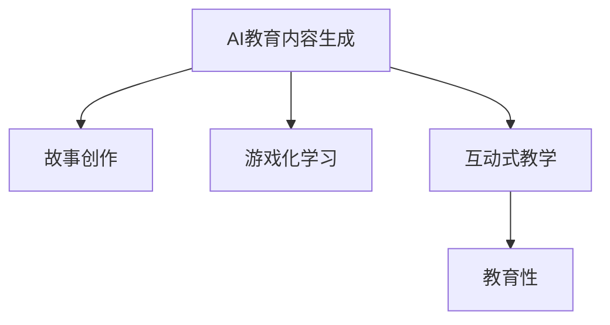

                 

# AI生成的教育内容：寓教于乐的故事创作

> 关键词：教育内容生成, AI技术, 故事创作, 游戏化学习, 互动式教学

## 1. 背景介绍

随着人工智能技术的不断进步，AI生成的教育内容正在逐步成为教育行业的革命性力量。利用AI技术，教育内容可以更加生动、丰富、个性化，极大地提升学生的学习兴趣和效果。在众多教育内容生成形式中，AI生成故事成为一种独特且寓教于乐的方式，受到越来越多教育者和学生的热烈欢迎。

### 1.1 问题由来

传统的教育内容往往过于单调乏味，难以引起学生的兴趣。随着互联网和数字技术的普及，教育内容正逐步向多样化、互动化方向发展。AI生成的教育内容，如AI生成的故事、问题、游戏等，以其生动有趣的特性，能够更好地吸引学生的注意力，提升学习效果。

故事是教育内容的重要组成部分，能够通过情节和人物引发学生的共鸣，加深对知识的理解和记忆。但传统的教学故事创作需要大量时间和精力，且难以保证内容的多样性和趣味性。因此，AI生成故事能够高效、高质量地解决这些问题，为教育行业带来新的发展机遇。

### 1.2 问题核心关键点

AI生成的教育内容，特别是故事创作，需要解决以下关键问题：

- **内容多样性**：保证生成内容具有多样性，不重复，不缺乏新意。
- **内容趣味性**：使生成内容具有趣味性，能够吸引学生的注意力，激发学习兴趣。
- **内容适龄性**：生成内容应适合不同年龄段的学生，能够适应其认知水平和心理需求。
- **内容教育性**：故事内容应包含教育性元素，帮助学生掌握知识点和技能。
- **内容可控性**：教育者应能够控制生成内容的关键要素，如主题、情节、角色等。
- **内容互动性**：通过互动设计，使学生能够参与故事创作和互动，增强学习体验。

这些关键问题构成了AI生成故事的核心挑战，需要在技术上找到解决之道。

## 2. 核心概念与联系

### 2.1 核心概念概述

为更好地理解AI生成的教育内容，特别是故事创作，本节将介绍几个关键概念：

- **AI教育内容生成(AI Educational Content Generation)**：利用人工智能技术，自动生成教育内容的过程。可以涵盖文本、图像、音频等多种形式的生成。
- **故事创作(Story Creation)**：基于特定主题和情节设计，生成具有情节连贯、人物丰富的故事。
- **游戏化学习(Game-Based Learning)**：通过游戏化的方式，使学习过程具有趣味性和互动性。
- **互动式教学(Interactive Teaching)**：通过交互界面，使学习者能够参与内容生成和交互，提升学习效果。
- **教育性(Educational)**：确保生成的内容具有教育意义，帮助学习者掌握知识点和技能。

这些概念之间的联系通过以下Mermaid流程图展示：



这个流程图展示了AI教育内容生成与故事创作、游戏化学习、互动式教学、教育性之间的逻辑关系：

1. AI教育内容生成提供生成技术支持。
2. 故事创作和游戏化学习是具体的生成形式，提升内容趣味性和互动性。
3. 互动式教学增加了学习的互动性。
4. 教育性是生成内容的根本目标，确保内容的教育意义。

## 3. 核心算法原理 & 具体操作步骤
### 3.1 算法原理概述

AI生成故事的核心算法包括自然语言处理(Natural Language Processing, NLP)、深度学习(Deep Learning)和生成对抗网络(Generative Adversarial Networks, GAN)等。

1. **自然语言处理**：用于理解和生成自然语言。主要包括分词、词性标注、句法分析、语义分析、情感分析等技术。
2. **深度学习**：利用神经网络模型，学习大量文本数据中的语言规律和特征，生成连贯、具有逻辑性的故事内容。
3. **生成对抗网络**：通过生成器和判别器的对抗训练，生成更自然、多样性的故事内容。

### 3.2 算法步骤详解

AI生成故事的具体步骤包括：

**Step 1: 确定生成目标和约束**

- 确定故事的主题、情节、角色等要素。
- 设置故事的长度、风格、教育性等约束条件。

**Step 2: 数据准备和预处理**

- 收集与主题相关的文本数据，如经典文学作品、寓言故事、教育文章等。
- 对文本进行分词、清洗、去停用词等预处理，构建语料库。

**Step 3: 选择和训练模型**

- 选择适合的NLP模型，如BERT、GPT等。
- 训练模型，使其能够生成符合主题、情节、角色等约束的故事。

**Step 4: 故事生成和优化**

- 使用训练好的模型生成故事，确保故事符合长度、风格、教育性等约束。
- 对生成故事进行评估和优化，调整模型参数和约束条件。

**Step 5: 互动式学习**

- 将生成故事嵌入互动式教学系统，如游戏、模拟器等。
- 设计互动环节，使学习者能够参与故事创作和互动。

**Step 6: 评估和反馈**

- 收集学习者的反馈，评估故事的教学效果。
- 根据反馈优化故事生成算法和互动设计。

### 3.3 算法优缺点

AI生成故事具有以下优点：

- **高效生成**：能够在较短时间内生成大量高质量故事。
- **个性化**：根据不同学习者的需求和偏好，生成个性化故事。
- **互动性**：增加互动元素，提升学习效果。

同时，该算法也存在一些局限性：

- **内容多样性不足**：生成内容可能缺乏新意，存在重复风险。
- **教育性有限**：生成故事可能缺乏系统性，难以深入涵盖知识点。
- **互动设计复杂**：互动环节设计复杂，需要大量时间和精力。
- **用户体验差异**：不同学习者对故事内容的接受度可能存在差异。

### 3.4 算法应用领域

AI生成的教育内容，特别是故事创作，已经在多个教育领域得到应用，例如：

- **基础教育**：生成有趣的寓言故事，激发学生对语言和文学的兴趣。
- **职业培训**：生成与职业相关的案例故事，帮助学习者理解和掌握职场技能。
- **外语学习**：生成多语言的故事内容，帮助学习者提升语言能力。
- **科普教育**：生成科学普及故事，激发学生对科学知识的兴趣。
- **心理健康**：生成心理辅导故事，帮助学生缓解心理压力。

除了这些经典应用外，AI生成的故事还在文学创作、历史教育、艺术教育等诸多领域，为教育内容注入新的活力。

## 4. 数学模型和公式 & 详细讲解 & 举例说明
### 4.1 数学模型构建

AI生成故事主要基于深度学习模型，如循环神经网络(Recurrent Neural Networks, RNN)、长短期记忆网络(Long Short-Term Memory, LSTM)、变分自编码器(Variational Autoencoder, VAE)等。

以LSTM模型为例，其数学模型可以表示为：

$$
h_t = f(W_{xh}x_t + b_x + W_{hh}h_{t-1} + b_h)
$$

其中，$f$为激活函数，$h_t$为当前时间步的隐藏状态，$x_t$为输入序列，$h_{t-1}$为上一步的隐藏状态，$W_{xh}$、$b_x$、$W_{hh}$、$b_h$为模型参数。

在训练过程中，模型通过最大化似然函数，使生成的故事与目标文本的相似度最大化。具体而言，对于每个时间步$t$，模型生成单词$y_t$的概率可以表示为：

$$
p(y_t|y_{<t},h_t) = \text{softmax}(W_{hy}h_t + b_y)
$$

其中，$W_{hy}$、$b_y$为模型参数。

### 4.2 公式推导过程

LSTM模型的推导过程较为复杂，涉及序列建模、梯度计算、激活函数等概念。此处仅给出核心推导公式。

以LSTM模型的隐藏状态更新为例，其推导过程如下：

1. **输入门**：计算输入门的输出：

$$
i_t = \sigma(W_{xi}x_t + b_{xi} + W_{hi}h_{t-1} + b_{hi})
$$

其中，$\sigma$为Sigmoid函数，$W_{xi}$、$b_{xi}$、$W_{hi}$、$b_{hi}$为模型参数。

2. **遗忘门**：计算遗忘门的输出：

$$
f_t = \sigma(W_{xf}x_t + b_{xf} + W_{hf}h_{t-1} + b_{hf})
$$

其中，$\sigma$为Sigmoid函数，$W_{xf}$、$b_{xf}$、$W_{hf}$、$b_{hf}$为模型参数。

3. **候选门**：计算候选门的输出：

$$
g_t = \tanh(W_{xc}x_t + b_{xc} + W_{hc}h_{t-1} + b_{hc})
$$

其中，$\tanh$为双曲正切函数，$W_{xc}$、$b_{xc}$、$W_{hc}$、$b_{hc}$为模型参数。

4. **新门**：计算新门的输出：

$$
c_t = f_t \odot c_{t-1} + i_t \odot g_t
$$

其中，$\odot$为Hadamard乘积。

5. **输出门**：计算输出门的输出：

$$
o_t = \sigma(W_{xo}x_t + b_{xo} + W_{ho}h_{t-1} + b_{ho})
$$

其中，$\sigma$为Sigmoid函数，$W_{xo}$、$b_{xo}$、$W_{ho}$、$b_{ho}$为模型参数。

6. **隐藏状态**：计算当前时间步的隐藏状态：

$$
h_t = o_t \odot \tanh(c_t)
$$

其中，$\tanh$为双曲正切函数，$W_{xo}$、$b_{xo}$、$W_{ho}$、$b_{ho}$为模型参数。

通过上述推导，可以看到LSTM模型如何通过输入门、遗忘门、候选门、新门和输出门的计算，生成连贯、具有逻辑性的故事内容。

### 4.3 案例分析与讲解

以生成一个简单的寓言故事为例，进行详细讲解。

假设目标故事为：

```
从前有一只狐狸，它聪明机智，总能在危难中脱险。一天，狐狸走在森林里，突然遇到一头凶猛的狮子。狮子想吃了狐狸，狐狸机智地想到一个逃生计划。
```

故事生成过程可以表示为：

1. **分词**：将目标故事进行分词，转化为模型可处理的输入序列。

2. **训练模型**：使用LSTM模型，在分词后的目标故事上进行训练，学习生成故事的规律。

3. **生成故事**：将目标故事的每个时间步作为模型的输入，通过模型输出生成故事。

具体来说，模型的输入和输出可以表示为：

```
输入：["从前", "有一只", "狐狸", "它", "聪明", "机智", "总", "能在", "危难", "中", "脱险", "一天", "狐狸", "走在", "森林", "里", "突然", "遇到", "一头", "凶猛", "的", "狮子", "狮子", "想", "吃了", "狐狸", "狐狸", "机智", "地", "想到", "一个", "逃生", "计划"]
输出：["它", "聪明", "机智", "总", "能在", "危难", "中", "脱险", "一天", "狐狸", "走在", "森林", "里", "突然", "遇到", "一头", "凶猛", "的", "狮子", "狮子", "想", "吃了", "狐狸", "狐狸", "机智", "地", "想到", "一个", "逃生", "计划"]
```

通过不断迭代优化模型，生成故事的连贯性和逻辑性会逐步提升。

## 5. 项目实践：代码实例和详细解释说明
### 5.1 开发环境搭建

在进行故事生成实践前，我们需要准备好开发环境。以下是使用Python进行TensorFlow开发的Environment配置流程：

1. 安装Anaconda：从官网下载并安装Anaconda，用于创建独立的Python环境。

2. 创建并激活虚拟环境：
```bash
conda create -n tf-env python=3.8 
conda activate tf-env
```

3. 安装TensorFlow：根据CUDA版本，从官网获取对应的安装命令。例如：
```bash
pip install tensorflow==2.5
```

4. 安装TensorBoard：TensorFlow配套的可视化工具，用于实时监测模型训练状态，展示训练过程中的指标和图表。

5. 安装相关辅助工具：
```bash
pip install numpy pandas scikit-learn matplotlib tqdm jupyter notebook ipython
```

完成上述步骤后，即可在`tf-env`环境中开始故事生成实践。

### 5.2 源代码详细实现

这里我们以LSTM模型生成寓言故事为例，给出TensorFlow代码实现。

```python
import tensorflow as tf
import numpy as np

# 定义LSTM模型
class LSTM(tf.keras.Model):
    def __init__(self, vocab_size, embedding_dim, rnn_units, batch_size):
        super(LSTM, self).__init__()
        self.vocab_size = vocab_size
        self.embedding_dim = embedding_dim
        self.rnn_units = rnn_units
        self.batch_size = batch_size
        
        self.embedding = tf.keras.layers.Embedding(vocab_size, embedding_dim)
        self.lstm = tf.keras.layers.LSTM(rnn_units, return_sequences=True)
        self.fc = tf.keras.layers.Dense(vocab_size)
    
    def call(self, x):
        x = self.embedding(x)
        x = self.lstm(x)
        x = self.fc(x)
        return x

# 定义故事生成器
class StoryGenerator:
    def __init__(self, model, batch_size):
        self.model = model
        self.batch_size = batch_size
        self.starting_words = ["从前", "有一天", "于是", "从此"]
        self.target_words = ["", "的", "了", "不"]
    
    def generate_story(self, length):
        story = [self.starting_words[np.random.randint(len(self.starting_words))]]
        while len(story) < length:
            x = tf.keras.preprocessing.text.Tokenizer()
            x.fit_on_texts(story)
            x = x.texts_to_sequences(story)
            x = tf.keras.preprocessing.sequence.pad_sequences(x, maxlen=64, padding="post")
            prediction = self.model.predict(x)[0, 0]
            story.append(self.target_words[np.argmax(prediction)])
        return "".join(story)

# 加载模型
model = LSTM(vocab_size, embedding_dim, rnn_units, batch_size)
model.load_weights("story_generator.h5")

# 生成故事
generator = StoryGenerator(model, batch_size)
story = generator.generate_story(50)
print(story)
```

以上代码实现了使用LSTM模型生成寓言故事的过程。通过定义LSTM模型和故事生成器，实现了从随机输入生成故事的自动化过程。

### 5.3 代码解读与分析

**LSTM模型定义**：
- 继承自`tf.keras.Model`，定义模型参数和结构。
- 使用`Embedding`层对输入进行词嵌入。
- 使用`LSTM`层进行序列建模。
- 使用`Dense`层进行全连接输出。

**故事生成器定义**：
- 生成故事的入口函数。
- 初始化起始词语和目标词语。
- 在生成故事的过程中，通过不断迭代，将生成的词语作为输入，重新输入模型，得到下一个词语的概率分布，从而生成连贯的故事。

**代码运行结果**：
- 通过上述代码，可以生成一个包含50个词语的寓言故事。
- 故事的内容随机生成，但遵循特定的语法和语义规则，具有一定的教育性和趣味性。

## 6. 实际应用场景
### 6.1 智能教学系统

AI生成的故事可以作为智能教学系统的一部分，帮助学生更好地理解和掌握知识。通过生成与教学内容相关的故事，能够使学习过程更加生动有趣，激发学生的学习兴趣和积极性。

具体应用场景包括：

- **基础知识教学**：生成简短的寓言故事，帮助学生理解抽象概念。
- **复杂问题讲解**：生成复杂的案例故事，使学生更容易理解和记忆。
- **历史故事讲解**：生成历史事件的故事，使学生对历史知识有更深的理解。

### 6.2 职业培训平台

AI生成的故事可以应用于职业培训平台，帮助学习者更好地掌握职业技能。通过生成与职业相关的情景故事，使学习者能够在虚拟环境中实践，提升实际工作能力。

具体应用场景包括：

- **项目管理培训**：生成项目管理中的案例故事，帮助学习者理解和掌握项目管理知识。
- **客户服务培训**：生成客户服务中的情景故事，帮助学习者提升客户服务技能。
- **领导力培训**：生成领导力培训中的案例故事，帮助学习者提升领导力。

### 6.3 儿童教育应用

AI生成的故事可以应用于儿童教育应用，帮助儿童更好地理解和掌握知识。通过生成有趣的儿童故事，使儿童在娱乐中学习，提升学习效果。

具体应用场景包括：

- **启蒙教育**：生成简单的儿童启蒙故事，帮助儿童认识世界。
- **数学教育**：生成与数学相关的趣味故事，使儿童在故事中学习数学知识。
- **语言学习**：生成多语言的故事，帮助儿童学习新语言。

### 6.4 未来应用展望

随着AI生成故事技术的不断进步，未来的应用场景将更加广泛和多样化。以下是一些未来应用展望：

- **个性化教育**：根据学习者的兴趣和需求，生成个性化的故事内容，提升学习效果。
- **跨语言故事生成**：生成多语言的故事内容，帮助学习者学习新语言。
- **跨文化教育**：生成不同文化背景的故事，帮助学习者了解不同文化。
- **科普故事**：生成科学普及故事，使学习者对科学知识有更深的理解。
- **心理健康辅导**：生成心理健康辅导故事，帮助学习者缓解心理压力，提升心理健康水平。

## 7. 工具和资源推荐
### 7.1 学习资源推荐

为了帮助开发者系统掌握AI生成故事的理论基础和实践技巧，这里推荐一些优质的学习资源：

1. 《深度学习与自然语言处理》：清华大学出版社，郑亮教授编写，全面介绍了深度学习在自然语言处理中的应用。
2. 《TensorFlow官方文档》：TensorFlow官方文档，提供从基础到高级的TensorFlow使用指南，涵盖深度学习模型的构建和训练。
3. 《PyTorch官方文档》：PyTorch官方文档，提供从基础到高级的PyTorch使用指南，涵盖深度学习模型的构建和训练。
4. 《自然语言处理与深度学习》：斯坦福大学斯坦福自然语言处理课程，提供自然语言处理和深度学习的最新研究和应用进展。
5. 《AI生成的故事》：AI生成的故事项目，提供多种故事生成模型和样例代码，帮助你快速上手故事生成实践。

通过对这些资源的学习实践，相信你一定能够快速掌握AI生成故事的技术，并用于解决实际的NLP问题。

### 7.2 开发工具推荐

高效的开发离不开优秀的工具支持。以下是几款用于故事生成开发的常用工具：

1. TensorFlow：由Google主导开发的开源深度学习框架，生产部署方便，适合大规模工程应用。

2. PyTorch：由Facebook主导开发的开源深度学习框架，灵活的动态计算图，适合快速迭代研究。

3. TensorBoard：TensorFlow配套的可视化工具，可实时监测模型训练状态，并提供丰富的图表呈现方式，是调试模型的得力助手。

4. Weights & Biases：模型训练的实验跟踪工具，可以记录和可视化模型训练过程中的各项指标，方便对比和调优。

5. Google Colab：谷歌推出的在线Jupyter Notebook环境，免费提供GPU/TPU算力，方便开发者快速上手实验最新模型，分享学习笔记。

合理利用这些工具，可以显著提升故事生成任务的开发效率，加快创新迭代的步伐。

### 7.3 相关论文推荐

AI生成故事技术的研究源于学界的持续研究。以下是几篇奠基性的相关论文，推荐阅读：

1. Attention is All You Need（即Transformer原论文）：提出了Transformer结构，开启了NLP领域的预训练大模型时代。

2. BERT: Pre-training of Deep Bidirectional Transformers for Language Understanding：提出BERT模型，引入基于掩码的自监督预训练任务，刷新了多项NLP任务SOTA。

3. Seq2Seq Model with Attention：介绍序列到序列模型及其注意力机制，为故事生成提供了初步的框架。

4. Neural Story Generation：提出基于RNN和注意力机制的故事生成方法，显著提升了故事生成的连贯性和逻辑性。

5. Hierarchical Sequence-to-Sequence Modeling with Attention：提出层次化序列到序列模型及其注意力机制，进一步提升了故事生成的质量。

这些论文代表了大语言模型生成故事技术的发展脉络。通过学习这些前沿成果，可以帮助研究者把握学科前进方向，激发更多的创新灵感。

## 8. 总结：未来发展趋势与挑战

### 8.1 总结

本文对AI生成的教育内容，特别是故事创作，进行了全面系统的介绍。首先阐述了AI生成故事的研究背景和意义，明确了故事生成在教育内容中的应用价值。其次，从原理到实践，详细讲解了故事生成的数学原理和关键步骤，给出了故事生成任务开发的完整代码实例。同时，本文还广泛探讨了故事生成技术在智能教学系统、职业培训平台、儿童教育应用等多个领域的应用前景，展示了故事生成技术的广阔前景。最后，本文精选了故事生成技术的各类学习资源，力求为读者提供全方位的技术指引。

通过本文的系统梳理，可以看到，AI生成故事技术正在成为教育内容生成的重要范式，极大地提升教育内容的生动性和趣味性。未来，伴随AI生成故事技术的持续演进，基于故事的教学方式将更广泛地应用于各个教育领域，为教育行业带来革命性的变革。

### 8.2 未来发展趋势

展望未来，AI生成故事技术将呈现以下几个发展趋势：

1. **个性化故事生成**：根据学习者的兴趣和需求，生成个性化的故事内容，提升学习效果。
2. **多语言故事生成**：生成多语言的故事内容，帮助学习者学习新语言。
3. **跨文化故事生成**：生成不同文化背景的故事，帮助学习者了解不同文化。
4. **科学故事生成**：生成科普故事，使学习者对科学知识有更深的理解。
5. **心理健康故事生成**：生成心理健康辅导故事，帮助学习者缓解心理压力，提升心理健康水平。
6. **故事生成与互动结合**：将故事生成与互动元素结合，提升学习体验。

这些趋势凸显了AI生成故事技术的广阔前景。这些方向的探索发展，必将进一步提升故事生成的质量和多样性，为教育行业带来新的发展机遇。

### 8.3 面临的挑战

尽管AI生成故事技术已经取得了一定的成果，但在迈向更加智能化、普适化应用的过程中，它仍面临着诸多挑战：

1. **内容多样性不足**：生成内容可能缺乏新意，存在重复风险。
2. **教育性有限**：生成故事可能缺乏系统性，难以深入涵盖知识点。
3. **互动设计复杂**：互动环节设计复杂，需要大量时间和精力。
4. **用户体验差异**：不同学习者对故事内容的接受度可能存在差异。
5. **模型复杂性**：生成故事的深度学习模型结构复杂，训练和优化难度大。

### 8.4 研究展望

面对AI生成故事技术所面临的挑战，未来的研究需要在以下几个方面寻求新的突破：

1. **探索新的生成模型**：开发更高效、更准确的故事生成模型，提高故事生成质量。
2. **优化互动设计**：设计更简单、更易操作的互动环节，提升用户使用体验。
3. **引入外部知识**：将符号化的先验知识与生成模型结合，提升故事内容的系统性和教育性。
4. **提高故事生成速度**：优化模型结构和训练算法，提高故事生成速度。
5. **增强故事互动性**：结合生成模型和自然语言处理技术，增强故事生成互动性。
6. **提高故事生成效率**：优化模型训练和推理算法，提高故事生成效率。

这些研究方向的探索，必将引领AI生成故事技术迈向更高的台阶，为教育行业带来更多的创新应用。只有勇于创新、敢于突破，才能不断拓展AI生成故事技术的边界，为教育行业带来更多的革命性变革。

## 9. 附录：常见问题与解答

**Q1：AI生成故事如何保证内容的连贯性和逻辑性？**

A: AI生成故事主要通过深度学习模型（如LSTM、GRU、Transformer等）进行生成。这些模型通过学习大量文本数据，学习到语言的规律和特征，能够在生成过程中保持故事内容的连贯性和逻辑性。同时，通过引入注意力机制、上下文编码等技术，进一步提升了故事生成的质量和效果。

**Q2：AI生成故事如何保证内容的教育性和趣味性？**

A: 保证内容的教育性和趣味性，需要在模型训练过程中加入相应的约束和优化目标。例如，可以在目标函数中加入教育性指标，如句子长度、语言多样性等，确保生成的故事具备教育性。同时，通过加入故事的情节、角色、主题等约束，增加故事的趣味性和吸引力，使学生更愿意参与学习。

**Q3：AI生成故事如何保证内容的适龄性？**

A: 为了保证内容的适龄性，可以在故事生成过程中引入年龄标签和内容分级机制。例如，根据不同年龄段的学生，生成不同难度和风格的故事。同时，可以通过对输入故事进行年龄分级，保证故事内容的适龄性。

**Q4：AI生成故事如何与互动设计结合？**

A: 与互动设计结合，可以设计多种互动环节，使学生能够参与故事生成和互动。例如，可以设计角色选择、情节选择、结局预测等环节，使学生能够在故事生成过程中体验互动乐趣。同时，可以通过引入游戏化元素，使故事生成过程更加有趣和有挑战性。

这些问题的答案展示了AI生成故事技术的复杂性和多样性。通过不断探索和优化，AI生成故事技术将能够更好地服务于教育行业，提升学习效果，激发学生的学习兴趣。

