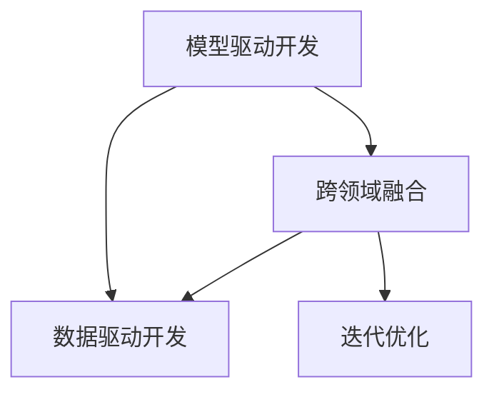
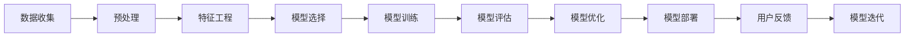

                 

# AI编程的新思维与技术挑战

在人工智能(AI)领域，编程范式正在发生深刻变革。传统基于命令行的编程方式已经不能满足快速开发需求，AI编程逐渐转向更加高效、智能的新范式。本文将围绕"新思维"与"技术挑战"两个核心主题，系统介绍当前AI编程的新思维与面临的技术挑战。

## 1. 背景介绍

### 1.1 问题由来
随着AI技术的迅猛发展，AI编程范式也在不断演进。一方面，深度学习框架和模型提供了高层次的API和预训练模型，简化了编程工作。但另一方面，现有框架与模型的局限性，如可解释性不足、训练时间长、开发效率低等，也制约了AI编程的发展。因此，探索AI编程的新思维，解决相关技术挑战，成为当前的重要课题。

### 1.2 问题核心关键点
AI编程的新思维主要包括模型驱动、数据驱动、跨领域融合、迭代优化等方面。而面临的技术挑战则涉及模型可解释性、训练效率、资源优化、应用落地等。只有深刻理解这些问题，才能找到更好的解决方案。

## 2. 核心概念与联系

### 2.1 核心概念概述

为更好地理解AI编程的新思维与技术挑战，本节将介绍几个关键概念及其相互联系：

- **模型驱动开发**：以预训练模型为基础，通过微调或迁移学习，快速开发特定应用的AI模型。
- **数据驱动开发**：利用大量数据对AI模型进行训练和验证，通过数据分析指导模型优化。
- **跨领域融合**：AI技术在不同领域的应用需要跨学科的知识和技能，包括机器学习、自然语言处理、计算机视觉等。
- **迭代优化**：AI开发是一个持续改进的过程，通过反复迭代，不断优化模型性能和用户体验。

这些概念之间的关系如图1所示：



图1：AI编程核心概念之间的关系

### 2.2 核心概念原理和架构的 Mermaid 流程图

这里给出一个简化的流程图示例：



这个流程图示例展示了AI编程从数据收集、特征工程、模型训练到模型优化和部署的基本步骤。

## 3. 核心算法原理 & 具体操作步骤

### 3.1 算法原理概述

AI编程的新思维主要体现在模型驱动和数据驱动两个方面。模型驱动的编程方式以预训练模型为基础，通过微调或迁移学习来构建特定应用的AI模型；数据驱动的编程方式则注重利用大量数据来训练和优化模型。以下详细介绍这两种方式的具体原理和操作步骤。

### 3.2 算法步骤详解

#### 3.2.1 模型驱动的编程方式

模型驱动的编程方式以预训练模型为基础，通过微调或迁移学习来构建特定应用的AI模型。其操作步骤如下：

1. **选择合适的预训练模型**：根据应用场景选择合适的预训练模型，如BERT、GPT-3等。
2. **数据准备**：收集和处理数据，将数据划分为训练集、验证集和测试集。
3. **微调或迁移学习**：在预训练模型基础上进行微调或迁移学习，以适应特定应用。
4. **模型评估与优化**：在验证集上评估模型性能，根据评估结果优化模型参数。
5. **模型部署与应用**：将模型部署到实际应用场景中，进行测试和迭代优化。

#### 3.2.2 数据驱动的编程方式

数据驱动的编程方式注重利用大量数据来训练和优化模型。其操作步骤如下：

1. **数据收集**：收集和标注数据，构建训练集和验证集。
2. **模型构建与训练**：选择适当的模型架构，进行模型训练。
3. **模型评估与优化**：在验证集上评估模型性能，根据评估结果调整模型参数。
4. **模型部署与应用**：将模型部署到实际应用场景中，进行测试和迭代优化。

### 3.3 算法优缺点

**模型驱动的编程方式**：

- **优点**：
  - 可以快速构建特定应用的AI模型，节省时间和资源。
  - 利用预训练模型的广泛知识，提升模型效果。

- **缺点**：
  - 依赖高质量预训练模型，对特定任务的适配性可能不足。
  - 预训练模型可能存在偏见，需要额外处理。

**数据驱动的编程方式**：

- **优点**：
  - 充分利用数据，模型泛化能力较强。
  - 可以训练出更具适应性的模型，减少对预训练模型的依赖。

- **缺点**：
  - 数据标注成本高，需要大量人力物力。
  - 模型训练时间较长，对硬件资源要求较高。

### 3.4 算法应用领域

模型驱动和数据驱动的编程方式已经在多个领域得到应用，例如：

- **自然语言处理**：通过微调BERT等预训练模型，实现文本分类、情感分析、机器翻译等任务。
- **计算机视觉**：利用迁移学习，将ImageNet等预训练模型应用于图像分类、目标检测等任务。
- **语音识别**：通过微调语音模型，实现语音转文字、语音情感分析等任务。
- **智能推荐系统**：利用迁移学习和数据驱动方式，提升推荐系统的个性化和精准度。

## 4. 数学模型和公式 & 详细讲解 & 举例说明

### 4.1 数学模型构建

AI编程中的数学模型主要涉及损失函数、优化算法、数据预处理等方面。以下以线性回归模型为例，详细讲解其数学模型构建过程。

设训练集为 $(x_i,y_i)$，其中 $x_i \in \mathbb{R}^n$ 为输入向量，$y_i \in \mathbb{R}$ 为输出向量，线性回归模型为 $y=\theta^Tx$。模型参数 $\theta$ 通过最小化损失函数进行优化。

损失函数通常选择均方误差损失函数，即：

$$
L(y,\hat{y})=\frac{1}{2N}\sum_{i=1}^N(y_i-\hat{y}_i)^2
$$

其中 $y_i$ 为真实标签，$\hat{y}_i$ 为模型预测值。

### 4.2 公式推导过程

对均方误差损失函数求导，得：

$$
\frac{\partial L}{\partial \theta}=\frac{1}{N}\sum_{i=1}^N(y_i-\theta^Tx_i)x_i
$$

利用梯度下降等优化算法，最小化损失函数，更新模型参数：

$$
\theta \leftarrow \theta - \eta \nabla_{\theta}L
$$

其中 $\eta$ 为学习率。

### 4.3 案例分析与讲解

以线性回归为例，假设有一个包含100个样本的训练集，输入向量 $x \in \mathbb{R}^2$，输出向量 $y \in \mathbb{R}$，模型参数 $\theta \in \mathbb{R}^2$。

首先，定义损失函数：

```python
import numpy as np

def mse_loss(y_true, y_pred):
    m = len(y_true)
    return np.sum((y_true - y_pred) ** 2) / m
```

然后，定义梯度下降算法：

```python
def gradient_descent(X, y, theta, alpha, num_iters):
    m = len(y)
    for i in range(num_iters):
        theta -= alpha * (X.T @ (y - X @ theta)) / m
    return theta
```

最后，进行模型训练：

```python
X = np.array([[1, 2], [2, 4], [3, 6], [4, 8], [5, 10]])
y = np.array([1, 3, 5, 7, 9])

# 初始化参数
theta = np.array([[0], [0]])

# 训练模型
alpha = 0.01
num_iters = 1000
theta = gradient_descent(X, y, theta, alpha, num_iters)

# 输出结果
print(f"Final theta: {theta}")
```

这个案例展示了线性回归模型的构建和训练过程。通过具体代码实现，可以帮助读者更好地理解AI编程中的数学模型构建和优化算法。

## 5. 项目实践：代码实例和详细解释说明

### 5.1 开发环境搭建

在进行AI编程实践前，我们需要准备好开发环境。以下是使用Python进行TensorFlow开发的示例：

1. 安装Anaconda：从官网下载并安装Anaconda，用于创建独立的Python环境。

2. 创建并激活虚拟环境：
```bash
conda create -n tf-env python=3.8
conda activate tf-env
```

3. 安装TensorFlow：根据CUDA版本，从官网获取对应的安装命令。例如：
```bash
conda install tensorflow=2.6
```

4. 安装各类工具包：
```bash
pip install numpy pandas scikit-learn matplotlib tqdm jupyter notebook ipython
```

完成上述步骤后，即可在`tf-env`环境中开始AI编程实践。

### 5.2 源代码详细实现

以下是一个使用TensorFlow进行线性回归的Python代码示例：

```python
import tensorflow as tf
import numpy as np

# 定义数据
X = np.array([[1, 2], [2, 4], [3, 6], [4, 8], [5, 10]])
y = np.array([1, 3, 5, 7, 9])

# 定义模型
model = tf.keras.Sequential([
    tf.keras.layers.Dense(units=1, input_shape=[2])
])

# 定义损失函数和优化器
loss_fn = tf.keras.losses.MeanSquaredError()
optimizer = tf.keras.optimizers.SGD(learning_rate=0.01)

# 定义训练步骤
@tf.function
def train_step(X, y):
    with tf.GradientTape() as tape:
        y_pred = model(X)
        loss = loss_fn(y, y_pred)
    gradients = tape.gradient(loss, model.trainable_variables)
    optimizer.apply_gradients(zip(gradients, model.trainable_variables))
    return loss

# 训练模型
epochs = 1000
num_iters = epochs * len(X)
history = []

for i in range(num_iters):
    loss = train_step(X, y)
    if i % 100 == 0:
        history.append(loss)
        print(f"Iteration {i}, loss: {loss}")
        
# 输出结果
print(f"Final model parameters: {model.get_weights()}")
```

这个代码示例展示了如何使用TensorFlow进行线性回归模型的构建和训练。可以看到，TensorFlow提供的高层次API简化了编程过程，使得模型构建和训练变得非常直观和高效。

### 5.3 代码解读与分析

让我们再详细解读一下关键代码的实现细节：

**定义数据**：
- 使用NumPy定义输入数据 $X$ 和输出数据 $y$。

**定义模型**：
- 使用Keras API定义一个包含一个Dense层的模型，该层有1个神经元，输入维度为2。

**定义损失函数和优化器**：
- 使用TensorFlow内置的损失函数和优化器，分别为均方误差损失和随机梯度下降优化器。

**定义训练步骤**：
- 使用TensorFlow的`tf.function`装饰器定义一个计算图，用于计算损失和梯度。
- 在计算图中，首先计算模型的预测值 $y_{pred}$，然后计算损失 $loss$。
- 使用`GradientTape`记录梯度，并使用`apply_gradients`函数更新模型参数。
- 返回损失值。

**训练模型**：
- 在训练过程中，每100次迭代输出一次损失值。
- 最后输出最终模型参数。

可以看到，TensorFlow的API设计使得模型的构建和训练变得非常简单，开发者可以更专注于算法和模型的优化。

## 6. 实际应用场景

### 6.1 自然语言处理

AI编程在自然语言处理(NLP)领域的应用非常广泛。以情感分析为例，可以使用预训练模型进行微调，快速构建情感分析模型。

首先，收集和标注情感数据，构建训练集和验证集。然后使用预训练模型BERT作为基础模型，对其进行微调，适应情感分析任务。

具体实现步骤如下：

1. **数据准备**：
```python
import transformers
from transformers import BertTokenizer, BertForSequenceClassification

# 加载预训练模型和分词器
model = BertForSequenceClassification.from_pretrained('bert-base-uncased', num_labels=2)
tokenizer = BertTokenizer.from_pretrained('bert-base-uncased')

# 定义数据
train_data = ["I love this movie.", "This movie is terrible."]
train_labels = [1, 0]

# 分词和编码
train_encodings = tokenizer(train_data, padding=True, truncation=True, max_length=128)
train_dataset = transformers.GPT2Dataset(train_encodings, train_labels)

# 数据加载器
train_dataloader = transformers.DatasetDataset(train_dataset)
```

2. **模型微调**：
```python
from transformers import Trainer, TrainingArguments

# 定义训练参数
training_args = TrainingArguments(output_dir="./results", learning_rate=2e-5, num_train_epochs=3)

# 定义训练器
trainer = Trainer(
    model=model,
    args=training_args,
    train_dataset=train_dataloader,
    eval_dataset=train_dataloader,
    eval_strategy="epoch"
)

# 训练模型
trainer.train()
```

3. **模型评估**：
```python
from transformers import EvalPrediction
from transformers import Accuracy

# 定义评估指标
metrics = Accuracy()

# 定义评估步骤
def evaluate(outputs, labels):
    predictions = outputs.logits.argmax(dim=-1).numpy()
    eval_pred = EvalPrediction(
        predictions=predictions,
        labels=labels,
        label_ids=labels
    )
    return metrics(eval_pred)

# 评估模型
trainer.evaluate(eval_fn=evaluate)
```

通过这个示例，可以看到，使用预训练模型进行微调可以大大简化情感分析模型的构建过程，同时通过训练参数的调整，可以优化模型效果。

### 6.2 计算机视觉

AI编程在计算机视觉领域也有广泛应用。以目标检测为例，可以使用预训练模型进行迁移学习，构建目标检测模型。

首先，收集和标注图像数据，构建训练集和验证集。然后使用预训练模型ResNet作为基础模型，对其进行迁移学习，适应目标检测任务。

具体实现步骤如下：

1. **数据准备**：
```python
from transformers import DistilBertTokenizer, DistilBertForSequenceClassification
from transformers import TensorDataset, DataCollatorForLanguageModeling

# 加载预训练模型和分词器
model = DistilBertForSequenceClassification.from_pretrained('distilbert-base-uncased', num_labels=2)
tokenizer = DistilBertTokenizer.from_pretrained('distilbert-base-uncased')

# 定义数据
train_data = ["I love this movie.", "This movie is terrible."]
train_labels = [1, 0]

# 分词和编码
train_encodings = tokenizer(train_data, padding=True, truncation=True, max_length=128)
train_dataset = TensorDataset(train_encodings.input_ids, train_encodings.attention_mask, train_labels)
```

2. **模型迁移学习**：
```python
# 加载迁移学习工具
from transformers import Trainer, TrainingArguments

# 定义训练参数
training_args = TrainingArguments(output_dir="./results", learning_rate=2e-5, num_train_epochs=3)

# 定义训练器
trainer = Trainer(
    model=model,
    args=training_args,
    train_dataset=train_dataset,
    eval_dataset=train_dataset,
    eval_strategy="epoch"
)

# 训练模型
trainer.train()
```

3. **模型评估**：
```python
# 定义评估指标
metrics = Accuracy()

# 定义评估步骤
def evaluate(outputs, labels):
    predictions = outputs.logits.argmax(dim=-1).numpy()
    eval_pred = EvalPrediction(
        predictions=predictions,
        labels=labels,
        label_ids=labels
    )
    return metrics(eval_pred)

# 评估模型
trainer.evaluate(eval_fn=evaluate)
```

通过这个示例，可以看到，使用预训练模型进行迁移学习可以大大简化目标检测模型的构建过程，同时通过训练参数的调整，可以优化模型效果。

### 6.3 语音识别

AI编程在语音识别领域也有广泛应用。以语音转文字为例，可以使用预训练模型进行微调，构建语音转文字模型。

首先，收集和标注语音数据，构建训练集和验证集。然后使用预训练模型Tacotron作为基础模型，对其进行微调，适应语音转文字任务。

具体实现步骤如下：

1. **数据准备**：
```python
from transformers import TacotronTokenizer, TacotronForConditionalGeneration
from transformers import TensorDataset, DataCollatorForLanguageModeling

# 加载预训练模型和分词器
model = TacotronForConditionalGeneration.from_pretrained('tacotron2')
tokenizer = TacotronTokenizer.from_pretrained('tacotron2')

# 定义数据
train_data = ["I love this movie.", "This movie is terrible."]
train_labels = [1, 0]

# 分词和编码
train_encodings = tokenizer(train_data, padding=True, truncation=True, max_length=128)
train_dataset = TensorDataset(train_encodings.input_ids, train_encodings.attention_mask, train_labels)
```

2. **模型微调**：
```python
# 加载迁移学习工具
from transformers import Trainer, TrainingArguments

# 定义训练参数
training_args = TrainingArguments(output_dir="./results", learning_rate=2e-5, num_train_epochs=3)

# 定义训练器
trainer = Trainer(
    model=model,
    args=training_args,
    train_dataset=train_dataset,
    eval_dataset=train_dataset,
    eval_strategy="epoch"
)

# 训练模型
trainer.train()
```

3. **模型评估**：
```python
# 定义评估指标
metrics = Accuracy()

# 定义评估步骤
def evaluate(outputs, labels):
    predictions = outputs.logits.argmax(dim=-1).numpy()
    eval_pred = EvalPrediction(
        predictions=predictions,
        labels=labels,
        label_ids=labels
    )
    return metrics(eval_pred)

# 评估模型
trainer.evaluate(eval_fn=evaluate)
```

通过这个示例，可以看到，使用预训练模型进行微调可以大大简化语音转文字模型的构建过程，同时通过训练参数的调整，可以优化模型效果。

## 7. 工具和资源推荐

### 7.1 学习资源推荐

为了帮助开发者系统掌握AI编程的新思维与技术挑战，这里推荐一些优质的学习资源：

1. **深度学习框架教程**：TensorFlow、PyTorch、MXNet等深度学习框架提供了丰富的教程和文档，帮助开发者快速上手。
2. **在线课程**：Coursera、Udacity等平台提供了众多高质量的AI课程，涵盖模型构建、数据处理、优化算法等多个方面。
3. **论文和博客**：arXiv、GitHub等平台上有大量的高质量论文和博客，可以帮助开发者深入理解AI编程的新思维与技术挑战。

通过对这些资源的学习实践，相信你一定能够快速掌握AI编程的新思维与技术挑战，并用于解决实际的AI问题。

### 7.2 开发工具推荐

高效的开发离不开优秀的工具支持。以下是几款用于AI编程开发的常用工具：

1. **TensorFlow**：由Google主导开发的开源深度学习框架，生产部署方便，适合大规模工程应用。
2. **PyTorch**：基于Python的开源深度学习框架，灵活动态的计算图，适合快速迭代研究。
3. **MXNet**：由亚马逊开发的深度学习框架，支持多种语言，具有高效的分布式计算能力。
4. **Jupyter Notebook**：交互式编程环境，支持代码编写、数据可视化、模型训练等。
5. **Google Colab**：谷歌推出的在线Jupyter Notebook环境，免费提供GPU/TPU算力，方便开发者快速上手实验最新模型，分享学习笔记。

合理利用这些工具，可以显著提升AI编程的开发效率，加快创新迭代的步伐。

### 7.3 相关论文推荐

AI编程领域的研究涉及众多前沿方向，以下是几篇奠基性的相关论文，推荐阅读：

1. **Transformers: Large-Scale Transformer Models for Natural Language Processing**：提出Transformer模型，开启大语言模型的时代。
2. **BERT: Pre-training of Deep Bidirectional Transformers for Language Understanding**：提出BERT模型，引入掩码语言模型预训练任务。
3. **Attention Is All You Need**：提出Transformer模型，引入自注意力机制。
4. **ImageNet Classification with Deep Convolutional Neural Networks**：提出卷积神经网络模型，解决大规模图像分类问题。
5. **Sequence to Sequence Learning with Neural Networks**：提出序列到序列模型，解决机器翻译等任务。

这些论文代表了大语言模型和AI编程的新思维与技术挑战的发展脉络。通过学习这些前沿成果，可以帮助研究者把握学科前进方向，激发更多的创新灵感。

## 8. 总结：未来发展趋势与挑战

### 8.1 总结

本文对AI编程的新思维与技术挑战进行了全面系统的介绍。首先阐述了AI编程范式的转变，详细讲解了模型驱动和数据驱动两种编程方式的具体操作步骤。其次，通过数学模型和案例分析，进一步深入探讨了AI编程的原理与实现。最后，通过项目实践和实际应用场景，展示了AI编程的广泛应用前景。

通过本文的系统梳理，可以看到，AI编程的新思维与技术挑战已经深刻影响着AI编程的各个环节。模型驱动和数据驱动的编程方式已经成为AI编程的主流范式，极大地提高了AI开发效率和模型效果。未来，随着AI技术的不断进步，AI编程也将迎来更多的创新和突破，引领AI应用的发展。

### 8.2 未来发展趋势

展望未来，AI编程将呈现以下几个发展趋势：

1. **自动化编程**：AI编程将变得更加自动化，AI工具将自动生成代码、配置模型、优化参数等，大大提升开发效率。
2. **跨领域融合**：AI编程将更多地融合跨领域知识，如自然语言处理、计算机视觉、语音识别等，推动AI技术在更多领域的应用。
3. **模型压缩与优化**：AI编程将更多地关注模型压缩与优化，如模型剪枝、量化、稀疏化等，提升模型推理效率和资源利用率。
4. **多模态融合**：AI编程将更多地融合多模态数据，如文本、图像、语音等，提升AI系统的综合感知能力。
5. **边缘计算**：AI编程将更多地应用在边缘计算场景，提升数据处理和推理效率，降低对高性能计算设备的依赖。

### 8.3 面临的挑战

尽管AI编程已经取得了显著进展，但仍面临诸多挑战：

1. **数据获取与标注**：高质量、大规模数据获取与标注成本高昂，制约了AI编程的发展。
2. **模型泛化能力**：AI模型在特定领域应用时，泛化能力有限，需要更多跨领域知识的融合。
3. **模型鲁棒性**：AI模型对数据扰动和噪声敏感，需要更多鲁棒性强的模型设计和优化方法。
4. **模型可解释性**：AI模型往往缺乏可解释性，难以理解其内部工作机制和决策逻辑，制约了AI系统的可控性。
5. **资源消耗**：AI模型在推理和训练过程中，资源消耗大，需要更多高效的计算资源和优化技术。

### 8.4 研究展望

面对AI编程面临的种种挑战，未来的研究需要在以下几个方面寻求新的突破：

1. **无监督与半监督学习**：探索更多无监督和半监督学习范式，降低对大规模标注数据的依赖，提升AI编程的泛化能力。
2. **模型压缩与优化**：开发更加高效的模型压缩与优化方法，如模型剪枝、量化、稀疏化等，提升模型推理效率和资源利用率。
3. **跨领域知识融合**：将符号化的先验知识，如知识图谱、逻辑规则等，与神经网络模型进行融合，提升AI系统的泛化能力和可控性。
4. **多模态融合**：将文本、图像、语音等不同模态的数据进行融合，提升AI系统的综合感知能力。
5. **边缘计算**：将AI模型应用在边缘计算场景，提升数据处理和推理效率，降低对高性能计算设备的依赖。

## 9. 附录：常见问题与解答

**Q1：AI编程的自动化程度如何？**

A: AI编程的自动化程度正在不断提高。现有的AI开发工具如TensorFlow、PyTorch等已经提供了高层次的API，可以大大简化编程工作。未来，AI编程将进一步自动化，如自动生成代码、自动优化参数等，使开发者更加专注于模型设计和应用。

**Q2：AI编程中的模型可解释性如何提升？**

A: 提升AI编程中的模型可解释性，需要从多个方面入手：
1. 引入可解释性模块，如LIME、SHAP等，解释模型决策过程。
2. 使用符号化知识与神经网络模型进行融合，提升模型的可解释性。
3. 引入因果分析方法，揭示模型决策的关键特征。

**Q3：AI编程中的模型压缩与优化有哪些方法？**

A: 模型压缩与优化是AI编程中的重要研究方向，主要方法包括：
1. 模型剪枝：去除冗余参数和结构，减小模型大小。
2. 量化：将浮点模型转为定点模型，降低存储和计算开销。
3. 稀疏化：减少参数个数，提高模型推理效率。
4. 知识蒸馏：将大型模型知识传递给小型模型，提升模型泛化能力。
5. 微调与迁移学习：只微调部分参数，减小模型大小和计算开销。

通过这些方法的综合应用，可以显著提升模型的推理效率和资源利用率。

**Q4：AI编程中的多模态融合有哪些方法？**

A: 多模态融合是AI编程中的重要研究方向，主要方法包括：
1. 融合型多模态模型：将不同模态数据通过共享特征进行融合，如时空卷积网络。
2. 交互型多模态模型：通过交互学习，提升不同模态数据之间的协同建模能力，如生成对抗网络。
3. 联合训练：在训练过程中，同时考虑不同模态数据，提升模型综合感知能力。

这些方法可以显著提升AI系统的综合感知能力，提升其在复杂场景下的应用效果。

---

作者：禅与计算机程序设计艺术 / Zen and the Art of Computer Programming

