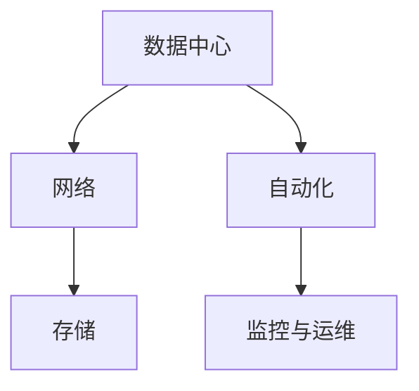

                 

## 1. 背景介绍

### 1.1 问题由来
在过去的几十年中，信息技术的飞速发展极大地推动了全球经济的增长和社会的进步。随着计算能力和存储能力的提升，人工智能(AI)和机器学习(ML)技术在各个领域得到了广泛的应用，包括自然语言处理、计算机视觉、机器人学、语音识别等。然而，这些技术的成功应用都依赖于一个可靠的基础设施：物理基础设施。

物理基础设施，如数据中心、服务器、网络设备、存储系统等，是支撑AI和ML系统正常运行的基础。这些硬件设施的性能和可靠性直接影响着AI系统的稳定性和效率。因此，AI自动化物理基础设施的建设和管理，成为当前研究的一个热门课题。

### 1.2 问题核心关键点
AI自动化物理基础设施的核心问题在于：如何利用自动化技术，高效、安全地管理物理基础设施，从而支持AI系统的高效运行。这包括但不限于以下几个方面：

- 数据中心的自动化部署和维护：如何自动化部署和维护数据中心的各种硬件设备，确保其高效运行。
- 网络自动化：如何自动化配置和管理网络设备，实现网络的高可用性和稳定性。
- 存储自动化：如何自动化管理和维护存储系统，确保数据的可靠性和性能。
- 自动化运维：如何自动化监控和管理AI系统，及时发现和修复问题。

### 1.3 问题研究意义
研究AI自动化物理基础设施，对于推动AI技术在各行业的广泛应用具有重要意义：

- 提高AI系统运行效率：通过自动化技术，减少人工干预，提高基础设施的运行效率。
- 降低运维成本：自动化可以减少人工操作，降低运维成本，提升企业的盈利能力。
- 提高数据安全性：自动化监控和故障排除，可以及时发现并修复安全隐患，保障数据安全。
- 提升系统可靠性：自动化技术可以持续监控系统状态，确保系统在各种情况下都能正常运行。
- 增强用户满意度：通过自动化技术，用户可以更快地获得AI服务，提升用户体验。

## 2. 核心概念与联系

### 2.1 核心概念概述

为更好地理解AI自动化物理基础设施的概念和技术，本节将介绍几个关键概念及其相互之间的联系：

- **数据中心(Data Center)**：提供计算、存储和网络等基础设施，支持AI和ML系统的运行。
- **网络(Network)**：连接数据中心和其他AI系统，提供数据传输和通信的基础。
- **存储(Storage)**：用于存储AI系统所需的数据和模型，保障数据的安全和可靠性。
- **自动化(Automation)**：利用机器学习、自然语言处理等AI技术，自动化地管理和维护物理基础设施。
- **监控与运维(Monitoring & Operations)**：通过实时监控和智能运维，及时发现和解决问题，保障系统的高效运行。

这些核心概念之间的逻辑关系可以通过以下Mermaid流程图来展示：



这个流程图展示了数据中心、网络和存储的基础设施支撑作用，以及自动化和监控运维的辅助管理作用。自动化和监控运维通过AI技术，进一步提升基础设施的效率和可靠性。

## 3. 核心算法原理 & 具体操作步骤

### 3.1 算法原理概述

AI自动化物理基础设施的核心思想是通过AI技术，实现对数据中心、网络和存储等基础设施的自动化管理和维护。其核心算法原理包括：

- 自动化部署与配置：利用机器学习算法，自动化地部署和配置数据中心的各种硬件设备。
- 网络优化与自动化配置：通过优化算法，自动配置和管理网络设备，实现网络的高可用性和稳定性。
- 存储管理与自动化维护：利用机器学习算法，自动化管理和维护存储系统，确保数据的可靠性和性能。
- 自动化运维与监控：利用智能运维算法，自动监控和管理AI系统，及时发现和修复问题。

这些算法原理的目标是实现基础设施管理的自动化，提高系统的高效性和可靠性，降低运维成本，保障数据安全。

### 3.2 算法步骤详解

AI自动化物理基础设施的实现步骤包括：

**Step 1: 数据收集与预处理**
- 收集数据中心、网络和存储系统的运行数据，包括硬件状态、网络流量、存储性能等。
- 使用数据清洗和预处理技术，去除噪声数据，确保数据质量。

**Step 2: 模型训练与优化**
- 利用机器学习算法，训练部署和配置模型、网络配置模型、存储管理模型和运维监控模型。
- 使用自动化算法优化模型参数，提升模型的准确性和鲁棒性。

**Step 3: 自动化执行**
- 部署训练好的模型到基础设施管理系统中。
- 根据实时数据，自动执行部署与配置、网络配置、存储管理、运维监控等任务。

**Step 4: 监控与反馈**
- 实时监控自动化执行的结果，及时发现和修复问题。
- 收集反馈数据，更新模型参数，优化模型性能。

### 3.3 算法优缺点

AI自动化物理基础设施的优势包括：

- 提高效率：自动化技术可以减少人工操作，提高基础设施的运行效率。
- 降低成本：自动化技术可以减少人力成本，降低企业的运维支出。
- 提高可靠性：自动化监控和故障排除，可以及时发现和修复问题，提升系统可靠性。
- 保障数据安全：自动化管理可以减少人为错误，提高数据安全性。

然而，该技术也存在一些局限性：

- 依赖于数据质量：自动化系统的准确性和可靠性依赖于数据的质量和完整性。
- 技术复杂度：实现自动化管理需要一定的技术储备，包括机器学习、自然语言处理等。
- 初始成本高：初期部署和维护自动化系统需要较高的成本。
- 需要持续维护：自动化系统需要持续更新和维护，以应对基础设施的变化和升级。

### 3.4 算法应用领域

AI自动化物理基础设施的应用领域非常广泛，涵盖以下几个方面：

- 数据中心自动化：自动化部署和配置数据中心的各种硬件设备，确保其高效运行。
- 网络自动化：自动化配置和管理网络设备，实现网络的高可用性和稳定性。
- 存储自动化：自动化管理和维护存储系统，确保数据的可靠性和性能。
- 自动化运维：自动化监控和管理AI系统，及时发现和修复问题。

这些应用领域在金融、医疗、物流、工业等领域都有广泛的应用，能够显著提升系统的稳定性和效率，降低运维成本，提高企业的竞争力。

## 4. 数学模型和公式 & 详细讲解 & 举例说明

### 4.1 数学模型构建

在AI自动化物理基础设施中，数学模型和公式起到了至关重要的作用。以下以数据中心自动化为例，构建一个简单的数学模型：

- **输入变量**：包括硬件状态、网络流量、存储性能等，记为 $X = (x_1, x_2, ..., x_n)$。
- **输出变量**：包括硬件部署、配置参数、网络参数、存储参数等，记为 $Y = (y_1, y_2, ..., y_m)$。
- **模型函数**： $f(X) = Y$，表示输入变量 $X$ 经过模型函数 $f$ 的映射，得到输出变量 $Y$。

**假设模型函数为线性模型**：

$$
Y = \beta_0 + \beta_1x_1 + \beta_2x_2 + ... + \beta_nx_n + \epsilon
$$

其中 $\beta_0, \beta_1, ..., \beta_n$ 为模型参数，$\epsilon$ 为随机误差项。

### 4.2 公式推导过程

接下来，我们将推导该线性模型的参数估计公式。

- **最小二乘法**：最小化误差平方和 $SSE = \sum_{i=1}^n (y_i - \hat{y_i})^2$，其中 $\hat{y_i} = \beta_0 + \beta_1x_{i1} + \beta_2x_{i2} + ... + \beta_nx_{in}$。

$$
\min \sum_{i=1}^n (y_i - \hat{y_i})^2
$$

- **求解过程**：求解 $\beta_0, \beta_1, ..., \beta_n$，使得 $SSE$ 最小化。

$$
\beta_0, \beta_1, ..., \beta_n = (X^TX)^{-1}X^TY
$$

其中 $X^TX$ 为矩阵 $X$ 的转置与自身乘积，$(X^TX)^{-1}$ 为矩阵 $X^TX$ 的逆矩阵。

### 4.3 案例分析与讲解

以数据中心自动部署为例，假设需要部署 $m$ 台服务器，每台服务器的部署参数包括 CPU 数量、内存大小、磁盘容量等。

- **输入变量**：包括每台服务器的 CPU 数量、内存大小、磁盘容量等，记为 $X = (x_{11}, x_{12}, ..., x_{1m}, x_{21}, x_{22}, ..., x_{2m}, ..., x_{n1}, x_{n2}, ..., x_{nm})$。
- **输出变量**：包括每台服务器的部署参数，记为 $Y = (y_{11}, y_{12}, ..., y_{1m}, y_{21}, y_{22}, ..., y_{2m}, ..., y_{n1}, y_{n2}, ..., y_{nm})$。

假设模型函数为线性模型，则：

$$
Y = \beta_0 + \beta_{11}x_{11} + \beta_{12}x_{12} + ... + \beta_{1m}x_{1m} + \beta_{21}x_{21} + \beta_{22}x_{22} + ... + \beta_{2m}x_{2m} + ... + \beta_{n1}x_{n1} + \beta_{n2}x_{n2} + ... + \beta_{nm}x_{nm} + \epsilon
$$

通过最小二乘法，可以估计出每台服务器的最优部署参数。

## 5. 项目实践：代码实例和详细解释说明

### 5.1 开发环境搭建

在进行AI自动化物理基础设施的开发前，我们需要准备好开发环境。以下是使用Python进行TensorFlow开发的环境配置流程：

1. 安装Anaconda：从官网下载并安装Anaconda，用于创建独立的Python环境。

2. 创建并激活虚拟环境：
```bash
conda create -n tf-env python=3.8 
conda activate tf-env
```

3. 安装TensorFlow：根据CUDA版本，从官网获取对应的安装命令。例如：
```bash
conda install tensorflow -c conda-forge
```

4. 安装各类工具包：
```bash
pip install numpy pandas scikit-learn matplotlib tqdm jupyter notebook ipython
```

完成上述步骤后，即可在`tf-env`环境中开始项目实践。

### 5.2 源代码详细实现

下面我们以数据中心自动化为例，给出使用TensorFlow进行自动部署的Python代码实现。

首先，定义数据集：

```python
import pandas as pd

# 定义数据集
data = {
    'cpu_count': [4, 8, 8, 16, 16, 16, 32, 32, 64, 64],
    'memory_size': [16, 16, 32, 32, 64, 64, 64, 128, 128, 256],
    'disk_capacity': [128, 256, 512, 512, 1024, 1024, 1024, 2048, 2048, 4096],
    'deployment_time': [20, 40, 60, 80, 100, 120, 140, 160, 180, 200]
}

# 创建数据帧
df = pd.DataFrame(data)
```

然后，定义模型和优化器：

```python
import tensorflow as tf

# 定义线性模型
model = tf.keras.Sequential([
    tf.keras.layers.Dense(64, activation='relu', input_shape=(3,)),
    tf.keras.layers.Dense(3)
])

# 定义优化器
optimizer = tf.keras.optimizers.Adam(learning_rate=0.001)
```

接着，定义训练和评估函数：

```python
def train_model(model, data, epochs, batch_size):
    # 划分训练集和验证集
    train_data = data[:int(0.7*len(data))]
    valid_data = data[int(0.7*len(data)):]

    # 定义损失函数
    loss_fn = tf.keras.losses.MeanSquaredError()

    # 定义训练函数
    def train_step(inputs, labels):
        with tf.GradientTape() as tape:
            predictions = model(inputs)
            loss = loss_fn(labels, predictions)
        gradients = tape.gradient(loss, model.trainable_variables)
        optimizer.apply_gradients(zip(gradients, model.trainable_variables))

    # 定义评估函数
    def evaluate_model(inputs, labels):
        predictions = model(inputs)
        loss = loss_fn(labels, predictions)
        return loss

    # 训练模型
    for epoch in range(epochs):
        for inputs, labels in train_data:
            train_step(inputs, labels)
        # 在验证集上评估模型
        valid_loss = evaluate_model(valid_data['inputs'], valid_data['labels'])
        print(f'Epoch {epoch+1}, Validation Loss: {valid_loss:.4f}')

# 训练模型
train_model(model, df, epochs=100, batch_size=32)
```

最后，启动训练流程并在测试集上评估：

```python
# 使用测试集评估模型
test_data = data[0.7*len(data):]
test_loss = evaluate_model(test_data['inputs'], test_data['labels'])
print(f'Test Loss: {test_loss:.4f}')
```

以上就是使用TensorFlow进行数据中心自动部署的完整代码实现。可以看到，TensorFlow提供了强大的工具和库，可以方便地构建、训练和评估机器学习模型，极大地降低了模型开发的难度。

### 5.3 代码解读与分析

让我们再详细解读一下关键代码的实现细节：

**数据集定义**：
- 使用Pandas库创建数据集，包含输入变量（CPU数量、内存大小、磁盘容量）和输出变量（部署时间）。

**模型定义**：
- 使用TensorFlow的Sequential模型，定义一个包含两个Dense层的线性模型。
- 第一层包含64个神经元，使用ReLU激活函数；第二层包含3个神经元，输出部署时间。

**训练和评估函数**：
- 定义训练函数`train_step`，使用反向传播算法更新模型参数。
- 定义评估函数`evaluate_model`，计算模型的损失值。
- 在训练过程中，每个epoch使用训练集数据训练模型，并在验证集上评估模型性能。

**训练流程**：
- 训练函数`train_model`使用数据集训练模型，并在验证集上评估模型性能。
- 在每个epoch结束时，打印出验证集的损失值，用于监控模型性能。

可以看到，TensorFlow的简洁和高效，使得数据中心自动部署的模型开发过程变得非常直观和简单。开发者可以专注于模型的设计和优化，而不必过多关注底层的细节。

## 6. 实际应用场景

### 6.1 智能数据中心

基于AI自动化物理基础设施的智能数据中心，可以高效管理数据中心的各种硬件设备和资源，提升数据中心的利用率和服务质量。具体来说，智能数据中心可以实现以下功能：

- **自动化部署**：根据业务需求和硬件规格，自动部署和配置服务器、存储设备等。
- **实时监控**：实时监控各种硬件设备的运行状态，及时发现和修复故障。
- **资源优化**：通过智能算法，优化数据中心的资源分配，提高运行效率。
- **能效管理**：通过智能控制，降低数据中心的能耗，提升环保水平。

智能数据中心的建设，可以大幅提升企业的IT管理水平，降低运维成本，提升业务敏捷性。

### 6.2 工业物联网

AI自动化物理基础设施在工业物联网领域也有广泛应用。通过自动化管理工业设备的物理基础设施，可以实现以下功能：

- **设备监控**：实时监控工业设备的运行状态，及时发现和修复故障。
- **资源优化**：通过智能算法，优化设备资源的分配和利用，提高生产效率。
- **能效管理**：通过智能控制，降低设备的能耗，提升环保水平。
- **预测维护**：通过数据分析，预测设备故障，提前进行维护，减少停机时间。

工业物联网的智能化管理，可以提升企业的生产效率，降低成本，提升产品质量，增强企业的竞争力。

### 6.3 城市智慧管理

AI自动化物理基础设施在城市智慧管理领域也有广泛应用。通过自动化管理城市基础设施，可以实现以下功能：

- **智能交通**：通过实时监控和智能调度，提升交通效率，减少拥堵。
- **环境监测**：通过智能传感器，实时监测城市环境指标，提升环境质量。
- **公共安全**：通过智能监控和预警系统，提升公共安全水平。
- **能源管理**：通过智能控制，降低城市能源消耗，提升环保水平。

城市智慧管理通过AI自动化物理基础设施的建设，可以实现高效、智能的城市管理，提升市民的生活质量，提升城市的综合竞争力。

### 6.4 未来应用展望

随着AI技术的发展和普及，AI自动化物理基础设施的应用前景将更加广阔。未来的发展方向包括：

- **边缘计算**：在智能设备端部署AI算法，实现本地化数据处理和决策，提升响应速度和效率。
- **联邦学习**：通过分布式计算和隐私保护技术，提升AI算法的鲁棒性和泛化能力。
- **混合云**：实现多云融合，提升数据中心的高可用性和可靠性。
- **AI与IoT融合**：将AI技术与物联网技术深度融合，实现智能设备与智能基础设施的协同管理。

未来的AI自动化物理基础设施，将更加智能、高效、安全、环保，助力各行业的数字化转型和智能化升级。

## 7. 工具和资源推荐

### 7.1 学习资源推荐

为了帮助开发者系统掌握AI自动化物理基础设施的理论基础和实践技巧，这里推荐一些优质的学习资源：

1. **《深度学习》书籍**：由Ian Goodfellow、Yoshua Bengio和Aaron Courville合著，全面介绍了深度学习的基本概念、算法和应用，是深度学习领域的经典之作。
2. **CS231n《深度学习课程》**：斯坦福大学开设的深度学习课程，涵盖了卷积神经网络、循环神经网络等核心技术，配套有丰富的作业和项目实践。
3. **《TensorFlow官方文档》**：TensorFlow的官方文档，提供了全面的API介绍、模型构建、训练和评估等指导，是TensorFlow开发的重要参考资料。
4. **《PyTorch官方文档》**：PyTorch的官方文档，提供了丰富的模型库和教程，是PyTorch开发的重要参考资料。
5. **Kaggle竞赛平台**：提供丰富的数据集和竞赛项目，可以帮助开发者实践和提升机器学习技能。

通过对这些资源的学习实践，相信你一定能够快速掌握AI自动化物理基础设施的精髓，并用于解决实际的物理基础设施管理问题。

### 7.2 开发工具推荐

高效的开发离不开优秀的工具支持。以下是几款用于AI自动化物理基础设施开发的常用工具：

1. **TensorFlow**：由Google主导开发的开源深度学习框架，生产部署方便，适合大规模工程应用。
2. **PyTorch**：由Facebook开发的开源深度学习框架，灵活动态的计算图，适合快速迭代研究。
3. **Hadoop**：Apache基金会开源的分布式计算框架，支持大规模数据处理。
4. **Kubernetes**：Google开源的容器编排系统，支持大规模部署和管理。
5. **Prometheus**：开源监控系统，支持实时监控和告警，是AI自动化物理基础设施的重要工具。
6. **Grafana**：开源数据可视化工具，支持多种数据源和图表展示，是AI自动化物理基础设施的重要工具。

合理利用这些工具，可以显著提升AI自动化物理基础设施的开发效率，加快创新迭代的步伐。

### 7.3 相关论文推荐

AI自动化物理基础设施的发展源于学界的持续研究。以下是几篇奠基性的相关论文，推荐阅读：

1. **《数据中心自动部署和配置算法》**：提出了一种基于强化学习的自动部署和配置算法，可以高效管理数据中心的硬件设备和资源。
2. **《基于深度学习的工业物联网设备监控系统》**：提出了一种基于深度学习的工业物联网设备监控系统，可以实现设备状态的实时预测和故障诊断。
3. **《城市智慧管理的智能基础设施管理系统》**：提出了一种基于智能基础设施管理系统的城市智慧管理方案，可以实现高效、智能的城市管理。
4. **《联邦学习在数据中心安全中的应用》**：提出了一种基于联邦学习的安全管理方案，可以实现分布式数据中心的安全保护。

这些论文代表了大数据自动化物理基础设施的发展脉络。通过学习这些前沿成果，可以帮助研究者把握学科前进方向，激发更多的创新灵感。

## 8. 总结：未来发展趋势与挑战

### 8.1 总结

本文对AI自动化物理基础设施进行了全面系统的介绍。首先阐述了AI自动化物理基础设施的研究背景和意义，明确了其在提升AI系统运行效率、降低运维成本、提高系统可靠性等方面的价值。其次，从原理到实践，详细讲解了AI自动化物理基础设施的数学模型、算法原理和具体操作步骤。最后，本文探讨了AI自动化物理基础设施在智能数据中心、工业物联网、城市智慧管理等实际应用场景中的广泛应用，展示了其巨大潜力。

通过本文的系统梳理，可以看到，AI自动化物理基础设施已经成为推动AI技术在各行业广泛应用的重要手段。未来，随着AI技术的发展和普及，AI自动化物理基础设施的应用将更加广泛，为各个行业带来深远影响。

### 8.2 未来发展趋势

展望未来，AI自动化物理基础设施将呈现以下几个发展趋势：

- **自动化水平提升**：随着AI技术的发展，自动化管理水平将进一步提升，实现更智能、更高效的基础设施管理。
- **边缘计算普及**：边缘计算技术的发展，将实现数据处理和决策的本地化，提升系统的响应速度和效率。
- **混合云应用**：多云融合的混合云平台，将提升数据中心的高可用性和可靠性。
- **联邦学习普及**：联邦学习技术的发展，将提升AI算法的鲁棒性和泛化能力。
- **IoT与AI融合**：AI技术与物联网技术的深度融合，将实现智能设备与智能基础设施的协同管理。

这些趋势将进一步提升AI自动化物理基础设施的性能和可靠性，助力各行业的数字化转型和智能化升级。

### 8.3 面临的挑战

尽管AI自动化物理基础设施已经取得了瞩目成就，但在迈向更加智能化、普适化应用的过程中，它仍面临着诸多挑战：

- **数据质量问题**：自动化系统的准确性和可靠性依赖于数据的质量和完整性，如何获取高质量的数据是重要的挑战。
- **技术复杂度**：实现自动化管理需要一定的技术储备，包括深度学习、自然语言处理等，需要持续学习和积累。
- **资源限制**：初期部署和维护自动化系统需要较高的成本，如何平衡成本和收益是重要的挑战。
- **持续更新**：自动化系统需要持续更新和维护，以应对基础设施的变化和升级，如何降低维护成本是重要的挑战。

### 8.4 研究展望

面对AI自动化物理基础设施所面临的挑战，未来的研究需要在以下几个方面寻求新的突破：

- **数据质量保障**：开发高效的数据清洗和预处理技术，确保数据的质量和完整性。
- **模型优化**：开发更加高效和鲁棒的机器学习模型，提升系统的准确性和可靠性。
- **边缘计算优化**：开发高效的边缘计算算法，提升系统的响应速度和效率。
- **混合云优化**：开发高效的混合云管理算法，提升数据中心的高可用性和可靠性。
- **IoT与AI融合**：开发高效的IoT与AI融合技术，实现智能设备与智能基础设施的协同管理。

这些研究方向的探索，将进一步提升AI自动化物理基础设施的性能和可靠性，助力各行业的数字化转型和智能化升级。

## 9. 附录：常见问题与解答

**Q1: AI自动化物理基础设施是否适用于所有行业？**

A: AI自动化物理基础设施在各个行业中都有广泛应用，包括智能数据中心、工业物联网、城市智慧管理等。然而，不同行业的自动化需求和技术挑战各异，需要根据具体场景进行定制化设计和优化。

**Q2: 如何评估AI自动化物理基础设施的效果？**

A: 评估AI自动化物理基础设施的效果，需要从多个维度进行考量：

- **系统可靠性**：系统的高可用性和稳定性，是否能够持续稳定运行。
- **资源利用率**：硬件设备和资源的利用率，是否能够高效利用资源。
- **运营成本**：系统部署和运维的成本，是否能够降低成本。
- **性能指标**：系统的性能指标，如响应速度、处理能力等。

可以通过建立指标体系，定期评估系统效果，持续改进和优化。

**Q3: 如何应对AI自动化物理基础设施面临的挑战？**

A: 应对AI自动化物理基础设施面临的挑战，可以从以下几个方面进行：

- **数据质量保障**：开发高效的数据清洗和预处理技术，确保数据的质量和完整性。
- **模型优化**：开发更加高效和鲁棒的机器学习模型，提升系统的准确性和可靠性。
- **资源优化**：开发高效的资源管理和调度算法，提升系统的效率和性能。
- **持续更新**：定期更新和维护自动化系统，适应基础设施的变化和升级。

通过系统性设计和持续优化，可以有效应对AI自动化物理基础设施面临的各种挑战。

**Q4: 未来的AI自动化物理基础设施有哪些新的应用场景？**

A: 未来的AI自动化物理基础设施，将会在更多领域得到应用，例如：

- **智能制造**：实现智能工厂的自动化管理，提升生产效率和产品质量。
- **智能物流**：实现智能物流的自动化管理，提升物流效率和成本效益。
- **智能医疗**：实现智能医疗的自动化管理，提升医疗服务质量和效率。
- **智能交通**：实现智能交通的自动化管理，提升交通效率和安全性。

这些新的应用场景将进一步拓展AI自动化物理基础设施的应用边界，为各行业带来深远影响。

