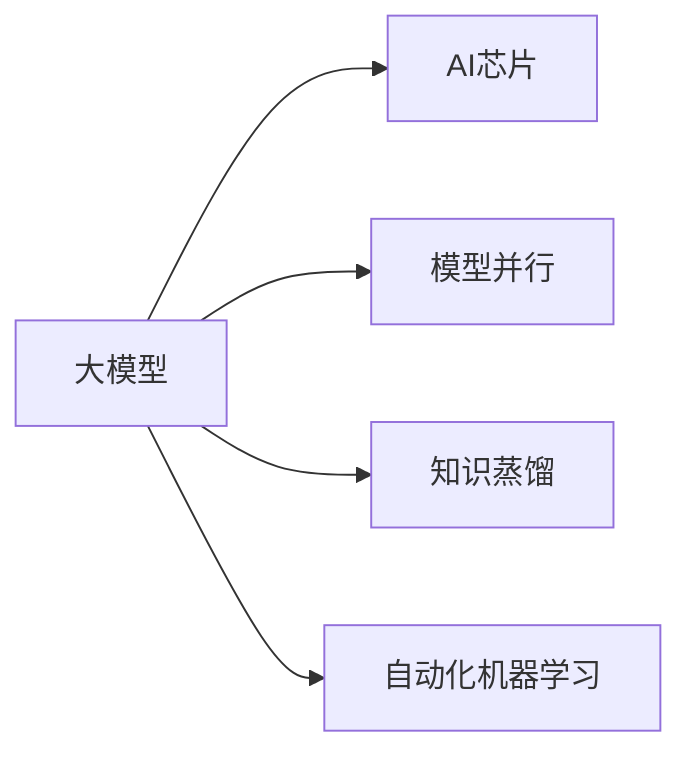

                 

## 1. 背景介绍

随着人工智能技术的飞速发展，大模型在深度学习中的应用日益广泛，带来了革命性的变化。然而，大模型的计算需求也随之增加，传统的CPU和GPU已无法满足其高性能计算要求。为此，AI芯片技术的出现，为解决这一问题提供了新的方向。本文将探讨AI芯片技术对大模型发展的推动作用，介绍相关技术原理、应用场景和未来趋势。

## 2. 核心概念与联系

### 2.1 核心概念概述

- **大模型**：指具有巨大参数量和复杂计算图的深度神经网络模型，如BERT、GPT等，它们在自然语言处理、计算机视觉等领域展现出了强大的性能。
- **AI芯片**：专门用于加速AI计算任务的专用硬件，如GPU、TPU等，通过优化的硬件架构和算法实现高效的深度学习计算。
- **模型并行**：将一个大模型拆分成多个子模型，每个子模型在不同的AI芯片上并行计算，以提高计算效率和加速模型训练。
- **知识蒸馏**：通过将大模型的知识传递给小型模型，提升小型模型的性能和泛化能力，降低对计算资源的需求。
- **自动化机器学习（AutoML）**：利用算法自动化技术，自动寻找最优的模型结构、超参数和学习率等，以提升模型的效果和效率。

这些概念之间的联系可以通过以下Mermaid流程图来展示：



该图展示了AI芯片技术通过模型并行、知识蒸馏和自动化机器学习等手段，推动大模型的发展和应用。

## 3. 核心算法原理 & 具体操作步骤

### 3.1 算法原理概述

AI芯片技术通过以下几种方式推动大模型的发展：

1. **模型并行**：利用AI芯片的高并行计算能力，将大模型的计算任务分配到多个芯片上并行处理，大大提高了计算效率。
2. **知识蒸馏**：通过将大模型的知识传递给小型模型，提升小型模型的性能，降低对计算资源的需求。
3. **自动化机器学习**：利用自动化技术，自动寻找最优的模型结构、超参数和学习率等，提升模型的效果和效率。

### 3.2 算法步骤详解

以模型并行为例，详细讲解其实现步骤：

1. **数据划分**：将大模型的训练数据按照一定的规则划分成多个小数据集。
2. **模型拆分**：将大模型按照计算图结构拆分成多个子模型，每个子模型独立计算一部分计算图。
3. **并行计算**：将每个子模型分配到不同的AI芯片上，同时计算，以实现并行加速。
4. **结果合并**：将各个芯片计算的结果合并，得到最终模型输出。

### 3.3 算法优缺点

**优点**：

- **计算效率高**：利用AI芯片的高并行计算能力，大大提高了模型的训练和推理效率。
- **模型效果提升**：通过知识蒸馏和自动化机器学习，提升了模型的效果和泛化能力。

**缺点**：

- **成本高**：需要购买和维护昂贵的AI芯片硬件。
- **复杂度高**：实现模型并行和知识蒸馏需要复杂的算法和硬件配置。

### 3.4 算法应用领域

AI芯片技术在大模型的应用领域广泛，包括自然语言处理、计算机视觉、语音识别等。以自然语言处理为例，AI芯片技术可以通过并行计算加速模型的训练和推理，提升模型效果，降低计算资源需求。

## 4. 数学模型和公式 & 详细讲解 & 举例说明

### 4.1 数学模型构建

假设有一个大模型 $M$，包含 $n$ 个参数 $\theta_1, \theta_2, ..., \theta_n$。将其划分为 $k$ 个子模型 $M_1, M_2, ..., M_k$，每个子模型包含 $m_i$ 个参数 $\theta_{i,1}, \theta_{i,2}, ..., \theta_{i,m_i}$。

### 4.2 公式推导过程

模型并行的计算过程可以表示为：

$$
\begin{aligned}
M(x) &= \sum_{i=1}^k M_i(x) \\
M_i(x) &= f_i(\theta_{i,1}, \theta_{i,2}, ..., \theta_{i,m_i}, x)
\end{aligned}
$$

其中 $f_i$ 表示第 $i$ 个子模型的计算函数。

### 4.3 案例分析与讲解

以BERT为例，可以使用模型并行加速其训练过程。将BERT的Transformer层按照计算图结构拆分为多个子层，每个子层在不同的AI芯片上并行计算，以实现并行加速。

## 5. 项目实践：代码实例和详细解释说明

### 5.1 开发环境搭建

要使用AI芯片技术加速模型训练，需要先搭建好开发环境。以TensorFlow为例，使用Google Colab搭建AI芯片开发环境：

1. 安装TensorFlow：
```
pip install tensorflow
```

2. 安装AI芯片库：
```
pip install tensorflow-gpu tensorflow-addons
```

3. 安装必要的AI芯片硬件驱动程序。

### 5.2 源代码详细实现

以下是一个使用TensorFlow和TPU进行BERT模型并行训练的示例代码：

```python
import tensorflow as tf
import tensorflow_addons as addons

# 加载BERT模型和数据集
model = addons.models.bert.BertModel.from_pretrained('bert-base-uncased')
train_dataset = ...

# 设置TPU设备
tpu = tf.distribute.cluster_resolver.TPUClusterResolver()

# 定义TPU分布策略
tpu_strategy = tf.distribute.experimental.TPUStrategy(tpu)

# 将模型迁移到TPU上
with tpu_strategy.scope():
    model = addons.models.bert.BertModel.from_pretrained('bert-base-uncased')

# 定义TPU上的计算图
def compute_loss(input_ids, labels):
    with tpu_strategy.scope():
        outputs = model(input_ids, labels)
        loss = outputs.loss
    return loss

# 在TPU上定义模型训练过程
with tpu_strategy.scope():
    optimizer = tf.keras.optimizers.Adam()
    losses = []
    for _ in range(num_epochs):
        for batch in train_dataset:
            input_ids = batch['input_ids']
            labels = batch['labels']
            loss = compute_loss(input_ids, labels)
            optimizer.apply_gradients(zip(tf.gradients(loss), model.trainable_variables))
            losses.append(loss.numpy())

# 输出训练结果
print(losses)
```

### 5.3 代码解读与分析

上述代码展示了如何使用TensorFlow和TPU进行BERT模型并行训练的过程。首先，加载预训练的BERT模型和数据集，然后设置TPU设备，定义TPU分布策略，将模型迁移到TPU上。接着，定义计算图，将模型输入和标签输入TPU计算，计算损失函数，并使用Adam优化器更新模型参数。最后，输出训练过程中的损失值。

## 6. 实际应用场景

### 6.1 智能语音助手

AI芯片技术可以加速智能语音助手的模型训练和推理，提升其对话效果和响应速度。以Google Assistant为例，通过使用TPU和TensorFlow，可以实时响应用户的自然语言输入，并快速生成回复。

### 6.2 自动驾驶

AI芯片技术在自动驾驶领域也有广泛应用，通过并行计算加速模型训练，提升模型的效果和实时性。以特斯拉Autopilot为例，使用GPU和TensorFlow进行模型训练和推理，提升自动驾驶的安全性和可靠性。

### 6.3 医疗影像分析

AI芯片技术可以加速医疗影像分析模型的训练和推理，提升诊断准确率和效率。以医学影像分类为例，通过使用GPU和TensorFlow，可以快速训练和推理医学影像分类模型，辅助医生进行诊断和治疗。

### 6.4 未来应用展望

未来，AI芯片技术将继续推动大模型的发展，通过并行计算、知识蒸馏和自动化机器学习等手段，提升模型的效果和效率。预计未来5年内，AI芯片技术将成为推动大模型发展的关键因素，加速AI技术在各个领域的落地应用。

## 7. 工具和资源推荐

### 7.1 学习资源推荐

为了深入学习AI芯片技术和大模型，推荐以下学习资源：

1. 《深度学习理论与实践》：介绍深度学习的基础理论和实践应用，涵盖模型并行、知识蒸馏等关键技术。
2. 《TensorFlow深度学习入门与实践》：介绍TensorFlow的基本使用方法和应用场景，包括AI芯片和模型并行。
3. 《AI芯片技术与应用》：介绍AI芯片的基础知识和应用案例，涵盖GPU、TPU等常见AI芯片。
4. 《大模型理论与实践》：介绍大模型的基础理论和应用实践，涵盖模型并行、知识蒸馏等关键技术。

### 7.2 开发工具推荐

以下是几个常用的AI芯片开发工具：

1. TensorFlow：用于加速深度学习模型的训练和推理，支持多种AI芯片硬件。
2. PyTorch：用于加速深度学习模型的训练和推理，支持多种AI芯片硬件。
3. OpenAI Gym：用于加速强化学习模型的训练和推理，支持多种AI芯片硬件。
4. Google Cloud AI Platform：用于在云端进行深度学习模型的训练和推理，支持多种AI芯片硬件。

### 7.3 相关论文推荐

以下是几个经典的AI芯片和大模型相关的论文：

1. TPU：《TPU: A System for Deep Neural Network Inference and Training》
2. GPU：《CUDA: A Parallel Computing Platform and Language》
3. 模型并行：《Model Parallelism: Distributed Algorithms for Training Deep Neural Networks》
4. 知识蒸馏：《Distilling Knowledge with Large Transformers》
5. 自动化机器学习：《AutoML for Knowledge Distillation》

## 8. 总结：未来发展趋势与挑战

### 8.1 研究成果总结

本文探讨了AI芯片技术对大模型发展的推动作用，介绍相关技术原理、应用场景和未来趋势。通过模型并行、知识蒸馏和自动化机器学习等手段，AI芯片技术大大提升了大模型的计算效率和效果，推动了AI技术在各个领域的落地应用。

### 8.2 未来发展趋势

未来，AI芯片技术将继续推动大模型的发展，通过并行计算、知识蒸馏和自动化机器学习等手段，提升模型的效果和效率。预计未来5年内，AI芯片技术将成为推动大模型发展的关键因素，加速AI技术在各个领域的落地应用。

### 8.3 面临的挑战

尽管AI芯片技术在推动大模型发展方面取得了显著成效，但也面临一些挑战：

1. **成本高**：需要购买和维护昂贵的AI芯片硬件。
2. **复杂度高**：实现模型并行和知识蒸馏需要复杂的算法和硬件配置。
3. **算法瓶颈**：当前的AI芯片硬件还存在一些算法瓶颈，需要进一步优化。

### 8.4 研究展望

未来，AI芯片技术的研究方向包括：

1. **新硬件架构**：研究新的AI芯片硬件架构，提升计算效率和能效比。
2. **新算法优化**：研究新的深度学习算法，提升模型效果和泛化能力。
3. **跨硬件优化**：研究跨硬件的优化方法，提升AI芯片的通用性和可扩展性。

## 9. 附录：常见问题与解答

**Q1: 什么是AI芯片？**

A: AI芯片是专门用于加速AI计算任务的专用硬件，如GPU、TPU等，通过优化的硬件架构和算法实现高效的深度学习计算。

**Q2: 如何利用AI芯片加速模型训练？**

A: 利用AI芯片的高并行计算能力，将大模型的计算任务分配到多个芯片上并行处理，以实现并行加速。

**Q3: 什么是模型并行？**

A: 模型并行是将一个大模型拆分成多个子模型，每个子模型独立计算一部分计算图，然后将结果合并得到最终模型输出。

**Q4: 什么是知识蒸馏？**

A: 知识蒸馏是通过将大模型的知识传递给小型模型，提升小型模型的性能和泛化能力，降低对计算资源的需求。

**Q5: 什么是自动化机器学习？**

A: 自动化机器学习是利用算法自动化技术，自动寻找最优的模型结构、超参数和学习率等，以提升模型的效果和效率。

**Q6: 未来AI芯片技术的发展趋势是什么？**

A: 未来AI芯片技术将继续推动大模型的发展，通过并行计算、知识蒸馏和自动化机器学习等手段，提升模型的效果和效率。预计未来5年内，AI芯片技术将成为推动大模型发展的关键因素，加速AI技术在各个领域的落地应用。

---

作者：禅与计算机程序设计艺术 / Zen and the Art of Computer Programming

