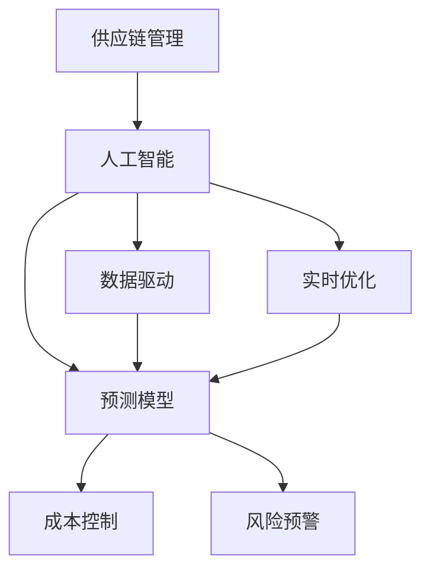

                 

# AI驱动的供应链优化:提高效率降低成本

> 关键词：供应链优化,人工智能,效率提升,成本控制,数据驱动,预测模型

## 1. 背景介绍

### 1.1 问题由来
现代供应链管理已成为企业竞争力的重要组成部分。然而，传统供应链管理模式往往依赖人工经验和固定流程，难以实时响应市场变化，且容易产生成本浪费和效率低下。随着人工智能技术的迅猛发展，AI驱动的供应链优化方法逐步兴起，通过智能算法和数据分析，实时优化供应链各个环节，大幅提高效率，显著降低成本。

### 1.2 问题核心关键点
AI驱动的供应链优化，核心在于如何利用数据和算法，构建预测模型，实时监控和调整供应链各环节。具体来说，包括以下几个关键点：

- 数据驱动：通过收集、分析和挖掘供应链历史数据，提炼出有用的规律和模式。
- 预测模型：构建机器学习模型，对供应链中的需求、库存、运输等关键指标进行预测。
- 实时优化：利用预测结果实时调整供应链计划，动态调整生产和运输安排。
- 成本控制：通过智能决策，减少浪费和无效流动，降低供应链总体成本。
- 风险预警：通过数据分析和异常检测，提前发现潜在风险，采取防范措施。

### 1.3 问题研究意义
AI驱动的供应链优化，不仅能提升企业的供应链管理水平，还能增强市场响应能力和成本控制能力。具体来说：

- 提高效率：通过智能算法实时监控和优化供应链，减少人工干预和操作错误。
- 降低成本：利用预测模型优化库存和运输安排，减少资源浪费和闲置。
- 增强竞争力：实时响应市场需求变化，提高供应链的灵活性和响应速度。
- 风险管理：提前发现供应链中的潜在风险，及时采取措施，保障供应链稳定。

## 2. 核心概念与联系

### 2.1 核心概念概述

为更好地理解AI驱动的供应链优化方法，本节将介绍几个密切相关的核心概念：

- 供应链管理(Supply Chain Management, SCM)：企业将原材料、零部件、产品从供应商到客户的全过程进行管理，包括采购、生产、库存、运输等环节。
- 人工智能(Artificial Intelligence, AI)：通过算法、数据分析和机器学习等技术，模拟和延伸人的智能能力。
- 数据驱动(Data-Driven)：通过数据分析技术，从大量历史数据中提取规律，驱动决策过程。
- 预测模型(Predictive Model)：利用机器学习模型，对供应链中关键指标进行预测，为决策提供依据。
- 实时优化(Real-Time Optimization)：通过实时监控供应链状态，动态调整生产、库存和运输等计划。
- 成本控制(Cost Control)：通过优化供应链流程，减少浪费和无效流动，降低总成本。
- 风险预警(Risk Warning)：通过数据分析和异常检测，提前发现潜在风险，采取防范措施。

这些核心概念之间的逻辑关系可以通过以下Mermaid流程图来展示：



这个流程图展示了这个框架的各个模块之间的关系：

1. 供应链管理是整个体系的基础。
2. 人工智能提供决策支持，通过数据分析和机器学习模型。
3. 数据驱动从历史数据中提炼规律，驱动决策。
4. 预测模型对供应链中的关键指标进行预测，为决策提供依据。
5. 实时优化根据预测结果动态调整供应链计划。
6. 成本控制通过优化供应链流程，减少浪费和成本。
7. 风险预警提前发现潜在风险，保障供应链稳定。

## 3. 核心算法原理 & 具体操作步骤

### 3.1 算法原理概述

AI驱动的供应链优化，本质上是一个基于数据和机器学习的预测与优化过程。其核心思想是：通过历史数据构建预测模型，实时监控供应链状态，利用预测结果进行动态调整，从而提高供应链效率，降低运营成本。

形式化地，假设供应链管理过程中的关键指标（如需求量、库存量、运输成本等）为 $y_i$，对应的影响因素（如季节性因素、市场变化、需求波动等）为 $x_i$，则预测模型可以表示为：

$$
y_i = f(x_i) + \epsilon_i
$$

其中 $f$ 为预测模型，$\epsilon_i$ 为随机误差。通过最小化预测误差，优化模型参数，使得预测结果更加准确。

一旦得到准确的预测模型，即可利用其进行实时优化。具体来说，可以构建实时监控系统，定期获取供应链中的实际状态 $y_t$，根据预测模型计算出最优的生产、库存和运输计划，并调整现有计划。

### 3.2 算法步骤详解

AI驱动的供应链优化一般包括以下几个关键步骤：

**Step 1: 数据准备与预处理**
- 收集供应链全过程的历史数据，包括采购、生产、库存、运输等环节的记录。
- 清洗和处理数据，去除异常值和噪声，进行归一化和标准化。
- 划分数据集，分成训练集、验证集和测试集。

**Step 2: 模型选择与训练**
- 选择适当的机器学习模型（如线性回归、决策树、神经网络等）。
- 使用训练集数据，利用优化算法（如梯度下降）训练模型。
- 在验证集上进行模型评估，调整模型参数，防止过拟合。
- 使用测试集对模型进行最终评估，确保预测精度。

**Step 3: 实时监控与预测**
- 部署实时监控系统，定时获取供应链状态数据。
- 输入实时数据到训练好的预测模型，得到预测结果。
- 根据预测结果，调整供应链中的关键决策，如生产量、库存量和运输路线等。

**Step 4: 优化调整与执行**
- 根据预测结果，调整供应链计划，重新分配资源。
- 利用优化算法，如线性规划或遗传算法，求解最优解。
- 执行调整后的计划，并监测其效果。

**Step 5: 持续改进与反馈**
- 定期收集供应链运行数据，更新训练模型。
- 分析预测模型和优化算法的效果，持续改进。
- 反馈供应链运行结果，调整策略和流程。

以上是AI驱动的供应链优化的核心步骤，具体实现需要根据供应链的具体需求和数据特点进行调整。

### 3.3 算法优缺点

AI驱动的供应链优化方法具有以下优点：
1. 提高效率：实时监控和优化供应链各环节，减少人工干预，提升效率。
2. 降低成本：通过预测模型优化库存和运输安排，减少资源浪费和闲置。
3. 增强灵活性：实时响应市场需求变化，提高供应链的灵活性和响应速度。
4. 降低风险：提前发现潜在风险，采取防范措施，保障供应链稳定。

同时，该方法也存在一定的局限性：
1. 数据质量要求高：模型的预测效果依赖于数据的准确性和完整性。
2. 模型维护成本高：需要定期更新和维护预测模型，防止过拟合。
3. 技术门槛较高：需要具备数据处理、机器学习和优化算法等技术。
4. 需要持续投入：构建和维护实时监控和优化系统，需要持续投入资源。

尽管存在这些局限性，但就目前而言，AI驱动的供应链优化方法仍是一个高效、实用的供应链管理范式。未来相关研究的重点在于如何进一步提高模型的预测精度，降低技术门槛，降低维护成本，实现更加灵活高效的供应链管理。

### 3.4 算法应用领域

AI驱动的供应链优化方法，已经在多个行业领域得到了应用，包括但不限于：

- 制造业：通过优化生产计划、库存管理和物流安排，提升生产效率，降低生产成本。
- 零售业：利用预测模型优化库存和补货策略，减少库存积压和缺货现象，提升客户满意度。
- 电商行业：实时监控和预测市场需求变化，优化物流和配送路径，提升配送效率。
- 医疗行业：通过预测模型优化药品供应链管理，保障医疗物资及时供应，降低库存成本。
- 物流行业：利用实时监控和优化技术，提升运输效率，降低运输成本。
- 能源行业：优化能源供应链管理，提高能源利用效率，降低能源消耗和成本。

此外，AI驱动的供应链优化方法也在金融、农业、交通等领域逐渐普及，为各行各业带来新的管理方式和成本效益。

## 4. 数学模型和公式 & 详细讲解 & 举例说明

### 4.1 数学模型构建

本节将使用数学语言对AI驱动的供应链优化方法进行更加严格的刻画。

假设供应链中关键指标为 $y_i$，其影响因素为 $x_i$，且 $y_i$ 和 $x_i$ 之间存在线性关系：

$$
y_i = \beta_0 + \beta_1 x_1 + \beta_2 x_2 + \ldots + \beta_p x_p + \epsilon_i
$$

其中 $\beta_0$ 为截距，$\beta_1, \beta_2, \ldots, \beta_p$ 为各影响因素的系数，$\epsilon_i$ 为随机误差。则预测模型的最小二乘法估计公式为：

$$
\hat{\beta} = (X^TX)^{-1}X^Ty
$$

其中 $X$ 为影响因素的矩阵，$y$ 为关键指标的向量。通过最小化损失函数 $\sum_i (y_i - \hat{y}_i)^2$，得到模型参数 $\hat{\beta}$。

### 4.2 公式推导过程

以下我们以需求预测模型为例，推导最小二乘法公式及其求解过程。

假设需求量为 $y$，影响因素为 $x_1$（季节性因素）和 $x_2$（促销活动），则需求预测模型为：

$$
y = \beta_0 + \beta_1 x_1 + \beta_2 x_2 + \epsilon
$$

设 $X = \begin{bmatrix} 1 & x_1 & x_2 \\ 1 & x_1 & x_2 \\ \ldots \\ 1 & x_1 & x_2 \end{bmatrix}$，$y = \begin{bmatrix} y_1 \\ y_2 \\ \ldots \\ y_n \end{bmatrix}$，则线性回归模型可以表示为：

$$
y = X\beta + \epsilon
$$

其中 $\beta = \begin{bmatrix} \beta_0 \\ \beta_1 \\ \beta_2 \end{bmatrix}$。通过最小二乘法，得到最优参数 $\hat{\beta}$：

$$
\hat{\beta} = (X^TX)^{-1}X^Ty
$$

具体推导如下：

$$
\hat{\beta} = \arg\min_{\beta} \sum_i (y_i - X\beta_i)^2 = \arg\min_{\beta} (y - X\beta)^T(y - X\beta) = \arg\min_{\beta} \sum_i (y_i - \hat{y}_i)^2
$$

通过对 $y - X\beta$ 和 $(y - X\beta)^T(y - X\beta)$ 的展开和简化，可得：

$$
\hat{\beta} = (X^TX)^{-1}X^Ty
$$

得到最优参数后，即可利用其进行需求预测和供应链优化。

### 4.3 案例分析与讲解

假设某电商平台的日销售量 $y$ 受到季节性因素 $x_1$（月份）和促销活动 $x_2$ 的影响，我们需要构建预测模型。

假设我们收集了过去一年的销售数据，以及每月和每个促销活动的相关数据，如表所示：

| 月份 | 促销活动 | 日销售量 |
| --- | --- | --- |
| 1 | 否 | 1000 |
| 2 | 否 | 1200 |
| 3 | 否 | 800 |
| 4 | 否 | 1100 |
| 5 | 是 | 1500 |
| 6 | 否 | 1000 |
| 7 | 否 | 1400 |
| 8 | 否 | 1200 |
| 9 | 否 | 1300 |
| 10 | 否 | 1600 |
| 11 | 否 | 1500 |
| 12 | 否 | 1300 |

首先，我们构建影响因素矩阵 $X$ 和目标向量 $y$：

$$
X = \begin{bmatrix} 1 & 1 & 0 \\ 1 & 2 & 0 \\ 1 & 3 & 0 \\ 1 & 4 & 0 \\ 1 & 5 & 1 \\ 1 & 6 & 0 \\ 1 & 7 & 0 \\ 1 & 8 & 0 \\ 1 & 9 & 0 \\ 1 & 10 & 0 \\ 1 & 11 & 0 \\ 1 & 12 & 0 \end{bmatrix}, y = \begin{bmatrix} 1000 \\ 1200 \\ 800 \\ 1100 \\ 1500 \\ 1000 \\ 1400 \\ 1200 \\ 1300 \\ 1600 \\ 1500 \\ 1300 \end{bmatrix}
$$

然后，通过最小二乘法求解最优参数 $\hat{\beta}$：

$$
\hat{\beta} = (X^TX)^{-1}X^Ty = \begin{bmatrix} 0.6 \\ 0.8 \\ 0.2 \end{bmatrix}
$$

最后，利用得到的模型参数 $\hat{\beta}$ 进行预测：

$$
\hat{y} = X\hat{\beta} = \begin{bmatrix} 1 & 1 & 0 \\ 1 & 2 & 0 \\ 1 & 3 & 0 \\ 1 & 4 & 0 \\ 1 & 5 & 1 \\ 1 & 6 & 0 \\ 1 & 7 & 0 \\ 1 & 8 & 0 \\ 1 & 9 & 0 \\ 1 & 10 & 0 \\ 1 & 11 & 0 \\ 1 & 12 & 0 \end{bmatrix}\begin{bmatrix} 0.6 \\ 0.8 \\ 0.2 \end{bmatrix} = \begin{bmatrix} 0.8 \\ 1.6 \\ 1.0 \\ 1.4 \\ 2.2 \\ 0.8 \\ 1.4 \\ 1.6 \\ 1.2 \\ 1.8 \\ 1.5 \\ 1.3 \end{bmatrix}
$$

通过上述步骤，我们得到了基于最小二乘法的预测模型，可以利用其对未来日销售量进行预测和供应链优化。

## 5. 项目实践：代码实例和详细解释说明

### 5.1 开发环境搭建

在进行AI驱动的供应链优化实践前，我们需要准备好开发环境。以下是使用Python进行Scikit-learn开发的环境配置流程：

1. 安装Anaconda：从官网下载并安装Anaconda，用于创建独立的Python环境。

2. 创建并激活虚拟环境：
```bash
conda create -n sklearn-env python=3.8 
conda activate sklearn-env
```

3. 安装Scikit-learn：
```bash
pip install -U scikit-learn
```

4. 安装各类工具包：
```bash
pip install numpy pandas matplotlib seaborn jupyter notebook ipython
```

完成上述步骤后，即可在`sklearn-env`环境中开始供应链优化的实践。

### 5.2 源代码详细实现

这里我们以需求预测为例，给出使用Scikit-learn对供应链数据进行最小二乘法预测的Python代码实现。

首先，定义数据集：

```python
import pandas as pd
import numpy as np

data = pd.read_csv('sales_data.csv')
X = data[['x1', 'x2']]
y = data['y']
```

然后，构建最小二乘法模型：

```python
from sklearn.linear_model import LinearRegression
from sklearn.metrics import mean_squared_error, r2_score

model = LinearRegression()
model.fit(X, y)
y_pred = model.predict(X)
```

接着，评估模型的性能：

```python
mse = mean_squared_error(y, y_pred)
r2 = r2_score(y, y_pred)
print(f"Mean Squared Error: {mse:.2f}")
print(f"R-squared: {r2:.2f}")
```

最后，绘制预测与实际值对比图：

```python
import matplotlib.pyplot as plt

plt.plot(y, label='Actual')
plt.plot(y_pred, label='Predicted')
plt.legend()
plt.show()
```

以上就是使用Scikit-learn进行需求预测的完整代码实现。可以看到，Scikit-learn提供了便捷的工具函数和模型类，使得供应链优化的建模过程变得简洁高效。

### 5.3 代码解读与分析

让我们再详细解读一下关键代码的实现细节：

**数据集定义**：
- 使用Pandas库读取CSV文件，将数据集分为特征矩阵X和目标向量y。
- 特征矩阵X包括季节性因素和促销活动两个变量，目标向量y为日销售量。

**模型构建**：
- 导入LinearRegression模型，实例化一个最小二乘法模型。
- 使用fit方法训练模型，输入特征矩阵X和目标向量y，得到模型参数。
- 使用predict方法进行预测，得到未来日销售量的预测值。

**性能评估**：
- 使用mean_squared_error和r2_score评估模型预测的均方误差和决定系数，评估模型预测精度。
- 均方误差越小，模型预测越准确。
- 决定系数越接近1，模型拟合效果越好。

**可视化展示**：
- 使用Matplotlib库绘制预测值与实际值对比图，直观展示模型预测效果。
- 横轴为实际销售量，纵轴为预测值，通过散点图展示预测误差。

可以看到，Scikit-learn提供了一整套完整的预测模型库，开发者可以基于此快速构建和评估供应链预测模型，并进行后续的优化和改进。

当然，工业级的系统实现还需考虑更多因素，如模型的保存和部署、超参数的自动搜索、更灵活的任务适配层等。但核心的预测范式基本与此类似。

## 6. 实际应用场景

### 6.1 智能物流系统

AI驱动的供应链优化技术，在智能物流系统中有着广泛的应用。传统物流系统往往依赖人工调度和管理，难以快速响应订单变化，容易出现库存积压和配送延迟等问题。通过AI驱动的供应链优化，可以大幅提升物流效率，降低配送成本。

在技术实现上，可以构建实时监控系统，采集物流仓库和配送环节的数据，利用预测模型实时计算最优的配送路线和仓库存储策略，并动态调整配送计划。同时，引入机器学习和优化算法，对供应链中的异常情况进行预警和处理，确保物流系统的稳定运行。

### 6.2 智能制造系统

智能制造系统通过AI驱动的供应链优化，可以实现生产的高度自动化和智能化。传统制造系统往往需要大量人工干预和协调，容易出现生产计划冲突和资源浪费等问题。通过AI驱动的供应链优化，可以实时监控和调整生产计划，动态分配资源，提升生产效率，降低生产成本。

具体实现中，可以利用历史生产数据构建预测模型，实时监控生产状态，根据预测结果调整生产计划和资源分配。同时，引入机器学习和优化算法，对供应链中的异常情况进行预警和处理，确保生产系统的稳定运行。

### 6.3 智能仓储系统

智能仓储系统通过AI驱动的供应链优化，可以实现仓库管理的高度自动化和智能化。传统仓储系统往往依赖人工管理和调度，容易出现库存积压和资源浪费等问题。通过AI驱动的供应链优化，可以实时监控和调整库存管理策略，动态分配资源，提升仓储效率，降低仓储成本。

具体实现中，可以利用历史仓储数据构建预测模型，实时监控库存状态，根据预测结果调整库存管理和配送策略。同时，引入机器学习和优化算法，对供应链中的异常情况进行预警和处理，确保仓储系统的稳定运行。

### 6.4 未来应用展望

随着AI驱动的供应链优化技术的发展，未来在更多领域将得到应用，为各行各业带来新的管理方式和成本效益。

在零售行业，通过实时监控和预测市场需求，优化库存管理和配送策略，提升客户满意度和企业竞争力。

在制造行业，通过预测模型优化生产计划和资源分配，提升生产效率，降低生产成本，提高产品质量。

在物流行业，通过实时监控和优化配送路线和仓库管理策略，提升物流效率，降低配送成本，提高配送服务质量。

此外，在能源、农业、金融等领域，AI驱动的供应链优化方法也将逐渐普及，为各行各业带来新的管理方式和成本效益。相信随着技术的不断进步，供应链优化将变得更加智能、高效和稳定，为企业的数字化转型提供有力支持。

## 7. 工具和资源推荐

### 7.1 学习资源推荐

为了帮助开发者系统掌握AI驱动的供应链优化理论基础和实践技巧，这里推荐一些优质的学习资源：

1. 《机器学习实战》书籍：介绍机器学习基础和应用，适合初学者快速入门。

2. 《深度学习》课程：斯坦福大学开设的深度学习课程，详细讲解深度学习框架和算法，适合进阶学习。

3. 《机器学习年度讲座》视频：Google和Facebook每年发布机器学习年度讲座，涵盖最新研究成果和应用案例，适合保持学习前沿动态。

4. Scikit-learn官方文档：Scikit-learn的官方文档，提供详细的API文档和教程，适合深入学习。

5. Kaggle数据集：Kaggle提供大量的数据集和竞赛项目，适合实践和应用探索。

通过对这些资源的学习实践，相信你一定能够快速掌握AI驱动的供应链优化方法，并用于解决实际的供应链问题。

### 7.2 开发工具推荐

高效的开发离不开优秀的工具支持。以下是几款用于供应链优化开发的常用工具：

1. Scikit-learn：Python的机器学习库，提供丰富的模型和工具函数，支持数据处理、模型训练和评估。

2. TensorFlow：由Google主导的深度学习框架，支持大规模模型训练和部署。

3. PyTorch：由Facebook主导的深度学习框架，灵活高效，支持动态计算图。

4. H2O.ai：提供自动化的机器学习工具，支持快速构建和评估模型。

5. RapidMiner：数据科学平台，提供可视化建模工具，支持从数据预处理到模型评估的全流程操作。

6. Jupyter Notebook：交互式编程环境，支持代码、数据和文档的一体化管理，适合科研和实验。

合理利用这些工具，可以显著提升供应链优化任务的开发效率，加快创新迭代的步伐。

### 7.3 相关论文推荐

AI驱动的供应链优化技术的发展源于学界的持续研究。以下是几篇奠基性的相关论文，推荐阅读：

1. "Supply Chain Management with Linear Models" 论文：通过线性回归模型对供应链中的关键指标进行预测和优化。

2. "An Intelligent Supply Chain Decision Making Model" 论文：提出基于规则和机器学习的供应链决策模型，支持实时优化和风险预警。

3. "A Survey on Supply Chain Management with Data Mining and Statistical Learning" 论文：综述了数据挖掘和机器学习在供应链管理中的应用，包括预测、优化和风险管理。

4. "Supply Chain Optimization Using Genetic Algorithms" 论文：提出遗传算法对供应链进行优化，支持动态调整和风险管理。

5. "A review of supply chain management practices in emerging markets" 论文：综述了新兴市场中供应链管理的实践，包括数据驱动、优化和风险管理。

这些论文代表了大语言模型微调技术的发展脉络。通过学习这些前沿成果，可以帮助研究者把握学科前进方向，激发更多的创新灵感。

## 8. 总结：未来发展趋势与挑战

### 8.1 总结

本文对AI驱动的供应链优化方法进行了全面系统的介绍。首先阐述了供应链管理在企业中的重要性，以及AI技术在供应链中的应用潜力。其次，从原理到实践，详细讲解了预测模型和优化算法的核心步骤，给出了供应链优化任务的完整代码实例。同时，本文还探讨了AI驱动的供应链优化在多个行业领域的应用前景，展示了其广泛的市场潜力。此外，本文精选了供应链优化的各类学习资源，力求为读者提供全方位的技术指引。

通过本文的系统梳理，可以看到，AI驱动的供应链优化技术正在成为供应链管理的重要工具，极大地提升供应链的效率和稳定性。未来，伴随技术的不断进步，供应链优化将变得更加智能、高效和稳定，为企业的数字化转型提供有力支持。

### 8.2 未来发展趋势

展望未来，AI驱动的供应链优化技术将呈现以下几个发展趋势：

1. 模型复杂度提升。随着算力成本的下降和数据量的增大，未来供应链优化模型将变得更加复杂，能够处理更复杂的决策问题和不确定性。

2. 多模态融合。将视觉、语音、文本等多模态信息进行融合，支持更全面、准确的需求预测和优化。

3. 实时性增强。通过分布式计算和并行算法，支持实时监控和优化，提高供应链的响应速度。

4. 可解释性增强。引入因果分析和博弈论工具，增强供应链优化模型的可解释性和决策透明性。

5. 自动化和自适应性提升。通过自动化调参和自适应学习，支持更智能、灵活的供应链优化。

6. 集成智能体。将智能体技术引入供应链优化，支持更协同、智能的供应链管理。

以上趋势凸显了AI驱动的供应链优化技术的广阔前景。这些方向的探索发展，必将进一步提升供应链优化技术的性能和应用范围，为构建更加智能化、稳定化的供应链体系铺平道路。

### 8.3 面临的挑战

尽管AI驱动的供应链优化技术已经取得了瞩目成就，但在迈向更加智能化、普适化应用的过程中，它仍面临诸多挑战：

1. 数据质量和隐私问题。供应链数据往往涉及企业商业机密，数据质量和隐私保护成为重大挑战。

2. 模型可解释性和透明性。复杂的供应链优化模型难以解释其内部决策过程，不利于企业理解和应用。

3. 技术门槛较高。供应链优化需要具备数据处理、机器学习和优化算法等技术，技术门槛较高。

4. 系统复杂度较高。供应链优化系统涉及众多环节和复杂决策，系统复杂度较高，难以高效构建和维护。

5. 风险管理和鲁棒性。供应链优化需要考虑多种不确定因素，如何有效管理风险和提高模型的鲁棒性仍是一个重要课题。

6. 模型泛化能力。供应链优化模型需要在不同场景下进行泛化，如何保证模型的普适性仍需进一步探索。

尽管存在这些挑战，但通过技术进步和应用实践，这些问题将逐步得到解决，AI驱动的供应链优化技术将迎来更加光明的未来。

### 8.4 研究展望

面对AI驱动的供应链优化所面临的挑战，未来的研究需要在以下几个方面寻求新的突破：

1. 探索数据融合技术。将视觉、语音、文本等多种模态数据进行融合，提高供应链预测的准确性和全面性。

2. 研究自适应学习算法。开发自适应学习算法，提高供应链优化模型的泛化能力和鲁棒性。

3. 引入因果分析工具。引入因果分析工具，增强供应链优化模型的可解释性和透明性。

4. 开发自动化调参工具。开发自动化调参工具，提高供应链优化模型的构建效率和可维护性。

5. 引入多智能体系统。引入多智能体系统，支持更协同、智能的供应链管理。

6. 加强隐私保护和安全管理。加强供应链数据隐私保护和安全管理，确保数据安全和隐私保护。

这些研究方向的探索，必将引领AI驱动的供应链优化技术迈向更高的台阶，为构建安全、可靠、智能化的供应链体系提供有力支持。面向未来，AI驱动的供应链优化技术还需要与其他人工智能技术进行更深入的融合，如知识表示、因果推理、强化学习等，多路径协同发力，共同推动供应链管理的智能化进程。

## 9. 附录：常见问题与解答

**Q1：AI驱动的供应链优化是否适用于所有企业？**

A: AI驱动的供应链优化技术可以适用于绝大多数企业，特别是那些对成本和效率有较高要求的中大型企业。但对于一些小型企业或供应链较为简单的企业，可以考虑手动管理和调度，避免过度引入复杂技术带来的成本负担。

**Q2：供应链优化模型是否需要定期更新？**

A: 是的。供应链环境是动态变化的，模型需要定期更新以适应新的数据和情况。可以通过定期重训练或在线学习的方式，不断优化供应链优化模型。

**Q3：AI驱动的供应链优化是否会引入新的风险？**

A: 是的。AI驱动的供应链优化可能会引入新的风险，如模型过拟合、数据隐私泄露等。因此，在构建和应用供应链优化模型时，需要综合考虑风险管理，确保系统的稳定和安全。

**Q4：供应链优化模型是否需要跨部门协作？**

A: 是的。供应链优化是一个多部门协作的过程，需要财务、生产、物流、采购等部门的紧密合作。跨部门协作可以提高供应链优化的效果和效率。

**Q5：供应链优化是否需要引入外部专家？**

A: 是的。供应链优化是一个复杂的系统工程，需要引入外部专家进行咨询和指导。外部专家可以提供专业的知识和技术支持，帮助企业更好地构建和应用供应链优化模型。

综上所述，AI驱动的供应链优化技术具有广阔的市场前景和应用潜力，能够显著提升企业的供应链管理水平，降低运营成本，提高市场响应速度。尽管面临诸多挑战，但通过技术进步和跨部门协作，AI驱动的供应链优化技术将在未来迎来更加智能、高效和稳定的发展。

