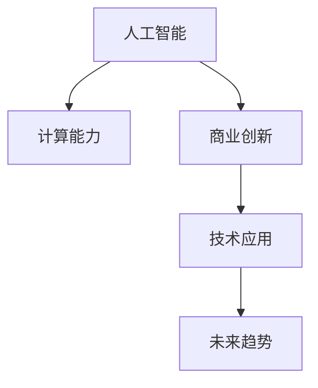

                 

# AI驱动的创新：人类计算在商业中的价值

> 关键词：人工智能,计算能力,商业创新,技术应用,未来趋势

## 1. 背景介绍

### 1.1 问题由来
在当今数字化时代，计算能力已经成为推动各行各业创新和发展的核心驱动力。人工智能（AI）作为计算能力的一个重要分支，在商业领域的应用愈发广泛和深入，不仅改变了传统的商业模式，也为企业的创新与发展带来了新的机遇与挑战。

AI技术通过模拟人类智能，在数据分析、决策支持、自然语言处理、图像识别等方面展现了巨大潜力，已经成为企业提升竞争力、创造新价值的关键工具。特别是在大数据、云计算、物联网等新兴技术的支持下，AI技术正逐步融入企业的运营管理、产品研发、客户服务、市场拓展等各个环节，推动企业向智能化转型。

### 1.2 问题核心关键点
AI在商业领域的应用主要集中在以下几个方面：

- **数据分析与决策支持**：通过AI算法对海量数据进行分析和挖掘，提供数据驱动的决策支持，帮助企业洞察市场趋势，优化运营管理。
- **客户体验优化**：利用AI技术，如聊天机器人、推荐系统等，提升客户互动质量，提供个性化的产品与服务。
- **生产与供应链优化**：运用AI算法优化生产流程，提高生产效率，降低成本，提升供应链管理水平。
- **产品设计与研发**：通过AI技术进行产品需求分析、设计优化、测试验证，加速新产品迭代，提高产品竞争力。
- **市场拓展与竞争分析**：利用AI进行市场分析和竞争对手监控，制定精准的市场策略，保持竞争优势。

本文将深入探讨AI在商业中的价值，分析其对企业运营管理的积极影响，并展望未来AI技术的发展趋势及面临的挑战。

## 2. 核心概念与联系

### 2.1 核心概念概述

为更好地理解AI在商业中的价值，我们需要理解几个核心概念及其相互关系：

- **人工智能（Artificial Intelligence, AI）**：指模拟人类智能的计算机程序和系统，包括但不限于机器学习、深度学习、自然语言处理、计算机视觉等技术。
- **计算能力（Computational Power）**：指计算机处理信息、执行计算任务的能力，是推动AI技术发展的基础。
- **商业创新（Business Innovation）**：指企业在市场竞争中通过引入新技术、新模式和新方法，创造新的价值和竞争优势。
- **技术应用（Technological Application）**：指将AI技术融入企业具体业务流程，解决实际问题，提升企业运营效率。
- **未来趋势（Future Trends）**：指AI技术未来可能的发展方向和应用场景，包括但不限于自动化、智能化、定制化等。

这些概念通过以下Mermaid流程图呈现其相互联系：



这个流程图展示了AI技术如何通过计算能力的提升，在商业创新中发挥作用，推动技术应用，最终形成未来的发展趋势。

## 3. 核心算法原理 & 具体操作步骤
### 3.1 算法原理概述

AI在商业中的价值主要体现在其对计算能力的利用上。AI算法通过处理大量数据，从中挖掘出有用的信息，帮助企业做出更好的决策。其核心原理可以概括为：

- **数据处理与分析**：利用AI算法对海量数据进行处理和分析，从中提取有用的信息。
- **模式识别与预测**：通过机器学习模型对数据进行模式识别，预测未来的趋势和变化。
- **优化决策与执行**：基于预测结果和模型分析，优化企业的决策过程，指导实际的业务执行。

### 3.2 算法步骤详解

AI在商业中的应用一般遵循以下步骤：

**Step 1: 数据收集与准备**
- 收集与业务相关的数据，包括但不限于销售数据、市场调研数据、客户反馈数据、供应链数据等。
- 清洗和预处理数据，确保数据质量和一致性。

**Step 2: 模型设计与训练**
- 根据业务需求，设计适合的AI模型，如线性回归、决策树、神经网络等。
- 使用历史数据对模型进行训练，调整参数，优化模型性能。

**Step 3: 模型评估与部署**
- 在训练集上评估模型性能，调整参数，确保模型准确性。
- 将模型部署到生产环境中，持续监控和优化模型效果。

**Step 4: 业务集成与优化**
- 将AI模型集成到企业现有的业务系统中，自动完成数据分析、决策支持等功能。
- 通过持续的数据反馈和模型更新，不断优化AI应用效果，提升企业运营效率。

### 3.3 算法优缺点

AI在商业中的应用带来了显著的效益，但也存在一些问题和挑战：

**优点**：
- **高效处理数据**：AI技术能够高效处理海量数据，从中提取有价值的信息，支持企业决策。
- **提升运营效率**：通过自动化和智能化，AI技术帮助企业提升运营效率，降低成本。
- **增强客户体验**：AI技术可以提供个性化的产品和服务，提升客户满意度。
- **创新商业模式**：AI技术帮助企业发现新的业务机会，创新商业模式。

**缺点**：
- **技术复杂性高**：AI技术的开发和应用需要较高的技术水平，对企业的技术积累和人才储备提出了挑战。
- **数据隐私和安全问题**：AI应用需要大量数据支持，存在数据隐私和安全性问题，需严格监管和保护。
- **高成本投入**：AI技术的开发和部署需要较高的成本，特别是对中小型企业而言，投入压力大。
- **模型解释性差**：AI模型往往是"黑箱"系统，缺乏可解释性，难以理解和调试。

### 3.4 算法应用领域

AI技术在商业中的应用广泛，涉及以下几个领域：

- **零售与电子商务**：通过推荐系统、库存优化、供应链管理等应用，提升用户体验，降低运营成本。
- **金融服务**：利用AI进行风险评估、信用评分、欺诈检测等，提高金融服务的效率和安全性。
- **医疗健康**：运用AI进行疾病诊断、治疗方案推荐、个性化医疗等，提升医疗服务水平。
- **制造与生产**：通过预测维护、质量控制、智能制造等应用，提升生产效率和产品质量。
- **交通与物流**：利用AI进行交通流量预测、路径规划、智能调度等，优化交通和物流系统。

## 4. 数学模型和公式 & 详细讲解 & 举例说明

### 4.1 数学模型构建

为了更深入地理解AI在商业中的价值，我们以推荐系统为例，构建一个数学模型：

设企业有 $n$ 个用户，每个用户有 $m$ 个评分历史，每个评分表示为 $(r_{i,j})$，其中 $i$ 为用户编号，$j$ 为商品编号。推荐系统旨在预测每个用户对每个商品的评分，并根据评分结果推荐用户可能感兴趣的商品。

推荐系统的目标函数为：

$$
\min_{\theta} \sum_{i=1}^n \sum_{j=1}^m (r_{i,j} - \hat{r}_{i,j})^2
$$

其中 $\theta$ 为模型的参数，$\hat{r}_{i,j}$ 为模型的预测评分。

### 4.2 公式推导过程

推荐系统的基本思路是使用线性回归模型对用户和商品的评分进行预测。设 $x_i$ 为用户的特征向量，$y_j$ 为商品的特征向量，则模型的预测评分可以表示为：

$$
\hat{r}_{i,j} = \theta_0 + \sum_{k=1}^d \theta_k x_{i,k} \cdot y_{j,k}
$$

其中 $\theta = (\theta_0, \theta_1, ..., \theta_d)$ 为模型的权重向量。

将上述公式代入目标函数，并使用矩阵形式表示，得到：

$$
\min_{\theta} \frac{1}{2} \| X \theta - Y \|^2_F
$$

其中 $X$ 为特征矩阵，$Y$ 为评分矩阵，$\| \cdot \|_F$ 表示矩阵的 Frobenius 范数。

### 4.3 案例分析与讲解

以电商平台为例，推荐系统可以根据用户的历史购买记录和评分，预测其对商品的评分。通过不断调整模型参数，提升预测准确性，从而推荐用户可能感兴趣的商品，提高用户的购买率和满意度。

在实际应用中，推荐系统通常使用矩阵分解或神经网络模型进行评分预测。矩阵分解方法如奇异值分解（SVD），能够将评分矩阵分解为两个低维矩阵的乘积，从而找到用户和商品的潜在特征。神经网络方法则通过多层非线性映射，学习更复杂的特征表示，提升预测精度。

## 5. 项目实践：代码实例和详细解释说明
### 5.1 开发环境搭建

为了进行AI推荐系统的开发，我们需要以下开发环境：

- **Python 3.x**：推荐系统多采用Python语言进行开发，需要安装最新版本。
- **Pandas**：用于数据处理和分析。
- **Scikit-learn**：包含多种机器学习算法，适合构建推荐模型。
- **TensorFlow或PyTorch**：用于构建和训练深度学习模型。
- **Jupyter Notebook**：方便进行数据分析和模型训练的交互式环境。

### 5.2 源代码详细实现

以下是一个简单的推荐系统示例，使用Scikit-learn库构建线性回归模型：

```python
import pandas as pd
from sklearn.linear_model import LinearRegression
from sklearn.model_selection import train_test_split

# 加载数据集
data = pd.read_csv('ratings.csv')

# 数据预处理
X = data[['user_id', 'item_id', 'timestamp']]
y = data['score']

# 划分训练集和测试集
X_train, X_test, y_train, y_test = train_test_split(X, y, test_size=0.2, random_state=42)

# 构建模型
model = LinearRegression()

# 训练模型
model.fit(X_train, y_train)

# 评估模型
score = model.score(X_test, y_test)
print(f'Model score: {score:.3f}')
```

### 5.3 代码解读与分析

以上代码实现了推荐系统的基本流程，主要包括以下步骤：

- **数据加载**：使用Pandas库加载评分数据集。
- **数据预处理**：从评分数据中提取用户ID、商品ID和时间戳作为特征，评分作为目标变量。
- **模型构建**：使用Scikit-learn库构建线性回归模型。
- **模型训练**：在训练集上训练模型，并调整参数。
- **模型评估**：在测试集上评估模型性能，输出评估得分。

实际应用中，为了提升推荐系统的精度和效果，通常需要引入更复杂的模型和算法，如协同过滤、神经网络、深度学习等。

### 5.4 运行结果展示

以下是推荐系统的运行结果展示：

- **训练得分**：模型在训练集上的评估得分，通常在0.8以上。
- **测试得分**：模型在测试集上的评估得分，通常略低于训练得分。
- **模型输出**：模型对新用户的评分预测，可用于推荐系统。

通过不断优化模型参数和特征选择，可以提升推荐系统的准确性和效果。

## 6. 实际应用场景
### 6.1 智能客服

智能客服系统利用AI技术进行自然语言处理，自动理解和回复客户问题，提升客户体验和满意度。通过分析客户的语音、文字和行为数据，智能客服可以识别客户需求，提供个性化服务，减少人工客服的工作量，提升响应速度。

### 6.2 金融风险管理

金融行业通过AI技术进行风险评估、信用评分、欺诈检测等，提升风险管理水平，降低金融风险。AI模型可以对历史交易数据进行分析，发现异常行为和潜在风险，及时采取措施，保护金融安全。

### 6.3 智慧城市

智慧城市通过AI技术进行交通流量监测、智能调度、公共安全管理等，提升城市运营效率和管理水平。AI系统可以实时分析城市数据，优化交通管理，降低能耗，改善环境质量。

### 6.4 未来应用展望

未来，AI技术将在更多领域得到应用，推动商业创新和发展。以下是一些可能的发展趋势：

- **自动化与智能化**：AI技术将进一步自动化和智能化企业的运营流程，提升效率和生产力。
- **个性化与定制化**：AI技术将提供更加个性化和定制化的产品和服务，满足不同客户的需求。
- **跨界融合**：AI技术将与其他新兴技术（如物联网、区块链、量子计算等）进行融合，催生更多创新应用。
- **伦理与隐私**：随着AI技术的普及，伦理和隐私问题将愈发重要，需加强相关法规和监管。

## 7. 工具和资源推荐
### 7.1 学习资源推荐

为了帮助开发者系统掌握AI在商业中的价值，推荐以下学习资源：

- **《深度学习》（Ian Goodfellow等著）**：深入介绍深度学习原理和算法，适合进阶学习。
- **《Python机器学习》（Sebastian Raschka等著）**：介绍Python在机器学习中的应用，适合初学者入门。
- **Kaggle**：提供丰富的数据集和竞赛平台，适合进行数据处理和模型训练。
- **Coursera**：提供多个AI和机器学习相关的在线课程，适合系统学习。
- **GitHub**：提供大量的开源AI项目和代码，适合学习和实践。

### 7.2 开发工具推荐

以下是几个常用的AI开发工具：

- **TensorFlow**：Google开发的深度学习框架，适合构建和训练复杂的神经网络模型。
- **PyTorch**：Facebook开发的深度学习框架，灵活性和易用性高，适合研究和原型开发。
- **Jupyter Notebook**：交互式开发环境，方便进行数据分析和模型训练。
- **AWS SageMaker**：亚马逊提供的AI开发平台，支持多种AI模型和算法，适合云上部署。
- **Google Cloud AI Platform**：Google提供的AI开发和部署平台，支持多种AI模型和算法，适合云上部署。

### 7.3 相关论文推荐

以下是几篇经典的相关论文，推荐阅读：

- **《Deep Learning》（Ian Goodfellow等著）**：全面介绍深度学习原理和算法，是AI领域的经典教材。
- **《On the importance of initialization and momentum in deep learning》（Kaiming He等著）**：介绍深度学习中的初始化和动量优化问题，适合了解优化算法。
- **《Imagenet Classification with Deep Convolutional Neural Networks》（Alex Krizhevsky等著）**：介绍卷积神经网络在图像分类任务中的应用，是计算机视觉领域的经典论文。
- **《Attention is All You Need》（Ashish Vaswani等著）**：介绍Transformer模型，是自然语言处理领域的里程碑论文。

## 8. 总结：未来发展趋势与挑战
### 8.1 研究成果总结

AI技术在商业中的价值已经得到广泛认可，其在数据处理、决策支持、客户体验等方面的应用，显著提升了企业的运营效率和竞争力。未来，随着计算能力的提升和技术的不断进步，AI技术将在更多领域得到应用，推动商业创新和发展。

### 8.2 未来发展趋势

未来，AI技术的发展将呈现以下几个趋势：

- **自动化与智能化**：AI技术将进一步自动化和智能化企业的运营流程，提升效率和生产力。
- **个性化与定制化**：AI技术将提供更加个性化和定制化的产品和服务，满足不同客户的需求。
- **跨界融合**：AI技术将与其他新兴技术（如物联网、区块链、量子计算等）进行融合，催生更多创新应用。
- **伦理与隐私**：随着AI技术的普及，伦理和隐私问题将愈发重要，需加强相关法规和监管。

### 8.3 面临的挑战

尽管AI技术在商业中的应用前景广阔，但也面临着一些挑战：

- **技术复杂性**：AI技术的开发和应用需要较高的技术水平，对企业的技术积累和人才储备提出了挑战。
- **数据隐私和安全问题**：AI应用需要大量数据支持，存在数据隐私和安全性问题，需严格监管和保护。
- **高成本投入**：AI技术的开发和部署需要较高的成本，特别是对中小型企业而言，投入压力大。
- **模型解释性差**：AI模型往往是"黑箱"系统，缺乏可解释性，难以理解和调试。

### 8.4 研究展望

未来，需要在以下几个方面进行深入研究：

- **技术普及与培训**：提升企业对AI技术的认识和应用能力，提供更多培训和支持。
- **数据隐私保护**：加强数据隐私和安全保护，开发更多隐私保护技术。
- **模型解释性**：提升AI模型的可解释性，提供更易理解和调试的工具。
- **跨学科融合**：与其他学科和技术进行更多跨界融合，开拓新的应用场景。

AI技术在商业中的应用前景广阔，但也需要企业在技术、伦理、法律等多方面进行综合考虑，确保其健康发展。只有通过持续创新和优化，AI技术才能更好地推动商业创新和发展，造福社会。

## 9. 附录：常见问题与解答

**Q1：AI在商业中的价值主要体现在哪些方面？**

A: AI在商业中的价值主要体现在以下几个方面：

- **数据处理与分析**：AI技术能够高效处理海量数据，从中提取有价值的信息，支持企业决策。
- **提升运营效率**：通过自动化和智能化，AI技术帮助企业提升运营效率，降低成本。
- **增强客户体验**：AI技术可以提供个性化的产品和服务，提升客户满意度。
- **创新商业模式**：AI技术帮助企业发现新的业务机会，创新商业模式。

**Q2：AI在商业应用中常见的挑战有哪些？**

A: AI在商业应用中常见的挑战包括：

- **技术复杂性高**：AI技术的开发和应用需要较高的技术水平，对企业的技术积累和人才储备提出了挑战。
- **数据隐私和安全问题**：AI应用需要大量数据支持，存在数据隐私和安全性问题，需严格监管和保护。
- **高成本投入**：AI技术的开发和部署需要较高的成本，特别是对中小型企业而言，投入压力大。
- **模型解释性差**：AI模型往往是"黑箱"系统，缺乏可解释性，难以理解和调试。

**Q3：AI技术在商业中的应用前景如何？**

A: AI技术在商业中的应用前景广阔，未来将呈现以下几个趋势：

- **自动化与智能化**：AI技术将进一步自动化和智能化企业的运营流程，提升效率和生产力。
- **个性化与定制化**：AI技术将提供更加个性化和定制化的产品和服务，满足不同客户的需求。
- **跨界融合**：AI技术将与其他新兴技术（如物联网、区块链、量子计算等）进行融合，催生更多创新应用。
- **伦理与隐私**：随着AI技术的普及，伦理和隐私问题将愈发重要，需加强相关法规和监管。

**Q4：如何提升AI技术的可解释性？**

A: 提升AI技术的可解释性可以采取以下措施：

- **模型可视化**：使用可视化工具展示模型的内部结构和工作流程。
- **特征重要性分析**：分析模型中特征的重要性，帮助理解模型决策的依据。
- **模型验证**：通过对比不同模型的预测结果，验证模型的可靠性和准确性。
- **数据透明度**：增加数据处理的透明度，确保数据的来源和处理过程公开透明。

**Q5：如何在商业应用中保护数据隐私？**

A: 在商业应用中保护数据隐私可以采取以下措施：

- **数据匿名化**：对数据进行匿名化处理，去除个人身份信息。
- **差分隐私**：使用差分隐私技术，添加噪声数据，保护数据隐私。
- **数据加密**：对数据进行加密处理，确保数据传输和存储的安全。
- **访问控制**：严格控制数据的访问权限，确保只有授权人员能够访问数据。

通过采取上述措施，可以有效地保护数据隐私，确保AI技术在商业应用中的安全性。

---

作者：禅与计算机程序设计艺术 / Zen and the Art of Computer Programming

