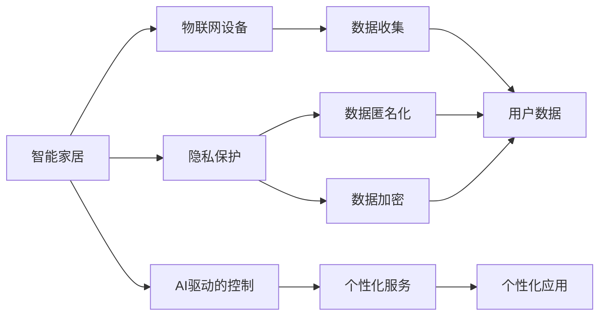

                 

# AI驱动的智能家居：便利与隐私的平衡

在现代科技的推动下，智能家居技术正逐步改变我们的居住方式，带来前所未有的便利。从智能照明到安全监控，从语音助手到健康监测，AI驱动的智能家居产品正全方位地渗透到我们的生活。然而，这一过程中，便利与隐私之间的平衡成为一个无法忽视的问题。本文将从智能家居的核心概念、算法原理、项目实践和未来展望等多个角度，深入探讨AI驱动的智能家居如何实现便利与隐私的和谐共存。

## 1. 背景介绍

### 1.1 问题由来

智能家居的兴起源于物联网(IoT)和大数据技术的快速发展，使得家居设备得以通过网络连接，实现远程控制和数据共享。AI技术的引入则进一步提升了智能家居的智能化水平，使其能够理解和响应用户的意图，提供个性化服务。然而，智能家居的发展同时也带来了数据隐私和安全性方面的挑战。如何在使用AI驱动的智能家居产品时，既能享受其带来的便利，又能保护个人隐私，成为业界关注的重要议题。

### 1.2 问题核心关键点

智能家居的便利与隐私平衡问题涉及以下几个核心关键点：

1. **数据隐私保护**：智能家居设备收集大量用户的生活数据，如何防止这些数据被滥用或泄露。
2. **用户权限管理**：如何确保用户对自己的数据和设备拥有足够的控制权，如访问权限、数据共享等。
3. **数据匿名化与加密**：如何对收集的数据进行匿名化处理，确保即使数据被非法获取，也无法直接识别到个人身份。
4. **安全与可靠性**：如何保障智能家居设备本身的安全性，防止黑客攻击和数据泄露事件。
5. **伦理与合规**：如何在技术发展中遵循法律法规，保护用户权益，同时推动技术进步。

## 2. 核心概念与联系

### 2.1 核心概念概述

智能家居（Smart Home）是一种通过互联网技术，将家庭内的各种设备互联互通，实现自动化控制和远程管理的系统。AI驱动的智能家居产品通过机器学习和自然语言处理技术，能够理解用户的语音指令，执行复杂的控制任务，并提供个性化服务。隐私保护（Privacy Protection）则关注如何在智能家居系统中保护用户数据的安全，防止数据泄露和滥用。

### 2.2 核心概念原理和架构的 Mermaid 流程图



这个流程图展示了智能家居系统的主要架构及其核心组件：

- **智能家居(A)**：作为整个系统的核心，通过物联网设备(B)收集数据，并使用AI驱动的控制(C)进行个性化服务(F)。
- **隐私保护(D)**：在数据收集(E)和个性化应用(J)过程中，进行数据匿名化(G)和加密(H)，确保用户数据的安全。

## 3. 核心算法原理 & 具体操作步骤

### 3.1 算法原理概述

AI驱动的智能家居系统依赖于机器学习模型进行数据处理和决策。这些模型通过大量标注数据进行训练，学习到用户的兴趣和行为模式，从而提供个性化的服务和推荐。隐私保护则涉及到数据隐私的算法和技术，如差分隐私、联邦学习等，旨在确保用户数据的安全性和隐私性。

### 3.2 算法步骤详解

AI驱动的智能家居系统的算法流程一般包括数据收集、特征提取、模型训练和结果输出等步骤。以下是一个简化的流程图：


在数据收集阶段，智能家居设备通过传感器、摄像头等获取用户的行为数据。在特征提取阶段，这些数据被转换为可用于模型训练的特征向量。在模型训练阶段，AI模型通过学习这些特征，生成推荐和服务。在结果输出阶段，系统根据模型预测结果，提供个性化服务。

### 3.3 算法优缺点

AI驱动的智能家居系统的优点在于其高效、智能地提供个性化服务，极大提升了用户的生活质量。然而，也存在一些显著的缺点：

- **隐私风险高**：由于数据量大且涉及用户隐私，智能家居系统面临较大的隐私风险。
- **技术门槛高**：AI模型训练和优化需要大量的计算资源和时间，技术门槛较高。
- **设备兼容性差**：不同品牌和型号的智能家居设备可能不兼容，影响用户体验。
- **依赖网络**：智能家居系统高度依赖网络连接，一旦网络中断，系统可能无法正常工作。

### 3.4 算法应用领域

AI驱动的智能家居系统广泛应用于以下领域：

- **家庭娱乐**：智能电视、音箱、游戏机等设备，通过AI技术提供个性化推荐和互动体验。
- **健康监测**：智能手表、健身设备等，通过AI技术分析用户健康数据，提供健康建议。
- **安全监控**：智能摄像头、门禁系统等，通过AI技术进行异常检测和预警。
- **能源管理**：智能照明、温控设备等，通过AI技术优化能源使用，降低能耗。

## 4. 数学模型和公式 & 详细讲解 & 举例说明

### 4.1 数学模型构建

AI驱动的智能家居系统通常使用机器学习模型进行决策。以下是一个简单的推荐系统的数学模型：

- **用户画像**：$U$，表示用户的兴趣和行为特征。
- **物品特征**：$I$，表示物品的属性和特点。
- **推荐模型**：$f$，通过学习用户画像和物品特征，生成推荐结果。

### 4.2 公式推导过程

推荐模型的公式可以表示为：

$$
y = f(U, I)
$$

其中，$y$ 表示推荐结果，$U$ 和 $I$ 分别为用户画像和物品特征，$f$ 为推荐函数。推荐函数可以通过深度学习模型（如神经网络）来实现。

### 4.3 案例分析与讲解

假设我们有一个智能电视推荐系统，希望根据用户历史观看记录，推荐用户可能感兴趣的电影。我们可以使用以下步骤进行建模和优化：

1. **数据收集**：收集用户的历史观看记录，提取观影时间、类型、评分等特征。
2. **特征提取**：使用TF-IDF或Word2Vec等技术，将文本特征转换为数值向量。
3. **模型训练**：使用深度学习模型（如卷积神经网络）进行训练，学习用户画像和物品特征的映射关系。
4. **结果输出**：根据模型预测结果，推荐用户可能感兴趣的电影。

## 5. 项目实践：代码实例和详细解释说明

### 5.1 开发环境搭建

要进行AI驱动的智能家居系统开发，我们需要搭建相应的开发环境。以下是一个Python开发的示例：

1. **安装Python**：
   - 安装最新版本的Python，建议使用Anaconda或Miniconda。
   - 安装必要的依赖包，如TensorFlow、PyTorch、Keras等。

2. **配置开发环境**：
   - 配置虚拟环境，使用`conda create`或`virtualenv`创建虚拟环境。
   - 安装所需的Python包和依赖库，如`numpy`、`pandas`、`scikit-learn`等。

3. **配置数据集**：
   - 收集和准备智能家居系统的数据集，包括用户行为数据、设备传感器数据等。
   - 将数据集分为训练集、验证集和测试集，以便进行模型训练和评估。

### 5.2 源代码详细实现

以下是一个简单的智能推荐系统的Python代码实现：

```python
import numpy as np
import pandas as pd
from sklearn.model_selection import train_test_split
from keras.models import Sequential
from keras.layers import Dense, Embedding, LSTM

# 读取数据集
data = pd.read_csv('user_movie_data.csv')

# 数据预处理
user_ids = data['user_id'].unique()
item_ids = data['movie_id'].unique()
X = np.zeros((len(data), len(item_ids)))
y = np.zeros((len(data), len(user_ids)))
for i, row in data.iterrows():
    X[i, row['movie_id'] - 1] = 1
    y[i, row['user_id'] - 1] = 1

# 划分训练集和测试集
X_train, X_test, y_train, y_test = train_test_split(X, y, test_size=0.2)

# 定义模型
model = Sequential()
model.add(Embedding(len(item_ids), 64, input_length=len(item_ids)))
model.add(LSTM(64))
model.add(Dense(len(user_ids), activation='softmax'))

# 编译模型
model.compile(loss='categorical_crossentropy', optimizer='adam', metrics=['accuracy'])

# 训练模型
model.fit(X_train, y_train, epochs=10, batch_size=32, validation_data=(X_test, y_test))

# 测试模型
score = model.evaluate(X_test, y_test)
print('Test loss:', score[0])
print('Test accuracy:', score[1])
```

### 5.3 代码解读与分析

以上代码展示了智能推荐系统的基本实现步骤：

1. **数据读取和预处理**：
   - 使用Pandas读取用户和电影数据，进行唯一性处理，得到用户和电影的唯一ID。
   - 使用NumPy创建稀疏矩阵，表示用户和电影的特征向量。
   - 使用Scikit-Learn进行数据集划分，得到训练集和测试集。

2. **模型定义和编译**：
   - 使用Keras定义一个简单的多层感知器模型，包括嵌入层、LSTM层和全连接层。
   - 使用Keras编译模型，设置损失函数、优化器和评估指标。

3. **模型训练和测试**：
   - 使用Keras训练模型，设置训练轮数和批次大小。
   - 使用Keras评估模型，输出测试损失和准确率。

## 6. 实际应用场景

### 6.1 家庭娱乐

智能电视和游戏机是智能家居中最具代表性的应用。通过AI驱动的推荐系统，这些设备可以提供个性化的影视和游戏推荐，提升用户体验。例如，Amazon Fire TV和Google Chromecast等智能电视设备，利用推荐系统为用户推荐热门影片和剧集。

### 6.2 健康监测

智能手表和健身设备通过AI技术监测用户健康状况，提供个性化的健康建议。例如，Apple Watch和Fitbit等设备，可以分析用户的心率、步数、睡眠等数据，生成健康报告和运动建议。

### 6.3 安全监控

智能摄像头和门禁系统通过AI技术进行异常检测和预警。例如，Nest Cam和Eufy Video等智能摄像头，可以实时监控家庭环境，检测异常行为并进行预警。

### 6.4 能源管理

智能照明和温控设备通过AI技术优化能源使用，降低能耗。例如，Philips Hue和Google Nest等设备，可以自动调整照明亮度和温控设置，节能环保。

## 7. 工具和资源推荐

### 7.1 学习资源推荐

为了帮助开发者系统掌握AI驱动的智能家居技术，这里推荐一些优质的学习资源：

1. **《深度学习》一书**：由Ian Goodfellow等作者编写，详细介绍了深度学习的理论和算法，是学习AI驱动智能家居的基础。
2. **Coursera《机器学习》课程**：由Andrew Ng教授主讲，涵盖机器学习的各个方面，包括监督学习、无监督学习和强化学习等。
3. **Udacity《人工智能驱动的智能家居》课程**：介绍了智能家居的基本概念和技术，结合实际案例讲解如何应用AI技术。
4. **GitHub智能家居项目**：提供了大量智能家居项目的代码实现和文档，供开发者学习和借鉴。
5. **Kaggle智能家居数据集**：提供了多个智能家居相关的数据集，供开发者进行模型训练和测试。

通过对这些资源的学习实践，相信你一定能够快速掌握AI驱动的智能家居技术，并用于解决实际的NLP问题。

### 7.2 开发工具推荐

高效的开发离不开优秀的工具支持。以下是几款用于AI驱动的智能家居开发的常用工具：

1. **TensorFlow**：由Google主导开发的深度学习框架，支持分布式训练和优化，适合大规模工程应用。
2. **PyTorch**：由Facebook主导开发的深度学习框架，灵活性强，易于调试和优化。
3. **Keras**：基于TensorFlow和Theano的高级深度学习库，简单易用，适合快速原型开发。
4. **Jupyter Notebook**：支持多种编程语言的交互式开发环境，方便开发者进行模型训练和调试。
5. **AWS SageMaker**：亚马逊提供的云端AI开发平台，支持大规模分布式训练，提供丰富的预训练模型和算法库。

合理利用这些工具，可以显著提升AI驱动的智能家居开发的效率，加快创新迭代的步伐。

### 7.3 相关论文推荐

智能家居技术的发展源于学界的持续研究。以下是几篇奠基性的相关论文，推荐阅读：

1. **《深度学习在智能家居中的应用》**：介绍了深度学习在智能家居中的应用，包括推荐系统、语音助手和情感分析等。
2. **《智能家居系统的设计与实现》**：详细介绍了智能家居系统的设计和实现，包括设备互联、数据管理和AI技术应用等。
3. **《基于机器学习的家庭能源管理》**：提出了一种基于机器学习的家庭能源管理系统，通过优化能源使用，降低能耗。
4. **《智能家居中的隐私保护技术》**：探讨了智能家居系统中的隐私保护技术，包括数据匿名化、加密和访问控制等。
5. **《智能家居中的推荐系统研究》**：研究了智能家居中的推荐系统，包括协同过滤、深度学习和混合推荐等算法。

这些论文代表了大语言模型微调技术的发展脉络。通过学习这些前沿成果，可以帮助研究者把握学科前进方向，激发更多的创新灵感。

## 8. 总结：未来发展趋势与挑战

### 8.1 总结

本文对AI驱动的智能家居系统进行了全面系统的介绍。首先阐述了智能家居和隐私保护的核心概念，明确了便利与隐私之间的平衡问题。其次，从算法原理和具体操作步骤，详细讲解了AI驱动的智能家居系统的实现方法。最后，展示了AI驱动的智能家居系统在多个实际场景中的应用，并推荐了相关的学习资源和开发工具。

通过本文的系统梳理，可以看到，AI驱动的智能家居系统正在成为物联网领域的重要范式，极大地提升了人们的生活质量。然而，便利与隐私之间的平衡问题，依然是一个亟待解决的难题。

### 8.2 未来发展趋势

展望未来，AI驱动的智能家居技术将呈现以下几个发展趋势：

1. **多模态融合**：未来的智能家居系统将更多地融合多模态数据，如语音、图像和传感器数据，提供更加全面和智能的体验。
2. **边缘计算**：通过将计算任务转移到设备端，减少数据传输和网络延迟，提升智能家居系统的响应速度和稳定性。
3. **联邦学习**：利用分布式数据和模型更新机制，确保数据隐私和安全，同时提升模型性能和泛化能力。
4. **自适应学习**：通过实时监测用户反馈，动态调整推荐策略和服务模式，提升用户体验和满意度。
5. **可解释性增强**：增强AI模型的可解释性，让用户更好地理解模型的决策过程，提高信任度。

以上趋势凸显了AI驱动的智能家居技术的广阔前景。这些方向的探索发展，必将进一步提升智能家居系统的性能和用户体验，为人类生活带来更多的便利和创新。

### 8.3 面临的挑战

尽管AI驱动的智能家居技术已经取得了显著进展，但在迈向更加智能化、普适化应用的过程中，它仍面临诸多挑战：

1. **数据隐私和安全**：智能家居系统收集和处理大量用户数据，如何保护这些数据的隐私和安全，是一个复杂的问题。
2. **设备互操作性**：不同品牌和型号的智能家居设备可能不兼容，影响用户体验和设备集成。
3. **能源效率**：智能家居系统需要大量电力支持，如何优化能源使用，降低能耗，是一个重要课题。
4. **技术门槛高**：AI驱动的智能家居系统需要复杂的算法和模型，技术门槛较高，难以大规模推广。
5. **用户接受度**：用户对于智能家居系统的接受度仍然较低，如何提升用户的信任和使用意愿，是一个重要挑战。

### 8.4 研究展望

面对AI驱动的智能家居系统所面临的挑战，未来的研究需要在以下几个方面寻求新的突破：

1. **隐私保护技术**：开发更加安全、高效的隐私保护技术，确保用户数据的安全性。
2. **设备标准化**：制定统一的智能家居设备标准，提升设备互操作性和兼容性。
3. **能源管理系统**：研究高效的能源管理算法，优化能源使用，降低能耗。
4. **用户界面设计**：设计更加友好、易用的用户界面，提升用户接受度和满意度。
5. **技术普及**：降低AI技术的门槛，推动智能家居技术的普及和应用。

这些研究方向的探索，必将引领AI驱动的智能家居系统迈向更高的台阶，为人类生活带来更多的便利和创新。只有勇于创新、敢于突破，才能不断拓展智能家居系统的边界，让AI技术更好地造福人类社会。

## 9. 附录：常见问题与解答

**Q1：智能家居系统如何保护用户隐私？**

A: 智能家居系统可以通过以下方式保护用户隐私：

1. **数据匿名化**：对收集的数据进行去标识化处理，确保数据无法直接识别到个人身份。
2. **加密存储**：对存储的数据进行加密处理，防止数据泄露和非法访问。
3. **访问控制**：通过身份认证和权限管理，确保只有授权用户可以访问和操作数据。
4. **差分隐私**：在数据收集和处理过程中，加入噪声干扰，防止数据泄露和滥用。

**Q2：智能家居设备如何互联互通？**

A: 智能家居设备互联互通，需要遵循以下标准和协议：

1. **通用标准**：采用统一的设备标准和协议，如Zigbee、Wi-Fi、Bluetooth等。
2. **中间件**：使用中间件技术，实现不同品牌和型号设备之间的通信和数据共享。
3. **智能协议**：采用智能协议，如MQTT、CoAP等，实现设备间的实时数据传输和交互。
4. **云平台**：利用云平台技术，集中管理和调度智能家居设备的运行状态和数据。

**Q3：智能家居系统的计算资源需求高吗？**

A: 智能家居系统的计算资源需求因应用场景和功能不同而有所差异。一般来说，较为复杂的AI驱动功能，如推荐系统、语音助手等，对计算资源的需求较高。

1. **推荐系统**：需要大量的计算资源进行模型训练和优化，适合在云端进行。
2. **语音助手**：需要实时处理语音信号和自然语言处理任务，适合在设备端进行。
3. **智能监控**：需要处理大量的视频和传感器数据，适合在云端进行。

合理配置计算资源，可以有效提升智能家居系统的性能和稳定性。

**Q4：智能家居系统如何进行异常检测？**

A: 智能家居系统可以通过以下方式进行异常检测：

1. **行为分析**：通过分析用户的行为模式，检测异常行为和事件。
2. **数据挖掘**：利用数据挖掘技术，检测异常数据和模式。
3. **机器学习**：使用机器学习算法，训练异常检测模型，进行实时异常检测和预警。

**Q5：智能家居系统如何进行自适应学习？**

A: 智能家居系统可以通过以下方式进行自适应学习：

1. **实时反馈**：通过收集用户反馈数据，动态调整推荐策略和服务模式。
2. **在线学习**：利用在线学习技术，实时更新模型参数和策略。
3. **强化学习**：通过强化学习算法，优化推荐系统和服务模式，提升用户体验和满意度。

通过对这些问题的解答，相信你对AI驱动的智能家居系统有了更深入的理解，也能更好地应对实际应用中的挑战。

---

作者：禅与计算机程序设计艺术 / Zen and the Art of Computer Programming

