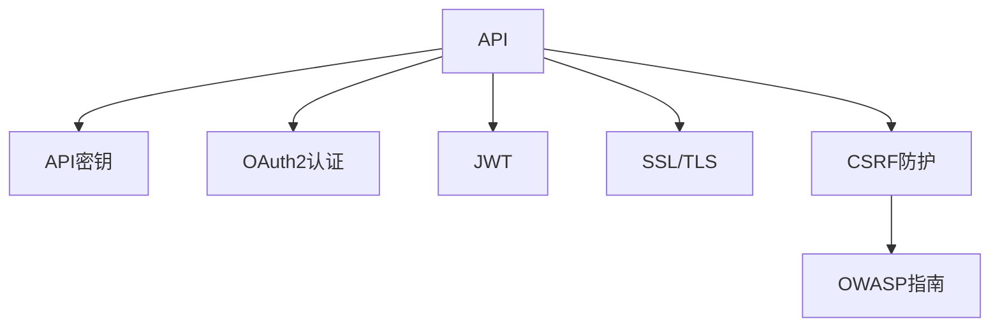

                 

# API 安全和认证机制

## 1. 背景介绍

在当今数字化时代，API（应用程序接口）已成为连接应用程序、数据和服务的关键。无论是Web应用、移动应用还是物联网设备，API都能在后台进行数据交换和功能调用，从而实现跨平台、跨设备的应用互联。然而，API的广泛应用也伴随着新的安全风险，如未授权访问、数据泄露、服务拒绝等，这些问题若得不到有效解决，将严重影响应用的安全性和可靠性。

### 1.1 问题由来

API安全问题主要源于以下几方面：

1. **开放性**：API设计时通常会默认数据和功能对所有用户开放，无法直接控制访问权限。
2. **缺乏认证**：许多API未实现严格的认证机制，容易被恶意用户非法访问。
3. **数据泄露**：API接口未对敏感数据进行加密处理，导致数据泄露风险增加。
4. **DDoS攻击**：由于API服务通常是公共接口，容易成为分布式拒绝服务(DDoS)攻击的目标，影响正常服务。

为了应对这些安全问题，API安全和认证机制成为研究和实践中的重点。

## 2. 核心概念与联系

### 2.1 核心概念概述

为了更好地理解API安全和认证机制，本节将介绍几个关键概念：

- **API（应用程序接口）**：允许两个或多个应用程序之间进行数据和功能交换的协议。
- **API密钥（API Key）**：用于身份验证的字符串，通常由API提供商提供，并在每次请求时作为参数传递。
- **OAuth2认证**：一种基于标准的认证协议，允许第三方应用代表用户访问API资源，保护用户隐私。
- **JWT（JSON Web Token）**：一种轻量级的身份验证机制，使用JSON格式进行数据编码和传输。
- **SSL/TLS（安全套接字层/传输层安全性）**：用于在网络通信中保证数据加密传输的安全协议。
- **CSRF（跨站请求伪造）**：一种利用用户已认证的会话进行恶意请求的攻击。
- **OWASP（开放网络应用安全项目）**：专注于Web应用安全标准和指南的非盈利组织，提供API安全的最佳实践和指导。

这些概念之间的逻辑关系可以通过以下Mermaid流程图来展示：



这个流程图展示了几大核心概念之间的联系：

1. API通过API密钥、OAuth2认证、JWT等方式进行身份验证。
2. 加密技术如SSL/TLS保护数据传输的安全。
3. CSRF防护机制防止跨站请求伪造攻击。
4. OWASP指南为API安全提供权威的参考标准。

## 3. 核心算法原理 & 具体操作步骤

### 3.1 算法原理概述

API安全和认证机制的核心在于对请求的身份验证和授权。其基本流程如下：

1. **认证**：通过API密钥、OAuth2认证、JWT等方式，对请求发送者进行身份验证。
2. **授权**：根据认证结果，判断请求是否被授权访问特定资源或执行特定操作。
3. **访问控制**：根据授权结果，允许或拒绝访问请求，保护API资源不受未授权访问。

### 3.2 算法步骤详解

以下是API安全和认证机制的核心步骤详解：

**Step 1: 设计API接口**

- 定义API接口的URL、参数、响应格式等。
- 确定哪些资源和方法需要认证和授权。
- 设计API接口的认证方式，如API密钥、OAuth2认证等。

**Step 2: 实现身份验证**

- 在API接口中添加认证逻辑，如API密钥验证、OAuth2授权等。
- 使用SSL/TLS加密API接口的传输数据。
- 实现CSRF防护机制，防止跨站请求伪造攻击。

**Step 3: 授权与访问控制**

- 根据认证结果，判断用户是否有权限访问特定资源或执行特定操作。
- 使用访问控制列表(ACL)、角色基访问控制(RBAC)等机制，限制用户权限。
- 记录API访问日志，监控异常访问行为。

**Step 4: 异常处理与应急响应**

- 实现API访问异常处理机制，如限流、降级等。
- 制定应急响应策略，快速应对API安全事件。

**Step 5: 安全评估与定期检查**

- 定期进行API安全评估，发现和修复潜在漏洞。
- 实施定期的安全检查，确保API系统持续安全运行。

### 3.3 算法优缺点

API安全和认证机制具有以下优点：

1. **增强安全性**：通过身份验证和授权，能有效防止未授权访问，保护API资源。
2. **提升用户信任**：认证机制让用户相信API接口的真实性，增强了用户对API的信任。
3. **灵活扩展**：OAuth2等标准认证协议支持多种认证方式，便于API接口的灵活扩展。

同时，该机制也存在以下局限性：

1. **复杂度**：设计和实现API安全和认证机制需要考虑多个环节，可能增加系统复杂度。
2. **性能开销**：认证和授权过程可能增加API的响应时间和系统资源消耗。
3. **维护成本**：随着API接口的不断变化，安全和认证机制需要持续维护和更新。

### 3.4 算法应用领域

API安全和认证机制广泛应用于各种Web应用、移动应用、物联网设备等领域，如：

- **Web应用**：通过API密钥、OAuth2认证、JWT等方式保护Web应用的后端资源。
- **移动应用**：在移动应用与后端服务器之间，使用API进行数据交换和功能调用。
- **物联网设备**：物联网设备通过API接口与云端服务进行数据传输和控制。
- **第三方应用集成**：API接口作为第三方应用的桥梁，连接不同的服务提供商。

## 4. 数学模型和公式 & 详细讲解

### 4.1 数学模型构建

API安全和认证机制涉及的身份验证和授权过程，通常通过数学模型来描述。以OAuth2认证为例，其核心流程包括授权码、令牌获取、令牌交换等步骤，可以使用以下数学模型来描述：

- **授权码获取**：用户通过授权服务器获取授权码。
- **令牌获取**：授权码通过客户端请求获取访问令牌。
- **令牌交换**：访问令牌通过客户端请求获取刷新令牌和ID令牌。

### 4.2 公式推导过程

以下是OAuth2认证的核心公式推导：

- **授权码获取**：
  $$
  \text{code} = \text{code\_server}(\text{username}, \text{password}, \text{redirect\_uri}, \text{scope})
  $$

- **令牌获取**：
  $$
  (\text{token}, \text{refresh\_token}) = \text{token\_server}(\text{code}, \text{redirect\_uri}, \text{grant\_type})
  $$

- **令牌交换**：
  $$
  (\text{ID\_token}, \text{refresh\_token}) = \text{token\_server}(\text{refresh\_token}, \text{grant\_type})
  $$

其中，code\_server、token\_server为授权服务器和令牌服务器，username、password为用户名和密码，redirect\_uri为重定向URL，scope为请求范围，grant\_type为授权类型。

### 4.3 案例分析与讲解

以一个简单的OAuth2认证案例进行分析：

1. 用户A访问一个Web应用，需要登录。
2. Web应用将用户重定向到授权服务器。
3. 授权服务器要求用户A输入用户名和密码。
4. 用户A输入用户名和密码，授权服务器验证通过。
5. 授权服务器为用户A生成授权码，并重定向到Web应用指定的重定向URL。
6. Web应用使用授权码请求令牌服务器获取访问令牌。
7. 令牌服务器验证授权码，为用户A生成访问令牌和刷新令牌。
8. Web应用使用访问令牌调用API接口。

通过这个案例可以看出，OAuth2认证机制通过授权码、令牌等方式，实现了用户身份的验证和授权，从而保护了API接口的安全性。

## 5. 项目实践：代码实例和详细解释说明

### 5.1 开发环境搭建

在进行API安全和认证机制的开发前，需要先搭建开发环境。以下是基于Python和Flask框架搭建开发环境的步骤：

1. 安装Python和Flask：
   ```bash
   conda create -n api-env python=3.8
   conda activate api-env
   pip install Flask
   ```

2. 创建API接口：
   ```python
   from flask import Flask, request, jsonify
   app = Flask(__name__)

   @app.route('/api')
   def api():
       user_agent = request.headers.get('User-Agent')
       api_key = request.args.get('api_key')
       if not api_key or not user_agent:
           return jsonify({'message': 'Unauthorized'}), 401
       # 实现API接口的认证逻辑
       # ...
       return jsonify({'message': 'Success'})
   ```

3. 实现身份验证和授权逻辑：
   ```python
   @app.route('/api')
   def api():
       user_agent = request.headers.get('User-Agent')
       api_key = request.args.get('api_key')
       if not api_key or not user_agent:
           return jsonify({'message': 'Unauthorized'}), 401
       # 从用户代理中提取客户端信息，验证API密钥
       # ...
       # 根据API密钥，获取用户权限
       # ...
       return jsonify({'message': 'Success'})
   ```

4. 使用SSL/TLS加密传输数据：
   ```python
   # 在Flask应用中使用SSL/TLS
   from flask import Flask, request
   from flask_httpauth import HTTPBasicAuth

   app = Flask(__name__)
   auth = HTTPBasicAuth()
   app.config['SECRET_KEY'] = 'your-secret-key'
   app.config['API_KEY'] = 'your-api-key'

   @auth.verify_password
   def verify_password(username, password):
       # 验证API密钥
       # ...
       return True

   @app.route('/api')
   @auth.login_required
   def api():
       # 实现API接口的认证逻辑
       # ...
       return jsonify({'message': 'Success'})
   ```

### 5.2 源代码详细实现

以下是使用Python和Flask框架实现API接口的代码示例：

```python
from flask import Flask, request, jsonify
from flask_httpauth import HTTPBasicAuth
from werkzeug.security import generate_password_hash, check_password_hash

app = Flask(__name__)
auth = HTTPBasicAuth()

# 模拟用户信息
user_db = {
    'user1': generate_password_hash('password1'),
    'user2': generate_password_hash('password2')
}

@auth.verify_password
def verify_password(username, password):
    if username in user_db and check_password_hash(user_db[username], password):
        return username

@app.route('/api')
@auth.login_required
def api():
    return jsonify({'message': 'Success'})

if __name__ == '__main__':
    app.run()
```

### 5.3 代码解读与分析

让我们详细解读一下关键代码的实现细节：

**Flask框架**：
- 使用Flask框架创建API接口，方便实现HTTP请求的处理。
- 使用HTTPBasicAuth模块实现身份验证，检查请求中的API密钥。

**用户信息管理**：
- 使用werkzeug.security模块生成和验证密码哈希值，模拟用户数据库。

**身份验证与授权**：
- 使用verify_password函数验证API密钥，确保只有授权用户才能访问API接口。
- 使用@auth.login_required装饰器，确保所有请求都需要通过身份验证。

### 5.4 运行结果展示

运行上述代码，访问API接口时，会在请求头中添加User-Agent，并在请求参数中传递API密钥。若API密钥验证失败，返回401 Unauthorized状态码和错误信息；若验证通过，返回200 OK状态码和成功信息。

## 6. 实际应用场景

### 6.1 智慧城市管理

在智慧城市管理中，API接口被广泛应用于各个智能应用和服务中，如智能交通、智能安防、智能停车等。通过API接口，各类应用可以实时获取城市数据，进行分析和决策，提升城市管理效率。

为了保护城市数据的安全性，API接口需要实现严格的认证和授权机制。如采用OAuth2认证，确保只有授权应用和服务才能访问城市数据；采用JWT令牌机制，确保数据传输的加密性。同时，实现CSRF防护机制，防止恶意请求对城市数据进行篡改和破坏。

### 6.2 金融行业服务

金融行业对API接口的安全性要求非常高，任何未授权访问都可能导致严重的经济损失。因此，金融API接口需要实现严格的认证和授权机制。如采用OAuth2认证，确保只有授权用户和应用才能访问金融数据；采用JWT令牌机制，确保数据传输的加密性和完整性；采用SSL/TLS加密API接口的传输数据，保护用户隐私。

此外，金融API接口还需要实现DDoS攻击防护机制，防止恶意请求对金融服务进行攻击，保障金融系统的稳定性和可靠性。

### 6.3 医疗健康平台

医疗健康平台涉及到大量敏感的病人信息，因此，API接口的安全性至关重要。通过API接口，医疗应用可以获取病人的健康数据，进行诊断和治疗。

为了保护病人信息的安全性，API接口需要实现严格的认证和授权机制。如采用OAuth2认证，确保只有授权应用和服务才能访问病人的健康数据；采用JWT令牌机制，确保数据传输的加密性和完整性；采用SSL/TLS加密API接口的传输数据，保护病人隐私。

## 7. 工具和资源推荐

### 7.1 学习资源推荐

为了帮助开发者系统掌握API安全和认证机制的理论基础和实践技巧，这里推荐一些优质的学习资源：

1. **OAuth2认证**：
   - 《OAuth 2.0 for OpenID Connect Implementation and Security》书籍，详细介绍了OAuth2认证的原理和实现方法。
2. **JWT令牌**：
   - 《JSON Web Tokens》书籍，介绍了JWT令牌的基本原理、使用场景和实现方法。
3. **API安全性**：
   - 《Web Application Security with OWASP》课程，由OWASP组织提供，讲解了API安全性相关的最佳实践和指导。
4. **Flask框架**：
   - Flask官方文档，提供了详细的API开发教程和示例。
5. **JWT令牌库**：
   - PyJWT库，提供了JWT令牌的生成、验证和解析功能。

通过这些资源的学习实践，相信你一定能够快速掌握API安全和认证机制的精髓，并用于解决实际的API安全问题。

### 7.2 开发工具推荐

高效的开发离不开优秀的工具支持。以下是几款用于API安全和认证机制开发的常用工具：

1. **Flask框架**：
   - Flask是一个轻量级的Python Web框架，适合快速开发API接口。
2. **JWT令牌库**：
   - PyJWT库，提供了JWT令牌的生成、验证和解析功能，支持多种加密算法。
3. **HTTP认证库**：
   - Flask-HTTPAuth库，提供了HTTP认证功能，支持多种认证方式。
4. **DDoS防护工具**：
   - Cloudflare和Akamai等CDN服务，提供DDoS防护功能，保障API接口的稳定性和可靠性。

合理利用这些工具，可以显著提升API安全和认证机制的开发效率，加快创新迭代的步伐。

### 7.3 相关论文推荐

API安全和认证机制的发展源于学界的持续研究。以下是几篇奠基性的相关论文，推荐阅读：

1. **OAuth2认证**：
   - "OAuth 2.0 Authorization Framework"，OAuth2认证的官方规范。
2. **JWT令牌**：
   - "Compact Web Authentication and Authorization for JSON Web Tokens"，JWT令牌的基本原理和实现方法。
3. **API安全性**：
   - "OWASP API Security Top 10"，OWASP提供的API安全性指南。

这些论文代表了大语言模型微调技术的发展脉络。通过学习这些前沿成果，可以帮助研究者把握学科前进方向，激发更多的创新灵感。

## 8. 总结：未来发展趋势与挑战

### 8.1 总结

本文对API安全和认证机制进行了全面系统的介绍。首先阐述了API安全和认证机制的研究背景和意义，明确了API安全在构建安全可靠系统中的重要地位。其次，从原理到实践，详细讲解了API安全的核心步骤和关键技术，给出了API接口开发的完整代码实例。同时，本文还广泛探讨了API安全在智慧城市管理、金融行业服务、医疗健康平台等众多领域的应用前景，展示了API安全机制的广泛适用性。最后，本文精选了API安全的各类学习资源，力求为读者提供全方位的技术指引。

通过本文的系统梳理，可以看到，API安全和认证机制是构建安全可靠API接口的重要保障，其设计和实现必须兼顾性能、安全性和用户体验。API接口的安全性不仅关系到系统的稳定性和可靠性，还关系到用户的隐私和信任。未来，随着API接口的不断演化，API安全和认证机制也需要持续优化和创新，才能应对不断变化的威胁和挑战。

### 8.2 未来发展趋势

展望未来，API安全和认证机制将呈现以下几个发展趋势：

1. **更严格的身份验证**：随着身份验证技术的发展，未来的API接口将采用更严格的认证方式，如多因素认证、生物识别等，确保用户身份的真实性。
2. **更灵活的授权机制**：未来的API接口将采用更灵活的授权方式，如基于角色的授权、基于任务的授权等，确保用户权限的最小化。
3. **更全面的数据保护**：未来的API接口将采用更全面的数据保护机制，如数据加密、数据脱敏、数据匿名化等，确保数据的隐私和安全。
4. **更高效的性能优化**：未来的API接口将采用更高效的性能优化技术，如API接口的缓存、负载均衡、CDN加速等，确保API接口的高效性和可扩展性。
5. **更智能的安全检测**：未来的API接口将采用更智能的安全检测技术，如AI驱动的威胁检测、自动化漏洞扫描等，确保API接口的安全性和稳定性。

以上趋势凸显了API安全和认证机制的广阔前景。这些方向的探索发展，必将进一步提升API接口的安全性和可靠性，为构建安全可靠的系统提供更有力的保障。

### 8.3 面临的挑战

尽管API安全和认证机制已经取得了显著的进展，但在迈向更加智能化、普适化应用的过程中，它仍面临诸多挑战：

1. **复杂性增加**：随着API接口的不断扩展和变化，身份验证和授权机制的复杂性也随之增加，需要持续维护和优化。
2. **安全性不足**：现有的一些身份验证和授权机制，如简单的API密钥、OAuth2认证等，可能存在漏洞，容易被攻击者利用。
3. **性能开销大**：认证和授权过程可能会增加API接口的响应时间和系统资源消耗，影响用户体验。
4. **用户隐私保护**：API接口通常需要收集用户信息，如何保护用户隐私，避免数据泄露和滥用，是一个重要的问题。
5. **跨平台兼容性**：不同的API接口可能采用不同的认证和授权机制，如何实现跨平台兼容，也是一个挑战。

这些挑战需要持续的技术创新和改进，才能确保API接口的安全性和可靠性。只有全面应对这些挑战，才能实现API接口的长期稳定运行。

### 8.4 研究展望

未来的研究需要在以下几个方面寻求新的突破：

1. **新的认证方式**：开发更加安全的认证方式，如多因素认证、生物识别等，增强用户身份的真实性。
2. **新的授权机制**：开发更加灵活的授权机制，如基于角色的授权、基于任务的授权等，确保用户权限的最小化。
3. **新的加密技术**：开发更加先进的加密技术，如量子加密、同态加密等，确保数据传输的隐私和安全。
4. **新的检测技术**：开发更加智能的安全检测技术，如AI驱动的威胁检测、自动化漏洞扫描等，确保API接口的安全性和稳定性。
5. **新的数据保护机制**：开发更加全面的数据保护机制，如数据加密、数据脱敏、数据匿名化等，确保数据的隐私和安全。

这些研究方向的探索，必将引领API安全和认证机制走向更高的台阶，为构建安全可靠的系统提供更有力的保障。

## 9. 附录：常见问题与解答

**Q1：API接口如何实现身份验证和授权？**

A: API接口的身份验证和授权通常通过以下步骤实现：

1. 用户通过API接口发送请求。
2. API接口检查请求头中的User-Agent，获取客户端信息。
3. API接口检查请求参数中的API密钥，验证用户身份。
4. 如果API密钥验证通过，API接口调用授权服务器获取用户权限。
5. API接口根据用户权限，判断请求是否被授权访问特定资源或执行特定操作。

**Q2：API接口如何实现SSL/TLS加密？**

A: API接口可以通过以下步骤实现SSL/TLS加密：

1. 在Web服务器上安装SSL/TLS证书。
2. 在Flask应用中使用SSL/TLS协议，如使用`secure=True`参数开启HTTPS服务。
3. 在API接口的响应头中添加安全头信息，如`Content-Security-Policy`等，确保数据传输的安全性。

**Q3：API接口如何实现CSRF防护？**

A: API接口可以通过以下步骤实现CSRF防护：

1. 在API接口的请求头中添加CSRF令牌，如`X-CSRF-Token`等。
2. 在API接口的响应中，将CSRF令牌嵌入到JavaScript代码中，确保其同步性。
3. 在API接口的请求中，检查CSRF令牌是否合法，防止跨站请求伪造攻击。

**Q4：API接口如何实现DDoS防护？**

A: API接口可以通过以下步骤实现DDoS防护：

1. 使用CDN服务，如Cloudflare和Akamai等，提供DDoS防护功能。
2. 在API接口中添加流量限制机制，如限速、限频等，防止恶意请求攻击。
3. 在API接口中添加熔断机制，如服务降级、资源回收等，确保系统稳定性。

通过这些方法，可以有效防止API接口的DDoS攻击，保障系统的稳定性和可靠性。

---

作者：禅与计算机程序设计艺术 / Zen and the Art of Computer Programming

