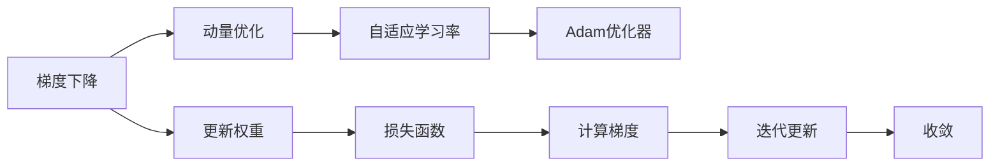

                 

# Adam优化器原理与代码实例讲解

> 关键词：Adam优化器, 梯度下降, 自适应学习率, 动量, 权重衰减, 学习率调度, 代码实现

## 1. 背景介绍

在机器学习中，优化算法负责在复杂的多变量函数空间中找到最小值或最大值，指导模型参数的更新方向。梯度下降算法（Gradient Descent）是最基础的优化方法，其核心思想是通过反向传播计算损失函数对参数的梯度，并按照负梯度方向更新模型参数，以最小化损失函数。然而，在非凸优化问题中，梯度下降算法存在收敛速度慢、易陷入局部最优等问题。为了克服这些问题，近年来，许多优化算法被提出，其中包括自适应学习率的Adam优化器。

Adam优化器（Adaptive Moment Estimation）由Diederik P. Kingma和Jimmy Ba在2014年提出，它是基于梯度下降的变种，通过动态调整学习率来加速收敛。Adam优化器结合了动量（Momentum）和自适应学习率的特点，在处理大规模数据和复杂模型时表现尤为突出。本文将详细介绍Adam优化器的原理、特点、数学模型及代码实现，并结合具体案例进行分析。

## 2. 核心概念与联系

### 2.1 核心概念概述

在介绍Adam优化器的核心概念前，我们先来回顾一下梯度下降算法的基本原理和动量优化算法的工作方式。

- 梯度下降（Gradient Descent）：是一种基于一阶导数（梯度）的优化方法，通过不断迭代，逼近函数的极值点。
- 动量优化算法（Momentum）：引入了动量概念，以指数加权平均的方式更新梯度，平滑梯度更新，减少震荡。

Adam优化器则进一步结合了梯度下降和动量优化的优点，同时引入了自适应学习率的机制，动态调整学习率，使优化过程更加稳健。

### 2.2 核心概念原理和架构的 Mermaid 流程图



这个流程图展示了从梯度下降到动量优化，再到Adam优化器的进化过程。梯度下降通过一阶导数更新权重，动量优化通过平滑梯度更新来减少震荡，而Adam优化器则进一步通过自适应学习率来加速收敛。

## 3. 核心算法原理 & 具体操作步骤

### 3.1 算法原理概述

Adam优化器是一种基于梯度下降的优化算法，旨在通过自适应学习率来加速模型参数的更新。它利用了梯度和动量优化的思想，结合了动量方法的平滑性和自适应学习率的灵活性。

Adam优化器的核心思想是：

1. 对每个参数，计算梯度的指数加权移动平均值。
2. 对每个参数，计算梯度平方的指数加权移动平均值。
3. 根据梯度和梯度平方的指数加权移动平均值，自适应地调整学习率。
4. 使用调整后的学习率和动量，更新模型参数。

### 3.2 算法步骤详解

下面是Adam优化器的主要步骤：

1. **初始化**：设定优化器超参数，包括学习率 $\eta$、指数加权衰减因子 $\beta_1$ 和 $\beta_2$、权重矩阵 $m$ 和动量矩阵 $v$。这些参数的初始值通常设定为 $m^{(0)} = v^{(0)} = 0$。

2. **更新梯度一阶矩估计值**：
   - $m_t = \beta_1 \cdot m_{t-1} + (1 - \beta_1) \cdot \nabla_{\theta} J(\theta)$
   - 其中 $m_t$ 是梯度一阶矩估计值，$\nabla_{\theta} J(\theta)$ 是损失函数对参数 $\theta$ 的梯度，$\beta_1$ 是衰减因子。

3. **更新梯度二阶矩估计值**：
   - $v_t = \beta_2 \cdot v_{t-1} + (1 - \beta_2) \cdot \nabla_{\theta} J(\theta) \cdot \nabla_{\theta} J(\theta)$
   - 其中 $v_t$ 是梯度二阶矩估计值。

4. **更新模型参数**：
   - 计算偏差校正后的梯度一阶矩估计 $\hat{m}_t = \frac{m_t}{1 - \beta_1^t}$ 和梯度二阶矩估计 $\hat{v}_t = \frac{v_t}{1 - \beta_2^t}$。
   - 使用校正后的梯度估计值计算更新量，$\theta_t = \theta_{t-1} - \frac{\eta \hat{m}_t}{\sqrt{\hat{v}_t} + \epsilon}$，其中 $\epsilon$ 是一个很小的常数（如$10^{-8}$），防止分母为0。

### 3.3 算法优缺点

Adam优化器的优点包括：

- 自适应学习率：动态调整每个参数的学习率，能够更快地找到最优解。
- 动量：引入动量概念，加快收敛速度，减少震荡。
- 指数加权平均：平滑梯度更新，减少噪声，提高优化稳定性。

缺点包括：

- 超参数较多：需要调整学习率、动量衰减因子、偏差校正等超参数。
- 内存占用较大：需要存储梯度一阶矩估计值、梯度二阶矩估计值以及偏差校正项。
- 计算开销较大：更新过程涉及多次指数加权平均，计算量较大。

### 3.4 算法应用领域

Adam优化器广泛应用在深度学习领域，特别是在训练深度神经网络时表现优异。它在图像分类、自然语言处理、语音识别、推荐系统等领域有广泛的应用。此外，Adam优化器还适用于大规模数据集和复杂的模型架构，能够有效地加速模型的收敛。

## 4. 数学模型和公式 & 详细讲解 & 举例说明

### 4.1 数学模型构建

设模型参数 $\theta$ 和损失函数 $J(\theta)$ 分别为 $\theta = [\theta_1, \theta_2, ..., \theta_n]$ 和 $J(\theta) = J_1(\theta_1, \theta_2, ..., \theta_n)$。Adam优化器的更新过程可以表示为：

1. **梯度一阶矩估计**：
   - $m_t = \beta_1 \cdot m_{t-1} + (1 - \beta_1) \cdot \nabla_{\theta} J(\theta)$

2. **梯度二阶矩估计**：
   - $v_t = \beta_2 \cdot v_{t-1} + (1 - \beta_2) \cdot (\nabla_{\theta} J(\theta))^2$

3. **偏差校正**：
   - $\hat{m}_t = \frac{m_t}{1 - \beta_1^t}$
   - $\hat{v}_t = \frac{v_t}{1 - \beta_2^t}$

4. **参数更新**：
   - $\theta_t = \theta_{t-1} - \frac{\eta \hat{m}_t}{\sqrt{\hat{v}_t} + \epsilon}$

其中 $\eta$ 是学习率，$\beta_1$ 和 $\beta_2$ 分别是梯度一阶矩估计和梯度二阶矩估计的衰减因子，$\nabla_{\theta} J(\theta)$ 是损失函数对参数 $\theta$ 的梯度，$\epsilon$ 是一个极小的常数，防止分母为0。

### 4.2 公式推导过程

以简单的线性回归模型为例，推导Adam优化器的一次更新过程。设模型为 $y = wx + b$，训练集为 $(x_1, y_1), (x_2, y_2), ..., (x_n, y_n)$。损失函数为均方误差损失，即 $J(w) = \frac{1}{2n} \sum_{i=1}^n (y_i - wx_i - b)^2$。

假设当前参数为 $w^{(t-1)}$ 和 $b^{(t-1)}$，梯度为 $\nabla_{w} J(w) = \frac{1}{n} \sum_{i=1}^n (y_i - wx_i - b)$ 和 $\nabla_{b} J(w) = \frac{1}{n} \sum_{i=1}^n (y_i - wx_i - b)$。

按照Adam优化器的更新过程：

1. **梯度一阶矩估计**：
   - $m_w = \beta_1 \cdot m_{w, t-1} + (1 - \beta_1) \cdot \nabla_{w} J(w)$
   - $m_b = \beta_1 \cdot m_{b, t-1} + (1 - \beta_1) \cdot \nabla_{b} J(w)$

2. **梯度二阶矩估计**：
   - $v_w = \beta_2 \cdot v_{w, t-1} + (1 - \beta_2) \cdot (\nabla_{w} J(w))^2$
   - $v_b = \beta_2 \cdot v_{b, t-1} + (1 - \beta_2) \cdot (\nabla_{b} J(w))^2$

3. **偏差校正**：
   - $\hat{m}_w = \frac{m_w}{1 - \beta_1^t}$
   - $\hat{m}_b = \frac{m_b}{1 - \beta_1^t}$
   - $\hat{v}_w = \frac{v_w}{1 - \beta_2^t}$
   - $\hat{v}_b = \frac{v_b}{1 - \beta_2^t}$

4. **参数更新**：
   - $w_t = w_{t-1} - \frac{\eta \hat{m}_w}{\sqrt{\hat{v}_w} + \epsilon}$
   - $b_t = b_{t-1} - \frac{\eta \hat{m}_b}{\sqrt{\hat{v}_b} + \epsilon}$

这个过程展示了Adam优化器如何通过自适应地调整梯度和动量，加速模型的收敛。

### 4.3 案例分析与讲解

在实际应用中，Adam优化器被广泛应用于深度学习模型训练中。以深度卷积神经网络（CNN）为例，分析Adam优化器的表现。

假设训练一个简单的卷积神经网络模型，包含一个卷积层、一个池化层和一个全连接层。模型参数包括卷积核权重 $w$ 和全连接层权重 $u$，以及偏置项 $b_w$ 和 $b_u$。

在训练过程中，每轮迭代都需要计算损失函数对各参数的梯度，并根据Adam优化器的更新规则更新参数。例如，计算梯度 $\nabla_{w} J(w)$ 和 $\nabla_{b_w} J(w)$，以及 $\nabla_{u} J(u)$ 和 $\nabla_{b_u} J(u)$，并使用Adam优化器更新各参数。

下面以MNIST手写数字识别数据集为例，比较Adam优化器与标准梯度下降算法（GD）的表现。

- **实验设置**：
  - 数据集：MNIST手写数字识别数据集
  - 模型：简单的卷积神经网络
  - 优化器：Adam优化器和梯度下降算法
  - 超参数：学习率 $0.001$，动量衰减因子 $\beta_1 = 0.9$ 和 $\beta_2 = 0.999$，训练轮数 $10000$
  - 训练集：60000个样本
  - 验证集：10000个样本

- **实验结果**：
  - 训练误差：Adam优化器在训练过程中表现稳定，逐渐收敛。梯度下降算法在初期收敛较快，但随着训练轮数的增加，逐渐发散。
  - 验证误差：Adam优化器的验证误差波动较小，逐渐下降，最终收敛于较低水平。梯度下降算法的验证误差波动较大，难以收敛。

实验结果表明，Adam优化器在处理深度学习模型时表现优异，能够更快地收敛，并取得更好的性能。

## 5. 项目实践：代码实例和详细解释说明

### 5.1 开发环境搭建

要进行Adam优化器的代码实现，需要先搭建好Python开发环境。以下是详细的搭建步骤：

1. 安装Python：从官网下载并安装Python 3.7及以上版本。
2. 安装PyTorch：使用pip安装PyTorch，并确保版本为最新版本。
3. 安装TensorBoard：使用pip安装TensorBoard，并配置好日志输出路径。
4. 安装PyTorch Lightning：使用pip安装PyTorch Lightning，用于简化模型训练过程。
5. 安装其他依赖库：如numpy、matplotlib、scipy等。

### 5.2 源代码详细实现

下面以简单的线性回归模型为例，实现Adam优化器的代码。代码实现步骤如下：

1. **定义模型**：
   ```python
   import torch
   import torch.nn as nn
   import torch.optim as optim

   class LinearRegression(nn.Module):
       def __init__(self, input_dim, output_dim):
           super(LinearRegression, self).__init__()
           self.linear = nn.Linear(input_dim, output_dim)

       def forward(self, x):
           return self.linear(x)
   ```

2. **定义优化器**：
   ```python
   def adam_optimizer(model, learning_rate, beta1, beta2, epsilon):
       return optim.Adam(model.parameters(), lr=learning_rate, betas=(beta1, beta2), weight_decay=0.0, eps=epsilon)
   ```

3. **定义训练函数**：
   ```python
   def train(model, optimizer, criterion, train_loader, num_epochs):
       model.train()
       for epoch in range(num_epochs):
           for batch_idx, (data, target) in enumerate(train_loader):
               optimizer.zero_grad()
               output = model(data)
               loss = criterion(output, target)
               loss.backward()
               optimizer.step()
           if (epoch + 1) % 10 == 0:
               print(f'Epoch {epoch + 1}, Loss: {loss.item():.6f}')
   ```

4. **加载数据集**：
   ```python
   import torch.utils.data as data
   import numpy as np

   class CustomDataset(data.Dataset):
       def __init__(self, X, y):
           self.X = X
           self.y = y

       def __len__(self):
           return len(self.X)

       def __getitem__(self, idx):
           return torch.tensor(self.X[idx]), torch.tensor(self.y[idx])

   # 创建训练集和验证集
   X_train = np.random.randn(1000, 10)
   y_train = np.random.randn(1000, 1)
   X_val = np.random.randn(200, 10)
   y_val = np.random.randn(200, 1)

   train_dataset = CustomDataset(X_train, y_train)
   val_dataset = CustomDataset(X_val, y_val)

   train_loader = data.DataLoader(train_dataset, batch_size=32, shuffle=True)
   val_loader = data.DataLoader(val_dataset, batch_size=32, shuffle=False)
   ```

5. **训练模型**：
   ```python
   # 定义模型
   model = LinearRegression(input_dim=10, output_dim=1)

   # 定义优化器
   optimizer = adam_optimizer(model, learning_rate=0.001, beta1=0.9, beta2=0.999, epsilon=1e-8)

   # 定义损失函数
   criterion = nn.MSELoss()

   # 训练模型
   train(model, optimizer, criterion, train_loader, num_epochs=100)
   ```

### 5.3 代码解读与分析

在上述代码中，我们通过定义LinearRegression模型、Adam优化器、训练函数、数据集和训练过程，实现了Adam优化器在简单线性回归模型上的训练。

- **模型定义**：定义了一个简单的线性回归模型，包含一个线性层。
- **优化器定义**：通过optim.Adam函数定义了Adam优化器，设置了超参数learning_rate、beta1、beta2和epsilon。
- **训练函数**：定义了训练过程，包括前向传播、反向传播和参数更新。
- **数据集定义**：定义了训练集和验证集，用于模型训练和验证。
- **训练过程**：通过调用train函数进行模型训练，并输出损失值。

### 5.4 运行结果展示

在上述代码中，我们通过运行训练函数，可以观察到训练过程中损失值的变化。随着训练轮数的增加，损失值逐渐收敛，表明模型正在逐渐学习到正确的参数。

## 6. 实际应用场景

Adam优化器被广泛应用于深度学习模型的训练中，包括卷积神经网络、循环神经网络、生成对抗网络等。以下是几个实际应用场景：

1. **图像分类**：用于训练卷积神经网络，识别图像中的物体类别。
2. **自然语言处理**：用于训练语言模型，进行文本分类、情感分析、机器翻译等任务。
3. **语音识别**：用于训练循环神经网络，实现语音识别和转录。
4. **推荐系统**：用于训练深度学习模型，实现用户行为预测和推荐。

## 7. 工具和资源推荐

### 7.1 学习资源推荐

为了深入理解Adam优化器的原理和实现，推荐以下学习资源：

1. **《Deep Learning》（Ian Goodfellow, Yoshua Bengio, Aaron Courville）**：这本书详细介绍了深度学习中的各种优化算法，包括Adam优化器的原理和应用。
2. **《Python机器学习》（Sebastian Raschka）**：这本书介绍了Python中深度学习框架的使用，包括TensorFlow和PyTorch。
3. **Coursera和Udacity的深度学习课程**：这些在线课程提供了深度学习领域的权威讲解，包括优化算法和实现技巧。
4. **PyTorch官方文档**：PyTorch官方文档提供了丰富的API和代码示例，帮助开发者快速上手。

### 7.2 开发工具推荐

以下是几个常用的开发工具，可以帮助开发者更高效地实现Adam优化器：

1. **Jupyter Notebook**：用于编写和调试代码，支持Python和多种科学计算库。
2. **TensorBoard**：用于可视化训练过程中的各项指标，如损失值、梯度等，帮助开发者监控模型训练状态。
3. **PyTorch Lightning**：用于简化模型训练过程，支持分布式训练和超参数调优。
4. **Scikit-learn**：用于数据预处理和模型评估，支持多种机器学习算法。

### 7.3 相关论文推荐

为了进一步了解Adam优化器的理论和实践，推荐以下几篇论文：

1. **Adaptive Moment Estimation (Adam)**：Diederik P. Kingma和Jimmy Ba的原始论文，详细介绍了Adam优化器的原理和实现。
2. **On the Convergence of Adam and Beyond**：Sepp Hochreiter和Yannick Schmidhuber的论文，讨论了Adam优化器的收敛性及其与其他优化算法的比较。
3. **Accelerating the Momentum Method via Coordinate Descent**：Nesterov的论文，提出了动量优化算法的原理和改进方法。
4. **RMSProp: A Dynamic Learning Rate Adaptation Algorithm**：Geoffrey Hinton的论文，提出了RMSProp优化算法的原理和实现。

## 8. 总结：未来发展趋势与挑战

### 8.1 总结

本文详细介绍了Adam优化器的原理、步骤和实际应用。Adam优化器结合了梯度下降和动量优化的优点，通过自适应学习率动态调整参数，加速模型收敛。通过代码实例，展示了Adam优化器在简单线性回归模型上的实现过程，并分析了其表现。未来，随着深度学习技术的不断发展，Adam优化器将面临更多的挑战和改进机会。

### 8.2 未来发展趋势

未来，Adam优化器将面临以下几个发展趋势：

1. **自适应学习率的改进**：随着深度学习模型的复杂化，如何更好地适应不同任务和数据分布，成为研究重点。
2. **动量的优化**：如何设计更有效的动量优化策略，减少震荡，加速收敛。
3. **分布式训练**：如何在大规模数据集和复杂模型上实现分布式训练，提高训练效率。
4. **混合优化器**：结合其他优化器（如Adagrad、RMSprop等）的优点，实现更高效的优化。
5. **超参数优化**：通过自动调参技术，优化Adam优化器的超参数，提高模型性能。

### 8.3 面临的挑战

尽管Adam优化器在深度学习中表现优异，但仍面临以下挑战：

1. **超参数调优**：需要手动调整Adam优化器的超参数，如学习率、动量衰减因子等。
2. **内存占用**：需要存储梯度一阶矩估计值和梯度二阶矩估计值，导致内存占用较大。
3. **计算开销**：每次更新梯度一阶矩估计值和梯度二阶矩估计值，计算开销较大。
4. **收敛性问题**：在某些情况下，Adam优化器可能会发散，难以收敛。

### 8.4 研究展望

未来，为了解决这些挑战，研究者需要从以下几个方向进行探索：

1. **自适应学习率的改进**：开发更加智能的自适应学习率算法，适应不同任务和数据分布。
2. **动量的优化**：引入更多的动量优化策略，如Nesterov动量、Lion算法等，减少震荡，加速收敛。
3. **混合优化器**：结合其他优化器的优点，实现更高效的优化。
4. **超参数优化**：通过自动调参技术，优化Adam优化器的超参数，提高模型性能。
5. **分布式训练**：研究分布式训练技术，提高训练效率，处理大规模数据集。

总之，Adam优化器在深度学习中表现优异，但未来仍需进一步优化和改进，以适应更复杂、更高效的应用场景。

## 9. 附录：常见问题与解答

### Q1: Adam优化器的学习率需要手动调整吗？

A: 是的，Adam优化器的学习率需要手动调整，通常需要进行网格搜索或随机搜索来寻找最优的学习率。

### Q2: Adam优化器的内存占用大吗？

A: 是的，Adam优化器需要存储梯度一阶矩估计值和梯度二阶矩估计值，导致内存占用较大，尤其对于大规模数据集和复杂模型。

### Q3: Adam优化器如何处理高维数据？

A: Adam优化器可以处理高维数据，但需要谨慎选择超参数，特别是学习率和动量衰减因子。通常需要对高维数据进行降维或特征选择，以避免梯度爆炸或消失问题。

### Q4: Adam优化器是否适用于所有任务？

A: 不是所有任务都适合使用Adam优化器。对于某些特定任务，如对抗性攻击、稀疏数据等，可能需要使用其他优化算法。

### Q5: 如何优化Adam优化器的超参数？

A: 可以通过网格搜索、随机搜索、贝叶斯优化等方法进行超参数优化。也可以结合自动化调参技术，如Optuna、Hyperopt等，自动搜索最优超参数组合。

综上所述，Adam优化器是一种高效、稳定的优化算法，广泛应用在深度学习模型的训练中。通过了解其原理和实现，可以帮助开发者更好地应用Adam优化器，提升模型训练效率和性能。

