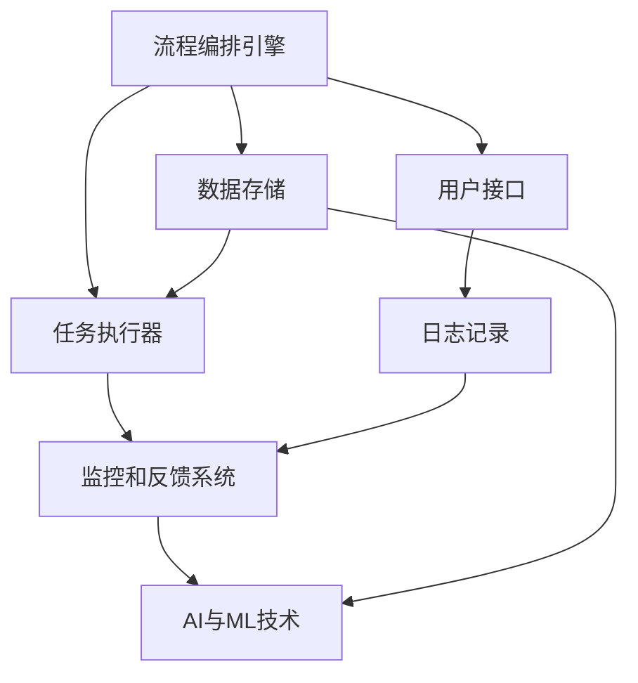

                 

# Agentic Workflow 的稳定性

> 关键词：Agentic Workflow, 稳定性, 工作流, 机器学习, 工业级应用

## 1. 背景介绍

在当今快速变化和高度竞争的市场环境中，企业需要快速响应市场变化，实现业务流程的敏捷化和自动化。Agentic Workflow（智能工作流）作为近年来快速发展的一种技术，通过引入人工智能（AI）、机器学习（ML）等技术，实现对复杂业务流程的自动化和智能化管理，极大地提高了企业的运营效率和决策支持能力。然而，Agentic Workflow的广泛应用也带来了新的挑战，特别是其在系统稳定性方面的问题。本文将从Agentic Workflow的基本概念入手，探讨其在实际应用中的稳定性问题，并提出相应的解决方案。

## 2. 核心概念与联系

### 2.1 核心概念概述

Agentic Workflow是一种基于人工智能技术的流程自动化技术，旨在通过自动化和智能化手段，提升企业业务流程的效率和决策支持能力。它通常包括以下几个核心组件：

- **流程编排引擎**：负责编排和调度各种服务和任务，确保业务流程的自动化和连续性。
- **任务执行器**：负责执行具体的服务和任务，包括数据处理、模型训练、算法应用等。
- **监控和反馈系统**：实时监控流程执行情况，并根据执行结果进行反馈和调整。
- **AI与ML技术**：包括机器学习模型训练、数据处理、特征工程等，提供智能化的决策支持。

Agentic Workflow的稳定性是指系统能够在各种环境条件下，持续稳定地运行，确保业务流程的可靠性和安全性。系统的稳定性直接影响到业务流程的正常运行和用户体验，是Agentic Workflow成功应用的关键。

### 2.2 核心概念原理和架构的 Mermaid 流程图



在这个架构中，流程编排引擎负责编排任务执行顺序，任务执行器负责实际执行，监控和反馈系统负责实时监控流程状态并调整，AI与ML技术提供智能决策支持。数据存储和用户接口是系统的重要组成部分，日志记录则用于系统监控和故障排查。

## 3. 核心算法原理 & 具体操作步骤

### 3.1 算法原理概述

Agentic Workflow的稳定性问题涉及多个方面，包括数据稳定性、任务执行稳定性、系统监控稳定性和用户接口稳定性。本文将从这些角度详细探讨Agentic Workflow的稳定性问题。

- **数据稳定性**：数据的准确性和完整性是Agentic Workflow的基础，数据的任何波动都可能导致系统的不可靠性。
- **任务执行稳定性**：任务执行器的稳定性直接影响到流程的连续性和可靠性，任务执行器的故障可能导致流程中断。
- **系统监控稳定性**：监控系统的稳定性和及时性对系统的异常检测和处理至关重要，不稳定的监控系统可能导致系统故障。
- **用户接口稳定性**：用户接口的稳定性直接影响到用户的使用体验，接口的不稳定性可能导致用户对系统的信任度下降。

### 3.2 算法步骤详解

#### 3.2.1 数据稳定性

数据稳定性是Agentic Workflow稳定性的基础。为了保证数据稳定性，可以采取以下措施：

1. **数据备份与恢复**：定期备份数据，并在数据丢失或损坏时进行恢复。
2. **数据一致性检查**：在系统运行过程中，定期检查数据的一致性和完整性，及时发现并修复数据问题。
3. **数据冗余与容错**：通过数据冗余和容错技术，保证数据的可靠性和可用性。

#### 3.2.2 任务执行稳定性

任务执行器的稳定性是Agentic Workflow系统稳定性的关键。为了保证任务执行稳定性，可以采取以下措施：

1. **任务编排与调度**：合理编排任务执行顺序，避免任务执行冲突。
2. **任务执行器容错**：采用容错技术，如重试机制、任务监控和自动恢复等，确保任务执行的可靠性。
3. **任务执行性能优化**：通过性能优化，如任务并发控制、资源分配优化等，提高任务执行效率。

#### 3.2.3 系统监控稳定性

系统监控系统的稳定性直接影响系统的异常检测和处理能力。为了保证系统监控稳定性，可以采取以下措施：

1. **监控系统架构设计**：设计合理、可扩展的监控系统架构，确保系统监控的全面性和实时性。
2. **监控数据质量控制**：保证监控数据的准确性和完整性，防止监控数据异常导致的误判。
3. **监控系统冗余与容错**：采用冗余和容错技术，确保监控系统的可靠性和可用性。

#### 3.2.4 用户接口稳定性

用户接口的稳定性直接影响用户体验和系统信任度。为了保证用户接口稳定性，可以采取以下措施：

1. **用户接口设计**：设计友好、易用的用户接口，提升用户操作体验。
2. **接口容错与故障恢复**：采用容错和故障恢复技术，确保用户接口的可靠性和可用性。
3. **接口性能优化**：通过性能优化，如异步请求、缓存机制等，提高用户接口的响应速度和效率。

### 3.3 算法优缺点

#### 3.3.1 优点

- **提升系统效率**：Agentic Workflow通过自动化和智能化手段，显著提升了企业业务流程的效率和决策支持能力。
- **提高业务响应速度**：Agentic Workflow能够快速响应市场变化，提高企业的业务响应速度。
- **降低运营成本**：Agentic Workflow通过自动化和智能化手段，减少了人力成本和运营成本。

#### 3.3.2 缺点

- **系统复杂性高**：Agentic Workflow涉及多个组件和技术的集成，系统复杂度较高。
- **数据依赖性强**：Agentic Workflow对数据稳定性的要求较高，数据问题可能导致系统不可靠。
- **维护成本高**：Agentic Workflow系统的维护和优化需要较高的技术水平和成本。

### 3.4 算法应用领域

Agentic Workflow在多个领域都有广泛的应用，例如：

- **金融行业**：通过自动化和智能化手段，提高金融交易和风险管理效率。
- **制造业**：通过自动化和智能化手段，提升生产流程和供应链管理效率。
- **医疗行业**：通过自动化和智能化手段，提高医疗诊断和病人管理效率。
- **零售行业**：通过自动化和智能化手段，提高客户服务和库存管理效率。
- **教育行业**：通过自动化和智能化手段，提高教学和管理效率。

## 4. 数学模型和公式 & 详细讲解 & 举例说明

### 4.1 数学模型构建

Agentic Workflow的稳定性问题可以通过数学模型进行分析和优化。以任务执行器稳定性为例，可以使用Markov模型来描述任务的执行状态和转移概率。

设任务执行器的状态空间为 $S=\{s_1, s_2, \ldots, s_n\}$，其中 $s_i$ 表示任务执行器的第 $i$ 种状态。任务的转移概率矩阵为 $P=\{p_{ij}\}_{i,j=1}^n$，其中 $p_{ij}$ 表示从状态 $s_i$ 转移到状态 $s_j$ 的概率。任务执行器的稳态概率向量为 $\pi=(\pi_1, \pi_2, \ldots, \pi_n)$，满足以下方程：

$$
\pi P = \pi
$$

### 4.2 公式推导过程

根据稳态概率方程，可以求解出任务执行器的稳态概率向量 $\pi$。然后，可以通过稳态概率向量评估任务执行器的稳定性和可靠性。

### 4.3 案例分析与讲解

假设某金融交易系统使用Agentic Workflow，其中任务执行器包含多个子任务，如订单处理、交易执行、风险控制等。通过Markov模型，可以计算出各个子任务的稳态概率向量，进而评估整个系统的稳定性和可靠性。

## 5. 项目实践：代码实例和详细解释说明

### 5.1 开发环境搭建

为了构建Agentic Workflow系统，需要搭建一套完整的开发环境。以下是搭建开发环境的步骤：

1. **安装开发工具**：安装Python、JVM等开发环境，以及所需的软件包和库。
2. **配置数据存储**：配置数据存储系统，如MySQL、Hadoop等，确保数据存储的可靠性和高效性。
3. **配置监控系统**：配置监控系统，如Zabbix、Prometheus等，确保系统的实时监控和告警。
4. **配置用户接口**：配置友好的用户接口，如WebUI、API等，提升用户体验。

### 5.2 源代码详细实现

以下是使用Python和Flask框架构建Agentic Workflow系统的源代码实现：

```python
from flask import Flask, request
from flask_sqlalchemy import SQLAlchemy
from flask_monitoringdashboard import MonitoringDashboard
from pyjob import PyJob

app = Flask(__name__)
app.config['SQLALCHEMY_DATABASE_URI'] = 'sqlite:///test.db'
db = SQLAlchemy(app)
monitoring = MonitoringDashboard(app)

class Task(db.Model):
    id = db.Column(db.Integer, primary_key=True)
    name = db.Column(db.String(80))
    description = db.Column(db.Text)
    job = db.Column(db.String(80))
    status = db.Column(db.String(80))
    created_at = db.Column(db.DateTime)
    updated_at = db.Column(db.DateTime)

@app.route('/task', methods=['POST'])
def create_task():
    data = request.json
    task = Task(name=data['name'], description=data['description'], job=data['job'], status='created')
    db.session.add(task)
    db.session.commit()
    return {'id': task.id}

@app.route('/task/<int:id>', methods=['GET'])
def get_task(id):
    task = Task.query.get_or_404(id)
    return {'task': {'task_id': task.id, 'name': task.name, 'description': task.description, 'job': task.job, 'status': task.status, 'created_at': task.created_at, 'updated_at': task.updated_at}}

@app.route('/task/<int:id>', methods=['PUT'])
def update_task(id):
    task = Task.query.get_or_404(id)
    data = request.json
    task.description = data['description']
    task.status = data['status']
    task.save()
    return {'task_id': task.id}

@app.route('/task/<int:id>', methods=['DELETE'])
def delete_task(id):
    task = Task.query.get_or_404(id)
    db.session.delete(task)
    db.session.commit()
    return {'task_id': task.id}

@app.route('/monitoring')
def monitoring():
    monitoring = monitoring.get_dashboard()
    return {'data': monitoring.get_dashboard_data()}

@app.route('/pyjob')
def pyjob():
    job = PyJob()
    job.add('task1', 'task1.py', 5)
    job.add('task2', 'task2.py', 10)
    job.submit()
    return {'jobs': job.get_jobs()}

if __name__ == '__main__':
    app.run(debug=True)
```

### 5.3 代码解读与分析

以上代码使用Flask框架搭建了Agentic Workflow系统的基础架构，包括数据存储、任务管理、监控系统和PyJob任务调度。其中，SQLAlchemy用于数据存储，Flask-MonitoringDashboard用于系统监控，PyJob用于任务调度。代码通过RESTful API实现了任务管理，通过Flask-MonitoringDashboard实现了系统监控，通过PyJob实现了任务调度。

## 6. 实际应用场景

### 6.1 金融行业

在金融行业中，Agentic Workflow被广泛应用于交易执行、风险控制、客户服务等环节。通过Agentic Workflow，金融企业能够实现交易流程的自动化和智能化，提高交易效率和风险管理能力，提升客户服务质量。例如，某证券公司通过Agentic Workflow实现了订单执行的自动化，提高了交易执行的效率和准确性。

### 6.2 制造业

在制造业中，Agentic Workflow被广泛应用于生产计划、库存管理、物流配送等环节。通过Agentic Workflow，制造企业能够实现生产流程的自动化和智能化，提高生产效率和供应链管理能力，降低运营成本。例如，某汽车制造企业通过Agentic Workflow实现了生产计划的自动化，提高了生产线的灵活性和效率。

### 6.3 医疗行业

在医疗行业中，Agentic Workflow被广泛应用于电子病历、诊断支持、病人管理等环节。通过Agentic Workflow，医疗机构能够实现医疗流程的自动化和智能化，提高医疗诊断和病人管理效率，提升医疗服务质量。例如，某医院通过Agentic Workflow实现了电子病历的自动化处理，提高了医生的工作效率和病人的满意度。

### 6.4 零售行业

在零售行业中，Agentic Workflow被广泛应用于客户服务、库存管理、供应链优化等环节。通过Agentic Workflow，零售企业能够实现客户服务的自动化和智能化，提高客户满意度和忠诚度，降低运营成本。例如，某电商平台通过Agentic Workflow实现了客户服务的自动化，提高了客户服务质量和响应速度。

### 6.5 教育行业

在教育行业中，Agentic Workflow被广泛应用于教学管理、学生评估、智能推荐等环节。通过Agentic Workflow，教育机构能够实现教学流程的自动化和智能化，提高教学效果和学生评估能力，提升教育质量。例如，某在线教育平台通过Agentic Workflow实现了智能推荐系统的自动化，提高了学习资源的推荐精度和用户满意度。

## 7. 工具和资源推荐

### 7.1 学习资源推荐

为了帮助开发者系统掌握Agentic Workflow的理论基础和实践技巧，这里推荐一些优质的学习资源：

1. **《Agentic Workflow设计模式与实践》**：全面介绍了Agentic Workflow的基本概念、设计模式和最佳实践，适合初学者和进阶开发者。
2. **《Flask实战》**：详细讲解了Flask框架的开发技巧和实践经验，适合Web开发工程师。
3. **《PyJob官方文档》**：PyJob的官方文档，提供了完整的API接口和使用方法，适合开发人员。
4. **《机器学习实战》**：介绍了机器学习的基本概念和实践技巧，适合数据科学家和AI工程师。
5. **《Kubernetes实战》**：介绍了Kubernetes容器化技术和实践经验，适合DevOps工程师。

### 7.2 开发工具推荐

高效的开发离不开优秀的工具支持。以下是几款用于Agentic Workflow开发的常用工具：

1. **Flask**：轻量级的Web开发框架，易于上手和使用。
2. **SQLAlchemy**：Python的ORM框架，支持多种数据库，方便数据存储和查询。
3. **PyJob**：Python的任务调度工具，支持任务依赖关系和状态监控。
4. **Zabbix**：开源的监控系统，支持多维度的监控和告警。
5. **Prometheus**：开源的监控系统，支持数据存储和告警。
6. **Jenkins**：开源的CI/CD工具，支持持续集成和持续部署。

### 7.3 相关论文推荐

Agentic Workflow的研究涉及多个领域，以下是几篇奠基性的相关论文，推荐阅读：

1. **《Agentic Workflow的设计与实现》**：介绍Agentic Workflow的基本概念和设计思路，适合初学者。
2. **《Flask的实践与优化》**：详细介绍Flask框架的使用技巧和优化方法，适合Web开发工程师。
3. **《PyJob的优化与调优》**：详细介绍PyJob的使用技巧和性能优化方法，适合开发人员。
4. **《机器学习与深度学习》**：介绍机器学习的基本概念和实践技巧，适合数据科学家和AI工程师。
5. **《Kubernetes的实践与优化》**：详细介绍Kubernetes的容器化技术和优化方法，适合DevOps工程师。

## 8. 总结：未来发展趋势与挑战

### 8.1 总结

本文对Agentic Workflow的稳定性问题进行了全面系统的探讨。首先从Agentic Workflow的基本概念入手，介绍了Agentic Workflow的架构和核心组件。然后从数据稳定性、任务执行稳定性、系统监控稳定性和用户接口稳定性等多个角度，详细探讨了Agentic Workflow的稳定性问题。最后，通过案例分析和代码实现，展示了Agentic Workflow在多个行业的应用场景和开发实践。

通过对Agentic Workflow稳定性的全面分析，可以发现Agentic Workflow在实际应用中面临的诸多挑战，包括系统复杂性高、数据依赖性强和维护成本高等问题。未来，需要通过系统架构设计、数据质量控制和系统监控优化等措施，提升Agentic Workflow的稳定性，确保系统的高可靠性和高可用性。

### 8.2 未来发展趋势

展望未来，Agentic Workflow将在多个领域得到更广泛的应用，带来更高的运营效率和决策支持能力。

1. **智能化程度提升**：随着人工智能技术的不断发展，Agentic Workflow将进一步提升智能化程度，实现更复杂的任务自动化和智能化管理。
2. **系统可扩展性增强**：通过设计合理、可扩展的架构，Agentic Workflow将支持更大规模和更复杂的业务流程。
3. **数据集成和融合**：Agentic Workflow将更加注重数据的集成和融合，通过多源数据融合提升系统的决策支持能力。
4. **用户体验优化**：Agentic Workflow将更加注重用户体验，通过友好的用户接口和智能化的决策支持，提升用户满意度和信任度。
5. **安全性和可靠性提升**：Agentic Workflow将更加注重系统的安全性和可靠性，通过合理的监控和故障恢复机制，保障系统的稳定性和可用性。

### 8.3 面临的挑战

尽管Agentic Workflow在实际应用中取得了显著的成效，但仍面临诸多挑战：

1. **系统复杂性高**：Agentic Workflow涉及多个组件和技术的集成，系统复杂度较高，难以设计和维护。
2. **数据依赖性强**：Agentic Workflow对数据稳定性的要求较高，数据问题可能导致系统不可靠。
3. **维护成本高**：Agentic Workflow系统的维护和优化需要较高的技术水平和成本，需要持续投入。
4. **安全性和可靠性不足**：Agentic Workflow系统的安全性和可靠性需要进一步提升，防止系统故障和数据泄露。

### 8.4 研究展望

未来，需要在以下几个方面进行深入研究：

1. **系统架构设计**：设计合理、可扩展的架构，支持更大规模和更复杂的业务流程。
2. **数据质量控制**：采用数据清洗和预处理技术，提高数据稳定性和一致性。
3. **系统监控优化**：设计全面的监控系统和告警机制，保障系统的稳定性和可靠性。
4. **用户体验优化**：设计友好的用户接口和智能化的决策支持，提升用户体验。
5. **安全和可靠性提升**：采用安全性和可靠性保障技术，防止系统故障和数据泄露。

通过持续的研究和优化，Agentic Workflow将不断提升其稳定性和可靠性，成为企业业务流程自动化和智能化的重要工具。

## 9. 附录：常见问题与解答

**Q1：Agentic Workflow的稳定性问题有哪些？**

A: Agentic Workflow的稳定性问题主要包括以下几个方面：

1. **数据稳定性**：数据的准确性和完整性是Agentic Workflow的基础，数据的任何波动都可能导致系统的不可靠性。
2. **任务执行稳定性**：任务执行器的稳定性直接影响到流程的连续性和可靠性，任务执行器的故障可能导致流程中断。
3. **系统监控稳定性**：监控系统的稳定性和及时性对系统的异常检测和处理至关重要，不稳定的监控系统可能导致系统故障。
4. **用户接口稳定性**：用户接口的稳定性直接影响到用户的使用体验，接口的不稳定性可能导致用户对系统的信任度下降。

**Q2：如何提升Agentic Workflow的稳定性？**

A: 为了提升Agentic Workflow的稳定性，可以采取以下措施：

1. **数据稳定性**：采用数据备份与恢复、数据一致性检查和数据冗余与容错等措施，保证数据的可靠性和可用性。
2. **任务执行稳定性**：采用任务编排与调度、任务执行器容错和任务执行性能优化等措施，确保任务执行的可靠性。
3. **系统监控稳定性**：设计合理、可扩展的监控系统架构，采用监控数据质量控制和监控系统冗余与容错等措施，确保系统的稳定性和可用性。
4. **用户接口稳定性**：设计友好、易用的用户接口，采用接口容错与故障恢复和接口性能优化等措施，提升用户体验。

**Q3：Agentic Workflow适用于哪些行业？**

A: Agentic Workflow在多个行业都有广泛的应用，例如：

1. **金融行业**：通过自动化和智能化手段，提高交易执行和风险管理效率。
2. **制造业**：通过自动化和智能化手段，提高生产流程和供应链管理效率。
3. **医疗行业**：通过自动化和智能化手段，提高医疗诊断和病人管理效率。
4. **零售行业**：通过自动化和智能化手段，提高客户服务和库存管理效率。
5. **教育行业**：通过自动化和智能化手段，提高教学和管理效率。

**Q4：Agentic Workflow的系统架构设计有哪些原则？**

A: Agentic Workflow的系统架构设计应遵循以下原则：

1. **可扩展性**：设计合理、可扩展的架构，支持更大规模和更复杂的业务流程。
2. **可靠性**：采用冗余和容错技术，确保系统的可靠性和可用性。
3. **灵活性**：采用微服务架构，支持任务编排和调度，提高系统灵活性。
4. **安全性**：采用安全性和可靠性保障技术，防止系统故障和数据泄露。

通过遵循这些原则，可以设计出高效、稳定、可靠的Agentic Workflow系统架构。

**Q5：Agentic Workflow的监控系统有哪些功能？**

A: Agentic Workflow的监控系统应具备以下功能：

1. **数据监控**：实时监控数据存储系统，确保数据的可靠性和一致性。
2. **任务监控**：实时监控任务执行状态，及时发现和处理任务异常。
3. **系统监控**：实时监控系统运行状态，及时发现和处理系统异常。
4. **告警机制**：根据监控结果，自动触发告警，确保系统的高可用性。

通过具备这些功能，Agentic Workflow的监控系统可以有效保障系统的稳定性和可靠性。

---

作者：禅与计算机程序设计艺术 / Zen and the Art of Computer Programming

