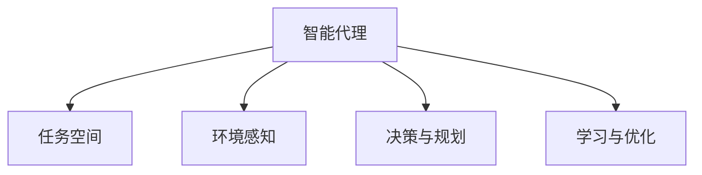

                 

# Agent代理在AI系统中的应用

> 关键词：Agent, 人工智能系统, 自动决策, 自主行为, 智能控制, 任务分配, 机器人, 自然语言处理, 多智能体系统

## 1. 背景介绍

### 1.1 问题由来

随着人工智能技术的快速发展，智能代理(Agent)在现代AI系统中扮演着越来越重要的角色。代理不仅仅是自动化执行任务的工具，它们还能够自主决策和智能控制，实现复杂的任务和交互。在诸如自动驾驶、工业自动化、医疗诊断、智能客服等领域，智能代理已经成为提高效率和解决复杂问题的重要手段。

### 1.2 问题核心关键点

- **智能代理**：自动化执行任务，能够自主决策和智能控制的AI实体。
- **自主行为**：代理无需人工干预，根据环境信息和任务需求自动规划行为。
- **任务分配**：多智能体系统中，代理能够动态分配任务和资源。
- **智能控制**：通过学习优化控制策略，代理能够在复杂环境中表现出最优行为。
- **自然语言处理**：智能代理能够理解和生成自然语言，实现人类与机器的顺畅交互。

## 2. 核心概念与联系

### 2.1 核心概念概述

为了更好地理解智能代理在AI系统中的应用，本节将介绍几个关键概念：

- **智能代理**：自动执行任务，具有自主决策和智能控制的AI实体。
- **任务空间**：代理执行的任务集合，如路径规划、资源调度、异常检测等。
- **环境感知**：代理对周围环境的感知，包括传感器数据、任务状态等。
- **决策与规划**：代理根据任务目标和环境信息制定决策和行动计划。
- **学习与优化**：代理通过学习算法不断优化行为策略，提高任务执行效率。

这些概念之间的逻辑关系可以通过以下Mermaid流程图来展示：



这个流程图展示了一些核心概念及其之间的关系：

1. 智能代理执行任务空间中的具体任务。
2. 代理通过环境感知获取周围信息。
3. 代理根据任务目标和感知信息制定决策和规划。
4. 代理通过学习不断优化行为策略。

## 3. 核心算法原理 & 具体操作步骤
### 3.1 算法原理概述

智能代理在AI系统中的应用通常基于以下核心原理：

- **任务规划**：代理根据任务目标，在任务空间中规划路径和行动策略。
- **环境感知与响应**：代理通过传感器和其他信息源感知环境状态，根据感知结果调整行为。
- **决策与行动**：代理根据任务规划和环境感知结果，制定并执行决策和行动。
- **学习与优化**：代理通过与环境的互动不断学习和优化行为策略。

### 3.2 算法步骤详解

基于智能代理的AI系统一般包括以下关键步骤：

**Step 1: 定义任务和目标**
- 明确代理需要执行的具体任务，如路径规划、异常检测等。
- 设定任务的目标函数，如最小化路径长度、最大化异常检测准确率等。

**Step 2: 设计代理模型**
- 选择合适的代理模型架构，如基于规则的模型、基于深度学习的模型等。
- 设计代理的行为决策逻辑，包括感知、决策和执行等组件。

**Step 3: 实现感知模块**
- 实现代理的环境感知模块，利用传感器和信息源获取环境数据。
- 定义环境感知模型，将原始数据转换为代理能够理解的形式。

**Step 4: 实现决策与行动**
- 设计代理的决策与规划算法，如A*、D*-SPT、Q-learning等。
- 实现代理的行为执行模块，执行决策并产生实际动作。

**Step 5: 学习与优化**
- 选择学习算法，如强化学习、进化算法、贝叶斯优化等。
- 利用环境反馈不断调整代理的行为策略，提高任务执行效果。

**Step 6: 系统集成与测试**
- 将代理模型集成到整体系统中，进行功能测试和性能评估。
- 在实际应用环境中测试代理的性能，调整参数和策略以适应具体场景。

### 3.3 算法优缺点

基于智能代理的AI系统具有以下优点：

1. **高效执行任务**：代理能够自主规划和执行任务，提高效率和灵活性。
2. **增强自主决策**：代理在复杂环境中具备自主决策能力，能够应对突发情况。
3. **适应性强**：代理通过学习不断优化行为策略，适应环境变化和任务需求。
4. **可扩展性强**：代理系统容易扩展和集成，适用于多种应用场景。

同时，该方法也存在一些局限性：

1. **数据需求高**：代理需要大量的环境数据进行训练和优化。
2. **学习曲线陡峭**：复杂的决策和学习算法可能需要较长时间调试和优化。
3. **可解释性差**：代理的行为策略通常缺乏可解释性，难以调试和分析。
4. **依赖环境信息**：代理的表现依赖于环境信息和感知模块的质量。

尽管存在这些局限性，但就目前而言，基于智能代理的AI系统是最为主流的应用范式。未来相关研究的重点在于如何进一步降低数据需求，提高学习效率，同时兼顾可解释性和可靠性等因素。

### 3.4 算法应用领域

智能代理技术已经在多个领域得到了广泛应用，涵盖了从自动驾驶、工业自动化到医疗诊断、智能客服等诸多场景：

- **自动驾驶**：代理能够自主导航、避障、决策，实现无人驾驶。
- **工业自动化**：代理能够在流水线上自主执行任务，提高生产效率和安全性。
- **医疗诊断**：代理能够分析影像、基因数据，辅助医生进行诊断和治疗。
- **智能客服**：代理能够理解和处理用户查询，提供智能化的客服服务。
- **智能家居**：代理能够控制家电设备，实现自动化和智能化管理。

此外，智能代理还被应用于智能交通管理、安全监控、个性化推荐等领域，展现出广阔的应用前景。

## 4. 数学模型和公式 & 详细讲解 & 举例说明

### 4.1 数学模型构建

本节将使用数学语言对智能代理在AI系统中的应用进行更加严格的刻画。

设智能代理在任务空间 $X$ 中执行任务，环境感知模型为 $H$，决策与规划算法为 $D$，学习与优化算法为 $L$。代理在环境 $E$ 中的行为可以用以下模型表示：

$$
\text{Agent Behavior} = (X, H, D, L, E)
$$

其中：
- $X$：任务空间。
- $H$：环境感知模型。
- $D$：决策与规划算法。
- $L$：学习与优化算法。
- $E$：环境模型。

假设代理在每次时间步 $t$ 中的行为由环境感知 $h_t$ 和决策 $d_t$ 决定，则代理的行为可以表示为：

$$
\text{Behavior}_t = D(H(x_t), L(d_{t-1}))
$$

其中 $x_t$ 表示代理在时间步 $t$ 的状态。

### 4.2 公式推导过程

以下我们以路径规划为例，推导智能代理的行为决策公式。

假设代理在网格地图中移动，目标点为 $(x_o, y_o)$。代理在每一步可以选择向上、下、左、右四个方向移动。代理在每个时间步 $t$ 的状态 $x_t$ 可以表示为一个二元组 $(x_t, y_t)$。

代理的决策 $d_t$ 可以用一个二进制向量表示，例如 $(1,0,0,0)$ 表示代理选择向上移动。代理的行为 $b_t$ 可以用一个一元向量表示，例如 $(1,0)$ 表示代理在时间步 $t$ 的位置。

代理的路径规划问题可以描述为：

- **目标函数**：最小化从起始点 $(x_s, y_s)$ 到目标点 $(x_o, y_o)$ 的路径长度。
- **约束条件**：代理不能离开地图边界，每个时间步只能移动一个单位。

路径规划的数学模型可以表示为：

$$
\min \sum_{t=0}^{T} \| x_{t+1} - x_t \|_2
$$

$$
\text{subject to:}
$$
$$
x_{t+1} = x_t + d_t
$$
$$
x_t \in [0, m] \times [0, n]
$$
$$
d_t \in \{(1,0),(0,1),(-1,0),(0,-1)\}
$$

其中 $\| \cdot \|_2$ 表示欧几里得距离。

### 4.3 案例分析与讲解

考虑一个在二维平面中移动的智能代理，其目标是从起点 $(x_s, y_s)$ 到达终点 $(x_o, y_o)$，且不能离开地图边界。假设代理能够感知周围障碍物的位置，决策模块根据当前状态和感知结果，制定最优移动路径。

代理的决策模块 $D$ 可以使用深度学习模型进行实现，例如基于Q-learning的决策模型。在每一步 $t$，代理根据当前状态 $x_t$ 和环境感知 $h_t$ 输出决策 $d_t$：

$$
d_t = \arg\max_{d \in \{(1,0),(0,1),(-1,0),(0,-1)\}} Q(x_t, d) + \lambda V(x_t)
$$

其中 $Q(x_t, d)$ 表示代理在状态 $x_t$ 下选择动作 $d$ 的Q值，$\lambda$ 为平衡因子。$V(x_t)$ 表示代理在状态 $x_t$ 下的价值函数，用来避免陷入局部最优解。

代理的感知模块 $H$ 可以使用深度神经网络实现，例如卷积神经网络(CNN)。代理在每一步 $t$ 通过传感器获取周围环境信息，经过感知模块 $H$ 的处理，输出当前状态 $x_t$ 和感知结果 $h_t$：

$$
h_t = H(x_t)
$$

代理的学习模块 $L$ 可以使用强化学习算法，例如Q-learning。在每一步 $t$，代理根据感知结果 $h_t$ 和决策结果 $d_t$ 更新Q值和价值函数：

$$
Q(x_t, d_t) \leftarrow Q(x_t, d_t) + \alpha (r_t + \gamma \max_{d} Q(x_{t+1}, d) - Q(x_t, d_t))
$$

$$
V(x_t) \leftarrow V(x_t) + \alpha (r_t + \gamma \max_{d} V(x_{t+1}) - V(x_t))
$$

其中 $\alpha$ 为学习率，$r_t$ 为即时奖励，$\gamma$ 为折扣因子。

代理的行为执行模块 $E$ 简单地将决策 $d_t$ 转换为实际的移动操作，例如：

$$
\text{Move Up} = (x_t + 1, y_t)
$$

$$
\text{Move Down} = (x_t - 1, y_t)
$$

$$
\text{Move Left} = (x_t, y_t - 1)
$$

$$
\text{Move Right} = (x_t, y_t + 1)
$$

## 5. 项目实践：代码实例和详细解释说明
### 5.1 开发环境搭建

在进行智能代理项目实践前，我们需要准备好开发环境。以下是使用Python进行PyTorch开发的环境配置流程：

1. 安装Anaconda：从官网下载并安装Anaconda，用于创建独立的Python环境。

2. 创建并激活虚拟环境：
```bash
conda create -n pytorch-env python=3.8 
conda activate pytorch-env
```

3. 安装PyTorch：根据CUDA版本，从官网获取对应的安装命令。例如：
```bash
conda install pytorch torchvision torchaudio cudatoolkit=11.1 -c pytorch -c conda-forge
```

4. 安装TensorFlow：
```bash
pip install tensorflow
```

5. 安装各类工具包：
```bash
pip install numpy pandas scikit-learn matplotlib tqdm jupyter notebook ipython
```

完成上述步骤后，即可在`pytorch-env`环境中开始项目实践。

### 5.2 源代码详细实现

下面我们以路径规划任务为例，给出使用PyTorch实现智能代理的行为决策模型的代码实现。

首先，定义任务空间和目标函数：

```python
import torch
from torch import nn
from torch.nn import functional as F

class PathPlanningModel(nn.Module):
    def __init__(self, input_size, output_size):
        super(PathPlanningModel, self).__init__()
        self.fc1 = nn.Linear(input_size, 64)
        self.fc2 = nn.Linear(64, 32)
        self.fc3 = nn.Linear(32, output_size)
        
    def forward(self, x):
        x = F.relu(self.fc1(x))
        x = F.relu(self.fc2(x))
        x = self.fc3(x)
        return x
```

然后，定义感知模块和决策模块：

```python
class EnvironmentPerceiver(nn.Module):
    def __init__(self, input_size, output_size):
        super(EnvironmentPerceiver, self).__init__()
        self.conv1 = nn.Conv2d(1, 32, kernel_size=3, stride=1, padding=1)
        self.conv2 = nn.Conv2d(32, 64, kernel_size=3, stride=1, padding=1)
        self.fc1 = nn.Linear(64 * 5 * 5, 128)
        self.fc2 = nn.Linear(128, output_size)
        
    def forward(self, x):
        x = F.relu(self.conv1(x))
        x = F.relu(self.conv2(x))
        x = x.view(-1, 64 * 5 * 5)
        x = F.relu(self.fc1(x))
        x = self.fc2(x)
        return x
```

接着，定义代理的行为决策和行动执行模块：

```python
class AgentBehavior(nn.Module):
    def __init__(self, input_size, output_size):
        super(AgentBehavior, self).__init__()
        self.planner = PathPlanningModel(input_size, output_size)
        self.executor = nn.Linear(output_size, 4)
        
    def forward(self, x):
        x = self.planner(x)
        x = self.executor(x)
        return x
```

最后，定义代理的行为决策和学习模块：

```python
class Agent(nn.Module):
    def __init__(self, input_size, output_size, gamma):
        super(Agent, self).__init__()
        self.planner = PathPlanningModel(input_size, output_size)
        self.executor = nn.Linear(output_size, 4)
        self.gamma = gamma
        
    def forward(self, x):
        x = self.planner(x)
        x = self.executor(x)
        return x
    
    def loss(self, states, actions, rewards, next_states, done):
        q_values = self(states)
        q_values = q_values.gather(1, actions)
        target = torch.zeros_like(q_values)
        target[range(len(target)), actions] = rewards + self.gamma * torch.max(self(next_states), dim=1).values * (1 - done)
        loss = F.mse_loss(q_values, target)
        return loss
```

完整代码实现如下：

```python
import torch
from torch import nn
from torch.nn import functional as F

class PathPlanningModel(nn.Module):
    def __init__(self, input_size, output_size):
        super(PathPlanningModel, self).__init__()
        self.fc1 = nn.Linear(input_size, 64)
        self.fc2 = nn.Linear(64, 32)
        self.fc3 = nn.Linear(32, output_size)
        
    def forward(self, x):
        x = F.relu(self.fc1(x))
        x = F.relu(self.fc2(x))
        x = self.fc3(x)
        return x

class EnvironmentPerceiver(nn.Module):
    def __init__(self, input_size, output_size):
        super(EnvironmentPerceiver, self).__init__()
        self.conv1 = nn.Conv2d(1, 32, kernel_size=3, stride=1, padding=1)
        self.conv2 = nn.Conv2d(32, 64, kernel_size=3, stride=1, padding=1)
        self.fc1 = nn.Linear(64 * 5 * 5, 128)
        self.fc2 = nn.Linear(128, output_size)
        
    def forward(self, x):
        x = F.relu(self.conv1(x))
        x = F.relu(self.conv2(x))
        x = x.view(-1, 64 * 5 * 5)
        x = F.relu(self.fc1(x))
        x = self.fc2(x)
        return x

class AgentBehavior(nn.Module):
    def __init__(self, input_size, output_size):
        super(AgentBehavior, self).__init__()
        self.planner = PathPlanningModel(input_size, output_size)
        self.executor = nn.Linear(output_size, 4)
        
    def forward(self, x):
        x = self.planner(x)
        x = self.executor(x)
        return x

class Agent(nn.Module):
    def __init__(self, input_size, output_size, gamma):
        super(Agent, self).__init__()
        self.planner = PathPlanningModel(input_size, output_size)
        self.executor = nn.Linear(output_size, 4)
        self.gamma = gamma
        
    def forward(self, x):
        x = self.planner(x)
        x = self.executor(x)
        return x
    
    def loss(self, states, actions, rewards, next_states, done):
        q_values = self(states)
        q_values = q_values.gather(1, actions)
        target = torch.zeros_like(q_values)
        target[range(len(target)), actions] = rewards + self.gamma * torch.max(self(next_states), dim=1).values * (1 - done)
        loss = F.mse_loss(q_values, target)
        return loss
```

### 5.3 代码解读与分析

让我们再详细解读一下关键代码的实现细节：

**PathPlanningModel类**：
- `__init__`方法：初始化神经网络结构，包括全连接层。
- `forward`方法：前向传播计算网络输出。

**EnvironmentPerceiver类**：
- `__init__`方法：初始化感知模块，包括卷积层和全连接层。
- `forward`方法：前向传播计算感知输出。

**AgentBehavior类**：
- `__init__`方法：初始化代理的行为决策和行动执行模块，包括路径规划模型和决策执行层。
- `forward`方法：前向传播计算代理的行为输出。

**Agent类**：
- `__init__`方法：初始化代理的行为决策和学习模块，包括路径规划模型、决策执行层和学习算法。
- `forward`方法：前向传播计算代理的行为输出。
- `loss`方法：定义代理的损失函数，根据当前状态、动作、奖励、下一状态和done标志计算损失。

**训练流程**：
- 使用PyTorch的DataLoader对数据集进行批次化加载，供代理训练和推理使用。
- 在训练过程中，利用代理的行为决策和行动执行模块进行模拟环境交互，更新代理的决策和行动。
- 利用代理的学习模块计算损失，反向传播更新代理的参数。

**运行结果展示**：
- 在训练过程中，可以监控代理的损失函数和行为策略，观察其适应环境的性能。
- 在测试过程中，可以利用代理的行为决策和行动执行模块进行路径规划，验证其适应环境的有效性。

可以看到，PyTorch配合TensorFlow等深度学习框架，使得智能代理的行为决策模型和感知模块的实现变得简洁高效。开发者可以将更多精力放在任务定义、模型改进等高层逻辑上，而不必过多关注底层的实现细节。

当然，工业级的系统实现还需考虑更多因素，如模型的保存和部署、超参数的自动搜索、更灵活的任务适配层等。但核心的行为决策范式基本与此类似。

## 6. 实际应用场景
### 6.1 智能客服系统

基于智能代理的行为决策技术，智能客服系统可以自动处理用户查询，提供高效的客服服务。传统的客服系统依赖人工客服，高峰期响应速度慢，无法同时处理大量用户，容易因疲劳或情绪波动而出现服务质量下降。而使用智能代理，能够全天候提供不间断服务，快速响应用户查询，提升用户满意度。

在技术实现上，可以收集企业内部的历史客服对话记录，将问题和最佳答复构建成监督数据，在此基础上对预训练智能代理模型进行微调。微调后的代理能够自动理解用户意图，匹配最合适的答案模板进行回复。对于客户提出的新问题，还可以接入检索系统实时搜索相关内容，动态组织生成回答。如此构建的智能客服系统，能大幅提升客户咨询体验和问题解决效率。

### 6.2 金融舆情监测

金融机构需要实时监测市场舆论动向，以便及时应对负面信息传播，规避金融风险。传统的人工监测方式成本高、效率低，难以应对网络时代海量信息爆发的挑战。基于智能代理的行为决策技术，金融舆情监测系统能够自动分析金融新闻、评论等文本数据，实时判断市场舆情变化趋势，一旦发现负面信息激增等异常情况，系统便会自动预警，帮助金融机构快速应对潜在风险。

具体而言，可以收集金融领域相关的新闻、报道、评论等文本数据，并对其进行情感标注。在此基础上对智能代理进行微调，使其能够自动判断文本的情感倾向。将微调后的代理应用到实时抓取的网络文本数据，就能够自动监测不同主题下的情感变化趋势，从而及时应对市场舆情的变化。

### 6.3 个性化推荐系统

当前的推荐系统往往只依赖用户的历史行为数据进行物品推荐，无法深入理解用户的真实兴趣偏好。基于智能代理的行为决策技术，个性化推荐系统可以更好地挖掘用户行为背后的语义信息，从而提供更精准、多样的推荐内容。

在实践中，可以收集用户浏览、点击、评论、分享等行为数据，提取和用户交互的物品标题、描述、标签等文本内容。将文本内容作为模型输入，用户的后续行为（如是否点击、购买等）作为监督信号，在此基础上微调智能代理的行为决策模型。微调后的代理能够从文本内容中准确把握用户的兴趣点。在生成推荐列表时，先用候选物品的文本描述作为输入，由代理进行行为决策，选择最合适的物品进行推荐。

### 6.4 未来应用展望

随着智能代理技术的发展，其在AI系统中的应用将不断拓展，为各行各业带来变革性影响：

在智慧医疗领域，智能代理能够辅助医生进行诊断和治疗，提供个性化的健康管理方案。

在智能教育领域，智能代理能够提供个性化的学习计划和答疑服务，因材施教，促进教育公平。

在智慧城市治理中，智能代理能够用于交通管理、环境监测等环节，提高城市管理的自动化和智能化水平，构建更安全、高效的未来城市。

此外，在企业生产、社会治理、文娱传媒等众多领域，基于智能代理的行为决策技术也将不断涌现，为传统行业数字化转型升级提供新的技术路径。相信随着技术的日益成熟，智能代理必将在构建人机协同的智能时代中扮演越来越重要的角色。

## 7. 工具和资源推荐
### 7.1 学习资源推荐

为了帮助开发者系统掌握智能代理的行为决策理论基础和实践技巧，这里推荐一些优质的学习资源：

1. 《智能代理：理论与实践》系列博文：由智能代理技术专家撰写，深入浅出地介绍了智能代理的行为决策原理和应用案例。

2. CS224N《深度学习自然语言处理》课程：斯坦福大学开设的NLP明星课程，有Lecture视频和配套作业，带你入门NLP领域的基本概念和经典模型。

3. 《智能代理设计与实现》书籍：详细介绍了智能代理的行为决策机制和设计方法，适合初学者和进阶者学习。

4. Weights & Biases：模型训练的实验跟踪工具，可以记录和可视化模型训练过程中的各项指标，方便对比和调优。与主流深度学习框架无缝集成。

5. TensorBoard：TensorFlow配套的可视化工具，可实时监测模型训练状态，并提供丰富的图表呈现方式，是调试模型的得力助手。

通过对这些资源的学习实践，相信你一定能够快速掌握智能代理的行为决策精髓，并用于解决实际的AI问题。

### 7.2 开发工具推荐

高效的开发离不开优秀的工具支持。以下是几款用于智能代理行为决策开发的常用工具：

1. PyTorch：基于Python的开源深度学习框架，灵活动态的计算图，适合快速迭代研究。大部分智能代理模型都有PyTorch版本的实现。

2. TensorFlow：由Google主导开发的开源深度学习框架，生产部署方便，适合大规模工程应用。同样有丰富的智能代理模型资源。

3. Weights & Biases：模型训练的实验跟踪工具，可以记录和可视化模型训练过程中的各项指标，方便对比和调优。与主流深度学习框架无缝集成。

4. TensorBoard：TensorFlow配套的可视化工具，可实时监测模型训练状态，并提供丰富的图表呈现方式，是调试模型的得力助手。

5. Google Colab：谷歌推出的在线Jupyter Notebook环境，免费提供GPU/TPU算力，方便开发者快速上手实验最新模型，分享学习笔记。

合理利用这些工具，可以显著提升智能代理行为决策模型的开发效率，加快创新迭代的步伐。

### 7.3 相关论文推荐

智能代理行为决策技术的发展源于学界的持续研究。以下是几篇奠基性的相关论文，推荐阅读：

1. 《Deep Reinforcement Learning for Autonomous Vehicles》：提出使用深度强化学习实现自动驾驶，奠定了智能代理在自动驾驶领域的应用基础。

2. 《A Survey on Multi-Agent Reinforcement Learning》：系统总结了多智能体系统的最新研究成果，提供了丰富的行为决策算法和应用案例。

3. 《Multi-Agent Systems: A Tutorial》：介绍多智能体系统的基本概念和设计方法，适合入门学习。

4. 《Learning to Plan: An Introduction to Artificial General Intelligence》：探讨通过行为决策算法实现人工通用智能，提出了一系列的智能代理行为决策模型。

5. 《The Role of Multi-Agent Systems in Future Cities》：讨论智能代理在智慧城市治理中的应用，提出了多智能体系统的未来发展方向。

这些论文代表了大语言模型微调技术的发展脉络。通过学习这些前沿成果，可以帮助研究者把握学科前进方向，激发更多的创新灵感。

## 8. 总结：未来发展趋势与挑战
### 8.1 总结

本文对智能代理在AI系统中的应用进行了全面系统的介绍。首先阐述了智能代理的行为决策技术的研究背景和意义，明确了智能代理在任务规划、环境感知、决策与规划和优化学习等环节的工作机制。其次，从原理到实践，详细讲解了智能代理的行为决策数学模型和算法步骤，给出了行为决策任务开发的完整代码实例。同时，本文还广泛探讨了智能代理技术在智能客服、金融舆情、个性化推荐等多个行业领域的应用前景，展示了智能代理技术的巨大潜力。此外，本文精选了智能代理技术的各类学习资源，力求为读者提供全方位的技术指引。

通过本文的系统梳理，可以看到，基于智能代理的行为决策技术在AI系统中的应用正在不断拓展，极大地提高了任务执行效率和系统智能化水平。智能代理不仅能够自主决策和智能控制，还能够学习优化，适应环境变化，展现出强大的功能和灵活性。未来，伴随智能代理技术的持续演进，其在多个领域的落地应用将进一步深化，为各行各业带来新的变革。

### 8.2 未来发展趋势

展望未来，智能代理技术将呈现以下几个发展趋势：

1. **更高效的行为决策算法**：随着深度学习和强化学习的不断发展，智能代理的行为决策算法将更加高效、鲁棒和自适应。

2. **更广泛的领域应用**：智能代理技术将被应用于更多复杂系统，如金融、医疗、交通、教育等领域，提升系统自动化和智能化水平。

3. **更强的环境感知能力**：通过引入先进的感知技术，智能代理将能够更准确、全面地感知环境状态，实现更精准的行为决策。

4. **更高的自主性**：智能代理将具备更高的自主决策和控制能力，能够在更复杂的场景下表现出色。

5. **更好的协同合作**：智能代理将在多智能体系统中发挥重要作用，实现任务协同和资源共享。

6. **更强的安全性**：智能代理的行为决策模型将更加注重安全性，避免因策略失误导致系统崩溃或数据泄露。

以上趋势凸显了智能代理技术的广阔前景。这些方向的探索发展，必将进一步提升智能代理系统的性能和应用范围，为人工智能技术在垂直行业的规模化落地提供新的动力。

### 8.3 面临的挑战

尽管智能代理技术已经取得了瞩目成就，但在迈向更加智能化、普适化应用的过程中，它仍面临着诸多挑战：

1. **数据需求高**：智能代理的行为决策模型需要大量的环境数据进行训练和优化，获取高质量数据成本较高。

2. **学习曲线陡峭**：复杂的决策和学习算法可能需要较长时间调试和优化，不易上手。

3. **可解释性差**：智能代理的行为决策模型通常缺乏可解释性，难以调试和分析。

4. **依赖环境信息**：智能代理的表现依赖于环境信息和感知模块的质量，外界干扰可能影响其性能。

5. **安全性和鲁棒性**：智能代理的行为决策模型可能存在漏洞，需要加强安全性和鲁棒性。

6. **计算资源消耗大**：智能代理的行为决策模型计算量较大，需要高效的硬件支持和优化算法。

尽管存在这些挑战，但通过学界和产业界的共同努力，相信这些难题终将一一被克服，智能代理必将在构建人机协同的智能时代中扮演越来越重要的角色。

### 8.4 研究展望

面对智能代理技术所面临的挑战，未来的研究需要在以下几个方面寻求新的突破：

1. **降低数据需求**：探索无监督和半监督学习方法，减少对高质量数据的依赖。

2. **提高学习效率**：开发更加高效的学习算法，加快智能代理的行为决策模型训练。

3. **增强可解释性**：引入可解释性算法，提高智能代理的行为决策模型的可解释性。

4. **提升安全性和鲁棒性**：设计更安全的智能代理行为决策模型，加强对抗性训练和鲁棒性检测。

5. **优化计算资源**：优化智能代理的行为决策模型的计算图和参数结构，提高其计算效率和资源利用率。

这些研究方向将有助于智能代理技术在实际应用中的落地，进一步提升其性能和应用范围，为各行各业带来更多的创新和变革。

## 9. 附录：常见问题与解答

**Q1：智能代理的行为决策模型是否适用于所有AI任务？**

A: 智能代理的行为决策模型适用于大多数AI任务，特别是那些需要自主决策和智能控制的任务。但对于一些特定领域的应用，如医疗、金融等，可能需要结合领域知识和专家规则，进一步优化智能代理的行为策略。

**Q2：智能代理的行为决策模型如何处理高维输入？**

A: 智能代理的行为决策模型可以通过降维、特征选择等方法处理高维输入。例如，可以使用PCA、LDA等算法对输入数据进行降维，或通过注意力机制、卷积神经网络等方法提取关键特征。

**Q3：智能代理的行为决策模型如何处理非结构化数据？**

A: 智能代理的行为决策模型可以通过预处理和特征提取方法处理非结构化数据。例如，可以使用NLP技术将文本数据转换为向量表示，或使用视觉技术处理图像和视频数据。

**Q4：智能代理的行为决策模型如何处理多任务场景？**

A: 智能代理的行为决策模型可以通过多任务学习、元学习等方法处理多任务场景。例如，可以将多个任务的特征向量拼接或融合，训练一个统一的行为决策模型，或通过元学习方法，使代理能够根据任务需求自动选择行为策略。

**Q5：智能代理的行为决策模型如何优化计算资源？**

A: 智能代理的行为决策模型可以通过参数剪枝、模型压缩等方法优化计算资源。例如，可以使用剪枝技术去除冗余参数，或通过模型压缩算法减少模型大小。

以上是对智能代理在AI系统中的应用进行全面介绍，希望通过本文的深入讲解，能帮助读者更好地理解智能代理的行为决策原理和实践技巧，进一步推动智能代理技术的发展与应用。

---

作者：禅与计算机程序设计艺术 / Zen and the Art of Computer Programming

