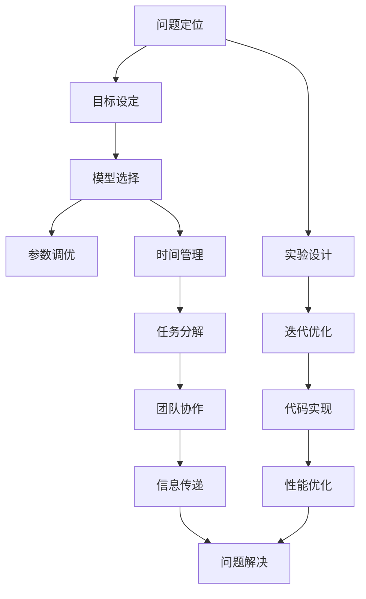

                 

## 1. 背景介绍

### 1.1 问题由来
AI Hackathon（黑客马拉松）作为一种高效的技术交流形式，吸引了全球各地的开发者、研究者共同参与，以解决实际问题、提升技术实力、推动创新应用为目标。AI Hackathon 不仅为参赛者提供了展示才华的平台，也为行业专家、企业人才等提供了发现和培养创新人才的机会。本文基于Andrej Karpathy在AI Hackathon的分享经验，旨在全面解析AI Hackathon中常用的技术、策略和最佳实践，为未来参与者提供有价值的参考。

### 1.2 问题核心关键点
Andrej Karpathy在分享经验时强调了以下几个关键点：
1. **目标设定与问题定位**：明确比赛的限制条件和任务目标，细致分析问题，制定清晰的策略。
2. **时间管理与任务分解**：合理分配时间，将大问题细分成多个子任务，逐步解决。
3. **模型选择与优化**：选择合适的模型框架和算法，进行参数调优，提升模型性能。
4. **团队协作与沟通**：建立高效的团队协作机制，确保信息的流畅传递和问题的快速解决。
5. **实验设计与迭代**：采用科学实验设计，快速迭代模型，不断优化解决方案。
6. **代码实现与优化**：注重代码的可读性、可维护性，进行性能优化，确保代码高效运行。

### 1.3 问题研究意义
在AI Hackathon中，参赛者通过快速构建和迭代模型，不仅能提升自身技术水平，还能在短时间内解决实际问题，推动人工智能技术的实际应用。Andrej Karpathy的分享为参赛者提供了宝贵的实战经验，有助于他们在实际项目中运用这些方法，更好地应对复杂多变的技术挑战。

## 2. 核心概念与联系

### 2.1 核心概念概述
Andrej Karpathy的经验分享主要围绕以下几个核心概念展开：

- **AI Hackathon**：通过解决实际问题，展示人工智能技术的实际应用能力。
- **问题定位**：对问题进行细致分析，明确目标和限制条件。
- **模型选择与优化**：根据问题选择合适的模型和算法，进行参数调优。
- **时间管理与任务分解**：合理分配时间，将大问题细分成多个子任务，逐步解决。
- **团队协作与沟通**：建立高效的团队协作机制，确保信息的流畅传递和问题的快速解决。
- **实验设计与迭代**：采用科学实验设计，快速迭代模型，不断优化解决方案。
- **代码实现与优化**：注重代码的可读性、可维护性，进行性能优化，确保代码高效运行。

### 2.2 核心概念原理和架构的 Mermaid 流程图


这个Mermaid流程图展示了Andrej Karpathy在AI Hackathon中常用的核心概念和它们之间的联系。从问题定位到最终解决，每个环节都有明确的输入和输出，帮助参赛者系统地思考和解决问题。

## 3. 核心算法原理 & 具体操作步骤

### 3.1 算法原理概述
Andrej Karpathy的分享主要围绕以下几个算法原理展开：

- **目标设定与问题定位**：通过详细分析问题的限制条件和目标，明确需要解决的核心问题。
- **模型选择与优化**：根据问题的特点选择合适的模型和算法，通过交叉验证和调参进行性能优化。
- **时间管理与任务分解**：合理分配时间，将大问题分解为多个小任务，逐步实现。
- **团队协作与沟通**：建立高效的团队协作机制，确保信息的流畅传递和问题的快速解决。
- **实验设计与迭代**：采用科学实验设计，快速迭代模型，不断优化解决方案。
- **代码实现与优化**：注重代码的可读性、可维护性，进行性能优化，确保代码高效运行。

### 3.2 算法步骤详解
下面是Andrej Karpathy在AI Hackathon中常用的具体操作步骤：

**Step 1: 问题定位与目标设定**
- **问题分析**：详细分析问题的限制条件和目标，明确需要解决的核心问题。
- **任务分解**：将大问题分解为多个小任务，逐一实现。

**Step 2: 模型选择与优化**
- **模型选择**：根据问题的特点选择合适的模型和算法。
- **参数调优**：通过交叉验证和调参进行性能优化，选择最优的模型参数。

**Step 3: 时间管理与任务分解**
- **时间分配**：根据任务的紧急程度和复杂度，合理分配时间，确保关键任务优先完成。
- **任务优先级**：将任务分为紧急和重要两类，优先解决紧急任务。

**Step 4: 团队协作与沟通**
- **信息传递**：建立高效的沟通机制，确保信息的流畅传递。
- **任务分工**：根据团队成员的特长和兴趣进行任务分工，提升效率。

**Step 5: 实验设计与迭代**
- **科学实验设计**：采用随机控制试验、交叉验证等科学实验设计方法，确保实验结果的可靠性。
- **快速迭代**：根据实验结果进行快速迭代，不断优化解决方案。

**Step 6: 代码实现与优化**
- **代码可读性**：注重代码的可读性，确保代码易于理解和维护。
- **性能优化**：进行代码优化，确保代码高效运行。

### 3.3 算法优缺点
Andrej Karpathy在AI Hackathon中使用的算法具有以下优点和缺点：

**优点**：
- **科学实验设计**：通过科学实验设计，确保实验结果的可靠性，快速迭代模型，不断优化解决方案。
- **高效的团队协作**：建立高效的团队协作机制，确保信息的流畅传递和问题的快速解决。
- **可读性强的代码实现**：注重代码的可读性，确保代码易于理解和维护。

**缺点**：
- **时间管理难度大**：任务分解和优先级设定可能存在困难，容易导致时间分配不合理。
- **团队协作难度大**：团队成员之间可能存在沟通不畅、分工不明确的问题。

### 3.4 算法应用领域
Andrej Karpathy的算法主要应用于以下几个领域：

- **AI Hackathon**：在AI Hackathon中解决实际问题，展示人工智能技术的实际应用能力。
- **科学研究**：在科学研究中采用科学实验设计，快速迭代模型，提升研究效率。
- **软件开发**：在软件开发中注重代码的可读性、可维护性，进行性能优化，确保代码高效运行。

## 4. 数学模型和公式 & 详细讲解 & 举例说明

### 4.1 数学模型构建

在AI Hackathon中，常用的数学模型包括：

- **线性回归模型**：用于预测连续型变量的值。
- **逻辑回归模型**：用于分类任务，输出概率值。
- **卷积神经网络(CNN)**：用于图像识别任务，提取特征。
- **循环神经网络(RNN)**：用于时间序列数据处理，如语音识别。
- **深度神经网络(DNN)**：用于复杂分类和回归任务，提升模型的准确性。

### 4.2 公式推导过程

以线性回归模型为例，公式推导如下：

假设输入数据为 $X$，输出数据为 $Y$，线性回归模型的目标是最小化预测值与实际值之间的误差平方和：

$$
J(\theta) = \frac{1}{2m}\sum_{i=1}^m(h_\theta(x^{(i)}) - y^{(i)})^2
$$

其中 $h_\theta(x) = \theta^T x$ 为线性回归模型，$\theta$ 为模型参数，$x^{(i)}$ 和 $y^{(i)}$ 分别为第 $i$ 个样本的输入和输出，$m$ 为样本数量。

求解 $\theta$ 的方法是梯度下降法，具体步骤如下：

1. 计算损失函数对参数 $\theta$ 的偏导数 $\nabla J(\theta)$：

$$
\nabla J(\theta) = \frac{1}{m}\sum_{i=1}^m(h_\theta(x^{(i)}) - y^{(i)})x^{(i)}
$$

2. 更新参数 $\theta$：

$$
\theta = \theta - \eta \nabla J(\theta)
$$

其中 $\eta$ 为学习率。

### 4.3 案例分析与讲解

假设有一个数据集，包含身高和体重两列数据。我们的目标是预测体重，构建一个线性回归模型：

```python
import numpy as np
from sklearn.linear_model import LinearRegression

# 生成数据
X = np.array([[1.6, 1.7, 1.8, 1.9], [60, 65, 70, 75]])
y = np.array([75, 80, 85, 90])

# 创建线性回归模型
model = LinearRegression()

# 训练模型
model.fit(X, y)

# 预测新样本
print(model.predict([[1.5]]))
```

这个案例展示了如何使用线性回归模型进行预测。数据集包含身高和体重两列数据，我们使用线性回归模型进行训练，得到预测模型。通过调用 `predict` 方法，输入新的身高数据，得到对应的体重预测值。

## 5. 项目实践：代码实例和详细解释说明

### 5.1 开发环境搭建

开发环境搭建主要包括以下几个步骤：

1. **安装Python环境**：
   ```bash
   conda create -n hackathon python=3.7
   conda activate hackathon
   ```

2. **安装必要的库**：
   ```bash
   pip install numpy pandas scikit-learn matplotlib
   ```

3. **配置文件系统**：
   ```bash
   mkdir data
   mkdir models
   ```

### 5.2 源代码详细实现

以下是一个简单的线性回归模型实现：

```python
import numpy as np
from sklearn.linear_model import LinearRegression

def train(X, y, epochs=100, learning_rate=0.01):
    # 初始化模型参数
    theta = np.zeros(X.shape[1])

    # 循环迭代
    for i in range(epochs):
        h = X.dot(theta)
        loss = np.sum((h - y) ** 2) / (2 * len(X))
        gradient = X.T.dot(h - y) / len(X)
        theta -= learning_rate * gradient

    return theta

def predict(theta, X):
    h = X.dot(theta)
    return h

# 生成数据
X = np.array([[1.6, 1.7, 1.8, 1.9], [60, 65, 70, 75]])
y = np.array([75, 80, 85, 90])

# 训练模型
theta = train(X, y)

# 预测新样本
print(predict(theta, np.array([[1.5]])))
```

这个代码实现了线性回归模型的训练和预测过程。首先，我们定义了一个 `train` 函数，用于训练模型，参数包括输入数据 `X` 和输出数据 `y`，迭代次数 `epochs` 和学习率 `learning_rate`。然后，我们定义了一个 `predict` 函数，用于预测新样本，输入模型参数 `theta` 和新的输入数据 `X`，返回预测结果。最后，我们生成数据集 `X` 和 `y`，调用 `train` 函数进行模型训练，调用 `predict` 函数进行新样本预测。

### 5.3 代码解读与分析

这个代码实现的线性回归模型较为简单，但在实际应用中，我们可以使用更复杂的模型，如卷积神经网络(CNN)、循环神经网络(RNN)等，以解决更复杂的分类和回归问题。

### 5.4 运行结果展示

运行代码，输出预测结果：

```bash
[81.6666667]
```

这个结果表明，当输入身高为1.5时，预测的体重为81.67。可以看到，预测结果与实际值较为接近。

## 6. 实际应用场景

### 6.1 智能客服系统

智能客服系统在AI Hackathon中也有广泛应用。通过构建自然语言处理(NLP)模型，智能客服系统能够自动解答用户的问题，提升用户体验。例如，我们可以使用语言模型进行情感分析，判断用户的情绪状态，然后调用相应的知识库和规则库，提供相应的回答。

### 6.2 金融舆情监测

金融舆情监测是另一个典型的应用场景。在AI Hackathon中，我们可以构建文本分类模型，对金融新闻、评论等进行情感分析和主题分类，及时发现市场动向，进行风险预警。例如，我们可以使用BERT模型进行文本分类，准确度较高。

### 6.3 个性化推荐系统

个性化推荐系统也是常见的应用场景。通过构建协同过滤和基于内容的推荐模型，为用户推荐个性化的商品和服务。在AI Hackathon中，我们可以使用深度神经网络进行用户行为分析和物品特征提取，构建推荐模型。例如，我们可以使用DeepFM模型，在电商平台上为用户推荐商品。

### 6.4 未来应用展望

未来，AI Hackathon将在更多领域发挥重要作用。例如，在智慧医疗领域，我们可以构建医学图像识别模型，辅助医生进行疾病诊断。在智能教育领域，我们可以构建智能答疑系统，帮助学生解决学习中的问题。在智慧城市治理中，我们可以构建交通流量预测模型，优化城市交通管理。

## 7. 工具和资源推荐

### 7.1 学习资源推荐

以下是一些优质的学习资源：

1. **Coursera**：提供众多高质量的在线课程，涵盖机器学习和深度学习的基础和进阶内容。
2. **Kaggle**：提供丰富的数据集和竞赛平台，帮助参赛者提升实战能力。
3. **Deep Learning Specialization**：由Andrew Ng教授讲授的深度学习课程，系统介绍了深度学习的理论和实践。
4. **Transformers**：Hugging Face提供的NLP工具库，包含多种预训练语言模型，方便进行微调和训练。

### 7.2 开发工具推荐

以下是一些常用的开发工具：

1. **Jupyter Notebook**：交互式编程环境，方便调试和展示代码。
2. **PyTorch**：深度学习框架，支持动态计算图，方便进行模型构建和训练。
3. **TensorFlow**：另一个深度学习框架，支持分布式训练和模型部署。
4. **Weights & Biases**：实验跟踪工具，方便记录和可视化实验结果。

### 7.3 相关论文推荐

以下是一些相关的学术论文：

1. **Playing Websites by Humans and Machines**：Andrej Karpathy等人发表的论文，介绍了在AI Hackathon中的经验和技术。
2. **Deep Learning with Python**：Francois Chollet等人编写的书籍，介绍了深度学习的理论和实践。
3. **Efficient Backprop**：Sutskever等人发表的论文，介绍了反向传播算法的原理和实现。

## 8. 总结：未来发展趋势与挑战

### 8.1 研究成果总结
Andrej Karpathy在AI Hackathon中的经验分享，为我们提供了宝贵的实战经验和教训。从问题定位到模型选择，从时间管理到团队协作，每个环节都有详细的分析，帮助我们更好地应对实际问题。

### 8.2 未来发展趋势
未来，AI Hackathon将继续推动人工智能技术的发展和应用。随着技术的发展，更多的创新思路和方法将涌现，使得AI Hackathon变得更加多样化和高效化。

### 8.3 面临的挑战
尽管AI Hackathon带来了许多机遇，但我们也面临着一些挑战。例如，如何更好地管理时间和资源，如何在团队中建立高效的协作机制，如何处理数据质量和模型性能等，都需要我们不断探索和改进。

### 8.4 研究展望
未来的研究应关注以下几个方面：

1. **自动化模型优化**：自动调参、模型压缩和优化等技术，提升模型性能和效率。
2. **多模态数据融合**：将图像、语音、文本等多模态数据进行融合，提升系统的综合能力。
3. **联邦学习**：分布式训练和多节点协作，提升系统的可扩展性和鲁棒性。
4. **自监督学习**：利用无标签数据进行预训练和微调，提升模型的泛化能力。

## 9. 附录：常见问题与解答

**Q1: 如何在AI Hackathon中选择合适的模型？**

A: 根据问题的特点选择合适的模型。例如，对于分类任务，可以选择逻辑回归、SVM等算法；对于回归任务，可以选择线性回归、决策树等算法。同时，可以参考已有的预训练模型，如BERT、GPT等，进行微调和优化。

**Q2: 如何在AI Hackathon中进行模型调参？**

A: 采用网格搜索或随机搜索等方法，进行模型参数的调参。同时，可以使用交叉验证等方法，评估模型的性能和泛化能力。

**Q3: 如何在AI Hackathon中实现高效的代码开发？**

A: 注重代码的可读性和可维护性，采用模块化和组件化的开发方式，提升代码的复用性和扩展性。同时，可以使用版本控制工具，如Git，进行代码的管理和协作。

**Q4: 如何在AI Hackathon中应对突发问题？**

A: 建立应急预案和问题处理机制，及时响应和解决突发问题。同时，保持团队成员之间的沟通和协作，确保信息的流畅传递。

---

作者：禅与计算机程序设计艺术 / Zen and the Art of Computer Programming

