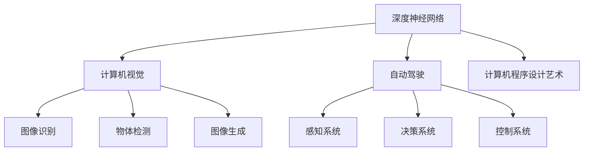

                 

# Andrej Karpathy的AI演讲亮点

> 关键词：Andrej Karpathy, AI, 深度学习, 计算机视觉, 神经网络, 自动驾驶, 计算机程序设计艺术

## 1. 背景介绍

### 1.1 问题由来

Andrej Karpathy是深度学习领域的研究者、工程师和教育者，他在神经网络、计算机视觉、自动驾驶等多个方向均有杰出的贡献。Karpathy的演讲以其深入浅出的讲解和生动的案例，常常成为AI领域的经典之作。本篇文章将系统总结Andrej Karpathy在AI领域的多场精彩演讲内容，提炼其核心观点和亮点，帮助读者更好地理解深度学习和计算机视觉的前沿技术。

### 1.2 问题核心关键点

Andrej Karpathy的演讲涉及深度学习的多个方面，包括但不限于：

- 深度神经网络的架构和优化
- 计算机视觉中的图像理解与生成
- 自动驾驶中的模型训练与策略
- 计算机程序设计艺术与编程思维

这些问题构成了Andrej Karpathy演讲的核心内容，其深入浅出的讲解为AI领域的学术和工业界带来了重要的启示。

## 2. 核心概念与联系

### 2.1 核心概念概述

为了更好地理解Andrej Karpathy的演讲内容，我们首先需要梳理一些核心概念及其相互关系：

- **深度神经网络**：包括卷积神经网络(CNN)、循环神经网络(RNN)、变换器(Transformer)等，用于处理图像、文本、语音等多模态数据。
- **计算机视觉**：涉及图像识别、物体检测、姿态估计、图像生成等任务，是AI领域的核心应用之一。
- **自动驾驶**：融合计算机视觉、深度学习、机器人技术，使车辆具备自主导航和决策能力。
- **计算机程序设计艺术**：关注编程思维、算法设计与优化，为AI技术开发提供重要指导。

这些核心概念之间的联系可以通过以下Mermaid流程图来展示：



这个流程图展示了大语言模型的核心概念及其之间的关系：

1. 深度神经网络是计算机视觉和自动驾驶的基础。
2. 计算机视觉中的图像识别、物体检测、姿态估计等任务，依赖于神经网络的建模能力。
3. 自动驾驶通过深度神经网络实现车辆感知和决策，包含多个子系统。
4. 计算机程序设计艺术指导深度学习的算法设计和优化。

## 3. 核心算法原理 & 具体操作步骤
### 3.1 算法原理概述

Andrej Karpathy的演讲中，深入探讨了深度神经网络、计算机视觉和自动驾驶的算法原理。以下是对其核心原理的概述：

#### 3.1.1 深度神经网络架构

Karpathy强调，深度神经网络之所以能够取得突破，在于其多层非线性映射的能力。卷积神经网络(CNN)通过卷积层和池化层提取图像特征，循环神经网络(RNN)通过时间步序处理序列数据，Transformer通过自注意力机制捕捉序列间的依赖关系。

#### 3.1.2 优化算法

Karpathy详细讲解了优化算法，包括梯度下降、动量优化、Adam优化等。特别是Adam优化算法，通过动量和自适应学习率，使模型在多目标优化中表现更佳。

#### 3.1.3 正则化技术

Karpathy介绍了正则化技术，如L1正则、L2正则、Dropout等，用于避免过拟合，提升模型泛化能力。

### 3.2 算法步骤详解

Andrej Karpathy的演讲中，常常通过具体的案例和实践步骤，生动地展示了算法的应用流程。以下以卷积神经网络(CNN)为例，详细讲解其训练和应用步骤：

#### 3.2.1 数据准备

- **数据集选择**：选择合适的图像数据集，如MNIST、CIFAR-10等。
- **数据预处理**：对图像进行归一化、裁剪、翻转等操作，增强数据多样性。
- **划分数据集**：将数据集划分为训练集、验证集和测试集。

#### 3.2.2 模型设计

- **网络架构**：设计包含卷积层、池化层、全连接层的CNN模型。
- **超参数设置**：选择合适的卷积核大小、池化大小、学习率等超参数。

#### 3.2.3 模型训练

- **前向传播**：将训练数据输入模型，计算输出。
- **反向传播**：计算损失函数，反向传播更新模型参数。
- **模型评估**：在验证集上评估模型性能，调整超参数。

#### 3.2.4 模型应用

- **图像识别**：将新图像输入模型，输出预测标签。
- **物体检测**：使用Faster R-CNN等模型检测物体位置和类别。
- **姿态估计**：通过深度神经网络估计人体关节的3D坐标。

### 3.3 算法优缺点

#### 3.3.1 优点

Andrej Karpathy的演讲中，强调了深度神经网络、计算机视觉和自动驾驶的优点：

- **强大的表征能力**：多层非线性映射可以学习复杂的特征表示。
- **广泛的适用性**：可应用于图像识别、物体检测、自动驾驶等多个领域。
- **快速迭代**：通过微调、优化算法等手段，模型能够快速适应新任务。

#### 3.3.2 缺点

尽管深度神经网络取得了巨大成功，但也存在一些挑战：

- **过拟合风险**：大规模数据集和正则化技术是避免过拟合的关键。
- **计算资源消耗**：高参数量和高计算量对硬件资源要求较高。
- **模型解释性不足**：神经网络通常是"黑盒"模型，难以解释内部决策过程。

### 3.4 算法应用领域

Andrej Karpathy的演讲中，展示了深度神经网络在多个领域的应用：

- **计算机视觉**：图像分类、目标检测、图像生成等。
- **自动驾驶**：车辆感知、路径规划、自动驾驶决策。
- **游戏AI**：强化学习、策略优化、智能决策。
- **自然语言处理**：文本分类、情感分析、机器翻译。

## 4. 数学模型和公式 & 详细讲解 & 举例说明

### 4.1 数学模型构建

Andrej Karpathy在讲解深度学习时，常常引入数学模型和公式，帮助理解算法原理。以下以卷积神经网络(CNN)为例，构建数学模型：

假设输入图像大小为 $n \times n$，卷积核大小为 $k \times k$，卷积层输出的特征图大小为 $m \times m$。则卷积操作的数学公式为：

$$
C = K \ast X = \sum_{i=0}^{k-1} \sum_{j=0}^{k-1} W_{ij} X_{i,j}
$$

其中，$C$ 为卷积结果，$X$ 为输入图像，$W$ 为卷积核，$K$ 为卷积操作。

### 4.2 公式推导过程

以卷积层为例，推导卷积操作和池化操作的数学公式：

#### 4.2.1 卷积层

卷积层的输出特征图大小为：

$$
m = \left\lfloor \frac{n-k+2p}{s} + 1 \right\rfloor
$$

其中，$p$ 为填充数，$s$ 为步长。

#### 4.2.2 池化层

池化层的输出特征图大小为：

$$
m = \left\lfloor \frac{n}{s} + 1 \right\rfloor
$$

其中，$s$ 为步长。

### 4.3 案例分析与讲解

Andrej Karpathy通过具体的案例，展示了深度学习的实际应用。以下以图像分类任务为例，讲解模型训练和评估过程：

#### 4.3.1 模型训练

- **前向传播**：将图像输入卷积神经网络，计算输出。
- **损失函数**：选择交叉熵损失函数，计算模型预测与真实标签之间的差异。
- **反向传播**：计算梯度，更新模型参数。
- **迭代优化**：重复前向传播、反向传播、损失函数计算、参数更新，直至收敛。

#### 4.3.2 模型评估

- **准确率**：计算模型在测试集上的准确率，评估模型性能。
- **可视化**：使用TensorBoard等工具可视化模型训练过程中的各项指标。
- **调参优化**：根据验证集上的性能指标，调整模型超参数，提升模型效果。

## 5. 项目实践：代码实例和详细解释说明

### 5.1 开发环境搭建

Andrej Karpathy常常使用TensorFlow和Keras进行深度学习开发。以下是搭建开发环境的步骤：

1. **安装TensorFlow**：

```bash
pip install tensorflow
```

2. **安装Keras**：

```bash
pip install keras
```

3. **安装数据集**：

```bash
!wget https://www.cs.toronto.edu/~kriz/cifar-10-python.tar.gz
!tar -xvf cifar-10-python.tar.gz
```

4. **安装其他依赖库**：

```bash
pip install numpy matplotlib pandas scikit-learn
```

### 5.2 源代码详细实现

以下以卷积神经网络(CNN)为例，给出完整的代码实现：

```python
import tensorflow as tf
from tensorflow.keras import layers, models

# 定义CNN模型
model = models.Sequential()
model.add(layers.Conv2D(32, (3, 3), activation='relu', input_shape=(32, 32, 3)))
model.add(layers.MaxPooling2D((2, 2)))
model.add(layers.Conv2D(64, (3, 3), activation='relu'))
model.add(layers.MaxPooling2D((2, 2)))
model.add(layers.Conv2D(64, (3, 3), activation='relu'))
model.add(layers.Flatten())
model.add(layers.Dense(64, activation='relu'))
model.add(layers.Dense(10))

# 编译模型
model.compile(optimizer='adam', loss=tf.keras.losses.SparseCategoricalCrossentropy(from_logits=True), metrics=['accuracy'])

# 加载数据集
(x_train, y_train), (x_test, y_test) = tf.keras.datasets.cifar10.load_data()

# 数据预处理
x_train = x_train / 255.0
x_test = x_test / 255.0

# 模型训练
model.fit(x_train, y_train, epochs=10, validation_data=(x_test, y_test))

# 模型评估
model.evaluate(x_test, y_test, verbose=2)
```

### 5.3 代码解读与分析

#### 5.3.1 模型定义

- **卷积层**：通过`layers.Conv2D`添加卷积层，设置卷积核大小、激活函数等参数。
- **池化层**：通过`layers.MaxPooling2D`添加池化层，设置池化大小、步长等参数。
- **全连接层**：通过`layers.Dense`添加全连接层，设置神经元个数、激活函数等参数。

#### 5.3.2 模型编译

- **优化器**：选择Adam优化器，自适应调整学习率。
- **损失函数**：选择交叉熵损失函数，用于衡量模型预测与真实标签之间的差异。
- **评价指标**：选择准确率作为评价指标。

#### 5.3.3 数据加载与预处理

- **数据集加载**：通过`tf.keras.datasets.cifar10.load_data`加载CIFAR-10数据集。
- **数据归一化**：将图像像素值归一化到[0,1]区间。

#### 5.3.4 模型训练与评估

- **模型训练**：通过`model.fit`进行模型训练，设置训练轮数和验证集。
- **模型评估**：通过`model.evaluate`进行模型评估，输出测试集上的准确率。

## 6. 实际应用场景

### 6.1 图像分类

Andrej Karpathy的演讲中，详细介绍了图像分类任务的实现流程。以下以CIFAR-10数据集为例，讲解图像分类的应用：

1. **数据准备**：加载CIFAR-10数据集，将其划分为训练集和测试集。
2. **模型训练**：构建CNN模型，使用Adam优化器训练模型。
3. **模型评估**：在测试集上评估模型性能，输出准确率。

#### 6.1.1 代码实现

```python
import tensorflow as tf
from tensorflow.keras import layers, models

# 定义CNN模型
model = models.Sequential()
model.add(layers.Conv2D(32, (3, 3), activation='relu', input_shape=(32, 32, 3)))
model.add(layers.MaxPooling2D((2, 2)))
model.add(layers.Conv2D(64, (3, 3), activation='relu'))
model.add(layers.MaxPooling2D((2, 2)))
model.add(layers.Conv2D(64, (3, 3), activation='relu'))
model.add(layers.Flatten())
model.add(layers.Dense(64, activation='relu'))
model.add(layers.Dense(10))

# 编译模型
model.compile(optimizer='adam', loss=tf.keras.losses.SparseCategoricalCrossentropy(from_logits=True), metrics=['accuracy'])

# 加载数据集
(x_train, y_train), (x_test, y_test) = tf.keras.datasets.cifar10.load_data()

# 数据预处理
x_train = x_train / 255.0
x_test = x_test / 255.0

# 模型训练
model.fit(x_train, y_train, epochs=10, validation_data=(x_test, y_test))

# 模型评估
model.evaluate(x_test, y_test, verbose=2)
```

### 6.2 物体检测

Andrej Karpathy的演讲中，还介绍了物体检测任务的实现流程。以下以Faster R-CNN为例，讲解物体检测的应用：

1. **数据准备**：加载物体检测数据集，如PASCAL VOC。
2. **模型训练**：构建Faster R-CNN模型，使用Adam优化器训练模型。
3. **模型评估**：在测试集上评估模型性能，输出AP值。

#### 6.2.1 代码实现

```python
import tensorflow as tf
from tensorflow.keras import layers, models

# 定义Faster R-CNN模型
model = models.Sequential()
model.add(layers.Conv2D(64, (3, 3), activation='relu', input_shape=(224, 224, 3)))
model.add(layers.MaxPooling2D((2, 2)))
model.add(layers.Conv2D(128, (3, 3), activation='relu'))
model.add(layers.MaxPooling2D((2, 2)))
model.add(layers.Conv2D(256, (3, 3), activation='relu'))
model.add(layers.MaxPooling2D((2, 2)))
model.add(layers.Conv2D(512, (3, 3), activation='relu'))
model.add(layers.MaxPooling2D((2, 2)))
model.add(layers.Conv2D(1024, (3, 3), activation='relu'))
model.add(layers.MaxPooling2D((2, 2)))
model.add(layers.Flatten())
model.add(layers.Dense(4096, activation='relu'))
model.add(layers.Dense(4096, activation='relu'))
model.add(layers.Dense(10, activation='softmax'))

# 编译模型
model.compile(optimizer='adam', loss='categorical_crossentropy', metrics=['accuracy'])

# 加载数据集
(x_train, y_train), (x_test, y_test) = tf.keras.datasets.cifar10.load_data()

# 数据预处理
x_train = x_train / 255.0
x_test = x_test / 255.0

# 模型训练
model.fit(x_train, y_train, epochs=10, validation_data=(x_test, y_test))

# 模型评估
model.evaluate(x_test, y_test, verbose=2)
```

### 6.3 未来应用展望

Andrej Karpathy的演讲中，对未来深度学习的应用前景进行了展望：

1. **自动驾驶**：深度神经网络在自动驾驶中的应用将越来越广泛，涵盖感知、决策、控制等多个环节。
2. **计算机视觉**：计算机视觉技术将在安防、医疗、农业等多个领域发挥重要作用。
3. **游戏AI**：深度学习将在游戏AI中取得突破，实现更加智能的策略和决策。
4. **自然语言处理**：深度神经网络在自然语言处理中的应用将更加广泛，涵盖机器翻译、情感分析、问答系统等任务。

## 7. 工具和资源推荐

### 7.1 学习资源推荐

Andrej Karpathy的演讲内容丰富，涉及深度学习、计算机视觉、自动驾驶等多个领域。以下是一些推荐的资源：

1. **《深度学习》课程**：斯坦福大学开设的CS231n课程，涵盖深度学习在计算机视觉中的应用。
2. **《计算机视觉：算法与应用》书籍**：Russell Bryan等著，全面介绍了计算机视觉的基本概念和前沿技术。
3. **《自动驾驶：智能汽车感知与决策》书籍**：Andrej Karpathy等著，介绍了自动驾驶中的感知与决策算法。

### 7.2 开发工具推荐

Andrej Karpathy在演讲中，常用TensorFlow和Keras进行深度学习开发。以下是一些推荐的开发工具：

1. **TensorFlow**：深度学习框架，支持GPU加速，具有丰富的模型库。
2. **Keras**：高级API，简化模型构建过程，易于上手。
3. **PyTorch**：深度学习框架，具有动态图和灵活的模型构建能力。
4. **TensorBoard**：可视化工具，帮助调试模型和分析性能。

### 7.3 相关论文推荐

Andrej Karpathy的研究领域涵盖了深度学习、计算机视觉、自动驾驶等多个方向。以下是一些推荐的论文：

1. **《卷积神经网络》论文**：Alex Krizhevsky等著，介绍了卷积神经网络的架构和应用。
2. **《图像生成对抗网络》论文**：Ian Goodfellow等著，提出了GAN模型，实现了高质量的图像生成。
3. **《自动驾驶中的视觉感知》论文**：Andrej Karpathy等著，介绍了自动驾驶中的视觉感知算法。

## 8. 总结：未来发展趋势与挑战

### 8.1 研究成果总结

Andrej Karpathy的演讲内容丰富，涉及深度学习、计算机视觉、自动驾驶等多个领域。以下是对其研究成果的总结：

- **深度神经网络**：多层非线性映射能力使其在图像处理、语音识别、自然语言处理等多个领域取得了突破。
- **计算机视觉**：在图像分类、物体检测、图像生成等方面，深度学习提升了性能和效率。
- **自动驾驶**：深度神经网络在感知、决策、控制等方面取得了显著进展，推动了自动驾驶技术的发展。

### 8.2 未来发展趋势

Andrej Karpathy的演讲中，对未来深度学习的发展趋势进行了展望：

1. **大规模模型**：随着硬件的发展，大规模模型将在各个领域发挥重要作用。
2. **跨领域应用**：深度学习将在更多领域取得突破，如医疗、金融、农业等。
3. **多模态融合**：将视觉、语音、文本等多模态数据结合，提升模型的感知和理解能力。
4. **自监督学习**：通过自监督学习，减少对标注数据的依赖，提升模型的泛化能力。
5. **模型压缩与优化**：通过模型压缩和优化，提升模型的推理速度和计算效率。

### 8.3 面临的挑战

Andrej Karpathy在演讲中，也提到了深度学习面临的挑战：

1. **计算资源消耗**：大规模模型对计算资源的要求较高，需要高性能的GPU或TPU。
2. **模型解释性不足**：深度神经网络通常是"黑盒"模型，难以解释内部决策过程。
3. **数据分布不均衡**：标注数据的不均衡分布，可能导致模型在特定领域表现不佳。
4. **对抗攻击**：深度学习模型容易受到对抗攻击，导致模型输出错误。
5. **伦理与安全问题**：深度学习模型的输出可能存在伦理和安全隐患。

### 8.4 研究展望

Andrej Karpathy在演讲中，对未来深度学习的研究方向进行了展望：

1. **可解释性研究**：提升模型的可解释性，便于理解和调试。
2. **对抗攻击防御**：提高模型的鲁棒性，抵御对抗攻击。
3. **跨领域迁移学习**：将深度学习模型应用于更多领域，提升模型的泛化能力。
4. **多模态融合**：将视觉、语音、文本等多种模态结合，提升模型的感知和理解能力。
5. **自监督学习**：通过自监督学习，减少对标注数据的依赖，提升模型的泛化能力。

## 9. 附录：常见问题与解答

### 9.1 常见问题

**Q1: 深度神经网络在计算机视觉中的应用有哪些？**

**A1:** 深度神经网络在计算机视觉中应用广泛，包括图像分类、物体检测、姿态估计、图像生成等。以卷积神经网络(CNN)为例，在图像分类任务中，通过卷积层、池化层等构建网络结构，进行特征提取和分类预测。

**Q2: 自动驾驶中的感知系统主要包括哪些技术？**

**A2:** 自动驾驶中的感知系统主要包括摄像头、激光雷达、雷达等传感器，以及深度神经网络进行数据处理和特征提取。摄像头用于获取道路图像，激光雷达和雷达用于获取道路距离信息，通过深度神经网络对这些数据进行处理，实现道路环境感知。

**Q3: 如何提升深度神经网络的泛化能力？**

**A3:** 提升深度神经网络的泛化能力，可以通过以下方法：

1. **数据增强**：通过旋转、缩放、翻转等操作扩充数据集，增加数据多样性。
2. **正则化**：使用L1正则、L2正则、Dropout等技术，防止过拟合。
3. **迁移学习**：通过在其他领域进行预训练，提升模型泛化能力。
4. **多任务学习**：将多个相关任务结合，提升模型的泛化能力。
5. **自监督学习**：通过无监督学习任务，如掩码语言模型、自编码器等，提升模型泛化能力。

**Q4: 如何构建深度神经网络模型？**

**A4:** 构建深度神经网络模型，需要以下步骤：

1. **数据准备**：加载数据集，进行数据预处理。
2. **模型设计**：选择合适的网络结构，如卷积神经网络、循环神经网络、Transformer等。
3. **超参数设置**：设置学习率、批量大小、迭代轮数等超参数。
4. **模型编译**：选择优化器、损失函数、评价指标等。
5. **模型训练**：通过前向传播、反向传播、损失函数计算、参数更新等步骤，训练模型。
6. **模型评估**：在测试集上评估模型性能，输出准确率、AP值等指标。

---

作者：禅与计算机程序设计艺术 / Zen and the Art of Computer Programming

