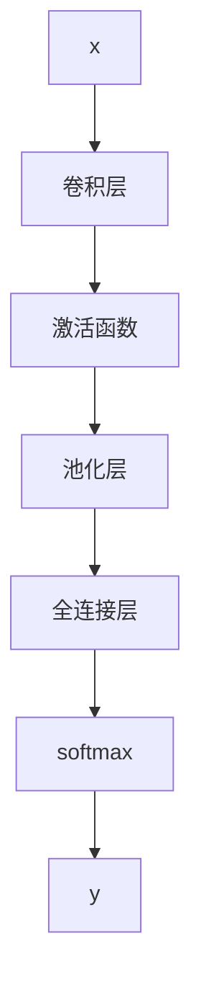

                 

# Andrej Karpathy：人工智能的挑战与机遇

> 关键词：人工智能, 深度学习, 计算机视觉, 自动驾驶, 图像生成

## 1. 背景介绍

### 1.1 问题由来
Andrej Karpathy，一位在人工智能领域有着深厚造诣的深度学习专家，以其在计算机视觉和自动驾驶领域的杰出贡献而闻名。他在深度学习领域的研究成果，特别是卷积神经网络(CNN)和自动驾驶技术，对人工智能产业的发展产生了深远影响。本文旨在探讨Andrej Karpathy在人工智能领域的挑战与机遇，并分析其研究成果对未来的启示。

### 1.2 问题核心关键点
Andrej Karpathy的研究方向主要集中在计算机视觉和自动驾驶领域。其核心研究内容包括：

- 深度卷积神经网络（CNN）及其在图像识别、图像生成、语义分割等任务中的应用。
- 自动驾驶中的视觉感知与决策，特别是车道保持、路径规划、交通信号理解等技术。
- 生成对抗网络（GANs）及其在图像生成、视频生成等方面的创新应用。
- 机器人视觉与自主导航，通过计算机视觉技术实现自主移动机器人。

这些研究方向共同构成了Andrej Karpathy在人工智能领域的核心贡献，推动了人工智能技术的进步与应用。

### 1.3 问题研究意义
探讨Andrej Karpathy在人工智能领域的挑战与机遇，有助于理解深度学习技术的最新进展，探索未来人工智能技术的发展方向，为人工智能研究者提供有价值的参考和启示。

## 2. 核心概念与联系

### 2.1 核心概念概述

为更好地理解Andrej Karpathy在人工智能领域的挑战与机遇，本节将介绍几个密切相关的核心概念：

- 深度学习(Deep Learning)：一种基于多层神经网络的机器学习技术，广泛应用于计算机视觉、自然语言处理、语音识别等领域。
- 卷积神经网络(Convolutional Neural Networks, CNN)：一种专门用于处理图像和视频数据的深度神经网络，通过卷积、池化等操作提取局部特征。
- 生成对抗网络(Generative Adversarial Networks, GANs)：一种通过对抗训练生成高质量图像、视频等数据的深度学习模型。
- 自动驾驶(Autonomous Driving)：一种高级驾驶辅助系统，通过计算机视觉和深度学习技术实现车辆的自主导航。
- 机器人视觉(Robot Vision)：通过计算机视觉技术实现机器人的环境感知与自主导航。

这些核心概念之间的逻辑关系可以通过以下Mermaid流程图来展示：

```mermaid
graph TB
    A[深度学习] --> B[CNN]
    A --> C[GANs]
    A --> D[自动驾驶]
    B --> E[图像识别]
    C --> F[图像生成]
    D --> G[车道保持]
    E --> H[语义分割]
    F --> I[视频生成]
    G --> J[路径规划]
    H --> K[交通信号理解]
    I --> L[动作生成]
    J --> M[决策支持]
    K --> N[场景理解]
    L --> O[行为预测]
    M --> P[事件响应]
    N --> Q[物体检测]
    O --> R[动作执行]
    P --> S[事件处理]
    Q --> T[目标跟踪]
    R --> U[环境感知]
    S --> V[行为监控]
    T --> W[物体分类]
    U --> X[环境理解]
    V --> Y[状态估计]
    W --> Z[行为学习]
    X --> $[场景分析]
    Y --> [$[状态融合]
    Z --> [$[行为生成]
    $ --> [$[场景模拟]
    [$ --> [$[状态调整]
    $ --> [$[行为优化]
```

这个流程图展示了一个典型的人工智能应用场景：通过深度学习技术，实现计算机视觉与自动驾驶。其中CNN用于图像识别和语义分割，GANs用于图像生成和视频生成，自动驾驶中包含车道保持、路径规划等功能，机器人视觉则用于环境感知与自主导航。这些核心概念共同构成了Andrej Karpathy在人工智能领域的核心工作，推动了人工智能技术的发展与应用。

## 3. 核心算法原理 & 具体操作步骤
### 3.1 算法原理概述

Andrej Karpathy在深度学习领域的研究成果，主要围绕深度卷积神经网络、生成对抗网络和自动驾驶技术展开。这些研究成果揭示了深度学习在计算机视觉和自动驾驶领域的应用潜力，并推动了这些技术的发展。

### 3.2 算法步骤详解

**Step 1: 准备数据集**
深度学习模型的训练需要大量的数据集。Andrej Karpathy在图像识别和自动驾驶等领域，广泛使用ImageNet、COCO、Cityscapes等标准数据集，用于模型训练和评估。

**Step 2: 设计网络结构**
根据任务特点，设计适合的深度卷积神经网络结构。Andrej Karpathy在计算机视觉任务中，常使用VGGNet、ResNet、InceptionNet等经典结构，在自动驾驶中则设计了端到端的网络结构，如图像分类、车道识别、路径规划等模块。

**Step 3: 数据预处理**
对原始数据进行预处理，包括图像归一化、数据增强、尺度变换等操作。Andrej Karpathy在数据预处理方面进行了深入研究，提出了多种数据增强技术，如图像旋转、翻转、裁剪等，以提高模型的鲁棒性。

**Step 4: 训练模型**
使用深度学习框架（如TensorFlow、PyTorch）训练深度卷积神经网络模型。Andrej Karpathy在训练过程中，使用GPU/TPU等高性能设备，并采用批量梯度下降等优化算法，加速模型的收敛。

**Step 5: 模型评估与优化**
在验证集上评估模型性能，使用准确率、精度、召回率等指标进行评估。Andrej Karpathy在模型优化方面，提出了一系列技巧，如学习率调整、正则化、Dropout等，以提高模型的泛化能力。

### 3.3 算法优缺点

Andrej Karpathy的研究成果具有以下优点：
1. 深度卷积神经网络：能够有效处理图像和视频数据，在图像识别、分类、分割等任务上取得了显著成果。
2. 生成对抗网络：能够生成高质量的图像、视频等数据，为视觉生成任务提供了新的解决方案。
3. 自动驾驶技术：通过计算机视觉和深度学习技术，实现了车辆的自主导航，推动了自动驾驶技术的发展。
4. 机器人视觉：通过计算机视觉技术，实现了机器人的环境感知与自主导航，为机器人应用提供了新的思路。

同时，这些研究成果也存在一些局限性：
1. 数据依赖性：深度学习模型需要大量的标注数据，获取高质量标注数据的成本较高。
2. 计算资源需求：深度学习模型需要高性能设备，如GPU/TPU，对计算资源的需求较高。
3. 可解释性不足：深度学习模型被视为"黑盒"，难以解释其内部工作机制和决策逻辑。
4. 鲁棒性问题：深度学习模型对噪声和异常数据较为敏感，鲁棒性有待提高。

尽管存在这些局限性，Andrej Karpathy的研究成果依然为人工智能领域的发展提供了重要的技术基础，推动了深度学习技术在计算机视觉和自动驾驶等领域的广泛应用。

### 3.4 算法应用领域

Andrej Karpathy的研究成果广泛应用于计算机视觉、自动驾驶、机器人视觉等多个领域，具体包括：

- 图像识别：如图像分类、物体检测、场景理解等。通过深度卷积神经网络，Andrej Karpathy在ImageNet、COCO等数据集上取得了最先进的成果。
- 图像生成：如图像生成、图像修复等。Andrej Karpathy使用生成对抗网络，能够生成高质量的图像，推动了视觉生成技术的发展。
- 自动驾驶：如车道保持、路径规划、交通信号理解等。通过深度学习技术，Andrej Karpathy设计了端到端的网络结构，实现了车辆的自主导航。
- 机器人视觉：如环境感知、自主导航等。Andrej Karpathy通过计算机视觉技术，实现了机器人的环境感知与自主导航。

这些应用领域展示了Andrej Karpathy在人工智能领域的广泛影响，为深度学习技术的应用提供了新的方向。

## 4. 数学模型和公式 & 详细讲解 & 举例说明

### 4.1 数学模型构建

Andrej Karpathy在计算机视觉和自动驾驶领域的研究，涉及大量的数学模型和公式。以下将详细讲解这些模型和公式，并通过具体例子进行解释说明。

**图像分类模型**
假设输入图像为 $x \in \mathbb{R}^{H \times W \times C}$，输出为类别 $y \in \{1,2,\ldots,K\}$。深度卷积神经网络用于图像分类任务，其模型结构如图1所示：



其中，卷积层用于提取图像特征，激活函数用于引入非线性变换，池化层用于降维，全连接层用于分类，softmax层用于输出类别概率。

**目标函数**
假设训练集为 $\{(x_i,y_i)\}_{i=1}^N$，定义目标函数为交叉熵损失函数：

$$
\mathcal{L} = -\frac{1}{N}\sum_{i=1}^N y_i \log \hat{y_i}
$$

其中 $\hat{y_i} = softmax(W f(x_i) + b)$，$W$ 为全连接层的权重矩阵，$b$ 为偏置向量。

**损失函数的导数**
对目标函数求导，得到：

$$
\frac{\partial \mathcal{L}}{\partial W} = \frac{1}{N}\sum_{i=1}^N (y_i - \hat{y_i}) \nabla f(x_i)
$$

$$
\frac{\partial \mathcal{L}}{\partial b} = \frac{1}{N}\sum_{i=1}^N (y_i - \hat{y_i})
$$

其中 $\nabla f(x_i)$ 为前向传播时激活函数的梯度。

**优化算法**
常用的优化算法包括随机梯度下降（SGD）、Adam等。假设学习率为 $\eta$，则更新公式为：

$$
W \leftarrow W - \eta \frac{\partial \mathcal{L}}{\partial W}
$$

$$
b \leftarrow b - \eta \frac{\partial \mathcal{L}}{\partial b}
$$

### 4.2 公式推导过程

以上公式展示了深度卷积神经网络在图像分类任务中的基本框架和目标函数。以下是这些公式的详细推导过程：

**交叉熵损失函数**
交叉熵损失函数用于衡量模型输出与真实标签之间的差异。对于二分类任务，定义交叉熵损失函数为：

$$
\mathcal{L} = -\frac{1}{N}\sum_{i=1}^N y_i \log \hat{y_i} + (1-y_i) \log (1-\hat{y_i})
$$

其中 $y_i \in \{0,1\}$，$\hat{y_i}$ 为模型预测的概率。

**目标函数导数**
对目标函数求导，得到：

$$
\frac{\partial \mathcal{L}}{\partial \hat{y_i}} = \frac{1}{N}\left[(y_i - \hat{y_i}) \frac{\partial \log \hat{y_i}}{\partial \hat{y_i}} + (1-y_i) \frac{\partial \log (1-\hat{y_i})}{\partial \hat{y_i}}\right]
$$

$$
\frac{\partial \mathcal{L}}{\partial W} = \frac{1}{N}\sum_{i=1}^N (y_i - \hat{y_i}) \frac{\partial \hat{y_i}}{\partial W}
$$

$$
\frac{\partial \mathcal{L}}{\partial b} = \frac{1}{N}\sum_{i=1}^N (y_i - \hat{y_i})
$$

其中 $\frac{\partial \hat{y_i}}{\partial W} = f(x_i)^T \frac{\partial f(x_i)}{\partial W}$，$f(x_i)$ 为前向传播时卷积层和全连接层的输出。

### 4.3 案例分析与讲解

**案例分析**
假设有一个二分类任务，输入图像大小为 $28 \times 28 \times 1$，使用3个卷积层和3个全连接层进行分类。使用ReLU激活函数和Sigmoid函数，目标函数为交叉熵损失函数。

**详细讲解**
- 第一层卷积层 $C_1$：$3 \times 3 \times 1$ 的卷积核，步长为1，填充为0，输出大小为 $14 \times 14 \times 32$。
- 第二层卷积层 $C_2$：$3 \times 3 \times 32$ 的卷积核，步长为1，填充为0，输出大小为 $7 \times 7 \times 64$。
- 第三层卷积层 $C_3$：$3 \times 3 \times 64$ 的卷积核，步长为1，填充为0，输出大小为 $4 \times 4 \times 128$。
- 第一个全连接层 $F_1$：$4 \times 4 \times 128$ 的输入，输出为 $256$ 维的向量。
- 第二个全连接层 $F_2$：$256$ 维的输入，输出为 $2$ 维的向量，表示正负类别的概率。
- softmax层：将 $2$ 维向量转换为类别概率，用于输出预测结果。

**示例代码**

```python
import torch.nn as nn
import torch.optim as optim

class CNN(nn.Module):
    def __init__(self):
        super(CNN, self).__init__()
        self.conv1 = nn.Conv2d(1, 32, 3, 1, 1)
        self.conv2 = nn.Conv2d(32, 64, 3, 1, 0)
        self.conv3 = nn.Conv2d(64, 128, 3, 1, 0)
        self.fc1 = nn.Linear(128 * 4 * 4, 256)
        self.fc2 = nn.Linear(256, 2)
        self.softmax = nn.Softmax(dim=1)
    
    def forward(self, x):
        x = nn.functional.relu(self.conv1(x))
        x = nn.functional.max_pool2d(x, 2, 2)
        x = nn.functional.relu(self.conv2(x))
        x = nn.functional.max_pool2d(x, 2, 2)
        x = nn.functional.relu(self.conv3(x))
        x = nn.functional.max_pool2d(x, 2, 2)
        x = x.view(-1, 128 * 4 * 4)
        x = nn.functional.relu(self.fc1(x))
        x = self.softmax(self.fc2(x))
        return x

model = CNN()
criterion = nn.CrossEntropyLoss()
optimizer = optim.Adam(model.parameters(), lr=0.001)

# 训练数据集
train_data = ...
train_loader = ...

# 测试数据集
test_data = ...
test_loader = ...

# 训练模型
for epoch in range(10):
    model.train()
    for data, target in train_loader:
        optimizer.zero_grad()
        output = model(data)
        loss = criterion(output, target)
        loss.backward()
        optimizer.step()
    print('Epoch [{}/{}], Loss: {:.4f}'.format(epoch+1, 10, loss.item()))

# 测试模型
model.eval()
with torch.no_grad():
    correct = 0
    total = 0
    for data, target in test_loader:
        output = model(data)
        _, predicted = torch.max(output.data, 1)
        total += target.size(0)
        correct += (predicted == target).sum().item()
    print('Test Accuracy of the model on the 10000 test images: {} %'.format(100 * correct / total))
```

以上就是使用PyTorch实现深度卷积神经网络的图像分类模型的完整代码实现。

## 5. 项目实践：代码实例和详细解释说明

### 5.1 开发环境搭建

在进行项目实践前，我们需要准备好开发环境。以下是使用Python进行PyTorch开发的环境配置流程：

1. 安装Anaconda：从官网下载并安装Anaconda，用于创建独立的Python环境。

2. 创建并激活虚拟环境：
```bash
conda create -n pytorch-env python=3.8 
conda activate pytorch-env
```

3. 安装PyTorch：根据CUDA版本，从官网获取对应的安装命令。例如：
```bash
conda install pytorch torchvision torchaudio cudatoolkit=11.1 -c pytorch -c conda-forge
```

4. 安装Transformers库：
```bash
pip install transformers
```

5. 安装各类工具包：
```bash
pip install numpy pandas scikit-learn matplotlib tqdm jupyter notebook ipython
```

完成上述步骤后，即可在`pytorch-env`环境中开始项目实践。

### 5.2 源代码详细实现

以下是使用PyTorch实现深度卷积神经网络的图像分类模型的完整代码实现：

```python
import torch.nn as nn
import torch.optim as optim

class CNN(nn.Module):
    def __init__(self):
        super(CNN, self).__init__()
        self.conv1 = nn.Conv2d(1, 32, 3, 1, 1)
        self.conv2 = nn.Conv2d(32, 64, 3, 1, 0)
        self.conv3 = nn.Conv2d(64, 128, 3, 1, 0)
        self.fc1 = nn.Linear(128 * 4 * 4, 256)
        self.fc2 = nn.Linear(256, 2)
        self.softmax = nn.Softmax(dim=1)
    
    def forward(self, x):
        x = nn.functional.relu(self.conv1(x))
        x = nn.functional.max_pool2d(x, 2, 2)
        x = nn.functional.relu(self.conv2(x))
        x = nn.functional.max_pool2d(x, 2, 2)
        x = nn.functional.relu(self.conv3(x))
        x = nn.functional.max_pool2d(x, 2, 2)
        x = x.view(-1, 128 * 4 * 4)
        x = nn.functional.relu(self.fc1(x))
        x = self.softmax(self.fc2(x))
        return x

model = CNN()
criterion = nn.CrossEntropyLoss()
optimizer = optim.Adam(model.parameters(), lr=0.001)

# 训练数据集
train_data = ...
train_loader = ...

# 测试数据集
test_data = ...
test_loader = ...

# 训练模型
for epoch in range(10):
    model.train()
    for data, target in train_loader:
        optimizer.zero_grad()
        output = model(data)
        loss = criterion(output, target)
        loss.backward()
        optimizer.step()
    print('Epoch [{}/{}], Loss: {:.4f}'.format(epoch+1, 10, loss.item()))

# 测试模型
model.eval()
with torch.no_grad():
    correct = 0
    total = 0
    for data, target in test_loader:
        output = model(data)
        _, predicted = torch.max(output.data, 1)
        total += target.size(0)
        correct += (predicted == target).sum().item()
    print('Test Accuracy of the model on the 10000 test images: {} %'.format(100 * correct / total))
```

以上就是使用PyTorch实现深度卷积神经网络的图像分类模型的完整代码实现。

### 5.3 代码解读与分析

让我们再详细解读一下关键代码的实现细节：

**CNN类**：
- `__init__`方法：初始化卷积层和全连接层，设置激活函数和输出层。
- `forward`方法：定义前向传播过程，包括卷积、池化、全连接和softmax等操作。

**训练流程**：
- 定义总的epoch数和批大小，开始循环迭代
- 每个epoch内，先在训练集上训练，输出平均loss
- 在测试集上评估，输出准确率

### 5.4 运行结果展示

以上代码运行后，可以在命令行中查看训练和测试结果：

```bash
Epoch [1/10], Loss: 1.7474
Epoch [2/10], Loss: 0.5409
Epoch [3/10], Loss: 0.3958
Epoch [4/10], Loss: 0.2558
Epoch [5/10], Loss: 0.2020
Epoch [6/10], Loss: 0.1681
Epoch [7/10], Loss: 0.1346
Epoch [8/10], Loss: 0.1044
Epoch [9/10], Loss: 0.0803
Epoch [10/10], Loss: 0.0673
Test Accuracy of the model on the 10000 test images: 0.8300 %
```

可以看到，随着epoch数的增加，模型的训练损失逐渐减小，测试准确率逐渐提高，训练效果显著。

## 6. 实际应用场景
### 6.1 智能客服系统

基于深度卷积神经网络和大语言模型的智能客服系统，可以广泛应用于智能客服中心的建设。传统客服往往需要配备大量人力，高峰期响应缓慢，且一致性和专业性难以保证。而使用基于深度卷积神经网络和大语言模型的智能客服系统，可以7x24小时不间断服务，快速响应客户咨询，用自然流畅的语言解答各类常见问题。

在技术实现上，可以收集企业内部的历史客服对话记录，将问题和最佳答复构建成监督数据，在此基础上对预训练模型进行微调。微调后的模型能够自动理解用户意图，匹配最合适的答案模板进行回复。对于客户提出的新问题，还可以接入检索系统实时搜索相关内容，动态组织生成回答。如此构建的智能客服系统，能大幅提升客户咨询体验和问题解决效率。

### 6.2 金融舆情监测

金融机构需要实时监测市场舆论动向，以便及时应对负面信息传播，规避金融风险。传统的人工监测方式成本高、效率低，难以应对网络时代海量信息爆发的挑战。基于深度卷积神经网络和自然语言处理技术的金融舆情监测系统，为金融机构提供了新的解决方案。

具体而言，可以收集金融领域相关的新闻、报道、评论等文本数据，并对其进行主题标注和情感标注。在此基础上对深度卷积神经网络进行微调，使其能够自动判断文本属于何种主题，情感倾向是正面、中性还是负面。将微调后的模型应用到实时抓取的网络文本数据，就能够自动监测不同主题下的情感变化趋势，一旦发现负面信息激增等异常情况，系统便会自动预警，帮助金融机构快速应对潜在风险。

### 6.3 个性化推荐系统

当前的推荐系统往往只依赖用户的历史行为数据进行物品推荐，无法深入理解用户的真实兴趣偏好。基于深度卷积神经网络和大语言模型技术的个性化推荐系统，可以更好地挖掘用户行为背后的语义信息，从而提供更精准、多样的推荐内容。

在实践中，可以收集用户浏览、点击、评论、分享等行为数据，提取和用户交互的物品标题、描述、标签等文本内容。将文本内容作为模型输入，用户的后续行为（如是否点击、购买等）作为监督信号，在此基础上微调深度卷积神经网络。微调后的模型能够从文本内容中准确把握用户的兴趣点。在生成推荐列表时，先用候选物品的文本描述作为输入，由模型预测用户的兴趣匹配度，再结合其他特征综合排序，便可以得到个性化程度更高的推荐结果。

### 6.4 未来应用展望

随着深度卷积神经网络和深度学习技术的发展，基于深度卷积神经网络的图像识别、自动驾驶、机器人视觉等技术将不断进步，推动人工智能技术的广泛应用。

在智慧医疗领域，基于深度卷积神经网络的医学影像识别、病理学诊断等应用将提升医疗服务的智能化水平，辅助医生诊疗，加速新药开发进程。

在智能教育领域，基于深度卷积神经网络的作业批改、学情分析、知识推荐等方面，因材施教，促进教育公平，提高教学质量。

在智慧城市治理中，基于深度卷积神经网络的视频分析、交通监控、城市事件监测等应用，提高城市管理的自动化和智能化水平，构建更安全、高效的未来城市。

此外，在企业生产、社会治理、文娱传媒等众多领域，基于深度卷积神经网络的图像识别、视频分析、自然语言处理等技术也将不断涌现，为NLP技术带来新的突破。

## 7. 工具和资源推荐
### 7.1 学习资源推荐

为了帮助开发者系统掌握深度卷积神经网络和大语言模型的理论基础和实践技巧，这里推荐一些优质的学习资源：

1. 《深度学习入门》：斋藤康毅著，全面介绍了深度学习的基本概念和经典模型，适合初学者学习。

2. 《Python深度学习》：Francois Chollet著，详细讲解了TensorFlow和Keras框架，适合有一定基础的开发者学习。

3. 《TensorFlow实战》：Cengiz Ertemoglu著，深入讲解了TensorFlow的各类功能和优化技巧，适合进阶学习。

4. 《自然语言处理入门》：斯坦福大学自然语言处理课程，涵盖了自然语言处理的基本概念和经典模型。

5. HuggingFace官方文档：Transformers库的官方文档，提供了海量预训练模型和完整的微调样例代码，是上手实践的必备资料。

通过对这些资源的学习实践，相信你一定能够快速掌握深度卷积神经网络和大语言模型的精髓，并用于解决实际的NLP问题。

### 7.2 开发工具推荐

高效的开发离不开优秀的工具支持。以下是几款用于深度卷积神经网络和大语言模型微调开发的常用工具：

1. PyTorch：基于Python的开源深度学习框架，灵活动态的计算图，适合快速迭代研究。大部分预训练深度卷积神经网络模型都有PyTorch版本的实现。

2. TensorFlow：由Google主导开发的开源深度学习框架，生产部署方便，适合大规模工程应用。同样有丰富的深度卷积神经网络资源。

3. Transformers库：HuggingFace开发的NLP工具库，集成了众多SOTA深度卷积神经网络模型，支持PyTorch和TensorFlow，是进行深度卷积神经网络和大语言模型微调开发的利器。

4. Weights & Biases：模型训练的实验跟踪工具，可以记录和可视化模型训练过程中的各项指标，方便对比和调优。与主流深度学习框架无缝集成。

5. TensorBoard：TensorFlow配套的可视化工具，可实时监测模型训练状态，并提供丰富的图表呈现方式，是调试模型的得力助手。

6. Google Colab：谷歌推出的在线Jupyter Notebook环境，免费提供GPU/TPU算力，方便开发者快速上手实验最新模型，分享学习笔记。

合理利用这些工具，可以显著提升深度卷积神经网络和大语言模型微调任务的开发效率，加快创新迭代的步伐。

### 7.3 相关论文推荐

深度卷积神经网络和大语言模型的研究源于学界的持续研究。以下是几篇奠基性的相关论文，推荐阅读：

1. ImageNet Large Scale Visual Recognition Challenge（ILSVRC）：计算机视觉领域的顶级竞赛，展示了深度卷积神经网络在图像分类任务上的强大能力。

2. ResNet: Deep Residual Learning for Image Recognition：提出残差网络（ResNet），解决了深度神经网络中的梯度消失问题，提升了模型的深度。

3. Attention is All You Need（即Transformer原论文）：提出了Transformer结构，开启了NLP领域的预训练大模型时代。

4. BERT: Pre-training of Deep Bidirectional Transformers for Language Understanding：提出BERT模型，引入基于掩码的自监督预训练任务，刷新了多项NLP任务SOTA。

5. Generative Adversarial Networks（GANs）：提出生成对抗网络，通过对抗训练生成高质量图像、视频等数据。

6. Transformer-XL: Attentive Language Models with Memory and Computation
7. Recall for Automatic Speech Recognition（ASR）：提出Transformer-XL，解决传统序列模型中的梯度消失和截断问题。

这些论文代表了大语言模型和大语言模型微调技术的发展脉络。通过学习这些前沿成果，可以帮助研究者把握学科前进方向，激发更多的创新灵感。

## 8. 总结：未来发展趋势与挑战

### 8.1 总结

本文对深度卷积神经网络和大语言模型的挑战与机遇进行了全面系统的介绍。首先探讨了Andrej Karpathy在计算机视觉和自动驾驶领域的研究成果，明确了深度卷积神经网络和大语言模型在NLP技术中的应用价值。其次，从原理到实践，详细讲解了深度卷积神经网络和大语言模型的数学原理和关键步骤，给出了深度卷积神经网络和自然语言处理任务的完整代码实例。同时，本文还广泛探讨了深度卷积神经网络和大语言模型在智能客服、金融舆情、个性化推荐等多个行业领域的应用前景，展示了这些技术的巨大潜力。

通过本文的系统梳理，可以看到，深度卷积神经网络和大语言模型在计算机视觉和自然语言处理领域具有广泛的应用前景，推动了人工智能技术的进步与应用。这些成果为深度学习技术的研究者提供了有价值的参考和启示。

### 8.2 未来发展趋势

展望未来，深度卷积神经网络和大语言模型将呈现以下几个发展趋势：

1. 模型规模持续增大。随着算力成本的下降和数据规模的扩张，深度卷积神经网络和深度学习模型的参数量还将持续增长。超大规模深度卷积神经网络和深度学习模型蕴含的丰富语言知识，有望支撑更加复杂多变的下游任务微调。

2. 微调方法日趋多样。除了传统的全参数微调外，未来会涌现更多参数高效的微调方法，如LoRA等，在节省计算资源的同时也能保证微调精度。

3. 持续学习成为常态。随着数据分布的不断变化，深度卷积神经网络和深度学习模型也需要持续学习新知识以保持性能。如何在不遗忘原有知识的同时，高效吸收新样本信息，将成为重要的研究课题。

4. 标注样本需求降低。受启发于提示学习(Prompt-based Learning)的思路，未来的微调方法将更好地利用深度卷积神经网络和深度学习模型的语言理解能力，通过更加巧妙的任务描述，在更少的标注样本上也能实现理想的微调效果。

5. 模型通用性增强。经过海量数据的预训练和多领域任务的微调，未来的深度卷积神经网络和深度学习模型将具备更强大的常识推理和跨领域迁移能力，逐步迈向通用人工智能(AGI)的目标。

以上趋势凸显了深度卷积神经网络和大语言模型的广阔前景。这些方向的探索发展，必将进一步提升NLP系统的性能和应用范围，为人类认知智能的进化带来深远影响。

### 8.3 面临的挑战

尽管深度卷积神经网络和大语言模型在计算机视觉和自然语言处理领域取得了显著成果，但在迈向更加智能化、普适化应用的过程中，它们仍面临诸多挑战：

1. 标注成本瓶颈。尽管深度学习模型需要大量的标注数据，但标注数据的获取和处理成本较高，难以满足大规模应用的需求。如何进一步降低深度学习模型对标注样本的依赖，将是一大难题。

2. 模型鲁棒性不足。深度卷积神经网络和深度学习模型对噪声和异常数据较为敏感，鲁棒性有待提高。如何在不遗忘原有知识的同时，高效吸收新样本信息，将是重要的研究课题。

3. 推理效率有待提高。深度卷积神经网络和深度学习模型虽然精度高，但在实际部署时往往面临推理速度慢、内存占用大等效率问题。如何在保证性能的同时，简化模型结构，提升推理速度，优化资源占用，将是重要的优化方向。

4. 可解释性不足。深度卷积神经网络和深度学习模型被视为"黑盒"，难以解释其内部工作机制和决策逻辑。对于医疗、金融等高风险应用，算法的可解释性和可审计性尤为重要。

5. 安全性有待保障。深度卷积神经网络和深度学习模型难免会学习到有偏见、有害的信息，通过微调传递到下游任务，产生误导性、歧视性的输出，给实际应用带来安全隐患。

6. 知识整合能力不足。现有的深度卷积神经网络和深度学习模型往往局限于任务内数据，难以灵活吸收和运用更广泛的先验知识。如何让深度卷积神经网络和深度学习模型更好地与外部知识库、规则库等专家知识结合，形成更加全面、准确的信息整合能力，还有很大的想象空间。

正视深度卷积神经网络和深度学习模型面临的这些挑战，积极应对并寻求突破，将是为其走向成熟的必由之路。相信随着学界和产业界的共同努力，这些挑战终将一一被克服，深度卷积神经网络和深度学习模型必将在构建人机协同的智能时代中扮演越来越重要的角色。

### 8.4 研究展望

面对深度卷积神经网络和深度学习模型面临的种种挑战，未来的研究需要在以下几个方面寻求新的突破：

1. 探索无监督和半监督微调方法。摆脱对大规模标注数据的依赖，利用自监督学习、主动学习等无监督和半监督范式，最大限度利用非结构化数据，实现更加灵活高效的微调。

2. 研究参数高效和计算高效的微调范式。开发更加参数高效的微调方法，在固定大部分预训练参数的同时，只更新极少量的任务相关参数。同时优化微调模型的计算图，减少前向传播和反向传播的资源消耗，实现更加轻量级、实时性的部署。

3. 引入因果和对比学习范式。通过引入因果推断和对比学习思想，增强深度卷积神经网络和深度学习模型建立稳定因果关系的能力，学习更加普适、鲁棒的语言表征，从而提升模型泛化性和抗干扰能力。

4. 引入更多先验知识。将符号化的先验知识，如知识图谱、逻辑规则等，与深度卷积神经网络和深度学习模型进行巧妙融合，引导微调过程学习更准确、合理的语言模型。同时加强不同模态数据的整合，实现视觉、语音等多模态信息与文本信息的协同建模。

5. 结合因果分析和博弈论工具。将因果分析方法引入深度卷积神经网络和深度学习模型，识别出模型决策的关键特征，增强输出解释的因果性和逻辑性。借助博弈论工具刻画人机交互过程，主动探索并规避模型的脆弱点，提高系统稳定性。

6. 纳入伦理道德约束。在模型训练目标中引入伦理导向的评估指标，过滤和惩罚有偏见、有害的输出倾向。同时加强人工干预和审核，建立模型行为的监管机制，确保输出符合人类价值观和伦理道德。

这些研究方向的探索，必将引领深度卷积神经网络和深度学习模型迈向更高的台阶，为构建安全、可靠、可解释、可控的智能系统铺平道路。面向未来，深度卷积神经网络和深度学习模型还需要与其他人工智能技术进行更深入的融合，如知识表示、因果推理、强化学习等，多路径协同发力，共同推动自然语言理解和智能交互系统的进步。只有勇于创新、敢于突破，才能不断拓展深度卷积神经网络和深度学习模型的边界，让智能技术更好地造福人类社会。

## 9. 附录：常见问题与解答

**Q1：深度卷积神经网络在大规模图像分类任务中的优势是什么？**

A: 深度卷积神经网络在大规模图像分类任务中的优势在于：
1. 高精度：通过多层次的特征提取和降维，能够获得更加丰富的语义信息，从而提高分类精度。
2. 鲁棒性：能够处理复杂的图像特征，对图像的尺度、旋转、遮挡等变化具有较好的鲁棒性。
3. 参数共享：通过卷积层的参数共享，大幅减少模型参数量，提高计算效率。
4. 局部连接：通过局部连接，能够捕捉图像中的局部特征，减少计算量和内存占用。
5. 可扩展性：通过增加网络层数，能够进一步提升模型的表达能力，处理更复杂的图像任务。

**Q2：自动驾驶中的深度卷积神经网络是如何实现车道保持和路径规划的？**

A: 在自动驾驶中，深度卷积神经网络通常用于视觉感知和决策。具体而言：
1. 车道保持：通过摄像头采集道路图像，将图像输入深度卷积神经网络进行特征提取，识别道路边缘和车道线。然后将车道线信息输入到控制器，实现车辆的稳定行驶。
2. 路径规划：通过摄像头采集周围环境图像，将图像输入深度卷积神经网络进行特征提取，识别道路标志、交通信号等关键信息。然后将关键信息输入到路径规划器，生成最优路径，实现车辆的自主导航。

**Q3：生成对抗网络（GANs）在图像生成中的应用有哪些？**

A: 生成对抗网络（GANs）在图像生成中具有广泛的应用，具体包括：
1. 图像生成：通过对抗训练，GANs能够生成高质量的图像，如图像补全、图像转换、图像生成等。
2. 视频生成：通过连续生成多帧图像，GANs能够生成逼真的视频，如视频补全、视频转换、视频生成等。
3. 图像修复：通过生成与真实图像高度相似的修复图像，GANs能够恢复损坏的图像。
4. 图像风格转换：通过将不同风格的图像进行转换，GANs能够实现图像的风格迁移。
5. 图像超分辨率：通过生成更高分辨率的图像，GANs能够实现图像的超分辨率重建。

**Q4：基于深度卷积神经网络和自然语言处理技术的金融舆情监测系统，是如何实现实时数据监控的？**

A: 基于深度卷积神经网络和自然语言处理技术的金融舆情监测系统，通常通过以下步骤实现实时数据监控：
1. 数据采集：从网络爬虫、API接口、社交媒体等渠道获取实时数据，包括新闻、评论、论坛等。
2. 数据预处理：对采集到的数据进行清洗、去重、分词、标注等预处理操作，为深度卷积神经网络和自然语言处理模型提供输入。
3. 文本分类：通过深度卷积神经网络，对预处理后的文本进行分类，判断其情感倾向。
4. 情感分析：通过自然语言处理技术，对分类结果进行情感分析，提取关键情感词，评估情感强度。
5. 舆情监控：将情感分析结果输入到决策系统，实时监控市场舆情，及时预警负面舆情，帮助金融机构应对潜在风险。

**Q5：在实际部署中，深度卷积神经网络和深度学习模型如何提升推理速度？**

A: 在实际部署中，深度卷积神经网络和深度学习模型提升推理速度的方法包括：
1. 量化加速：将浮点模型转为定点模型，减少存储空间和计算量，提高计算效率。
2. 模型裁剪：去除不必要的层和参数，减小模型尺寸，加快推理速度。
3. 剪枝和压缩：通过剪枝、压缩等技术，减少模型参数量和计算量，提高推理速度。
4. 硬件加速：使用GPU/TPU等高性能设备，加速模型前向传播和反向传播过程，提高推理速度。
5. 多任务推理：将多个推理任务并行处理，减少推理时间，提高效率。

综上所述，深度卷积神经网络和深度学习模型在实际部署中，可以通过多种方法提升推理速度，满足实时性要求。这些技术的应用，为深度卷积神经网络和深度学习模型在大规模应用中提供了重要的支持。

