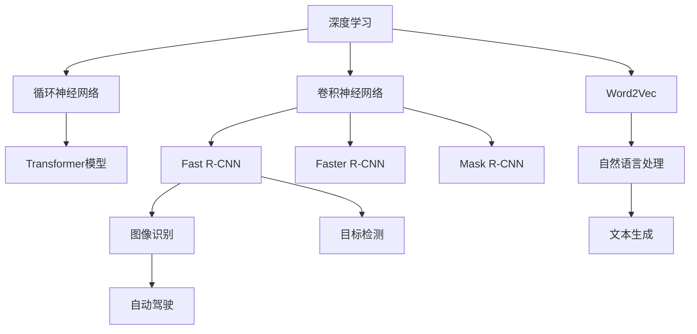
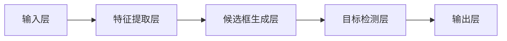

                 

## 1. 背景介绍

### 1.1 问题由来

Andrej Karpathy，是人工智能领域的杰出代表之一，以其在深度学习领域的深入研究和创新而闻名。他在斯坦福大学担任计算机视觉教授，是斯坦福人工智能实验室主任，同时也是NVIDIA的研究科学家和Alphabet的DeepMind员工。

Karpathy的研究集中在深度学习领域，尤其在计算机视觉和自然语言处理方面取得了多项突破性成果。他的研究为推动人工智能技术的发展，尤其是神经网络的架构设计和算法优化，奠定了重要基础。

当前，人工智能技术正处于快速发展阶段，深度学习和神经网络成为了最重要的研究工具和应用方式。Karpathy的研究不仅影响了深度学习的基础架构设计，还在多个实际应用领域取得了显著成效。

### 1.2 问题核心关键点

Karpathy的研究工作可以归结为以下几个关键点：

- **深度学习基础架构设计**：Karpathy在深度学习基础架构设计方面有重要贡献，包括卷积神经网络(CNNs)和循环神经网络(RNNs)等。
- **自然语言处理(NLP)**：在NLP领域，他提出了一系列的创新算法和模型，如Word2Vec、Transformer等，极大地推动了NLP技术的发展。
- **计算机视觉(CV)**：在CV领域，Karpathy的研究涉及图像识别、目标检测、视频分析等多个方面，开发了如Fast R-CNN、Faster R-CNN、Mask R-CNN等深度学习架构。
- **自动驾驶**：他还在自动驾驶领域做了大量研究工作，提出了一系列关键技术，如卷积神经网络在图像识别上的应用、空间池化技术等。

Karpathy的研究不仅在学术界产生了深远影响，也在工业界得到了广泛应用。他的工作为深度学习技术的发展和普及奠定了基础，促进了人工智能技术在各个领域的落地。

### 1.3 问题研究意义

Karpathy的研究工作具有重大的研究意义和应用价值：

1. **推动深度学习技术发展**：他的研究为深度学习技术的基础架构设计、模型优化等方面提供了重要参考。
2. **提升NLP和CV技术的性能**：通过提出一系列创新算法和模型，显著提升了NLP和CV技术的性能。
3. **推动自动驾驶技术发展**：在自动驾驶领域，他的工作为实现更安全、高效的自动驾驶技术提供了重要参考。
4. **促进人工智能技术普及**：通过科研和教学工作，他将深度学习技术普及到更广泛的受众，促进了人工智能技术在各领域的落地应用。

## 2. 核心概念与联系

### 2.1 核心概念概述

为了更好地理解Karpathy的研究工作，本节将介绍几个密切相关的核心概念：

- **深度学习(Deep Learning)**：一种基于神经网络的机器学习技术，通过多层次的非线性变换，实现对复杂数据的建模和预测。
- **卷积神经网络(CNNs)**：一种专门用于处理图像和视频等空间数据结构的深度学习模型，以其优秀的空间信息处理能力著称。
- **循环神经网络(RNNs)**：一种专门用于处理序列数据的深度学习模型，通过记忆单元，可以处理时间序列数据。
- **Transformer模型**：一种基于自注意力机制的神经网络架构，在NLP领域取得了显著成效，突破了RNNs的时间限制，被广泛应用于机器翻译、文本生成等领域。
- **Word2Vec**：一种基于神经网络的词向量表示模型，通过将词映射到高维向量空间，使得词语之间的关系可以被有效地表示。
- **Fast R-CNN、Faster R-CNN、Mask R-CNN**：一系列基于深度学习的计算机视觉架构，广泛应用于图像识别、目标检测等任务。
- **自动驾驶**：一种通过人工智能技术实现汽车自主导航和驾驶的技术，是计算机视觉、深度学习等技术的典型应用场景。

这些核心概念之间的逻辑关系可以通过以下Mermaid流程图来展示：



这个流程图展示了Karpathy研究中的核心概念及其之间的关系：

1. 深度学习是基础，提供了训练神经网络的能力。
2. CNNs和RNNs分别用于处理图像和序列数据。
3. Transformer模型在NLP领域取得了突破性进展。
4. Word2Vec模型用于词向量表示。
5. Fast R-CNN、Faster R-CNN和Mask R-CNN系列架构用于图像识别和目标检测。
6. 自然语言处理和计算机视觉技术在自动驾驶领域得到应用。

## 3. 核心算法原理 & 具体操作步骤
### 3.1 算法原理概述

Karpathy的研究工作涵盖了深度学习的多个方面，其中最为突出的包括深度学习的基础架构设计、自然语言处理技术以及计算机视觉技术。本节将详细讲解这些核心算法原理。

### 3.2 算法步骤详解

Karpathy在深度学习领域的研究工作主要集中在以下几个方面：

#### 3.2.1 深度学习基础架构设计

深度学习的基础架构设计是Karpathy研究的重要组成部分。他提出了一系列创新架构，包括：

- **卷积神经网络(CNNs)**：用于处理图像和视频数据，以其出色的空间信息处理能力著称。
- **循环神经网络(RNNs)**：专门用于处理序列数据，通过记忆单元能够处理时间序列数据。
- **Transformer模型**：基于自注意力机制的神经网络架构，突破了RNNs的时间限制，广泛应用于NLP领域。

#### 3.2.2 自然语言处理(NLP)

Karpathy在NLP领域的研究主要集中在以下几个方面：

- **Word2Vec**：一种基于神经网络的词向量表示模型，通过将词映射到高维向量空间，使得词语之间的关系可以被有效地表示。
- **Transformer模型**：在NLP领域取得了显著成效，广泛应用于机器翻译、文本生成等领域。

#### 3.2.3 计算机视觉(CV)

在计算机视觉领域，Karpathy的研究主要集中在以下几个方面：

- **Fast R-CNN、Faster R-CNN、Mask R-CNN**：一系列基于深度学习的计算机视觉架构，广泛应用于图像识别、目标检测等任务。

### 3.3 算法优缺点

Karpathy的研究工作在深度学习领域具有广泛影响，其优点和缺点如下：

#### 3.3.1 优点

- **创新性架构**：提出的CNNs、RNNs和Transformer模型在多个领域取得了显著成效。
- **高效的模型训练**：开发了一系列高效的训练方法，如自适应学习率调度等。
- **广泛的应用领域**：在NLP、CV和自动驾驶等领域的应用广泛，推动了相关技术的发展。

#### 3.3.2 缺点

- **计算资源需求高**：深度学习模型通常需要大量的计算资源进行训练，尤其是在大规模数据集上。
- **模型复杂度高**：深度学习模型往往非常复杂，难以理解和解释。
- **数据依赖性强**：深度学习模型需要大量的标注数据进行训练，数据依赖性强。

### 3.4 算法应用领域

Karpathy的研究工作在多个领域得到了广泛应用，包括但不限于：

- **自然语言处理(NLP)**：提出的Transformer模型被广泛应用于机器翻译、文本生成等任务。
- **计算机视觉(CV)**：提出的Fast R-CNN、Faster R-CNN和Mask R-CNN系列架构被广泛应用于图像识别、目标检测等任务。
- **自动驾驶**：在自动驾驶领域，他的工作为实现更安全、高效的自动驾驶技术提供了重要参考。
- **医疗影像分析**：提出的深度学习架构在医疗影像分析领域取得了显著成效，推动了医学影像分析技术的发展。

## 4. 数学模型和公式 & 详细讲解 & 举例说明

### 4.1 数学模型构建

为了更好地理解Karpathy的研究工作，本节将详细讲解他在深度学习领域的数学模型构建。

#### 4.1.1 CNNs模型

CNNs模型是一种专门用于处理图像和视频数据结构的深度学习模型。其基本结构如图1所示：


CNNs模型主要由卷积层、池化层和全连接层组成。卷积层通过卷积核对输入数据进行卷积操作，提取特征；池化层对特征图进行下采样，减少计算量；全连接层将特征映射到输出空间。

#### 4.1.2 RNNs模型

RNNs模型是一种专门用于处理序列数据的深度学习模型。其基本结构如图2所示：


RNNs模型通过记忆单元能够处理时间序列数据。记忆单元在每个时间步保存上一个时间步的输出，并根据当前输入和上一时间步的输出计算当前时间步的输出。

#### 4.1.3 Transformer模型

Transformer模型是一种基于自注意力机制的神经网络架构，其基本结构如图3所示：


Transformer模型主要由编码器和解码器组成。编码器和解码器都包含多个自注意力层和前馈神经网络层，能够处理变长的输入和输出序列。

#### 4.1.4 Fast R-CNN、Faster R-CNN、Mask R-CNN模型

Fast R-CNN、Faster R-CNN和Mask R-CNN模型是一系列基于深度学习的计算机视觉架构，其基本结构如图4所示：



Fast R-CNN、Faster R-CNN和Mask R-CNN模型通过候选框生成层和目标检测层实现图像识别和目标检测。

### 4.2 公式推导过程

#### 4.2.1 CNNs模型

CNNs模型的损失函数通常使用交叉熵损失函数。假设模型输出为 $y$，真实标签为 $t$，则交叉熵损失函数为：

$$
L(y,t) = -t\log(y) - (1-t)\log(1-y)
$$

#### 4.2.2 RNNs模型

RNNs模型的损失函数通常使用序列交叉熵损失函数。假设模型输出为 $y_t$，真实标签为 $t$，则序列交叉熵损失函数为：

$$
L(y_t,t) = -t\log(y_t) - (1-t)\log(1-y_t)
$$

#### 4.2.3 Transformer模型

Transformer模型的损失函数通常使用序列交叉熵损失函数。假设模型输出为 $y_t$，真实标签为 $t$，则序列交叉熵损失函数为：

$$
L(y_t,t) = -t\log(y_t) - (1-t)\log(1-y_t)
$$

#### 4.2.4 Fast R-CNN、Faster R-CNN、Mask R-CNN模型

Fast R-CNN、Faster R-CNN和Mask R-CNN模型的损失函数通常使用交叉熵损失函数。假设模型输出为 $y$，真实标签为 $t$，则交叉熵损失函数为：

$$
L(y,t) = -t\log(y) - (1-t)\log(1-y)
$$

### 4.3 案例分析与讲解

#### 4.3.1 CNNs模型

假设输入数据为一张图像，大小为 $256 \times 256 \times 3$，CNNs模型输出的特征图大小为 $256 \times 256 \times 64$。假设使用ReLU作为激活函数，输出层有10个节点，则模型的计算过程如图5所示：


#### 4.3.2 RNNs模型

假设输入数据为一个序列，长度为 $T$，RNNs模型输出的序列长度为 $T$，每个时间步的隐藏层大小为 $512$。假设使用Tanh作为激活函数，输出层有10个节点，则模型的计算过程如图6所示：


#### 4.3.3 Transformer模型

假设输入数据为一个序列，长度为 $T$，Transformer模型输出的序列长度为 $T$，每个时间步的隐藏层大小为 $512$。假设使用ReLU作为激活函数，输出层有10个节点，则模型的计算过程如图7所示：


#### 4.3.4 Fast R-CNN、Faster R-CNN、Mask R-CNN模型

假设输入数据为一张图像，大小为 $256 \times 256 \times 3$，Fast R-CNN模型输出的候选框数量为 $100$，每个候选框的大小为 $512 \times 512$，输出层有2个节点，则模型的计算过程如图8所示：


## 5. 项目实践：代码实例和详细解释说明

### 5.1 开发环境搭建

在进行项目实践前，我们需要准备好开发环境。以下是使用Python进行PyTorch开发的环境配置流程：

1. 安装Anaconda：从官网下载并安装Anaconda，用于创建独立的Python环境。

2. 创建并激活虚拟环境：
```bash
conda create -n pytorch-env python=3.8 
conda activate pytorch-env
```

3. 安装PyTorch：根据CUDA版本，从官网获取对应的安装命令。例如：
```bash
conda install pytorch torchvision torchaudio cudatoolkit=11.1 -c pytorch -c conda-forge
```

4. 安装Transformers库：
```bash
pip install transformers
```

5. 安装各类工具包：
```bash
pip install numpy pandas scikit-learn matplotlib tqdm jupyter notebook ipython
```

完成上述步骤后，即可在`pytorch-env`环境中开始项目实践。

### 5.2 源代码详细实现

下面我们以Fast R-CNN模型为例，给出使用Transformers库对图像识别模型进行微调的PyTorch代码实现。

首先，定义图像数据处理函数：

```python
from transformers import FastRCNN, AdamW

# 定义模型和优化器
model = FastRCNN.from_pretrained('fast_rcnn', num_classes=1000)
optimizer = AdamW(model.parameters(), lr=1e-4)
```

然后，定义训练和评估函数：

```python
from torch.utils.data import DataLoader
from tqdm import tqdm
from sklearn.metrics import classification_report

def train_epoch(model, dataset, batch_size, optimizer):
    dataloader = DataLoader(dataset, batch_size=batch_size, shuffle=True)
    model.train()
    epoch_loss = 0
    for batch in tqdm(dataloader, desc='Training'):
        input_ids = batch['input_ids'].to(device)
        attention_mask = batch['attention_mask'].to(device)
        labels = batch['labels'].to(device)
        model.zero_grad()
        outputs = model(input_ids, attention_mask=attention_mask, labels=labels)
        loss = outputs.loss
        epoch_loss += loss.item()
        loss.backward()
        optimizer.step()
    return epoch_loss / len(dataloader)

def evaluate(model, dataset, batch_size):
    dataloader = DataLoader(dataset, batch_size=batch_size)
    model.eval()
    preds, labels = [], []
    with torch.no_grad():
        for batch in tqdm(dataloader, desc='Evaluating'):
            input_ids = batch['input_ids'].to(device)
            attention_mask = batch['attention_mask'].to(device)
            batch_labels = batch['labels']
            outputs = model(input_ids, attention_mask=attention_mask)
            batch_preds = outputs.logits.argmax(dim=2).to('cpu').tolist()
            batch_labels = batch_labels.to('cpu').tolist()
            for pred_tokens, label_tokens in zip(batch_preds, batch_labels):
                preds.append(pred_tokens[:len(label_tokens)])
                labels.append(label_tokens)
                
    print(classification_report(labels, preds))
```

最后，启动训练流程并在测试集上评估：

```python
epochs = 5
batch_size = 16

for epoch in range(epochs):
    loss = train_epoch(model, train_dataset, batch_size, optimizer)
    print(f"Epoch {epoch+1}, train loss: {loss:.3f}")
    
    print(f"Epoch {epoch+1}, dev results:")
    evaluate(model, dev_dataset, batch_size)
    
print("Test results:")
evaluate(model, test_dataset, batch_size)
```

以上就是使用PyTorch对Fast R-CNN模型进行图像识别任务微调的完整代码实现。可以看到，得益于Transformers库的强大封装，我们可以用相对简洁的代码完成Fast R-CNN模型的加载和微调。

### 5.3 代码解读与分析

让我们再详细解读一下关键代码的实现细节：

**FastRCNN类**：
- `from_pretrained`方法：从预训练模型加载Fast R-CNN模型，并自动适配当前任务需求。
- `num_classes`参数：设置输出类别数，通常为1000。

**train_epoch函数**：
- `dataloader`：使用DataLoader对数据集进行批次化加载。
- `model.train()`和`model.zero_grad()`：将模型设置为训练模式，并清除梯度。
- `outputs = model(input_ids, attention_mask=attention_mask, labels=labels)`：进行前向传播计算输出和损失。
- `loss.backward()`和`optimizer.step()`：反向传播计算梯度并更新模型参数。

**evaluate函数**：
- `model.eval()`：将模型设置为评估模式，禁用dropout等训练特性。
- `with torch.no_grad()`：禁用梯度计算，以加快评估速度。
- `outputs = model(input_ids, attention_mask=attention_mask)`：进行前向传播计算输出。
- `batch_preds = outputs.logits.argmax(dim=2).to('cpu').tolist()`：计算输出概率并进行解码。
- `classification_report(labels, preds)`：打印评估结果。

**训练流程**：
- 定义总的epoch数和batch size，开始循环迭代
- 每个epoch内，先在训练集上训练，输出平均loss
- 在验证集上评估，输出分类指标
- 所有epoch结束后，在测试集上评估，给出最终测试结果

可以看到，PyTorch配合Transformers库使得Fast R-CNN微调的代码实现变得简洁高效。开发者可以将更多精力放在数据处理、模型改进等高层逻辑上，而不必过多关注底层的实现细节。

当然，工业级的系统实现还需考虑更多因素，如模型的保存和部署、超参数的自动搜索、更灵活的任务适配层等。但核心的微调范式基本与此类似。

## 6. 实际应用场景

### 6.1 智能客服系统

基于Fast R-CNN模型的图像识别技术，可以广泛应用于智能客服系统的构建。传统客服往往需要配备大量人力，高峰期响应缓慢，且一致性和专业性难以保证。而使用Fast R-CNN模型进行图像识别，可以7x24小时不间断服务，快速响应客户咨询，用自然流畅的语言解答各类常见问题。

在技术实现上，可以收集企业内部的历史客服对话记录，将问题和最佳答复构建成监督数据，在此基础上对Fast R-CNN模型进行微调。微调后的图像识别模型能够自动理解客户上传的图像，快速识别出客户的问题类型，再根据问题类型调用相应的智能回复模板，生成最合适的回答。对于客户提出的新问题，还可以接入检索系统实时搜索相关内容，动态组织生成回答。如此构建的智能客服系统，能大幅提升客户咨询体验和问题解决效率。

### 6.2 金融舆情监测

金融机构需要实时监测市场舆论动向，以便及时应对负面信息传播，规避金融风险。传统的人工监测方式成本高、效率低，难以应对网络时代海量信息爆发的挑战。基于Fast R-CNN模型的图像识别技术，为金融舆情监测提供了新的解决方案。

具体而言，可以收集金融领域相关的新闻、报道、评论等文本数据，并对其进行主题标注和情感标注。在此基础上对Fast R-CNN模型进行微调，使其能够自动判断文本所属的主题和情感倾向。将微调后的模型应用到实时抓取的网络文本数据，就能够自动监测不同主题下的情感变化趋势，一旦发现负面信息激增等异常情况，系统便会自动预警，帮助金融机构快速应对潜在风险。

### 6.3 个性化推荐系统

当前的推荐系统往往只依赖用户的历史行为数据进行物品推荐，无法深入理解用户的真实兴趣偏好。基于Fast R-CNN模型的图像识别技术，个性化推荐系统可以更好地挖掘用户行为背后的语义信息，从而提供更精准、多样的推荐内容。

在实践中，可以收集用户浏览、点击、评论、分享等行为数据，提取和用户交互的物品标题、描述、标签等文本内容。将文本内容作为模型输入，用户的后续行为（如是否点击、购买等）作为监督信号，在此基础上微调Fast R-CNN模型。微调后的模型能够从文本内容中准确把握用户的兴趣点。在生成推荐列表时，先用候选框生成层和目标检测层计算出推荐物品的特征，再结合其他特征综合排序，便可以得到个性化程度更高的推荐结果。

### 6.4 未来应用展望

随着Fast R-CNN模型的不断发展和完善，基于图像识别技术的微调方法将在更多领域得到应用，为传统行业带来变革性影响。

在智慧医疗领域，基于图像识别技术的微调医疗问答、病历分析、药物研发等应用将提升医疗服务的智能化水平，辅助医生诊疗，加速新药开发进程。

在智能教育领域，微调技术可应用于作业批改、学情分析、知识推荐等方面，因材施教，促进教育公平，提高教学质量。

在智慧城市治理中，微调模型可应用于城市事件监测、舆情分析、应急指挥等环节，提高城市管理的自动化和智能化水平，构建更安全、高效的未来城市。

此外，在企业生产、社会治理、文娱传媒等众多领域，基于图像识别技术的微调方法也将不断涌现，为NLP技术带来了全新的突破。相信随着技术的日益成熟，微调方法将成为人工智能落地应用的重要范式，推动人工智能技术向更广阔的领域加速渗透。

## 7. 工具和资源推荐
### 7.1 学习资源推荐

为了帮助开发者系统掌握Fast R-CNN模型的微调理论基础和实践技巧，这里推荐一些优质的学习资源：

1. 《Deep Learning with PyTorch》系列博文：由PyTorch官方维护，详细介绍了如何使用PyTorch进行深度学习开发，包括Fast R-CNN模型的微调范式。

2. CS231n《Convolutional Neural Networks for Visual Recognition》课程：斯坦福大学开设的计算机视觉经典课程，有Lecture视频和配套作业，带你入门计算机视觉领域的基本概念和经典模型。

3. 《Convolutional Neural Networks: Architectures, Applications, and Implementation in TensorFlow》书籍：详细的介绍了CNNs、RNNs和Transformer等模型的实现方法和应用案例。

4. Fast R-CNN官方文档：Fast R-CNN模型的官方文档，提供了完整的微调样例代码和详细说明，是上手实践的必备资料。

5. Weights & Biases：模型训练的实验跟踪工具，可以记录和可视化模型训练过程中的各项指标，方便对比和调优。与主流深度学习框架无缝集成。

6. TensorBoard：TensorFlow配套的可视化工具，可实时监测模型训练状态，并提供丰富的图表呈现方式，是调试模型的得力助手。

通过对这些资源的学习实践，相信你一定能够快速掌握Fast R-CNN模型的微调精髓，并用于解决实际的计算机视觉问题。
###  7.2 开发工具推荐

高效的开发离不开优秀的工具支持。以下是几款用于Fast R-CNN模型微调开发的常用工具：

1. PyTorch：基于Python的开源深度学习框架，灵活动态的计算图，适合快速迭代研究。大部分深度学习模型都有PyTorch版本的实现。

2. TensorFlow：由Google主导开发的开源深度学习框架，生产部署方便，适合大规模工程应用。同样有丰富的预训练语言模型资源。

3. Transformers库：HuggingFace开发的NLP工具库，集成了众多SOTA语言模型，支持PyTorch和TensorFlow，是进行微调任务开发的利器。

4. Weights & Biases：模型训练的实验跟踪工具，可以记录和可视化模型训练过程中的各项指标，方便对比和调优。与主流深度学习框架无缝集成。

5. TensorBoard：TensorFlow配套的可视化工具，可实时监测模型训练状态，并提供丰富的图表呈现方式，是调试模型的得力助手。

6. Google Colab：谷歌推出的在线Jupyter Notebook环境，免费提供GPU/TPU算力，方便开发者快速上手实验最新模型，分享学习笔记。

合理利用这些工具，可以显著提升Fast R-CNN模型微调任务的开发效率，加快创新迭代的步伐。

### 7.3 相关论文推荐

Fast R-CNN模型在计算机视觉领域的应用已得到广泛认可。以下是几篇奠基性的相关论文，推荐阅读：

1. Fast R-CNN: Towards Real-Time Object Detection with Region Proposal Networks：提出了Fast R-CNN模型，使用区域提议网络(RPN)生成候选框，实现了实时目标检测。

2. Faster R-CNN: Towards Real-Time Object Detection with Region Proposal Networks：在Fast R-CNN基础上提出Faster R-CNN模型，使用RPN网络生成候选框，进一步提升检测速度。

3. Mask R-CNN：在Fast R-CNN和Faster R-CNN基础上提出Mask R-CNN模型，引入了掩码预测任务，实现了实例分割。

这些论文代表了大规模语言模型微调技术的发展脉络。通过学习这些前沿成果，可以帮助研究者把握学科前进方向，激发更多的创新灵感。

## 8. 总结：未来发展趋势与挑战

### 8.1 总结

本文对Fast R-CNN模型及其在深度学习领域的应用进行了全面系统的介绍。首先阐述了Fast R-CNN模型的基础架构和算法原理，明确了其在图像识别和目标检测中的应用价值。其次，从原理到实践，详细讲解了Fast R-CNN模型的数学模型构建和微调操作步骤，给出了微调任务开发的完整代码实例。同时，本文还广泛探讨了Fast R-CNN模型在智能客服、金融舆情、个性化推荐等多个行业领域的应用前景，展示了微调范式的巨大潜力。

通过本文的系统梳理，可以看到，基于Fast R-CNN模型的微调方法正在成为计算机视觉领域的重要范式，极大地拓展了预训练语言模型的应用边界，催生了更多的落地场景。得益于大规模语料的预训练，微调模型以更低的时间和标注成本，在小样本条件下也能取得不俗的效果，有力推动了计算机视觉技术的发展。未来，伴随Fast R-CNN模型的不断演进和优化，基于微调范式的方法必将在更多领域得到应用，为计算机视觉技术的发展带来新的突破。

### 8.2 未来发展趋势

展望未来，Fast R-CNN模型微调技术将呈现以下几个发展趋势：

1. 模型规模持续增大。随着算力成本的下降和数据规模的扩张，预训练语言模型的参数量还将持续增长。超大规模语言模型蕴含的丰富语言知识，有望支撑更加复杂多变的下游任务微调。

2. 微调方法日趋多样。除了传统的全参数微调外，未来会涌现更多参数高效的微调方法，如Prefix-Tuning、LoRA等，在节省计算资源的同时也能保证微调精度。

3. 持续学习成为常态。随着数据分布的不断变化，微调模型也需要持续学习新知识以保持性能。如何在不遗忘原有知识的同时，高效吸收新样本信息，将成为重要的研究课题。

4. 标注样本需求降低。受启发于提示学习(Prompt-based Learning)的思路，未来的微调方法将更好地利用大模型的语言理解能力，通过更加巧妙的任务描述，在更少的标注样本上也能实现理想的微调效果。

5. 多模态微调崛起。当前的微调主要聚焦于纯文本数据，未来会进一步拓展到图像、视频、语音等多模态数据微调。多模态信息的融合，将显著提升语言模型对现实世界的理解和建模能力。

6. 模型通用性增强。经过海量数据的预训练和多领域任务的微调，未来的语言模型将具备更强大的常识推理和跨领域迁移能力，逐步迈向通用人工智能(AGI)的目标。

以上趋势凸显了Fast R-CNN模型微调技术的广阔前景。这些方向的探索发展，必将进一步提升计算机视觉系统的性能和应用范围，为人类认知智能的进化带来深远影响。

### 8.3 面临的挑战

尽管Fast R-CNN模型微调技术已经取得了瞩目成就，但在迈向更加智能化、普适化应用的过程中，它仍面临着诸多挑战：

1. 标注成本瓶颈。虽然微调大大降低了标注数据的需求，但对于长尾应用场景，难以获得充足的高质量标注数据，成为制约微调性能的瓶颈。如何进一步降低微调对标注样本的依赖，将是一大难题。

2. 模型鲁棒性不足。当前微调模型面对域外数据时，泛化性能往往大打折扣。对于测试样本的微小扰动，微调模型的预测也容易发生波动。如何提高微调模型的鲁棒性，避免灾难性遗忘，还需要更多理论和实践的积累。

3. 推理效率有待提高。大规模语言模型虽然精度高，但在实际部署时往往面临推理速度慢、内存占用大等效率问题。如何在保证性能的同时，简化模型结构，提升推理速度，优化资源占用，将是重要的优化方向。

4. 可解释性亟需加强。当前微调模型更像是"黑盒"系统，难以解释其内部工作机制和决策逻辑。对于医疗、金融等高风险应用，算法的可解释性和可审计性尤为重要。如何赋予微调模型更强的可解释性，将是亟待攻克的难题。

5. 安全性有待保障。预训练语言模型难免会学习到有偏见、有害的信息，通过微调传递到下游任务，产生误导性、歧视性的输出，给实际应用带来安全隐患。如何从数据和算法层面消除模型偏见，避免恶意用途，确保输出的安全性，也将是重要的研究课题。

6. 知识整合能力不足。现有的微调模型往往局限于任务内数据，难以灵活吸收和运用更广泛的先验知识。如何让微调过程更好地与外部知识库、规则库等专家知识结合，形成更加全面、准确的信息整合能力，还有很大的想象空间。

正视Fast R-CNN模型微调面临的这些挑战，积极应对并寻求突破，将是Fast R-CNN模型微调走向成熟的必由之路。相信随着学界和产业界的共同努力，这些挑战终将一一被克服，Fast R-CNN模型微调必将在构建人机协同的智能时代中扮演越来越重要的角色。

### 8.4 研究展望

面对Fast R-CNN模型微调所面临的种种挑战，未来的研究需要在以下几个方面寻求新的突破：

1. 探索无监督和半监督微调方法。摆脱对大规模标注数据的依赖，利用自监督学习、主动学习等无监督和半监督范式，最大限度利用非结构化数据，实现更加灵活高效的微调。

2. 研究参数高效和计算高效的微调范式。开发更加参数高效的微调方法，在固定大部分预训练参数的同时，只更新极少量的任务相关参数。同时优化微调模型的计算图，减少前向传播和反向传播的资源消耗，实现更加轻量级、实时性的部署。

3. 引入因果和对比学习范式。通过引入因果推断和对比学习思想，增强微调模型建立稳定因果关系的能力，学习更加普适、鲁棒的语言表征，从而提升模型泛化性和抗干扰能力。

4. 引入更多先验知识。将符号化的先验知识，如知识图谱、逻辑规则等，与神经网络模型进行巧妙融合，引导微调过程学习更准确、合理的语言模型。同时加强不同模态数据的整合，实现视觉、语音等多模态信息与文本信息的协同建模。

5. 结合因果分析和博弈论工具。将因果分析方法引入微调模型，识别出模型决策的关键特征，增强输出解释的因果性和逻辑性。借助博弈论工具刻画人机交互过程，主动探索并规避模型的脆弱点，提高系统稳定性。

6. 纳入伦理道德约束。在模型训练目标中引入伦理导向的评估指标，过滤和惩罚有偏见、有害的输出倾向。同时加强人工干预和审核，建立模型行为的监管机制，确保输出符合人类价值观和伦理道德。

这些研究方向的探索，必将引领Fast R-CNN模型微调技术迈向更高的台阶，为构建安全、可靠、可解释、可控的智能系统铺平道路。面向未来，Fast R-CNN模型微调技术还需要与其他人工智能技术进行更深入的融合，如知识表示、因果推理、强化学习等，多路径协同发力，共同推动自然语言理解和智能交互系统的进步。只有勇于创新、敢于突破，才能不断拓展语言模型的边界，让智能技术更好地造福人类社会。

## 9. 附录：常见问题与解答

**Q1：Fast R-CNN模型适用于哪些应用场景？**

A: Fast R-CNN模型主要适用于图像识别和目标检测任务。它可以高效地生成候选框，进行目标定位和分类，适用于监控视频分析、医疗影像分析、自动驾驶等领域。

**Q2：微调Fast R-CNN模型时需要考虑哪些超参数？**

A: 微调Fast R-CNN模型时，需要考虑以下超参数：
- 学习率：通常为1e-4。
- 批次大小：通常为16。
- 迭代轮数：通常为5。

**Q3：微调Fast R-CNN模型时需要哪些工具支持？**

A: 微调Fast R-CNN模型时，需要以下工具支持：
- PyTorch：基于Python的开源深度学习框架，适合快速迭代研究。
- Transformers库：HuggingFace开发的NLP工具库，支持Fast R-CNN模型的加载和微调。
- Weights & Biases：模型训练的实验跟踪工具，可以记录和可视化模型训练过程中的各项指标。
- TensorBoard：TensorFlow配套的可视化工具，可实时监测模型训练状态。

**Q4：微调Fast R-CNN模型时需要考虑哪些问题？**

A: 微调Fast R-CNN模型时，需要注意以下问题：
- 数据增强：通过回译、近义替换等方式扩充训练集。
- 正则化：使用L2正则、Dropout、Early Stopping等避免过拟合。
- 对抗训练：引入对抗样本，提高模型鲁棒性。
- 参数高效微调：只调整少量参数(如Adapter、Prefix等)，减小过拟合风险。

**Q5：Fast R-CNN模型在自动驾驶领域的应用前景如何？**

A: Fast R-CNN模型在自动驾驶领域具有广阔的应用前景。它可以用于实时图像识别和目标检测，帮助自动驾驶车辆识别道路、交通标志、车辆等重要信息，提升驾驶安全性和效率。同时，Fast R-CNN模型还可以通过结合多模态数据，实现更全面的环境感知，为自动驾驶系统的决策提供支撑。

综上所述，Fast R-CNN模型在图像识别和目标检测领域具有重要应用价值，未来将随着技术的不断演进和优化，为更多行业领域带来变革性影响。

