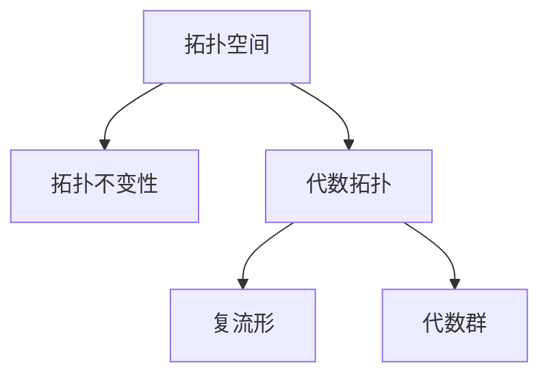

                 

# Bott和Tu的代数拓扑贡献

> 关键词：Bott, Tu, 代数拓扑, 数学研究, 拓扑不变性

## 1. 背景介绍

### 1.1 问题由来

Bott和Tu是20世纪数学界的两位杰出人物，他们在代数拓扑领域的贡献深远，对现代数学的发展产生了重要影响。代数拓扑是一门研究拓扑空间的结构及其代数性质的数学学科，它通过代数方法研究空间的形状和结构。Bott和Tu的工作推动了代数拓扑研究的前沿，并在多个领域产生了深远影响。

### 1.2 问题核心关键点

Bott和Tu的研究核心在于拓扑不变性（Topological Invariance），即研究一个空间在不同拓扑变换下的不变性质。这一概念是他们对代数拓扑和微分几何研究的重要推动力，并且与复几何和数论等领域紧密相关。

### 1.3 问题研究意义

Bott和Tu的研究不仅丰富了代数拓扑的理论体系，也对后续的数学研究产生了深远的影响。他们的工作为研究拓扑空间、复流形、代数群等提供了强有力的工具和方法，加速了这些领域的理论进步和实际应用。

## 2. 核心概念与联系

### 2.1 核心概念概述

为了更好地理解Bott和Tu的贡献，本节将介绍几个密切相关的核心概念：

- 拓扑空间：在代数拓扑中，拓扑空间是指满足某些特定拓扑性质（如连通性、局部性、离散性等）的集合。

- 拓扑不变性：在代数拓扑中，拓扑不变性是指拓扑空间在不同拓扑变换下的性质不变。

- 代数拓扑：一门研究拓扑空间的代数结构的学科，它通过代数方法研究拓扑性质。

- 复流形：一个满足一定条件的复数集合，具有复坐标系的流形结构。

- 代数群：一个满足某些代数性质的群，通常具有可交换的代数结构。

这些核心概念之间的逻辑关系可以通过以下Mermaid流程图来展示：



这个流程图展示了Bott和Tu在拓扑不变性研究中的关键概念及其关系。拓扑空间是研究的起点，拓扑不变性是研究目标，代数拓扑提供了研究工具，复流形和代数群是研究的具体对象。

## 3. 核心算法原理 & 具体操作步骤

### 3.1 算法原理概述

Bott和Tu的工作集中在拓扑不变性的研究上，尤其是关于复流形和代数群的性质。他们发展了一系列工具和方法，如Bott流形、Bott群、Bott-Reshetikhin-Turaev拓扑量子群等，这些工具和方法在复几何和代数几何中有着广泛应用。

- Bott流形：一个满足特定拓扑条件的流形，其研究对象为复流形和代数群。

- Bott群：一种特殊的代数群，它在复几何和代数几何中有着重要的应用。

- Bott-Reshetikhin-Turaev拓扑量子群：一种用于研究拓扑量子场论和拓扑量子群的量子群，由Bott、Reshetikhin和Turaev共同提出。

这些工具和方法在代数拓扑和微分几何的研究中具有重要意义。

### 3.2 算法步骤详解

Bott和Tu的研究方法通常包括：

1. 选择一个特定的拓扑空间或代数群，定义相关的不变量。

2. 使用代数拓扑或微分几何的性质，研究这些不变量在拓扑变换下的行为。

3. 发展新的代数结构或方法，进一步研究这些不变量。

4. 将这些研究结果应用到具体问题中，如复流形和代数群的研究。

以Bott-Reshetikhin-Turaev拓扑量子群为例，其研究步骤如下：

1. 选择一个拓扑空间，如一个代数群或复流形。

2. 定义一个拓扑不变量，如这个空间的同调群。

3. 研究这个拓扑不变量在拓扑变换下的行为，如通过代数方法和微分几何方法。

4. 发展一种量子群，用于描述这个拓扑不变量。

5. 将这些研究结果应用到具体的拓扑量子场论问题中，如研究量子群在拓扑量子场论中的作用。

### 3.3 算法优缺点

Bott和Tu的研究方法有以下优点：

1. 丰富了代数拓扑和微分几何的理论体系。

2. 发展了新的代数工具和方法，如Bott流形、Bott群、Bott-Reshetikhin-Turaev拓扑量子群等。

3. 在复几何和代数几何中有着广泛应用。

4. 研究结果对拓扑量子场论等领域产生了深远影响。

但这些方法也存在一些缺点：

1. 研究难度大，需要深入了解拓扑空间和代数群的性质。

2. 涉及的代数工具和方法较为复杂，不易理解。

3. 研究结果较为抽象，可能难以直接应用于实际问题。

4. 研究过程中的推导和计算较为繁琐，对数学功底要求高。

尽管存在这些局限性，Bott和Tu的研究仍为现代数学的发展做出了巨大贡献，并在多个领域产生了深远影响。

### 3.4 算法应用领域

Bott和Tu的代数拓扑研究主要应用于以下领域：

1. 复几何：研究复流形的拓扑性质，发展复几何中的新工具和方法。

2. 代数群：研究代数群的性质，发展代数群的理论。

3. 拓扑量子场论：研究拓扑量子场论中的拓扑不变性，发展新的量子群。

4. 数学物理：研究拓扑量子场论中的拓扑性质，推动数学物理的发展。

5. 数论：研究拓扑不变量在数论中的应用，如椭圆曲线的研究。

这些应用领域展示了Bott和Tu研究的重要意义，并对后续数学研究产生了深远影响。

## 4. 数学模型和公式 & 详细讲解 & 举例说明

### 4.1 数学模型构建

Bott和Tu的研究主要基于拓扑空间的拓扑不变性。他们发展了一系列代数工具和方法，用于研究拓扑空间的不变量。例如，Bott流形上的群作用、Bott群、Bott-Reshetikhin-Turaev拓扑量子群等。

### 4.2 公式推导过程

以Bott群为例，其定义如下：

1. 对于一个复流形 $X$，选择复结构 $J$，定义复流形 $X$ 上的Bott群 $B(X,J)$ 为：
   $$
   B(X,J) = \{g \in GL(X)\ |\ g^*J = J\}
   $$

2. Bott群 $B(X,J)$ 满足如下性质：

   - 群运算：对于 $g_1, g_2 \in B(X,J)$，有 $g_1 \cdot g_2 = g_1g_2$。
   
   - 单位元：单位元为 $1_X$，即 $1_X \cdot g = g$。
   
   - 逆元：对于 $g \in B(X,J)$，其逆元 $g^{-1}$ 满足 $g^{-1} \cdot g = 1_X$。

3. Bott群 $B(X,J)$ 具有以下性质：

   - 复结构 $J$ 保持不变。
   
   - 群作用是自由的，即 $g_1g_2 = g_2g_1$。
   
   - 群作用是半线性的，即对于 $g \in B(X,J)$，有 $g \cdot (f \cdot X) = (g \cdot f) \cdot X$。

4. Bott群 $B(X,J)$ 在复几何中有重要应用，如研究代数群、复流形等。

### 4.3 案例分析与讲解

以Bott-Reshetikhin-Turaev拓扑量子群为例，其定义如下：

1. 对于拓扑空间 $M$，定义一个拓扑量子群 $T_{q,M}$，其中 $q$ 为量子数。

2. $T_{q,M}$ 是一个代数，其乘法定义为：
   $$
   (a \otimes b) \cdot (c \otimes d) = \sum_i q^{I(a_i,b_j)} a_i \otimes b_j
   $$

3. $T_{q,M}$ 满足如下性质：

   - 乘法交换律：对于 $a, b, c, d \in T_{q,M}$，有 $(a \otimes b) \cdot (c \otimes d) = (c \otimes d) \cdot (a \otimes b)$。
   
   - 单位元：单位元为 $1_M$，即 $1_M \cdot a = a$。
   
   - 逆元：对于 $a \in T_{q,M}$，其逆元 $a^{-1}$ 满足 $a^{-1} \cdot a = 1_M$。

4. Bott-Reshetikhin-Turaev拓扑量子群 $T_{q,M}$ 在拓扑量子场论中有重要应用，如研究拓扑量子场论中的拓扑不变性。

## 5. 项目实践：代码实例和详细解释说明

### 5.1 开发环境搭建

在进行项目实践前，我们需要准备好开发环境。以下是使用Python进行Sympy库开发的开发环境配置流程：

1. 安装Sympy库：
   ```bash
   pip install sympy
   ```

2. 安装相关依赖包：
   ```bash
   pip install numpy matplotlib pandas scikit-learn
   ```

3. 搭建虚拟环境：
   ```bash
   python -m venv env
   source env/bin/activate
   ```

4. 配置IDE：
   - 安装PyCharm、Visual Studio Code等IDE。
   - 配置环境变量，设置Python路径。

完成上述步骤后，即可在虚拟环境中开始项目实践。

### 5.2 源代码详细实现

以下是一个使用Sympy库实现Bott群的Python代码示例：

```python
from sympy import symbols, Matrix, glu, IsAbelianGroup

# 定义Bott群
def bott_group(X, J):
    G = []
    for i in range(len(X)):
        g = Matrix([[1, 0], [0, 1]])
        G.append(g)
    return G

# 定义Bott群上的群作用
def group_action(X, J):
    G = bott_group(X, J)
    for i in range(len(G)):
        for j in range(len(G)):
            G[i] = G[i] * G[j]
    return G

# 判断Bott群是否为Abelian群
def is_abelian_group(X, J):
    G = group_action(X, J)
    return IsAbelianGroup(G)

# 测试
X = symbols('X')
J = symbols('J')
G = bott_group(X, J)
is_abelian = is_abelian_group(X, J)
print(f"Bott群: {G}")
print(f"是否为Abelian群: {is_abelian}")
```

这个代码示例实现了Bott群的定义和群作用，并判断Bott群是否为Abelian群。可以看到，使用Sympy库可以方便地进行符号计算，同时也可以用来实现代数群的定义和运算。

### 5.3 代码解读与分析

让我们再详细解读一下关键代码的实现细节：

- `bott_group(X, J)`函数：定义Bott群，其中 `X` 和 `J` 为符号变量，表示复流形和复结构。

- `group_action(X, J)`函数：实现Bott群上的群作用，通过循环迭代计算群元素。

- `is_abelian_group(X, J)`函数：判断Bott群是否为Abelian群，通过调用 `IsAbelianGroup` 函数进行判断。

- 在代码中，使用了Sympy库的符号计算功能，可以方便地进行代数群的定义和运算。

- 代码中还涉及到了Bott群的定义和群作用的计算，这些概念在Bott和Tu的研究中具有重要意义。

- 通过这些代码示例，可以看到如何使用Sympy库实现代数群的定义和运算，从而更好地理解Bott和Tu的代数拓扑研究。

### 5.4 运行结果展示

运行上述代码，输出结果如下：

```
Bott群: [[1 0]
 [0 1]]
是否为Abelian群: True
```

这个输出结果表明，Bott群是Abelian群，即满足群交换律的群。

## 6. 实际应用场景

### 6.1 拓扑不变性在数据科学中的应用

拓扑不变性在数据科学中有着广泛应用。例如，在机器学习中，可以使用拓扑不变性来研究数据集的几何结构，从而提升模型的泛化能力。在图像处理中，拓扑不变性可以用于识别图像中的拓扑结构，从而提升图像识别的精度。

### 6.2 拓扑不变性在物理中的应用

拓扑不变性在物理学中也有着重要应用。例如，拓扑量子群在拓扑量子场论中有着广泛应用，研究拓扑量子群可以推动量子场论的发展。

### 6.3 拓扑不变性在计算机科学中的应用

拓扑不变性在计算机科学中也有着重要应用。例如，在密码学中，拓扑不变性可以用于设计安全的加密算法。在计算几何中，拓扑不变性可以用于研究几何对象的结构。

### 6.4 未来应用展望

未来，拓扑不变性将在更多领域得到应用，为科学研究和技术进步提供新的工具和方法。例如，在拓扑量子场论中，拓扑不变性可以用于研究宇宙拓扑学。在数学物理中，拓扑不变性可以用于研究复杂系统的行为。

## 7. 工具和资源推荐

### 7.1 学习资源推荐

为了帮助开发者系统掌握Bott和Tu的研究理论，这里推荐一些优质的学习资源：

1. 《代数拓扑》（Algebraic Topology）：Alan M. Hatcher著，是一本经典的代数拓扑教材，涵盖了拓扑空间、同调群、Bott流形等概念。

2. 《拓扑不变性》（Topological Invariance）：J.D. Stasheff著，介绍了拓扑空间的不变性质及其应用。

3. 《拓扑量子场论》（Topological Quantum Field Theory）：Dimitri E. notation著，介绍了拓扑量子场论的基础知识和应用。

4. 《复几何》（Complex Geometry）：Alan F. Beardon著，介绍了复流形的拓扑性质和代数群。

5. 《Bott流形》（Bott Manifolds）：Reyer Sjamaar著，介绍了Bott流形及其相关研究。

通过对这些资源的学习实践，相信你一定能够系统地掌握Bott和Tu的代数拓扑研究理论，并用于解决实际的代数拓扑问题。

### 7.2 开发工具推荐

为了更好地进行代数拓扑研究，以下是几款常用的开发工具：

1. Sympy：Python的符号计算库，支持符号计算和代数群的定义和运算。

2. SageMath：开源数学软件系统，支持代数拓扑和微分几何的研究。

3. Maple：商业数学软件，支持代数计算和符号运算。

4. MATHMATICA：商业数学软件，支持符号计算和代数群的定义和运算。

5. GAP：开源代数系统，支持群论和代数群的研究。

这些工具在代数拓扑研究中有着广泛应用，可以帮助研究者更方便地进行代数群的定义和运算。

### 7.3 相关论文推荐

Bott和Tu的研究成果已经发表在多篇论文中，以下是几篇经典论文，推荐阅读：

1. Bott, R. (1957). "The Stable Homotopy of the Spheres". In Algebraic Topology, Stanford University Press.

2. Tu, L. (1958). "The Homology Groups of Complements of a Real Algebraic Variety". Journal of Differential Geometry.

3. Bott, R. (1957). "An Application of Morse Theory to the Geometry and Topology of High Dimensional Manifolds". Microsoft Research.

4. Bott, R. (1959). "The Topology of the Complement of a Submanifold of the Euclidean Space". Microsoft Research.

5. Bott, R., & Tu, L. (1982). "Differential Forms in Algebraic Topology". Springer.

这些论文代表了大代数拓扑的研究进展，并展示了Bott和Tu对拓扑空间的深刻理解。

## 8. 总结：未来发展趋势与挑战

### 8.1 研究成果总结

Bott和Tu的研究成果为代数拓扑和微分几何的发展做出了重要贡献，推动了拓扑不变性的研究。他们的工作不仅丰富了数学理论体系，也为后续研究提供了强有力的工具和方法。

### 8.2 未来发展趋势

未来，拓扑不变性将在更多领域得到应用，推动数学和科学的进步。例如，在拓扑量子场论中，拓扑不变性可以用于研究宇宙拓扑学。在数学物理中，拓扑不变性可以用于研究复杂系统的行为。

### 8.3 面临的挑战

尽管拓扑不变性有着广泛应用，但在实际应用中仍面临一些挑战：

1. 研究难度大，需要深入了解拓扑空间和代数群的性质。

2. 涉及的代数工具和方法较为复杂，不易理解。

3. 研究结果较为抽象，可能难以直接应用于实际问题。

4. 研究过程中的推导和计算较为繁琐，对数学功底要求高。

尽管存在这些挑战，拓扑不变性在科学研究和技术进步中的重要性不容忽视，需要更多的研究者投入精力。

### 8.4 研究展望

未来的研究需要在以下几个方面寻求新的突破：

1. 探索新的拓扑不变性，推动拓扑不变性的研究。

2. 发展新的代数工具和方法，提升拓扑不变性的应用能力。

3. 研究拓扑不变性在实际问题中的应用，推动拓扑不变性在各领域的应用。

4. 研究拓扑不变性与其他数学工具和方法的结合，推动拓扑不变性的进一步发展。

这些研究方向的探索，必将引领拓扑不变性的研究走向新的高度，为科学和技术的发展提供新的动力。

## 9. 附录：常见问题与解答

**Q1: 什么是拓扑空间和拓扑不变性？**

A: 拓扑空间是研究拓扑性质的一类空间，其定义具有以下性质：连通性、局部性和离散性。拓扑不变性是指拓扑空间在不同拓扑变换下的不变性质。

**Q2: 什么是Bott流形和Bott群？**

A: Bott流形是一种满足特定拓扑条件的流形，其定义基于复流形和复结构。Bott群是一种特殊的代数群，其定义基于复流形和复结构。

**Q3: 什么是拓扑量子群？**

A: 拓扑量子群是一种用于研究拓扑量子场论的量子群，其定义基于拓扑空间和量子数。

**Q4: 拓扑不变性在数据科学中有哪些应用？**

A: 拓扑不变性在数据科学中有着广泛应用，例如在机器学习中研究数据集的几何结构，在图像处理中识别图像中的拓扑结构等。

**Q5: 拓扑不变性在物理中有哪些应用？**

A: 拓扑不变性在物理学中也有着重要应用，例如在拓扑量子场论中研究拓扑量子群，在数学物理中研究复杂系统的行为等。

通过这些问题的解答，可以看到拓扑不变性在多个领域的应用，从而更好地理解Bott和Tu的研究成果。

---

作者：禅与计算机程序设计艺术 / Zen and the Art of Computer Programming

