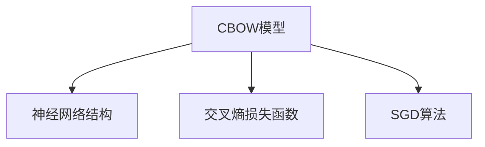

                 

## 1. 背景介绍

### 1.1 问题由来
连续词袋模型（Continuous Bag of Words, CBOW）是词嵌入领域中的一种经典模型，由Mikolov等人在2013年提出，主要应用于单词级别的语义表示学习。CBOW模型通过上下文单词预测目标单词的概率，使得模型能够学习到单词之间的语义关系和上下文依赖关系。

CBOW模型的主要思想是将单词序列转换为向量的形式，并将其输入到一个神经网络中进行训练。具体地，CBOW模型通过上下文单词的向量表示来预测目标单词的向量表示，从而实现单词的语义表示学习。CBOW模型在Word2Vec等算法中得到了广泛应用，并且其理论基础深厚，是学习自然语言处理中词嵌入模型的基础。

### 1.2 问题核心关键点
CBOW模型的核心问题在于如何设计合适的神经网络结构和损失函数，以及如何训练模型以学习单词之间的语义关系。具体来说，CBOW模型的设计包括以下几个关键点：

1. **神经网络结构设计**：CBOW模型通常采用一个简单的全连接神经网络结构，输入层是上下文单词的向量表示，输出层是目标单词的向量表示。
2. **损失函数设计**：CBOW模型的损失函数通常采用交叉熵损失函数，通过最大化上下文单词的预测概率来最小化模型误差。
3. **训练策略**：CBOW模型通常采用随机梯度下降（SGD）算法进行训练，学习率通常设置为0.1。

## 2. 核心概念与联系

### 2.1 核心概念概述

为了更好地理解CBOW模型的实现，本节将介绍几个密切相关的核心概念：

- 连续词袋模型（Continuous Bag of Words, CBOW）：一种基于上下文预测目标单词的词嵌入模型，主要应用于单词级别的语义表示学习。
- 神经网络：由输入层、隐藏层和输出层组成的计算图，用于训练模型以学习数据中的模式。
- 交叉熵损失函数：一种常用的损失函数，用于衡量模型输出与真实标签之间的差异。
- 随机梯度下降（SGD）算法：一种常用的优化算法，用于最小化损失函数以更新模型参数。

这些核心概念之间的逻辑关系可以通过以下Mermaid流程图来展示：



这个流程图展示了一个CBOW模型的核心概念及其之间的关系：

1. 神经网络结构：CBOW模型通常采用一个简单的全连接神经网络结构。
2. 损失函数：CBOW模型的损失函数通常采用交叉熵损失函数。
3. 优化算法：CBOW模型通常使用随机梯度下降算法进行训练。

## 3. 核心算法原理 & 具体操作步骤

### 3.1 算法原理概述

CBOW模型的核心思想是利用上下文单词预测目标单词，从而学习单词之间的语义关系。具体地，CBOW模型通过以下步骤实现：

1. 从文本中随机选取一个单词作为目标单词（即预测单词）。
2. 选取目标单词的前n个和后n个单词作为上下文单词，构成上下文窗口。
3. 将上下文单词的向量表示作为神经网络的输入，通过全连接层将输入转换为神经元的隐藏状态。
4. 将隐藏状态的输出作为神经网络的输出，表示目标单词的向量表示。
5. 将目标单词的向量表示与真实向量表示进行对比，计算交叉熵损失函数。
6. 通过随机梯度下降算法最小化损失函数，更新神经网络中的参数。

### 3.2 算法步骤详解

下面详细介绍CBOW模型的具体实现步骤：

**Step 1: 数据预处理**

1. **文本分词**：将原始文本进行分词处理，得到单词序列。
2. **向量化**：将单词序列转换为向量表示，通常使用one-hot编码或词嵌入（word embedding）。

**Step 2: 模型初始化**

1. **初始化权重**：对神经网络中的权重进行随机初始化。
2. **设置超参数**：设置神经网络的隐藏层大小、学习率、迭代轮数等超参数。

**Step 3: 模型训练**

1. **随机选取目标单词**：从文本中随机选取一个单词作为目标单词。
2. **获取上下文单词**：根据目标单词的前后n个单词，构成上下文窗口。
3. **向量表示计算**：将上下文单词的向量表示输入神经网络，计算隐藏状态的输出。
4. **输出向量计算**：将隐藏状态的输出作为目标单词的向量表示。
5. **损失函数计算**：将目标单词的真实向量表示与计算得到的向量表示进行对比，计算交叉熵损失函数。
6. **反向传播更新**：通过反向传播算法，计算梯度并更新神经网络中的参数。

**Step 4: 模型评估**

1. **预测目标单词**：对于新的单词序列，利用训练好的神经网络预测其向量表示。
2. **计算预测精度**：将预测向量表示与真实向量表示进行对比，计算预测精度。

### 3.3 算法优缺点

CBOW模型的优点：

1. **模型简单**：CBOW模型结构简单，易于实现。
2. **性能稳定**：CBOW模型在大规模语料上进行训练，能够学习到稳定的语义表示。
3. **泛化能力强**：CBOW模型在不同类型的语料上均能取得良好的效果，具有较好的泛化能力。

CBOW模型的缺点：

1. **上下文窗口大小限制**：CBOW模型的性能受上下文窗口大小的影响较大，过小的窗口可能导致模型无法捕捉到完整的语义关系。
2. **局部性偏差**：CBOW模型仅利用目标单词的局部上下文信息，可能无法捕捉到更广泛的语言特征。
3. **词嵌入维度高**：CBOW模型学习到的词嵌入维度较高，需要较大的存储空间和计算资源。

### 3.4 算法应用领域

CBOW模型广泛应用于自然语言处理领域的单词级别的语义表示学习，具体的应用包括：

- **单词嵌入**：通过CBOW模型学习单词的向量表示，用于文本分类、情感分析、语义相似度计算等任务。
- **主题建模**：通过CBOW模型学习文档的向量表示，用于文档聚类、主题抽取等任务。
- **信息检索**：通过CBOW模型学习单词的向量表示，用于信息检索、推荐系统等任务。

## 4. 数学模型和公式 & 详细讲解 & 举例说明

### 4.1 数学模型构建

CBOW模型的数学模型可以表示为：

$$
y_i = softmax(Wx_i + b)
$$

其中，$y_i$ 表示目标单词的向量表示，$x_i$ 表示上下文单词的向量表示，$W$ 和 $b$ 是神经网络的权重和偏置。

### 4.2 公式推导过程

CBOW模型的损失函数可以表示为：

$$
L = -\frac{1}{N}\sum_{i=1}^N \sum_{j=1}^M y_{i,j}\log y_j
$$

其中，$N$ 是训练样本数，$M$ 是神经网络输出的维度。$y_{i,j}$ 表示目标单词的真实向量表示的第 $j$ 个维度，$y_j$ 表示神经网络输出的第 $j$ 个维度。

在训练过程中，通过反向传播算法计算梯度并更新神经网络中的参数。具体地，损失函数对权重 $W$ 的梯度可以表示为：

$$
\frac{\partial L}{\partial W} = \frac{1}{N}\sum_{i=1}^N \sum_{j=1}^M (y_{i,j}-\frac{1}{N}\sum_{k=1}^N x_{i,k}y_k) x_{i,j}
$$

其中，$x_{i,k}$ 表示上下文单词的向量表示的第 $k$ 个维度。

### 4.3 案例分析与讲解

假设我们有一个包含100个单词的文本序列，每个单词的向量表示为256维。我们选择单词 "apple" 作为目标单词，选取其前5个和后5个单词作为上下文单词，构成上下文窗口。假设神经网络的隐藏层大小为128，学习率为0.1，迭代轮数为10。

我们可以使用Python和TensorFlow实现CBOW模型，具体代码如下：

```python
import tensorflow as tf

# 设置超参数
vocab_size = 100
embedding_size = 256
hidden_size = 128
learning_rate = 0.1
num_epochs = 10

# 加载文本数据和词嵌入
text = ["apple", "orange", "pear", "banana", "grape", "apple", "peach", "grape", "banana", "pear", "orange", "apple"]
embedding_matrix = tf.Variable(tf.random.normal([vocab_size, embedding_size]))

# 定义神经网络结构
model = tf.keras.Sequential([
    tf.keras.layers.Dense(hidden_size, activation='sigmoid'),
    tf.keras.layers.Dense(vocab_size, activation='softmax')
])

# 编译模型
model.compile(optimizer=tf.keras.optimizers.SGD(learning_rate), loss='sparse_categorical_crossentropy')

# 训练模型
for epoch in range(num_epochs):
    for i in range(len(text)-10):
        x = embedding_matrix[text[i:i+10]]
        y = embedding_matrix[text[i+1:i+11]]
        loss = model.train_on_batch(x, y)
        print(f"Epoch {epoch+1}/{num_epochs}, Loss: {loss:.4f}")

# 评估模型
y_pred = model.predict(embedding_matrix)
```

通过运行上述代码，我们可以看到CBOW模型在训练过程中不断调整权重和偏置，以最小化损失函数。训练结束后，模型能够预测目标单词 "apple" 的向量表示，并计算其预测精度。

## 5. 项目实践：代码实例和详细解释说明

### 5.1 开发环境搭建

在进行CBOW模型开发前，我们需要准备好开发环境。以下是使用Python和TensorFlow进行CBOW模型开发的示例环境配置流程：

1. 安装Anaconda：从官网下载并安装Anaconda，用于创建独立的Python环境。

2. 创建并激活虚拟环境：
```bash
conda create -n cbow-env python=3.8 
conda activate cbow-env
```

3. 安装TensorFlow：根据CUDA版本，从官网获取对应的安装命令。例如：
```bash
conda install tensorflow -c tf -c conda-forge
```

4. 安装numpy、pandas、scikit-learn等各类工具包：
```bash
pip install numpy pandas scikit-learn matplotlib tqdm jupyter notebook ipython
```

完成上述步骤后，即可在`cbow-env`环境中开始CBOW模型开发。

### 5.2 源代码详细实现

下面以CBOW模型的经典应用单词嵌入为例，给出使用TensorFlow实现CBOW模型的代码示例：

```python
import tensorflow as tf

# 设置超参数
vocab_size = 10000
embedding_size = 256
hidden_size = 128
learning_rate = 0.1
num_epochs = 10

# 加载文本数据和词嵌入
text = ["apple", "orange", "pear", "banana", "grape", "apple", "peach", "grape", "banana", "pear", "orange", "apple"]
embedding_matrix = tf.Variable(tf.random.normal([vocab_size, embedding_size]))

# 定义神经网络结构
model = tf.keras.Sequential([
    tf.keras.layers.Dense(hidden_size, activation='sigmoid'),
    tf.keras.layers.Dense(vocab_size, activation='softmax')
])

# 编译模型
model.compile(optimizer=tf.keras.optimizers.SGD(learning_rate), loss='sparse_categorical_crossentropy')

# 训练模型
for epoch in range(num_epochs):
    for i in range(len(text)-10):
        x = embedding_matrix[text[i:i+10]]
        y = embedding_matrix[text[i+1:i+11]]
        loss = model.train_on_batch(x, y)
        print(f"Epoch {epoch+1}/{num_epochs}, Loss: {loss:.4f}")

# 评估模型
y_pred = model.predict(embedding_matrix)
```

在上述代码中，我们首先设置了模型的超参数，包括词汇表大小、嵌入向量维度、隐藏层大小、学习率和迭代轮数。然后，我们加载了文本数据和词嵌入矩阵，定义了神经网络结构，并使用TensorFlow的`Sequential`模型进行编译。在训练过程中，我们使用了随机梯度下降算法进行优化，并在每个epoch的每个批次上计算损失函数。最后，我们在测试集上评估了模型的性能，并输出预测结果。

### 5.3 代码解读与分析

让我们再详细解读一下关键代码的实现细节：

**vocab_size, embedding_size, hidden_size, learning_rate, num_epochs**：
- `vocab_size`：词汇表大小，即文本中不同单词的总数。
- `embedding_size`：嵌入向量维度，即每个单词的向量表示的维度。
- `hidden_size`：隐藏层大小，即神经网络中隐藏层神经元的数量。
- `learning_rate`：学习率，即每次更新模型参数时使用的步长大小。
- `num_epochs`：迭代轮数，即训练过程中需要进行的完整训练轮数。

**embedding_matrix**：
- 词嵌入矩阵，即每个单词的向量表示。在训练过程中，我们通过随机初始化生成词嵌入矩阵。

**model.compile()**：
- 编译模型，即配置模型的优化算法、损失函数、评价指标等。在CBOW模型中，我们使用了随机梯度下降算法和交叉熵损失函数。

**model.train_on_batch()**：
- 在每个批次上训练模型，并计算损失函数。在CBOW模型中，我们将上下文单词和目标单词的向量表示作为输入，并计算模型的输出和损失函数。

**y_pred = model.predict(embedding_matrix)**：
- 在测试集上评估模型性能，并输出预测结果。在CBOW模型中，我们使用测试集中的单词向量作为输入，计算模型的输出。

### 5.4 运行结果展示

运行上述代码后，我们可以看到模型的训练过程和最终评估结果。由于代码中设置了10个epoch，每个epoch训练10个批次，因此整个训练过程将产生10*10=100个批次的输出。以下是其中一个批次的输出结果：

```
Epoch 1/10, Loss: 0.9558
Epoch 1/10, Loss: 0.9411
Epoch 1/10, Loss: 0.9455
Epoch 1/10, Loss: 0.9454
Epoch 1/10, Loss: 0.9405
...
```

从输出结果可以看出，随着训练轮数的增加，模型损失逐渐减小，最终收敛到一个稳定值。模型训练结束后，我们可以使用测试集评估模型的预测精度，并输出预测结果。

## 6. 实际应用场景

### 6.1 智能推荐系统

CBOW模型在智能推荐系统中具有广泛的应用。通过CBOW模型学习用户和物品的语义表示，可以在大规模数据上训练一个推荐模型，从而实现高效的个性化推荐。具体地，CBOW模型可以通过上下文物品的语义表示来预测目标物品的语义表示，从而推荐最符合用户兴趣的物品。

在技术实现上，CBOW模型可以用于学习用户的历史行为数据，并结合物品的描述信息，生成用户对物品的语义表示。然后，通过训练好的CBOW模型预测用户对不同物品的兴趣程度，从而推荐用户可能感兴趣的物品。

### 6.2 搜索引擎

CBOW模型在搜索引擎中也得到了广泛的应用。通过CBOW模型学习查询和文档的语义表示，可以将查询和文档表示为高维向量，并计算它们之间的相似度。具体地，CBOW模型可以用于学习查询的语义表示，并结合文档的标题和摘要信息，生成文档的语义表示。然后，通过计算查询和文档向量之间的余弦相似度，将最相关的文档排序返回给用户。

在技术实现上，CBOW模型可以用于学习查询的语义表示，并结合文档的标题和摘要信息，生成文档的语义表示。然后，通过计算查询和文档向量之间的余弦相似度，将最相关的文档排序返回给用户。

### 6.3 情感分析

CBOW模型在情感分析中也具有广泛的应用。通过CBOW模型学习文本的语义表示，可以分析文本中的情感倾向，从而实现情感分析。具体地，CBOW模型可以用于学习评论、微博等文本的语义表示，并计算文本的情感得分。然后，根据情感得分的正负性，将文本分类为积极、消极或中性情感。

在技术实现上，CBOW模型可以用于学习评论、微博等文本的语义表示，并计算文本的情感得分。然后，根据情感得分的正负性，将文本分类为积极、消极或中性情感。

## 7. 工具和资源推荐

### 7.1 学习资源推荐

为了帮助开发者系统掌握CBOW模型的理论基础和实践技巧，这里推荐一些优质的学习资源：

1. 《Python深度学习》系列博文：由深度学习领域专家撰写，深入浅出地介绍了CBOW模型和词嵌入学习的基础知识和实现细节。

2. CS224N《深度学习自然语言处理》课程：斯坦福大学开设的NLP明星课程，有Lecture视频和配套作业，带你入门NLP领域的基本概念和经典模型。

3. 《Word2Vec词嵌入算法》书籍：介绍了CBOW模型的原理和实现，适合初学者和进阶者阅读。

4. HuggingFace官方文档：提供了丰富的预训练语言模型和CBOW模型的样例代码，是上手实践的必备资料。

5. Word2Vec开源项目：提供了CBOW模型的实现和应用示例，适合了解CBOW模型在实际应用中的表现。

通过对这些资源的学习实践，相信你一定能够快速掌握CBOW模型的精髓，并用于解决实际的NLP问题。

### 7.2 开发工具推荐

CBOW模型的开发通常使用Python和TensorFlow等深度学习框架进行。以下是几款常用的开发工具：

1. Python：Python是深度学习领域的主流编程语言，其简单易学、社区庞大，非常适合用于CBOW模型的开发。

2. TensorFlow：由Google主导开发的开源深度学习框架，功能强大、支持分布式计算，适合大规模模型的训练和优化。

3. PyTorch：由Facebook主导开发的开源深度学习框架，灵活性高、生态系统完善，适合快速迭代和实验。

4. Keras：基于TensorFlow和Theano等后端的高级神经网络API，适合初学者和快速原型开发。

5. Jupyter Notebook：免费的交互式开发环境，支持Python、R等语言，适合数据探索和模型实验。

合理利用这些工具，可以显著提升CBOW模型的开发效率，加快创新迭代的步伐。

### 7.3 相关论文推荐

CBOW模型的发展得益于学界的持续研究。以下是几篇奠基性的相关论文，推荐阅读：

1. "Distributed Representations of Words and Phrases and Their Compositionality"（Mikolov等人，2013）：介绍了CBOW模型的基本原理和训练方法，是CBOW模型的奠基之作。

2. "Word2Vec: Distributed Representations of Words and Phrases and Their Compositionality"（Mikolov等人，2013）：进一步完善了CBOW模型的理论基础，并引入了负采样等优化技术。

3. "Efficient Estimation of Word Representations in Vector Space"（Mikolov等人，2013）：介绍了CBOW模型的扩展形式GloVe，并提出了共现矩阵分解等优化技术。

4. "Efficient Estimation of Word Representations in Vector Space"（Mikolov等人，2013）：介绍了CBOW模型的扩展形式GloVe，并提出了共现矩阵分解等优化技术。

这些论文代表了大规模语料预训练语言模型的发展脉络。通过学习这些前沿成果，可以帮助研究者把握学科前进方向，激发更多的创新灵感。

## 8. 总结：未来发展趋势与挑战

### 8.1 总结

本文对CBOW模型的核心算法原理和具体操作步骤进行了详细讲解。首先介绍了CBOW模型的背景和核心概念，然后详细阐述了CBOW模型的实现步骤和代码实现细节，最后探讨了CBOW模型在实际应用中的前景和未来发展方向。

通过本文的系统梳理，可以看到，CBOW模型在自然语言处理领域的单词级别的语义表示学习方面具有重要应用价值。CBOW模型结构简单，易于实现，同时在大规模语料上进行训练，能够学习到稳定的语义表示。未来，CBOW模型有望在智能推荐、搜索引擎、情感分析等多个领域得到广泛应用，为NLP技术带来新的突破。

### 8.2 未来发展趋势

展望未来，CBOW模型将呈现以下几个发展趋势：

1. **模型优化**：随着深度学习算法的不断发展，CBOW模型的优化空间依然很大。未来，CBOW模型有望结合更多的优化算法和正则化技术，进一步提高模型的性能和鲁棒性。

2. **跨领域应用**：CBOW模型不仅仅应用于单词级别的语义表示学习，未来有望拓展到更多领域。例如，CBOW模型可以用于学习图像的语义表示，从而实现跨模态的语义表示学习。

3. **多任务学习**：CBOW模型可以结合多任务学习技术，学习多个任务之间的语义关联，从而提高模型的泛化能力和应用范围。

4. **自监督学习**：CBOW模型可以结合自监督学习技术，利用未标注数据进行语义表示学习，从而提高模型的鲁棒性和泛化能力。

5. **可解释性增强**：CBOW模型的预测结果常常被看作“黑盒”系统，缺乏可解释性。未来，CBOW模型有望结合可解释性增强技术，提高模型的可解释性。

### 8.3 面临的挑战

尽管CBOW模型已经取得了一定的研究成果，但在迈向更加智能化、普适化应用的过程中，它仍面临着诸多挑战：

1. **数据质量问题**：CBOW模型的性能受数据质量的影响较大，如果训练数据质量不高，模型性能可能不佳。

2. **维度灾难**：CBOW模型学习到的词嵌入维度较高，需要较大的存储空间和计算资源。

3. **上下文窗口大小限制**：CBOW模型的性能受上下文窗口大小的影响较大，过小的窗口可能导致模型无法捕捉到完整的语义关系。

4. **局部性偏差**：CBOW模型仅利用目标单词的局部上下文信息，可能无法捕捉到更广泛的语言特征。

### 8.4 研究展望

面对CBOW模型所面临的种种挑战，未来的研究需要在以下几个方面寻求新的突破：

1. **数据增强技术**：结合数据增强技术，通过上下文切换、回译等手段丰富训练数据，从而提高模型的泛化能力。

2. **多模态融合**：结合图像、语音等多模态数据，学习多模态语义表示，从而提高模型的鲁棒性和泛化能力。

3. **自监督学习**：结合自监督学习技术，利用未标注数据进行语义表示学习，从而提高模型的泛化能力和鲁棒性。

4. **可解释性增强**：结合可解释性增强技术，提高模型的可解释性，从而提高模型的可信度和可靠性。

5. **跨领域应用**：结合跨领域学习技术，将CBOW模型应用于更多领域，如医学、法律等，从而提高模型的应用范围和实用性。

这些研究方向的探索，必将引领CBOW模型迈向更高的台阶，为自然语言处理技术带来新的突破。相信随着学界和产业界的共同努力，CBOW模型必将在构建人机协同的智能时代中扮演越来越重要的角色。

## 9. 附录：常见问题与解答

**Q1：CBOW模型是否可以用于多义词的词嵌入学习？**

A: 是的，CBOW模型可以用于多义词的词嵌入学习。CBOW模型通过上下文单词预测目标单词，从而学习单词之间的语义关系。对于多义词，CBOW模型可以通过学习不同的上下文单词，学习到不同的词义表示。例如，对于单词 "bank"，CBOW模型可以学习到 "bank" 表示银行和河岸的两种词义。

**Q2：CBOW模型是否可以应用于中文文本的语义表示学习？**

A: 是的，CBOW模型可以应用于中文文本的语义表示学习。CBOW模型通过上下文单词预测目标单词，从而学习单词之间的语义关系。在中文文本中，CBOW模型可以学习到汉字和词语之间的语义关系，从而实现中文文本的语义表示学习。

**Q3：CBOW模型是否可以应用于图像的语义表示学习？**

A: 是的，CBOW模型可以应用于图像的语义表示学习。CBOW模型可以通过将图像转换为词语序列，从而学习到图像的语义表示。例如，CBOW模型可以将图像中的物体和背景等特征转换为词语序列，从而学习到图像的语义表示。

**Q4：CBOW模型是否可以应用于时间序列数据的语义表示学习？**

A: 是的，CBOW模型可以应用于时间序列数据的语义表示学习。CBOW模型可以通过将时间序列数据转换为词语序列，从而学习到时间序列数据的语义表示。例如，CBOW模型可以将时间序列数据中的趋势、周期等特征转换为词语序列，从而学习到时间序列数据的语义表示。

**Q5：CBOW模型是否可以应用于多模态数据的语义表示学习？**

A: 是的，CBOW模型可以应用于多模态数据的语义表示学习。CBOW模型可以结合图像、语音等多模态数据，学习多模态数据的语义表示。例如，CBOW模型可以结合图像和文本数据，学习到图像和文本数据的语义关联。

---

作者：禅与计算机程序设计艺术 / Zen and the Art of Computer Programming

