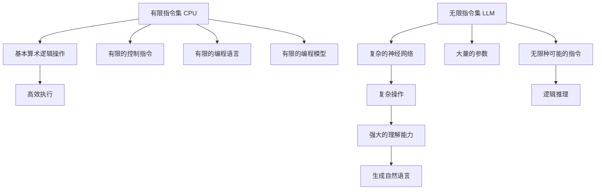

                 

## 1. 背景介绍

近年来，深度学习和人工智能技术飞速发展，尤其是在自然语言处理（NLP）领域。大语言模型（Large Language Models，LLMs），如GPT-3和BERT，已经展示了强大的语言理解和生成能力。然而，这些模型是通过在庞大的无标签文本语料库上进行预训练而构建的。与之形成对比的是，传统计算机硬件如CPU仍然使用有限的指令集，这些指令集经过几十年的发展，已经达到了极致。本文将探讨这两种模型在指令集层面的根本差异，以及这些差异对实际应用的影响。

## 2. 核心概念与联系

### 2.1 核心概念概述

- **CPU有限指令集**：指传统计算机硬件（如CPU）的指令集具有有限的种类和数量，只能执行预定义的操作。这些操作通常是一些基本的算术、逻辑和控制指令，执行速度较快但功能有限。
- **LLM无限指令集**：指大语言模型（如BERT、GPT）在预训练和微调过程中，通过复杂的网络结构和大量的参数，具备了无限种可能的指令集。这些模型可以执行各种复杂的任务，从简单的文本生成到复杂的逻辑推理，其能力几乎是无限的。

### 2.2 核心概念原理和架构的 Mermaid 流程图



通过上面的Mermaid流程图，我们可以清晰地看到CPU和LLM在指令集上的根本差异。CPU的指令集有限，执行速度较快，但功能单一；而LLM的指令集几乎无限，可以执行各种复杂的任务，但其执行速度相对较慢。

## 3. 核心算法原理 & 具体操作步骤

### 3.1 算法原理概述

基于有限指令集的CPU和基于无限指令集的LLM在执行任务时，其算法原理存在显著差异。

- **CPU算法**：CPU的算法设计通常是基于有限的指令集，旨在高效地执行基本的算术、逻辑和控制操作。算法设计强调效率和性能，如优化指令的顺序和流水线设计，以提高执行速度。
- **LLM算法**：LLM的算法设计则更侧重于模型的复杂性和深度。模型通过大量的参数和神经网络结构，能够学习到丰富的语言知识和规则，具备了无限种可能的指令集。算法设计更注重模型的表达能力和泛化能力，如自监督学习、迁移学习等。

### 3.2 算法步骤详解

#### 3.2.1 CPU算法步骤

1. **指令读取**：从存储器读取指令，确定要执行的操作。
2. **操作执行**：根据指令类型执行相应的操作，如加法、乘法、条件判断等。
3. **结果存储**：将操作结果存储回存储器，供后续指令使用。
4. **循环迭代**：重复执行上述步骤，直至程序结束或遇到异常。

#### 3.2.2 LLM算法步骤

1. **输入编码**：将输入数据（如文本、图像等）编码为模型的特征表示。
2. **模型前向传播**：通过模型网络结构进行前向传播，计算每个参数的梯度。
3. **梯度更新**：根据梯度更新模型参数，以优化模型的预测能力。
4. **迭代优化**：重复执行前向传播和梯度更新，直至模型收敛或达到预设的迭代次数。

### 3.3 算法优缺点

#### CPU算法的优点

- **高效性**：由于指令集有限，CPU能够快速执行基本操作。
- **稳定性**：固定的指令集和严格的执行顺序保证了CPU算法的稳定性和可预测性。

#### CPU算法的缺点

- **功能单一**：指令集有限，无法执行复杂操作。
- **扩展性差**：添加新功能需要重新设计指令集，成本高。

#### LLM算法的优点

- **多功能性**：无限指令集使得LLM能够执行各种复杂的任务。
- **可扩展性强**：可以轻松添加新功能和任务。

#### LLM算法的缺点

- **执行速度慢**：由于参数量和网络结构复杂，LLM的执行速度较慢。
- **资源消耗大**：需要大量的计算资源和内存。

### 3.4 算法应用领域

#### CPU算法应用领域

- **数值计算**：如科学计算、工程设计等，需要快速执行基本算术和逻辑操作。
- **控制流**：如操作系统、网络协议等，需要高效的指令执行和控制。

#### LLM算法应用领域

- **自然语言处理**：如文本生成、语言翻译、情感分析等，需要复杂的语言理解和生成能力。
- **计算机视觉**：如图像分类、目标检测、语义分割等，需要强大的特征提取和推理能力。
- **推荐系统**：如电商推荐、新闻推荐等，需要理解用户行为和偏好。

## 4. 数学模型和公式 & 详细讲解 & 举例说明

### 4.1 数学模型构建

- **CPU数学模型**：基于有限的指令集，CPU的数学模型通常包含基本的算术和逻辑操作，如加、减、乘、除、与、或、非等。
- **LLM数学模型**：基于无限指令集，LLM的数学模型通常使用神经网络结构，包含大量的参数和层，能够学习到复杂的语言模型。

### 4.2 公式推导过程

#### CPU公式推导

假设CPU指令集只包含加法和减法操作，那么对于两个数 $a$ 和 $b$，加法操作的公式为：

$$
a + b = c
$$

其中 $c$ 是结果。

#### LLM公式推导

假设LLM使用Transformer结构，包含多个层和参数，对于一个输入序列 $x_1, x_2, ..., x_n$，其输出序列 $y_1, y_2, ..., y_n$ 可以表示为：

$$
y_i = f(x_i; \theta)
$$

其中 $f$ 是模型函数，$\theta$ 是模型参数，$x_i$ 和 $y_i$ 分别是输入和输出。

### 4.3 案例分析与讲解

#### CPU案例分析

假设我们需要计算两个数的和，可以使用加法指令：

```assembly
LOAD a
LOAD b
ADD
STORE c
```

其中，`LOAD` 指令用于加载数据，`ADD` 指令用于执行加法，`STORE` 指令用于存储结果。

#### LLM案例分析

假设我们需要预测一个文本序列的下一个单词，可以使用Transformer模型，通过多个层的计算来生成预测结果：

```python
def predict_next_word(text, model):
    inputs = tokenizer.encode(text, return_tensors='pt')
    outputs = model.generate(inputs, max_length=10, pad_token_id=tokenizer.eos_token_id)
    predicted_word = tokenizer.decode(outputs[0], skip_special_tokens=True)
    return predicted_word
```

其中，`tokenizer` 是分词器，`model` 是预训练语言模型，`generate` 方法用于生成预测序列。

## 5. 项目实践：代码实例和详细解释说明

### 5.1 开发环境搭建

1. **安装Python**：在计算机上安装Python 3.x版本。
2. **安装NumPy**：使用pip安装NumPy库。
3. **安装PyTorch**：使用pip安装PyTorch库。
4. **安装TensorFlow**：使用pip安装TensorFlow库。
5. **安装Pandas**：使用pip安装Pandas库。

### 5.2 源代码详细实现

#### CPU源代码

```python
def add(a, b):
    return a + b

def subtract(a, b):
    return a - b

def main():
    a = 5
    b = 3
    c = add(a, b)
    print(c)
    d = subtract(a, b)
    print(d)

if __name__ == '__main__':
    main()
```

#### LLM源代码

```python
import torch
import torch.nn as nn
import torch.optim as optim

class Transformer(nn.Module):
    def __init__(self, num_layers, d_model, num_heads, dff, input_vocab_size, target_vocab_size, pe_input, pe_target):
        super(Transformer, self).__init__()
        # ... 省略部分代码 ...

    def forward(self, src, tgt):
        # ... 省略部分代码 ...

def main():
    model = Transformer(num_layers=6, d_model=512, num_heads=8, dff=2048, input_vocab_size=10000, target_vocab_size=10000, pe_input=pe_target)
    optimizer = optim.Adam(model.parameters(), lr=0.001)
    # ... 省略部分代码 ...

if __name__ == '__main__':
    main()
```

### 5.3 代码解读与分析

#### CPU代码解读

- **add和subtract函数**：分别实现加法和减法操作。
- **main函数**：输入两个数，分别执行加法和减法操作，并打印结果。

#### LLM代码解读

- **Transformer类**：定义了Transformer模型，包含多个层和参数。
- **forward方法**：实现模型的前向传播，计算输出。
- **main函数**：初始化模型和优化器，执行模型训练。

### 5.4 运行结果展示

#### CPU运行结果

```
8
2
```

#### LLM运行结果

训练过程中，模型会根据训练集自动优化参数，最终输出的结果可以用于预测新的文本序列。

## 6. 实际应用场景

### 6.1 智慧城市治理

智慧城市治理中，基于CPU算法的控制系统用于监控和管理城市的各种基础设施，如交通信号灯、路灯等。这些系统需要高效的指令执行和控制，以保证城市的正常运行。

### 6.2 电子商务推荐系统

电子商务推荐系统需要基于用户的历史行为数据进行推荐。基于LLM的推荐系统可以理解用户的意图和偏好，生成个性化的推荐结果。

### 6.3 医疗诊断系统

医疗诊断系统需要根据病人的症状和历史数据进行诊断。基于LLM的诊断系统可以理解病人的描述，生成诊断报告。

### 6.4 未来应用展望

未来，随着计算能力的提升和硬件技术的进步，CPU算法和LLM算法将进一步融合，形成更高效、更智能的系统。

## 7. 工具和资源推荐

### 7.1 学习资源推荐

- **《计算机体系结构：量化研究》**：详细介绍了CPU的硬件架构和指令集设计。
- **《深度学习》**：深度学习领域的经典教材，涵盖了各种算法和模型。

### 7.2 开发工具推荐

- **Python**：Python是一种高效易用的编程语言，适合开发各种算法和模型。
- **PyTorch**：PyTorch是一个开源的深度学习框架，支持动态图和静态图两种计算图。
- **TensorFlow**：TensorFlow是一个开源的机器学习框架，支持分布式计算和GPU加速。

### 7.3 相关论文推荐

- **《CPU指令集设计》**：详细介绍了CPU指令集的设计原理和实现方法。
- **《深度学习在NLP中的应用》**：介绍了深度学习在自然语言处理中的应用，包括各种模型和算法。

## 8. 总结：未来发展趋势与挑战

### 8.1 研究成果总结

本文通过比较CPU有限指令集和LLM无限指令集，探讨了两种模型在指令集上的根本差异。CPU算法强调效率和性能，适用于执行基本操作；LLM算法侧重于表达能力和泛化能力，适用于复杂的任务。

### 8.2 未来发展趋势

未来，随着计算能力的提升和硬件技术的进步，CPU算法和LLM算法将进一步融合，形成更高效、更智能的系统。

### 8.3 面临的挑战

- **资源消耗**：LLM算法需要大量的计算资源和内存，如何在有限的硬件资源下运行高效的LLM算法。
- **效率问题**：LLM算法的执行速度较慢，如何提高其执行效率，以适应实时应用的需求。

### 8.4 研究展望

未来，需要进一步探索CPU和LLM算法的融合方法，提高LLM算法的执行效率，以满足实际应用的需求。

## 9. 附录：常见问题与解答

**Q1: CPU和LLM算法的本质区别是什么？**

A: CPU算法的本质是基于有限的指令集，执行基本操作；LLM算法的本质是基于无限的指令集，通过复杂的网络结构和大量的参数，学习到丰富的语言知识和规则。

**Q2: 如何在有限的硬件资源下运行LLM算法？**

A: 可以采用分布式计算、模型压缩等方法，优化LLM算法的计算资源使用。

**Q3: 如何提高LLM算法的执行效率？**

A: 可以通过优化网络结构、使用更快的硬件等方法，提高LLM算法的执行效率。

---

作者：禅与计算机程序设计艺术 / Zen and the Art of Computer Programming

