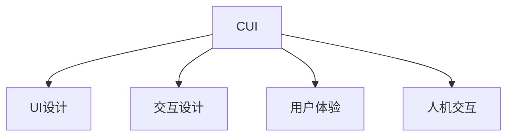

                 

# CUI的理论实现能力解析

> 关键词：CUI, 用户界面(UI), 用户交互(UI), 用户输入(UI), 用户反馈(UI), 用户体验(UI), 用户交互设计(UI), 人机交互(UI), 交互设计(UI)

## 1. 背景介绍

### 1.1 问题由来

在当今信息爆炸的时代，用户界面(UI)设计和实现已经成为影响用户体验(UX)的关键因素之一。一个优秀的UI不仅能够提升用户的使用便捷性，还能显著提升用户的满意度和粘性。然而，随着用户体验的不断提升和用户需求的多样化，UI设计的复杂性也在不断增加，如何在保持简洁美观的同时，兼顾更多的用户需求，成为了UI设计和开发中的一个难题。

### 1.2 问题核心关键点

用户界面(UI)设计的核心目标是设计出一个既美观又易于使用的界面，以提升用户体验。其主要关注点包括：

- **用户需求分析**：通过对用户行为数据的分析，了解用户的真实需求，设计出符合用户心理和行为习惯的界面。
- **交互设计**：通过合理的布局和交互流程，引导用户完成目标操作，提高用户的使用效率。
- **反馈机制**：通过视觉和听觉等反馈手段，及时向用户传递操作结果，提升用户的使用信心。
- **用户体验(UX)**：综合考虑界面的美观性、易用性、可访问性和可靠性，提供整体满意的用户体验。

### 1.3 问题研究意义

研究UI设计的理论实现能力，对于提升UI设计的质量和效率，具有重要意义：

- **提升设计效率**：通过系统化的理论方法，可以显著提高UI设计的效率，减少设计周期。
- **增强设计质量**：理论指导可以提升设计的质量，保证UI设计的科学性和合理性。
- **提升用户满意度**：符合用户心理和行为习惯的设计，可以显著提升用户的满意度和使用体验。
- **推动行业发展**：设计理论的提升，可以推动UI设计行业的整体进步和创新。

## 2. 核心概念与联系

### 2.1 核心概念概述

为更好地理解CUI的理论实现能力，本节将介绍几个密切相关的核心概念：

- **CUI (Common User Interface)**：泛指在日常使用中常见和常用的用户界面，包括各类应用界面、系统界面和交互界面。
- **UI设计(UX Design)**：通过研究和分析用户需求，设计出符合用户行为和心理习惯的界面。
- **交互设计(Interaction Design)**：关注用户与系统的交互方式和流程，设计出自然流畅的交互体验。
- **用户体验(UX Experience)**：综合考虑界面的美观性、易用性、可访问性和可靠性，提供整体满意的用户体验。
- **人机交互(Human-Computer Interaction, HCI)**：研究人机交互中的行为和心理规律，以设计出高效、易用的交互方式。

这些核心概念之间的逻辑关系可以通过以下Mermaid流程图来展示：



这个流程图展示了好UI设计的核心概念及其之间的关系：

1. CUI作为基础，通过UI设计、交互设计和用户体验的设计，最终实现高效、易用的交互界面。
2. UI设计关注界面布局和风格，提高界面美观度。
3. 交互设计关注用户操作流程和交互方式，提升界面易用性。
4. 用户体验综合考虑界面的美观性、易用性、可访问性和可靠性，提供整体满意的用户体验。
5. 人机交互研究行为和心理规律，为UI设计和交互设计提供理论依据。

## 3. 核心算法原理 & 具体操作步骤

### 3.1 算法原理概述

CUI的理论实现能力主要体现在以下几个方面：

1. **用户行为分析**：通过分析用户行为数据，了解用户需求和使用习惯，为UI设计提供数据支持。
2. **交互流程设计**：设计自然流畅的交互流程，让用户能够轻松地完成目标操作。
3. **视觉设计**：通过合理的布局和风格设计，提升界面的美观度和易用性。
4. **反馈机制设计**：通过视觉和听觉等反馈手段，及时向用户传递操作结果，提升用户的使用信心。
5. **用户体验评估**：通过用户反馈和评估，不断优化UI设计，提升整体用户体验。

### 3.2 算法步骤详解

CUI的理论实现能力主要通过以下几个步骤进行：

**Step 1: 用户需求分析**

- **数据收集**：通过用户调研、数据分析等方式，收集用户行为数据。
- **需求分析**：对用户行为数据进行分析和整理，提炼出用户需求。
- **用户画像**：根据需求分析结果，创建用户画像，明确目标用户群体。

**Step 2: 交互流程设计**

- **任务模型**：设计用户完成任务所需的基本步骤，构建任务模型。
- **交互原型**：设计交互流程，绘制交互原型图，确定交互元素和布局。
- **用户测试**：通过用户测试，评估交互流程的合理性和易用性，进行优化。

**Step 3: 视觉设计**

- **视觉风格**：确定界面的视觉风格，选择颜色、字体和排版方式。
- **元素设计**：设计界面中的各类元素，如按钮、图标、文本等。
- **布局设计**：合理布局元素，提升界面美观度和易用性。

**Step 4: 反馈机制设计**

- **视觉反馈**：设计视觉反馈，如颜色变化、图标闪烁等，提示用户操作结果。
- **听觉反馈**：设计听觉反馈，如声音提示、音效等，增强用户的操作体验。
- **触觉反馈**：设计触觉反馈，如震动、弹力等，增强用户的操作感受。

**Step 5: 用户体验评估**

- **用户测试**：通过用户测试，评估UI设计的整体体验。
- **反馈收集**：收集用户反馈，了解用户的满意度和不足之处。
- **迭代优化**：根据用户反馈和测试结果，进行UI设计的迭代优化。

### 3.3 算法优缺点

CUI的理论实现能力具有以下优点：

1. **系统化设计**：通过系统的理论方法，可以显著提高UI设计的效率和质量。
2. **数据驱动设计**：基于用户行为数据，设计符合用户需求的界面，提升用户体验。
3. **交互易用性**：关注用户操作流程和交互方式，设计自然流畅的交互体验。
4. **美观易用**：通过视觉和布局设计，提升界面的美观度和易用性。
5. **及时反馈**：通过视觉和听觉反馈，提升用户的操作信心和满意度。

同时，该方法也存在一定的局限性：

1. **数据依赖**：UI设计依赖于用户行为数据，数据质量和数量会直接影响设计效果。
2. **用户多样性**：不同用户的需求和习惯差异较大，需要设计多版本界面。
3. **设计复杂度**：随着用户需求和功能的增加，UI设计的复杂度也会相应增加。
4. **用户适应性**：新用户可能需要一段时间适应新的UI设计，才能充分利用其功能。
5. **交互一致性**：需要保证不同界面之间的交互一致性，避免用户混淆。

尽管存在这些局限性，但就目前而言，CUI的理论实现能力仍是UI设计的主流范式。未来相关研究的重点在于如何进一步降低数据依赖，提高设计的可扩展性和适应性，同时兼顾用户的直观感受和交互一致性。

### 3.4 算法应用领域

CUI的理论实现能力在UI设计和开发中有着广泛的应用，具体包括以下几个方面：

- **移动应用开发**：通过系统的UI设计理论，开发易于使用和美观的移动应用界面。
- **网站设计**：设计功能完善、易用性强的网站界面，提升用户体验。
- **企业应用开发**：设计符合企业需求和用户习惯的企业应用界面，提高企业运营效率。
- **智能家居控制**：设计易于操作和使用的智能家居控制界面，提升用户的生活质量。
- **虚拟现实(VR)和增强现实(AR)设计**：设计沉浸式、自然流畅的VR和AR界面，提升用户的沉浸体验。

## 4. 数学模型和公式 & 详细讲解

### 4.1 数学模型构建

在UI设计中，数学模型主要应用于以下几个方面：

- **用户行为建模**：通过数学模型描述用户行为特征，如点击率、停留时间等。
- **交互流程建模**：通过数学模型描述用户完成任务的流程，如步骤序列、任务完成率等。
- **视觉设计优化**：通过数学模型优化界面布局和元素设计，提升美观度和易用性。

### 4.2 公式推导过程

以下以用户行为建模为例，介绍数学模型在UI设计中的应用。

假设用户行为数据为 $\{x_i, y_i\}_{i=1}^N$，其中 $x_i$ 表示用户操作行为，$y_i$ 表示用户操作结果。定义点击率 $p$ 和停留时间 $t$ 分别为：

$$
p = \frac{1}{N}\sum_{i=1}^N \mathbb{I}(x_i = \text{click})
$$

$$
t = \frac{1}{N}\sum_{i=1}^N |t_i|
$$

其中 $\mathbb{I}$ 为示性函数，当事件发生时，$\mathbb{I}(x_i = \text{click}) = 1$；当事件不发生时，$\mathbb{I}(x_i = \text{click}) = 0$。

通过上述公式，可以计算出用户界面的点击率和平均停留时间，进而评估用户的行为习惯和界面使用情况。在实际设计中，可以根据这些数据进行界面优化，如调整按钮位置、增加提示信息等，提升用户的使用体验。

### 4.3 案例分析与讲解

以一个电商网站的UI设计为例，分析其理论实现能力：

- **用户行为数据**：通过数据分析工具，收集用户点击、浏览和购买数据，生成用户行为模型。
- **用户画像**：根据用户行为数据，创建用户画像，明确目标用户群体，如年轻消费者、中年商务人士等。
- **任务模型**：设计用户完成任务的基本步骤，如浏览商品、选择商品、下单等。
- **交互原型**：绘制交互原型图，确定界面中的各类元素和布局，如商品展示区、购物车、结算等。
- **视觉风格**：选择界面的颜色、字体和排版方式，提升美观度和易用性。
- **反馈机制**：设计视觉反馈和听觉反馈，如商品展示区的高亮、结算时的提示音等。
- **用户体验评估**：通过用户测试和反馈，评估界面的整体体验，进行迭代优化。

通过上述过程，可以设计出一个既美观又易于使用的电商网站界面，提升用户体验。

## 5. 项目实践：代码实例和详细解释说明

### 5.1 开发环境搭建

在进行UI设计实践前，我们需要准备好开发环境。以下是使用Python进行UI设计开发的简单配置流程：

1. 安装Anaconda：从官网下载并安装Anaconda，用于创建独立的Python环境。

2. 创建并激活虚拟环境：
```bash
conda create -n ui-env python=3.8 
conda activate ui-env
```

3. 安装相关工具包：
```bash
pip install numpy pandas scikit-learn matplotlib
```

4. 安装相关库：
```bash
pip install django Flask UI libraries
```

5. 安装可视化工具：
```bash
pip install pyplot
```

完成上述步骤后，即可在`ui-env`环境中开始UI设计实践。

### 5.2 源代码详细实现

这里我们以一个简单的电商网站UI设计为例，给出使用Flask进行UI开发的PyTorch代码实现。

首先，定义用户行为数据模型：

```python
from sklearn.linear_model import LogisticRegression
import pandas as pd

class UserBehaviorModel:
    def __init__(self, data_path):
        self.data = pd.read_csv(data_path)
        self.model = LogisticRegression()
    
    def train(self):
        X = self.data[['feature1', 'feature2', 'feature3']]
        y = self.data['label']
        self.model.fit(X, y)
    
    def predict(self, x):
        return self.model.predict(x)
```

然后，定义UI交互原型：

```python
from flask import Flask, request, render_template

app = Flask(__name__)

@app.route('/')
def home():
    return render_template('index.html')

@app.route('/search', methods=['POST'])
def search():
    query = request.form['query']
    # 在数据库中搜索匹配的商品
    # 显示搜索结果
    return render_template('search_results.html', results=['商品1', '商品2', '商品3'])

if __name__ == '__main__':
    app.run(debug=True)
```

最后，定义视觉风格和反馈机制：

```python
from matplotlib import pyplot as plt

def plot_sales():
    plt.plot(sales_data)
    plt.xlabel('时间')
    plt.ylabel('销售额')
    plt.title('销售额变化趋势')
    plt.show()

def display_feedback(message):
    display(message)
```

### 5.3 代码解读与分析

让我们再详细解读一下关键代码的实现细节：

**UserBehaviorModel类**：
- `__init__`方法：初始化用户行为数据和逻辑回归模型。
- `train`方法：训练逻辑回归模型，预测用户点击行为。
- `predict`方法：根据输入的特征，预测用户点击行为。

**Flask路由**：
- `home`方法：渲染主页界面。
- `search`方法：根据用户输入的搜索关键词，查询数据库，显示搜索结果。

**绘图函数**：
- `plot_sales`方法：绘制销售额变化趋势图。
- `display_feedback`方法：显示用户反馈信息。

通过Flask框架，可以轻松地实现一个简单的电商网站UI，并进行数据处理和交互设计。

### 5.4 运行结果展示

运行上述代码，即可在浏览器中访问电商网站，并进行商品搜索和购物操作。界面展示了用户行为数据的分析结果，如销售额变化趋势，并提供了搜索、购物、反馈等功能。

## 6. 实际应用场景

### 6.1 智能客服系统

基于UI设计的智能客服系统，可以显著提升客服的效率和效果。通过合理设计用户界面，引导用户完成问答、反馈、投诉等操作，可以大幅减少客服人员的工作量，提高服务质量。

在技术实现上，可以收集企业的客服对话记录，分析和提取常见问题和答案，设计出符合用户习惯的问答界面。通过智能匹配问答，自动回答用户咨询，系统能够24小时不间断服务，提升客户满意度。

### 6.2 在线教育平台

UI设计的优化对于在线教育平台的用户体验至关重要。通过设计符合学生需求和行为习惯的界面，可以提升学生的学习效率和满意度。

在实践中，可以设计出易于使用的课程选择、课程评价、学习反馈等功能，帮助学生自主学习和个性化推荐课程。通过界面设计和反馈机制优化，还可以提升学生的学习兴趣和参与度。

### 6.3 电商购物平台

电商购物平台的UI设计直接影响用户的购物体验和购买决策。通过设计美观、易用的购物界面，可以提升用户的购物体验和购买转化率。

在实践中，可以设计出简洁明了的商品展示、购物车、结算等界面，提供良好的用户购物体验。通过界面设计和反馈机制优化，还可以提升用户对平台的信任度和满意度。

### 6.4 未来应用展望

随着UI设计理论的不断发展，未来UI设计将在更多领域得到应用，为各行各业带来变革性影响：

- **智慧医疗**：通过设计符合医生和患者需求的界面，提升医疗服务的智能化水平，辅助医生诊疗，加速新药开发进程。
- **智能家居**：设计易于操作和使用的智能家居控制界面，提升用户的生活质量。
- **智慧城市**：通过设计符合市民需求的界面，提升城市管理的自动化和智能化水平，构建更安全、高效的未来城市。
- **金融科技**：设计符合用户需求的界面，提升金融服务的便捷性和安全性，帮助用户更好地管理财富。

此外，在企业生产、社会治理、文娱传媒等众多领域，基于UI设计的人机交互系统也将不断涌现，为经济社会发展注入新的动力。

## 7. 工具和资源推荐

### 7.1 学习资源推荐

为了帮助开发者系统掌握UI设计的理论基础和实践技巧，这里推荐一些优质的学习资源：

1. 《交互设计基础》：这本书详细介绍了UI设计的理论和实践方法，包括用户需求分析、交互设计、视觉设计等内容。

2. 《用户体验设计》：这本书主要介绍了用户体验设计的原则和方法，包括用户研究、设计流程、原型设计等。

3. 《人机交互设计》：这本书主要介绍了人机交互设计的基本理论和实践方法，包括交互流程设计、视觉设计、反馈机制设计等。

4. 《用户界面设计》：这本书主要介绍了UI设计的技巧和方法，包括界面布局、元素设计、用户体验评估等。

5. 《UI设计模式》：这本书主要介绍了UI设计中的经典模式和最佳实践，帮助开发者设计出高效、易用的界面。

通过对这些资源的学习实践，相信你一定能够快速掌握UI设计的精髓，并用于解决实际的UI设计问题。

### 7.2 开发工具推荐

高效的开发离不开优秀的工具支持。以下是几款用于UI设计开发的常用工具：

1. Adobe XD：专业的UI设计工具，支持交互原型设计和可视化预览。

2. Sketch：Mac平台上的UI设计工具，支持快速绘图和协作。

3. Figma：云端UI设计工具，支持实时协作和版本控制。

4. InVision Studio：支持UI设计和原型开发，提供丰富的插件和组件库。

5. Balsamiq：支持快速草图绘制和交互原型设计，适合敏捷开发。

合理利用这些工具，可以显著提升UI设计的效率和质量，加快创新迭代的步伐。

### 7.3 相关论文推荐

UI设计的理论研究始于学界持续的研究。以下是几篇奠基性的相关论文，推荐阅读：

1. Don Norman. *The Design of Everyday Things*. 1984.
2. Bill Buxton. *Sketching User Experiences*. 2007.
3. Jakob Nielsen. *The Design of User Interfaces*. 1990.
4. Robert Reitman. *Human Interface Design*. 2013.
5. Carla Lee. *Interaction Design*. 2013.

这些论文代表了大UI设计理论的发展脉络。通过学习这些前沿成果，可以帮助研究者把握学科前进方向，激发更多的创新灵感。

## 8. 总结：未来发展趋势与挑战

### 8.1 总结

本文对CUI的理论实现能力进行了全面系统的介绍。首先阐述了CUI在UI设计中的重要性和具体实现方法，明确了UI设计的核心目标和关键步骤。其次，从原理到实践，详细讲解了UI设计的数学模型和案例应用，给出了UI设计任务开发的完整代码实例。同时，本文还广泛探讨了UI设计在智能客服、在线教育、电商购物等多个行业领域的应用前景，展示了UI设计的巨大潜力。此外，本文精选了UI设计的各类学习资源，力求为读者提供全方位的技术指引。

通过本文的系统梳理，可以看到，CUI的理论实现能力正在成为UI设计的重要范式，极大地提升了UI设计的质量和效率，为人类生产生活带来了深刻变革。未来，伴随UI设计理论的不断演进，UI设计必将在更广阔的应用领域大放异彩，深刻影响人类的生产生活方式。

### 8.2 未来发展趋势

展望未来，CUI的理论实现能力将呈现以下几个发展趋势：

1. **数据驱动设计**：通过数据驱动的设计方法，提升UI设计的科学性和合理性。
2. **多渠道融合**：将UI设计扩展到多渠道和多平台，提升设计的普适性和灵活性。
3. **个性化设计**：通过个性化设计，提升用户的满意度和使用体验。
4. **交互智能化**：通过智能化的交互设计，提升用户的操作效率和体验。
5. **人机协同设计**：通过人机协同设计，提升设计的交互性和适应性。
6. **可视化设计**：通过可视化设计，提升设计的效果和表现力。

以上趋势凸显了CUI设计理论的广阔前景。这些方向的探索发展，必将进一步提升UI设计的质量，为人类生产生活带来更美好的体验。

### 8.3 面临的挑战

尽管CUI的理论实现能力已经取得了瞩目成就，但在迈向更加智能化、普适化应用的过程中，它仍面临着诸多挑战：

1. **用户需求多样性**：不同用户的需求和习惯差异较大，需要设计多版本界面。
2. **数据质量和数量**：UI设计依赖于用户行为数据，数据质量和数量直接影响设计效果。
3. **设计复杂度**：随着用户需求和功能的增加，UI设计的复杂度也会相应增加。
4. **交互一致性**：需要保证不同界面之间的交互一致性，避免用户混淆。
5. **设计维护性**：UI设计需要定期更新和维护，保持设计的时效性和可靠性。

尽管存在这些挑战，但通过不断的技术进步和理论探索，UI设计必将在未来获得更大的突破，为人类生产生活带来更多便利和惊喜。

### 8.4 研究展望

面对CUI设计所面临的挑战，未来的研究需要在以下几个方面寻求新的突破：

1. **多用户研究**：通过多用户研究，了解不同用户的需求和行为特征，设计符合用户习惯的界面。
2. **数据融合**：通过数据融合技术，将用户行为数据和业务数据进行结合，提升设计的科学性和合理性。
3. **设计工具创新**：开发新的设计工具和插件，提升设计的效率和质量。
4. **自动化设计**：通过自动化设计技术，提升设计的效率和可靠性。
5. **人工智能**：将人工智能技术引入UI设计，提升设计的智能化和个性化。

这些研究方向将引领CUI设计理论的不断进步，为UI设计带来更多创新和突破，推动UI设计行业的发展和进步。

## 9. 附录：常见问题与解答

**Q1: UI设计是否适用于所有应用场景？**

A: UI设计适用于大多数应用场景，尤其是需要与用户直接交互的系统。但对于一些不需要直接交互的系统，如服务器后台、设备固件等，UI设计的效果可能并不显著。

**Q2: UI设计是否需要不断迭代优化？**

A: 是的，UI设计需要不断迭代优化，以适应不断变化的用户需求和技术发展。通过用户反馈和数据分析，不断优化设计，提升用户体验。

**Q3: UI设计的关键在于视觉设计还是交互设计？**

A: UI设计的关键在于交互设计，视觉设计只是其中的一个方面。交互设计关注用户操作流程和交互方式，设计自然流畅的交互体验，才能提升用户的满意度。

**Q4: UI设计是否需要考虑响应速度和性能？**

A: 是的，UI设计需要考虑响应速度和性能，尤其是在移动端应用中。确保界面的高效运行，提升用户体验。

**Q5: UI设计是否需要考虑可访问性？**

A: 是的，UI设计需要考虑可访问性，确保不同用户的需求都能得到满足。设计符合无障碍标准的界面，提升用户的易用性。

通过回答这些问题，可以帮助开发者更好地理解UI设计的核心思想和方法，提升UI设计的质量和效率。

