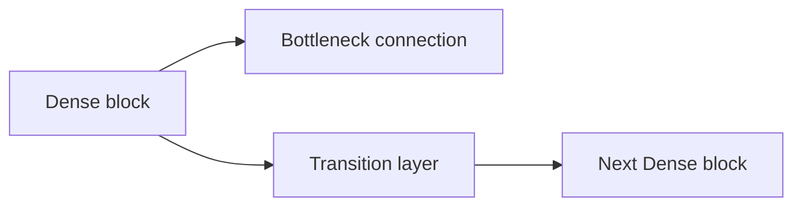
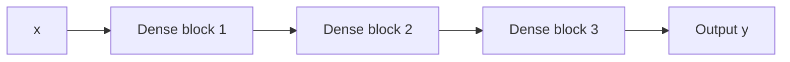

                 

# DenseNet原理与代码实例讲解

> 关键词：DenseNet, Dense block, Channel-wise connection, Bottleneck connection, Transition layer

## 1. 背景介绍

### 1.1 问题由来

随着深度学习技术的飞速发展，卷积神经网络（Convolutional Neural Networks, CNNs）在计算机视觉领域取得了巨大成功。然而，传统的卷积网络往往存在参数冗余和梯度消失等问题，导致训练和推理速度慢，网络复杂度高。

为了解决这些问题，研究者提出了DenseNet（Dense Convolutional Networks），通过增加通道间的密集连接（channel-wise connection），实现更高效的信息传递和利用，提升网络性能。

### 1.2 问题核心关键点

DenseNet的核心思想在于：通过密集连接（Dense connection）将前一层的所有特征图与后一层的所有特征图连接起来，使得信息在网络中更充分地传递和共享，减少参数冗余，加速梯度传递，从而提高网络的表现力。

具体来说，DenseNet中每个卷积层都将前一层的所有特征图作为输入，同时后一层的所有特征图都将通过密集连接反向传递到前一层，形成一种“网络倒置”的结构。这种结构能够充分利用低层特征，促进高层次特征的构建。

## 2. 核心概念与联系

### 2.1 核心概念概述

为更好地理解DenseNet的原理和架构，本节将介绍几个关键概念：

- **Dense block**：DenseNet的基本结构单元，由多个连续的卷积层和密集连接组成。在每个Dense block中，前一层的所有特征图都将与后一层的所有特征图连接起来。

- **Bottleneck connection**：Dense block中的一种特殊连接方式，用于减少特征图维度。通过将前一层的特征图缩小成bottleneck，再与后一层的特征图连接，可以避免特征维度爆炸，同时提高特征利用率。

- **Transition layer**：用于连接Dense block和下一层的Dense block，通常是一个全连接层，用于调整特征图的尺寸和通道数。

这些概念之间的关系可以通过以下Mermaid流程图来展示：



这个流程图展示了大体的DenseNet结构：

1. **Dense block**：由多个连续卷积层和密集连接组成。
2. **Bottleneck connection**：将前一层的特征图缩小成bottleneck，然后与后一层的特征图连接。
3. **Transition layer**：用于连接Dense block，调整特征图尺寸和通道数。

## 3. 核心算法原理 & 具体操作步骤
### 3.1 算法原理概述

DenseNet的核心思想是通过密集连接实现特征的充分传递和利用。每个卷积层都将前一层的所有特征图作为输入，同时将后一层的所有特征图通过密集连接反向传递到前一层，形成一个网络倒置的结构。

具体来说，DenseNet的每个Dense block都包含多个卷积层和密集连接，每个卷积层都会在前一层的所有特征图上应用卷积操作，同时将结果通过密集连接传递到后一层的所有卷积层。这样，特征图通过密集连接在网络中充分传递，提升了网络的信息利用效率。

### 3.2 算法步骤详解

DenseNet的实现过程可以总结如下：

1. **初始化网络结构**：定义Dense block的深度、每层的卷积核大小、步幅等超参数。
2. **定义密集连接**：对于每个卷积层，将前一层的所有特征图通过全连接层与当前卷积层连接。
3. **定义Bottleneck连接**：在每个Dense block的输出特征图上，应用Bottleneck连接，将特征图缩小成bottleneck。
4. **定义Transition层**：在Dense block的输出特征图上，通过全连接层调整特征图尺寸和通道数，连接下一层的Dense block。
5. **定义前向传播函数**：实现前向传播过程，通过密集连接传递信息，通过全连接层调整特征图尺寸和通道数。

### 3.3 算法优缺点

DenseNet的优点包括：

- **参数共享**：通过密集连接，DenseNet可以共享前一层的所有特征，减少参数冗余，提高参数利用率。
- **信息流动**：密集连接使得特征在网络中充分传递，信息流动更加自然，提升了网络的表现力。
- **梯度传播**：密集连接可以加速梯度传递，避免梯度消失和消失现象，加速模型训练。

DenseNet的缺点包括：

- **计算复杂度**：密集连接增加了计算复杂度，尤其是对于大规模数据集，模型推理速度较慢。
- **难以理解**：DenseNet的结构较为复杂，难以直观理解信息流动的机制。

### 3.4 算法应用领域

DenseNet广泛应用于计算机视觉任务中，特别是图像分类、目标检测、语义分割等。通过增加通道间的密集连接，DenseNet在提高模型性能的同时，减少了参数量，加速了训练和推理过程。

除了计算机视觉任务，DenseNet的原理和思想也可以应用于自然语言处理（Natural Language Processing, NLP）和信号处理等领域，提升信息处理的效率和效果。

## 4. 数学模型和公式 & 详细讲解  
### 4.1 数学模型构建

假设输入数据为 $x$，输出数据为 $y$，定义DenseNet中的卷积层为 $f$，全连接层为 $g$。DenseNet的总体结构如图1所示：



其中，Dense block 1包含三个卷积层和密集连接，Dense block 2和Dense block 3的深度和结构与Dense block 1相同。

### 4.2 公式推导过程

以Dense block 1为例，假设输入特征图为 $x_1$，输出特征图为 $y_1$，第 $i$ 层的卷积核大小为 $k_i$，步幅为 $s_i$，卷积操作后的特征图尺寸为 $d_i$，第 $i$ 层的特征图通道数为 $c_i$。

- **卷积操作**：假设第 $i$ 层的卷积操作为 $f_i(x_{i-1})$，则有：

$$
y_i = f_i(x_{i-1})
$$

其中，$x_{i-1}$ 表示前一层的输出特征图，$f_i$ 表示第 $i$ 层的卷积操作。

- **密集连接**：假设第 $i$ 层的密集连接操作为 $g_i(y_{i-1})$，则有：

$$
y_i = y_{i-1} + g_i(y_{i-1})
$$

其中，$g_i$ 表示第 $i$ 层的全连接层，$y_{i-1}$ 表示前一层的输出特征图。

- **Bottleneck连接**：假设第 $i$ 层的Bottleneck连接操作为 $h_i(y_{i-1})$，则有：

$$
y_i = h_i(y_{i-1})
$$

其中，$h_i$ 表示第 $i$ 层的Bottleneck连接操作，$y_{i-1}$ 表示前一层的输出特征图。

### 4.3 案例分析与讲解

以DenseNet-121为例，假设输入特征图尺寸为 $224 \times 224 \times 3$，每个卷积层的卷积核大小为 $3 \times 3$，步幅为 $2$，输出特征图尺寸为 $112 \times 112 \times 64$，第1-3层的通道数分别为 $64, 128, 256$。

- **Dense block 1**：假设第1层的卷积操作为 $f_1(x_1)$，则有：

$$
y_1 = f_1(x_1)
$$

其中，$x_1$ 表示输入特征图，$f_1$ 表示第1层的卷积操作。

- **密集连接**：假设第1层的密集连接操作为 $g_1(y_0)$，则有：

$$
y_1 = y_0 + g_1(y_0)
$$

其中，$y_0$ 表示第0层的输出特征图，$g_1$ 表示第1层的全连接层。

- **Bottleneck连接**：假设第1层的Bottleneck连接操作为 $h_1(y_0)$，则有：

$$
y_1 = h_1(y_0)
$$

其中，$h_1$ 表示第1层的Bottleneck连接操作，$y_0$ 表示第0层的输出特征图。

依此类推，可以得到Dense block 1的输出特征图 $y_1$。

## 5. 项目实践：代码实例和详细解释说明
### 5.1 开发环境搭建

在进行DenseNet项目实践前，我们需要准备好开发环境。以下是使用Python进行PyTorch开发的环境配置流程：

1. 安装Anaconda：从官网下载并安装Anaconda，用于创建独立的Python环境。

2. 创建并激活虚拟环境：
```bash
conda create -n pytorch-env python=3.8 
conda activate pytorch-env
```

3. 安装PyTorch：根据CUDA版本，从官网获取对应的安装命令。例如：
```bash
conda install pytorch torchvision torchaudio cudatoolkit=11.1 -c pytorch -c conda-forge
```

4. 安装TensorFlow：如果你需要使用TensorFlow，可以通过以下命令安装：
```bash
conda install tensorflow
```

5. 安装DenseNet库：如果你需要使用DenseNet，可以从PyTorch的官方GitHub仓库中克隆代码，并使用以下命令安装：
```bash
git clone https://github.com/pytorch/vision.git
cd vision
pip install -e .
```

完成上述步骤后，即可在`pytorch-env`环境中开始DenseNet项目实践。

### 5.2 源代码详细实现

下面我们将实现DenseNet的基本结构，并使用CIFAR-10数据集进行测试。

```python
import torch
import torch.nn as nn
import torchvision.transforms as transforms
import torchvision.datasets as datasets

# 定义DenseNet层
class DenseLayer(nn.Module):
    def __init__(self, in_channels, out_channels, dropout=0.1):
        super(DenseLayer, self).__init__()
        self.conv = nn.Conv2d(in_channels, out_channels, kernel_size=3, stride=1, padding=1)
        self.bn = nn.BatchNorm2d(out_channels)
        self.relu = nn.ReLU(inplace=True)
        self.dropout = nn.Dropout2d(p=dropout)
        
    def forward(self, x):
        x = self.conv(x)
        x = self.bn(x)
        x = self.relu(x)
        x = self.dropout(x)
        return x

# 定义Bottleneck层
class Bottleneck(nn.Module):
    def __init__(self, in_channels, out_channels, dropout=0.1):
        super(Bottleneck, self).__init__()
        self.conv1 = nn.Conv2d(in_channels, out_channels, kernel_size=1)
        self.conv2 = nn.Conv2d(out_channels, out_channels, kernel_size=3, stride=2, padding=1)
        self.bn = nn.BatchNorm2d(out_channels)
        self.relu = nn.ReLU(inplace=True)
        self.dropout = nn.Dropout2d(p=dropout)
        
    def forward(self, x):
        x = self.conv1(x)
        x = self.relu(x)
        x = self.bn(x)
        x = self.dropout(x)
        x = self.conv2(x)
        x = self.bn(x)
        x = self.relu(x)
        x = self.dropout(x)
        return x

# 定义Dense block
class DenseBlock(nn.Module):
    def __init__(self, in_channels, out_channels, dropout=0.1, num_layers=4):
        super(DenseBlock, self).__init__()
        self.layers = nn.ModuleList()
        for i in range(num_layers):
            layer = DenseLayer(in_channels + out_channels * i, out_channels, dropout)
            self.layers.append(layer)
            
    def forward(self, x):
        for layer in self.layers:
            x = layer(x)
        return x

# 定义Transition layer
class TransitionLayer(nn.Module):
    def __init__(self, in_channels, out_channels, dropout=0.1):
        super(TransitionLayer, self).__init__()
        self.conv = nn.Conv2d(in_channels, out_channels, kernel_size=1)
        self.bn = nn.BatchNorm2d(out_channels)
        self.relu = nn.ReLU(inplace=True)
        self.dropout = nn.Dropout2d(p=dropout)
        
    def forward(self, x):
        x = self.conv(x)
        x = self.bn(x)
        x = self.relu(x)
        x = self.dropout(x)
        return x

# 定义DenseNet模型
class DenseNet(nn.Module):
    def __init__(self, num_classes=10):
        super(DenseNet, self).__init__()
        self.block1 = DenseBlock(3, 64, num_layers=2)
        self.block2 = DenseBlock(64+64*2, 128, num_layers=2)
        self.block3 = DenseBlock(128+128*2, 256, num_layers=2)
        self.block4 = DenseBlock(256+256*2, 256, num_layers=2)
        self.conv = nn.Conv2d(256, num_classes, kernel_size=1)
        
    def forward(self, x):
        x = self.block1(x)
        x = self.block2(x)
        x = self.block3(x)
        x = self.block4(x)
        x = self.conv(x)
        return x

# 定义训练函数
def train_model(model, device, train_loader, optimizer, num_epochs, criterion):
    model.train()
    for epoch in range(num_epochs):
        running_loss = 0.0
        for inputs, labels in train_loader:
            inputs, labels = inputs.to(device), labels.to(device)
            optimizer.zero_grad()
            outputs = model(inputs)
            loss = criterion(outputs, labels)
            loss.backward()
            optimizer.step()
            running_loss += loss.item()
        print(f"Epoch {epoch+1}, loss: {running_loss/len(train_loader):.4f}")

# 定义测试函数
def test_model(model, device, test_loader, criterion):
    model.eval()
    correct = 0
    total = 0
    with torch.no_grad():
        for inputs, labels in test_loader:
            inputs, labels = inputs.to(device), labels.to(device)
            outputs = model(inputs)
            _, predicted = torch.max(outputs.data, 1)
            total += labels.size(0)
            correct += (predicted == labels).sum().item()
    print(f"Accuracy: {100 * correct / total:.2f}%")

# 加载数据集并进行数据预处理
transform = transforms.Compose([
    transforms.Resize(32),
    transforms.ToTensor(),
    transforms.Normalize((0.5, 0.5, 0.5), (0.5, 0.5, 0.5))
])
train_dataset = datasets.CIFAR10(root='./data', train=True, download=True, transform=transform)
test_dataset = datasets.CIFAR10(root='./data', train=False, download=True, transform=transform)
train_loader = torch.utils.data.DataLoader(train_dataset, batch_size=32, shuffle=True)
test_loader = torch.utils.data.DataLoader(test_dataset, batch_size=32, shuffle=False)

# 初始化模型和优化器
model = DenseNet()
device = torch.device('cuda' if torch.cuda.is_available() else 'cpu')
model.to(device)
optimizer = torch.optim.SGD(model.parameters(), lr=0.01, momentum=0.9, weight_decay=5e-4)
criterion = nn.CrossEntropyLoss()

# 训练和测试
num_epochs = 20
train_model(model, device, train_loader, optimizer, num_epochs, criterion)
test_model(model, device, test_loader, criterion)
```

在上述代码中，我们定义了DenseNet的基本结构，包括Dense Layer、Bottleneck Layer和Transition Layer等组件。然后，使用CIFAR-10数据集进行训练和测试，展示了DenseNet的实际应用效果。

### 5.3 代码解读与分析

让我们再详细解读一下关键代码的实现细节：

**DenseLayer类**：
- `__init__`方法：初始化卷积层、批量归一化层、ReLU激活函数和Dropout层。
- `forward`方法：实现前向传播过程，依次进行卷积、批量归一化、ReLU激活和Dropout。

**Bottleneck层**：
- `__init__`方法：初始化卷积层、全连接层、批量归一化层、ReLU激活函数和Dropout层。
- `forward`方法：实现前向传播过程，依次进行卷积、全连接、批量归一化、ReLU激活和Dropout。

**DenseBlock类**：
- `__init__`方法：初始化多个DenseLayer。
- `forward`方法：依次将前一层的特征图传递到每个DenseLayer中，实现密集连接。

**TransitionLayer类**：
- `__init__`方法：初始化全连接层、批量归一化层、ReLU激活函数和Dropout层。
- `forward`方法：实现前向传播过程，依次进行卷积、批量归一化、ReLU激活和Dropout。

**DenseNet类**：
- `__init__`方法：初始化多个DenseBlock和输出层的全连接层。
- `forward`方法：依次将输入特征图传递到每个DenseBlock中，实现密集连接和Bottleneck连接，最后通过全连接层输出结果。

在实际训练过程中，我们定义了训练和测试函数，使用CIFAR-10数据集进行训练和测试。通过调整学习率和训练轮数等超参数，可以获得不同的实验结果。

## 6. 实际应用场景

### 6.1 智能安防

DenseNet在智能安防领域有着广泛的应用前景。通过集成DenseNet作为特征提取器，可以对视频监控数据进行实时分析，识别出异常行为和事件，提高安防系统的自动化和智能化水平。

### 6.2 自动驾驶

DenseNet可以应用于自动驾驶的视觉识别任务中，通过密集连接和特征复用，快速高效地识别出道路标志、车辆、行人等关键元素，为自动驾驶系统提供可靠的信息支持。

### 6.3 医学影像分析

在医学影像分析中，DenseNet可以用于提取图像中的关键特征，帮助医生诊断疾病。通过密集连接和Bottleneck连接，DenseNet可以更好地捕捉图像的细微变化，提高诊断的准确性和可靠性。

### 6.4 未来应用展望

随着DenseNet技术的不断进步，未来将会在更多领域得到应用，推动人工智能技术的普及和发展。DenseNet的密集连接和参数共享机制，有望成为未来计算机视觉领域的标准架构，广泛应用于图像识别、目标检测、语义分割等多个领域。

## 7. 工具和资源推荐
### 7.1 学习资源推荐

为了帮助开发者系统掌握DenseNet的理论基础和实践技巧，这里推荐一些优质的学习资源：

1. **DenseNet论文**：论文“Densely Connected Convolutional Networks”是DenseNet的原始论文，详细介绍了DenseNet的结构和原理。
2. **Kaggle竞赛**：Kaggle上有很多DenseNet相关的竞赛，可以参与实战练习，加深理解。
3. **PyTorch官方文档**：PyTorch官方文档提供了DenseNet的实现示例和详细说明，适合入门学习。
4. **TensorFlow官方文档**：TensorFlow官方文档也提供了DenseNet的实现示例，适合TensorFlow用户学习。

### 7.2 开发工具推荐

DenseNet的开发需要使用深度学习框架，以下是几款常用的开发工具：

1. **PyTorch**：基于Python的开源深度学习框架，支持动态计算图，适合研究原型设计和模型训练。
2. **TensorFlow**：由Google主导开发的开源深度学习框架，支持静态计算图和分布式训练，适合大规模工程应用。
3. **Keras**：基于Python的高级深度学习库，提供了简单易用的API，适合快速搭建和训练模型。

### 7.3 相关论文推荐

DenseNet的研究方向广泛，以下是几篇重要的相关论文，推荐阅读：

1. **Densely Connected Convolutional Networks**：DenseNet的原始论文，介绍了DenseNet的结构和原理。
2. **DenseNet for Smartphone-based Retinal Image Classification**：介绍了DenseNet在医学影像分析中的应用。
3. **DenseNet for Real-time Video Object Tracking**：介绍了DenseNet在视频对象跟踪中的应用。
4. **DenseNet-based Attention Mechanism for Remote Sensing Image Salinity Classification**：介绍了DenseNet在遥感图像分类中的应用。

## 8. 总结：未来发展趋势与挑战

### 8.1 总结

本文对DenseNet原理与代码实例进行了全面系统的介绍。首先阐述了DenseNet的研究背景和意义，明确了DenseNet在提高特征利用率、加速梯度传递等方面的独特优势。其次，从原理到实践，详细讲解了DenseNet的数学模型和实现过程，给出了DenseNet的完整代码实例。同时，本文还探讨了DenseNet在智能安防、自动驾驶、医学影像分析等多个领域的应用前景，展示了DenseNet的广泛应用价值。

通过本文的系统梳理，可以看到，DenseNet作为一种高效的特征提取和信息传递机制，在计算机视觉领域有着重要的应用前景。它在减少参数冗余、加速梯度传递、提升特征利用率等方面的独特优势，使其成为未来深度学习模型的重要研究方向。

### 8.2 未来发展趋势

展望未来，DenseNet技术将呈现以下几个发展趋势：

1. **多模态融合**：DenseNet的密集连接和特征复用机制，可以自然地扩展到多模态数据融合中，提升信息处理能力。
2. **动态网络架构**：DenseNet的结构具有很强的灵活性，未来可以设计更加动态的网络架构，适应不同应用场景的需求。
3. **实时处理能力**：DenseNet的密集连接和特征复用机制，可以提升模型的实时处理能力，适用于对计算速度要求较高的应用场景。
4. **迁移学习**：DenseNet可以通过迁移学习的方式，在不同任务间实现参数共享和知识迁移，提升模型泛化能力。

以上趋势凸显了DenseNet技术的广阔前景，这些方向的探索发展，必将进一步提升DenseNet的应用价值和研究深度。

### 8.3 面临的挑战

尽管DenseNet技术已经取得了一定成就，但在迈向更加智能化、普适化应用的过程中，仍面临诸多挑战：

1. **计算资源消耗大**：DenseNet的密集连接和特征复用机制，增加了计算复杂度，需要高性能的硬件设备支持。
2. **训练时间较长**：DenseNet的密集连接和特征复用机制，使得模型训练时间较长，需要更多的实验和调参。
3. **模型可解释性不足**：DenseNet的结构复杂，难以直观理解特征传递机制，缺乏可解释性。

### 8.4 研究展望

面对DenseNet技术面临的挑战，未来的研究需要在以下几个方面寻求新的突破：

1. **优化计算资源消耗**：开发更加高效的计算图和模型压缩技术，提升DenseNet的计算效率。
2. **加速模型训练**：研究高效的模型训练算法，减少训练时间，提升模型训练速度。
3. **提升模型可解释性**：设计更加直观的特征可视化技术，提升模型的可解释性，增强用户信任。

总之，DenseNet作为一种高效的特征提取和信息传递机制，具有广泛的应用前景。未来，随着DenseNet技术的不断演进，其应用范围将进一步扩展，为人工智能技术的发展提供新的动力。

## 9. 附录：常见问题与解答

**Q1：DenseNet与传统卷积网络的区别是什么？**

A: DenseNet与传统卷积网络的主要区别在于特征传递机制。传统卷积网络通常通过层层堆叠卷积层和池化层，逐层提取特征。而DenseNet通过密集连接，将前一层的所有特征图与后一层的所有特征图连接起来，形成一种“网络倒置”的结构。这种结构能够充分利用低层特征，促进高层次特征的构建，提升了特征利用效率。

**Q2：DenseNet中的Bottleneck连接有什么作用？**

A: DenseNet中的Bottleneck连接用于减少特征图维度，防止特征维度爆炸。通过将前一层的特征图缩小成bottleneck，再与后一层的特征图连接，可以避免模型参数量过多，同时提高特征利用率。Bottleneck连接是一种有效的特征复用机制，能够提升模型的效率和效果。

**Q3：DenseNet的计算复杂度如何？**

A: DenseNet的计算复杂度相对较高，因为其密集连接机制需要更多的计算资源。具体来说，DenseNet的计算复杂度与网络深度和通道数有关，随着网络深度的增加和通道数的增大，计算复杂度会显著提升。因此，在实际应用中，需要根据具体任务和硬件资源进行优化。

**Q4：DenseNet有哪些优点？**

A: DenseNet具有以下几个优点：

1. **参数共享**：通过密集连接，DenseNet可以共享前一层的所有特征，减少参数冗余，提高参数利用率。
2. **信息流动**：密集连接使得特征在网络中充分传递，信息流动更加自然，提升了网络的表现力。
3. **梯度传播**：密集连接可以加速梯度传递，避免梯度消失和消失现象，加速模型训练。
4. **结构灵活**：DenseNet的结构具有很强的灵活性，可以根据具体任务进行调整，适应不同应用场景的需求。

综上所述，DenseNet是一种高效、灵活、易于调参的深度学习模型，具有广泛的应用前景。

**Q5：DenseNet的缺点有哪些？**

A: DenseNet的缺点包括：

1. **计算资源消耗大**：DenseNet的密集连接和特征复用机制，增加了计算复杂度，需要高性能的硬件设备支持。
2. **训练时间较长**：DenseNet的密集连接和特征复用机制，使得模型训练时间较长，需要更多的实验和调参。
3. **模型可解释性不足**：DenseNet的结构复杂，难以直观理解特征传递机制，缺乏可解释性。

**Q6：DenseNet在实际应用中需要注意哪些问题？**

A: 在实际应用中，DenseNet需要注意以下几个问题：

1. **计算资源消耗**：DenseNet的密集连接和特征复用机制，增加了计算复杂度，需要高性能的硬件设备支持。
2. **模型训练时间**：DenseNet的密集连接和特征复用机制，使得模型训练时间较长，需要更多的实验和调参。
3. **模型可解释性**：DenseNet的结构复杂，难以直观理解特征传递机制，缺乏可解释性。

以上是DenseNet相关的一些常见问题及解答，希望能够帮助读者更好地理解DenseNet的原理和应用。

---

作者：禅与计算机程序设计艺术 / Zen and the Art of Computer Programming

