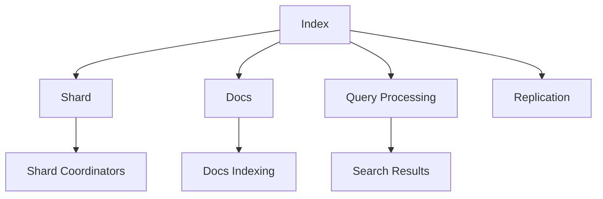

                 

# ElasticSearch Index原理与代码实例讲解

> 关键词：ElasticSearch, Index, 分布式, 搜索, 存储, 高效查询

## 1. 背景介绍

ElasticSearch是一款分布式的搜索引擎和分析工具，基于Apache Lucene实现，支持海量数据的存储、搜索和分析。Index是其核心概念之一，用于组织和管理文档。Index原理和应用是大数据和分布式存储领域的重要研究内容，理解Index原理和代码实现对于从事数据处理和存储工作的开发者来说，尤为重要。

本节将详细介绍ElasticSearch Index的原理和实现，并通过代码实例帮助读者深入理解Index的基本概念和实现流程。

## 2. 核心概念与联系

### 2.1 核心概念概述

ElasticSearch Index是用于存储和管理文档的数据结构，由多个Shard组成，每个Shard可以分布式存储在多个节点上。Index通过MapReduce风格的分布式计算，实现了海量数据的快速查询和分析。Index的实现涉及数据结构、分布式计算、存储和查询等多个方面的内容，是ElasticSearch的核心组件。

### 2.2 核心概念关系

以下是一个简化的Index原理和组件关系图：



- **Index**：包含多个Shard的文档集合，通过Shard Coordinators进行管理和协调。
- **Shard**：Index中的一部分文档，分布在多个节点上，并由Shard Coordinators进行协调。
- **Docs**：ElasticSearch中的文档，包含文本、图片、视频等多种类型的数据。
- **Docs Indexing**：将文档写入Index的过程，包括解析、编码和存储等步骤。
- **Query Processing**：在Index中查询文档的过程，包括解析、过滤、排序等操作。
- **Search Results**：查询结果，包含匹配的文档及其相关的元数据。
- **Replication**：Index的副本机制，确保数据的高可用性和容错性。

## 3. 核心算法原理 & 具体操作步骤

### 3.1 算法原理概述

ElasticSearch Index的原理基于Lucene的倒排索引技术。倒排索引是一种高效的数据结构，用于快速定位包含特定关键词的文档。ElasticSearch通过MapReduce风格的分布式计算，将倒排索引扩展到多个Shard和节点，实现了大规模数据的高效查询和分析。

Index的核心算法包括：
- **倒排索引构建**：将文档解析为关键词和其出现的文档ID，构建倒排索引。
- **Shard分配和协调**：将文档分配到多个Shard，并通过Shard Coordinators进行管理和协调。
- **分布式查询处理**：通过MapReduce风格的分布式计算，实现海量数据的快速查询和分析。

### 3.2 算法步骤详解

#### 3.2.1 倒排索引构建

1. **解析文档**：将文档解析为文本、图片、视频等不同类型的数据。
2. **分词和编码**：对文本数据进行分词和编码，生成关键词和其出现的文档ID。
3. **构建倒排索引**：将关键词和其对应的文档ID存储到倒排索引中。

#### 3.2.2 Shard分配和协调

1. **Shard划分**：根据文档的哈希值，将文档分配到多个Shard。
2. **Shard分配**：将Shard分配到多个节点上，并设置Shard Coordinators进行管理和协调。
3. **Shard同步**：通过Shard Coordinators协调不同节点上的Shard同步更新，确保数据的实时性和一致性。

#### 3.2.3 分布式查询处理

1. **查询解析**：将查询语句解析为多个Map任务，每个Map任务处理一部分查询请求。
2. **分布式计算**：每个Map任务对倒排索引进行遍历，匹配查询关键词，生成中间结果。
3. **聚合处理**：将多个Map任务的中间结果进行聚合，生成最终查询结果。

### 3.3 算法优缺点

ElasticSearch Index的优点包括：
- **高效查询**：倒排索引技术和分布式计算，实现了海量数据的快速查询和分析。
- **数据高可用性**：Shard副本机制确保了数据的高可用性和容错性。
- **灵活性**：支持多数据类型和多种查询方式，适用于各种应用场景。

缺点包括：
- **资源消耗高**：倒排索引和分布式计算对计算资源和内存要求较高。
- **维护复杂**：Shard管理和同步更新需要大量配置和管理工作。
- **查询延迟**：在大规模数据下，查询延迟可能较高。

### 3.4 算法应用领域

ElasticSearch Index广泛应用于以下几个领域：
- **搜索引擎**：提供快速、准确的搜索功能，适用于电商、社交媒体等应用。
- **日志分析**：通过索引日志数据，进行实时监控和告警。
- **用户行为分析**：通过索引用户行为数据，进行用户行为分析和个性化推荐。
- **机器学习**：通过索引数据，进行模型训练和预测分析。

## 4. 数学模型和公式 & 详细讲解 & 举例说明

### 4.1 数学模型构建

ElasticSearch Index的数学模型基于Lucene的倒排索引模型，可以表示为：
$$
Index = \{ (k, d) | k \in Keywords, d \in DocumentIDs \}
$$

其中，$k$表示关键词，$d$表示包含该关键词的文档ID。Index由多个Shard组成，每个Shard可以表示为：
$$
Shard = \{ (k_i, d_i) | k_i \in Keywords, d_i \in DocumentIDs \}
$$

### 4.2 公式推导过程

ElasticSearch Index的倒排索引构建和查询处理过程，可以通过以下公式进行推导：
1. **倒排索引构建公式**：
$$
Index = \bigcup_{k \in Keywords} \{ (k, d) | d \in DocumentIDs(k) \}
$$
其中，$DocumentIDs(k)$表示包含关键词$k$的文档ID集合。
2. **分布式查询处理公式**：
$$
QueryResult = \bigcup_{MapTask} MapResult
$$
其中，$MapTask$表示Map任务，$MapResult$表示Map任务的查询结果。

### 4.3 案例分析与讲解

假设有一个包含多个文档的Index，包含以下关键词和对应的文档ID：
| 关键词 | 文档ID |
| --- | --- |
| 技术 | [1, 3, 5] |
| 产品 | [2, 4, 5] |
| 市场 | [3, 4, 6] |

构建倒排索引后，可以表示为：
$$
Index = \{ (技术, 1), (技术, 3), (技术, 5), (产品, 2), (产品, 4), (产品, 5), (市场, 3), (市场, 4), (市场, 6) \}
$$

现在进行一个查询$查询词 = 技术$，查询过程如下：
1. **查询解析**：将查询词解析为Map任务，每个Map任务处理一部分文档。
2. **分布式计算**：每个Map任务对倒排索引进行遍历，匹配关键词，生成中间结果。
3. **聚合处理**：将多个Map任务的中间结果进行聚合，生成最终查询结果。

## 5. 项目实践：代码实例和详细解释说明

### 5.1 开发环境搭建

ElasticSearch Index的实现基于Lucene和ElasticSearch库，需要搭建相应的开发环境。

1. **安装Lucene**：从官网下载Lucene库，并配置环境变量。
2. **安装ElasticSearch**：从官网下载ElasticSearch库，并按照文档说明进行安装和配置。
3. **启动ElasticSearch**：使用ElasticSearch提供的启动命令，启动ElasticSearch服务。

### 5.2 源代码详细实现

以下是使用Python代码实现ElasticSearch Index的简单示例：

```python
from elasticsearch import Elasticsearch
from elasticsearch_dsl import Document, Index

# 创建ElasticSearch客户端
es = Elasticsearch()

# 创建Index对象
index = Index("my_index")

# 定义文档类型
document = Document()

# 定义文档结构
document.fields(
    keyword=TextFieldsAnalyzer(),
    value=Keyword()
)

# 注册文档类型
index.document(document)

# 创建文档
doc = index.create_document(
    keyword="技术",
    value="这是关于技术的文档"
)

# 查询文档
result = index.search(query={"keyword": "技术"})
print(result)
```

### 5.3 代码解读与分析

1. **ElasticSearch客户端**：通过ElasticSearch库创建ElasticSearch客户端，用于连接和操作ElasticSearch服务器。
2. **Index对象**：创建Index对象，并指定Index名称。
3. **文档类型**：定义文档类型，并注册到Index中。
4. **文档结构**：定义文档结构，包含关键词和对应的值。
5. **创建文档**：使用Index对象创建文档，并指定关键词和值。
6. **查询文档**：使用Index对象的search方法，查询包含特定关键词的文档。

## 6. 实际应用场景

### 6.1 电商搜索

ElasticSearch Index在电商搜索中有着广泛应用，可以实时索引商品数据，提供高效的搜索和推荐服务。电商企业通过ElasticSearch Index，可以快速响应用户查询，并提供个性化的商品推荐，提升用户体验和销售额。

### 6.2 社交媒体分析

社交媒体平台通过ElasticSearch Index，可以实时索引用户的帖子、评论、点赞等数据，进行用户行为分析和情感分析。社交媒体平台可以基于这些分析结果，进行舆情监控和内容推送，提升用户粘性和平台价值。

### 6.3 金融数据监控

金融行业需要实时监控市场数据和用户行为，进行风险评估和预警。ElasticSearch Index通过索引金融数据，可以提供高效的搜索和分析功能，帮助金融机构进行数据监控和预警，规避金融风险。

## 7. 工具和资源推荐

### 7.1 学习资源推荐

1. **ElasticSearch官方文档**：包含ElasticSearch Index的详细说明和示例代码。
2. **ElasticSearch教程**：提供了ElasticSearch Index的实战案例，帮助读者快速上手。
3. **Lucene官方文档**：Lucene是ElasticSearch Index的核心库，了解Lucene的倒排索引原理，对理解ElasticSearch Index至关重要。
4. **分布式系统课程**：了解分布式系统的基本概念和设计原则，有助于更好地理解ElasticSearch Index的设计和实现。

### 7.2 开发工具推荐

1. **ElasticSearch客户端**：用于连接和操作ElasticSearch服务器，提供高效的API接口。
2. **Kibana可视化工具**：用于对ElasticSearch Index进行可视化分析和监控，提供丰富的图表和仪表盘。
3. **ElasticSearch Data Frame**：提供基于Python的数据分析接口，可以方便地对ElasticSearch Index进行查询和分析。
4. **ElasticSearch部署工具**：用于部署和管理ElasticSearch集群，提供自动化的配置和监控功能。

### 7.3 相关论文推荐

1. **ElasticSearch论文**：ElasticSearch官方发布的论文，介绍了ElasticSearch Index的设计和实现原理。
2. **分布式系统论文**：了解分布式系统的基本原理和设计方法，有助于更好地理解ElasticSearch Index的分布式设计。
3. **自然语言处理论文**：了解自然语言处理技术的基本原理和应用场景，有助于更好地理解ElasticSearch Index的文本处理和查询技术。

## 8. 总结：未来发展趋势与挑战

### 8.1 研究成果总结

ElasticSearch Index作为ElasticSearch的核心组件，通过倒排索引技术和分布式计算，实现了海量数据的快速查询和分析。其高效性和高可用性，使其在搜索引擎、日志分析、用户行为分析等多个领域得到了广泛应用。

### 8.2 未来发展趋势

未来ElasticSearch Index的发展趋势包括：
1. **多模态数据处理**：支持文本、图片、视频等多种类型的数据处理，提升数据处理能力。
2. **实时流处理**：支持实时流数据的处理和分析，提升数据处理的时效性。
3. **分布式架构**：支持更大规模的分布式架构，提升数据处理和查询的效率。
4. **机器学习集成**：支持机器学习模型的集成，提升数据的预测和分析能力。

### 8.3 面临的挑战

ElasticSearch Index在发展过程中，也面临着一些挑战：
1. **性能瓶颈**：在大规模数据下，查询和索引的性能可能成为瓶颈。
2. **配置复杂**：ElasticSearch Index的配置和管理比较复杂，需要大量经验和技巧。
3. **安全性问题**：ElasticSearch Index需要保证数据的安全性和隐私性，避免数据泄露和滥用。

### 8.4 研究展望

未来ElasticSearch Index的研究方向包括：
1. **优化查询性能**：优化查询和索引的算法和实现，提升查询效率。
2. **提升数据处理能力**：支持更多类型的数据处理，提升数据处理能力。
3. **增强安全性**：提升数据的安全性和隐私保护能力，避免数据滥用。
4. **扩展分布式架构**：支持更大规模的分布式架构，提升数据处理和查询的效率。

## 9. 附录：常见问题与解答

**Q1: 什么是ElasticSearch Index?**

A: ElasticSearch Index是ElasticSearch中用于存储和管理文档的数据结构，由多个Shard组成，每个Shard可以分布式存储在多个节点上。Index通过MapReduce风格的分布式计算，实现了海量数据的快速查询和分析。

**Q2: ElasticSearch Index的优点和缺点有哪些?**

A: ElasticSearch Index的优点包括高效查询、数据高可用性和灵活性。缺点包括资源消耗高、维护复杂和查询延迟。

**Q3: ElasticSearch Index的应用场景有哪些?**

A: ElasticSearch Index广泛应用于搜索引擎、日志分析、用户行为分析和金融数据监控等多个领域。

**Q4: 如何搭建ElasticSearch Index的开发环境?**

A: 搭建ElasticSearch Index的开发环境需要安装Lucene和ElasticSearch库，并按照文档说明进行配置和启动。

**Q5: ElasticSearch Index的核心算法原理是什么?**

A: ElasticSearch Index的核心算法包括倒排索引构建、Shard分配和协调以及分布式查询处理。

作者：禅与计算机程序设计艺术 / Zen and the Art of Computer Programming

