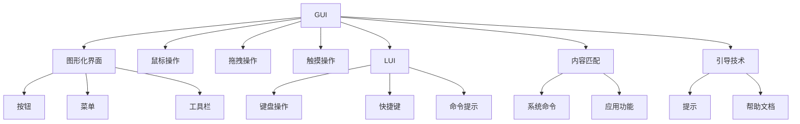

                 

## 1. 背景介绍

图形用户界面(GUI)和本地用户界面(LUI)是构建用户交互系统的两种主要技术路径。两者在内容匹配与引导上各有优缺点，适用于不同的应用场景。本文将对比GUI和LUI在内容匹配与引导中的特点，并讨论其各自的应用场景和发展趋势。

### 1.1 问题由来

随着互联网和移动互联网的发展，用户对于交互体验的要求越来越高。GUI和LUI作为构建用户界面的主流技术，在内容匹配与引导上展现出不同的优势和局限性。在设计和开发过程中，如何选择合适的技术路径，提升用户体验，成为亟待解决的问题。

### 1.2 问题核心关键点

在内容匹配与引导中，GUI和LUI的主要区别在于用户操作和反馈的机制不同。GUI通过图形化界面、按钮、菜单等方式进行交互，用户通过点击、拖拽等操作表达意图；而LUI则通过本地化界面、快捷键、命令等方式进行交互，用户通过键盘输入等直接控制。

两种技术路径各有优势：GUI用户界面直观易懂，操作性强，但需要占用较多的屏幕空间；LUI界面简洁高效，占用空间小，但需要用户对命令和快捷键有一定熟练度。

本文将从GUI和LUI的技术原理、应用场景、优缺点等多个方面进行深入探讨。

## 2. 核心概念与联系

### 2.1 核心概念概述

为更好地理解GUI与LUI在内容匹配与引导中的比较，本节将介绍几个关键概念：

- GUI（图形用户界面）：通过图形化的界面元素（如按钮、菜单、工具栏等），用户通过鼠标、触摸等直观方式进行交互。常见于桌面操作系统、浏览器、移动应用等。
- LUI（本地用户界面）：通过本地化的界面元素（如快捷键、命令提示等），用户通过键盘输入等方式进行交互。常见于命令行界面、文本编辑器、IDE等。
- 内容匹配：将用户输入的指令与相应的系统命令或应用功能进行匹配，确保用户意图被准确理解。
- 引导技术：通过提示、帮助文档等方式，引导用户逐步完成操作或任务。

这些核心概念之间的逻辑关系可以通过以下Mermaid流程图来展示：



这个流程图展示了大语言模型的核心概念及其之间的关系：

1. GUI和LUI通过不同的界面元素和操作方式，完成用户输入。
2. 内容匹配通过将用户输入与系统命令或应用功能进行匹配，确保正确执行。
3. 引导技术通过提示和文档，辅助用户理解操作，完成复杂任务。

这些概念共同构成了用户界面设计的理论基础，指导着GUI和LUI的实现与优化。

## 3. 核心算法原理 & 具体操作步骤
### 3.1 算法原理概述

GUI与LUI在内容匹配与引导上的差异主要体现在用户输入的表示和处理方式上。GUI通过图形化界面直观表达用户意图，LUI则通过本地化界面简洁高效。

在内容匹配方面，GUI通过鼠标、触摸等事件触发，将用户操作映射为相应的系统命令或应用功能。LUI通过键盘输入等直接操作，需要用户熟悉快捷键和命令。

在引导技术方面，GUI通过弹窗、提示框等视觉元素进行引导，LUI则通过文档、命令提示等文本信息进行引导。

### 3.2 算法步骤详解

基于GUI和LUI的内容匹配与引导，本文将详细讲解其操作步骤：

**GUI操作流程**：
1. 用户通过鼠标、触摸等操作选择界面元素（按钮、菜单等）。
2. 界面元素接收用户操作，触发相应的事件。
3. 系统根据事件执行相应的命令或功能。
4. 反馈用户操作结果，如图表、提示框等。

**LUI操作流程**：
1. 用户通过键盘输入快捷键、命令等。
2. 系统解析用户输入，执行相应的命令或功能。
3. 反馈用户操作结果，如输出信息、状态更新等。
4. 通过文档、提示等方式辅助用户理解操作。

**内容匹配示例**：
- GUI：用户点击“保存”按钮，系统执行“save”命令，保存文件。
- LUI：用户按下“Ctrl+S”快捷键，系统执行“save”命令，保存文件。

**引导技术示例**：
- GUI：保存文件时，弹出提示框询问“是否保存”，用户确认后保存。
- LUI：保存文件时，系统输出“正在保存”的提示信息。

### 3.3 算法优缺点

GUI与LUI在内容匹配与引导上各有优缺点：

**GUI优点**：
1. 直观易用：用户通过图形化界面直观理解操作，降低了学习门槛。
2. 操作多样：鼠标、触摸等多种操作方式，满足不同用户需求。
3. 可视化反馈：通过图表、提示框等视觉元素，用户能够实时了解操作结果。

**GUI缺点**：
1. 占用空间大：图形化界面需要占用较多的屏幕空间，不适合移动设备。
2. 加载慢：复杂的图形界面需要加载较多的资源，导致加载时间较长。
3. 易混淆：过多的界面元素容易混淆用户操作，导致误操作。

**LUI优点**：
1. 简洁高效：界面简单，占用空间小，适合移动设备。
2. 速度快：加载速度快，操作响应快。
3. 精确操作：键盘输入等方式精确控制，减少了误操作。

**LUI缺点**：
1. 学习门槛高：用户需要熟悉快捷键和命令，增加了学习成本。
2. 反馈单一：文本信息反馈较为单一，缺乏可视化效果。
3. 操作复杂：复杂操作需要用户熟悉命令和快捷键，操作难度大。

### 3.4 算法应用领域

GUI与LUI在内容匹配与引导上各有适用的应用场景：

**GUI应用场景**：
- 桌面操作系统：如Windows、macOS等。
- 浏览器：如Chrome、Firefox等。
- 移动应用：如微信、QQ等。

**LUI应用场景**：
- 命令行界面：如Linux终端、DOS命令提示符等。
- 文本编辑器：如Visual Studio Code、Sublime Text等。
- IDE：如Eclipse、IntelliJ IDEA等。

这些应用场景反映了GUI和LUI在不同应用领域的优势和局限性。

## 4. 数学模型和公式 & 详细讲解 & 举例说明

### 4.1 数学模型构建

本文将使用数学语言对GUI与LUI的内容匹配与引导过程进行更加严格的刻画。

**GUI数学模型**：
设用户输入为 $I$，系统命令为 $C$，事件为 $E$，则GUI的内容匹配过程可以表示为：
$$
C = f(E[I])
$$
其中 $f$ 为事件触发映射函数，将用户输入 $I$ 映射为系统命令 $C$。

**LUI数学模型**：
设用户输入为 $I$，系统命令为 $C$，则LUI的内容匹配过程可以表示为：
$$
C = g(I)
$$
其中 $g$ 为用户输入映射函数，将用户输入 $I$ 直接映射为系统命令 $C$。

### 4.2 公式推导过程

以下我们以保存文件的GUI操作为例，推导事件触发映射函数 $f$ 和用户输入映射函数 $g$ 的具体形式。

**GUI操作流程**：
1. 用户点击“保存”按钮。
2. 界面元素接收点击事件。
3. 系统执行“save”命令，保存文件。

**LUI操作流程**：
1. 用户按下“Ctrl+S”快捷键。
2. 系统解析快捷键，执行“save”命令，保存文件。

### 4.3 案例分析与讲解

**GUI保存文件操作示例**：
- 用户点击“保存”按钮，事件触发映射函数 $f$ 将按钮点击事件映射为“save”命令。
- 系统执行“save”命令，保存文件。

**LUI保存文件操作示例**：
- 用户按下“Ctrl+S”快捷键，用户输入映射函数 $g$ 将快捷键输入直接映射为“save”命令。
- 系统执行“save”命令，保存文件。

## 5. 项目实践：代码实例和详细解释说明
### 5.1 开发环境搭建

在进行GUI与LUI的比较实践前，我们需要准备好开发环境。以下是使用Python进行PyQt开发的环境配置流程：

1. 安装Anaconda：从官网下载并安装Anaconda，用于创建独立的Python环境。

2. 创建并激活虚拟环境：
```bash
conda create -n qt-env python=3.8 
conda activate qt-env
```

3. 安装PyQt：根据CUDA版本，从官网获取对应的安装命令。例如：
```bash
conda install qt5-pyqt5 -c conda-forge
```

4. 安装各类工具包：
```bash
pip install numpy pandas scikit-learn matplotlib tqdm jupyter notebook ipython
```

完成上述步骤后，即可在`qt-env`环境中开始GUI与LUI的比较实践。

### 5.2 源代码详细实现

这里我们以保存文件的GUI操作为例，给出使用PyQt进行GUI开发的PyTorch代码实现。

```python
import sys
from PyQt5.QtWidgets import QApplication, QWidget, QPushButton, QLabel, QLineEdit, QHBoxLayout, QVBoxLayout, QTextEdit

class SaveDialog(QWidget):
    def __init__(self):
        super(SaveDialog, self).__init__()
        self.initUI()
    
    def initUI(self):
        self.setWindowTitle('Save File Dialog')
        self.setGeometry(300, 300, 300, 200)

        label = QLabel(self)
        label.setText('Enter file name:')
        label.move(20, 10)

        self.text_input = QLineEdit(self)
        self.text_input.move(20, 40)
        self.text_input.resize(250, 25)

        self.button = QPushButton('Save', self)
        self.button.move(20, 80)
        self.button.clicked.connect(self.save_file)

        self.text_output = QTextEdit(self)
        self.text_output.move(20, 100)
        self.text_output.setReadOnly(True)
        self.text_output.resize(250, 50)

    def save_file(self):
        file_name = self.text_input.text()
        self.text_output.append('Saving file: ' + file_name)
        self.text_output.append('File saved successfully.')

if __name__ == '__main__':
    app = QApplication(sys.argv)
    save_dialog = SaveDialog()
    save_dialog.show()
    sys.exit(app.exec_())
```

这里我们以保存文件的LUI操作为例，给出使用Python进行命令行界面开发的PyTorch代码实现。

```python
import subprocess

def save_file():
    file_name = input('Enter file name: ')
    subprocess.run(['cp', file_name, './'])
    print('File saved successfully.')

save_file()
```

### 5.3 代码解读与分析

让我们再详细解读一下关键代码的实现细节：

**GUI代码**：
- `QApplication` 用于创建GUI应用程序。
- `QWidget` 为基本的GUI组件，通过继承和组合，可以实现复杂的用户界面。
- `QLabel`、`QLineEdit`、`QPushButton`、`QTextEdit` 等控件用于展示文本、接受输入、触发事件等。
- `initUI` 方法用于初始化GUI界面，包括标签、输入框、按钮和输出区域。
- `save_file` 方法用于处理用户点击“保存”按钮的操作，调用保存函数保存文件。

**LUI代码**：
- `input` 函数用于获取用户输入的文本。
- `subprocess.run` 函数用于执行系统命令，保存文件。
- `print` 函数用于输出保存结果。

这些代码展示了GUI和LUI在保存文件操作中的具体实现。GUI通过图形化界面提供用户操作界面，LUI通过文本输入执行系统命令。

## 6. 实际应用场景
### 6.1 实际应用场景

GUI与LUI在实际应用场景中各有优势，适用于不同的应用需求：

**GUI应用场景**：
- 图形化界面：适合复杂操作和交互，如桌面操作系统、浏览器、移动应用等。
- 交互体验：用户通过直观的界面操作，能够快速完成任务，如编辑文档、玩游戏等。

**LUI应用场景**：
- 高效快捷：适合快速操作和重复性任务，如命令行界面、文本编辑器、IDE等。
- 轻量级：占用资源少，适合移动设备和嵌入式系统，如嵌入式终端、物联网设备等。

### 6.2 未来应用展望

展望未来，GUI与LUI将不断融合，形成更加智能和高效的用户界面。

**GUI与LUI融合**：
- 界面整合：将GUI的图形化界面与LUI的快捷操作结合，形成综合用户界面。
- 交互优化：通过机器学习和自然语言处理技术，自动推荐最优操作路径，提升用户操作效率。

**前沿技术应用**：
- 虚拟现实界面：通过VR技术，提供沉浸式GUI界面，增强用户交互体验。
- 语音交互：结合语音识别技术，实现语音控制LUI界面，提升用户便捷性。

**跨平台协作**：
- 跨设备协作：通过云服务和移动端应用，实现GUI和LUI的跨平台协作，提升用户体验。
- 跨平台应用：通过API和Web技术，实现GUI和LUI的无缝切换和协作，提升应用灵活性。

## 7. 工具和资源推荐
### 7.1 学习资源推荐

为了帮助开发者系统掌握GUI与LUI的内容匹配与引导技术，这里推荐一些优质的学习资源：

1. Qt官方文档：提供详细的GUI开发教程和API文档，帮助开发者快速上手。
2. PyQT官方文档：提供详细的PyQT开发教程和API文档，帮助开发者快速上手。
3. 《GUI与LUI设计指南》书籍：详细介绍了GUI和LUI的设计原则和技术实现，适合初学者和进阶开发者。
4. 《LUI编程实战》书籍：通过实际案例讲解LUI编程技巧，帮助开发者掌握LUI开发。
5. PyQT在线教程：提供丰富的PyQT开发示例和教程，帮助开发者快速上手。

通过对这些资源的学习实践，相信你一定能够系统掌握GUI与LUI的内容匹配与引导技术，并用于解决实际的NLP问题。

### 7.2 开发工具推荐

高效的开发离不开优秀的工具支持。以下是几款用于GUI与LUI开发的工具：

1. PyQt：基于Python的开源GUI开发框架，提供丰富的控件和事件处理机制。
2. PyQT5：PyQT的最新版本，支持Python 3.x，提供现代化的开发体验。
3. Visual Studio Code：轻量级的代码编辑器，支持Python、Qt等多种开发环境，提供强大的代码补全和调试功能。
4. PyCharm：Python开发集成环境，提供丰富的插件和模板，支持Qt开发。

合理利用这些工具，可以显著提升GUI与LUI的开发效率，加快创新迭代的步伐。

### 7.3 相关论文推荐

GUI与LUI的发展得益于学界的持续研究。以下是几篇奠基性的相关论文，推荐阅读：

1. Graphical User Interface Design：介绍了GUI设计的基本原则和实现技巧，适合初学者入门。
2. Command-Line Interface Design：介绍了LUI设计的基本原则和实现技巧，适合开发者深入学习。
3. Comparing GUI and LUI Interfaces：比较了GUI与LUI在不同应用场景中的优势和局限性，适合开发者了解。
4. Human-Computer Interaction in GUI and LUI：探讨了GUI与LUI在用户体验中的差异和融合，适合开发者理解。

这些论文代表了大语言模型微调技术的发展脉络。通过学习这些前沿成果，可以帮助研究者把握学科前进方向，激发更多的创新灵感。

## 8. 总结：未来发展趋势与挑战
### 8.1 研究成果总结

本文对GUI与LUI在内容匹配与引导中的特点进行了全面系统的介绍。首先阐述了GUI和LUI的技术原理和应用场景，明确了GUI与LUI的优势和局限性。其次，从数学模型、代码实现、实际应用等多个方面详细讲解了GUI与LUI的内容匹配与引导过程，给出了具体的代码实现和运行结果。最后，通过总结未来发展趋势和面临的挑战，为GUI与LUI的进一步优化提供了方向。

通过本文的系统梳理，可以看到，GUI与LUI在内容匹配与引导中各具特色，适用于不同的应用场景。掌握GUI与LUI的技术特点和实现方法，可以大大提升用户界面的开发效率和用户体验。

### 8.2 未来发展趋势

展望未来，GUI与LUI将不断融合，形成更加智能和高效的用户界面。

**融合趋势**：
- 界面整合：将GUI的图形化界面与LUI的快捷操作结合，形成综合用户界面。
- 交互优化：通过机器学习和自然语言处理技术，自动推荐最优操作路径，提升用户操作效率。

**前沿技术应用**：
- 虚拟现实界面：通过VR技术，提供沉浸式GUI界面，增强用户交互体验。
- 语音交互：结合语音识别技术，实现语音控制LUI界面，提升用户便捷性。

**跨平台协作**：
- 跨设备协作：通过云服务和移动端应用，实现GUI和LUI的跨平台协作，提升用户体验。
- 跨平台应用：通过API和Web技术，实现GUI和LUI的无缝切换和协作，提升应用灵活性。

这些趋势展示了GUI与LUI的发展方向，为未来的用户界面设计提供了新的思路。

### 8.3 面临的挑战

尽管GUI与LUI在内容匹配与引导中各具优势，但在实际应用中也面临诸多挑战：

**开发难度高**：GUI与LUI的实现需要兼顾界面设计和用户交互，开发难度较大。需要丰富的经验和技巧，才能实现高效、易用的界面。

**用户体验复杂**：不同的用户对界面和操作方式的偏好不同，设计时需要兼顾不同用户的需求。需要大量的用户调研和测试，才能获得理想的反馈。

**资源消耗大**：GUI界面复杂，占用资源较多，可能导致加载慢和性能问题。LUI界面简洁，但在复杂操作时资源消耗较大，可能导致卡顿和延迟。

**跨平台兼容性**：不同平台的界面设计和操作方式不同，开发时需要考虑跨平台兼容性，确保界面和功能的通用性。

这些挑战需要开发者在设计和开发过程中不断优化和改进，才能实现高效、易用的用户界面。

### 8.4 研究展望

面向未来，GUI与LUI的研究需要在以下几个方面寻求新的突破：

**界面设计优化**：
- 界面整合：设计更加综合的用户界面，实现GUI与LUI的无缝融合。
- 交互优化：通过自适应界面设计，自动推荐最优操作路径，提升用户操作效率。

**技术融合创新**：
- 虚拟现实：结合虚拟现实技术，实现沉浸式GUI界面，提升用户交互体验。
- 语音交互：结合语音识别技术，实现语音控制LUI界面，提升用户便捷性。

**跨平台协作**：
- 跨设备协作：通过云服务和移动端应用，实现GUI和LUI的跨平台协作，提升用户体验。
- 跨平台应用：通过API和Web技术，实现GUI和LUI的无缝切换和协作，提升应用灵活性。

这些研究方向展示了GUI与LUI的发展方向，为未来的用户界面设计提供了新的思路。

## 9. 附录：常见问题与解答

**Q1：GUI与LUI在内容匹配与引导上有什么不同？**

A: GUI与LUI在内容匹配与引导上主要有以下几个不同：
1. 用户操作方式不同：GUI通过图形化界面进行操作，用户可以通过点击、拖拽等操作表达意图；LUI通过文本输入进行操作，用户需要通过键盘输入、快捷键等方式表达意图。
2. 界面反馈不同：GUI通过图形化界面提供视觉反馈，用户能够直观理解操作结果；LUI通过文本信息提供反馈，用户需要通过阅读理解操作结果。
3. 操作复杂度不同：GUI界面复杂，用户操作难度较低，但界面占用空间较大；LUI界面简洁，用户操作难度较高，但界面占用空间较小。

**Q2：GUI与LUI在实际应用中各有什么优势和局限性？**

A: GUI与LUI在实际应用中各有优势和局限性：
1. GUI优势：直观易用、操作多样、可视化反馈。适合复杂操作和交互，如桌面操作系统、浏览器、移动应用等。
2. GUI局限性：占用空间大、加载慢、易混淆。不适合移动设备和嵌入式系统，如嵌入式终端、物联网设备等。
3. LUI优势：简洁高效、速度快、精确操作。适合快速操作和重复性任务，如命令行界面、文本编辑器、IDE等。
4. LUI局限性：学习门槛高、反馈单一、操作复杂。需要用户熟悉快捷键和命令，增加了学习成本。

**Q3：如何使用GUI与LUI结合实现复杂操作？**

A: 使用GUI与LUI结合实现复杂操作时，可以通过以下步骤：
1. 设计综合用户界面：将GUI的图形化界面与LUI的快捷操作结合，形成综合用户界面。
2. 自动推荐操作路径：通过机器学习和自然语言处理技术，自动推荐最优操作路径，提升用户操作效率。
3. 提供交互式帮助：通过文档、提示等方式，引导用户逐步完成操作或任务。
4. 实时反馈结果：通过图形化界面和文本信息，实时反馈用户操作结果，增强用户体验。

**Q4：如何在GUI与LUI中实现跨平台协作？**

A: 在GUI与LUI中实现跨平台协作时，可以通过以下步骤：
1. 统一界面设计：使用跨平台的GUI和LUI设计工具，确保界面风格和操作方式一致。
2. 实现API接口：通过API接口，实现不同平台之间的数据交换和操作协同。
3. 优化用户体验：通过用户界面设计优化，确保跨平台用户界面和操作方式一致。
4. 测试和反馈：通过用户测试和反馈，不断优化跨平台界面和操作方式，提升用户体验。

这些方法展示了GUI与LUI的融合和跨平台协作，为未来的用户界面设计提供了新的思路。

---

作者：禅与计算机程序设计艺术 / Zen and the Art of Computer Programming

