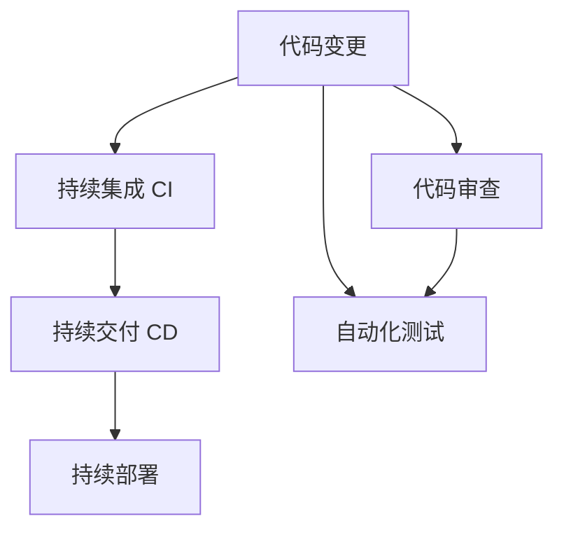
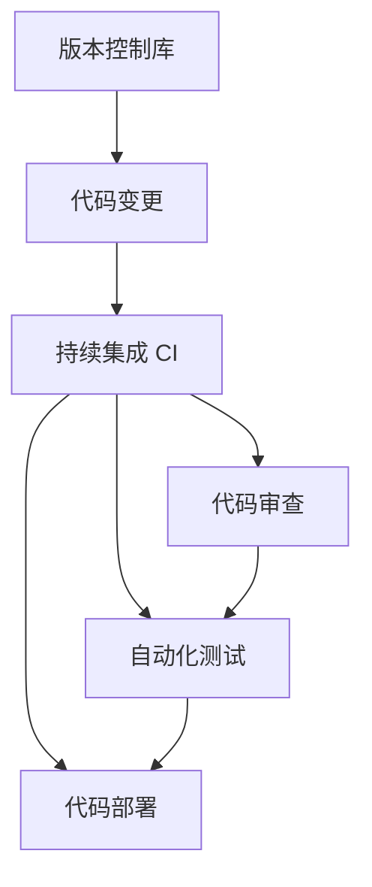

                 

# GitLab CI/CD流程配置

> 关键词：GitLab, CI/CD, DevOps, 自动化, 持续集成, 持续交付

## 1. 背景介绍

在现代软件开发过程中，**DevOps**（即开发与运维）理念已经成为了软件工程的重要组成部分。它通过整合开发、测试、部署等流程，提升软件交付的效率和质量。**CI/CD**（持续集成与持续交付）作为DevOps的核心实践，已经成为软件开发的标准流程。

**GitLab** 作为一个领先的**DevOps平台**，集成了**CI/CD**工具链，提供了从代码管理、代码审查、自动化构建、测试到部署的全面解决方案，支持多种编程语言、容器化技术及云环境。通过本文，我们将介绍如何在**GitLab**中配置和部署**CI/CD**流程，帮助你高效构建和部署软件项目。

## 2. 核心概念与联系

### 2.1 核心概念概述

在进行**CI/CD**配置前，我们需要先了解几个关键概念：

- **持续集成**（Continuous Integration, CI）：指开发人员频繁提交代码到版本库，由自动化构建系统集成并验证代码变更，确保代码质量。
- **持续交付**（Continuous Delivery, CD）：在CI基础上，自动化将经过测试的代码发布到生产环境，实现快速交付。
- **持续部署**（Continuous Deployment）：在CD基础上，自动将代码部署到生产环境，无需人工干预。
- **DevOps**：开发与运维的结合，通过自动化工具和最佳实践，提升软件交付效率和质量。

这些概念之间的关系通过以下**Mermaid**流程图表示：



此图展示了从代码变更到持续部署的全流程。开发人员将代码变更提交到版本库后，首先进入**持续集成**环节，通过自动化构建系统验证代码。如果构建成功，代码进入**持续交付**环节，自动进行测试并准备部署。最后，如果测试通过，代码被自动部署到生产环境。

### 2.2 核心概念原理和架构的 Mermaid 流程图

以下是**CI/CD**流程的详细架构图，展示了各个环节之间的联系：



- **版本控制库**：如Git，管理代码变更。
- **代码变更**：开发人员提交代码变更到版本库。
- **持续集成 CI**：自动化构建和测试系统，对代码变更进行验证。
- **代码审查**：开发人员或代码审查工具对代码进行审查，保证代码质量。
- **自动化测试**：单元测试、集成测试、端到端测试等，确保代码稳定性和可靠性。
- **代码部署**：将通过测试的代码发布到生产环境。

这些组件通过**GitLab CI/CD**工具链，协同工作，实现高效的软件交付流程。

## 3. 核心算法原理 & 具体操作步骤

### 3.1 算法原理概述

**GitLab CI/CD**的核心原理是通过**YAML**配置文件，自动化执行构建、测试和部署任务。每个任务（**Job**）定义了一系列的**Artifacts**和**Services**，如执行命令、使用Docker镜像、构建和部署代码等。通过这些任务的组合，实现从代码提交到生产的完整流程。

### 3.2 算法步骤详解

下面详细介绍如何在**GitLab**中配置**CI/CD**流程：

**Step 1: 创建项目并初始化**
1. 在**GitLab**中创建一个新项目，例如`example-project`。
2. 进入项目设置，点击`CI/CD`配置。

**Step 2: 配置.gitlab-ci.yml文件**
在项目根目录下创建一个`.gitlab-ci.yml`文件，用于定义**CI/CD**流程。例如：

```yaml
stages:
  - build
  - test
  - deploy

build:
  stage: build
  script: 
    - echo "Start building..."
    - echo "The current git branch is $(GIT_BRANCH)."
    - echo "This job is triggered manually."
  artifacts:
    paths: |
      - docs
      - build/**

test:
  stage: test
  script:
    - echo "Start testing..."
    - echo "The current git branch is $(GIT_BRANCH)."
    - echo "This job is triggered manually."
  artifacts:
    paths: |
      - test-reports
  only:
    - master
  needs:
    - build

deploy:
  stage: deploy
  script:
    - echo "Start deploying..."
    - echo "The current git branch is $(GIT_BRANCH)."
    - echo "This job is triggered manually."
  artifacts:
    paths: |
      - dist
  only:
    - master
  needs:
    - test
```

该配置文件定义了三个**Stage**：`build`、`test`和`deploy`，分别代表构建、测试和部署环节。每个**Stage**下定义了一个**Job**，包含执行命令、生成Artifacts、设置触发条件等。例如，`build`阶段的`build`任务，会执行构建命令，并将生成的文档和构建结果存入Artifacts中。

**Step 3: 配置变量**
在项目设置中，点击`Variables`，定义项目范围内的变量，例如：

```yaml
production_host: example.com
production_port: 80
```

这些变量可以在**CI/CD**流程中使用，如在`deploy`任务的脚本中：

```yaml
deploy:
  stage: deploy
  script:
    - echo "Start deploying..."
    - echo "The current git branch is $(GIT_BRANCH)."
    - echo "This job is triggered manually."
    - echo "Deploy to production: $production_host:$production_port"
  artifacts:
    paths: |
      - dist
  only:
    - master
  needs:
    - test
  variables:
    production_host: example.com
    production_port: 80
```

**Step 4: 触发CI/CD流程**
- **手动触发**：在项目设置中，点击`Manual pipeline`，手动启动CI/CD流程。
- **自动化触发**：配置触发器（如代码变更、分支等），自动启动CI/CD流程。

### 3.3 算法优缺点

**优点**：
1. **自动化和规范化**：通过**YAML**配置文件定义流程，减少人为操作，提高流程的稳定性和可维护性。
2. **快速迭代**：自动化构建和测试，快速验证代码变更，缩短交付周期。
3. **灵活性**：可以根据项目需求，灵活配置任务和流程。
4. **跨平台支持**：支持多种编程语言和平台，如Linux、Windows、Mac等。

**缺点**：
1. **配置复杂**：对于复杂的项目，配置文件可能比较冗长，需要较高的配置技能。
2. **资源消耗**：自动化流程可能会消耗更多计算资源，特别是在构建和测试环节。
3. **依赖关系**：任务之间存在依赖关系，必须按照定义顺序执行，否则可能导致错误。

### 3.4 算法应用领域

**GitLab CI/CD**广泛应用于各种软件开发场景，如：

- **Web应用开发**：使用自动化测试、静态代码分析等技术，提升Web应用的稳定性和安全性。
- **移动应用开发**：通过自动化测试和构建，快速验证移动应用的兼容性、性能等。
- **API服务开发**：使用自动化测试、负载测试等，确保API服务的稳定性和性能。
- **数据分析和处理**：通过自动化构建和部署，快速上线数据分析应用。
- **容器化部署**：支持Docker、Kubernetes等容器化技术，实现微服务的自动化部署。

## 4. 数学模型和公式 & 详细讲解 & 举例说明

### 4.1 数学模型构建

**GitLab CI/CD**的配置过程可以抽象为数学模型，如下所示：

- **输入**：代码变更、触发器、变量等。
- **输出**：构建结果、测试结果、部署结果等。
- **中间环节**：构建、测试、部署等任务。
- **目标**：快速、稳定地交付软件产品。

### 4.2 公式推导过程

通过数学模型，我们可以推导出**CI/CD**流程的基本逻辑：

1. **输入阶段**：
   - 代码变更：`$c$`。
   - 触发器：`$t$`。
   - 变量：`$v$`。

2. **任务执行阶段**：
   - 构建任务：`$b$`。
   - 测试任务：`$t$`。
   - 部署任务：`$d$`。

3. **输出阶段**：
   - 构建结果：`$r_b$`。
   - 测试结果：`$r_t$`。
   - 部署结果：`$r_d$`。

4. **目标函数**：
   - 快速交付：`$f(r_d)$`。
   - 稳定交付：`$s(r_d)$`。

通过上述公式，可以看出，**CI/CD**流程的目标是最大化快速交付和稳定交付的效果。这需要在任务执行阶段进行优化，如提高构建速度、减少测试时间、自动化部署等。

### 4.3 案例分析与讲解

以下是一个具体的案例分析：

**场景**：某电商网站需要快速迭代功能，要求每天多次发布新代码。

**分析**：
1. **输入**：
   - 代码变更：`$c$`，每天多次提交。
   - 触发器：`$t$`，每次代码提交自动触发构建。
   - 变量：`$v$`，如数据库配置、API接口等。

2. **任务执行阶段**：
   - 构建任务：`$b$`，每次提交后执行。
   - 测试任务：`$t$`，构建成功后执行。
   - 部署任务：`$d$`，测试通过后执行。

3. **输出阶段**：
   - 构建结果：`$r_b$`，每次提交后生成。
   - 测试结果：`$r_t$`，每次提交后生成。
   - 部署结果：`$r_d$`，每次提交后生成。

4. **目标函数**：
   - 快速交付：`$f(r_d)$`，每次提交后快速部署。
   - 稳定交付：`$s(r_d)$`，每次提交后稳定运行。

通过优化构建任务、测试任务和部署任务，可以提升整体交付效率和稳定性。例如，使用分布式构建、异步测试、蓝绿部署等技术，实现高效和稳定的交付。

## 5. 项目实践：代码实例和详细解释说明

### 5.1 开发环境搭建

在项目配置**CI/CD**流程前，需要先搭建好开发环境。以下是一个典型的**DevOps**环境搭建步骤：

1. **版本控制**：使用**Git**作为版本控制工具，设置远程仓库。
2. **代码审查**：使用**GitLab**作为代码审查工具，设置代码审查流程。
3. **持续集成**：使用**GitLab CI/CD**，配置自动化构建和测试流程。
4. **持续部署**：使用**GitLab Pipelines**，配置自动化部署流程。
5. **监控告警**：使用**Prometheus**、**Grafana**等工具，监控系统指标和告警。

### 5.2 源代码详细实现

以下是使用**GitLab CI/CD**配置一个简单的**Web应用**项目的代码实现：

**.gitlab-ci.yml配置文件**：

```yaml
stages:
  - build
  - test
  - deploy

build:
  stage: build
  script:
    - echo "Start building..."
    - echo "The current git branch is $(GIT_BRANCH)."
    - echo "This job is triggered manually."
    - echo "Using Python 3.8."
    - echo "Building..."
    - echo "Installing dependencies..."
    - pip install -r requirements.txt
    - echo "Building project..."
    - python manage.py runserver 0.0.0.0:8000
  artifacts:
    paths: |
      - docs
      - build/**

test:
  stage: test
  script:
    - echo "Start testing..."
    - echo "The current git branch is $(GIT_BRANCH)."
    - echo "This job is triggered manually."
    - echo "Running tests..."
    - python manage.py test
  artifacts:
    paths: |
      - test-reports
  only:
    - master
  needs:
    - build

deploy:
  stage: deploy
  script:
    - echo "Start deploying..."
    - echo "The current git branch is $(GIT_BRANCH)."
    - echo "This job is triggered manually."
    - echo "Deploy to production: $production_host:$production_port"
    - echo "Starting deployment..."
    - python manage.py runserver 0.0.0.0:$production_port
  artifacts:
    paths: |
      - dist
  only:
    - master
  needs:
    - test
  variables:
    production_host: example.com
    production_port: 80
```

**变量配置**：

- `production_host: example.com`
- `production_port: 80`

**运行流程**：
1. 提交代码变更到版本库。
2. 触发构建任务，执行构建命令。
3. 构建成功后，触发测试任务，执行测试命令。
4. 测试通过后，触发部署任务，执行部署命令。

### 5.3 代码解读与分析

**构建任务**：
- 使用Python 3.8。
- 安装依赖包`requirements.txt`。
- 构建项目，并启动服务器。

**测试任务**：
- 运行测试命令，确保项目稳定。

**部署任务**：
- 启动生产环境服务器，确保项目上线。

通过上述配置，实现从代码提交到生产的完整流程。

### 5.4 运行结果展示

以下是**CI/CD**流程的执行结果展示：

**构建结果**：
- 生成文档和构建结果，用于测试和部署。

**测试结果**：
- 执行测试命令，生成测试报告。

**部署结果**：
- 启动生产环境服务器，完成部署。

**监控结果**：
- 通过**Prometheus**、**Grafana**等工具，实时监控系统指标和告警。

## 6. 实际应用场景

### 6.1 电商网站开发

在电商网站开发中，**CI/CD**流程可以提升代码交付的速度和稳定性。具体实现包括：

- **持续集成**：每次代码变更自动触发构建，快速验证代码。
- **持续交付**：自动化测试和部署，提升交付速度。
- **自动化测试**：使用单元测试、集成测试等，确保代码质量。
- **自动化部署**：使用蓝绿部署、滚动发布等，保障服务稳定性。

**实践**：某电商网站通过配置**CI/CD**流程，实现每天多次发布新功能，提升用户体验和销售量。

### 6.2 金融系统开发

在金融系统开发中，**CI/CD**流程可以保障系统的稳定性和安全性。具体实现包括：

- **持续集成**：自动化构建和测试，快速发现和修复bug。
- **持续交付**：自动化部署和监控，保障系统稳定。
- **代码审查**：使用**GitLab**进行代码审查，确保代码质量。
- **安全扫描**：使用**SonarQube**进行安全扫描，发现潜在风险。

**实践**：某金融公司通过配置**CI/CD**流程，实现快速交付新功能，提升客户满意度。

### 6.3 大数据处理

在大数据处理中，**CI/CD**流程可以提升数据处理的效率和质量。具体实现包括：

- **持续集成**：自动化构建和测试，快速验证代码变更。
- **持续交付**：自动化部署和监控，保障数据处理稳定。
- **代码审查**：使用**GitLab**进行代码审查，确保数据处理质量。
- **数据质量检查**：使用**DataRobot**进行数据质量检查，发现和修复数据问题。

**实践**：某大数据处理公司通过配置**CI/CD**流程，实现快速交付新数据处理流程，提升数据质量和服务效率。

### 6.4 未来应用展望

随着**DevOps**理念的普及，**CI/CD**流程将在更多场景中得到应用，为各行各业带来变革性影响：

- **持续集成**：实现快速、频繁的代码变更验证，提升开发效率。
- **持续交付**：实现快速、稳定的软件交付，提升用户体验。
- **自动化测试**：确保代码质量，提升软件可靠性。
- **自动化部署**：确保服务稳定，提升运营效率。

**展望**：未来，**CI/CD**流程将与其他**DevOps**技术进行更深度的融合，如容器化、自动化运维等，实现更高效、更安全的软件交付流程。

## 7. 工具和资源推荐

### 7.1 学习资源推荐

为帮助开发者系统掌握**GitLab CI/CD**的理论基础和实践技巧，以下推荐一些优质的学习资源：

1. **GitLab官方文档**：详细介绍了**GitLab CI/CD**的配置和使用，提供了丰富的样例和最佳实践。
2. **《GitLab DevOps实践指南》**：由**GitLab**官方出版的书籍，涵盖**DevOps**理念和**CI/CD**流程的全面介绍。
3. **《DevOps实践指南》**：经典的**DevOps**书籍，涵盖**DevOps**理念和实践的详细介绍。
4. **《CI/CD最佳实践》**：详细介绍了**CI/CD**流程的最佳实践和工具选择。

通过这些资源的学习实践，相信你一定能够快速掌握**GitLab CI/CD**的精髓，并用于解决实际的**DevOps**问题。

### 7.2 开发工具推荐

高效的开发离不开优秀的工具支持。以下是几款用于**GitLab CI/CD**开发的常用工具：

1. **Docker**：容器化技术，实现跨平台、跨环境的构建和部署。
2. **Jenkins**：开源的持续集成和持续部署工具，支持多种插件和扩展。
3. **Jenkins Pipeline**：使用**YAML**配置文件，实现自动化构建和测试。
4. **Ansible**：自动化运维工具，支持脚本自动化和配置管理。
5. **Kubernetes**：容器编排工具，实现大规模、高可用性的部署。

合理利用这些工具，可以显著提升**GitLab CI/CD**的开发效率，加快创新迭代的步伐。

### 7.3 相关论文推荐

**GitLab CI/CD**的研究方向和发展动态主要体现在以下论文中，推荐阅读：

1. **"Continuous Integration and Delivery: An overview"**：由**Lynne Hussain**等撰写的综述论文，详细介绍了**CI/CD**流程的原理和应用。
2. **"DevOps Practices in the Software Development Process"**：由**Vladimir Ulyanov**等撰写的论文，探讨了**DevOps**实践对软件开发流程的影响。
3. **"CI/CD Pipelines: Designing for Deployability"**：由**Mark Logsdon**等撰写的论文，介绍了**CI/CD**流程的设计和实现。

这些论文代表了**CI/CD**技术的研究前沿，可以帮助研究者把握学科发展方向，激发更多的创新灵感。

## 8. 总结：未来发展趋势与挑战

### 8.1 研究成果总结

通过本文的系统梳理，我们可以看到**GitLab CI/CD**作为**DevOps**核心实践，已经广泛应用于软件开发、金融、大数据等多个领域。它通过自动化构建、测试和部署，提升软件交付的效率和质量，成为现代软件开发不可或缺的一部分。

### 8.2 未来发展趋势

展望未来，**GitLab CI/CD**将呈现以下几个发展趋势：

1. **全栈自动化**：实现从代码变更到生产部署的全流程自动化，涵盖开发、测试、部署、运维等环节。
2. **云原生集成**：与云原生技术深度融合，实现容器化、微服务、函数即服务（FaaS）等技术的无缝集成。
3. **持续安全**：在交付过程中加入安全检查，如代码审计、漏洞扫描、数据加密等，确保软件安全性。
4. **多语言支持**：支持多种编程语言和平台，实现跨语言、跨平台的自动化构建和部署。
5. **人工智能集成**：引入机器学习、自然语言处理等技术，提升自动化流程的智能化水平。

这些趋势将推动**GitLab CI/CD**向更加全面、高效、安全的方向发展，进一步提升软件开发和运维的效率和质量。

### 8.3 面临的挑战

尽管**GitLab CI/CD**已经取得了显著成效，但在迈向更加智能化、普适化应用的过程中，它仍面临以下挑战：

1. **配置复杂**：对于复杂项目，配置文件可能过于冗长，需要较高的配置技能。
2. **资源消耗**：自动化流程可能会消耗更多计算资源，特别是在构建和测试环节。
3. **依赖关系**：任务之间存在依赖关系，必须按照定义顺序执行，否则可能导致错误。
4. **集成难度**：与其他工具和平台集成，如Docker、Kubernetes等，需要复杂配置和调试。
5. **安全性**：自动化交付过程中，存在一定的安全隐患，如代码注入、数据泄露等。

### 8.4 研究展望

面对这些挑战，未来的研究需要在以下几个方面寻求新的突破：

1. **配置自动化**：通过工具和插件，简化配置过程，提高配置效率。
2. **资源优化**：优化构建和测试任务，减少资源消耗，提升交付速度。
3. **依赖管理**：设计灵活的任务依赖关系，确保任务执行的稳定性和正确性。
4. **安全加固**：引入安全检查和防护措施，提升交付安全性。
5. **跨平台集成**：设计通用的接口和协议，实现与其他工具和平台的无缝集成。

这些研究方向的探索，将推动**GitLab CI/CD**技术迈向更高的台阶，为构建高效、安全、智能的软件交付流程提供有力支持。

## 9. 附录：常见问题与解答

**Q1: GitLab CI/CD与Jenkins Pipeline有何区别？**

A: **GitLab CI/CD**与**Jenkins Pipeline**都是自动化构建和交付工具，但有以下区别：
1. **配置方式**：**GitLab CI/CD**使用**YAML**配置文件，而**Jenkins Pipeline**使用脚本语言。
2. **集成方式**：**GitLab CI/CD**与GitLab紧密集成，提供代码变更、代码审查等功能，而**Jenkins Pipeline**需要自行配置。
3. **部署方式**：**GitLab CI/CD**支持自动化部署到Kubernetes等云平台，而**Jenkins Pipeline**需要自行集成部署工具。
4. **扩展性**：**GitLab CI/CD**具有更强的扩展性和灵活性，支持插件和集成，而**Jenkins Pipeline**的扩展性受限于Jenkins本身。

**Q2: 如何在GitLab中配置变量？**

A: 在GitLab项目设置中，点击`Variables`，定义项目范围内的变量。例如：
- `production_host: example.com`
- `production_port: 80`

这些变量可以在**CI/CD**流程中使用，如在部署任务中：

```yaml
deploy:
  stage: deploy
  script:
    - echo "Start deploying..."
    - echo "The current git branch is $(GIT_BRANCH)."
    - echo "This job is triggered manually."
    - echo "Deploy to production: $production_host:$production_port"
  artifacts:
    paths: |
      - dist
  only:
    - master
  needs:
    - test
  variables:
    production_host: example.com
    production_port: 80
```

**Q3: 什么是Docker？它与CI/CD有何关系？**

A: **Docker**是一种容器化技术，可以将应用程序及其依赖打包在一个独立的容器中，方便部署和移植。**CI/CD**流程中，Docker常用于构建和部署任务，实现跨平台、跨环境的自动化交付。例如：

```yaml
build:
  stage: build
  script:
    - echo "Start building..."
    - echo "The current git branch is $(GIT_BRANCH)."
    - echo "This job is triggered manually."
    - echo "Using Python 3.8."
    - echo "Building..."
    - echo "Installing dependencies..."
    - docker run -it python:3.8 pip install -r requirements.txt
    - echo "Building project..."
    - docker run -it python:3.8 python manage.py runserver 0.0.0.0:8000
  artifacts:
    paths: |
      - docs
      - build/**

test:
  stage: test
  script:
    - echo "Start testing..."
    - echo "The current git branch is $(GIT_BRANCH)."
    - echo "This job is triggered manually."
    - echo "Running tests..."
    - docker run -it python:3.8 python manage.py test
  artifacts:
    paths: |
      - test-reports
  only:
    - master
  needs:
    - build

deploy:
  stage: deploy
  script:
    - echo "Start deploying..."
    - echo "The current git branch is $(GIT_BRANCH)."
    - echo "This job is triggered manually."
    - echo "Deploy to production: $production_host:$production_port"
    - echo "Starting deployment..."
    - docker run -d -p $production_port:80 -v /path/to/local:/app -w /app python:3.8 python manage.py runserver 0.0.0.0:$production_port
  artifacts:
    paths: |
      - dist
  only:
    - master
  needs:
    - test
  variables:
    production_host: example.com
    production_port: 80
```

通过Docker，可以将构建和测试任务封装在一个独立的容器中，实现快速、可靠的交付。

**Q4: 什么是Kubernetes？它与CI/CD有何关系？**

A: **Kubernetes**是一种容器编排工具，可以管理大规模、高可用性的容器化应用。**CI/CD**流程中，Kubernetes常用于自动化部署和扩展任务，实现微服务和函数即服务（FaaS）等场景。例如：

```yaml
deploy:
  stage: deploy
  script:
    - echo "Start deploying..."
    - echo "The current git branch is $(GIT_BRANCH)."
    - echo "This job is triggered manually."
    - echo "Deploy to production: $production_host:$production_port"
    - echo "Starting deployment..."
    - kubectl apply -f deployment.yaml
  artifacts:
    paths: |
      - dist
  only:
    - master
  needs:
    - test
  variables:
    production_host: example.com
    production_port: 80
```

通过Kubernetes，可以实现自动化部署和扩展，确保应用的高可用性和稳定性。

**Q5: 什么是SonarQube？它与CI/CD有何关系？**

A: **SonarQube**是一种代码质量管理工具，可以自动检测代码中的缺陷、漏洞、安全问题等。**CI/CD**流程中，SonarQube常用于自动化代码审计和质量检查，提升代码质量和安全性。例如：

```yaml
test:
  stage: test
  script:
    - echo "Start testing..."
    - echo "The current git branch is $(GIT_BRANCH)."
    - echo "This job is triggered manually."
    - echo "Running tests..."
    - echo "Running SonarQube analysis..."
    - echo "Generating test report..."
    - sonar-runner report
  artifacts:
    paths: |
      - test-reports
  only:
    - master
  needs:
    - build

deploy:
  stage: deploy
  script:
    - echo "Start deploying..."
    - echo "The current git branch is $(GIT_BRANCH)."
    - echo "This job is triggered manually."
    - echo "Deploy to production: $production_host:$production_port"
    - echo "Starting deployment..."
    - kubectl apply -f deployment.yaml
  artifacts:
    paths: |
      - dist
  only:
    - master
  needs:
    - test
  variables:
    production_host: example.com
    production_port: 80
```

通过SonarQube，可以自动化检测代码中的潜在问题，提升代码质量和安全性。

---

作者：禅与计算机程序设计艺术 / Zen and the Art of Computer Programming

