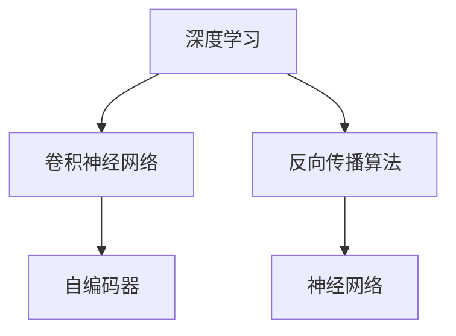

                 

## 1. 背景介绍

在人工智能发展的历史长河中，有许多伟大的学者和工程师为这个领域的发展做出了不可磨灭的贡献。其中，Yann LeCun、Geoffrey Hinton 和 Yoshua Bengio 三位被广泛认为是深度学习（包括神经网络、卷积神经网络等）的奠基者，他们的工作为人工智能领域的算法和技术发展奠定了坚实的基础。本文将详细介绍他们的核心贡献，并探讨这些贡献对人工智能和深度学习领域的深远影响。

## 2. 核心概念与联系

### 2.1 核心概念概述

为了更好地理解三位奠基者的贡献，我们先简要介绍一些核心概念：

- **深度学习**（Deep Learning）：一种通过多个层次的神经网络模型进行复杂模式识别和学习的技术。
- **卷积神经网络**（Convolutional Neural Networks, CNNs）：一种专门用于图像识别和处理的技术，通过卷积和池化等操作提取特征。
- **反向传播算法**（Backpropagation）：深度学习模型的训练核心算法，用于计算模型参数的梯度，以便通过梯度下降进行参数更新。
- **自编码器**（Autoencoder）：一种无监督学习方法，用于学习数据的低维表示，广泛应用于特征提取和数据压缩。
- **神经网络**（Neural Network）：基于神经元和神经连接构建的计算模型，通过模拟人脑的神经网络结构实现复杂任务。

### 2.2 核心概念原理和架构的 Mermaid 流程图



## 3. 核心算法原理 & 具体操作步骤

### 3.1 算法原理概述

三位奠基者的核心贡献主要集中在以下几个方面：

1. **反向传播算法**：通过反向传播算法，他们开发了一种高效的模型训练方法，可以处理具有大量参数的深度神经网络，使得深度学习模型能够用于大规模、复杂的模式识别和预测任务。
2. **卷积神经网络**：卷积神经网络在图像识别、语音识别等领域取得了显著的突破，成为了图像处理和计算机视觉领域的标准模型。
3. **自编码器**：自编码器在无监督学习领域具有重要应用，用于数据降维、特征提取等任务，为后续深度学习模型的发展提供了重要的理论基础。
4. **神经网络架构**：他们提出了多层感知器（Multilayer Perceptron, MLP）等经典神经网络架构，为深度学习的发展奠定了基础。

### 3.2 算法步骤详解

#### 3.2.1 反向传播算法

反向传播算法是深度学习模型训练的核心，通过反向传播计算梯度，更新模型参数，实现模型优化。以下是一个简单的反向传播过程：

1. **前向传播**：将输入数据输入模型，计算中间层输出。
2. **计算损失函数**：将中间层输出与目标输出计算损失函数。
3. **反向传播梯度**：从输出层开始，逐层计算各层梯度，并传递到输入层。
4. **更新参数**：使用梯度下降等优化算法更新模型参数。

#### 3.2.2 卷积神经网络

卷积神经网络是一种专门用于图像和信号处理的深度学习模型，其核心在于卷积和池化操作，用于提取和压缩特征。以下是一个简单的卷积神经网络结构：

1. **卷积层**：通过卷积操作提取特征，使用多个卷积核提取不同尺度的特征。
2. **池化层**：通过池化操作压缩特征，减少参数量，降低计算复杂度。
3. **全连接层**：将池化层的输出连接到一个或多个全连接层，进行分类或回归预测。
4. **激活函数**：在每一层使用激活函数，如ReLU，非线性变换特征。

#### 3.2.3 自编码器

自编码器是一种无监督学习方法，用于学习数据的低维表示，通过编码器将输入数据压缩到低维空间，再通过解码器重构回原数据。以下是一个简单的自编码器结构：

1. **编码器**：将输入数据压缩到低维空间。
2. **解码器**：将低维空间的数据重构回原数据。
3. **损失函数**：使用重构误差作为损失函数，训练模型。

### 3.3 算法优缺点

#### 3.3.1 反向传播算法

**优点**：
1. 高效处理大规模数据集。
2. 易于并行化，适合大规模分布式计算。

**缺点**：
1. 梯度消失或爆炸问题。
2. 对于某些复杂问题，训练过程可能非常缓慢。

#### 3.3.2 卷积神经网络

**优点**：
1. 适用于高维数据，如图像和视频。
2. 具有平移不变性，可以处理图像中的局部特征。

**缺点**：
1. 参数量较大，计算复杂度高。
2. 对于某些任务，可能过拟合。

#### 3.3.3 自编码器

**优点**：
1. 无监督学习方法，不需要大量标注数据。
2. 可用于特征提取，数据降维。

**缺点**：
1. 训练过程可能不稳定，需要精心调参。
2. 对于某些任务，可能无法获得有效的低维表示。

### 3.4 算法应用领域

#### 3.4.1 深度学习

反向传播算法和卷积神经网络是深度学习的核心，广泛应用于图像识别、语音识别、自然语言处理等领域。

#### 3.4.2 计算机视觉

卷积神经网络在计算机视觉领域取得了显著突破，广泛应用于物体检测、人脸识别、图像分割等任务。

#### 3.4.3 自然语言处理

自编码器和神经网络在自然语言处理中也有广泛应用，如文本分类、机器翻译、情感分析等任务。

## 4. 数学模型和公式 & 详细讲解

### 4.1 数学模型构建

深度学习模型的数学模型构建主要包括以下几个步骤：

1. **输入层**：输入数据，可以是向量、图像、文本等。
2. **隐藏层**：多个神经网络层，进行特征提取和变换。
3. **输出层**：最终输出结果，可以是分类、回归、序列预测等。

### 4.2 公式推导过程

以反向传播算法为例，其核心公式为：

$$
\frac{\partial L}{\partial W} = \frac{\partial L}{\partial \hat{Y}} \frac{\partial \hat{Y}}{\partial Z} \frac{\partial Z}{\partial W}
$$

其中 $W$ 为模型参数，$L$ 为损失函数，$\hat{Y}$ 为模型输出，$Z$ 为模型输入经过变换后的结果。

### 4.3 案例分析与讲解

以卷积神经网络为例，其核心公式为：

$$
h = f(w * x + b)
$$

其中 $h$ 为输出特征，$f$ 为激活函数，$w$ 为卷积核，$x$ 为输入数据，$b$ 为偏置项。

## 5. 项目实践：代码实例和详细解释说明

### 5.1 开发环境搭建

以下是在Python中使用TensorFlow搭建卷积神经网络的步骤：

1. 安装TensorFlow：
   ```bash
   pip install tensorflow
   ```

2. 导入TensorFlow和NumPy库：
   ```python
   import tensorflow as tf
   import numpy as np
   ```

### 5.2 源代码详细实现

以下是一个简单的卷积神经网络的实现：

```python
import tensorflow as tf
import numpy as np

# 定义模型
class ConvNet(tf.keras.Model):
    def __init__(self):
        super(ConvNet, self).__init__()
        self.conv1 = tf.keras.layers.Conv2D(32, 3, activation='relu')
        self.pool1 = tf.keras.layers.MaxPooling2D()
        self.conv2 = tf.keras.layers.Conv2D(64, 3, activation='relu')
        self.pool2 = tf.keras.layers.MaxPooling2D()
        self.flatten = tf.keras.layers.Flatten()
        self.dense1 = tf.keras.layers.Dense(64, activation='relu')
        self.dense2 = tf.keras.layers.Dense(10, activation='softmax')

    def call(self, x):
        x = self.conv1(x)
        x = self.pool1(x)
        x = self.conv2(x)
        x = self.pool2(x)
        x = self.flatten(x)
        x = self.dense1(x)
        return self.dense2(x)

# 加载数据
(x_train, y_train), (x_test, y_test) = tf.keras.datasets.mnist.load_data()
x_train = x_train.reshape(-1, 28, 28, 1) / 255.0
x_test = x_test.reshape(-1, 28, 28, 1) / 255.0

# 创建模型实例
model = ConvNet()

# 编译模型
model.compile(optimizer=tf.keras.optimizers.Adam(0.001),
              loss=tf.keras.losses.SparseCategoricalCrossentropy(from_logits=True),
              metrics=['accuracy'])

# 训练模型
model.fit(x_train, y_train, epochs=10, validation_data=(x_test, y_test))
```

### 5.3 代码解读与分析

以上代码中，我们定义了一个简单的卷积神经网络模型，包含了两个卷积层、两个池化层、两个全连接层。模型使用Adam优化器进行优化，交叉熵损失函数作为损失函数，准确率作为评价指标。在训练过程中，我们使用了MNIST数据集，并进行了10个epoch的训练。

## 6. 实际应用场景

### 6.1 图像识别

卷积神经网络在图像识别领域取得了显著的突破，广泛应用于物体检测、人脸识别等任务。

### 6.2 自然语言处理

自编码器和神经网络在自然语言处理中也有广泛应用，如文本分类、机器翻译、情感分析等任务。

### 6.3 语音识别

卷积神经网络在语音识别领域也取得了重要进展，广泛应用于语音识别、语音合成等任务。

## 7. 工具和资源推荐

### 7.1 学习资源推荐

为了帮助读者系统掌握深度学习的理论基础和实践技巧，这里推荐一些优质的学习资源：

1. 《深度学习》（Deep Learning）：Ian Goodfellow等所著，全面介绍了深度学习的原理和应用。
2. Coursera《深度学习专项课程》：由深度学习领域的专家Andrew Ng教授主讲，系统讲解深度学习的核心算法和应用。
3. PyTorch官方文档：提供了详细的API文档和代码示例，方便开发者快速上手深度学习开发。
4. TensorFlow官方文档：提供了丰富的API文档和教程，帮助开发者掌握TensorFlow的深度学习开发。

### 7.2 开发工具推荐

为了提高深度学习的开发效率，以下是几款推荐的开发工具：

1. PyTorch：基于Python的开源深度学习框架，支持动态计算图，适合快速迭代研究。
2. TensorFlow：由Google主导开发的深度学习框架，支持静态计算图和动态计算图，适合大规模工程应用。
3. Keras：基于Python的高级深度学习API，简单易用，适合快速构建模型。

### 7.3 相关论文推荐

为了深入理解深度学习领域的最新研究进展，以下是几篇经典论文的推荐：

1. "Learning Deep Architectures for AI"（Geoffrey Hinton）：提出多层感知器（MLP）和反向传播算法，奠定了深度学习的基础。
2. "Convolutional Networks for Images, Speech, and Time Series"（Yann LeCun）：提出卷积神经网络（CNN），应用于图像识别和语音识别。
3. "Auto-Encoding Variational Bayes"（Yoshua Bengio）：提出自编码器，用于无监督学习和数据降维。

## 8. 总结：未来发展趋势与挑战

### 8.1 研究成果总结

Yann LeCun、Geoffrey Hinton和Yoshua Bengio的研究成果奠定了深度学习的基础，推动了人工智能领域的发展。他们的工作不仅改变了深度学习的算法和架构，也为后续的研究提供了重要的理论基础。

### 8.2 未来发展趋势

未来的深度学习研究将朝着以下方向发展：

1. **模型效率提升**：通过更高效的模型结构和算法，提高模型的训练和推理效率，减少计算资源消耗。
2. **无监督学习**：通过无监督学习方法，减少对标注数据的依赖，降低数据获取成本。
3. **跨领域应用**：将深度学习应用于更多领域，如医疗、金融、交通等，推动人工智能的产业化进程。
4. **解释性增强**：增强深度学习模型的可解释性，提高算法的透明度和可信度。
5. **伦理和社会影响**：研究深度学习的伦理和社会影响，确保其发展符合人类价值观和社会规范。

### 8.3 面临的挑战

尽管深度学习已经取得了巨大成功，但在向更广泛领域应用的过程中，仍面临诸多挑战：

1. **数据获取和标注**：大规模数据集的获取和标注成本高，需要更多的自动化和半自动化方法。
2. **模型可解释性**：深度学习模型通常被视为“黑盒”，缺乏可解释性，需要更多研究提高其透明度。
3. **过拟合和泛化能力**：深度学习模型在特定数据集上表现出色，但泛化能力不足，需要更多研究提高模型的鲁棒性。
4. **伦理和社会问题**：深度学习模型可能带来隐私和伦理问题，需要更多的规范和监管。

### 8.4 研究展望

未来的研究需要在以下方向进行更多的探索：

1. **多模态学习**：将深度学习应用于多模态数据，如图像、语音、文本等，提高模型的综合能力。
2. **因果推理**：引入因果推理机制，提高模型的因果关系理解能力，提高模型的可信度和可靠性。
3. **跨领域迁移学习**：研究如何使深度学习模型跨领域迁移，提高模型的泛化能力和应用范围。
4. **深度学习与其他技术的融合**：将深度学习与其他技术（如强化学习、自然语言处理等）进行融合，推动人工智能技术的发展。

总之，Yann LeCun、Geoffrey Hinton和Yoshua Bengio的研究成果为深度学习的发展奠定了基础，推动了人工智能领域的发展。未来，深度学习研究仍需不断探索和创新，以应对更多挑战，推动人工智能技术向更广泛领域的应用。

## 9. 附录：常见问题与解答

**Q1: 深度学习模型的训练和优化有哪些常用方法？**

A: 深度学习模型的训练和优化方法包括：

1. 梯度下降法：常用的优化算法，包括批量梯度下降、随机梯度下降、小批量梯度下降等。
2. 动量优化法：通过引入动量项，加速梯度下降。
3. 自适应优化法：如Adam、Adagrad、RMSprop等，根据梯度变化自适应调整学习率。
4. 权重衰减：通过添加正则化项，防止过拟合。
5. 批量归一化：在每一层对输入进行归一化，提高模型的稳定性和收敛速度。

**Q2: 深度学习模型的应用领域有哪些？**

A: 深度学习模型的应用领域非常广泛，包括但不限于：

1. 图像识别和计算机视觉：如图像分类、物体检测、人脸识别等。
2. 自然语言处理：如机器翻译、文本分类、情感分析等。
3. 语音识别和处理：如语音识别、语音合成等。
4. 推荐系统：如电商推荐、新闻推荐等。
5. 医疗诊断：如医学影像分析、疾病预测等。

**Q3: 深度学习模型在实际应用中需要注意哪些问题？**

A: 深度学习模型在实际应用中需要注意以下问题：

1. 数据质量和标注：数据质量和标注的准确性直接影响模型的性能。
2. 模型复杂度和计算资源：模型的复杂度和计算资源需要平衡，避免过拟合和资源浪费。
3. 模型解释性和可解释性：深度学习模型的解释性和可解释性对应用场景非常重要，需要考虑用户需求和隐私保护。
4. 模型的鲁棒性和泛化能力：模型的鲁棒性和泛化能力需要确保在实际应用中表现稳定，避免异常输入和攻击。

**Q4: 如何提升深度学习模型的性能？**

A: 提升深度学习模型的性能可以从以下几个方面入手：

1. 数据增强：通过数据增强方法，扩充训练集，提高模型的泛化能力。
2. 正则化：通过L1、L2正则化等方法，防止过拟合。
3. 模型架构优化：通过优化模型结构，提高模型的训练和推理效率。
4. 超参数调优：通过调整学习率、批次大小、优化算法等超参数，提升模型性能。
5. 集成学习：通过模型集成方法，提高模型的鲁棒性和泛化能力。

总之，Yann LeCun、Geoffrey Hinton和Yoshua Bengio的研究成果为深度学习的发展奠定了基础，推动了人工智能领域的发展。未来，深度学习研究仍需不断探索和创新，以应对更多挑战，推动人工智能技术向更广泛领域的应用。

作者：禅与计算机程序设计艺术 / Zen and the Art of Computer Programming

