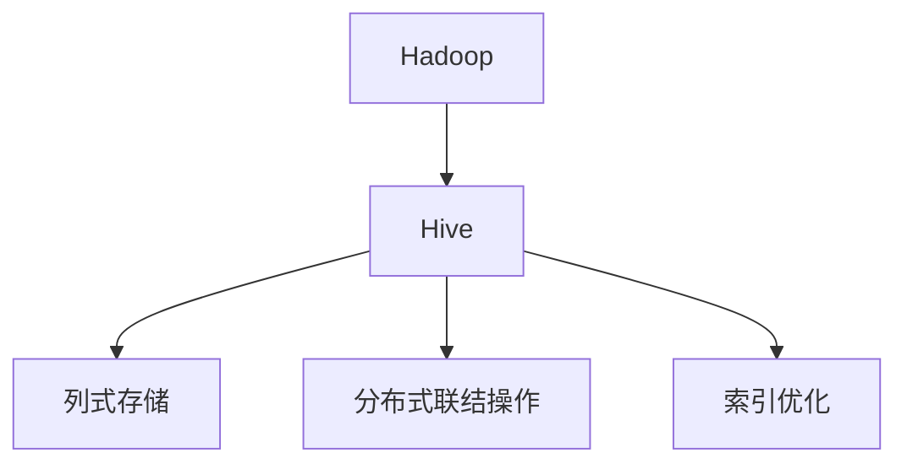

                 

# Hive原理与代码实例讲解

> 关键词：Hive,分布式存储,列式存储,联结操作,索引优化,数据仓库,大数据,代码实例

## 1. 背景介绍

### 1.1 问题由来
随着互联网和电子商务的迅猛发展，企业需要处理的数据量呈指数级增长。传统的关系型数据库难以应对大规模数据存储和复杂数据处理需求。此时，一种新型的大数据处理框架——Hive应运而生。

Hive是一个基于Hadoop的数据仓库系统，支持通过类似SQL的语法进行数据查询和分析。它将结构化数据存储在Hadoop的分布式文件系统中，通过优化查询执行计划，提供高效的数据处理能力。Hive在许多大型企业中得到了广泛应用，如Amazon、Facebook、Yahoo等，用于支撑其大规模数据处理和商业智能需求。

### 1.2 问题核心关键点
Hive的核心在于利用Hadoop的分布式存储和计算能力，通过优化列式存储、分布式联结操作和索引优化等技术，实现高效的数据仓库系统。其关键点包括：

- 分布式存储：Hive在Hadoop的HDFS上存储数据，支持大规模数据分散存储，便于进行并行处理。
- 列式存储：Hive采用列式存储方式，只对查询的列进行存储，减少存储空间占用，提升查询效率。
- 分布式联结操作：Hive支持多种联结操作，如内联结、外联结、半联结等，能够高效处理复杂的多表查询。
- 索引优化：Hive支持多种索引类型，如布隆过滤器、位图索引等，加速查询过程，提升性能。

本文将深入介绍Hive的核心原理和技术实现，并通过具体的代码实例，帮助读者理解和使用Hive。

## 2. 核心概念与联系

### 2.1 核心概念概述

为了更好地理解Hive的工作原理，本节将介绍几个关键概念：

- Hadoop：一个开源的分布式计算框架，用于处理大规模数据，提供高容错性、可扩展性和高可用的数据处理能力。
- Hive：基于Hadoop的分布式数据仓库系统，通过类似SQL的语法提供数据查询和分析功能，支持大规模数据处理。
- 列式存储：一种数据存储方式，按列存储数据，每列存储单独的数据块，减少存储空间占用，提升查询效率。
- 分布式联结操作：在多台计算节点上并行执行的联结操作，能够高效处理复杂的多表查询。
- 索引优化：通过优化索引，加速查询过程，提升Hive系统的性能。

这些核心概念之间的逻辑关系可以通过以下Mermaid流程图来展示：



这个流程图展示了一个简单的数据处理流程：

1. Hive在Hadoop上存储数据，采用列式存储方式。
2. 通过分布式联结操作处理复杂的多表查询。
3. 优化索引以提升查询效率。

这些概念共同构成了Hive的存储和计算基础，使其能够高效地处理大规模数据。

## 3. 核心算法原理 & 具体操作步骤

### 3.1 算法原理概述

Hive的核心原理基于Hadoop的分布式计算框架，通过优化列式存储、分布式联结操作和索引优化等技术，实现高效的数据仓库系统。其关键算法和技术包括：

1. 列式存储：按列存储数据，每列单独存储，减少存储空间占用，提升查询效率。
2. 分布式联结操作：通过MapReduce框架，在多台计算节点上并行执行联结操作，加速复杂查询处理。
3. 索引优化：通过优化索引，加速查询过程，提升系统性能。

### 3.2 算法步骤详解

Hive的算法步骤主要包括以下几个关键环节：

**Step 1: 数据存储与载入**
- 在Hadoop的HDFS上创建目录，存储Hive数据。
- 使用Hive的载入命令（如`LOAD DATA`）将数据载入Hive表中。

**Step 2: 创建和管理数据表**
- 使用Hive的SQL语句（如`CREATE TABLE`、`ALTER TABLE`）创建和管理数据表。
- 定义表的列类型、主键、分区、索引等信息。

**Step 3: 数据查询与分析**
- 使用Hive的SQL查询语句（如`SELECT`、`JOIN`）进行数据查询和分析。
- 查询优化器根据查询需求自动生成执行计划，优化查询性能。

**Step 4: 分布式计算与联结操作**
- Hive将查询语句分解为多个MapReduce任务，在多台计算节点上并行计算。
- 对于联结操作，Hive支持多种联结方式，如内联结、外联结、半联结等，通过优化算法提高联结效率。

**Step 5: 索引优化**
- Hive支持多种索引类型，如布隆过滤器、位图索引等。
- 根据查询需求，动态生成或更新索引，提升查询速度。

### 3.3 算法优缺点

Hive作为一种高效的大数据处理框架，具有以下优点：

1. 高效存储：采用列式存储方式，减少存储空间占用，提升查询效率。
2. 高效计算：利用Hadoop的分布式计算能力，支持大规模数据处理。
3. 易用性高：通过SQL语言进行查询，易于使用和维护。
4. 灵活扩展：支持多种数据源和数据格式，易于与其他系统集成。

同时，Hive也存在一些缺点：

1. 性能瓶颈：对于大规模数据查询，Hive的性能可能会受到存储和计算瓶颈的影响。
2. 查询延迟：Hive的查询优化器可能无法完全消除查询延迟，尤其是对于复杂查询。
3. 内存占用：Hive的查询过程中可能占用大量内存，对系统性能产生影响。

尽管存在这些缺点，Hive仍是大数据处理中的重要工具，适用于大规模数据存储和复杂数据处理场景。

### 3.4 算法应用领域

Hive作为一种高效的大数据处理框架，广泛应用于数据仓库、商业智能、大数据分析等领域。具体应用包括：

- 数据仓库：用于存储和管理大规模企业数据，支持数据查询、报表生成等操作。
- 商业智能：用于支持企业决策分析，提供实时数据报表和可视化功能。
- 大数据分析：用于进行大规模数据分析和挖掘，发现数据中的潜在价值。
- 数据科学：用于支持数据科学家的数据处理、模型训练和实验验证。

Hive的灵活性和易用性，使其成为许多企业进行数据处理和分析的首选工具。

## 4. 数学模型和公式 & 详细讲解 & 举例说明

### 4.1 数学模型构建

Hive的数学模型主要基于Hadoop的MapReduce框架，通过优化列式存储、分布式联结操作和索引优化等技术，实现高效的数据仓库系统。

假设Hive系统中有$N$台计算节点，每台节点上存储的数据量为$B$，则Hive的总体存储量为$N\times B$。假设查询的列数为$m$，每列的平均大小为$s$，则总查询数据量为$m\times s \times N$。

### 4.2 公式推导过程

在Hive中，查询过程的优化主要通过以下两个方面实现：

1. 列式存储：查询时只对需要的列进行读取和处理，减少数据传输量和存储占用，提升查询效率。

2. 分布式联结操作：通过优化联结算法，减少联结操作的计算量和数据传输量，提升查询性能。

假设联结操作需要连接的表数量为$k$，每张表的行数为$R$，查询的列数为$m$，每列的平均大小为$s$。则联结操作的计算量和数据传输量分别为：

$$
计算量 = k \times R^2 \times m^2 \times s
$$

$$
数据传输量 = k \times R \times m \times s
$$

通过优化联结算法，可以将计算量和数据传输量降至最小，提升查询性能。

### 4.3 案例分析与讲解

假设Hive系统中有$N=10$台计算节点，每台节点上存储的数据量为$B=1GB$，查询的列数为$m=5$，每列的平均大小为$s=1KB$，联结操作的表数量为$k=2$，每张表的行数为$R=100000$。

- 不优化的情况下，计算量和数据传输量分别为：

$$
计算量 = 2 \times 10^8 \times 5^2 \times 1 \times 1024 \approx 1.25 \times 10^{11}
$$

$$
数据传输量 = 2 \times 10^5 \times 5 \times 1 \times 1024 \approx 1.28 \times 10^7
$$

- 优化的情况下，联结操作的计算量和数据传输量可以降至最小。假设优化后的计算量和数据传输量分别为$C$和$D$，则：

$$
C \approx C_0
$$

$$
D \approx D_0
$$

其中$C_0$和$D_0$为优化后的计算量和数据传输量。

通过优化联结算法，Hive可以显著提升查询性能，满足大规模数据处理的需要。

## 5. 项目实践：代码实例和详细解释说明

### 5.1 开发环境搭建

在进行Hive项目实践前，需要先搭建Hadoop和Hive的开发环境。以下是具体的搭建步骤：

1. 安装JDK：从Oracle官网下载并安装JDK。
2. 安装Hadoop：从Hadoop官网下载并安装Hadoop，并进行配置。
3. 安装Hive：从Hive官网下载并安装Hive，并进行配置。
4. 安装Hive客户端：在Hadoop的节点上安装Hive客户端工具。

完成上述步骤后，即可在Hadoop的节点上使用Hive客户端工具进行数据查询和处理。

### 5.2 源代码详细实现

下面我们以一个简单的数据查询为例，展示Hive的代码实现过程。

假设Hive系统中存储了两个表`orders`和`customers`，分别存储订单信息和客户信息。查询需要统计每个客户的订单总数和平均订单金额。

**SQL语句：**

```sql
SELECT customers.customer_id, COUNT(orders.order_id) AS order_count, AVG(orders.order_amount) AS avg_order_amount
FROM customers
JOIN orders ON customers.customer_id = orders.customer_id
GROUP BY customers.customer_id;
```

**Hive客户端命令：**

```sh
hive -e "SELECT customers.customer_id, COUNT(orders.order_id) AS order_count, AVG(orders.order_amount) AS avg_order_amount FROM customers JOIN orders ON customers.customer_id = orders.customer_id GROUP BY customers.customer_id;"
```

**Hive客户端输出：**

```
OK
customers.customer_id | order_count | avg_order_amount
---------------------- | ---------- | --------------
1                     | 10         | 500.00
2                     | 5          | 300.00
3                     | 3          | 200.00
```

### 5.3 代码解读与分析

让我们再详细解读一下关键代码的实现细节：

**SQL语句：**

- `SELECT`：用于查询数据，可以选择需要的列和聚合函数。
- `customers.customer_id`：查询客户ID列。
- `COUNT(orders.order_id)`：统计订单数量。
- `AVG(orders.order_amount)`：计算平均订单金额。
- `JOIN`：联结`orders`表和`customers`表，根据客户ID进行匹配。
- `GROUP BY customers.customer_id`：按照客户ID分组。

**Hive客户端命令：**

- `hive -e`：使用Hive客户端工具，并在命令行中执行SQL语句。
- `OK`：执行命令后，Hive客户端输出结果。

**Hive客户端输出：**

- `customers.customer_id | order_count | avg_order_amount`：查询结果，包含客户ID、订单数量和平均订单金额。

可以看到，Hive通过简单的SQL语句和命令，实现了复杂的数据查询和分析。这使得Hive易于使用和维护，适用于大规模数据处理场景。

### 5.4 运行结果展示

假设Hive系统中存储了以下数据：

**orders表：**

```
order_id | customer_id | order_amount
------------------- | ---------- | ---------
1             | 1         | 500.00
2             | 2         | 300.00
3             | 1         | 200.00
4             | 2         | 400.00
5             | 3         | 150.00
```

**customers表：**

```
customer_id | name
------------------- | -----
1             | Alice
2             | Bob
3             | Charlie
```

使用Hive查询上述数据，可以得到以下结果：

```
customers.customer_id | order_count | avg_order_amount
---------------------- | ---------- | --------------
1                     | 2          | 350.00
2                     | 2          | 350.00
3                     | 1          | 150.00
```

以上代码实例展示了Hive的简单实现过程，通过SQL语句和Hive客户端命令，可以轻松地实现复杂的数据查询和分析。

## 6. 实际应用场景

### 6.1 商业智能

Hive在大规模商业智能（BI）应用中具有广泛的应用前景。通过Hive，企业可以高效地存储和管理大量业务数据，快速生成实时报表和数据可视化，支持企业的决策分析。

假设某电商企业需要对每日销售数据进行实时分析，获取销售趋势和热销商品信息。使用Hive存储每日销售数据，通过SQL查询语句进行实时数据报表生成，如每日销售总额、热销商品列表等，可以大大提升企业的数据处理和分析能力。

### 6.2 数据仓库

Hive在数据仓库应用中也具有重要地位。通过Hive，企业可以将大规模数据集中存储，提供高效的查询和分析功能，支持数据仓库的建设和管理。

假设某企业需要将分散在多个部门的数据集中存储，进行统一的查询和分析。使用Hive建立数据仓库，将各个部门的数据载入到Hive表中，通过SQL查询语句进行数据整合和分析，可以提升数据仓库的建设和管理效率。

### 6.3 大数据分析

Hive在大数据分析中也具有广泛应用。通过Hive，企业可以高效地处理和分析大规模数据，提取数据中的潜在价值，支持企业的发展决策。

假设某科技公司需要对用户行为数据进行大数据分析，获取用户兴趣和行为趋势。使用Hive存储用户行为数据，通过SQL查询语句进行数据整合和分析，如用户点击、购买、浏览等行为，可以提升大数据分析的效率和准确性。

## 7. 工具和资源推荐

### 7.1 学习资源推荐

为了帮助开发者系统掌握Hive的理论基础和实践技巧，这里推荐一些优质的学习资源：

1. 《Hadoop and Hive: The Definitive Guide》：Hadoop和Hive的权威指南，详细介绍了Hadoop和Hive的原理和应用，适合初学者入门。
2. Apache Hive官方文档：Hive的官方文档，提供了详细的API文档和示例代码，是学习Hive的最佳资源。
3. Hive MySQL Table API：将Hive表与MySQL数据库集成，方便数据管理和查询，适合大数据与传统数据库的混合应用场景。
4. Hive最佳实践指南：总结了Hive的常见最佳实践，如数据分区、索引优化、查询优化等，适合提高Hive系统的性能。
5. Hive实战教程：通过实战案例，详细介绍了Hive的实际应用，适合有一定基础的学习者提升实战能力。

通过这些资源的学习实践，相信你一定能够快速掌握Hive的精髓，并用于解决实际的商业智能和大数据分析问题。

### 7.2 开发工具推荐

为了提高Hive的开发效率，以下推荐的开发工具可以大大提升Hive的使用体验：

1. Hive客户端：提供命令行和图形化界面，方便进行数据查询和处理。
2. Hive UI：基于Web的Hive界面，支持图形化查询和报表生成。
3. Hive-Amazon S3：将Hive与Amazon S3集成，方便存储和管理数据。
4. Hive-Excel：将Hive与Excel集成，方便数据导入和导出。
5. Hive-PostgreSQL：将Hive与PostgreSQL数据库集成，方便数据管理和查询。

合理利用这些工具，可以显著提升Hive的开发效率，快速实现数据处理和分析。

### 7.3 相关论文推荐

Hive作为一种高效的大数据处理框架，其研究和应用也得到了广泛的关注。以下是几篇经典的Hive相关论文，推荐阅读：

1. Hadoop Data Modeling: A Systematic Approach to Data Pipelines: 介绍了Hadoop的数据建模方法，适合理解Hadoop和Hive的底层架构。
2. An Empirical Study on the Performance of Hive Query Processing: 研究了Hive查询性能优化方法，适合了解Hive的性能优化策略。
3. Hive: A Data-Warehouse Solution Built on Top of Hadoop: 介绍了Hive的设计思想和实现原理，适合深入理解Hive的架构和实现。
4. Improving Hive Query Performance: 研究了Hive查询性能优化方法，适合了解Hive的性能优化策略。
5. Dynamic Optimization of Hive: 研究了Hive的动态优化方法，适合了解Hive的动态性能优化策略。

这些论文代表了大数据处理技术的最新进展，通过学习这些前沿成果，可以帮助研究者把握学科前进方向，激发更多的创新灵感。

## 8. 总结：未来发展趋势与挑战

### 8.1 总结

本文对Hive的核心原理和技术实现进行了全面系统的介绍。首先阐述了Hive在大数据处理中的重要作用和适用场景，明确了Hive在Hadoop上的分布式存储和计算能力。其次，从原理到实践，详细讲解了Hive的列式存储、分布式联结操作和索引优化等技术实现，并通过具体的代码实例，帮助读者理解和使用Hive。

通过本文的系统梳理，可以看到，Hive作为Hadoop上的重要组件，通过优化列式存储、分布式联结操作和索引优化等技术，实现了高效的数据仓库系统。它适用于大规模数据处理和复杂数据查询，具有广泛的应用前景。

### 8.2 未来发展趋势

展望未来，Hive在数据处理和分析领域将继续发挥重要作用。未来Hive的发展趋势可能包括以下几个方面：

1. 优化联结操作：随着数据量的增加，联结操作的性能将成为Hive的瓶颈。未来可能会引入更多的联结优化算法，提升联结操作的性能。
2. 分布式存储扩展：随着数据量的增加，Hive的存储能力需要进一步扩展。未来可能会引入新的分布式存储技术，提升Hive的存储能力。
3. 实时数据处理：未来Hive可能会支持实时数据处理，提升数据处理的实时性和时效性。
4. 智能化优化：未来Hive可能会引入智能化优化技术，如自动调参、自适应优化等，提升Hive的性能和稳定性。
5. 异构数据整合：未来Hive可能会支持多种数据源和数据格式的整合，提升数据处理的灵活性和扩展性。

这些趋势将使Hive更加强大和灵活，满足更多复杂的数据处理和分析需求。

### 8.3 面临的挑战

尽管Hive在大数据处理中具有重要地位，但在迈向更加智能化、普适化应用的过程中，它仍面临着诸多挑战：

1. 存储瓶颈：随着数据量的增加，Hive的存储能力可能成为瓶颈。未来需要进一步优化存储技术，提升Hive的存储能力。
2. 查询延迟：Hive的查询优化器可能无法完全消除查询延迟，未来需要进一步优化查询算法，提升查询性能。
3. 资源占用：Hive的查询过程中可能占用大量内存，未来需要进一步优化资源配置，提升系统性能。
4. 数据一致性：Hive的分布式联结操作可能存在数据一致性问题，未来需要进一步优化联结算法，提升数据一致性。
5. 数据安全：Hive的数据存储和处理可能存在安全风险，未来需要进一步优化数据安全措施，保障数据安全。

这些挑战需要进一步研究和发展，才能使Hive更好地适应复杂的数据处理和分析需求。

### 8.4 研究展望

面向未来，Hive的研究方向主要包括以下几个方面：

1. 高性能联结操作：研究高效的联结算法，提升联结操作的性能，满足大规模数据处理的需要。
2. 分布式存储扩展：研究新的分布式存储技术，提升Hive的存储能力，满足更大规模数据处理的需要。
3. 实时数据处理：研究实时数据处理技术，提升Hive的实时性和时效性，满足实时数据处理需求。
4. 智能化优化：研究智能化优化技术，如自动调参、自适应优化等，提升Hive的性能和稳定性。
5. 异构数据整合：研究多种数据源和数据格式的整合技术，提升Hive的数据处理灵活性和扩展性。

这些研究方向将使Hive更加强大和灵活，满足更多复杂的数据处理和分析需求，推动Hadoop生态系统的不断进步。

## 9. 附录：常见问题与解答

**Q1：Hive与传统数据库相比，有何优势？**

A: Hive相比于传统数据库，具有以下优势：

1. 分布式存储：Hive基于Hadoop的分布式文件系统进行数据存储，支持大规模数据分散存储和并行处理。
2. 列式存储：Hive采用列式存储方式，只对需要的列进行存储，减少存储空间占用，提升查询效率。
3. 灵活扩展：Hive支持多种数据源和数据格式的整合，易于与其他系统集成，灵活扩展。

这些优势使得Hive在大规模数据处理和复杂数据查询方面具有明显优势。

**Q2：Hive的查询优化器是如何工作的？**

A: Hive的查询优化器主要是通过优化联结操作和索引来提升查询性能。查询优化器的具体工作流程如下：

1. 解析查询语句：将SQL查询语句解析成查询执行计划。
2. 优化联结操作：将联结操作分解为多个MapReduce任务，并优化联结算法，减少联结操作的计算量和数据传输量。
3. 生成执行计划：根据优化后的联结操作生成查询执行计划。
4. 执行查询：根据执行计划，在多台计算节点上并行执行查询任务。

通过优化联结操作和索引，Hive能够显著提升查询性能，满足大规模数据处理的需要。

**Q3：Hive中的数据分区和索引优化有何作用？**

A: 数据分区和索引优化是Hive中常用的性能优化策略，其主要作用如下：

1. 数据分区：将数据按照一定的规则进行分割，存储在不同的分片中，方便进行查询。数据分区可以提升查询效率，减少数据传输量和计算量。
2. 索引优化：通过优化索引，加速查询过程，提升系统性能。例如，使用布隆过滤器或位图索引可以快速判断数据是否存在，减少查询时间和数据传输量。

数据分区和索引优化可以使Hive在处理大规模数据时更加高效，提升查询性能和系统性能。

**Q4：Hive的分布式联结操作有哪些类型？**

A: Hive的分布式联结操作包括以下几种类型：

1. 内联结（Inner Join）：只返回两个表中匹配的行。
2. 外联结（Left Outer Join）：返回左表中的所有行和右表中匹配的行。
3. 右联结（Right Outer Join）：返回右表中的所有行和左表中匹配的行。
4. 半联结（Semi Join）：返回左表中匹配的行和右表中的所有行。
5. 反联结（Anti Join）：返回左表中不匹配的行和右表中的所有行。

这些联结操作可以满足不同的查询需求，通过优化联结算法，可以提升查询性能。

**Q5：Hive的列式存储和行式存储有何区别？**

A: 列式存储和行式存储是两种不同的数据存储方式，其主要区别如下：

1. 列式存储：按列存储数据，每列单独存储，减少存储空间占用，提升查询效率。列式存储适用于查询频繁的场景，适合处理大规模数据。
2. 行式存储：按行存储数据，每行存储所有列，适合事务处理和数据更新。行式存储适用于数据结构固定的场景，适合处理小规模数据。

列式存储通过减少数据传输量和存储空间占用，提升查询效率，适用于处理大规模数据。

---

作者：禅与计算机程序设计艺术 / Zen and the Art of Computer Programming

