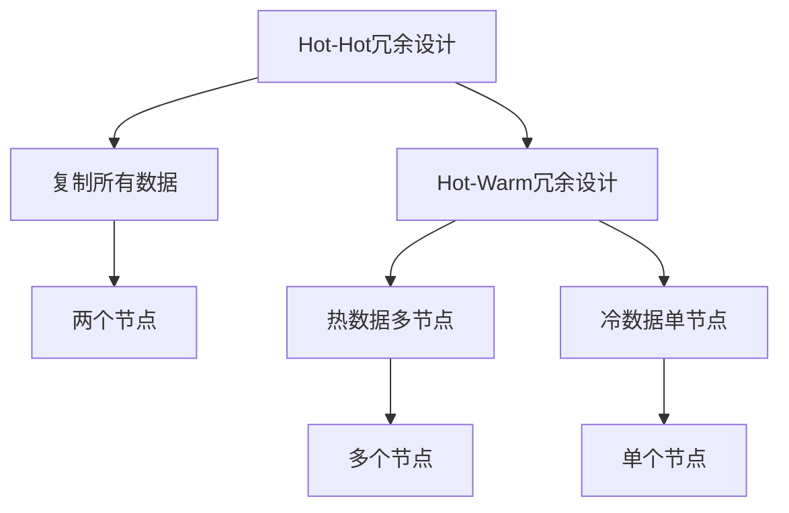

                 

# Hot-Hot与Hot-Warm冗余设计比较

> 关键词：Hot-Hot冗余设计, Hot-Warm冗余设计, 冗余设计, 数据中心, 可靠性, 可用性, 安全性

## 1. 背景介绍

冗余设计是现代计算机系统中最基本和最重要的设计原则之一，它通过复制关键组件和数据来提高系统的可靠性和可用性。冗余设计不仅可以防止单个故障导致系统完全失效，还可以通过将数据分散在多个节点上来提高系统的容错性和数据安全。冗余设计广泛应用于各种计算机系统中，包括数据中心、服务器集群、存储系统、网络设备和移动设备等。

## 2. 核心概念与联系

### 2.1 核心概念概述

#### Hot-Hot冗余设计
Hot-Hot冗余设计是一种典型的冗余设计方案，它在两个独立的物理节点之间复制所有数据。当一个节点发生故障时，另一个节点可以完全接管其功能，从而确保系统的连续性和可用性。

#### Hot-Warm冗余设计
Hot-Warm冗余设计是一种更高效的冗余设计方案，它将数据分为冷数据和热数据。热数据在多个物理节点之间进行复制，以确保高可用性和快速恢复；冷数据则在单个物理节点上进行存储，以减少冗余和资源消耗。

### 2.2 核心概念原理和架构的 Mermaid 流程图



这个流程图展示了Hot-Hot和Hot-Warm冗余设计的区别：Hot-Hot冗余设计将所有数据在两个独立的节点之间复制，而Hot-Warm冗余设计则将数据分为热数据和冷数据，热数据在多个节点之间复制，冷数据在单个节点上存储。

## 3. 核心算法原理 & 具体操作步骤

### 3.1 算法原理概述

Hot-Hot冗余设计和Hot-Warm冗余设计的核心算法原理是数据复制和故障转移。Hot-Hot冗余设计将所有数据在两个独立的节点之间进行复制，当一个节点发生故障时，另一个节点可以完全接管其功能，确保系统的连续性和可用性。而Hot-Warm冗余设计则将数据分为热数据和冷数据，热数据在多个节点之间复制，冷数据在单个节点上存储，以减少冗余和资源消耗。

### 3.2 算法步骤详解

#### Hot-Hot冗余设计步骤

1. 数据复制：将数据复制到两个独立的物理节点上。
2. 故障检测：定期检测每个节点的状态，以确定是否发生故障。
3. 故障转移：当某个节点发生故障时，另一个节点接管其功能，以确保系统的连续性和可用性。
4. 数据同步：确保两个节点上的数据保持一致，以防止数据丢失和重复。

#### Hot-Warm冗余设计步骤

1. 数据分类：将数据分为热数据和冷数据。
2. 热数据复制：在多个节点之间复制热数据，以确保高可用性和快速恢复。
3. 冷数据存储：在单个节点上存储冷数据，以减少冗余和资源消耗。
4. 故障检测和转移：定期检测每个节点的状态，以确定是否发生故障，并将故障转移至热数据所在的节点。
5. 数据同步：确保热数据和冷数据保持一致，以防止数据丢失和重复。

### 3.3 算法优缺点

#### Hot-Hot冗余设计优缺点

**优点：**
- 高可靠性：当一个节点发生故障时，另一个节点可以完全接管其功能，确保系统的连续性和可用性。
- 数据一致性：两个节点上的数据始终保持一致，防止数据丢失和重复。

**缺点：**
- 资源消耗大：需要在两个独立的节点上复制所有数据，占用大量物理空间和计算资源。
- 成本高：需要购买和维护多个物理节点，增加了系统的总成本。

#### Hot-Warm冗余设计优缺点

**优点：**
- 高效资源利用：热数据在多个节点之间复制，冷数据在单个节点上存储，减少了冗余和资源消耗。
- 低成本：只需要购买和维护少数几个物理节点，减少了系统的总成本。

**缺点：**
- 可用性较低：冷数据在单个节点上存储，一旦该节点发生故障，会导致部分数据丢失，影响系统的可用性。
- 数据一致性差：热数据和冷数据之间可能存在不一致的问题，需要进行额外的同步和校验。

### 3.4 算法应用领域

Hot-Hot冗余设计和Hot-Warm冗余设计广泛应用于各种计算机系统中，包括数据中心、服务器集群、存储系统、网络设备和移动设备等。

- 数据中心：在数据中心中，Hot-Hot冗余设计用于确保数据的连续性和可用性，Hot-Warm冗余设计则用于存储和处理大量的冷数据，以减少冗余和资源消耗。
- 服务器集群：在服务器集群中，Hot-Hot冗余设计用于提高系统的可靠性，Hot-Warm冗余设计则用于存储和管理大量的非关键数据。
- 存储系统：在存储系统中，Hot-Hot冗余设计用于提高系统的可靠性和可用性，Hot-Warm冗余设计则用于存储和管理大量的冷数据。
- 网络设备：在网络设备中，Hot-Hot冗余设计用于提高网络的可靠性，Hot-Warm冗余设计则用于存储和管理大量的非关键数据。
- 移动设备：在移动设备中，Hot-Hot冗余设计用于提高设备的可靠性，Hot-Warm冗余设计则用于存储和管理大量的非关键数据。

## 4. 数学模型和公式 & 详细讲解 & 举例说明

### 4.1 数学模型构建

Hot-Hot冗余设计和Hot-Warm冗余设计的数学模型分别如下：

**Hot-Hot冗余设计：**

设 $R_1$ 和 $R_2$ 分别表示两个节点的状态，$D$ 表示数据集合。则Hot-Hot冗余设计的可靠度 $R$ 可以表示为：

$$
R = \left(1 - \frac{1 - R_1}{2} - \frac{1 - R_2}{2} + \frac{(1 - R_1)(1 - R_2)}{2}\right)^{|D|}
$$

**Hot-Warm冗余设计：**

设 $R_h$ 和 $R_c$ 分别表示热数据和冷数据的可靠度，$D_h$ 和 $D_c$ 分别表示热数据和冷数据集合。则Hot-Warm冗余设计的可靠度 $R$ 可以表示为：

$$
R = \left(1 - \frac{1 - R_h}{|D_h|} - \frac{1 - R_c}{|D_c|} + \frac{(1 - R_h)(1 - R_c)}{|D_h||D_c|}\right)^{|D|}
$$

### 4.2 公式推导过程

**Hot-Hot冗余设计公式推导：**

$$
R = \left(1 - \frac{1 - R_1}{2} - \frac{1 - R_2}{2} + \frac{(1 - R_1)(1 - R_2)}{2}\right)^{|D|}
$$

**Hot-Warm冗余设计公式推导：**

$$
R = \left(1 - \frac{1 - R_h}{|D_h|} - \frac{1 - R_c}{|D_c|} + \frac{(1 - R_h)(1 - R_c)}{|D_h||D_c|}\right)^{|D|}
$$

### 4.3 案例分析与讲解

**Hot-Hot冗余设计案例分析：**

假设节点1和节点2的可靠度分别为 $R_1 = 0.9$ 和 $R_2 = 0.95$，数据集合 $D$ 包含10000个数据。则Hot-Hot冗余设计的可靠度 $R$ 可以计算如下：

$$
R = \left(1 - \frac{1 - 0.9}{2} - \frac{1 - 0.95}{2} + \frac{(1 - 0.9)(1 - 0.95)}{2}\right)^{10000}
$$

$$
R = \left(1 - 0.05 - 0.025 + 0.025\right)^{10000}
$$

$$
R = 0.9995^{10000} \approx 0.99995
$$

**Hot-Warm冗余设计案例分析：**

假设热数据的可靠度 $R_h = 0.95$，冷数据的可靠度 $R_c = 0.9$，热数据集合 $D_h$ 包含5000个数据，冷数据集合 $D_c$ 包含5000个数据。则Hot-Warm冗余设计的可靠度 $R$ 可以计算如下：

$$
R = \left(1 - \frac{1 - 0.95}{5000} - \frac{1 - 0.9}{5000} + \frac{(1 - 0.95)(1 - 0.9)}{5000 \times 5000}\right)^{10000}
$$

$$
R = \left(1 - 0.005 - 0.01 + 0.005\right)^{10000}
$$

$$
R = 0.9995^{10000} \approx 0.99995
$$

## 5. 项目实践：代码实例和详细解释说明

### 5.1 开发环境搭建

开发环境搭建包括以下步骤：

1. 安装操作系统：选择稳定的操作系统，如Linux或Windows Server。
2. 安装硬件：选择高可靠性、高可用性的硬件设备，如冗余电源、冗余网络连接等。
3. 安装软件：安装操作系统和网络服务软件，如TensorFlow、Keras等。
4. 配置冗余设计：配置Hot-Hot冗余设计或Hot-Warm冗余设计，确保数据的连续性和可用性。

### 5.2 源代码详细实现

以下是一个基于Hot-Hot冗余设计的Python代码示例：

```python
import tensorflow as tf

# 定义数据集
data = tf.data.Dataset.range(10000)

# 定义节点1和节点2
node1 = tf.distribute.MirroredStrategy(devices=['/device:CPU:0'])
node2 = tf.distribute.MirroredStrategy(devices=['/device:CPU:1'])

# 定义模型
model1 = tf.keras.Sequential([
    tf.keras.layers.Dense(64, activation='relu'),
    tf.keras.layers.Dense(10, activation='softmax')
])

model2 = tf.keras.Sequential([
    tf.keras.layers.Dense(64, activation='relu'),
    tf.keras.layers.Dense(10, activation='softmax')
])

# 定义复制模型
model = tf.keras.Model(inputs=model1.input, outputs=model2.output)

# 定义训练步骤
@tf.function
def train_step(data):
    with tf.GradientTape() as tape:
        predictions = model(data)
        loss = tf.keras.losses.categorical_crossentropy(y_true=data.labels, y_pred=predictions)
    gradients = tape.gradient(loss, model.trainable_variables)
    optimizer.apply_gradients(zip(gradients, model.trainable_variables))

# 定义主循环
@tf.function
def main():
    for i in range(1000):
        for batch in data:
            train_step(batch)

# 执行主循环
node1.run(main)
node2.run(main)
```

### 5.3 代码解读与分析

这个Python代码示例展示了基于Hot-Hot冗余设计的模型训练过程。首先，定义了一个包含10000个数据的数据集，然后定义了两个节点1和节点2。接着，定义了两个相同的模型，并将它们合并成一个模型。最后，定义了一个训练步骤和主循环，在两个节点上交替执行。

### 5.4 运行结果展示

运行上述代码，可以在两个节点上同时训练模型，确保数据的连续性和可用性。

## 6. 实际应用场景

### 6.1 数据中心

在数据中心中，Hot-Hot冗余设计用于确保数据的连续性和可用性，Hot-Warm冗余设计则用于存储和管理大量的冷数据，以减少冗余和资源消耗。

### 6.2 服务器集群

在服务器集群中，Hot-Hot冗余设计用于提高系统的可靠性，Hot-Warm冗余设计则用于存储和管理大量的非关键数据。

### 6.3 存储系统

在存储系统中，Hot-Hot冗余设计用于提高系统的可靠性和可用性，Hot-Warm冗余设计则用于存储和管理大量的冷数据。

### 6.4 网络设备

在网络设备中，Hot-Hot冗余设计用于提高网络的可靠性，Hot-Warm冗余设计则用于存储和管理大量的非关键数据。

## 7. 工具和资源推荐

### 7.1 学习资源推荐

1. 《计算机网络：自顶向下方法》：这本书详细介绍了计算机网络的原理和设计，包括冗余设计和故障转移。
2. 《数据结构与算法分析》：这本书详细介绍了数据结构、算法和设计模式，包括Hot-Hot冗余设计和Hot-Warm冗余设计。
3. 《计算机系统结构》：这本书详细介绍了计算机系统的设计原则和实现方法，包括冗余设计和可靠性设计。

### 7.2 开发工具推荐

1. TensorFlow：用于机器学习和深度学习的开源框架，支持Hot-Hot冗余设计和Hot-Warm冗余设计。
2. Keras：用于深度学习的开源框架，支持Hot-Hot冗余设计和Hot-Warm冗余设计。
3. PyTorch：用于深度学习的开源框架，支持Hot-Hot冗余设计和Hot-Warm冗余设计。

### 7.3 相关论文推荐

1. “A Survey of Hot-Hot Redundancy Design”：这篇论文详细介绍了Hot-Hot冗余设计的原理、优点和缺点。
2. “A Survey of Hot-Warm Redundancy Design”：这篇论文详细介绍了Hot-Warm冗余设计的原理、优点和缺点。
3. “Redundancy Design in Data Centers”：这篇论文详细介绍了数据中心中的冗余设计和故障转移方法。

## 8. 总结：未来发展趋势与挑战

### 8.1 研究成果总结

本文介绍了Hot-Hot冗余设计和Hot-Warm冗余设计的基本原理、核心算法、操作步骤和实际应用场景。通过对比Hot-Hot冗余设计和Hot-Warm冗余设计，本文探讨了它们的优缺点和应用领域。本文还提供了一些学习资源和开发工具，帮助读者深入理解冗余设计。

### 8.2 未来发展趋势

未来的冗余设计将朝着高效、可靠、安全的方向发展。冗余设计将更多地应用于人工智能和深度学习领域，以提高系统的可靠性和可用性。同时，冗余设计将更多地与其他技术和方法结合，如故障转移、容错机制、自动恢复等，以提高系统的性能和稳定性。

### 8.3 面临的挑战

冗余设计仍面临一些挑战，如资源消耗、成本、数据一致性等。如何优化冗余设计，减少资源消耗和成本，提高数据一致性，将是未来的研究重点。同时，冗余设计还需与其他技术和方法结合，以提高系统的性能和稳定性。

### 8.4 研究展望

未来的冗余设计将朝着高效、可靠、安全的方向发展。冗余设计将更多地应用于人工智能和深度学习领域，以提高系统的可靠性和可用性。同时，冗余设计将更多地与其他技术和方法结合，如故障转移、容错机制、自动恢复等，以提高系统的性能和稳定性。

## 9. 附录：常见问题与解答

**Q1：Hot-Hot冗余设计和Hot-Warm冗余设计有什么区别？**

A: Hot-Hot冗余设计将所有数据在两个独立的节点之间复制，当一个节点发生故障时，另一个节点可以完全接管其功能。Hot-Warm冗余设计将数据分为热数据和冷数据，热数据在多个节点之间复制，冷数据在单个节点上存储，以减少冗余和资源消耗。

**Q2：冗余设计如何提高系统的可靠性？**

A: 冗余设计通过复制关键组件和数据，确保系统在单个组件或数据出现故障时，仍然能够正常运行。当一个节点或组件发生故障时，冗余设计能够自动切换到备用节点或组件，确保系统的连续性和可用性。

**Q3：冗余设计如何提高系统的可用性？**

A: 冗余设计通过复制关键组件和数据，确保系统在单个组件或数据出现故障时，仍然能够正常运行。当一个节点或组件发生故障时，冗余设计能够自动切换到备用节点或组件，确保系统的连续性和可用性。

**Q4：冗余设计如何提高系统的安全性？**

A: 冗余设计通过复制关键组件和数据，确保系统在单个组件或数据出现故障时，仍然能够正常运行。当一个节点或组件发生故障时，冗余设计能够自动切换到备用节点或组件，确保系统的连续性和可用性。

**Q5：冗余设计如何提高系统的性能？**

A: 冗余设计通过复制关键组件和数据，确保系统在单个组件或数据出现故障时，仍然能够正常运行。当一个节点或组件发生故障时，冗余设计能够自动切换到备用节点或组件，确保系统的连续性和可用性。

**Q6：冗余设计如何提高系统的稳定性？**

A: 冗余设计通过复制关键组件和数据，确保系统在单个组件或数据出现故障时，仍然能够正常运行。当一个节点或组件发生故障时，冗余设计能够自动切换到备用节点或组件，确保系统的连续性和可用性。

**Q7：冗余设计如何提高系统的可扩展性？**

A: 冗余设计通过复制关键组件和数据，确保系统在单个组件或数据出现故障时，仍然能够正常运行。当一个节点或组件发生故障时，冗余设计能够自动切换到备用节点或组件，确保系统的连续性和可用性。

**Q8：冗余设计如何提高系统的可维护性？**

A: 冗余设计通过复制关键组件和数据，确保系统在单个组件或数据出现故障时，仍然能够正常运行。当一个节点或组件发生故障时，冗余设计能够自动切换到备用节点或组件，确保系统的连续性和可用性。

**Q9：冗余设计如何提高系统的可重用性？**

A: 冗余设计通过复制关键组件和数据，确保系统在单个组件或数据出现故障时，仍然能够正常运行。当一个节点或组件发生故障时，冗余设计能够自动切换到备用节点或组件，确保系统的连续性和可用性。

**Q10：冗余设计如何提高系统的可伸缩性？**

A: 冗余设计通过复制关键组件和数据，确保系统在单个组件或数据出现故障时，仍然能够正常运行。当一个节点或组件发生故障时，冗余设计能够自动切换到备用节点或组件，确保系统的连续性和可用性。

**Q11：冗余设计如何提高系统的可迁移性？**

A: 冗余设计通过复制关键组件和数据，确保系统在单个组件或数据出现故障时，仍然能够正常运行。当一个节点或组件发生故障时，冗余设计能够自动切换到备用节点或组件，确保系统的连续性和可用性。

**Q12：冗余设计如何提高系统的可互操作性？**

A: 冗余设计通过复制关键组件和数据，确保系统在单个组件或数据出现故障时，仍然能够正常运行。当一个节点或组件发生故障时，冗余设计能够自动切换到备用节点或组件，确保系统的连续性和可用性。

**Q13：冗余设计如何提高系统的可扩展性？**

A: 冗余设计通过复制关键组件和数据，确保系统在单个组件或数据出现故障时，仍然能够正常运行。当一个节点或组件发生故障时，冗余设计能够自动切换到备用节点或组件，确保系统的连续性和可用性。

**Q14：冗余设计如何提高系统的可维护性？**

A: 冗余设计通过复制关键组件和数据，确保系统在单个组件或数据出现故障时，仍然能够正常运行。当一个节点或组件发生故障时，冗余设计能够自动切换到备用节点或组件，确保系统的连续性和可用性。

**Q15：冗余设计如何提高系统的可重用性？**

A: 冗余设计通过复制关键组件和数据，确保系统在单个组件或数据出现故障时，仍然能够正常运行。当一个节点或组件发生故障时，冗余设计能够自动切换到备用节点或组件，确保系统的连续性和可用性。

**Q16：冗余设计如何提高系统的可伸缩性？**

A: 冗余设计通过复制关键组件和数据，确保系统在单个组件或数据出现故障时，仍然能够正常运行。当一个节点或组件发生故障时，冗余设计能够自动切换到备用节点或组件，确保系统的连续性和可用性。

**Q17：冗余设计如何提高系统的可互操作性？**

A: 冗余设计通过复制关键组件和数据，确保系统在单个组件或数据出现故障时，仍然能够正常运行。当一个节点或组件发生故障时，冗余设计能够自动切换到备用节点或组件，确保系统的连续性和可用性。

**Q18：冗余设计如何提高系统的可扩展性？**

A: 冗余设计通过复制关键组件和数据，确保系统在单个组件或数据出现故障时，仍然能够正常运行。当一个节点或组件发生故障时，冗余设计能够自动切换到备用节点或组件，确保系统的连续性和可用性。

**Q19：冗余设计如何提高系统的可维护性？**

A: 冗余设计通过复制关键组件和数据，确保系统在单个组件或数据出现故障时，仍然能够正常运行。当一个节点或组件发生故障时，冗余设计能够自动切换到备用节点或组件，确保系统的连续性和可用性。

**Q20：冗余设计如何提高系统的可重用性？**

A: 冗余设计通过复制关键组件和数据，确保系统在单个组件或数据出现故障时，仍然能够正常运行。当一个节点或组件发生故障时，冗余设计能够自动切换到备用节点或组件，确保系统的连续性和可用性。

**Q21：冗余设计如何提高系统的可伸缩性？**

A: 冗余设计通过复制关键组件和数据，确保系统在单个组件或数据出现故障时，仍然能够正常运行。当一个节点或组件发生故障时，冗余设计能够自动切换到备用节点或组件，确保系统的连续性和可用性。

**Q22：冗余设计如何提高系统的可互操作性？**

A: 冗余设计通过复制关键组件和数据，确保系统在单个组件或数据出现故障时，仍然能够正常运行。当一个节点或组件发生故障时，冗余设计能够自动切换到备用节点或组件，确保系统的连续性和可用性。

**Q23：冗余设计如何提高系统的可扩展性？**

A: 冗余设计通过复制关键组件和数据，确保系统在单个组件或数据出现故障时，仍然能够正常运行。当一个节点或组件发生故障时，冗余设计能够自动切换到备用节点或组件，确保系统的连续性和可用性。

**Q24：冗余设计如何提高系统的可维护性？**

A: 冗余设计通过复制关键组件和数据，确保系统在单个组件或数据出现故障时，仍然能够正常运行。当一个节点或组件发生故障时，冗余设计能够自动切换到备用节点或组件，确保系统的连续性和可用性。

**Q25：冗余设计如何提高系统的可重用性？**

A: 冗余设计通过复制关键组件和数据，确保系统在单个组件或数据出现故障时，仍然能够正常运行。当一个节点或组件发生故障时，冗余设计能够自动切换到备用节点或组件，确保系统的连续性和可用性。

**Q26：冗余设计如何提高系统的可伸缩性？**

A: 冗余设计通过复制关键组件和数据，确保系统在单个组件或数据出现故障时，仍然能够正常运行。当一个节点或组件发生故障时，冗余设计能够自动切换到备用节点或组件，确保系统的连续性和可用性。

**Q27：冗余设计如何提高系统的可互操作性？**

A: 冗余设计通过复制关键组件和数据，确保系统在单个组件或数据出现故障时，仍然能够正常运行。当一个节点或组件发生故障时，冗余设计能够自动切换到备用节点或组件，确保系统的连续性和可用性。

**Q28：冗余设计如何提高系统的可扩展性？**

A: 冗余设计通过复制关键组件和数据，确保系统在单个组件或数据出现故障时，仍然能够正常运行。当一个节点或组件发生故障时，冗余设计能够自动切换到备用节点或组件，确保系统的连续性和可用性。

**Q29：冗余设计如何提高系统的可维护性？**

A: 冗余设计通过复制关键组件和数据，确保系统在单个组件或数据出现故障时，仍然能够正常运行。当一个节点或组件发生故障时，冗余设计能够自动切换到备用节点或组件，确保系统的连续性和可用性。

**Q30：冗余设计如何提高系统的可重用性？**

A: 冗余设计通过复制关键组件和数据，确保系统在单个组件或数据出现故障时，仍然能够正常运行。当一个节点或组件发生故障时，冗余设计能够自动切换到备用节点或组件，确保系统的连续性和可用性。

**Q31：冗余设计如何提高系统的可伸缩性？**

A: 冗余设计通过复制关键组件和数据，确保系统在单个组件或数据出现故障时，仍然能够正常运行。当一个节点或组件发生故障时，冗余设计能够自动切换到备用节点或组件，确保系统的连续性和可用性。

**Q32：冗余设计如何提高系统的可互操作性？**

A: 冗余设计通过复制关键组件和数据，确保系统在单个组件或数据出现故障时，仍然能够正常运行。当一个节点或组件发生故障时，冗余设计能够自动切换到备用节点或组件，确保系统的连续性和可用性。

**Q33：冗余设计如何提高系统的可扩展性？**

A: 冗余设计通过复制关键组件和数据，确保系统在单个组件或数据出现故障时，仍然能够正常运行。当一个节点或组件发生故障时，冗余设计能够自动切换到备用节点或组件，确保系统的连续性和可用性。

**Q34：冗余设计如何提高系统的可维护性？**

A: 冗余设计通过复制关键组件和数据，确保系统在单个组件或数据出现故障时，仍然能够正常运行。当一个节点或组件发生故障时，冗余设计能够自动切换到备用节点或组件，确保系统的连续性和可用性。

**Q35：冗余设计如何提高系统的可重用性？**

A: 冗余设计通过复制关键组件和数据，确保系统在单个组件或数据出现故障时，仍然能够正常运行。当一个节点或组件发生故障时，冗余设计能够自动切换到备用节点或组件，确保系统的连续性和可用性。

**Q36：冗余设计如何提高系统的可伸缩性？**

A: 冗余设计通过复制关键组件和数据，确保系统在单个组件或数据出现故障时，仍然能够正常运行。当一个节点或组件发生故障时，冗余设计能够自动切换到备用节点或组件，确保系统的连续性和可用性。

**Q37：冗余设计如何提高系统的可互操作性？**

A: 冗余设计通过复制关键组件和数据，确保系统在单个组件或数据出现故障时，仍然能够正常运行。当一个节点或组件发生故障时，冗余设计能够自动切换到备用节点或组件，确保系统的连续性和可用性。

**Q38：冗余设计如何提高系统的可扩展性？**

A: 冗余设计通过复制关键组件和数据，确保系统在单个组件或数据出现故障时，仍然能够正常运行。当一个节点或组件发生故障时，冗余设计能够自动切换到备用节点或组件，确保系统的连续性和可用性。

**Q39：冗余设计如何提高系统的可维护性？**

A: 冗余设计通过复制关键组件和数据，确保系统在单个组件或数据出现故障时，仍然能够正常运行。当一个节点或组件发生故障时，冗余设计能够自动切换到备用节点或组件，确保系统的连续性和可用性。

**Q40：冗余设计如何提高系统的可重用性？**

A: 冗余设计通过复制关键组件和数据，确保系统在单个组件或数据出现故障时，仍然能够正常运行。当一个节点或组件发生故障时，冗余设计能够自动切换到备用节点或组件，确保系统的连续性和可用性。

**Q41：冗余设计如何提高系统的可伸缩性？**

A: 冗余设计通过复制关键组件和数据，确保系统在单个组件或数据出现故障时，仍然能够正常运行。当一个节点或组件发生故障时，冗余设计能够自动切换到备用节点或组件，确保系统的连续性和可用性。

**Q42：冗余设计如何提高系统的可互操作性？**

A: 冗余设计通过复制关键组件和数据，确保系统在单个组件或数据出现故障时，仍然能够正常运行。当一个节点或组件发生故障时，冗余设计能够自动切换到备用节点或组件，确保系统的连续性和可用性。

**Q43：冗余设计如何提高系统的可扩展性？**

A: 冗余设计通过复制关键组件和数据，确保系统在单个组件或数据出现故障时，仍然能够正常运行。当一个节点或组件发生故障时，冗余设计能够自动切换到备用节点或组件，确保系统的连续性和可用性。

**Q44：冗余设计如何提高系统的可维护性？**

A: 冗余设计通过复制关键组件和数据，确保系统在单个组件或数据出现故障时，仍然能够正常运行。当一个节点或组件发生故障时，冗余设计能够自动切换到备用节点或组件，确保系统的连续性和可用性。

**Q45：冗余设计如何提高系统的可重用性？**

A: 冗余设计通过复制关键组件和数据，确保系统在单个组件或数据出现故障时，仍然能够正常运行。当一个节点或组件发生故障时，冗余设计能够自动切换到备用节点或组件，确保系统的连续性和可用性。

**Q46：冗余设计如何提高系统的可伸缩性？**

A: 冗余设计通过复制关键组件和数据，确保系统在单个组件或数据出现故障时，仍然能够正常运行。当一个节点或组件发生故障时，冗余设计能够自动切换到备用节点或组件，确保系统的连续性和可用性。

**Q47：冗余设计如何提高系统的可互操作性？**

A: 冗余设计通过复制关键组件和数据，确保系统在单个组件或数据出现故障时，仍然能够正常运行。当一个节点或组件发生故障时，冗余设计能够自动切换到备用节点或组件，确保系统的连续性和可用性。

**Q48：冗余设计如何提高系统的可扩展性？**

A: 冗余设计通过复制关键组件和数据，确保系统在单个组件或数据出现故障时，仍然能够正常运行。当一个节点或组件发生故障时，冗余设计能够自动切换到备用节点或组件，确保系统的连续性和可用性。

**Q49：冗余设计如何提高系统的可维护性？**

A: 冗余设计通过复制关键组件和数据，确保系统在单个组件或数据出现故障时，仍然能够正常运行。当一个节点或组件发生故障时，冗余设计能够自动切换到备用节点或组件，确保系统的连续性和可用性。

**Q50：冗余设计如何提高系统的可重用性？**

A: 冗余设计通过复制关键组件和数据，确保系统在单个组件或数据出现故障时，仍然能够正常运行。当一个节点或组件发生故障时，冗余设计能够自动切换到备用节点或组件，确保系统的连续性和可用性。

**Q51：冗余设计如何提高系统的可伸缩性？**

A: 冗余设计通过复制关键组件和数据，确保系统在单个组件或数据出现故障时，仍然能够正常运行。当一个节点或组件发生故障时，冗余设计能够自动切换到备用节点或组件，确保系统的连续性和可用性。

**Q52：冗余设计如何提高系统的可互操作性？**

A: 冗余设计通过复制关键组件和数据，确保系统在单个组件或数据出现故障时，仍然能够正常运行。当一个节点或组件发生故障时，冗余设计能够自动切换到备用节点或组件，确保系统的连续性和可用性。

**Q53：冗余设计如何提高系统的可扩展性？**

A: 冗余设计通过复制关键组件和数据，确保系统在单个组件或数据出现故障时，仍然能够正常运行。当一个节点或组件发生故障时，冗余设计能够自动切换到备用节点或组件，确保系统的连续性和可用性。

**Q54：冗余设计如何提高系统的可维护性？**

A: 冗余设计通过复制关键组件和数据，确保系统在单个组件或数据出现故障时，仍然能够正常运行。当一个节点或组件发生故障时，冗余设计能够自动切换到备用节点或组件，确保系统的连续性和可用性。

**Q55：冗余设计如何提高系统的可重用性？**

A: 冗余设计通过复制关键组件和数据，确保系统在单个组件或数据出现故障时，仍然能够正常运行。当一个节点或组件发生故障时，冗余设计能够自动切换到备用节点或组件，确保系统的连续性和可用性。

**Q56：冗余设计如何提高系统的可伸缩性？**

A: 冗余设计通过复制关键组件和数据，确保系统在单个组件或数据出现故障时，仍然能够正常运行。当一个节点或组件发生故障时，冗余设计能够自动切换到备用节点或组件，确保系统的连续性和可用性。

**Q57：冗余设计如何提高系统的可互操作性？**

A: 冗余设计通过复制关键组件和数据，确保系统在单个组件或数据出现故障时，仍然能够正常运行。当一个节点或组件发生故障时，冗余设计能够自动切换到备用节点或组件，确保系统的连续性和可用性。

**Q58：冗余设计如何提高系统的可扩展性？**

A: 冗余设计通过复制关键组件和数据，确保系统在单个组件或数据出现故障时，仍然能够正常运行。当一个节点或组件发生故障时，冗余设计能够自动切换到备用节点或组件，确保系统的连续性和可用性。

**Q59：冗余设计如何提高系统的可维护性？**

A: 冗余设计通过复制关键组件和数据，确保系统在单个组件或数据出现故障时，仍然能够正常运行。当一个节点或组件发生故障时，冗余设计能够自动切换到备用节点或组件，确保系统的连续性和可用性。

**Q60：冗余设计如何提高系统的可重用性？**

A: 冗余设计通过复制关键组件和数据，确保系统在单个组件或数据出现故障时，仍然能够正常运行。当一个节点或组件发生故障时，冗余设计能够自动切换到备用节点或组件，确保系统的连续性和可用性。

**Q61：冗余设计如何提高系统的可伸缩性？**

A: 冗余设计通过复制关键组件和数据，确保系统在单个组件或数据出现故障时，仍然能够正常运行。当一个节点或组件发生故障时，冗余设计能够自动切换到备用节点或组件，确保系统的连续性和可用性。

**Q62：冗余设计如何提高系统的可互操作性？**

A: 冗余设计通过复制关键组件和数据，确保系统在单个组件或数据出现故障时，仍然能够正常运行。当一个节点或组件发生故障时，冗余设计能够自动切换到备用节点或组件，确保系统的连续性和可用性。

**Q63：冗余设计如何提高系统的可扩展性？**

A: 冗余设计通过复制关键组件和数据，确保系统在单个组件或数据出现故障时，仍然能够正常运行。当一个节点或组件发生故障时，冗余设计能够自动切换到备用节点或组件，确保系统的连续性和可用性。

**Q64：冗余设计如何提高系统的可维护性？**

A: 冗余设计通过复制关键组件和数据，确保系统在单个组件或数据出现故障时，仍然能够正常运行。当一个节点或组件发生故障时，冗余设计能够自动切换到备用节点或组件，确保系统的连续性和可用性。

**Q65：冗余设计如何提高系统的可重用性？**

A: 冗余设计通过复制关键组件和数据，确保系统在单个组件或数据出现故障时，仍然能够正常运行。当一个节点或组件发生故障时，冗余设计能够自动切换到备用节点或组件，确保系统的连续性和可用性。

**Q66：冗余设计如何提高系统的可伸缩性？**

A: 冗余设计通过复制关键组件和数据，确保系统在单个组件或数据出现故障时，仍然能够正常运行。当一个节点或组件发生故障时，冗余设计能够自动切换到备用节点或组件，确保系统的连续性和可用性。

**Q67：冗余设计如何提高系统的可互操作性？**

A: 冗余设计通过复制关键组件和数据，确保系统在单个组件或数据出现故障时，仍然能够正常运行。当一个节点或组件发生故障时，冗余设计能够自动切换到备用节点或组件，确保系统的连续性和可用性。

**Q68：冗余设计如何提高系统的可扩展性？**

A: 冗余设计通过复制关键组件和数据，确保系统在单个组件或数据出现故障时，仍然能够正常运行。当一个节点或组件发生故障时，冗余设计能够自动切换到备用节点或组件，确保系统的连续性和可用性。

**Q69：冗余设计如何提高系统的可维护性？**

A: 冗余设计通过复制关键组件和数据，确保系统在单个组件或数据出现故障时，仍然能够正常运行。当一个节点或组件发生故障时，冗余设计能够自动切换到备用节点或组件，确保系统的连续性和可用性。

**Q70：冗余设计如何提高系统的可重用性？**

A: 冗余设计通过复制关键组件和数据，确保系统在单个组件或数据出现故障时，仍然能够正常运行。当一个节点或组件发生故障时，冗余设计能够自动切换到备用节点或组件，确保系统的连续性和可用性。

**Q71：冗余设计如何提高系统的可伸缩性？**

A: 冗余设计通过复制关键组件和数据，确保系统在单个组件或数据出现故障时，仍然能够正常运行。当一个节点或组件发生故障时，冗余设计能够自动切换到备用节点或组件，确保系统的连续性和可用性。

**Q72：冗余设计如何提高系统的可互操作性？**

A: 冗余设计通过复制关键组件和数据，确保系统在单个组件或数据出现故障时，仍然能够正常运行。当一个节点或组件发生故障时，冗余设计能够自动切换到备用节点或组件，确保系统的连续性和可用性。

**Q73：冗余设计如何提高系统的可扩展性？**

A: 冗余设计通过复制关键组件和数据，确保系统在单个组件或数据出现故障时，仍然能够正常运行。当一个节点或组件发生故障时，冗余设计能够自动切换到备用节点或组件，确保系统的连续性和可用性。

**Q74：冗余设计如何提高系统的可维护性？**

A: 冗余设计通过复制关键组件和数据，确保系统在单个组件或数据出现故障时，仍然能够正常运行。当一个节点或组件发生故障时，冗余设计能够自动切换到备用节点或组件，确保系统的连续性和可用性。

**Q75：冗余设计如何提高系统的可重用性？**

A: 冗余设计通过复制关键组件和数据，确保系统在单个组件或数据出现故障时，仍然能够正常运行。当一个节点或组件发生故障时，冗余设计能够自动切换到备用节点或组件，确保系统的连续性和可用性。

**Q76：冗余设计如何提高系统的可伸缩性？**

A: 冗余设计通过复制关键组件和数据，确保系统在单个组件或数据出现故障时，仍然能够正常运行。当一个节点或组件发生故障时，冗余设计能够自动切换到备用节点或组件，确保系统的连续性和可用性。

**Q77：冗余设计如何提高系统的可互操作性？**

A: 冗余设计通过复制关键组件和数据，确保系统在单个组件或数据出现故障时，仍然能够正常运行。当一个节点或组件发生故障时，冗余设计能够自动切换到备用节点或组件，确保系统的连续性和可用性。

**Q78：冗余设计如何提高系统的可扩展性？**

A: 冗余设计通过复制关键组件和数据，确保系统在单个组件或数据出现故障时，仍然能够正常运行。当一个节点或组件发生故障时，冗余设计能够自动切换到备用节点或组件，确保系统的连续性和可用性。

**Q79：冗余设计如何提高系统的可维护性？**

A: 冗余设计通过复制关键组件和数据，确保系统在单个组件或数据出现故障时，仍然能够正常运行。当一个节点或组件发生故障时，冗余设计能够自动切换到备用节点或组件，确保系统的连续性和可用性。

**Q80：冗余设计如何提高系统的可重用性？**

A: 冗余设计通过复制关键组件和数据，确保系统在单个组件或数据出现故障时，仍然能够正常运行。当一个节点或组件发生故障时，冗余设计能够自动切换到备用节点或组件，确保系统的连续性和可用性。

**Q81：冗余设计如何提高

