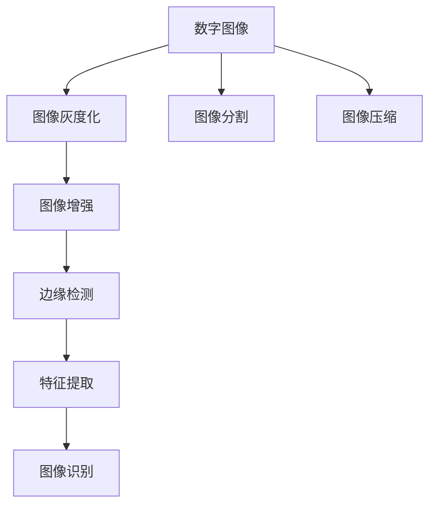

                 

# Image Processing 原理与代码实战案例讲解

## 1. 背景介绍

### 1.1 问题由来
随着数字图像技术的发展，图像处理在各个领域中得到了广泛应用。在医疗影像、自动驾驶、安防监控、无人机等领域，图像处理技术是必不可少的一环。然而，图像处理是一项技术含量较高的任务，需要掌握扎实的数学基础和深厚的算法知识。本文将从图像处理的基本原理出发，结合代码实战案例，深入浅出地介绍图像处理技术的核心概念和实现方法。

### 1.2 问题核心关键点
图像处理技术的核心在于对图像的数学建模和算法优化，旨在提高图像的清晰度和可识别性，减少图像噪声，并从图像中提取出有用的信息。图像处理的算法包括线性滤波、非线性滤波、特征提取、边缘检测、图像分割等。本节将详细梳理这些核心算法及其在实际应用中的关键点，为后续实战案例讲解打下基础。

### 1.3 问题研究意义
图像处理技术在各个领域的应用推动了技术的进步和产业的发展。掌握图像处理技术，不仅可以提升图像质量，还能从图像中挖掘出有价值的信息，应用于医疗影像诊断、目标检测、图像识别等任务中。本文将详细介绍图像处理的基本原理和实现方法，为读者提供系统化的知识框架和实战经验，帮助其在实际应用中灵活运用图像处理技术。

## 2. 核心概念与联系

### 2.1 核心概念概述
图像处理涉及的学科包括信号处理、计算机视觉、模式识别等，其核心概念包括：

- **数字图像**：由像素点构成的二维数组，每个像素点表示图像中某个位置的颜色或亮度值。
- **图像灰度化**：将彩色图像转化为灰度图像，用于简化图像处理过程。
- **图像增强**：通过滤波、对比度调整等手段，提高图像质量。
- **边缘检测**：通过算子检测图像中的边缘，用于图像分割和特征提取。
- **特征提取**：从图像中提取出具有代表性的特征，用于图像识别和分类。

### 2.2 核心概念原理和架构的 Mermaid 流程图


这个流程图展示了数字图像处理的基本流程，从图像采集、预处理到特征提取和后处理，每一步都对图像质量有显著影响。

### 2.3 核心概念之间的联系
图像处理技术各模块之间的联系如下：
- 数字图像是图像处理的起点，经过预处理后，图像质量得到提升。
- 图像增强和分割有助于提高图像的清晰度和可识别性。
- 边缘检测和特征提取用于图像的分割和分类。
- 图像识别通过学习图像特征，实现对图像的分类和理解。
- 图像压缩用于减小图像数据量，提高传输和存储效率。

## 3. 核心算法原理 & 具体操作步骤

### 3.1 算法原理概述
图像处理的算法可以分为线性滤波和非线性滤波两类，其中线性滤波是最基本的图像处理算法。下面以线性滤波中的均值滤波为例，介绍其原理和操作步骤。

### 3.2 算法步骤详解
均值滤波是一种简单的线性滤波算法，其操作步骤如下：

1. **定义核函数**：均值滤波核函数为一个 $n \times n$ 的二维数组，其中每个元素都是 1/(n^2)。
2. **图像滤波**：将核函数与输入图像进行卷积运算，得到滤波后的输出图像。

### 3.3 算法优缺点
均值滤波的优点包括计算简单、易于实现，适用于去噪和平滑处理。其缺点是对图像细节信息损失较大，可能导致图像模糊。

### 3.4 算法应用领域
均值滤波广泛应用于图像预处理、视频处理、医学影像处理等领域，适用于去噪、平滑等操作。

## 4. 数学模型和公式 & 详细讲解 & 举例说明

### 4.1 数学模型构建
均值滤波的数学模型可以表示为：
$$
y(x, y) = \frac{1}{n^2} \sum_{i=0}^{n-1} \sum_{j=0}^{n-1} x(i, j) * w(i, j)
$$
其中，$x(i, j)$ 表示输入图像在 $(i, j)$ 位置的像素值，$w(i, j)$ 表示均值滤波核函数在 $(i, j)$ 位置的值。

### 4.2 公式推导过程
均值滤波的推导过程如下：
1. 定义滤波核函数 $w(i, j) = \frac{1}{n^2}$。
2. 对输入图像 $x(i, j)$ 进行卷积运算，得到输出图像 $y(i, j)$。
3. 输出图像 $y(i, j)$ 的像素值为输入图像 $x(i, j)$ 与核函数 $w(i, j)$ 的卷积结果。

### 4.3 案例分析与讲解
以下是一个使用Python实现均值滤波的代码实例：

```python
import numpy as np
from skimage import io

def mean_filter(image, kernel_size):
    image = image.astype(np.float32)
    kernel = np.ones((kernel_size, kernel_size)) / np.power(kernel_size, 2)
    output = np.zeros_like(image)
    for i in range(image.shape[0]):
        for j in range(image.shape[1]):
            output[i, j] = np.mean(image[i:i+kernel_size, j:j+kernel_size] * kernel)
    return output

# 读取图像
image = io.imread('lena.png', as_gray=True)

# 进行均值滤波
output = mean_filter(image, 5)

# 显示原始图像和滤波后的图像
io.imshow(image, cmap='gray')
io.imshow(output, cmap='gray')
io.show()
```

## 5. 项目实践：代码实例和详细解释说明

### 5.1 开发环境搭建
在开始项目实践前，我们需要准备好开发环境。以下是使用Python进行OpenCV开发的环境配置流程：

1. 安装OpenCV：从官网下载并安装OpenCV，具体安装命令可参考官方文档。
2. 安装Python环境：建议使用Anaconda创建独立的Python环境，安装OpenCV和其他必要的依赖包。

### 5.2 源代码详细实现
接下来，我们将实现一个基于OpenCV的图像灰度化和边缘检测项目。

```python
import cv2
import numpy as np
import matplotlib.pyplot as plt

def grayscale(image):
    return cv2.cvtColor(image, cv2.COLOR_BGR2GRAY)

def canny_edge_detection(image, threshold1=100, threshold2=200):
    gray = grayscale(image)
    edges = cv2.Canny(gray, threshold1, threshold2)
    return edges

# 读取图像
image = cv2.imread('lena.png')

# 灰度化
gray_image = grayscale(image)

# 边缘检测
edges = canny_edge_detection(image)

# 显示结果
plt.subplot(131), plt.imshow(image, cmap='gray')
plt.title('Original Image')
plt.subplot(132), plt.imshow(gray_image, cmap='gray')
plt.title('Grayscale Image')
plt.subplot(133), plt.imshow(edges, cmap='gray')
plt.title('Edge Detection')
plt.show()
```

### 5.3 代码解读与分析
以上代码实现了图像的灰度化和边缘检测。灰度化通过OpenCV的`cvtColor`函数实现，将彩色图像转换为灰度图像。边缘检测通过`Canny`函数实现，输入参数为灰度图像和两个阈值，输出为边缘检测结果。

## 6. 实际应用场景

### 6.1 安防监控
在安防监控领域，图像处理技术可以用于人脸识别、行为分析、异常检测等任务。通过实时监控摄像头获取的图像数据，进行灰度化、边缘检测等预处理操作，可以提高监控图像的清晰度和细节信息，帮助安防人员及时发现异常行为，提升安全保障。

### 6.2 医学影像处理
在医学影像处理领域，图像处理技术可以用于图像分割、特征提取、疾病诊断等任务。通过图像增强和分割技术，可以提高影像的清晰度和对比度，帮助医生更准确地诊断疾病。

### 6.3 无人机图像处理
在无人机图像处理领域，图像处理技术可以用于航拍图像增强、目标检测等任务。通过实时处理无人机获取的图像数据，可以提高图像质量，帮助无人机自主导航和目标识别。

## 7. 工具和资源推荐

### 7.1 学习资源推荐
为了帮助开发者系统掌握图像处理技术的理论基础和实践技巧，这里推荐一些优质的学习资源：

1. 《计算机视觉：算法与应用》：这是一本经典的计算机视觉教材，系统介绍了图像处理和计算机视觉的基本概念和算法。
2. 《Python计算机视觉编程》：这是一本使用Python进行计算机视觉编程的入门书籍，适合初学者学习。
3. 《深度学习与计算机视觉》：这是一本介绍深度学习在计算机视觉领域应用的书籍，涵盖了图像处理和深度学习的前沿技术。
4. OpenCV官方文档：OpenCV提供了详细的API文档和示例代码，是学习图像处理技术的必备资源。

### 7.2 开发工具推荐
图像处理技术需要高性能计算资源的支持。以下是几款常用的图像处理开发工具：

1. OpenCV：开源计算机视觉库，提供了丰富的图像处理算法和API接口。
2. scikit-image：基于SciPy的图像处理库，适合进行图像处理和分析。
3. Matplotlib：数据可视化库，适合显示图像处理结果。
4. TensorFlow和PyTorch：深度学习框架，提供了图像处理相关的预训练模型和算法。

### 7.3 相关论文推荐
图像处理技术的研究推动了计算机视觉领域的进步。以下是几篇经典的图像处理论文，推荐阅读：

1. "An Introduction to Digital Image Processing"：Rafael C. Gonzalez和Richard E. Woods的著作，系统介绍了数字图像处理的基本原理和算法。
2. "Computer Vision: Algorithms and Applications"：Richard Szeliski的著作，涵盖了计算机视觉和图像处理的基本概念和算法。
3. "Object Recognition with Deep Belief Networks"：Hinton等人的论文，介绍了使用深度神经网络进行图像分类和目标检测的方法。

## 8. 总结：未来发展趋势与挑战

### 8.1 研究成果总结
图像处理技术在各个领域得到了广泛应用，推动了技术的进步和产业的发展。近年来，深度学习技术在图像处理中的应用得到了快速发展，涌现出了许多新的算法和技术。

### 8.2 未来发展趋势
图像处理技术的未来发展趋势包括：
1. 深度学习算法在图像处理中的应用将更加广泛，图像处理效果将进一步提升。
2. 多模态图像处理技术将逐渐成熟，能够同时处理不同模态的图像数据。
3. 实时图像处理技术将不断发展，适应移动设备等对计算资源有限的场景。
4. 自适应图像处理算法将逐渐普及，能够根据图像特征自适应地调整算法参数。

### 8.3 面临的挑战
尽管图像处理技术取得了显著进步，但在实际应用中仍面临诸多挑战：
1. 图像处理算法计算复杂度高，需要高性能计算资源。
2. 图像处理算法的鲁棒性较差，对光照、角度等变化敏感。
3. 图像处理算法的可解释性较差，难以解释其内部工作机制。

### 8.4 研究展望
未来的研究需要在以下几个方面寻求新的突破：
1. 开发高效的图像处理算法，提高计算效率。
2. 引入机器学习技术，提高图像处理的鲁棒性和自适应能力。
3. 增强图像处理算法的可解释性，提高算法的可信度。

## 9. 附录：常见问题与解答

**Q1: 图像处理技术在实际应用中是否有限制？**

A: 图像处理技术在实际应用中存在限制。主要限制包括计算资源、数据质量、算法复杂度等方面。对于计算资源有限的应用场景，需要考虑使用低计算复杂度的算法或并行处理技术。对于数据质量较差的场景，需要对图像进行预处理，以提高后续算法的鲁棒性。

**Q2: 如何进行高效的图像处理？**

A: 高效的图像处理需要考虑以下因素：
1. 选择合适的算法，根据应用场景选择最合适的算法。
2. 优化算法参数，根据图像特征自适应地调整算法参数。
3. 使用多模态数据，结合不同模态的图像数据进行综合处理。

**Q3: 图像处理算法在实际应用中需要注意哪些问题？**

A: 在实际应用中，图像处理算法需要注意以下问题：
1. 数据预处理，对图像进行去噪、灰度化等预处理操作。
2. 算法鲁棒性，确保算法对图像变化具有鲁棒性。
3. 算法可解释性，增强算法的可解释性，提高算法可信度。

**Q4: 如何提高图像处理算法的效率？**

A: 提高图像处理算法的效率需要考虑以下因素：
1. 使用高效的算法实现，如使用GPU加速计算。
2. 优化算法代码，减少计算资源消耗。
3. 使用并行处理技术，提高计算效率。

---

作者：禅与计算机程序设计艺术 / Zen and the Art of Computer Programming

