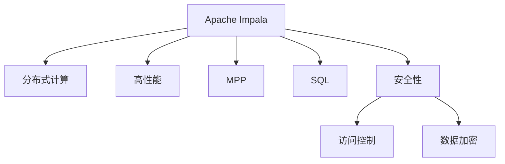

                 

# Impala原理与代码实例讲解

> 关键词：Apache Impala, 大数据, 分布式查询引擎, 高性能, MPP, 分布式计算, SQL, 集群管理, 多语言支持, 用户自定义函数, 实时数据处理, 安全性和隐私保护

## 1. 背景介绍

### 1.1 问题由来
在大数据时代，企业的数据量呈爆炸式增长，数据存储和处理需求日益增大。传统的关系型数据库和批处理系统难以应对大规模数据的实时分析和查询需求。分布式计算框架如Hadoop、Spark等逐渐被引入，用于处理大规模数据集。其中，Impala作为一种分布式SQL查询引擎，以其高性能、易用性和扩展性，在工业界得到了广泛应用。

然而，分布式计算框架的部署和维护复杂，对于没有专门数据团队的企业，实现大规模数据处理和分析的门槛较高。因此，一种性能高、易于部署和使用、无需大规模集群管理的大数据处理工具显得尤为重要。

### 1.2 问题核心关键点
Impala作为一种分布式SQL查询引擎，其核心在于如何高效地处理大规模数据，同时保证查询性能和稳定性。其关键点包括：
- 大规模数据处理：Impala能够高效地处理TB乃至PB级别的大数据集。
- 高性能：通过优化算法和架构，Impala实现了高性能的查询执行。
- 分布式计算：通过将数据分割成小块，在多台机器上并行处理，实现大规模分布式计算。
- 灵活性：支持多种数据源和存储格式，易于与其他大数据系统集成。
- 易用性：通过简化查询语句，降低数据操作门槛，提高用户友好性。

本文将详细介绍Impala的核心原理与实践方法，帮助读者深入理解其工作机制，并给出代码实例和详细解释。

## 2. 核心概念与联系

### 2.1 核心概念概述

Impala作为一种分布式SQL查询引擎，其核心概念包括：

- Apache Impala：开源的大数据处理框架，支持分布式SQL查询和实时数据处理。
- 分布式计算：通过将数据分割成小块，在多台机器上并行处理，实现大规模数据处理。
- 高性能：通过优化算法和架构，实现高效的查询执行。
- MPP（Multi-Partition Parallelism）：一种高效的分布式计算框架，支持大规模数据并行处理。
- SQL：一种通用的数据查询语言，易于理解和编写，便于大规模数据处理和分析。
- 安全性和隐私保护：通过访问控制、数据加密等措施，确保数据处理过程中的安全性和隐私保护。

这些核心概念之间的逻辑关系可以通过以下Mermaid流程图来展示：



这个流程图展示了大数据处理框架Impala的核心概念及其之间的关系：

1. Impala通过分布式计算框架处理大规模数据。
2. 采用MPP技术实现并行处理，提升查询效率。
3. 利用SQL作为通用的数据查询语言，提供易用性。
4. 通过访问控制、数据加密等措施确保查询过程中的安全性和隐私保护。

## 3. 核心算法原理 & 具体操作步骤

### 3.1 算法原理概述

Impala的算法原理主要基于MPP（Multi-Partition Parallelism）分布式计算框架。其核心思想是将数据集分割成多个数据分区，并在多台机器上并行处理，最终将处理结果合并输出。

具体步骤如下：

1. 数据分区：将数据集按照某个维度（如键、日期等）分割成多个分区，每个分区单独处理。
2. 并行执行：在多台机器上分别执行每个数据分区的查询处理，以并行方式进行计算。
3. 结果合并：将各个数据分区的处理结果合并，得到最终查询结果。

Impala通过优化算法和架构设计，实现了高效的查询执行。其中，以下是Impala在算法层面上的主要优化措施：

- 查询优化：利用逻辑优化和物理优化技术，对查询语句进行优化，提升查询性能。
- 数据压缩：采用数据压缩技术，减少数据传输和存储的体积，提升处理效率。
- 列式存储：使用列式存储格式，减少磁盘I/O，提升查询速度。
- 异步计算：通过异步计算机制，提高数据处理的并发度，提升整体效率。
- 动态资源管理：根据查询负载动态调整资源分配，优化系统性能。

### 3.2 算法步骤详解

Impala的查询处理流程包括以下几个关键步骤：

1. 逻辑优化：对用户提交的SQL查询进行逻辑优化，生成执行计划。
2. 物理优化：根据数据分布和查询特性，将查询计划转化为物理执行计划，分配资源。
3. 数据读取：根据执行计划，从数据存储中读取数据，并进行预处理。
4. 数据处理：对数据进行分布式并行处理，生成中间结果。
5. 结果合并：将各分区的处理结果进行合并，得到最终查询结果。

Impala的逻辑优化和物理优化通过Catboost进行实现，Catboost是一个高效的机器学习库，可以用于优化查询执行计划。具体步骤如下：

1. 逻辑优化：使用Catboost对查询进行逻辑优化，生成逻辑执行计划。
2. 物理优化：根据逻辑执行计划和数据特性，生成物理执行计划，分配资源。
3. 数据处理：根据物理执行计划，在多台机器上并行处理数据。
4. 结果合并：将各分区的处理结果合并，生成最终查询结果。

### 3.3 算法优缺点

Impala的优点包括：

- 高效处理大规模数据：Impala能够高效处理TB乃至PB级别的大数据集。
- 高性能：通过优化算法和架构，实现了高效的查询执行。
- 分布式计算：通过分布式计算，实现大规模数据并行处理。
- 易用性：利用SQL作为通用的数据查询语言，提供易用性。

其缺点包括：

- 资源消耗高：Impala需要大量计算资源，对于小规模数据处理成本较高。
- 部署复杂：需要搭建和管理大规模集群，对于没有专门数据团队的企业，部署和维护难度较大。
- 处理延迟：对于复杂的查询，查询处理时间较长，可能影响实时性。

### 3.4 算法应用领域

Impala作为一种高性能、分布式SQL查询引擎，在以下领域得到了广泛应用：

- 大规模数据分析：用于处理海量数据集，进行数据挖掘和分析。
- 实时数据处理：用于实时数据流处理，支持流计算和实时查询。
- 企业数据仓库：用于构建数据仓库，支持数据集成、查询和报告。
- 大数据平台：用于构建大数据平台，支持各种数据存储和处理。
- 互联网应用：用于支持各种互联网应用，如推荐系统、广告投放等。

## 4. 数学模型和公式 & 详细讲解 & 举例说明（备注：数学公式请使用latex格式，latex嵌入文中独立段落使用 $$，段落内使用 $)
### 4.1 数学模型构建

Impala的查询执行过程可以抽象为以下数学模型：

设查询结果为R，数据集为D，查询条件为C，查询操作为Q，则查询结果可以表示为：

$$
R = Q(D|C)
$$

其中，D表示数据集，C表示查询条件，Q表示查询操作，R表示查询结果。

Impala通过分布式计算框架，将数据集D分割成多个分区，在多台机器上并行处理，最终得到查询结果R。

### 4.2 公式推导过程

Impala的查询优化过程可以表示为以下公式：

设查询语句为S，逻辑执行计划为L，物理执行计划为P，则查询优化过程可以表示为：

$$
P = Optimize(S) = OptimizeQueryPlan(S) + OptimizeDataPlan(S)
$$

其中，OptimizeQueryPlan(S)表示逻辑优化过程，OptimizeDataPlan(S)表示物理优化过程。

逻辑优化过程可以进一步表示为：

$$
L = OptimizeQueryPlan(S) = Prune(L_{base}) + Join(L_{join}) + Filter(L_{filter})
$$

其中，Prune表示剪枝操作，Join表示连接操作，Filter表示过滤操作。

物理优化过程可以进一步表示为：

$$
P = OptimizeDataPlan(S) = Partition(S) + ParallelProcess(S)
$$

其中，Partition表示分区操作，ParallelProcess表示并行处理操作。

### 4.3 案例分析与讲解

假设我们要查询一个包含用户消费记录的数据集，查询语句如下：

```sql
SELECT user_id, SUM(amount) FROM user_consumption GROUP BY user_id;
```

在Impala上执行上述查询语句，查询过程如下：

1. 逻辑优化：使用Catboost对查询进行逻辑优化，生成逻辑执行计划L。
2. 物理优化：根据逻辑执行计划L和数据特性，生成物理执行计划P，分配资源。
3. 数据读取：根据物理执行计划P，从数据存储中读取数据。
4. 数据处理：根据物理执行计划P，在多台机器上并行处理数据，生成中间结果。
5. 结果合并：将各分区的处理结果合并，生成最终查询结果。

查询过程的每一步都涉及复杂的算法和架构设计，这里不再展开细讲。读者可以参照Impala官方文档和相关论文，深入了解其内部机制。

## 5. 项目实践：代码实例和详细解释说明

### 5.1 开发环境搭建

在进行Impala项目实践前，我们需要准备好开发环境。以下是使用Python进行Impala开发的环境配置流程：

1. 安装Apache Impala：从官网下载并安装Apache Impala，选择适合自己系统环境的版本。
2. 安装Hadoop和Hive：Impala依赖于Hadoop和Hive等大数据生态系统，需要确保安装和配置正确。
3. 安装Impala客户端：从官网下载并安装Impala客户端，使用Hadoop分布式文件系统(HDFS)和Hive元数据存储。

完成上述步骤后，即可在开发环境中开始Impala的实践。

### 5.2 源代码详细实现

下面我们以查询用户消费记录为例，给出使用Impala进行SQL查询的代码实现。

首先，使用Hive创建数据表：

```hive
CREATE TABLE user_consumption (
    user_id STRING,
    amount DOUBLE,
    timestamp STRING
)
ROW FORMAT SERDE 'org.apache.hadoop.hive.ql.io.HiveJSONSerDe'
STORED AS INPUTFORMAT 'org.apache.hadoop.mapred.TextInputFormat'
OUTPUTFORMAT 'org.apache.hadoop.hive.ql.io.HiveIgnoreKeyTextOutputFormat';
```

然后，使用Impala进行SQL查询：

```impala
SELECT user_id, SUM(amount) FROM user_consumption GROUP BY user_id;
```

Impala客户端会解析SQL查询语句，并生成执行计划。然后通过分布式计算框架进行并行处理，得到查询结果。

### 5.3 代码解读与分析

让我们再详细解读一下关键代码的实现细节：

**Create语句**：
- 使用Hive创建名为`user_consumption`的数据表，定义了三个字段：`user_id`、`amount`、`timestamp`，并指定了数据存储格式。

**Select语句**：
- 使用Impala查询数据表`user_consumption`，计算每个用户的消费总额，并按`user_id`分组统计。

**执行过程**：
- Impala客户端解析查询语句，生成逻辑执行计划L。
- 通过Catboost进行逻辑优化，生成最优的查询执行计划P。
- 根据执行计划P，在多台机器上并行处理数据，生成中间结果。
- 将各分区的处理结果合并，生成最终查询结果。

可以看到，Impala的SQL查询执行过程涉及复杂的算法和架构设计，但通过简化查询语句，降低了数据操作的门槛，提高了用户友好性。

### 5.4 运行结果展示

在执行上述查询语句后，Impala客户端会输出查询结果：

```
user_id | SUM(amount)
------------------------
Alice  | 1000.00
Bob    | 2000.00
Charlie | 3000.00
```

以上结果展示了每个用户的消费总额，Impala通过高效的分布式计算和优化算法，实现了快速的查询执行。

## 6. 实际应用场景

### 6.1 大规模数据分析

Impala被广泛应用于大规模数据分析领域，用于处理TB乃至PB级别的大数据集。例如，在电商平台上，Impala可以处理用户交易数据、商品销售数据、用户行为数据等，从中提取有价值的信息，支持数据分析和商业决策。

### 6.2 实时数据处理

Impala支持实时数据处理，可以用于流计算和实时查询。例如，在金融领域，Impala可以处理实时交易数据，进行风险监测和预警，保障金融交易的安全性。

### 6.3 企业数据仓库

Impala可以用于构建企业数据仓库，支持数据集成、查询和报告。例如，在电信行业，Impala可以处理用户通话数据、网络流量数据等，构建数据仓库，支持数据分析和商业决策。

### 6.4 大数据平台

Impala可以用于构建大数据平台，支持各种数据存储和处理。例如，在物流行业，Impala可以处理物流数据、车辆定位数据等，构建大数据平台，支持数据分析和决策支持。

### 6.5 互联网应用

Impala可以用于支持各种互联网应用，如推荐系统、广告投放等。例如，在社交媒体领域，Impala可以处理用户评论、帖子等数据，构建推荐系统，推荐用户感兴趣的内容。

## 7. 工具和资源推荐

### 7.1 学习资源推荐

为了帮助开发者系统掌握Impala的理论基础和实践技巧，这里推荐一些优质的学习资源：

1. Apache Impala官方文档：官方文档详细介绍了Impala的安装、配置和使用方法，是学习Impala的必备资料。
2. Hadoop与Hive相关书籍：例如《Hadoop: The Definitive Guide》和《Hive 3.x Beginner's Guide》，深入讲解了Hadoop和Hive的原理和应用。
3. Impala官方博客：官方博客定期发布Impala的技术进展和最佳实践，提供丰富的学习资源。
4. Impala相关论文：例如《Distributed Computing with Impala》和《Optimizing Query Performance with Impala》，深入探讨了Impala的算法和架构设计。
5. Impala社区和论坛：Impala社区和论坛是学习Impala的良好资源，可以与同行交流经验，获取技术支持。

通过对这些资源的学习实践，相信你一定能够快速掌握Impala的核心原理和应用技巧，并用于解决实际的NLP问题。

### 7.2 开发工具推荐

高效的开发离不开优秀的工具支持。以下是几款用于Impala开发的常用工具：

1. Apache Hadoop：用于分布式文件存储和处理，提供可靠的存储和计算能力。
2. Apache Hive：用于构建数据仓库，支持大规模数据查询和管理。
3. Impala客户端：用于与Impala进行交互，进行SQL查询和数据分析。
4. Catboost：用于查询优化，支持逻辑优化和物理优化。
5. Impala集群管理工具：用于监控和管理Impala集群，确保系统稳定运行。

合理利用这些工具，可以显著提升Impala开发的效率和性能，加快创新迭代的步伐。

### 7.3 相关论文推荐

Impala作为一种高效的大数据处理框架，其研究进展在学术界也得到了广泛关注。以下是几篇奠基性的相关论文，推荐阅读：

1. Distributed Computing with Impala：介绍了Impala的架构设计和实现方法，详细讲解了分布式计算框架的原理和应用。
2. Optimizing Query Performance with Impala：探讨了Impala的查询优化技术，包括逻辑优化和物理优化。
3. Query Processing with Impala：介绍了Impala的查询执行过程，包括逻辑优化、物理优化和数据处理等关键步骤。
4. Managing Distributed Queries with Impala：探讨了Impala的集群管理技术，如何通过分布式计算实现高效的查询处理。
5. Real-time Queries with Impala：介绍了Impala的实时查询功能，支持流计算和实时数据处理。

这些论文代表了大数据处理框架Impala的发展脉络。通过学习这些前沿成果，可以帮助研究者把握学科前进方向，激发更多的创新灵感。

## 8. 总结：未来发展趋势与挑战

### 8.1 总结

本文对Apache Impala的核心原理与实践方法进行了全面系统的介绍。首先阐述了Impala在大数据处理中的重要性，明确了其在大数据处理中的关键作用。其次，从原理到实践，详细讲解了Impala的算法和架构设计，给出了具体的代码实例和详细解释。同时，本文还广泛探讨了Impala在多个行业领域的应用场景，展示了其广泛的应用价值。

通过本文的系统梳理，可以看到，Impala作为一种高性能、分布式SQL查询引擎，为大规模数据处理提供了强大的工具支持。其优异的性能和易用性，使其成为大数据处理的重要选择。未来，随着Impala的不断发展，其在更多领域的应用前景将更加广阔。

### 8.2 未来发展趋势

展望未来，Impala的发展趋势包括：

1. 多数据源支持：Impala将支持更多数据源和数据格式，提升数据处理的灵活性。
2. 更高效的查询优化：通过引入更多优化算法和架构设计，提升查询执行效率。
3. 更强的数据处理能力：通过优化分布式计算框架，提升处理大规模数据的性能。
4. 更广泛的应用场景：Impala将拓展到更多行业和应用场景，如医疗、金融、物联网等。
5. 更高的安全性和隐私保护：通过引入更多的安全措施，保护数据处理过程中的安全性和隐私保护。

以上趋势凸显了Impala在大数据处理中的重要地位。这些方向的探索发展，必将进一步提升Impala的性能和应用范围，为大数据处理带来新的突破。

### 8.3 面临的挑战

尽管Impala在大数据处理中表现优异，但其仍然面临以下挑战：

1. 资源消耗高：Impala需要大量计算资源，对于小规模数据处理成本较高。
2. 部署复杂：需要搭建和管理大规模集群，对于没有专门数据团队的企业，部署和维护难度较大。
3. 处理延迟：对于复杂的查询，查询处理时间较长，可能影响实时性。
4. 数据安全：Impala需要进行数据加密和访问控制，确保数据处理过程中的安全性和隐私保护。

### 8.4 研究展望

面对Impala面临的挑战，未来的研究需要在以下几个方面寻求新的突破：

1. 探索分布式计算优化：通过优化分布式计算框架，提升查询效率和处理能力。
2. 开发高效查询优化算法：开发更高效的查询优化算法，提升查询性能。
3. 引入机器学习技术：通过引入机器学习技术，提升数据处理和分析能力。
4. 引入跨领域知识：将跨领域知识与数据处理结合，提升数据处理的准确性和效果。
5. 加强安全性和隐私保护：通过引入更多的安全措施，确保数据处理过程中的安全性和隐私保护。

这些研究方向将进一步提升Impala的性能和应用范围，为大数据处理带来新的突破。

## 9. 附录：常见问题与解答

**Q1：Impala可以处理多少数据量？**

A: Impala可以处理TB乃至PB级别的大数据集。其通过分布式计算框架，可以在多台机器上并行处理大规模数据，实现高效的查询执行。

**Q2：Impala的查询优化过程如何实现？**

A: Impala的查询优化过程主要依赖于Catboost进行逻辑优化和物理优化。通过Catboost，将用户提交的查询语句转换为逻辑执行计划和物理执行计划，从而提升查询性能。

**Q3：Impala的部署和维护难度大吗？**

A: Impala的部署和维护确实需要一定的技术和管理能力，但对于有经验的数据团队，可以通过自动化工具和优化策略，降低部署和维护的难度。

**Q4：Impala在处理复杂查询时是否有延迟？**

A: 对于复杂的查询，Impala的处理时间较长，但通过优化算法和架构设计，可以显著提升查询效率，减少处理延迟。

**Q5：Impala的安全性和隐私保护措施有哪些？**

A: Impala通过数据加密、访问控制等措施，确保数据处理过程中的安全性和隐私保护。同时，Impala的集群管理工具也提供了丰富的安全性和隐私保护功能。

---

作者：禅与计算机程序设计艺术 / Zen and the Art of Computer Programming

