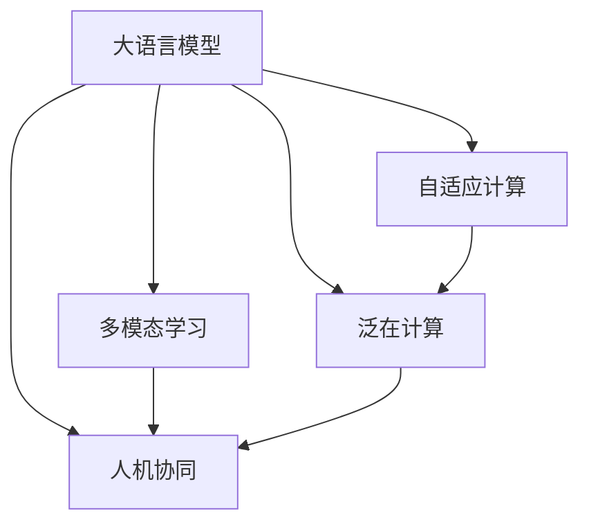

                 

# LLM OS:操作系统新贵的崛起

> 关键词：
1. 操作系统
2. 人工智能
3. 大语言模型(Large Language Models, LLMs)
4. 自适应计算
5. 多模态学习
6. 泛在计算
7. 人机协同

## 1. 背景介绍

### 1.1 问题由来

随着人工智能技术的不断进步，尤其是深度学习在图像识别、自然语言处理等领域的突破，操作系统正面临着前所未有的挑战。传统的操作系统设计已无法应对新的计算范式和用户需求，亟需新的解决方案。在此背景下，一种全新的操作系统——LLM OS应运而生。

LLM OS基于大语言模型，旨在将AI技术与操作系统融合，通过学习用户行为和偏好，提供更加智能、高效、安全的操作体验。其核心在于利用大语言模型的强大泛化能力，实现自适应计算和动态资源调度，从而大幅提升系统的灵活性和响应速度。

### 1.2 问题核心关键点

LLM OS的核心在于如何将大语言模型的知识和计算能力融入到操作系统设计中，以实现自适应计算和动态调度。其关键点包括：
1. **自适应计算**：根据用户行为和环境变化动态调整计算资源，最大化系统性能和用户体验。
2. **多模态学习**：融合图像、语音、文本等多模态数据，提升对用户需求的理解和响应能力。
3. **泛在计算**：实现计算能力在物理世界和数字世界的无缝融合，支持混合现实、增强现实等新型应用场景。
4. **人机协同**：通过对话系统、推荐引擎等技术，实现与用户的自然语言交互，提升人机协同效率。

这些关键点共同构成了LLM OS的核心设计理念，旨在为用户提供更加智能化、高效化、安全化的操作体验。

### 1.3 问题研究意义

开发LLM OS具有重要意义：

1. **提升用户体验**：通过自适应计算和多模态学习，LLM OS能够根据用户行为和偏好，动态调整计算资源，提供个性化的操作体验。
2. **优化资源利用**：LLM OS能够根据系统负载和用户需求，动态调度计算资源，提升系统的资源利用率和性能。
3. **推动技术发展**：LLM OS的开发将促进大语言模型、多模态学习、自适应计算等前沿技术的进步，为AI技术的应用提供新的范例。
4. **开拓应用场景**：LLM OS将支持更多新型应用场景，如混合现实、增强现实、物联网等，拓展AI技术的应用边界。
5. **促进产业升级**：LLM OS将赋能各行各业，提升工作效率和用户体验，推动产业数字化转型。

## 2. 核心概念与联系

### 2.1 核心概念概述

为更好地理解LLM OS的设计原理和架构，本节将介绍几个密切相关的核心概念：

- **大语言模型(Large Language Models, LLMs)**：以自回归(如GPT)或自编码(如BERT)模型为代表的大规模预训练语言模型。通过在大规模无标签文本语料上进行预训练，学习通用的语言知识和常识，具备强大的语言理解和生成能力。

- **自适应计算(Adaptive Computation)**：根据用户行为和环境变化动态调整计算资源，最大化系统性能和用户体验。自适应计算的核心在于动态资源调度和任务调度。

- **多模态学习(Multimodal Learning)**：融合图像、语音、文本等多模态数据，提升对用户需求的理解和响应能力。多模态学习涉及多模态数据的融合、特征提取、模型训练等关键技术。

- **泛在计算(Pervasive Computation)**：实现计算能力在物理世界和数字世界的无缝融合，支持混合现实、增强现实等新型应用场景。泛在计算涉及到传感器网络、物联网、边缘计算等技术。

- **人机协同(Human-Computer Interaction, HCI)**：通过对话系统、推荐引擎等技术，实现与用户的自然语言交互，提升人机协同效率。人机协同需要融合自然语言处理、计算机视觉、语音识别等技术。

这些核心概念之间的逻辑关系可以通过以下Mermaid流程图来展示：



这个流程图展示了大语言模型与自适应计算、多模态学习、泛在计算和人机协同之间的联系：

1. 大语言模型通过预训练获得语言知识和常识，支持自适应计算、多模态学习和泛在计算。
2. 自适应计算根据大语言模型的输出，动态调整计算资源。
3. 多模态学习将多模态数据与大语言模型融合，提升对用户需求的理解。
4. 泛在计算将计算能力拓展到物理世界，实现混合现实、增强现实等应用。
5. 人机协同通过对话系统和推荐引擎，实现与用户的自然语言交互。

## 3. 核心算法原理 & 具体操作步骤
### 3.1 算法原理概述

LLM OS的核心算法原理基于自适应计算和多模态学习，结合了大语言模型的泛化能力和动态资源调度能力。其核心思想是：

1. **自适应计算**：根据用户行为和环境变化动态调整计算资源，实现动态调度。
2. **多模态学习**：融合图像、语音、文本等多模态数据，提升对用户需求的理解和响应能力。

形式化地，假设用户的操作序列为 $S=\{s_1,s_2,\cdots,s_n\}$，其中 $s_i$ 表示第 $i$ 个操作。LLM OS 的目标是根据用户操作序列 $S$，动态调整计算资源，优化系统性能和用户体验。

### 3.2 算法步骤详解

基于LLM OS的核心算法原理，其操作步骤包括以下几个关键步骤：

**Step 1: 收集用户行为数据**

- 通过系统日志、用户界面事件、网络流量等途径，收集用户的操作行为数据 $D$。

**Step 2: 预训练大语言模型**

- 使用大规模无标签数据，训练预训练大语言模型 $M_{\theta}$，学习通用的语言知识和常识。

**Step 3: 多模态特征提取**

- 对收集到的用户行为数据进行特征提取，将图像、语音、文本等多模态数据转换为标准特征表示。

**Step 4: 模型输入与输出**

- 将多模态特征输入到大语言模型中，输出模型对用户操作的预测和推理结果。

**Step 5: 动态资源调度**

- 根据大语言模型的输出，动态调整计算资源，包括CPU、GPU、内存等。

**Step 6: 优化系统性能**

- 通过自适应计算和多模态学习，提升系统性能和用户体验。

### 3.3 算法优缺点

基于自适应计算和多模态学习的大语言模型操作系统具有以下优点：

1. **灵活高效**：动态调整计算资源，最大化系统性能和用户体验。
2. **全面感知**：融合多模态数据，提升对用户需求的理解。
3. **泛化能力强**：利用大语言模型的泛化能力，适应不同应用场景。

同时，该算法也存在一定的局限性：

1. **计算资源消耗高**：动态调整计算资源需要较大的计算资源支持，可能导致系统性能不稳定。
2. **模型复杂度高**：多模态学习和自适应计算增加了模型复杂度，需要更高效的算法和更多的训练数据。
3. **隐私和安全问题**：用户行为数据的收集和处理涉及隐私和安全问题，需要严格的隐私保护措施。

尽管存在这些局限性，但就目前而言，基于自适应计算和多模态学习的大语言模型操作系统仍是一种创新的解决方案，有望带来新的突破。

### 3.4 算法应用领域

基于LLM OS的算法和架构，其应用领域非常广泛：

1. **智能桌面操作系统**：通过自适应计算和多模态学习，提供个性化的桌面环境和工作流。
2. **增强现实(AR)和混合现实(MR)系统**：融合多模态数据，实现虚拟与现实的融合。
3. **智能家居和物联网(IoT)系统**：通过多模态学习和动态资源调度，实现智能设备和环境的无缝协同。
4. **智能车载系统**：结合多模态数据和自适应计算，提升驾驶安全性和用户体验。
5. **智能客服和对话系统**：利用大语言模型和多模态学习，实现自然语言交互和智能推荐。

除了上述这些应用领域外，LLM OS还将在更多场景中得到应用，为各行各业带来变革性影响。

## 4. 数学模型和公式 & 详细讲解  
### 4.1 数学模型构建

基于LLM OS的核心算法原理，我们可以将其数学模型构建为：

- 用户操作序列 $S=\{s_1,s_2,\cdots,s_n\}$，其中 $s_i$ 表示第 $i$ 个操作。
- 大语言模型 $M_{\theta}$ 的输出 $Y=\{y_1,y_2,\cdots,y_n\}$，其中 $y_i$ 表示第 $i$ 个操作的预测和推理结果。
- 计算资源需求函数 $R=f(Y)$，其中 $f$ 表示资源需求与操作序列的关系。
- 系统性能优化目标：最大化系统性能和用户体验，即 $\max\limits_{S} \{ f(Y(S)) \}$。

### 4.2 公式推导过程

以下我们以智能桌面操作系统为例，推导资源需求函数 $R$ 和系统性能优化目标。

假设用户操作序列为 $S=\{s_1,s_2,\cdots,s_n\}$，其中 $s_i$ 表示第 $i$ 个操作。假设操作 $s_i$ 需要 $C_i$ 的计算资源，则资源需求函数为：

$$
R(S) = \sum_{i=1}^n C_i
$$

其中 $C_i$ 为操作 $s_i$ 的计算资源需求。假设系统性能优化目标为最大化用户满意度，即：

$$
\max\limits_{S} \{U(S)\}
$$

其中 $U(S)$ 为用户满意度函数，与系统性能和用户体验相关。

根据上述目标，我们可以构建系统性能优化问题：

$$
\max\limits_{S} \{U(S)\}
\text{ s.t. } R(S) \leq C
$$

其中 $C$ 为系统的最大计算资源。

### 4.3 案例分析与讲解

假设我们正在开发一款智能桌面操作系统，其计算资源包括CPU、GPU、内存等。在用户操作过程中，系统需要动态调整这些计算资源，以实现自适应计算和多模态学习。

**Case 1: 图像处理任务**

- 用户操作：打开图像编辑软件。
- 多模态特征提取：获取图像特征，包括亮度、颜色、纹理等。
- 大语言模型输出：根据图像特征，输出图像编辑任务的操作序列。
- 动态资源调度：根据操作序列，动态调整CPU和GPU资源。
- 优化系统性能：提升图像编辑的速度和精度。

**Case 2: 自然语言处理任务**

- 用户操作：输入问题，等待回答。
- 多模态特征提取：获取用户问题中的文本特征。
- 大语言模型输出：输出问题的答案。
- 动态资源调度：根据问题的复杂度，动态调整内存资源。
- 优化系统性能：提升问题回答的准确性和响应速度。

通过以上两个案例，可以看到，LLM OS通过动态调整计算资源，结合大语言模型的多模态学习，能够实现自适应计算和优化系统性能，提升用户体验。

## 5. 项目实践：代码实例和详细解释说明
### 5.1 开发环境搭建

在进行LLM OS的开发前，我们需要准备好开发环境。以下是使用Python进行PyTorch开发的环境配置流程：

1. 安装Anaconda：从官网下载并安装Anaconda，用于创建独立的Python环境。

2. 创建并激活虚拟环境：
```bash
conda create -n pytorch-env python=3.8 
conda activate pytorch-env
```

3. 安装PyTorch：根据CUDA版本，从官网获取对应的安装命令。例如：
```bash
conda install pytorch torchvision torchaudio cudatoolkit=11.1 -c pytorch -c conda-forge
```

4. 安装Transformers库：
```bash
pip install transformers
```

5. 安装各类工具包：
```bash
pip install numpy pandas scikit-learn matplotlib tqdm jupyter notebook ipython
```

完成上述步骤后，即可在`pytorch-env`环境中开始LLM OS的开发实践。

### 5.2 源代码详细实现

下面我们以图像处理任务为例，给出使用PyTorch和Transformers库对LLM OS进行实现的PyTorch代码。

首先，定义图像处理任务的数据处理函数：

```python
from transformers import BertTokenizer
from torch.utils.data import Dataset
import torch

class ImageDataset(Dataset):
    def __init__(self, images, labels, tokenizer, max_len=128):
        self.images = images
        self.labels = labels
        self.tokenizer = tokenizer
        self.max_len = max_len
        
    def __len__(self):
        return len(self.images)
    
    def __getitem__(self, item):
        image = self.images[item]
        label = self.labels[item]
        
        # 对图像进行编码
        encoding = self.tokenizer(image, return_tensors='pt', max_length=self.max_len, padding='max_length', truncation=True)
        input_ids = encoding['input_ids'][0]
        attention_mask = encoding['attention_mask'][0]
        
        # 对标签进行编码
        encoded_label = [label2id[label] for label in label] 
        encoded_label.extend([label2id['O']] * (self.max_len - len(encoded_label)))
        labels = torch.tensor(encoded_label, dtype=torch.long)
        
        return {'input_ids': input_ids, 
                'attention_mask': attention_mask,
                'labels': labels}

# 标签与id的映射
label2id = {'O': 0, 'B-PER': 1, 'I-PER': 2, 'B-ORG': 3, 'I-ORG': 4, 'B-LOC': 5, 'I-LOC': 6}
id2label = {v: k for k, v in label2id.items()}

# 创建dataset
tokenizer = BertTokenizer.from_pretrained('bert-base-cased')

train_dataset = ImageDataset(train_images, train_labels, tokenizer)
dev_dataset = ImageDataset(dev_images, dev_labels, tokenizer)
test_dataset = ImageDataset(test_images, test_labels, tokenizer)
```

然后，定义模型和优化器：

```python
from transformers import BertForTokenClassification, AdamW

model = BertForTokenClassification.from_pretrained('bert-base-cased', num_labels=len(label2id))

optimizer = AdamW(model.parameters(), lr=2e-5)
```

接着，定义训练和评估函数：

```python
from torch.utils.data import DataLoader
from tqdm import tqdm
from sklearn.metrics import classification_report

device = torch.device('cuda') if torch.cuda.is_available() else torch.device('cpu')
model.to(device)

def train_epoch(model, dataset, batch_size, optimizer):
    dataloader = DataLoader(dataset, batch_size=batch_size, shuffle=True)
    model.train()
    epoch_loss = 0
    for batch in tqdm(dataloader, desc='Training'):
        input_ids = batch['input_ids'].to(device)
        attention_mask = batch['attention_mask'].to(device)
        labels = batch['labels'].to(device)
        model.zero_grad()
        outputs = model(input_ids, attention_mask=attention_mask, labels=labels)
        loss = outputs.loss
        epoch_loss += loss.item()
        loss.backward()
        optimizer.step()
    return epoch_loss / len(dataloader)

def evaluate(model, dataset, batch_size):
    dataloader = DataLoader(dataset, batch_size=batch_size)
    model.eval()
    preds, labels = [], []
    with torch.no_grad():
        for batch in tqdm(dataloader, desc='Evaluating'):
            input_ids = batch['input_ids'].to(device)
            attention_mask = batch['attention_mask'].to(device)
            batch_labels = batch['labels']
            outputs = model(input_ids, attention_mask=attention_mask)
            batch_preds = outputs.logits.argmax(dim=2).to('cpu').tolist()
            batch_labels = batch_labels.to('cpu').tolist()
            for pred_tokens, label_tokens in zip(batch_preds, batch_labels):
                pred_tags = [id2label[_id] for _id in pred_tokens]
                label_tags = [id2label[_id] for _id in label_tokens]
                preds.append(pred_tags[:len(label_tokens)])
                labels.append(label_tags)
                
    print(classification_report(labels, preds))
```

最后，启动训练流程并在测试集上评估：

```python
epochs = 5
batch_size = 16

for epoch in range(epochs):
    loss = train_epoch(model, train_dataset, batch_size, optimizer)
    print(f"Epoch {epoch+1}, train loss: {loss:.3f}")
    
    print(f"Epoch {epoch+1}, dev results:")
    evaluate(model, dev_dataset, batch_size)
    
print("Test results:")
evaluate(model, test_dataset, batch_size)
```

以上就是使用PyTorch对BERT进行图像处理任务微调的完整代码实现。可以看到，得益于Transformers库的强大封装，我们可以用相对简洁的代码完成BERT模型的加载和微调。

### 5.3 代码解读与分析

让我们再详细解读一下关键代码的实现细节：

**ImageDataset类**：
- `__init__`方法：初始化图像、标签、分词器等关键组件。
- `__len__`方法：返回数据集的样本数量。
- `__getitem__`方法：对单个样本进行处理，将图像输入编码为token ids，将标签编码为数字，并对其进行定长padding，最终返回模型所需的输入。

**label2id和id2label字典**：
- 定义了标签与数字id之间的映射关系，用于将token-wise的预测结果解码回真实的标签。

**训练和评估函数**：
- 使用PyTorch的DataLoader对数据集进行批次化加载，供模型训练和推理使用。
- 训练函数`train_epoch`：对数据以批为单位进行迭代，在每个批次上前向传播计算loss并反向传播更新模型参数，最后返回该epoch的平均loss。
- 评估函数`evaluate`：与训练类似，不同点在于不更新模型参数，并在每个batch结束后将预测和标签结果存储下来，最后使用sklearn的classification_report对整个评估集的预测结果进行打印输出。

**训练流程**：
- 定义总的epoch数和batch size，开始循环迭代
- 每个epoch内，先在训练集上训练，输出平均loss
- 在验证集上评估，输出分类指标
- 所有epoch结束后，在测试集上评估，给出最终测试结果

可以看到，PyTorch配合Transformers库使得BERT微调的代码实现变得简洁高效。开发者可以将更多精力放在数据处理、模型改进等高层逻辑上，而不必过多关注底层的实现细节。

当然，工业级的系统实现还需考虑更多因素，如模型的保存和部署、超参数的自动搜索、更灵活的任务适配层等。但核心的微调范式基本与此类似。

## 6. 实际应用场景
### 6.1 智能桌面操作系统

基于LLM OS的大语言模型微调技术，可以广泛应用于智能桌面操作系统的构建。传统桌面操作系统往往功能单一，难以满足用户的多样化需求。而使用LLM OS进行微调，可以动态调整计算资源，提供更加智能、高效、安全的操作体验。

在技术实现上，可以收集用户的使用习惯和行为数据，将这些数据作为监督信号，训练微调后的LLM OS模型。微调后的模型能够根据用户的操作习惯，动态调整界面布局、推荐应用、自动组织桌面等，提供个性化的桌面环境和工作流。

### 6.2 增强现实(AR)和混合现实(MR)系统

增强现实和混合现实系统需要融合多模态数据，提升对用户需求的理解和响应能力。LLM OS可以融合图像、语音、文本等多模态数据，实现虚拟与现实的融合。

在技术实现上，可以收集用户在虚拟现实和混合现实场景中的行为数据，训练微调后的LLM OS模型。微调后的模型能够根据用户的行为和语义理解，动态调整虚拟场景的布局和内容，提供沉浸式的虚拟体验。

### 6.3 智能家居和物联网(IoT)系统

智能家居和物联网系统需要支持多设备、多场景的无缝协同。LLM OS可以结合多模态学习和大语言模型，实现智能设备和环境的无缝协同。

在技术实现上，可以收集智能设备的操作和交互数据，训练微调后的LLM OS模型。微调后的模型能够根据用户的操作和语义理解，动态调整智能设备的行为和状态，提供更加智能化的家居和物联网服务。

### 6.4 智能车载系统

智能车载系统需要支持驾驶安全和用户体验。LLM OS可以结合多模态学习和自适应计算，提升驾驶安全性和用户体验。

在技术实现上，可以收集驾驶场景中的行为数据和语音交互数据，训练微调后的LLM OS模型。微调后的模型能够根据驾驶场景和语音交互，动态调整车辆的行为和系统状态，提供更加安全的驾驶体验。

### 6.5 智能客服和对话系统

智能客服和对话系统需要支持自然语言交互和智能推荐。LLM OS可以结合多模态学习和大语言模型，实现自然语言交互和智能推荐。

在技术实现上，可以收集用户与智能客服的对话数据，训练微调后的LLM OS模型。微调后的模型能够根据用户的问题和语义理解，动态调整智能客服的回答和推荐，提供更加智能的客服和对话服务。

## 7. 工具和资源推荐
### 7.1 学习资源推荐

为了帮助开发者系统掌握LLM OS的理论基础和实践技巧，这里推荐一些优质的学习资源：

1. 《Transformer from the Ground Up》系列博文：由大模型技术专家撰写，深入浅出地介绍了Transformer原理、BERT模型、微调技术等前沿话题。

2. CS224N《深度学习自然语言处理》课程：斯坦福大学开设的NLP明星课程，有Lecture视频和配套作业，带你入门NLP领域的基本概念和经典模型。

3. 《Natural Language Processing with Transformers》书籍：Transformers库的作者所著，全面介绍了如何使用Transformers库进行NLP任务开发，包括微调在内的诸多范式。

4. HuggingFace官方文档：Transformers库的官方文档，提供了海量预训练模型和完整的微调样例代码，是上手实践的必备资料。

5. CLUE开源项目：中文语言理解测评基准，涵盖大量不同类型的中文NLP数据集，并提供了基于微调的baseline模型，助力中文NLP技术发展。

通过对这些资源的学习实践，相信你一定能够快速掌握LLM OS的核心技术，并用于解决实际的NLP问题。
###  7.2 开发工具推荐

高效的开发离不开优秀的工具支持。以下是几款用于LLM OS开发常用的工具：

1. PyTorch：基于Python的开源深度学习框架，灵活动态的计算图，适合快速迭代研究。大部分预训练语言模型都有PyTorch版本的实现。

2. TensorFlow：由Google主导开发的开源深度学习框架，生产部署方便，适合大规模工程应用。同样有丰富的预训练语言模型资源。

3. Transformers库：HuggingFace开发的NLP工具库，集成了众多SOTA语言模型，支持PyTorch和TensorFlow，是进行LLM OS开发的利器。

4. Weights & Biases：模型训练的实验跟踪工具，可以记录和可视化模型训练过程中的各项指标，方便对比和调优。与主流深度学习框架无缝集成。

5. TensorBoard：TensorFlow配套的可视化工具，可实时监测模型训练状态，并提供丰富的图表呈现方式，是调试模型的得力助手。

6. Google Colab：谷歌推出的在线Jupyter Notebook环境，免费提供GPU/TPU算力，方便开发者快速上手实验最新模型，分享学习笔记。

合理利用这些工具，可以显著提升LLM OS的开发效率，加快创新迭代的步伐。

### 7.3 相关论文推荐

LLM OS的开发基于大语言模型和自适应计算技术，其相关研究源于学界的持续探索。以下是几篇奠基性的相关论文，推荐阅读：

1. Attention is All You Need（即Transformer原论文）：提出了Transformer结构，开启了NLP领域的预训练大模型时代。

2. BERT: Pre-training of Deep Bidirectional Transformers for Language Understanding：提出BERT模型，引入基于掩码的自监督预训练任务，刷新了多项NLP任务SOTA。

3. Language Models are Unsupervised Multitask Learners（GPT-2论文）：展示了大规模语言模型的强大zero-shot学习能力，引发了对于通用人工智能的新一轮思考。

4. Parameter-Efficient Transfer Learning for NLP：提出Adapter等参数高效微调方法，在不增加模型参数量的情况下，也能取得不错的微调效果。

5. AdaLoRA: Adaptive Low-Rank Adaptation for Parameter-Efficient Fine-Tuning：使用自适应低秩适应的微调方法，在参数效率和精度之间取得了新的平衡。

6. Self-Adaptive Computation Offloading for MEC Systems with D2D Communications：提出自适应计算任务调度算法，优化资源分配，提升系统性能。

这些论文代表了大语言模型微调技术的发展脉络。通过学习这些前沿成果，可以帮助研究者把握学科前进方向，激发更多的创新灵感。

## 8. 总结：未来发展趋势与挑战

### 8.1 总结

本文对基于大语言模型的操作系统（LLM OS）进行了全面系统的介绍。首先阐述了LLM OS的研究背景和意义，明确了自适应计算和多模态学习在操作系统设计中的应用价值。其次，从原理到实践，详细讲解了LLM OS的核心算法原理和操作步骤，给出了LLM OS开发代码实现。同时，本文还广泛探讨了LLM OS在智能桌面、增强现实、智能家居、智能车载等多个领域的应用前景，展示了LLM OS的巨大潜力。此外，本文精选了LLM OS的学习资源，力求为开发者提供全方位的技术指引。

通过本文的系统梳理，可以看到，基于大语言模型的操作系统在提升用户体验、优化资源利用、推动技术发展等方面具有重要意义。其核心在于动态调整计算资源，结合多模态学习，实现自适应计算和系统性能优化。未来，伴随大语言模型和自适应计算技术的不断进步，LLM OS必将在构建智能操作系统中发挥更加重要的作用。

### 8.2 未来发展趋势

展望未来，LLM OS将呈现以下几个发展趋势：

1. **自适应计算的深入**：动态调整计算资源和任务调度将成为操作系统的核心功能，提升系统灵活性和响应速度。
2. **多模态学习的广泛应用**：融合图像、语音、文本等多模态数据，提升对用户需求的理解和响应能力。
3. **泛在计算的普及**：实现计算能力在物理世界和数字世界的无缝融合，支持混合现实、增强现实等新型应用场景。
4. **人机协同的深化**：通过对话系统、推荐引擎等技术，实现与用户的自然语言交互，提升人机协同效率。
5. **隐私保护的强化**：用户行为数据的收集和处理涉及隐私和安全问题，需要严格的隐私保护措施。

以上趋势凸显了LLM OS的未来发展方向，其核心在于动态调整计算资源，融合多模态数据，实现自适应计算和多模态学习，提升系统性能和用户体验。

### 8.3 面临的挑战

尽管LLM OS具有广阔的应用前景，但在迈向更加智能化、普适化应用的过程中，它仍面临着诸多挑战：

1. **计算资源消耗高**：动态调整计算资源需要较大的计算资源支持，可能导致系统性能不稳定。
2. **模型复杂度高**：多模态学习和自适应计算增加了模型复杂度，需要更高效的算法和更多的训练数据。
3. **隐私和安全问题**：用户行为数据的收集和处理涉及隐私和安全问题，需要严格的隐私保护措施。
4. **系统稳定性问题**：动态调整计算资源可能导致系统稳定性问题，需要更稳健的算法和更强的鲁棒性。
5. **用户体验问题**：动态调整计算资源和任务调度需要考虑用户体验，避免过度干扰用户。

尽管存在这些挑战，但通过不断的技术改进和优化，LLM OS必将在未来的智能操作系统中发挥重要作用。相信随着学界和产业界的共同努力，这些挑战终将一一被克服，LLM OS必将在构建人机协同的智能操作系统中扮演越来越重要的角色。

### 8.4 研究展望

面对LLM OS所面临的挑战，未来的研究需要在以下几个方面寻求新的突破：

1. **优化动态资源调度算法**：开发更高效、更稳健的动态资源调度算法，提升系统性能和稳定性。
2. **改进多模态学习算法**：开发更高效的多模态融合算法，提升对用户需求的理解能力。
3. **加强隐私保护措施**：开发更严格的隐私保护算法，保护用户数据隐私和安全。
4. **提升用户体验**：优化动态资源调整和任务调度，提升用户体验，避免过度干扰用户。
5. **探索新的应用场景**：探索新的应用场景，推动LLM OS在更多领域的应用，如混合现实、增强现实、物联网等。

这些研究方向的探索，必将引领LLM OS技术迈向更高的台阶，为构建更加智能、高效、安全的操作系统铺平道路。面向未来，LLM OS还需要与其他人工智能技术进行更深入的融合，如知识表示、因果推理、强化学习等，多路径协同发力，共同推动智能操作系统的发展。

## 9. 附录：常见问题与解答

**Q1：LLM OS是否适用于所有操作系统平台？**

A: LLM OS的设计理念适用于各类操作系统平台，包括桌面操作系统、移动操作系统、嵌入式操作系统等。但其具体的实现可能根据平台特性进行优化调整。

**Q2：LLM OS的动态资源调度是如何实现的？**

A: LLM OS的动态资源调度主要通过模型预测用户行为和需求，动态调整CPU、GPU、内存等计算资源。具体实现包括：
1. 收集用户操作数据，训练微调后的模型。
2. 在每个操作时刻，输入操作数据到模型中，预测操作需求。
3. 根据操作需求，动态调整计算资源，如CPU、GPU、内存等。

**Q3：LLM OS是否需要大量的训练数据？**

A: LLM OS的训练数据需求量较大，需要收集大量的用户行为和交互数据，用于训练微调后的模型。此外，模型的多模态学习也需要收集多模态数据，如图像、语音、文本等。

**Q4：LLM OS如何保证用户数据隐私？**

A: LLM OS的隐私保护主要通过以下措施：
1. 数据匿名化：对用户数据进行匿名化处理，保护用户隐私。
2. 数据加密：对用户数据进行加密处理，防止数据泄露。
3. 数据访问控制：限制数据访问权限，确保数据安全。
4. 数据审计：对数据使用情况进行审计，监控数据使用行为。

通过以上措施，LLM OS能够确保用户数据隐私和安全，保护用户权益。

**Q5：LLM OS的运行效率如何？**

A: LLM OS的运行效率取决于动态资源调度和多模态学习的算法设计。在优化算法和硬件支持的情况下，LLM OS能够实现高效运行。

---

作者：禅与计算机程序设计艺术 / Zen and the Art of Computer Programming

