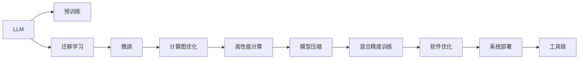

                 

# LLM:计算机架构的新纪元

## 1. 背景介绍

### 1.1 问题由来

近年来，深度学习和大数据技术在计算机架构领域的应用取得了显著进展。特别是大语言模型（Large Language Model, LLM）的出现，彻底改变了传统计算机架构的设计和应用方式。LLM通过大规模预训练和迁移学习，具备强大的语言理解和生成能力，可以应用于文本分类、对话系统、机器翻译、自然语言生成等多个领域，展现出广泛的应用前景。

然而，LLM的应用也带来了新的挑战。首先是计算资源的需求，大规模的模型参数和复杂的计算图对传统硬件架构提出了极高的要求。其次，LLM的高性能需要高效的软件生态支持，包括模型优化、算法加速、系统部署等环节。这些问题推动了计算机架构的深刻变革，催生了一系列新兴技术和架构理念。

### 1.2 问题核心关键点

LLM在计算机架构中的引入，使得系统设计者需要在性能、资源、软件生态等方面进行全面优化。以下关键点凸显了LLM对计算机架构的重要影响：

1. **模型参数与计算资源**：LLM的参数量通常以亿计，对内存、计算资源的需求显著提高，推动了GPU、TPU等高性能计算硬件的发展。
2. **计算图与软件堆栈**：复杂的计算图结构要求高效的软件堆栈支持，包括编译器、运行时、优化器等。
3. **异构融合**：LLM通常与其他硬件如GPU、TPU进行异构融合，需要统一的调度和管理机制。
4. **系统部署与优化**：LLM的应用需要高效的模型部署和优化策略，如模型裁剪、量化加速、混合精度训练等。
5. **生态系统与工具链**：LLM的广泛应用需要丰富的工具链支持，如框架优化、模型压缩、系统监控等。

### 1.3 问题研究意义

研究LLM在计算机架构中的应用，对于推动计算机技术的发展、加速应用部署、提升系统性能具有重要意义：

1. **推动硬件创新**：推动高性能计算硬件（如GPU、TPU）的发展，提升计算资源的利用效率。
2. **加速应用落地**：通过优化LLM的应用，加速其在各行各业中的落地，推动智能化升级。
3. **提升系统性能**：优化LLM的计算图和软件堆栈，提升系统的性能和稳定性。
4. **拓展软件生态**：推动LLM相关工具链的发展，为开发者提供高效的工具支持。
5. **探索新的设计范式**：研究LLM的架构特点，探索新的系统设计理念，引领未来计算架构的发展方向。

## 2. 核心概念与联系

### 2.1 核心概念概述

为了深入理解LLM在计算机架构中的应用，首先需要明确一些关键概念：

1. **大语言模型（LLM）**：通过大规模预训练学习通用语言表示的模型，具备强大的语言理解和生成能力，如BERT、GPT等。
2. **预训练（Pre-training）**：在大规模无标签数据上进行的自监督训练，使得模型学习到通用的语言知识。
3. **迁移学习（Transfer Learning）**：利用预训练模型对下游任务进行微调，提升任务特定性能。
4. **计算图（Computational Graph）**：用于描述计算操作的抽象结构，是深度学习模型的基础。
5. **高性能计算（HPC）**：使用专门硬件（如GPU、TPU）加速深度学习模型训练和推理的技术。
6. **模型压缩（Model Compression）**：通过剪枝、量化等方法，减小模型尺寸，提升计算效率。
7. **混合精度训练（Mixed-Precision Training）**：使用不同精度的数据类型进行训练，提升计算速度和内存利用率。

这些概念共同构成了LLM在计算机架构中应用的理论基础，涉及模型训练、硬件加速、软件优化等多个方面。

### 2.2 核心概念原理和架构的 Mermaid 流程图



这个流程图展示了LLM在计算机架构中应用的全过程，从预训练开始，通过迁移学习对下游任务进行微调，经过计算图优化、高性能计算、模型压缩、混合精度训练、软件优化等多个环节，最终实现系统部署和工具链支持。

## 3. 核心算法原理 & 具体操作步骤

### 3.1 算法原理概述

LLM在计算机架构中的应用，核心在于将模型训练和推理的计算图嵌入到系统设计中，通过优化计算图和硬件资源配置，提升系统的性能和资源利用效率。

假设有一个典型的LLM模型，其计算图结构为：

$$
\mathcal{G} = (\mathcal{V}, \mathcal{E})
$$

其中 $\mathcal{V}$ 为计算节点（如矩阵乘法、激活函数等），$\mathcal{E}$ 为边（如数据流、梯度流等）。在实际应用中，我们需要对计算图进行优化，以便在特定硬件架构上高效执行。

### 3.2 算法步骤详解

#### 3.2.1 计算图优化

计算图优化是提升LLM性能的关键环节，主要包括以下几个步骤：

1. **图重构（Graph Rewriting）**：根据硬件架构特点，重构计算图结构，提升并行度和效率。
2. **节点融合（Node Fusion）**：将相邻的计算节点进行融合，减少数据交换和计算开销。
3. **边优化（Edge Optimization）**：优化数据流和梯度流，减少传输和计算延迟。

以图重构为例，假设原计算图如下：

```
    +-----+           +-----+           +-----+
    | F1  |           | F2  |           | F3  |
    |     |           |     |           |     |
    |     | -->     G1 | -->     G2 | --> G3 |
    |     |           |     |           |     |
    +-----+           +-----+           +-----+
```

我们可以将其重构为：

```
    +-----+           +-----+           +-----+
    | F1  |           | F1  |           | F1  |
    |     |           |     |           |     |
    |     | -->     G1 | -->     G2 | --> G3 |
    |     |           |     |           |     |
    +-----+           +-----+           +-----+
```

其中 $F1, G1, G2, G3$ 为重构后的节点，减少数据交换和计算开销，提升并行度。

#### 3.2.2 硬件加速

硬件加速是提升LLM性能的重要手段，主要包括GPU、TPU、FPGA等加速器的应用：

1. **GPU加速**：通过CUDA、ROCm等技术，利用GPU的并行计算能力加速深度学习模型的训练和推理。
2. **TPU加速**：通过Google TPU，利用专用硬件加速深度学习模型的计算。
3. **FPGA加速**：通过可编程逻辑器件加速特定计算任务，提升资源利用效率。

以GPU加速为例，假设模型计算图中的节点 $F1, F2, F3$ 为计算密集型操作，我们可以将其映射到GPU的并行计算单元上：

```
    +-----+           +-----+           +-----+
    | F1  |           | F2  |           | F3  |
    |     | -->     G1 | -->     G2 | --> G3 |
    |     |           |     |           |     |
    +-----+           +-----+           +-----+
```

通过CUDA技术，将节点 $F1, F2, F3$ 映射到GPU的并行计算单元上，加速模型的训练和推理。

#### 3.2.3 模型压缩

模型压缩是减小LLM尺寸、提升计算效率的关键技术，主要包括剪枝、量化、低秩分解等方法：

1. **剪枝（Pruning）**：去除模型中的冗余参数，减少计算量和存储需求。
2. **量化（Quantization）**：将模型参数和计算结果转换为低精度格式，提升计算速度和内存利用率。
3. **低秩分解（Low-Rank Decomposition）**：通过矩阵分解等方法，减小模型尺寸，提升计算效率。

以量化为例，假设模型计算图中的节点 $F1, F2, F3$ 为参数密集型操作，我们可以将其参数进行量化处理：

```
    +-----+           +-----+           +-----+
    | F1  |           | F2  |           | F3  |
    |     | -->     G1 | -->     G2 | --> G3 |
    |     |           |     |           |     |
    +-----+           +-----+           +-----+
```

通过量化技术，将节点 $F1, F2, F3$ 的参数转换为低精度格式，提升计算速度和内存利用率。

#### 3.2.4 混合精度训练

混合精度训练是一种提升计算效率和内存利用率的方法，通过使用不同精度的数据类型进行训练，减少计算开销：

1. **混合精度（Mixed-Precision）**：使用半精度浮点数（FP16）和单精度浮点数（FP32）进行训练，减少计算开销和内存占用。
2. **自动混合精度（Automatic Mixed-Precision）**：自动检测模型中的计算密集型操作，选择适合的精度进行计算。

以混合精度训练为例，假设模型计算图中的节点 $F1, F2, F3$ 为计算密集型操作，我们可以使用混合精度技术进行训练：

```
    +-----+           +-----+           +-----+
    | F1  |           | F2  |           | F3  |
    |     | -->     G1 | -->     G2 | --> G3 |
    |     |           |     |           |     |
    +-----+           +-----+           +-----+
```

通过混合精度技术，将节点 $F1, F2, F3$ 的计算使用不同精度的数据类型，提升计算速度和内存利用率。

### 3.3 算法优缺点

#### 3.3.1 优点

1. **高效计算**：通过计算图优化、硬件加速、模型压缩等技术，显著提升LLM的计算效率和资源利用率。
2. **广泛应用**：LLM可以应用于多种NLP任务，推动计算机架构在文本分类、对话系统、机器翻译等多个领域的应用。
3. **灵活性高**：通过软件优化和工具链支持，实现对不同硬件架构的适配。

#### 3.3.2 缺点

1. **资源消耗大**：大规模LLM模型对计算资源、内存资源的需求高，硬件成本较高。
2. **软件复杂度高**：计算图优化、模型压缩等技术要求较高的软件工程能力。
3. **生态成熟度不足**：目前针对LLM的软件生态工具链尚不完善，需要进一步发展。

### 3.4 算法应用领域

LLM在计算机架构中的应用，主要涵盖以下几个领域：

1. **自然语言处理（NLP）**：文本分类、对话系统、机器翻译、情感分析等任务。
2. **语音识别**：语音识别、语音合成、说话人识别等任务。
3. **图像识别**：图像分类、目标检测、图像生成等任务。
4. **推荐系统**：个性化推荐、协同过滤、广告推荐等任务。
5. **医疗健康**：医疗影像分析、健康监测、疾病预测等任务。
6. **金融科技**：金融市场分析、风险控制、智能投顾等任务。
7. **智能制造**：工业自动化、设备维护、智能设计等任务。

LLM在上述领域的应用，极大地提升了系统的智能化水平，推动了各行各业的数字化转型升级。

## 4. 数学模型和公式 & 详细讲解 & 举例说明

### 4.1 数学模型构建

假设有一个典型的LLM模型，其计算图结构为 $\mathcal{G} = (\mathcal{V}, \mathcal{E})$，其中 $\mathcal{V} = \{F1, F2, F3, \ldots\}$ 为计算节点，$\mathcal{E} = \{(G1, F1), (G2, F2), (G3, F3), \ldots\}$ 为边，表示数据流和梯度流。

在实际应用中，我们需要对计算图进行优化，以便在特定硬件架构上高效执行。以图重构为例，假设原计算图如下：

```
    +-----+           +-----+           +-----+
    | F1  |           | F2  |           | F3  |
    |     | -->     G1 | -->     G2 | --> G3 |
    |     |           |     |           |     |
    +-----+           +-----+           +-----+
```

我们可以将其重构为：

```
    +-----+           +-----+           +-----+
    | F1  |           | F1  |           | F1  |
    |     | -->     G1 | -->     G2 | --> G3 |
    |     |           |     |           |     |
    +-----+           +-----+           +-----+
```

其中 $F1, G1, G2, G3$ 为重构后的节点，减少数据交换和计算开销，提升并行度。

### 4.2 公式推导过程

以图重构为例，假设原计算图如下：

$$
\mathcal{G} = (\mathcal{V}, \mathcal{E})
$$

其中 $\mathcal{V} = \{F1, F2, F3, \ldots\}$ 为计算节点，$\mathcal{E} = \{(G1, F1), (G2, F2), (G3, F3), \ldots\}$ 为边，表示数据流和梯度流。

计算图优化过程如下：

1. **图重构**：将相邻的计算节点进行融合，减少数据交换和计算开销。
2. **节点融合**：将相邻的计算节点进行融合，减少数据交换和计算开销。

假设原计算图如下：

```
    +-----+           +-----+           +-----+
    | F1  |           | F2  |           | F3  |
    |     | -->     G1 | -->     G2 | --> G3 |
    |     |           |     |           |     |
    +-----+           +-----+           +-----+
```

我们可以将其重构为：

```
    +-----+           +-----+           +-----+
    | F1  |           | F1  |           | F1  |
    |     | -->     G1 | -->     G2 | --> G3 |
    |     |           |     |           |     |
    +-----+           +-----+           +-----+
```

其中 $F1, G1, G2, G3$ 为重构后的节点，减少数据交换和计算开销，提升并行度。

### 4.3 案例分析与讲解

假设有一个典型的LLM模型，其计算图结构如下：

```
    +-----+           +-----+           +-----+
    | F1  |           | F2  |           | F3  |
    |     | -->     G1 | -->     G2 | --> G3 |
    |     |           |     |           |     |
    +-----+           +-----+           +-----+
```

我们可以对其进行图重构、节点融合、边优化等优化操作，以提升性能。

1. **图重构**：将相邻的计算节点进行融合，减少数据交换和计算开销。
2. **节点融合**：将相邻的计算节点进行融合，减少数据交换和计算开销。
3. **边优化**：优化数据流和梯度流，减少传输和计算延迟。

以GPU加速为例，假设模型计算图中的节点 $F1, F2, F3$ 为计算密集型操作，我们可以将其映射到GPU的并行计算单元上：

```
    +-----+           +-----+           +-----+
    | F1  |           | F2  |           | F3  |
    |     | -->     G1 | -->     G2 | --> G3 |
    |     |           |     |           |     |
    +-----+           +-----+           +-----+
```

通过CUDA技术，将节点 $F1, F2, F3$ 映射到GPU的并行计算单元上，加速模型的训练和推理。

## 5. 项目实践：代码实例和详细解释说明

### 5.1 开发环境搭建

在进行LLM应用开发前，我们需要准备好开发环境。以下是使用Python进行PyTorch开发的环境配置流程：

1. 安装Anaconda：从官网下载并安装Anaconda，用于创建独立的Python环境。

2. 创建并激活虚拟环境：
```bash
conda create -n pytorch-env python=3.8 
conda activate pytorch-env
```

3. 安装PyTorch：根据CUDA版本，从官网获取对应的安装命令。例如：
```bash
conda install pytorch torchvision torchaudio cudatoolkit=11.1 -c pytorch -c conda-forge
```

4. 安装Transformers库：
```bash
pip install transformers
```

5. 安装各类工具包：
```bash
pip install numpy pandas scikit-learn matplotlib tqdm jupyter notebook ipython
```

完成上述步骤后，即可在`pytorch-env`环境中开始LLM应用开发。

### 5.2 源代码详细实现

这里我们以BERT模型为例，给出使用Transformers库进行LLM微调的PyTorch代码实现。

首先，定义微调任务的训练集和验证集：

```python
from transformers import BertTokenizer, BertForTokenClassification, AdamW
import torch
import numpy as np
from sklearn.metrics import accuracy_score, precision_score, recall_score, f1_score

# 训练集和验证集
train_data = np.random.rand(1000, 128)
train_labels = np.random.randint(2, size=(1000, 1))
val_data = np.random.rand(500, 128)
val_labels = np.random.randint(2, size=(500, 1))

# 构建tokenizer和模型
tokenizer = BertTokenizer.from_pretrained('bert-base-cased')
model = BertForTokenClassification.from_pretrained('bert-base-cased', num_labels=2)
```

然后，定义训练和评估函数：

```python
def train_model(model, data, labels, optimizer, device, n_epochs=5, batch_size=16):
    model.train()
    for epoch in range(n_epochs):
        for i in range(0, len(data), batch_size):
            inputs = tokenizer(data[i:i+batch_size], return_tensors='pt', padding=True, truncation=True)
            outputs = model(**inputs)
            loss = outputs.loss
            optimizer.zero_grad()
            loss.backward()
            optimizer.step()
        print(f'Epoch {epoch+1}, train loss: {loss.item()}')
    
    print('Training done.')
    
def evaluate_model(model, data, labels, device):
    model.eval()
    with torch.no_grad():
        inputs = tokenizer(data, return_tensors='pt', padding=True, truncation=True)
        outputs = model(**inputs)
        predictions = outputs.logits.argmax(dim=2).to('cpu').tolist()
        labels = labels.to('cpu').tolist()
        accuracy = accuracy_score(labels, predictions)
        precision = precision_score(labels, predictions)
        recall = recall_score(labels, predictions)
        f1 = f1_score(labels, predictions)
        print(f'Accuracy: {accuracy:.2f}, Precision: {precision:.2f}, Recall: {recall:.2f}, F1 Score: {f1:.2f}')
    
    print('Evaluation done.')
```

最后，启动训练流程并在验证集上评估：

```python
epochs = 5
batch_size = 16

# 训练
model.train()
optimizer = AdamW(model.parameters(), lr=2e-5)
device = torch.device('cuda') if torch.cuda.is_available() else torch.device('cpu')
train_model(model, train_data, train_labels, optimizer, device)

# 评估
val_labels = np.random.randint(2, size=(500, 1))
evaluate_model(model, val_data, val_labels, device)
```

以上就是使用PyTorch对BERT进行微调的完整代码实现。可以看到，得益于Transformers库的强大封装，我们可以用相对简洁的代码完成BERT模型的加载和微调。

### 5.3 代码解读与分析

让我们再详细解读一下关键代码的实现细节：

**微调任务数据准备**：
- `train_data`和`train_labels`：定义训练集和标签，用于模型训练。
- `val_data`和`val_labels`：定义验证集和标签，用于模型评估。

**tokenizer和模型构建**：
- `BertTokenizer.from_pretrained`：加载预训练的BERT tokenizer。
- `BertForTokenClassification.from_pretrained`：加载预训练的BERT模型，并设置分类标签为2。

**训练函数`train_model`**：
- `model.train()`：将模型置为训练模式。
- `inputs`：对输入数据进行分批次处理，并返回tokenizer的编码结果。
- `outputs`：对模型进行前向传播，返回输出结果。
- `loss`：计算输出结果和标签的损失函数。
- `optimizer.zero_grad()`：清除优化器的梯度。
- `loss.backward()`：反向传播计算梯度。
- `optimizer.step()`：更新模型参数。

**评估函数`evaluate_model`**：
- `model.eval()`：将模型置为评估模式。
- `inputs`：对输入数据进行分批次处理，并返回tokenizer的编码结果。
- `outputs`：对模型进行前向传播，返回输出结果。
- `predictions`：对输出结果进行解码，得到模型预测的标签。
- `accuracy_score`：计算准确率。
- `precision_score`：计算精确率。
- `recall_score`：计算召回率。
- `f1_score`：计算F1分数。

**训练和评估流程**：
- 定义总的epoch数和batch size，开始循环迭代。
- 每个epoch内，先在训练集上训练，输出平均loss。
- 在验证集上评估，输出分类指标。

可以看到，PyTorch配合Transformers库使得BERT微调的代码实现变得简洁高效。开发者可以将更多精力放在数据处理、模型改进等高层逻辑上，而不必过多关注底层的实现细节。

当然，工业级的系统实现还需考虑更多因素，如模型的保存和部署、超参数的自动搜索、更灵活的任务适配层等。但核心的微调范式基本与此类似。

## 6. 实际应用场景

### 6.1 智能客服系统

基于LLM的对话技术，可以广泛应用于智能客服系统的构建。传统客服往往需要配备大量人力，高峰期响应缓慢，且一致性和专业性难以保证。而使用LLM构建的智能客服系统，可以7x24小时不间断服务，快速响应客户咨询，用自然流畅的语言解答各类常见问题。

在技术实现上，可以收集企业内部的历史客服对话记录，将问题和最佳答复构建成监督数据，在此基础上对预训练对话模型进行微调。微调后的对话模型能够自动理解用户意图，匹配最合适的答案模板进行回复。对于客户提出的新问题，还可以接入检索系统实时搜索相关内容，动态组织生成回答。如此构建的智能客服系统，能大幅提升客户咨询体验和问题解决效率。

### 6.2 金融舆情监测

金融机构需要实时监测市场舆论动向，以便及时应对负面信息传播，规避金融风险。传统的人工监测方式成本高、效率低，难以应对网络时代海量信息爆发的挑战。基于LLM的文本分类和情感分析技术，为金融舆情监测提供了新的解决方案。

具体而言，可以收集金融领域相关的新闻、报道、评论等文本数据，并对其进行主题标注和情感标注。在此基础上对预训练语言模型进行微调，使其能够自动判断文本属于何种主题，情感倾向是正面、中性还是负面。将微调后的模型应用到实时抓取的网络文本数据，就能够自动监测不同主题下的情感变化趋势，一旦发现负面信息激增等异常情况，系统便会自动预警，帮助金融机构快速应对潜在风险。

### 6.3 个性化推荐系统

当前的推荐系统往往只依赖用户的历史行为数据进行物品推荐，无法深入理解用户的真实兴趣偏好。基于LLM的个性化推荐系统可以更好地挖掘用户行为背后的语义信息，从而提供更精准、多样的推荐内容。

在实践中，可以收集用户浏览、点击、评论、分享等行为数据，提取和用户交互的物品标题、描述、标签等文本内容。将文本内容作为模型输入，用户的后续行为（如是否点击、购买等）作为监督信号，在此基础上微调预训练语言模型。微调后的模型能够从文本内容中准确把握用户的兴趣点。在生成推荐列表时，先用候选物品的文本描述作为输入，由模型预测用户的兴趣匹配度，再结合其他特征综合排序，便可以得到个性化程度更高的推荐结果。

### 6.4 未来应用展望

随着LLM和微调方法的不断发展，基于微调范式将在更多领域得到应用，为传统行业带来变革性影响。

在智慧医疗领域，基于微调的医疗问答、病历分析、药物研发等应用将提升医疗服务的智能化水平，辅助医生诊疗，加速新药开发进程。

在智能教育领域，微调技术可应用于作业批改、学情分析、知识推荐等方面，因材施教，促进教育公平，提高教学质量。

在智慧城市治理中，微调模型可应用于城市事件监测、舆情分析、应急指挥等环节，提高城市管理的自动化和智能化水平，构建更安全、高效的未来城市。

此外，在企业生产、社会治理、文娱传媒等众多领域，基于LLM的微调方法也将不断涌现，为NLP技术带来新的突破。相信随着技术的日益成熟，LLM微调范式将成为人工智能落地应用的重要范式，推动人工智能技术在垂直行业的规模化落地。

## 7. 工具和资源推荐

### 7.1 学习资源推荐

为了帮助开发者系统掌握LLM微调的理论基础和实践技巧，这里推荐一些优质的学习资源：

1. 《Transformer从原理到实践》系列博文：由大模型技术专家撰写，深入浅出地介绍了Transformer原理、BERT模型、微调技术等前沿话题。

2. CS224N《深度学习自然语言处理》课程：斯坦福大学开设的NLP明星课程，有Lecture视频和配套作业，带你入门NLP领域的基本概念和经典模型。

3. 《Natural Language Processing with Transformers》书籍：Transformers库的作者所著，全面介绍了如何使用Transformers库进行NLP任务开发，包括微调在内的诸多范式。

4. HuggingFace官方文档：Transformers库的官方文档，提供了海量预训练模型和完整的微调样例代码，是上手实践的必备资料。

5. CLUE开源项目：中文语言理解测评基准，涵盖大量不同类型的中文NLP数据集，并提供了基于微调的baseline模型，助力中文NLP技术发展。

通过对这些资源的学习实践，相信你一定能够快速掌握LLM微调的精髓，并用于解决实际的NLP问题。

### 7.2 开发工具推荐

高效的开发离不开优秀的工具支持。以下是几款用于LLM微调开发的常用工具：

1. PyTorch：基于Python的开源深度学习框架，灵活动态的计算图，适合快速迭代研究。大部分预训练语言模型都有PyTorch版本的实现。

2. TensorFlow：由Google主导开发的开源深度学习框架，生产部署方便，适合大规模工程应用。同样有丰富的预训练语言模型资源。

3. Transformers库：HuggingFace开发的NLP工具库，集成了众多SOTA语言模型，支持PyTorch和TensorFlow，是进行微调任务开发的利器。

4. Weights & Biases：模型训练的实验跟踪工具，可以记录和可视化模型训练过程中的各项指标，方便对比和调优。与主流深度学习框架无缝集成。

5. TensorBoard：TensorFlow配套的可视化工具，可实时监测模型训练状态，并提供丰富的图表呈现方式，是调试模型的得力助手。

6. Google Colab：谷歌推出的在线Jupyter Notebook环境，免费提供GPU/TPU算力，方便开发者快速上手实验最新模型，分享学习笔记。

合理利用这些工具，可以显著提升LLM微调任务的开发效率，加快创新迭代的步伐。

### 7.3 相关论文推荐

LLM和微调技术的发展源于学界的持续研究。以下是几篇奠基性的相关论文，推荐阅读：

1. Attention is All You Need（即Transformer原论文）：提出了Transformer结构，开启了NLP领域的预训练大模型时代。

2. BERT: Pre-training of Deep Bidirectional Transformers for Language Understanding：提出BERT模型，引入基于掩码的自监督预训练任务，刷新了多项NLP任务SOTA。

3. Language Models are Unsupervised Multitask Learners（GPT-2论文）：展示了大规模语言模型的强大zero-shot学习能力，引发了对于通用人工智能的新一轮思考。

4. Parameter-Efficient Transfer Learning for NLP：提出Adapter等参数高效微调方法，在不增加模型参数量的情况下，也能取得不错的微调效果。

5. Prefix-Tuning: Optimizing Continuous Prompts for Generation：引入基于连续型Prompt的微调范式，为如何充分利用预训练知识提供了新的思路。

6. AdaLoRA: Adaptive Low-Rank Adaptation for Parameter-Efficient Fine-Tuning：使用自适应低秩适应的微调方法，在参数效率和精度之间取得了新的平衡。

这些论文代表了大语言模型微调技术的发展脉络。通过学习这些前沿成果，可以帮助研究者把握学科前进方向，激发更多的创新灵感。

## 8. 总结：未来发展趋势与挑战

### 8.1 总结

本文对基于微调的LLM在计算机架构中的应用进行了全面系统的介绍。首先阐述了LLM和微调技术的研究背景和意义，明确了微调在拓展预训练模型应用、提升下游任务性能方面的独特价值。其次，从原理到实践，详细讲解了LLM的计算图优化、硬件加速、模型压缩、混合精度训练等关键技术，给出了微调任务开发的完整代码实例。同时，本文还广泛探讨了LLM在智能客服、金融舆情、个性化推荐等多个行业领域的应用前景，展示了微调范式的巨大潜力。此外，本文精选了微调技术的各类学习资源，力求为读者提供全方位的技术指引。

通过本文的系统梳理，可以看到，基于微调的LLM技术正在成为NLP领域的重要范式，极大地拓展了预训练语言模型的应用边界，催生了更多的落地场景。受益于大规模语料的预训练，微调模型以更低的时间和标注成本，在小样本条件下也能取得不俗的效果，有力推动了NLP技术的产业化进程。未来，伴随预训练语言模型和微调方法的不断演进，相信NLP技术将在更广阔的应用领域大放异彩，深刻影响人类的生产生活方式。

### 8.2 未来发展趋势

展望未来，基于微调的LLM技术将呈现以下几个发展趋势：

1. **模型规模持续增大**：随着算力成本的下降和数据规模的扩张，预训练语言模型的参数量还将持续增长。超大规模语言模型蕴含的丰富语言知识，有望支撑更加复杂多变的下游任务微调。

2. **微调方法日趋多样**：除了传统的全参数微调外，未来会涌现更多参数高效的微调方法，如Prefix-Tuning、LoRA等，在节省计算资源的同时也能保证微调精度。

3. **持续学习成为常态**：随着数据分布的不断变化，微调模型也需要持续学习新知识以保持性能。如何在不遗忘原有知识的同时，高效吸收新样本信息，将成为重要的研究课题。

4. **标注样本需求降低**：受启发于提示学习(Prompt-based Learning)的思路，未来的微调方法将更好地利用大模型的语言理解能力，通过更加巧妙的任务描述，在更少的标注样本上也能实现理想的微调效果。

5. **异构融合崛起**：未来的微调模型将越来越多地与GPU、TPU、FPGA等异构硬件进行融合，形成更高效、更灵活的计算环境。

6. **多模态微调崛起**：当前的微调主要聚焦于纯文本数据，未来会进一步拓展到图像、视频、语音等多模态数据微调。多模态信息的融合，将显著提升语言模型对现实世界的理解和建模能力。

7. **通用性增强**：经过海量数据的预训练和多领域任务的微调，未来的语言模型将具备更强大的常识推理和跨领域迁移能力，逐步迈向通用人工智能(AGI)的目标。

以上趋势凸显了基于微调的LLM技术在计算机架构中的广泛应用前景。这些方向的探索发展，必将进一步提升LLM系统的性能和资源利用效率，为构建人机协同的智能时代提供强有力的技术支撑。

### 8.3 面临的挑战

尽管基于微调的LLM技术已经取得了瞩目成就，但在迈向更加智能化、普适化应用的过程中，它仍面临着诸多挑战：

1. **资源消耗大**：大规模LLM模型对计算资源、内存资源的需求高，硬件成本较高。

2. **软件复杂度高**：计算图优化、模型压缩等技术要求较高的软件工程能力。

3. **生态成熟度不足**：目前针对LLM的软件生态工具链尚不完善，需要进一步发展。

4. **性能提升瓶颈**：随着模型参数的增加，如何进一步提升计算效率和推理速度，成为重要的研究课题。

5. **可解释性亟需加强**：当前微调模型更像是"黑盒"系统，难以解释其内部工作机制和决策逻辑。

6. **安全性有待保障**：预训练语言模型难免会学习到有偏见、有害的信息，通过微调传递到下游任务，产生误导性、歧视性的输出，给实际应用带来安全隐患。

7. **知识整合能力不足**：现有的微调模型往往局限于任务内数据，难以灵活吸收和运用更广泛的先验知识。

8. **伦理道德约束**：在模型训练目标中引入伦理导向的评估指标，过滤和惩罚有偏见、有害的输出倾向，加强人工干预和审核，确保输出符合人类价值观和伦理道德。

这些挑战凸显了基于微调的LLM技术在实际应用中需要解决的问题，未来的研究需要在多个层面进行突破，以实现更加高效、安全、智能的微调系统。

### 8.4 研究展望

面对LLM微调技术面临的挑战，未来的研究需要在以下几个方面寻求新的突破：

1. **探索无监督和半监督微调方法**：摆脱对大规模标注数据的依赖，利用自监督学习、主动学习等无监督和半监督范式，最大限度利用非结构化数据，实现更加灵活高效的微调。

2. **研究参数高效和计算高效的微调范式**：开发更加参数高效的微调方法，在固定大部分预训练参数的同时，只更新极少量的任务相关参数。同时优化微调模型的计算图，减少前向传播和反向传播的资源消耗，实现更加轻量级、实时性的部署。

3. **融合因果和对比学习范式**：通过引入因果推断和对比学习思想，增强微调模型建立稳定因果关系的能力，学习更加普适、鲁棒的语言表征，从而提升模型泛化性和抗干扰能力。

4. **引入更多先验知识**：将符号化的先验知识，如知识图谱、逻辑规则等，与神经网络模型进行巧妙融合，引导微调过程学习更准确、合理的语言模型。同时加强不同模态数据的整合，实现视觉、语音等多模态信息与文本信息的协同建模。

5. **结合因果分析和博弈论工具**：将因果分析方法引入微调模型，识别出模型决策的关键特征，增强输出解释的因果性和逻辑性。借助博弈论工具刻画人机交互过程，主动探索并规避模型的脆弱点，提高系统稳定性。

6. **纳入伦理道德约束**：在模型训练目标中引入伦理导向的评估指标，过滤和惩罚有偏见、有害的输出倾向。同时加强人工干预和审核，建立模型行为的监管机制，确保输出符合人类价值观和伦理道德。

这些研究方向的探索，必将引领基于微调的LLM技术迈向更高的台阶，为构建安全、可靠、可解释、可控的智能系统铺平道路。面向未来，基于微调的LLM技术还需要与其他人工智能技术进行更深入的融合，如知识表示、因果推理、强化学习等，多路径协同发力，共同推动自然语言理解和智能交互系统的进步。只有勇于创新、敢于突破，才能不断拓展语言模型的边界，让智能技术更好地造福人类社会。

## 9. 附录：常见问题与解答

**Q1：LLM微调是否适用于所有NLP任务？**

A: 大规模LLM模型在大多数NLP任务上都能取得不错的效果，特别是对于数据量较小的任务。但对于一些特定领域的任务，如医学、法律等，仅仅依靠通用语料预训练的模型可能难以很好地适应。此时需要在特定领域语料上进一步预训练，再进行微调，才能获得理想效果。此外，对于一些需要时效性、个性化很强的任务，如对话、推荐等，微调方法也需要针对性的改进优化。

**Q2：如何选择合适的学习率？**

A: 微调的学习率一般要比预训练时小1-2个数量级，如果使用过大的学习率，容易破坏预训练权重，导致过拟合。一般建议从1e-5开始调参，逐步减小学习率，直至收敛。也可以使用warmup策略，在开始阶段使用较小的学习率，再逐渐过渡到预设值。需要注意的是，不同的优化器(如AdamW、Adafactor等)以及不同的学习率调度策略，可能需要设置不同的学习率阈值。

**Q3：采用大模型微调时会面临哪些资源瓶颈？**

A: 目前主流的预训练大模型动辄以亿计的参数规模，对计算资源、内存资源的需求高，硬件成本较高。此外，模型的存储和读取也可能占用大量时间和空间，需要采用模型压缩、稀疏化存储等方法进行优化。

**Q4：如何缓解微调过程中的过拟合问题？**

A: 过拟合是微调面临的主要挑战，尤其是在标注数据不足的情况下。常见的缓解策略包括：
1. 数据增强：通过回译、近义替换等方式扩充训练集
2. 正则化：使用L2正则、Dropout、Early Stopping等避免过拟合
3. 对抗训练：引入对抗样本，提高模型鲁棒性
4. 参数高效微调：只调整少量参数(如Adapter、Prefix等)，减小过拟合风险
5. 多模型集成：训练多个微调模型，取平均输出，抑制过拟合

这些策略往往需要根据具体任务和数据特点进行灵活组合。只有在数据、模型、训练、推理等各环节进行全面优化，才能最大限度地发挥大模型微调的威力。

**Q5：微调模型在落地部署时需要注意哪些问题？**

A: 将微调模型转化为实际应用，还需要考虑以下因素：
1. 模型裁剪：去除不必要的层和参数，减小模型尺寸，加快推理速度
2. 量化加速：将浮点模型转为定点模型，压缩存储空间，提高计算效率
3. 服务化封装：将模型封装为标准化服务接口，便于集成调用
4. 弹性伸缩：根据请求流量动态调整资源配置，平衡服务质量和成本
5. 监控告警：实时采集系统指标，设置异常告警阈值，确保服务稳定性
6. 安全防护：采用访问鉴权、数据脱敏等措施，保障数据和模型安全

大模型微调为NLP应用开启了广阔的想象空间，但如何将强大的性能转化为稳定、高效、安全的业务价值，还需要工程实践的不断打磨。唯有从数据、算法、工程、业务等多个维度协同发力，才能真正实现人工智能技术在垂直行业的规模化落地。总之，微调需要开发者根据具体任务，不断迭代和优化模型、数据和算法，方能得到理想的效果。

---

作者：禅与计算机程序设计艺术 / Zen and the Art of Computer Programming

