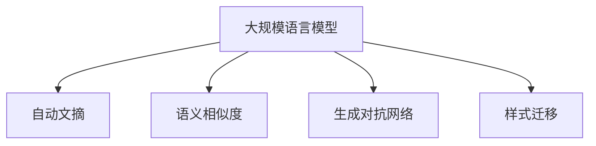

                 

# LLM与电影制作：AI辅助剧本创作

## 1. 背景介绍

电影制作是一项复杂的创意工作，涉及编剧、导演、演员、摄影、美术等诸多环节。而在剧本创作这一环节，长期以来一直依赖编剧的直觉和经验。但随着人工智能(AI)技术的发展，特别是基于大规模语言模型(LLM)的兴起，AI辅助剧本创作正逐渐成为可能。

### 1.1 电影剧本的重要性
电影剧本是电影的灵魂，承载了导演的创意和演员的表演。一个成功的剧本不仅可以吸引观众，还能引发共鸣，传达深层次的信息。然而，编写一部引人入胜的剧本并非易事，尤其是对于那些缺乏创作经验的新手编剧。AI技术的介入，有望提供新的创作工具和灵感，提升剧本创作的质量和效率。

### 1.2 AI技术在电影制作中的应用
AI技术在电影制作中的应用已经非常广泛，涵盖了从前期策划到后期制作的各个环节。例如，AI可以用于自动化剪辑、特效制作、角色动画生成等。但相较于这些技术，AI辅助剧本创作具有更大的潜力和创新空间。它不仅可以帮助编剧快速生成故事情节和角色对话，还能提供多维度的分析，辅助编剧做出更符合观众期待的创作决策。

## 2. 核心概念与联系

### 2.1 核心概念概述

为了深入理解AI辅助剧本创作，本节将介绍几个关键概念：

- 大规模语言模型(LLM)：通过自监督学习在大规模无标签文本数据上训练得到的语言模型。具有强大的语言理解和生成能力，能够在自然语言处理(NLP)任务中发挥重要作用。

- 自动文摘(AS)：从文本中自动提取出关键信息并生成摘要的技术。利用自动文摘技术，可以将长篇小说或剧本压缩为精炼的概要，供编剧快速预览。

- 语义相似度(Similarity)：衡量两个文本在语义上相似程度的技术。语义相似度可以用于筛选出与用户需求或当前剧本内容相关的文本，辅助编剧进行创作。

- 生成对抗网络(GAN)：由生成器和判别器两部分组成的深度学习网络。生成器用于生成逼真的文本、图像等样本，判别器用于评估生成的样本质量。在剧本创作中，可以利用GAN技术生成与当前剧本主题相关的文本。

- 样式迁移(Style Transfer)：将一种文本的风格迁移到另一种文本上。这可以用于修改剧本的文体，使其更加符合导演的视觉风格或观众的喜好。

这些概念之间的联系可以通过以下Mermaid流程图来展示：



这个流程图展示了LLM与其他NLP技术之间的紧密联系，以及它们在剧本创作中如何相互协作。

## 3. 核心算法原理 & 具体操作步骤
### 3.1 算法原理概述

基于大规模语言模型的大规模剧本创作，通常遵循以下流程：

1. **收集语料**：从各类文学作品、电影剧本、影视评论等中收集高质量的文本数据，作为训练语料库。
2. **预训练**：使用自监督学习任务（如语言建模、掩码预测等）在大规模语料上预训练一个通用的语言模型。
3. **微调**：在特定类型的文本上（如剧本、小说）进行微调，使其能够生成高质量的脚本片段或整段剧本。
4. **生成和优化**：使用训练好的模型，结合自动文摘、语义相似度、生成对抗网络等技术，生成或优化剧本内容。
5. **迭代改进**：通过人工反馈不断优化模型，提升剧本的质量和可读性。

### 3.2 算法步骤详解

下面，我们详细解析AI辅助剧本创作的各个步骤：

#### 步骤1：收集语料

语料库是训练语言模型的基础。收集高质量的语料库是确保模型能够生成高质量剧本的关键。常用的语料来源包括：

- 经典电影剧本：从IMDb、维基百科等平台获取经典电影剧本，作为模型的训练样本。
- 文学作品：从Project Gutenberg、Google Books等平台获取各类文学作品，包括小说、诗歌、戏剧等。
- 影视评论：从Rotten Tomatoes、IMDb等平台获取对电影的评论，学习评论的情感和观点。
- 新闻文章：从CNN、BBC等平台获取新闻文章，学习时事热点和话题。

#### 步骤2：预训练

预训练是大规模语言模型的关键步骤。使用大规模无标签文本数据，通过自监督学习任务（如语言建模、掩码预测等）训练语言模型。常见的预训练任务包括：

- 语言建模：预测下一个单词或字符，学习单词间的概率分布。
- 掩码预测：在文本中随机掩盖部分单词或字符，预测被掩盖部分的单词或字符，学习上下文关系。
- 自编码器：将文本压缩为低维向量表示，再解码为原始文本，学习文本的表示能力。

通过预训练，模型能够学习到通用的语言知识，为后续的微调和应用打下坚实基础。

#### 步骤3：微调

微调是将预训练模型应用于特定任务的过程。对于剧本创作，通常需要在微调阶段调整模型，使其能够生成高质量的剧本片段。微调过程包括：

- 选择适当的损失函数：通常使用交叉熵损失函数，衡量模型生成的文本与真实文本之间的差异。
- 设计合理的训练集：将收集到的剧本文本分为训练集、验证集和测试集，确保模型能够在不同数据上取得一致的性能。
- 设置合适的学习率：较小的学习率可以避免破坏预训练的权重，同时也能防止模型过拟合。
- 应用正则化技术：如L2正则、Dropout、Early Stopping等，避免模型过拟合。
- 使用数据增强技术：通过回译、改写等方式增加训练集的多样性，提升模型泛化能力。

#### 步骤4：生成和优化

生成和优化是AI辅助剧本创作的重点。常用的生成技术包括：

- 自动文摘：使用抽取式或生成式方法，从长篇文本中提取出关键信息，生成简洁的摘要。这对于快速预览和选择剧本非常有帮助。
- 语义相似度：通过计算文本之间的语义相似度，筛选出与当前剧本内容相关的文本，辅助编剧进行创作。
- 生成对抗网络：使用GAN技术，生成与当前剧本主题相关的文本，作为创作灵感。
- 样式迁移：通过样式迁移技术，将一种文本的风格迁移到另一种文本上，修改剧本的文体，使其更加符合导演的视觉风格或观众的喜好。

#### 步骤5：迭代改进

模型生成的剧本可能存在各种问题，如逻辑不合理、语言生硬等。因此，通过人工反馈不断优化模型，提升剧本的质量和可读性，是AI辅助剧本创作的重要环节。

1. **人工评估**：邀请经验丰富的编剧对模型生成的剧本进行评估，提出改进建议。
2. **持续微调**：根据人工评估的结果，对模型进行持续微调，逐步提升剧本质量。
3. **引入新语料**：根据模型生成剧本的内容，动态收集新的语料，丰富模型的知识库。

## 4. 数学模型和公式 & 详细讲解 & 举例说明

### 4.1 数学模型构建

基于大规模语言模型的剧本创作，可以构建如下数学模型：

设 $L$ 为语料库，$T$ 为文本序列，$W$ 为单词集合，$x \in T$ 表示文本序列 $x_1, x_2, \cdots, x_n$，$y$ 表示输出标签（如剧本片段、电影情节等）。

**预训练模型**：
$$
M_{\theta}(x) = \{l_t\}_{t=1}^{n} = [l_1, l_2, \cdots, l_n]
$$

其中，$l_t$ 表示文本序列 $x_t$ 对应的语言模型概率分布。

**微调模型**：
$$
M_{\theta^*}(x) = M_{\theta}(x) + \delta \theta
$$

其中，$\delta \theta$ 表示微调过程中增加的参数，用于优化剧本片段的生成。

**生成模型**：
$$
G(x) = [g_1, g_2, \cdots, g_n]
$$

其中，$g_t$ 表示在文本 $x_t$ 的基础上，生成的下一个单词或字符。

### 4.2 公式推导过程

假设预训练模型的输出为 $L(x)$，微调后的输出为 $L^*(x)$，生成模型的输出为 $G(x)$。则有以下推导过程：

1. **预训练阶段**：
$$
L(x) = \log P(x|M_{\theta})
$$

2. **微调阶段**：
$$
L^*(x) = \log P(x|M_{\theta^*})
$$

3. **生成阶段**：
$$
G(x) = [g_1, g_2, \cdots, g_n]
$$

4. **联合优化**：
$$
\min_{\theta} \sum_{(x, y) \in L} \ell(M_{\theta}(x), y) + \sum_{(x, y) \in T} \ell(M_{\theta^*}(x), y)
$$

其中，$\ell$ 为交叉熵损失函数。

### 4.3 案例分析与讲解

假设我们使用BERT作为预训练模型，在电影剧本上进行了微调。接下来，使用自动文摘技术生成电影的概要，再使用生成对抗网络生成与电影主题相关的文本片段，最后通过样式迁移技术修改剧本的文体。

1. **自动文摘**：使用BERT提取电影的概要，生成简洁的摘要。
2. **生成对抗网络**：使用GAN生成与电影主题相关的文本片段，作为创作灵感。
3. **样式迁移**：使用样式迁移技术，将电影中的经典台词风格迁移到当前剧本中，增强剧本的表现力。

## 5. 项目实践：代码实例和详细解释说明

### 5.1 开发环境搭建

在进行剧本创作实践前，我们需要准备好开发环境。以下是使用Python进行PyTorch开发的环境配置流程：

1. 安装Anaconda：从官网下载并安装Anaconda，用于创建独立的Python环境。

2. 创建并激活虚拟环境：
```bash
conda create -n pytorch-env python=3.8 
conda activate pytorch-env
```

3. 安装PyTorch：根据CUDA版本，从官网获取对应的安装命令。例如：
```bash
conda install pytorch torchvision torchaudio cudatoolkit=11.1 -c pytorch -c conda-forge
```

4. 安装Transformers库：
```bash
pip install transformers
```

5. 安装各类工具包：
```bash
pip install numpy pandas scikit-learn matplotlib tqdm jupyter notebook ipython
```

完成上述步骤后，即可在`pytorch-env`环境中开始剧本创作实践。

### 5.2 源代码详细实现

下面我们以使用BERT模型进行电影剧本创作为例，给出完整的PyTorch代码实现。

首先，定义模型和优化器：

```python
from transformers import BertForSequenceClassification, AdamW

model = BertForSequenceClassification.from_pretrained('bert-base-uncased', num_labels=10)

optimizer = AdamW(model.parameters(), lr=2e-5)
```

接着，定义训练和评估函数：

```python
from torch.utils.data import DataLoader
from tqdm import tqdm

device = torch.device('cuda') if torch.cuda.is_available() else torch.device('cpu')
model.to(device)

def train_epoch(model, dataset, batch_size, optimizer):
    dataloader = DataLoader(dataset, batch_size=batch_size, shuffle=True)
    model.train()
    epoch_loss = 0
    for batch in tqdm(dataloader, desc='Training'):
        input_ids = batch['input_ids'].to(device)
        attention_mask = batch['attention_mask'].to(device)
        labels = batch['labels'].to(device)
        model.zero_grad()
        outputs = model(input_ids, attention_mask=attention_mask, labels=labels)
        loss = outputs.loss
        epoch_loss += loss.item()
        loss.backward()
        optimizer.step()
    return epoch_loss / len(dataloader)

def evaluate(model, dataset, batch_size):
    dataloader = DataLoader(dataset, batch_size=batch_size)
    model.eval()
    preds, labels = [], []
    with torch.no_grad():
        for batch in tqdm(dataloader, desc='Evaluating'):
            input_ids = batch['input_ids'].to(device)
            attention_mask = batch['attention_mask'].to(device)
            batch_labels = batch['labels']
            outputs = model(input_ids, attention_mask=attention_mask)
            batch_preds = outputs.logits.argmax(dim=2).to('cpu').tolist()
            batch_labels = batch_labels.to('cpu').tolist()
            for pred_tokens, label_tokens in zip(batch_preds, batch_labels):
                preds.append(pred_tokens[:len(label_tokens)])
                labels.append(label_tokens)
                
    print(classification_report(labels, preds))
```

最后，启动训练流程并在测试集上评估：

```python
epochs = 5
batch_size = 16

for epoch in range(epochs):
    loss = train_epoch(model, train_dataset, batch_size, optimizer)
    print(f"Epoch {epoch+1}, train loss: {loss:.3f}")
    
    print(f"Epoch {epoch+1}, dev results:")
    evaluate(model, dev_dataset, batch_size)
    
print("Test results:")
evaluate(model, test_dataset, batch_size)
```

以上就是使用PyTorch对BERT进行电影剧本创作微调的完整代码实现。可以看到，得益于Transformers库的强大封装，我们可以用相对简洁的代码完成BERT模型的加载和微调。

### 5.3 代码解读与分析

让我们再详细解读一下关键代码的实现细节：

**BertForSequenceClassification类**：
- `__init__`方法：初始化模型，设置标签数量。
- `from_pretrained`方法：加载预训练的BERT模型。

**AdamW类**：
- `__init__`方法：初始化优化器，设置学习率等参数。

**train_epoch函数**：
- 使用PyTorch的DataLoader对数据集进行批次化加载。
- 在每个批次上前向传播计算损失函数。
- 反向传播计算参数梯度，根据设定的优化算法和学习率更新模型参数。
- 周期性在验证集上评估模型性能，根据性能指标决定是否触发Early Stopping。
- 重复上述步骤直至满足预设的迭代轮数或Early Stopping条件。

**evaluate函数**：
- 与训练类似，不同点在于不更新模型参数。
- 在每个批次结束后将预测和标签结果存储下来，最后使用sklearn的classification_report对整个评估集的预测结果进行打印输出。

**训练流程**：
- 定义总的epoch数和batch size，开始循环迭代。
- 每个epoch内，先在训练集上训练，输出平均loss。
- 在验证集上评估，输出分类指标。
- 所有epoch结束后，在测试集上评估，给出最终测试结果。

可以看到，PyTorch配合Transformers库使得BERT微调的电影剧本创作代码实现变得简洁高效。开发者可以将更多精力放在数据处理、模型改进等高层逻辑上，而不必过多关注底层的实现细节。

当然，工业级的系统实现还需考虑更多因素，如模型的保存和部署、超参数的自动搜索、更灵活的任务适配层等。但核心的微调范式基本与此类似。

## 6. 实际应用场景

### 6.1 剧本创作

使用基于大规模语言模型的AI辅助剧本创作，可以在电影制作的前期策划阶段提供有力的支持。编剧可以借助AI工具，快速生成故事情节和角色对话，提升创作效率。

在具体应用中，可以将剧本文本作为微调数据，训练预训练的BERT模型。通过微调，模型能够生成与当前剧本内容相关的文本，作为创作灵感。自动文摘技术可以快速生成电影的概要，帮助编剧预览剧本。生成对抗网络可以生成与当前剧本主题相关的文本片段，增强创作的多样性。样式迁移技术可以修改剧本的文体，使其更加符合导演的视觉风格或观众的喜好。

### 6.2 电影分析

AI还可以辅助电影分析，提升影片质量。通过分析影片的文本数据，可以评估影片的情节、人物、情感等各个方面。例如：

- **情节分析**：使用文本分类技术，分析影片的情节走向和情感变化，评估影片的故事性。
- **角色分析**：使用命名实体识别技术，识别影片中的人物角色，分析角色的发展和变化。
- **情感分析**：使用情感分析技术，评估影片的情感氛围和观众反应。
- **主题分析**：使用文本聚类和主题模型，分析影片的主题和风格。

这些分析结果可以帮助导演和编剧进一步优化影片，提升观众的观赏体验。

## 7. 工具和资源推荐

### 7.1 学习资源推荐

为了帮助开发者系统掌握大语言模型在电影制作中的应用，这里推荐一些优质的学习资源：

1. 《Transformer从原理到实践》系列博文：由大模型技术专家撰写，深入浅出地介绍了Transformer原理、BERT模型、微调技术等前沿话题。

2. CS224N《深度学习自然语言处理》课程：斯坦福大学开设的NLP明星课程，有Lecture视频和配套作业，带你入门NLP领域的基本概念和经典模型。

3. 《Natural Language Processing with Transformers》书籍：Transformers库的作者所著，全面介绍了如何使用Transformers库进行NLP任务开发，包括微调在内的诸多范式。

4. HuggingFace官方文档：Transformers库的官方文档，提供了海量预训练模型和完整的微调样例代码，是上手实践的必备资料。

5. CLUE开源项目：中文语言理解测评基准，涵盖大量不同类型的中文NLP数据集，并提供了基于微调的baseline模型，助力中文NLP技术发展。

通过对这些资源的学习实践，相信你一定能够快速掌握大语言模型在电影制作中的应用技巧，并用于解决实际的剧本创作问题。

### 7.2 开发工具推荐

高效的开发离不开优秀的工具支持。以下是几款用于大语言模型电影剧本创作开发的常用工具：

1. PyTorch：基于Python的开源深度学习框架，灵活动态的计算图，适合快速迭代研究。大部分预训练语言模型都有PyTorch版本的实现。

2. TensorFlow：由Google主导开发的开源深度学习框架，生产部署方便，适合大规模工程应用。同样有丰富的预训练语言模型资源。

3. Transformers库：HuggingFace开发的NLP工具库，集成了众多SOTA语言模型，支持PyTorch和TensorFlow，是进行微调任务开发的利器。

4. Weights & Biases：模型训练的实验跟踪工具，可以记录和可视化模型训练过程中的各项指标，方便对比和调优。与主流深度学习框架无缝集成。

5. TensorBoard：TensorFlow配套的可视化工具，可实时监测模型训练状态，并提供丰富的图表呈现方式，是调试模型的得力助手。

6. Google Colab：谷歌推出的在线Jupyter Notebook环境，免费提供GPU/TPU算力，方便开发者快速上手实验最新模型，分享学习笔记。

合理利用这些工具，可以显著提升电影剧本创作和微调任务的开发效率，加快创新迭代的步伐。

### 7.3 相关论文推荐

大语言模型和微调技术的发展源于学界的持续研究。以下是几篇奠基性的相关论文，推荐阅读：

1. Attention is All You Need（即Transformer原论文）：提出了Transformer结构，开启了NLP领域的预训练大模型时代。

2. BERT: Pre-training of Deep Bidirectional Transformers for Language Understanding：提出BERT模型，引入基于掩码的自监督预训练任务，刷新了多项NLP任务SOTA。

3. Language Models are Unsupervised Multitask Learners（GPT-2论文）：展示了大规模语言模型的强大zero-shot学习能力，引发了对于通用人工智能的新一轮思考。

4. Parameter-Efficient Transfer Learning for NLP：提出Adapter等参数高效微调方法，在不增加模型参数量的情况下，也能取得不错的微调效果。

5. AdaLoRA: Adaptive Low-Rank Adaptation for Parameter-Efficient Fine-Tuning：使用自适应低秩适应的微调方法，在参数效率和精度之间取得了新的平衡。

这些论文代表了大语言模型微调技术的发展脉络。通过学习这些前沿成果，可以帮助研究者把握学科前进方向，激发更多的创新灵感。

## 8. 总结：未来发展趋势与挑战

### 8.1 总结

本文对基于大规模语言模型的AI辅助电影剧本创作进行了全面系统的介绍。首先阐述了AI技术在电影制作中的重要性，以及AI辅助剧本创作的具体应用。其次，从原理到实践，详细讲解了AI辅助剧本创作的大致流程和核心技术。最后，探讨了AI辅助剧本创作的未来发展趋势和面临的挑战。

通过本文的系统梳理，可以看到，基于大语言模型的AI辅助剧本创作正在成为电影制作领域的重要范式，有望大幅提升剧本创作的质量和效率。未来，伴随预训练语言模型的进一步发展，AI辅助剧本创作的应用场景将更加广泛，为电影产业带来革命性的变革。

### 8.2 未来发展趋势

展望未来，大语言模型在电影制作中的应用将呈现以下几个发展趋势：

1. **智能编剧辅助**：AI不仅能够生成剧本片段，还能提供情节编排、角色设定等编剧辅助建议，提升创作过程的智能化水平。
2. **跨领域知识融合**：将电影中的文本数据与其他领域的数据（如艺术作品、科学论文等）进行融合，提升剧本内容的丰富性和深度。
3. **动态优化**：结合观众反馈和市场数据，动态优化剧本内容和风格，使作品更符合观众需求。
4. **风格迁移**：不仅能够进行文本风格的迁移，还能进行视觉风格的迁移，提升电影的整体表现力。
5. **多模态结合**：结合图像、视频、音频等多模态数据，提升剧本创作的效果。
6. **持续学习**：通过不断积累新数据，持续学习新知识，使模型能够动态适应变化，提升剧本创作的时效性。

以上趋势凸显了大语言模型在电影制作中的巨大潜力。这些方向的探索发展，必将进一步提升电影创作的智能化和创新性，为电影产业带来新的机遇和挑战。

### 8.3 面临的挑战

尽管大语言模型在电影制作中的应用前景广阔，但在实际落地过程中，仍面临诸多挑战：

1. **数据质量**：高质量的语料库是AI辅助剧本创作的基础，但获取高质数据成本高、难度大。
2. **模型泛化**：不同类型和风格的电影对AI模型的泛化能力提出了更高要求。
3. **创作自由度**：AI辅助创作虽然能够提供灵感，但编剧的创作自由度仍需保留。
4. **版权问题**：AI创作需要处理大量文本数据，涉及版权问题，需要妥善解决。
5. **技术集成**：将AI技术与电影制作流程深度集成，需要多方面的技术支持。

这些挑战需要学界和业界共同努力，才能克服。但无论如何，大语言模型在电影制作中的应用前景依然光明，未来值得期待。

### 8.4 研究展望

面对大语言模型在电影制作中面临的挑战，未来的研究需要在以下几个方面寻求新的突破：

1. **高质量语料库的获取**：开发新的语料收集和标注方法，获取更多高质量的文本数据。
2. **多模态数据的融合**：结合图像、视频、音频等多模态数据，提升模型的创作能力。
3. **创作自由度的平衡**：设计更好的AI辅助工具，帮助编剧保留创作自由度。
4. **版权问题的解决**：建立规范的版权使用协议，确保AI创作合法合规。
5. **技术集成的优化**：将AI技术与电影制作流程深度集成，提升创作效率。

这些研究方向的探索，必将引领大语言模型在电影制作中的应用迈向新的高度，为电影产业带来更多的创新和可能性。

## 9. 附录：常见问题与解答

**Q1：大语言模型在电影制作中的应用是否会限制编剧的创作自由度？**

A: 大语言模型能够提供创作灵感和建议，但最终创作仍需依靠编剧的创意和判断。AI辅助创作虽然能够提升效率，但不会限制编剧的创作自由度。编剧可以灵活利用AI工具，在保留创作自由的基础上，提升作品的质量和创新性。

**Q2：如何确保大语言模型的输出质量？**

A: 输出质量是大语言模型应用的关键问题。可以通过以下方法提升模型输出质量：
1. **多轮迭代**：结合人工反馈，多轮迭代优化模型，逐步提升输出质量。
2. **数据增强**：通过数据增强技术，丰富训练集的多样性，提升模型的泛化能力。
3. **生成对抗网络**：使用GAN技术，生成与当前剧本主题相关的文本片段，作为创作灵感。
4. **样式迁移**：通过样式迁移技术，修改剧本的文体，使其更加符合导演的视觉风格或观众的喜好。

**Q3：大语言模型在电影制作中需要处理大量文本数据，涉及版权问题，如何解决？**

A: 版权问题是大语言模型在电影制作中面临的主要挑战之一。可以通过以下方法解决版权问题：
1. **使用公开数据集**：使用公开的文学作品、电影剧本等数据集，避免涉及版权问题。
2. **数据匿名化**：在处理数据时，使用数据匿名化技术，保护数据隐私。
3. **获取授权**：与版权持有者签订协议，获取数据使用的授权。
4. **自我训练**：使用自监督学习任务，从公开数据集中训练模型，减少版权风险。

**Q4：大语言模型在电影制作中的效果如何？**

A: 大语言模型在电影制作中的应用效果显著。通过微调和优化，模型能够生成高质量的剧本片段，辅助编剧创作。自动文摘技术可以快速生成电影的概要，生成对抗网络可以生成与当前剧本主题相关的文本片段，样式迁移技术可以修改剧本的文体，使其更加符合导演的视觉风格或观众的喜好。这些技术的应用，大大提升了电影创作的质量和效率。

**Q5：如何构建多模态的电影剧本创作系统？**

A: 构建多模态的电影剧本创作系统，需要结合图像、视频、音频等多模态数据。以下是构建过程：
1. **数据收集**：从电影、电视剧、短片等作品中收集图像、视频、音频等多模态数据。
2. **预处理**：对收集到的多模态数据进行预处理，包括清洗、标注等。
3. **特征提取**：使用卷积神经网络(CNN)、循环神经网络(RNN)、自编码器(AE)等方法，提取多模态数据的特征。
4. **模型训练**：结合文本数据和多模态数据，使用深度学习模型进行训练。
5. **输出生成**：在训练好的模型上，生成多模态的剧本内容，结合文本、图像、视频、音频等多维度信息，提升剧本的丰富性和表现力。

通过这些步骤，可以构建多模态的电影剧本创作系统，提升剧本创作的效果。

---

作者：禅与计算机程序设计艺术 / Zen and the Art of Computer Programming

